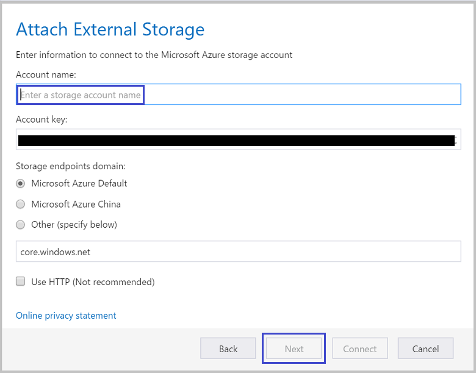

<properties 
    pageTitle="Spostare i dati nel e dall'archivio Blob Azure tramite Esplora archivi Azure | Microsoft Azure" 
    description="Spostare i dati nel e dall'archivio Blob Azure tramite Esplora archivi Azure" 
    services="machine-learning,storage" 
    documentationCenter="" 
    authors="bradsev" 
    manager="jhubbard" 
    editor="cgronlun" />

<tags 
    ms.service="machine-learning" 
    ms.workload="data-services" 
    ms.tgt_pltfrm="na" 
    ms.devlang="na" 
    ms.topic="article" 
    ms.date="08/31/2016"
    ms.author="bradsev" />

# Spostare i dati nel e dall'archivio Blob Azure tramite Esplora archivi Azure

Esplora archivi Azure è uno strumento gratuito di Microsoft che consente di utilizzare i dati di Azure lo spazio di archiviazione in Windows, Mac OS e Linux. In questo argomento viene illustrato come utilizzare per caricare e scaricare i dati da archiviazione blob Azure. Lo strumento può essere scaricato da [Microsoft Azure archiviazione Explorer](http://storageexplorer.com/).

Indicazioni sulle tecnologie utilizzati per spostare i dati a e/o dallo spazio di archiviazione Blob Azure sono collegati qui:
 
[AZURE.INCLUDE [blob-storage-tool-selector](../../includes/machine-learning-blob-storage-tool-selector.md)]   

 
> [AZURE.NOTE] Se si utilizza macchine Virtuali che è stata impostata con gli script di [macchine virtuali di scienze di dati di Azure](machine-learning-data-science-virtual-machines.md), Esplora archivi Azure è già installato nella macchina virtuale.
 
> [AZURE.NOTE] Per un'introduzione completa a archiviazione blob Azure, vedere [Nozioni fondamentali su Blob Azure](../storage/storage-dotnet-how-to-use-blobs.md) e [Servizio Blob Azure](https://msdn.microsoft.com/library/azure/dd179376.aspx).   

## Prerequisiti

In questo documento si presuppone che si dispone di un abbonamento a Azure, un account di archiviazione e la chiave di spazio di archiviazione corrispondente per l'account. Prima di caricamento/download dei dati, è necessario conoscere la chiave account e nome account Azure dello spazio di archiviazione. 

- Per configurare un abbonamento a Azure, vedere [versione di valutazione gratuita di un mese](https://azure.microsoft.com/pricing/free-trial/).
- Per istruzioni sulla creazione di un account di archiviazione e per ottenere informazioni chiave e account, vedere [gli account di archiviazione su Azure](../storage/storage-create-storage-account.md). Annotare il tasto di scelta per l'account di archiviazione in base alle esigenze questo tasto per connettersi all'account con lo strumento Esplora archivi Azure.
- Lo strumento Esplora archivi Azure può essere scaricato da [Microsoft Azure archiviazione Explorer](http://storageexplorer.com/). Accettare le impostazioni predefinite durante l'installazione.

## Utilizzare Esplora archivi Azure 

La procedura seguente del documento come di caricare e scaricare dati tramite Esplora archivi Azure. 

1.  Avviare Esplora archivi Microsoft Azure.
2.  Per visualizzare la procedura guidata **accedere al proprio account...** , selezionare l'icona **impostazioni dell'account Azure** e quindi **aggiungere un account** e immettere le credenziali. 
3.  Per visualizzare la procedura guidata di **connettersi a archiviazione Azure** , selezionare l'icona di **connettersi a archiviazione Azure** . 
4. Immettere il tasto di scelta dall'account di archiviazione Azure la procedura guidata di **connettersi a archiviazione Azure** , quindi scegliere **Avanti**. 
5. Immettere il nome di account di archiviazione nella casella **nome Account** e quindi selezionare **Avanti**. 
6. Aggiungere l'account di archiviazione a questo punto dovrebbe essere elencato. Per creare un contenitore di blob in un account di archiviazione, rapida nodo **Contenitori Blob** in quell'account, selezionare **Crea contenitore Blob**e immettere un nome.
7. Per caricare dati in un contenitore, selezionare il contenitore di destinazione e fare clic sul pulsante **Carica** .
8. Fare clic su **...** a destra della casella **file** , selezionare uno o più file da caricare dal file system e fare clic su **Carica** per iniziare a caricare i file.
7. Per scaricare i dati, selezionare il blob nel contenitore corrispondente per scaricare e fare clic su **Scarica**. 

