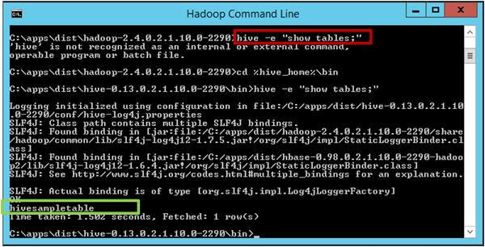

<properties
    pageTitle="Creare e caricare i dati in tabelle Hive dallo spazio di archiviazione Blob | Microsoft Azure"
    description="Creare tabelle Hive e caricare dati BLOB a hive tabelle"
    services="machine-learning,storage"
    documentationCenter=""
    authors="bradsev"
    manager="jhubbard"
    editor="cgronlun" />

<tags
    ms.service="machine-learning"
    ms.workload="data-services"
    ms.tgt_pltfrm="na"
    ms.devlang="na"
    ms.topic="article"
    ms.date="09/14/2016"
    ms.author="bradsev" />

#Creare e caricare i dati in tabelle Hive dallo spazio di archiviazione blob Azure

In questo argomento presenta generica query Hive che creare tabelle Hive e caricare dati dallo spazio di archiviazione blob Azure. Alcune indicazioni sono inoltre disponibili sulla suddivisione Hive tabelle e sull'utilizzo ottimizzato riga colonne (ORCO) la formattazione per migliorare le prestazioni delle query.

Questo **menu** fornisce collegamenti ad argomenti che descrivono come l'acquisizione di dati in ambienti di destinazione in cui i dati vengono memorizzati e durante il processo di scienza dati (TDSP) del Team, di elaborazione.

[AZURE.INCLUDE [cap-ingest-data-selector](../../includes/cap-ingest-data-selector.md)]

## Prerequisiti
In questo articolo si presuppone che sia:

* Creare un account di archiviazione Azure. Se è necessario istruzioni, vedere [gli account di archiviazione su Azure](../storage/storage-create-storage-account.md). 
* Il provisioning di un cluster Hadoop personalizzato con il servizio HDInsight.  Se è necessario istruzioni, vedere [personalizzare Azure HDInsight Hadoop cluster per analitica avanzate](machine-learning-data-science-customize-hadoop-cluster.md).
* Enabled accesso remoto al cluster, aprire la console della riga di comando Hadoop eseguito l'accesso. Se è necessario istruzioni, vedere [accesso Hadoop Cluster testa nodi](machine-learning-data-science-customize-hadoop-cluster.md#headnode).

## Caricare dati in archiviazione blob Azure
Se è stato creato una macchina virtuale Azure seguendo le istruzioni fornite in [configurare una macchina virtuale Azure per analitica avanzate](machine-learning-data-science-setup-virtual-machine.md), il file di script deve sono stato scaricato per il *c:\\utenti\\\<nome utente\>\\documenti\\dati scienza script* directory sul computer virtuale. Queste query Hive richiedono solo di collegare il proprio schema dei dati e configurazione di archiviazione blob Azure nei campi appropriati sia pronto per l'invio.

Si presuppone che i dati relativi a tabelle Hive in un formato tabulare **non compresso** , e che i dati sono stati caricati le impostazioni predefinite (o a un'ulteriore) contenitore dell'account di archiviazione utilizzata dal cluster Hadoop.

Se si vuole esercitazione **Roma Taxi di andata e ritorno dati**, è necessario:

- **scaricare** il 24 Roma Taxi di andata e ritorno i file di [Dati](http://www.andresmh.com/nyctaxitrips) (12 viaggio e file 12 file tariffa)
- **decomprimere** tutti i file nel file CSV e quindi
- **caricare** loro di predefinita (o contenitore appropriato) dell'account di archiviazione Azure che è stato creato con la procedura delineata da un argomento [cluster personalizzare Azure HDInsight Hadoop avanzate processo Analitica e tecnologia](machine-learning-data-science-customize-hadoop-cluster.md) . La procedura per caricare i file con estensione csv contenitore predefinito per l'account di archiviazione sono disponibili in questa [pagina](machine-learning-data-science-process-hive-walkthrough.md#upload).

## Come inviare query Hive

Query hive possono essere inviate tramite:

1. [Inviare Hive query tramite riga di comando di Hadoop in headnode di Hadoop cluster](#headnode)
2. [Inviare le query Hive con l'Editor Hive](#hive-editor)
3. [Inviare le query Hive con i comandi di PowerShell di Azure](#ps)

Le query hive sono simili a SQL. Se si ha familiarità con SQL, potrebbero risultare [Hive SQL utenti irregolarità foglio](http://hortonworks.com/wp-content/uploads/2013/05/hql_cheat_sheet.pdf) utili.

Quando si invia una query Hive, è possibile controllarne la destinazione di output dalla query Hive, che può essere sullo schermo, a un file locale sul nodo principale o a un archivio blob Azure.

###1. inviare le query Hive tramite riga di comando di Hadoop headnode di Hadoop cluster

Se la query Hive complessa, inviarla direttamente nel nodo principale della Hadoop cluster in genere dei clienti potenziali per ruotare più velocemente rispetto a inviarla con gli script di PowerShell Azure o Hive Editor.

Accedere a nodo principale del cluster Hadoop, aprire la riga di comando Hadoop sul desktop del nodo principale e immettere comando `cd %hive_home%\bin`.

Sono tre modi per inviare query Hive nella riga di comando Hadoop:

* direttamente
* utilizzo dei file .hql
* con la console di comando Hive

#### Inviare le query Hive direttamente in Hadoop riga di comando.

È possibile eseguire comando come `hive -e "<your hive query>;` per inviare query Hive semplici direttamente in Hadoop riga di comando. Ecco un esempio, in cui il riquadro rosso illustra il comando per l'invio di query Hive e la casella verde illustra l'output dalla query Hive.

#### Inviare le query Hive .hql dei file

Quando la query Hive è più complicata e si dispone di più linee, la modifica delle query nella riga di comando o console dei comandi Hive non è pratica. In alternativa consiste nell'usare un editor di testo in nodo principale del cluster Hadoop per salvare la query Hive in un file .hql in una directory locale del nodo principale. Quindi la query Hive nel file .hql può essere inviata tramite il `-f` argomento nel modo seguente:

    hive -f "<path to the .hql file>"

**Eliminare stampa schermo dello stato di avanzamento delle query Hive**

Per impostazione predefinita, dopo Hive query viene inviata nella riga di comando di Hadoop lo stato di avanzamento del processo di mapping e riduzione viene stampato sullo schermo. Per eliminare la stampa di schermata sullo stato di avanzamento di lavoro mapping e riduzione, è possibile utilizzare un argomento `-S` ("S" in maiuscolo) nel comando riga come indicato di seguito:

    hive -S -f "<path to the .hql file>"
    hive -S -e "<Hive queries>"

#### Inviare le query Hive nella console di comando Hive.

È possibile immettere anche prima di tutto la console dei comandi Hive eseguendo comando `hive` nella riga di comando di Hadoop e quindi inviare query Hive nella console di comando Hive. Ecco un esempio. In questo esempio, le due caselle di colore rosse evidenziare i comandi utilizzati per accedere alla console di comando Hive e la query Hive inviato nella console di comando Hive, rispettivamente. La casella verde evidenzia l'output dalla query Hive.

Negli esempi precedenti output direttamente i risultati della query Hive sullo schermo. È inoltre possibile scrivere l'output in un file locale sul nodo principale o a un archivio blob Azure. Quindi, è possibile usare altri strumenti per analizzare ulteriormente l'output della query Hive.

**Output Hive risultati della query in un file locale.**

Per restituire i risultati della query Hive a una directory locale sul nodo principale, è necessario eseguire la query Hive nella riga di comando Hadoop come indicato di seguito:

    hive -e "<hive query>" > <local path in the head node>

Nell'esempio seguente l'output della query Hive viene scritto in un file `hivequeryoutput.txt` nella directory `C:\apps\temp`.

**Risultati della query Hive output a un archivio blob Azure**

È anche possibile produrre risultati della query Hive a un archivio blob Azure, all'interno del contenitore predefinito del cluster Hadoop. La query Hive per questo è il seguente:

    insert overwrite directory wasb:///<directory within the default container> <select clause from ...>

Nell'esempio seguente l'output della query Hive scritto in una directory blob `queryoutputdir` all'interno del contenitore predefinito del cluster Hadoop. In questo caso, è sufficiente fornire il nome della directory, senza nome blob. Se si forniscono i nomi di directory e blob, ad esempio, viene generato un errore `wasb:///queryoutputdir/queryoutput.txt`.

Se si apre il contenitore predefinito del cluster Hadoop tramite Esplora archivi Azure, è possibile visualizzare l'output della query Hive come illustrato nella figura seguente. È possibile applicare il filtro (evidenziato da un riquadro rosso) per recuperare solo blob con lettere specificate nei nomi.

###2. inviare query Hive con l'Editor Hive

È inoltre possibile utilizzare la Console di Query (Hive Editor) tramite l'immissione di un URL del modulo *https://&#60; Nome cluster Hadoop >.azurehdinsight.net/Home/HiveEditor* in un web browser. È necessario essere connessi in vedere questa console e pertanto è necessario le credenziali di cluster di Hadoop.

###3. inviare query Hive con i comandi di PowerShell di Azure

È anche possibile usare PowerShell per inviare query Hive. Per ulteriori informazioni, vedere [inviare Hive processi tramite PowerShell](../hdinsight/hdinsight-submit-hadoop-jobs-programmatically.md#hive-powershell).

## Creare tabelle e database Hive

Le query Hive condiviso [Github repository](https://github.com/Azure/Azure-MachineLearning-DataScience/tree/master/Misc/DataScienceProcess/DataScienceScripts/sample_hive_create_db_tbls_load_data_generic.hql) e possono essere scaricate da tale posizione.

Ecco la query Hive che crea una tabella Hive.

    create database if not exists <database name>;
    CREATE EXTERNAL TABLE if not exists <database name>.<table name>
    (
        field1 string,
        field2 int,
        field3 float,
        field4 double,
        ...,
        fieldN string
    )
    ROW FORMAT DELIMITED FIELDS TERMINATED BY '<field separator>' lines terminated by '<line separator>'
    STORED AS TEXTFILE LOCATION '<storage location>' TBLPROPERTIES("skip.header.line.count"="1");

Ecco le descrizioni dei campi che è necessario collegare e altre configurazioni:

- **& #60; nome database >**: il nome del database che si desidera creare. Se si desidera utilizzare il database predefinito, è possibile omettere la query *creare database...* .
- **& #60; nome tabella >**: il nome della tabella nella quale si desidera creare nel database specificato. Se si desidera utilizzare il database predefinito, la tabella può fare riferimento direttamente da *& #60; nome tabella >* senza & #60; nome database >.
- **& #60; separatore di campo >**: il separatore che delimita campi nel file di dati per il caricamento della tabella Hive.
- **& #60; separatore di riga >**: il separatore che delimita righe nel file di dati.
- **& #60; posizione di archiviazione >**: la posizione di archiviazione Azure per salvare i dati delle tabelle Hive. Se non si specifica *posizione & #60; posizione di archiviazione >*, il database e le tabelle sono archiviate in *hive/warehouse/* directory nel contenitore predefinito del cluster Hive per impostazione predefinita. Se si desidera specificare la posizione di archiviazione, la posizione di archiviazione deve essere all'interno del contenitore predefinito per il database e le tabelle. Questo percorso deve fare riferimento come posizione rispetto al contenitore predefinito del cluster nel formato di *' wasb: / / / & #60; directory 1 > /'* o *' wasb: / / / & #60; directory 1 > / & #60; directory 2 > /'*e così via. Dopo l'esecuzione della query, vengono create le directory relativa all'interno del contenitore predefinito.
- **TBLPROPERTIES("Skip.Header.Line.Count"="1")**: se il file di dati da una riga di intestazione, è necessario aggiungere questa proprietà **alla fine** della query di *creazione tabella* . In caso contrario, la riga di intestazione viene caricata come un record alla tabella. Se il file di dati non dispone di una riga di intestazione, è possibile omettere questa configurazione nella query.

## Caricare i dati in tabelle Hive
Ecco la query Hive che carica i dati in una tabella Hive.

    LOAD DATA INPATH '<path to blob data>' INTO TABLE <database name>.<table name>;

- **& #60; percorso dati blob >**: se il file di archivio blob da caricare alla tabella Hive nel contenitore predefinito del cluster HDInsight Hadoop il *& #60; percorso dati blob >* deve essere nel formato *' wasb: / / / & #60; directory in questo contenitore > / & #60; nome del file blob >'*. Il file di archivio blob può essere anche in un contenitore aggiuntivo del cluster HDInsight Hadoop. In questo caso, *& #60; percorso dati blob >* deve essere nel formato *' wasb: / / & #60; contenitore name>@&#60;storage nome account >.blob.core.windows.net/ & #60; nome del file blob >'*.

    >[AZURE.NOTE] I dati blob da caricare tabella Hive deve essere nel contenitore aggiuntive dell'account di archiviazione per il cluster Hadoop o predefinito. In caso contrario, la query di *Dati di caricamento* non riesce lamentano che è possibile accedere ai dati.

## Argomenti avanzati: suddiviso tabella e archivio dati Hive nel formato ORCO

Se i dati sono grandi, partizione la tabella è utile per le query che solo necessario eseguire la scansione alcuni partizioni della tabella. Ad esempio, è opportuno dividere i dati del Registro di un sito web date.

Oltre a partizioni Hive tabelle, è inoltre opportuno archiviare i dati Hive nel formato ottimizzato riga colonne (ORCO). Per ulteriori informazioni sulla formattazione ORCO, vedere <a href="https://cwiki.apache.org/confluence/display/Hive/LanguageManual+ORC#LanguageManualORC-ORCFiles" target="_blank">i file usando ORCO migliora le prestazioni quando Hive di lettura, scrittura e l'elaborazione dei dati</a>.

### Tabella partizionata
Ecco la query Hive che crea una tabella partizionata e carica i dati al suo interno.

    CREATE EXTERNAL TABLE IF NOT EXISTS <database name>.<table name>
    (field1 string,
    ...
    fieldN string
    )
    PARTITIONED BY (<partitionfieldname> vartype) ROW FORMAT DELIMITED FIELDS TERMINATED BY '<field separator>'
         lines terminated by '<line separator>' TBLPROPERTIES("skip.header.line.count"="1");
    LOAD DATA INPATH '<path to the source file>' INTO TABLE <database name>.<partitioned table name>
        PARTITION (<partitionfieldname>=<partitionfieldvalue>);

Quando si eseguono query tabelle partizionate, è consigliabile aggiungere la condizione partizione all' **inizio** della `where` clausola come questa migliora l'efficacia della ricerca in modo significativo.

    select
        field1, field2, ..., fieldN
    from <database name>.<partitioned table name>
    where <partitionfieldname>=<partitionfieldvalue> and ...;

### Archiviare i dati Hive nel formato ORCO

Non è possibile caricare direttamente dati dallo spazio di archiviazione blob all'interno di tabelle Hive archiviati nel formato ORCO. Di seguito viene indicato che il necessario per caricare dati da Azure BLOB alle tabelle Hive memorizzate in formato ORCO.

Creare un tabella esterna **ARCHIVIATI file di testo come** e caricare i dati dallo spazio di archiviazione blob alla tabella.

        CREATE EXTERNAL TABLE IF NOT EXISTS <database name>.<external textfile table name>
        (
            field1 string,
            field2 int,
            ...
            fieldN date
        )
        ROW FORMAT DELIMITED FIELDS TERMINATED BY '<field separator>'
            lines terminated by '<line separator>' STORED AS TEXTFILE
            LOCATION 'wasb:///<directory in Azure blob>' TBLPROPERTIES("skip.header.line.count"="1");

        LOAD DATA INPATH '<path to the source file>' INTO TABLE <database name>.<table name>;

Creare una tabella interna con lo stesso schema di tabelle esterne nel passaggio 1, con lo stesso delimitatore e archiviare i dati Hive nel formato ORCO.

        CREATE TABLE IF NOT EXISTS <database name>.<ORC table name>
        (
            field1 string,
            field2 int,
            ...
            fieldN date
        )
        ROW FORMAT DELIMITED FIELDS TERMINATED BY '<field separator>' STORED AS ORC;

Selezionare i dati dalla tabella esterna nel passaggio 1 e inserire la tabella ORCO

        INSERT OVERWRITE TABLE <database name>.<ORC table name>
            SELECT * FROM <database name>.<external textfile table name>;

>[AZURE.NOTE] Se la tabella di file di testo *& #60; nome database >. & #60; esterni file di testo Nome della tabella >* sono partizioni, nel passaggio 3, la `SELECT * FROM <database name>.<external textfile table name>` comando Seleziona variabile partizione come un campo nel set di dati restituiti. Inserendo il *& #60; nome database >. & #60; nome della tabella ORCO >* ha esito negativo dal *& #60; nome database >. & #60; nome della tabella ORCO >* non hanno la variabile partizione con un campo nello schema della tabella. In questo caso, è necessario specificamente selezionare i campi da inserire per *& #60; nome database >. & #60; nome della tabella ORCO >* come indicato di seguito:

        INSERT OVERWRITE TABLE <database name>.<ORC table name> PARTITION (<partition variable>=<partition value>)
           SELECT field1, field2, ..., fieldN
           FROM <database name>.<external textfile table name>
           WHERE <partition variable>=<partition value>;

È consigliabile rilasciare il *& #60; esterni file di testo Nome della tabella >* quando la query seguente eseguito tutti i dati in uso è stato inserito in *& #60; nome database >. & #60; nome della tabella ORCO >*:

        DROP TABLE IF EXISTS <database name>.<external textfile table name>;

Al termine della procedura, è una tabella con i dati nel formato ORCO pronto per l'utilizzo.  
