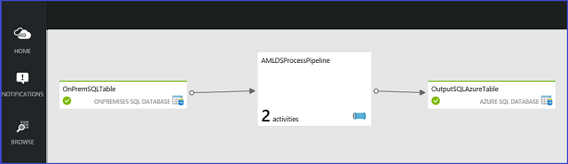

<properties
    pageTitle="Spostare dati da un Server SQL locale in SQL Azure con Azure Data Factory | Azure"
    description="Configurare una pipeline di alimentatore automatico che compone due attività di migrazione di dati che insieme spostare i dati su base giornaliera tra database locale e nel cloud."
    services="machine-learning"
    documentationCenter=""
    authors="bradsev"
    manager="jhubbard"
    editor="cgronlun" />

<tags
    ms.service="machine-learning"
    ms.workload="data-services"
    ms.tgt_pltfrm="na"
    ms.devlang="na"
    ms.topic="article"
    ms.date="09/14/2016"
    ms.author="bradsev" />

# Spostare dati da un server SQL locale in SQL Azure con Azure Data Factory

In questo argomento viene illustrato come spostare i dati da un Database di SQL Server locale a un Database di SQL Azure tramite archiviazione Blob Azure tramite il produttore di dati Azure (alimentatore automatico).

I collegamenti seguenti **menu** ad argomenti che descrivono come l'acquisizione di dati in ambienti di destinazione in cui i dati vengono memorizzati ed elaborati durante il processo di scienze di dati del Team.

[AZURE.INCLUDE [cap-ingest-data-selector](../../includes/cap-ingest-data-selector.md)]

## Introduzione: Che cos'è alimentatore automatico e quando deve essere utilizzato per eseguire la migrazione dei dati?

Azure Data Factory è un servizio di integrazione completamente gestita dati basate su cloud che coordina e consente di automatizzare lo spostamento e trasformazione dei dati. Il concetto chiave nel modello di alimentatore automatico è pipeline. Una pipeline è un raggruppamento logico delle attività, ognuno dei quali consente di definire le azioni da eseguire sui dati contenuti nel set di dati. Servizi collegati vengono utilizzati per definire le informazioni necessarie per Factory dati a cui connettersi le risorse dati.

Con alimentatore automatico, servizi di elaborazione dei dati esistenti possono essere composti nella pipeline di dati che sono altamente disponibili e gestito nel cloud. Questi pipeline di dati possono essere pianificate per il caricamento, preparare, trasformazione, analizzare e pubblicare i dati e alimentatore automatico gestisce e di orchestrare le dipendenze di elaborazione e dati complessi. Soluzioni possono essere rapidamente integrate e distribuite nel cloud, la connessione di un numero crescente di locali e cloud origini dati.

È consigliabile utilizzare alimentatore automatico:

- Quando i dati devono essere continuamente eseguita in uno scenario ibrido per accedere alle risorse locali e cloud 
- Quando i dati viene gestiti o devono essere modificate o una regola di business aggiunto quando viene eseguita la migrazione. 

Consente di alimentatore automatico per la pianificazione e il monitoraggio dei processi utilizzando semplici script JSON che gestiscono lo spostamento dei dati periodicamente. Alimentatore automatico è installato anche altre funzionalità, ad esempio il supporto per operazioni complesse. Per ulteriori informazioni sull'alimentatore automatico, vedere la documentazione su [Azure dati Factory (alimentatore automatico)](https://azure.microsoft.com/services/data-factory/).

## Lo Scenario

È necessario impostare una pipeline di alimentatore automatico che compone due attività di migrazione di dati. Insieme si muova dati su base giornaliera tra un database SQL in locale e un Database di SQL Azure nel cloud. Le due attività sono:

* copiare i dati da un database di SQL Server locale a un account di archiviazione Blob Azure
* copiare i dati dell'account di archiviazione Blob Azure a un Database di SQL Azure.

>[AZURE.NOTE] I passaggi illustrati di seguito sono state adattate da esercitazione più dettagliata fornita dal team alimentatore automatico: [spostare i dati tra origini locali e cloud con Gateway di gestione dati](../data-factory/data-factory-move-data-between-onprem-and-cloud.md) riferimenti le sezioni pertinenti di questo argomento vengono forniti quando appropriato.

## Prerequisiti
In questa esercitazione si suppone che:

* Un **abbonamento Azure**. Se non si dispone di una sottoscrizione, è possibile iscriversi per una [versione di valutazione gratuita](https://azure.microsoft.com/pricing/free-trial/).
* Un **account di archiviazione Azure**. Si utilizza un account di archiviazione Azure per archiviare i dati in questa esercitazione. Se non si dispone di un account di archiviazione Azure, vedere l'articolo [creare un account di archiviazione](storage-create-storage-account.md#create-a-storage-account) . Dopo aver creato l'account di archiviazione, è necessario ottenere la chiave account usata per accedere allo spazio di archiviazione. Vedere [visualizzazione, copia e lo spazio di archiviazione rigenera i tasti di scelta](storage-create-storage-account.md#view-copy-and-regenerate-storage-access-keys).
* Accesso a un **Database SQL Azure**. Se è necessario impostare un Database di SQL Azure, tpoic [Guida introduttiva di Database SQL di Microsoft Azure](../sql-database/sql-database-get-started.md) fornisce informazioni su come effettuare il provisioning di una nuova istanza di un Database di SQL Azure.
* Installato e configurato **Azure PowerShell** in locale. Per ulteriori informazioni, vedere [come installare e configurare Azure PowerShell](../powershell-install-configure.md).

> [AZURE.NOTE] Questa procedura viene utilizzato il [portale di Azure](https://portal.azure.com/).

##Caricare i dati in SQL Server in locale

Serve [Roma Taxi set di dati](http://chriswhong.com/open-data/foil_nyc_taxi/) per illustrare il processo di migrazione. Il set di dati Taxi Roma è disponibile, come indicato in post su Azure blob lo spazio di archiviazione [Dati Taxi Roma](http://www.andresmh.com/nyctaxitrips/). I dati sono due file, il file trip_data.csv, che contiene i dettagli di andata e ritorno, e il file trip_far.csv, che contiene i dettagli della tariffa pagata per ogni viaggio. Un esempio e una descrizione di questi file vengono fornite in [Roma Taxi trip set di dati descrizione](machine-learning-data-science-process-sql-walkthrough.md#dataset).

È possibile adattare la procedura di seguito per un set di dati personalizzati o seguire i passaggi come descritto utilizzando il set di dati Taxi Roma. Per caricare il set di dati Taxi Roma nel database di SQL Server in locale, seguire la procedura descritta in [Blocco Importa dati nel Database di SQL Server](machine-learning-data-science-process-sql-walkthrough.md#dbload). Queste istruzioni siano relativi a SQL Server una macchina virtuale Azure, ma la procedura per il caricamento in SQL Server locale è la stessa.

##Creare una Factory di dati di Azure

Le istruzioni per la creazione di una nuova Factory di dati di Azure e un gruppo di risorse nel [portale di Azure](https://portal.azure.com/) sono fornite [Crea una Factory di dati di Azure](../data-factory/data-factory-build-your-first-pipeline-using-editor.md#step-1-creating-the-data-factory). Nome nuovo di istanza alimentatore automatico *adfdsp* e il nome di gruppo creato la risorsa *adfdsprg*.

## Installazione e configurazione di Gateway di gestione dati

Per abilitare la pipeline di una factory di dati di Azure per lavorare con un Server SQL locale, è necessario aggiungerlo come servizio collegata al produttore dati. Per creare un servizio collegata per un SQL Server in locale, è necessario:

- scaricare e installare il Gateway di gestione dati Microsoft al computer locale. 
- configurare il servizio collegato per l'origine dati locale come utilizzare il gateway. 

Il Gateway di gestione dati serializza e deserializza dati di origine e sink nel computer in cui si trova.

Per istruzioni di configurazione e informazioni dettagliate su Gateway di gestione dati, vedere [spostare dati tra origini locali e cloud con Gateway di gestione dati](../data-factory/data-factory-move-data-between-onprem-and-cloud.md)

## Creazione di servizi collegati a connettersi alle risorse di dati

Un servizio collegato definisce le informazioni necessarie per Azure Data Factory per connettersi a una risorsa di dati. La procedura dettagliata per la creazione di servizi collegati, vedere [creare servizi collegati](../data-factory/data-factory-move-data-between-onprem-and-cloud.md#step-2-create-linked-services).

Sono disponibili tre risorse in questo scenario per il quale sono necessari servizi collegati.

1. [Servizi collegati per SQL Server in locale](#adf-linked-service-onprem-sql)
2. [Servizi collegati per archiviazione Blob Azure](#adf-linked-service-blob-store)
3. [Servizi collegati per database SQL Azure](#adf-linked-service-azure-sql)

###Servizi collegati per database di SQL Server in locale

Per creare il servizio collegato per SQL Server in locale:

- Fare clic su **Archivio dati** nella pagina di destinazione alimentatore automatico nel portale classica Azure 
- Selezionare **SQL** e immettere le credenziali *utente* e *password* per SQL Server locale. È necessario immettere il nome server come un **nome di istanza nomeserver barra rovesciata (nomeserver\nomeistanza) completo**. Assegnare un nome di servizi collegati *adfonpremsql*.

###Servizio collegato Blob

Per creare il servizio collegato per l'account di archiviazione Blob Azure:

- Fare clic su **Archivio dati** nella pagina di destinazione alimentatore automatico nel portale classica Azure
- Selezionare **l'Account di archiviazione di Azure** 
- Immettere il nome di chiave e contenitore account archiviazione Blob Azure. Assegnare un nome di servizi collegati *adfds*.

###Servizi collegati per database SQL Azure

Per creare il servizio collegato per il Database di SQL Azure:

- Fare clic su **Archivio dati** nella pagina di destinazione alimentatore automatico nel portale classica Azure
- Selezionare **SQL Azure** e immettere le credenziali *utente* e *password* per il Database di SQL Azure. *Nome utente* deve essere specificato come *user@servername*.   

##Definire e creare tabelle per specificare come accedere i set di dati

Creare tabelle che specificano la struttura, posizione e la disponibilità di set di dati con le procedure seguenti basate su script. File JSON vengono utilizzati per definire le tabelle. Per ulteriori informazioni sulla struttura di questi file, vedere [set di dati](../data-factory/data-factory-create-datasets.md).

> [AZURE.NOTE]  È necessario eseguire il `Add-AzureAccount` cmdlet prima di eseguire il cmdlet [New-AzureDataFactoryTable](https://msdn.microsoft.com/library/azure/dn835096.aspx) per verificare che l'abbonamento a destra Azure sia selezionata per l'esecuzione del comando. Per la documentazione di questo cmdlet, vedere [Aggiungere AzureAccount](https://msdn.microsoft.com/library/azure/dn790372.aspx).

Le definizioni di base JSON nelle tabelle utilizzano i nomi seguenti:

* il **nome della tabella** di SQL server locale è *nyctaxi_data*
* il **nome del contenitore** nella finestra account di archiviazione Blob Azure è *nomecontenitore*  

Tre definizioni di tabella sono necessari per questa pipeline alimentatore automatico:

1. [Tabella SQL in locale](#adf-table-onprem-sql)
2. [Tabella BLOB](#adf-table-blob-store)
3. [SQL Azure tabella](#adf-table-azure-sql)

> [AZURE.NOTE]  Queste procedure utilizzano Azure PowerShell per definire e creare attività alimentatore automatico. Ma queste operazioni possono essere effettuate anche tramite il portale di Azure. Per informazioni dettagliate, vedere [creare input e output set di dati](../data-factory/data-factory-move-data-between-onprem-and-cloud.md#step-3-create-input-and-output-datasets).

###Tabella SQL in locale

La definizione della tabella di SQL Server locale è specificata nel file di JSON seguente:

        {
            "name": "OnPremSQLTable",
            "properties":
            {
                "location":
                {
                "type": "OnPremisesSqlServerTableLocation",
                "tableName": "nyctaxi_data",
                "linkedServiceName": "adfonpremsql"
                },
                "availability":
                {
                "frequency": "Day",
                "interval": 1,   
                "waitOnExternal":
                {
                "retryInterval": "00:01:00",
                "retryTimeout": "00:10:00",
                "maximumRetry": 3
                }

                }
            }
        }

Non sono inclusi i nomi delle colonne. È possibile selezionare secondari ai nomi di colonna includendo qui le (per il controllo dettagli argomento della [documentazione alimentatore automatico](../data-factory/data-factory-data-movement-activities.md ) .

Copiare la definizione di JSON della tabella in un file denominato *onpremtabledef.json* file e salvarlo in un percorso noto (di seguito si presuppone che sia *C:\temp\onpremtabledef.json*). Creare la tabella nell'alimentatore automatico con il seguente cmdlet di PowerShell Azure:

    New-AzureDataFactoryTable -ResourceGroupName ADFdsprg -DataFactoryName ADFdsp –File C:\temp\onpremtabledef.json

###Tabella BLOB
Definizione della tabella per la posizione di output blob è il seguente (associa i dati acquisiti da locale a blob Azure):

        {
            "name": "OutputBlobTable",
            "properties":
            {
                "location":
                {
                "type": "AzureBlobLocation",
                "folderPath": "containername",
                "format":
                {
                "type": "TextFormat",
                "columnDelimiter": "\t"
                },
                "linkedServiceName": "adfds"
                },
                "availability":
                {
                "frequency": "Day",
                "interval": 1
                }
            }
        }

Copiare la definizione di JSON della tabella in un file denominato *bloboutputtabledef.json* file e salvarlo in un percorso noto (di seguito si presuppone che sia *C:\temp\bloboutputtabledef.json*). Creare la tabella nell'alimentatore automatico con il seguente cmdlet di PowerShell Azure:

    New-AzureDataFactoryTable -ResourceGroupName adfdsprg -DataFactoryName adfdsp -File C:\temp\bloboutputtabledef.json  

###SQL Azure tabella
Definizione della tabella di SQL Azure output è il seguente (questo schema mappato i dati provenienti da blob):

    {
        "name": "OutputSQLAzureTable",
        "properties":
        {
            "structure":
            [
                { "name": "column1", type": "String"},
                { "name": "column2", type": "String"}                
            ],
            "location":
            {
                "type": "AzureSqlTableLocation",
                "tableName": "your_db_name",
                "linkedServiceName": "adfdssqlazure_linked_servicename"
            },
            "availability":
            {
                "frequency": "Day",
                "interval": 1            
            }
        }
    }

Copiare la definizione di JSON della tabella in un file denominato *AzureSqlTable.json* file e salvarlo in un percorso noto (di seguito si presuppone che sia *C:\temp\AzureSqlTable.json*). Creare la tabella nell'alimentatore automatico con il seguente cmdlet di PowerShell Azure:

    New-AzureDataFactoryTable -ResourceGroupName adfdsprg -DataFactoryName adfdsp -File C:\temp\AzureSqlTable.json  

##Definire e creare la pipeline

Specificare le attività che appartengono alla pipeline e creare la pipeline con le procedure seguenti basate su script. Per definire le proprietà della pipeline viene utilizzato un file JSON.

* Lo script presuppone che il **nome di pipeline** *AMLDSProcessPipeline*.
* Si noti inoltre che è impostata la frequenza della pipeline di essere eseguita su base giornaliera e usare il tempo di esecuzione predefinito per il processo (12 am UTC).

> [AZURE.NOTE]Le procedure seguenti utilizzano Azure PowerShell per definire e creare la pipeline di alimentatore automatico. Ma è inoltre possibile eseguire questa operazione tramite il portale di Azure. Per informazioni dettagliate, vedere [creare ed eseguire una pipeline](../data-factory/data-factory-move-data-between-onprem-and-cloud.md#step-4-create-and-run-a-pipeline).

Utilizzando le definizioni di tabella indicate in precedenza, la definizione della pipeline in modo viene specificata come indicato di seguito:

        {
            "name": "AMLDSProcessPipeline",
            "properties":
            {
                "description" : "This pipeline has one Copy activity that copies data from an on-premise SQL to Azure blob",
                 "activities":
                [
                    {
                        "name": "CopyFromSQLtoBlob",
                        "description": "Copy data from on-premise SQL server to blob",     
                        "type": "CopyActivity",
                        "inputs": [ {"name": "OnPremSQLTable"} ],
                        "outputs": [ {"name": "OutputBlobTable"} ],
                        "transformation":
                        {
                            "source":
                            {                               
                                "type": "SqlSource",
                                "sqlReaderQuery": "select * from nyctaxi_data"
                            },
                            "sink":
                            {
                                "type": "BlobSink"
                            }   
                        },
                        "Policy":
                        {
                            "concurrency": 3,
                            "executionPriorityOrder": "NewestFirst",
                            "style": "StartOfInterval",
                            "retry": 0,
                            "timeout": "01:00:00"
                        }       

                     },

                    {
                        "name": "CopyFromBlobtoSQLAzure",
                        "description": "Push data to Sql Azure",        
                        "type": "CopyActivity",
                        "inputs": [ {"name": "OutputBlobTable"} ],
                        "outputs": [ {"name": "OutputSQLAzureTable"} ],
                        "transformation":
                        {
                            "source":
                            {                               
                                "type": "BlobSource"
                            },
                            "sink":
                            {
                                "type": "SqlSink",
                                "WriteBatchTimeout": "00:5:00",             
                            }           
                        },
                        "Policy":
                        {
                            "concurrency": 3,
                            "executionPriorityOrder": "NewestFirst",
                            "style": "StartOfInterval",
                            "retry": 2,
                            "timeout": "02:00:00"
                        }
                     }
                ]
            }
        }

Copiare la definizione di JSON della pipeline di un file denominato *pipelinedef.json* file e salvarlo in un percorso noto (di seguito si presuppone che sia *C:\temp\pipelinedef.json*). Creare la pipeline nell'alimentatore automatico con il seguente cmdlet di PowerShell Azure:

    New-AzureDataFactoryPipeline  -ResourceGroupName adfdsprg -DataFactoryName adfdsp -File C:\temp\pipelinedef.json

Confermare che è possibile visualizzare la pipeline di in modo nel portale classica di Azure visualizzata come segue (quando si fa clic su diagramma)

##Avviare la Pipeline
È possibile eseguire la pipeline utilizzando il comando seguente:

    Set-AzureDataFactoryPipelineActivePeriod -ResourceGroupName ADFdsprg -DataFactoryName ADFdsp -StartDateTime startdateZ –EndDateTime enddateZ –Name AMLDSProcessPipeline

I valori di parametro *DataInizio* e *DataFine* devono essere sostituito con le date effettive tra i quali si desidera pipeline per l'esecuzione.

Una volta che viene eseguita la pipeline, dovrebbe essere possibile visualizzare i dati vengano visualizzate nel contenitore selezionato per il blob, un file per ogni giorno.

Si noti che è stato possibile non sfruttare le funzionalità offerte da alimentatore automatico ai dati di barra verticale in modo incrementale. Per ulteriori informazioni su come eseguire questa operazione e altre funzionalità fornite da alimentatore automatico, vedere la [documentazione alimentatore automatico](https://azure.microsoft.com/services/data-factory/).
