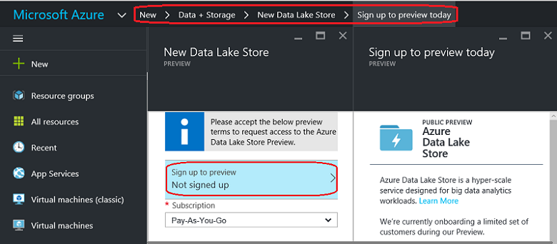
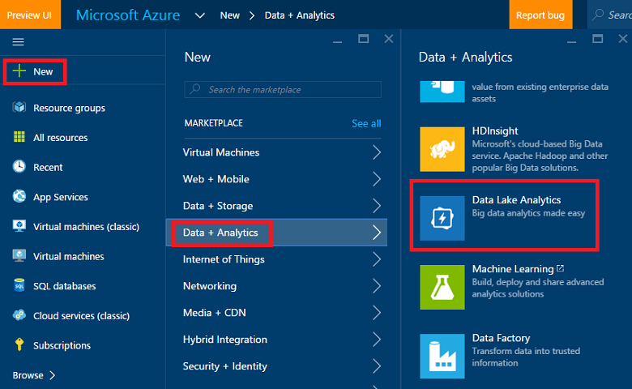
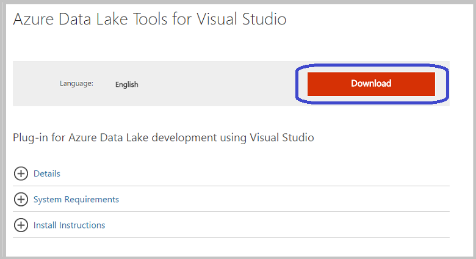
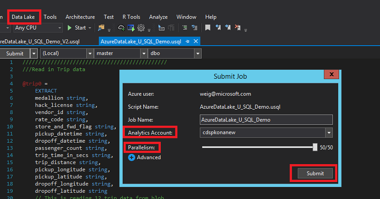
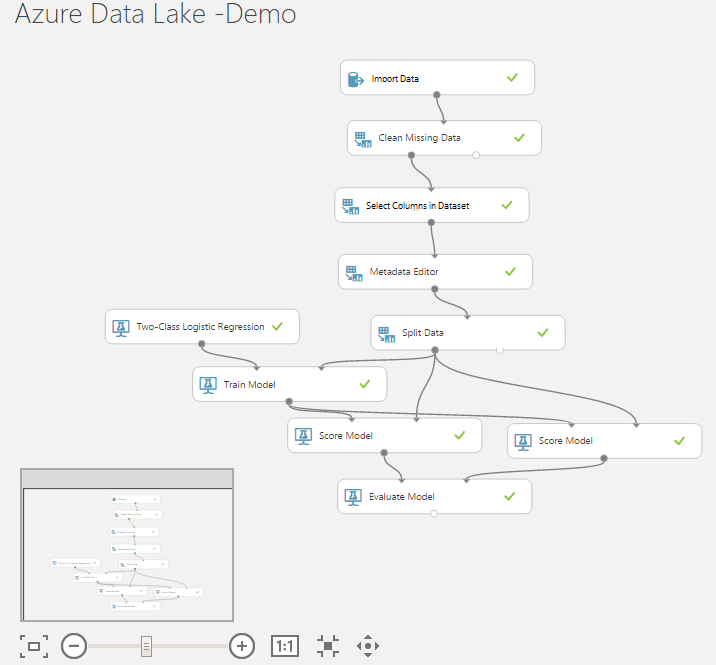

<properties
    pageTitle="Scalable scienza di dati di Azure dati Lake: una procedura dettagliata-to-end | Microsoft Azure"
    description="Informazioni su come usare Lake di dati di Azure per eseguire attività di classificazione di binario e l'esplorazione dei dati in un set di dati."  
    services="machine-learning"
    documentationCenter=""
    authors="bradsev"
    manager="jhubbard"
    editor="cgronlun" />

<tags
    ms.service="machine-learning"
    ms.workload="data-services"
    ms.tgt_pltfrm="na"
    ms.devlang="na"
    ms.topic="article"
    ms.date="09/19/2016"
    ms.author="bradsev;weig"/>

# Scalable scienza di dati di Azure dati Lake: una procedura dettagliata-to-end

In questa procedura dettagliata viene illustrato come utilizzare Lake di dati di Azure per eseguire attività di classificazione binarie un campione del viaggio taxi Roma e l'esplorazione dei dati e presentare i set di dati per la previsione o meno un suggerimento dovranno essere effettuato da una tariffa. Illustra i passaggi del [Processo di scienze dei dati del Team](http://aka.ms/datascienceprocess),-to-end, dall'acquisizione di dati alla formazione del modello e quindi alla distribuzione di un servizio web che pubblica il modello.

### Dati di Azure Lake Analitica

[Microsoft Azure dati Lake](https://azure.microsoft.com/solutions/data-lake/) include tutte le funzionalità necessarie per rendere più semplice per scienziati dati per archiviare i dati di qualsiasi dimensione, forma e la velocità ed eseguire l'elaborazione dei dati, analitica avanzate e apprendimento automatico modellazione con scalabilità un buon.   Pagando in base al processo, solo quando effettivamente elaborate. Azure dati Lake Analitica include U SQL, un linguaggio che unisce natura dichiarativa di SQL con la potenza di c# esplicativi per fornire scalable distribuito la funzionalità di query. Consente di elaborare dati non strutturati applicando schema in lettura, inserire la logica personalizzata e funzioni definite dall'utente (funzioni definite dall'utente) e include estensibilità per abilitare correttamente granulare controllo su come eseguire in scala. Per ulteriori informazioni sulla filosofia di progettazione U SQL, vedere [il blog di Visual Studio post](https://blogs.msdn.microsoft.com/visualstudio/2015/09/28/introducing-u-sql-a-language-that-makes-big-data-processing-easy/).

Dati Lake Analitica è anche cruciali della famiglia di prodotti Analitica Cortana e funziona con Data Warehouse di SQL Azure, Power BI e Factory dati. Si ottiene così una piattaforma di analitica avanzate e dati cloud completo.

In questa procedura dettagliata inizia da cui vengono descritti i prerequisiti e le risorse necessarie per completare le attività con dati Lake Analitica che costituiscono il processo di scienze dei dati e come installarli. Quindi vengono descritte le procedure di elaborazione dei dati utilizzando U SQL e si conclude viene mostrato come utilizzare Python e Hive con Azure Machine Learning Studio per creare e distribuire i modelli di previsione. 

### U-SQL e Visual Studio

In questa procedura dettagliata consiglia di utilizzare Visual Studio per modificare gli script SQL U per elaborare il set di dati. Gli script SQL U sono descritti di seguito e forniti in un file separato. Il processo include il caricamento, esplorare e campionamento i dati. Viene inoltre descritto come eseguire un processo U-SQL script dal portale di Azure. Hive tabelle vengono create per i dati in un cluster HDInsight associato per facilitare la creazione e la distribuzione di un modello di classificazione binario in Azure Machine Learning Studio.  

### Python

In questa procedura dettagliata contiene anche una sezione in cui viene illustrato come creare e distribuire un modello di stima usando Python con Azure Machine Learning Studio.  Viene fornito un blocco appunti Jupyter con gli script di Python per questa procedura in questa procedura. Il blocco appunti include codice per alcune funzionalità aggiuntiva ingegneristica passaggi e i modelli di costruzione, ad esempio la classificazione multiclass e regressione modellazione oltre il modello di classificazione binario descritto di seguito. L'attività di regressione è per stimare la quantità di suggerimento in base alle altre caratteristiche di suggerimento. 

### Apprendimento Azure
Azure Machine Learning Studio viene utilizzato per creare e distribuire i modelli di previsione. Questa operazione viene eseguita usando due metodi: prima di tutto con script Python quindi con Hive tabelle in un cluster di HDInsight (Hadoop).

### Script

Solo i passaggi principali sono illustrati in questa procedura dettagliata. È possibile scaricare l' intero **script SQL U** e **Blocco appunti Jupyter** da [GitHub](https://github.com/Azure/Azure-MachineLearning-DataScience/tree/master/Misc/AzureDataLakeWalkthrough).

## Prerequisiti

Prima di iniziare questi argomenti, è necessario disporre le operazioni seguenti:

- Un abbonamento Azure. Se non già presente, vedere [ottenere Azure versione di valutazione gratuita](https://azure.microsoft.com/documentation/videos/get-azure-free-trial-for-testing-hadoop-in-hdinsight/).

- (Scelta consigliata) Visual Studio 2013 oppure 2015. Se si dispone già una di queste versioni installate, è possibile scaricare una Community edition gratuita da [qui](https://www.visualstudio.com/visual-studio-homepage-vs.aspx). Fare clic sul pulsante **Scarica 2015 Community** nella sezione Visual Studio. 

>[AZURE.NOTE] Invece di Visual Studio, è possibile usare anche il portale di Azure per inviare query Lake di dati di Azure. Microsoft fornisce istruzioni su come eseguire questa operazione sia con Visual Studio e nel portale nella sezione **dati del processo con U-SQL**. 

- Iscrizione a dati di Azure Lake anteprima

>[AZURE.NOTE] È necessario ottenere l'approvazione a utilizzare Azure dati Lake Store (ADLS) e Azure dati Lake Analitica (ADLA) come questi servizi sono in anteprima. Verrà richiesto di effettuare l'iscrizione quando si crea la prima ADLS o ADLA. Sigh backup, fare clic su **iscriversi per visualizzare in anteprima**, leggere il contratto e fare clic su **OK**. In questo caso, ad esempio, è la pagina di iscrizione tramite ADLS:

 

## Preparare dati scienze ambiente per Lake di dati di Azure
Per preparare l'ambiente di scienze di dati per questa procedura dettagliata, creare le risorse seguenti:

- Archivio Lake dati di Azure (ADLS) 
- Dati di Azure Lake Analitica (ADLA)
- Account di archiviazione Blob Azure
- Account computer risorse Studio Azure
- Dati di Azure Lake Tools per Visual Studio (scelta consigliata)

In questa sezione fornisce istruzioni su come creare ognuna di esse. Se si sceglie di utilizzare tabelle Hive con apprendimento Azure, invece di Python, per creare un modello, è anche necessario effettuare il provisioning di un cluster di HDInsight (Hadoop). In questa procedura alternativa descritto nella sezione appropriata.
 
>AZURE. Si noti l' **Archivio Lake dati di Azure** è possibile creare separatamente o quando si creano **Azure dati Lake Analitica** come spazio di archiviazione predefinito. Istruzioni fanno riferimento per la creazione di ognuna di queste risorse separatamente di seguito, ma l'account di archiviazione dati Lake necessario non creato separatamente.
 
### Creare un archivio di Lake dati di Azure

Creare un ADLS dal [portale di Azure](http://portal.azure.com). Per informazioni dettagliate, vedere [creare un cluster di HDInsight con archivio Lake dati tramite il portale di Azure](../data-lake-store/data-lake-store-hdinsight-hadoop-use-portal.md). Assicurarsi di configurare l'identità di AAD Cluster in e il **DataSource** della stessa e **Facoltativi** sono descritti. 

 

### Creare un account Azure dati Lake Analitica
Creare un account ADLA dal [Portale di Azure](http://portal.azure.com). Per informazioni dettagliate, vedere [Esercitazione: Introduzione a Azure dati Lake Analitica nel portale di Azure](../data-lake-analytics/data-lake-analytics-get-started-portal.md). 

 

### Creare un account di archiviazione Blob Azure
Creare un account di archiviazione Blob Azure dal [Portale di Azure](http://portal.azure.com). Per informazioni dettagliate, vedere creare una sezione account lo spazio di archiviazione di [account di archiviazione su Azure](../storage/storage-create-storage-account.md).
    
 

### Configurare un account Azure Machine Learning Studio
Eseguire l'accesso verso l'alto o in Azure Machine Learning Studio dalla pagina [Apprendimento Azure](https://azure.microsoft.com/services/machine-learning/) . Fare clic sul pulsante **Inizia ora** e quindi scegliere "un gratuito area di lavoro" o "Standard". Al termine sarà possibile creare esperimenti in Azure ML Studio.  

### Installare gli strumenti Lake dati Azure (scelta consigliata)
Installare gli strumenti Lake di dati di Azure per la versione di Visual Studio da [Azure dati Lake Tools per Visual Studio](https://www.microsoft.com/download/details.aspx?id=49504).

 

Dopo l'installazione viene completata correttamente, aprire Visual Studio. Lake dati verrà visualizzato il menu nella parte superiore della scheda. Quando accedere all'account Azure, le risorse Azure dovrebbero essere visualizzate nel riquadro sinistro.

 

## Il set di dati di Roma Taxi viaggi
Il set di dati che è stato usato qui è un set di dati disponibile al pubblico, ossia il [set di dati Roma Taxi viaggi](http://www.andresmh.com/nyctaxitrips/). I dati di andata e ritorno Taxi Roma è costituito da circa 20GB di file CSV compressi (~ 48GB non compressi), viaggi singoli 173 milioni e le tariffe registrazioni pagato per ogni viaggio. Ogni record di andata e ritorno include posizioni ritiro e deposito e ora, numero di licenze hacker resi anonimi (driver) e il numero di medallion (id univoco del taxi). I dati copre viaggi nell'anno 2013 e viene forniti il set di dati di due seguenti per ogni mese:

 - 'trip_data' CSV contiene i dettagli di viaggio, ad esempio il numero di persone, ritiro e punti dropoff, la durata del viaggio e durata del viaggio. Di seguito sono riportati alcuni record di esempio:

        medallion,hack_license,vendor_id,rate_code,store_and_fwd_flag,pickup_datetime,dropoff_datetime,passenger_count, trip_time_in_secs,trip_distance,pickup_longitude,pickup_latitude,dropoff_longitude,dropoff_latitude
        89D227B655E5C82AECF13C3F540D4CF4,BA96DE419E711691B9445D6A6307C170,CMT,1,N,2013-01-01 15:11:48,2013-01-01 15:18:10,4,382,1.00,-73.978165,40.757977,-73.989838,40.751171
        0BD7C8F5BA12B88E0B67BED28BEA73D8,9FD8F69F0804BDB5549F40E9DA1BE472,CMT,1,N,2013-01-06 00:18:35,2013-01-06 00:22:54,1,259,1.50,-74.006683,40.731781,-73.994499,40.75066
        0BD7C8F5BA12B88E0B67BED28BEA73D8,9FD8F69F0804BDB5549F40E9DA1BE472,CMT,1,N,2013-01-05 18:49:41,2013-01-05 18:54:23,1,282,1.10,-74.004707,40.73777,-74.009834,40.726002
        DFD2202EE08F7A8DC9A57B02ACB81FE2,51EE87E3205C985EF8431D850C786310,CMT,1,N,2013-01-07 23:54:15,2013-01-07 23:58:20,2,244,.70,-73.974602,40.759945,-73.984734,40.759388
        DFD2202EE08F7A8DC9A57B02ACB81FE2,51EE87E3205C985EF8431D850C786310,CMT,1,N,2013-01-07 23:25:03,2013-01-07 23:34:24,1,560,2.10,-73.97625,40.748528,-74.002586,40.747868

 - 'trip_fare' CSV contiene i dettagli degli tariffa pagata per ogni viaggio, ad esempio tipo di pagamento, Importo tariffa, supplemento e le imposte, suggerimenti e pedaggio e l'importo totale pagato. Di seguito sono riportati alcuni record di esempio:

        medallion, hack_license, vendor_id, pickup_datetime, payment_type, fare_amount, surcharge, mta_tax, tip_amount, tolls_amount, total_amount
        89D227B655E5C82AECF13C3F540D4CF4,BA96DE419E711691B9445D6A6307C170,CMT,2013-01-01 15:11:48,CSH,6.5,0,0.5,0,0,7
        0BD7C8F5BA12B88E0B67BED28BEA73D8,9FD8F69F0804BDB5549F40E9DA1BE472,CMT,2013-01-06 00:18:35,CSH,6,0.5,0.5,0,0,7
        0BD7C8F5BA12B88E0B67BED28BEA73D8,9FD8F69F0804BDB5549F40E9DA1BE472,CMT,2013-01-05 18:49:41,CSH,5.5,1,0.5,0,0,7
        DFD2202EE08F7A8DC9A57B02ACB81FE2,51EE87E3205C985EF8431D850C786310,CMT,2013-01-07 23:54:15,CSH,5,0.5,0.5,0,0,6
        DFD2202EE08F7A8DC9A57B02ACB81FE2,51EE87E3205C985EF8431D850C786310,CMT,2013-01-07 23:25:03,CSH,9.5,0.5,0.5,0,0,10.5

Chiave univoca per partecipare di andata e ritorno\_dati e andata e ritorno\_tariffa è costituito da tre campi seguenti: medallion le maggiori\_licenza e ritiro\_datetime. I file CSV non elaborati accessibili da un blob di archiviazione di Azure pubblico. Lo script U SQL per questo join è indicata nella sezione [delle tabelle di andata e ritorno e tariffa di Join](#join) .

## Elaborare dati con SQL U

Le attività di elaborazione dei dati illustrate in questa sezione includono il caricamento, il controllo qualità, esplorare e campionamento i dati. È inoltre viene illustrato come unire le tabelle di andata e ritorno e tariffa. La sezione finale Mostra Esegui un processo di script U-SQL dal portale di Azure. Qui sono disponibili collegamenti a ogni sezione:

- [Acquisizione di dati: leggere i dati da blob pubblica](#ingest)
- [Controlli di qualità dei dati](#quality)
- [Esplorazione dei dati](#explore)
- [Unire le tabelle di andata e ritorno e tariffa](#join)
- [Esempio di dati](#sample)
- [Eseguire i processi U SQL](#run)

Gli script SQL U sono descritti di seguito e forniti in un file separato. È possibile scaricare gli **script SQL U** completo da [GitHub](https://github.com/Azure/Azure-MachineLearning-DataScience/tree/master/Misc/AzureDataLakeWalkthrough).

Per eseguire U-SQL, aprire Visual Studio, fare clic su **File--> Nuovo--> progetto**, scegliere **Progetto U SQL**, nome e salvarlo in una cartella.

>[AZURE.NOTE] È possibile usare il portale di Azure eseguire U-SQL anziché Visual Studio. È possibile passare alla risorsa Azure dati Lake Analitica nel portale e inviare le query direttamente come illustrato nella figura seguente.

### Acquisizione di dati: Leggere i dati da blob pubblica

La posizione dei dati nell'archivio blob Azure viene fatto riferimento come **wasb://container_name@blob_storage_account_name.blob.core.windows.net/blob_name** e possono essere estratti utilizzando **Extractors.Csv()**. Sostituire il proprio nome del contenitore e il nome dell'account di archiviazione nel seguente script per container_name@blob_storage_account_name l'indirizzo wasb. Poiché i nomi di file sono nello stesso formato, è possibile utilizzare **viaggio\_data_ {\*\}CSV** per leggere tutti i file di andata e ritorno 12. 

    ///Read in Trip data
    @trip0 =
        EXTRACT 
        medallion string,
        hack_license string,
        vendor_id string,
        rate_code string,
        store_and_fwd_flag string,
        pickup_datetime string,
        dropoff_datetime string,
        passenger_count string,
        trip_time_in_secs string,
        trip_distance string,
        pickup_longitude string,
        pickup_latitude string,
        dropoff_longitude string,
        dropoff_latitude string
    // This is reading 12 trip data from blob
    FROM "wasb://container_name@blob_storage_account_name.blob.core.windows.net/nyctaxitrip/trip_data_{*}.csv"
    USING Extractors.Csv();

Quando sono presenti intestazioni nella prima riga, è necessario rimuovere le intestazioni e modificare i tipi di colonna nelle colonne appropriate. È possibile uno Salva i dati trasformati o in Azure dati Lake archiviazione mediante _ **swebhdfs://data_lake_storage_name.azuredatalakestorage.net/folder_name/file_name**a archiviazione Blob Azure account utilizzando **wasb://container_name@blob_storage_account_name.blob.core.windows.net/blob_name**. 

    // change data types
    @trip =
        SELECT 
        medallion,
        hack_license,
        vendor_id,
        rate_code,
        store_and_fwd_flag,
        DateTime.Parse(pickup_datetime) AS pickup_datetime,
        DateTime.Parse(dropoff_datetime) AS dropoff_datetime,
        Int32.Parse(passenger_count) AS passenger_count,
        Double.Parse(trip_time_in_secs) AS trip_time_in_secs,
        Double.Parse(trip_distance) AS trip_distance,
        (pickup_longitude==string.Empty ? 0: float.Parse(pickup_longitude)) AS pickup_longitude,
        (pickup_latitude==string.Empty ? 0: float.Parse(pickup_latitude)) AS pickup_latitude,
        (dropoff_longitude==string.Empty ? 0: float.Parse(dropoff_longitude)) AS dropoff_longitude,
        (dropoff_latitude==string.Empty ? 0: float.Parse(dropoff_latitude)) AS dropoff_latitude
    FROM @trip0
    WHERE medallion != "medallion";

    ////output data to ADL
    OUTPUT @trip   
    TO "swebhdfs://data_lake_storage_name.azuredatalakestore.net/nyctaxi_folder/demo_trip.csv"
    USING Outputters.Csv(); 

    ////Output data to blob
    OUTPUT @trip   
    TO "wasb://container_name@blob_storage_account_name.blob.core.windows.net/demo_trip.csv"
    USING Outputters.Csv();  

Allo stesso modo è possibile leggere in set di dati fare. Fare clic con il pulsante destro archivio Lake dati di Azure, è possibile esaminare i dati nel **portale di Azure--> Data Explorer** o **Esplora File** all'interno di Visual Studio. 

 

 

### Controlli di qualità dei dati

Dopo la lettura tabelle di andata e ritorno e tariffa, è possono eseguire i controlli di qualità dei dati nel modo seguente. File CSV risultanti possono essere inviate a archiviazione Blob Azure o archivio Lake dati di Azure. 

Trovare il numero di medallions e il numero univoco di medallions:

    ///check the number of medallions and unique number of medallions
    @trip2 =
        SELECT
        medallion,
        vendor_id,
        pickup_datetime.Month AS pickup_month
        FROM @trip;
    
    @ex_1 =
        SELECT
        pickup_month, 
        COUNT(medallion) AS cnt_medallion,
        COUNT(DISTINCT(medallion)) AS unique_medallion
        FROM @trip2
        GROUP BY pickup_month;
        OUTPUT @ex_1   
    TO "wasb://container_name@blob_storage_account_name.blob.core.windows.net/demo_ex_1.csv"
    USING Outputters.Csv(); 

Trovare i medallions con più di 100 trip:

    ///find those medallions that had more than 100 trips
    @ex_2 =
        SELECT medallion,
               COUNT(medallion) AS cnt_medallion
        FROM @trip2
        //where pickup_datetime >= "2013-01-01t00:00:00.0000000" and pickup_datetime <= "2013-04-01t00:00:00.0000000"
        GROUP BY medallion
        HAVING COUNT(medallion) > 100;
        OUTPUT @ex_2   
    TO "wasb://container_name@blob_storage_account_name.blob.core.windows.net/demo_ex_2.csv"
    USING Outputters.Csv(); 

Trovare i record non validi in termini di pickup_longitude:

    ///find those invalid records in terms of pickup_longitude
    @ex_3 =
        SELECT COUNT(medallion) AS cnt_invalid_pickup_longitude
        FROM @trip
        WHERE
        pickup_longitude <- 90 OR pickup_longitude > 90;
        OUTPUT @ex_3   
    TO "wasb://container_name@blob_storage_account_name.blob.core.windows.net/demo_ex_3.csv"
    USING Outputters.Csv(); 

Individuare i valori mancanti per alcune variabili:

    //check missing values
    @res =
        SELECT *,
               (medallion == null? 1 : 0) AS missing_medallion
        FROM @trip;
    
    @trip_summary6 =
        SELECT 
            vendor_id,
        SUM(missing_medallion) AS medallion_empty, 
        COUNT(medallion) AS medallion_total,
        COUNT(DISTINCT(medallion)) AS medallion_total_unique  
        FROM @res
        GROUP BY vendor_id;
    OUTPUT @trip_summary6
    TO "wasb://container_name@blob_storage_account_name.blob.core.windows.net/demo_ex_16.csv"
    USING Outputters.Csv();

### Esplorazione dei dati

È possibile eseguire alcune esplorazione dei dati per comprendere meglio i dati.

Trovare la distribuzione di trip inclinato e non inclinato:

    ///tipped vs. not tipped distribution
    @tip_or_not =
        SELECT *,
               (tip_amount > 0 ? 1: 0) AS tipped
        FROM @fare;
    
    @ex_4 =
        SELECT tipped,
               COUNT(*) AS tip_freq
        FROM @tip_or_not
        GROUP BY tipped;
        OUTPUT @ex_4   
    TO "wasb://container_name@blob_storage_account_name.blob.core.windows.net/demo_ex_4.csv"
    USING Outputters.Csv(); 

Trovare la distribuzione di importo suggerimento con i valori di interruzione: 0,5,10 e 20 dollari.

    //tip class/range distribution
    @tip_class =
        SELECT *,
               (tip_amount >20? 4: (tip_amount >10? 3:(tip_amount >5 ? 2:(tip_amount > 0 ? 1: 0)))) AS tip_class
        FROM @fare;
    @ex_5 =
        SELECT tip_class,
               COUNT(*) AS tip_freq
        FROM @tip_class
        GROUP BY tip_class;
        OUTPUT @ex_5   
    TO "wasb://container_name@blob_storage_account_name.blob.core.windows.net/demo_ex_5.csv"
    USING Outputters.Csv(); 

Trovare le statistiche di base della distanza di andata e ritorno:

    // find basic statistics for trip_distance
    @trip_summary4 =
        SELECT 
            vendor_id,
            COUNT(*) AS cnt_row,
            MIN(trip_distance) AS min_trip_distance,
            MAX(trip_distance) AS max_trip_distance,
            AVG(trip_distance) AS avg_trip_distance 
        FROM @trip
        GROUP BY vendor_id;
    OUTPUT @trip_summary4
    TO "wasb://container_name@blob_storage_account_name.blob.core.windows.net/demo_ex_14.csv"
    USING Outputters.Csv();

Trovare i percentili della distanza di andata e ritorno:

    // find percentiles of trip_distance
    @trip_summary3 =
        SELECT DISTINCT vendor_id AS vendor,
                        PERCENTILE_DISC(0.25) WITHIN GROUP(ORDER BY trip_distance) OVER(PARTITION BY vendor_id) AS median_trip_distance_disc,
                        PERCENTILE_DISC(0.5) WITHIN GROUP(ORDER BY trip_distance) OVER(PARTITION BY vendor_id) AS median_trip_distance_disc,
                        PERCENTILE_DISC(0.75) WITHIN GROUP(ORDER BY trip_distance) OVER(PARTITION BY vendor_id) AS median_trip_distance_disc
        FROM @trip;
       // group by vendor_id;
    OUTPUT @trip_summary3
    TO "wasb://container_name@blob_storage_account_name.blob.core.windows.net/demo_ex_13.csv"
    USING Outputters.Csv(); 

### Unire le tabelle di andata e ritorno e tariffa

È possibile collegare tabelle di andata e ritorno e tariffa medallion, hack_license e pickup_time.

    //join trip and fare table

    @model_data_full =
    SELECT t.*, 
    f.payment_type, f.fare_amount, f.surcharge, f.mta_tax, f.tolls_amount,  f.total_amount, f.tip_amount,
    (f.tip_amount > 0 ? 1: 0) AS tipped,
    (f.tip_amount >20? 4: (f.tip_amount >10? 3:(f.tip_amount >5 ? 2:(f.tip_amount > 0 ? 1: 0)))) AS tip_class
    FROM @trip AS t JOIN  @fare AS f
    ON   (t.medallion == f.medallion AND t.hack_license == f.hack_license AND t.pickup_datetime == f.pickup_datetime)
    WHERE   (pickup_longitude != 0 AND dropoff_longitude != 0 );

    //// output to blob
    OUTPUT @model_data_full   
    TO "wasb://container_name@blob_storage_account_name.blob.core.windows.net/demo_ex_7_full_data.csv"
    USING Outputters.Csv(); 

    ////output data to ADL
    OUTPUT @model_data_full   
    TO "swebhdfs://data_lake_storage_name.azuredatalakestore.net/nyctaxi_folder/demo_ex_7_full_data.csv"
    USING Outputters.Csv(); 

Per ogni livello del conteggio passeggeri, calcolare il numero di record, importo medio suggerimento, variazione della quantità di suggerimento, percentuale di trip inclinato.

    // contigency table
    @trip_summary8 =
        SELECT passenger_count,
               COUNT(*) AS cnt,
               AVG(tip_amount) AS avg_tip_amount,
               VAR(tip_amount) AS var_tip_amount,
               SUM(tipped) AS cnt_tipped,
               (float)SUM(tipped)/COUNT(*) AS pct_tipped
        FROM @model_data_full
        GROUP BY passenger_count;
        OUTPUT @trip_summary8
    TO "wasb://container_name@blob_storage_account_name.blob.core.windows.net/demo_ex_17.csv"
    USING Outputters.Csv();

### Esempio di dati

È in modo casuale selezionare prima 0,1% dei dati della tabella Uniti:

    //random select 1/1000 data for modeling purpose
    @addrownumberres_randomsample =
    SELECT *,
            ROW_NUMBER() OVER() AS rownum
    FROM @model_data_full;
    
    @model_data_random_sample_1_1000 =
    SELECT *
    FROM @addrownumberres_randomsample
    WHERE rownum % 1000 == 0;
    
    OUTPUT @model_data_random_sample_1_1000   
    TO "wasb://container_name@blob_storage_account_name.blob.core.windows.net/demo_ex_7_random_1_1000.csv"
    USING Outputters.Csv(); 

Quindi abbiamo scopo campioni stratificate binario tip_class variabile:

    //stratified random select 1/1000 data for modeling purpose
    @addrownumberres_stratifiedsample =
    SELECT *,
            ROW_NUMBER() OVER(PARTITION BY tip_class) AS rownum
    FROM @model_data_full;
    
    @model_data_stratified_sample_1_1000 =
    SELECT *
    FROM @addrownumberres_stratifiedsample
    WHERE rownum % 1000 == 0;
    //// output to blob
    OUTPUT @model_data_stratified_sample_1_1000   
    TO "wasb://container_name@blob_storage_account_name.blob.core.windows.net/demo_ex_9_stratified_1_1000.csv"
    USING Outputters.Csv(); 
    ////output data to ADL
    OUTPUT @model_data_stratified_sample_1_1000   
    TO "swebhdfs://data_lake_storage_name.azuredatalakestore.net/nyctaxi_folder/demo_ex_9_stratified_1_1000.csv"
    USING Outputters.Csv(); 

### Eseguire i processi U SQL

Al termine della modifica script U SQL, è possibile inviare al server con il proprio account Azure dati Lake Analitica. Fare clic su Seleziona **Dati Lake**, **Inviare processo**, l' **Account Analitica**, scegliere **parallelismo**e fare clic su **Invia** .  

 

Quando il processo è il rispetto, lo stato del processo di verrà visualizzato in Visual Studio per il monitoraggio. Al termine dell'esecuzione il processo, è anche possibile riprodurre il processo di esecuzione del processo e scoprire la procedura di bottiglia per migliorare l'efficienza processo. È anche possibile accedere al portale di Azure per controllare lo stato dei processi U-SQL.

 

 

A questo punto è possibile controllare i file di output in archiviazione Blob Azure o portale Azure. I dati di esempio stratificate verrà usata per la modellazione nel passaggio successivo.

 

 

## Compilare e distribuire modelli di apprendimento Azure

Viene illustrato due opzioni disponibili effettuare il pull dei dati in apprendimento Azure per creare e 

- Nella prima opzione, si usa dati campionati che sono stati scritti Blob Azure (nel passaggio **campioni di dati** precedente) e Python per compilare e distribuire modelli di apprendimento Azure. 
- Nella seconda opzione, si query sui dati di Azure dati Lake direttamente tramite una query Hive. Questa opzione è necessario creare un nuovo cluster HDInsight o utilizzare un cluster HDInsight esistente nel punto in cui le tabelle Hive facciano riferimento ai dati NY Taxi in Azure dati Lake archiviazione.  Verranno trattati gli argomenti entrambe le opzioni seguenti. 

## Opzione 1: Utilizzare Python per compilare e distribuire lavorare modelli di risorse

Per creare e distribuire modelli di apprendimento computer utilizzando Python, creare un blocco appunti Jupyter sul computer locale o in Azure Machine formazione Studio. Il blocco appunti Jupyter fornito su [GitHub](https://github.com/Azure/Azure-MachineLearning-DataScience/tree/master/Misc/AzureDataLakeWalkthrough) contiene il codice completo per esplorare, visualizzare i dati, progettazione caratteristica, modellazione e distribuzione. In questo articolo, questo webinar mostra solo la modellazione e la distribuzione. 

### Python librerie di importazione

Per eseguire l'esempio Python o blocco appunti Jupyter file, Python seguenti sono necessari pacchetti di script. Se si usa il servizio di blocco appunti AzureML, questi pacchetti sono stati preinstallati.

    import pandas as pd
    from pandas import Series, DataFrame
    import numpy as np
    import matplotlib.pyplot as plt
    from time import time
    import pyodbc
    import os
    from azure.storage.blob import BlobService
    import tables
    import time
    import zipfile
    import random
    import sklearn
    from sklearn.linear_model import LogisticRegression
    from sklearn.cross_validation import train_test_split
    from sklearn import metrics
    from __future__ import division
    from sklearn import linear_model
    from azureml import services

### Leggere i dati blob

- Stringa di connessione   

        CONTAINERNAME = 'test1'
        STORAGEACCOUNTNAME = 'XXXXXXXXX'
        STORAGEACCOUNTKEY = 'YYYYYYYYYYYYYYYYYYYYYYYYYYYY'
        BLOBNAME = 'demo_ex_9_stratified_1_1000_copy.csv'
        blob_service = BlobService(account_name=STORAGEACCOUNTNAME,account_key=STORAGEACCOUNTKEY)
    
- Leggere come testo

        t1 = time.time()
        data = blob_service.get_blob_to_text(CONTAINERNAME,BLOBNAME).split("\n")
        t2 = time.time()
        print(("It takes %s seconds to read in "+BLOBNAME) % (t2 - t1))

     
 
- Aggiungere i nomi di colonna e separare le colonne

        colnames = ['medallion','hack_license','vendor_id','rate_code','store_and_fwd_flag','pickup_datetime','dropoff_datetime',
        'passenger_count','trip_time_in_secs','trip_distance','pickup_longitude','pickup_latitude','dropoff_longitude','dropoff_latitude',
        'payment_type', 'fare_amount', 'surcharge', 'mta_tax', 'tolls_amount',  'total_amount', 'tip_amount', 'tipped', 'tip_class', 'rownum']
        df1 = pd.DataFrame([sub.split(",") for sub in data], columns = colnames)
    

- Modificare alcune delle colonne al valore numerico

        cols_2_float = ['trip_time_in_secs','pickup_longitude','pickup_latitude','dropoff_longitude','dropoff_latitude',
        'fare_amount', 'surcharge','mta_tax','tolls_amount','total_amount','tip_amount', 'passenger_count','trip_distance'
        ,'tipped','tip_class','rownum']
        for col in cols_2_float:
            df1[col] = df1[col].astype(float)

### Creare modelli di apprendimento computer

Abbiamo creato un modello di classificazione binario per prevedere se un viaggio è inclinato o meno. Nel blocco appunti Jupyter è possibile trovare altre due modelli: classificazione multiclass e i modelli di regressione.

- Prima di tutto è necessario creare variabili fittizie che possono essere usate in scikit-informazioni su modelli

        df1_payment_type_dummy = pd.get_dummies(df1['payment_type'], prefix='payment_type_dummy')
        df1_vendor_id_dummy = pd.get_dummies(df1['vendor_id'], prefix='vendor_id_dummy')

- Creare frame di dati per la modellazione

        cols_to_keep = ['tipped', 'trip_distance', 'passenger_count']
        data = df1[cols_to_keep].join([df1_payment_type_dummy,df1_vendor_id_dummy])
        
        X = data.iloc[:,1:]
        Y = data.tipped

- Formazione e verifica 60 40 divisa

        X_train, X_test, Y_train, Y_test = train_test_split(X, Y, test_size=0.4, random_state=0)

- Regressione logistica nel set di formazione

        model = LogisticRegression()
        logit_fit = model.fit(X_train, Y_train)
        print ('Coefficients: \n', logit_fit.coef_)
        Y_train_pred = logit_fit.predict(X_train)

       

- Punteggio test set di dati

        Y_test_pred = logit_fit.predict(X_test)

- Calcolare la metrica di valutazione

        fpr_train, tpr_train, thresholds_train = metrics.roc_curve(Y_train, Y_train_pred)
        print fpr_train, tpr_train, thresholds_train
        
        fpr_test, tpr_test, thresholds_test = metrics.roc_curve(Y_test, Y_test_pred) 
        print fpr_test, tpr_test, thresholds_test
        
        #AUC
        print metrics.auc(fpr_train,tpr_train)
        print metrics.auc(fpr_test,tpr_test)
        
        #Confusion Matrix
        print metrics.confusion_matrix(Y_train,Y_train_pred)
        print metrics.confusion_matrix(Y_test,Y_test_pred)

       

 
### Sviluppo API del servizio Web e l'utilizzo in Python

Si desidera rendono operativi l'apprendimento automatico modello dopo che è stata creata. Di seguito è utilizzare il modello logistic binario come esempio. Assicurarsi che la scikit-scoprire versione nel computer locale sia 0.15.1. Non è necessario preoccuparsi di questo se si usa il servizio di studio Azure ML.

- Trovare le credenziali dell'area di lavoro dalle impostazioni di studio Azure ML. In Azure Machine Learning Studio, fare clic su **Impostazioni** --> **nome** --> **I token di autorizzazione**. 

    

        workspaceid = 'xxxxxxxxxxxxxxxxxxxxxxxxxxx'
        auth_token = 'xxxxxxxxxxxxxxxxxxxxxxxxxxx'

- Creazione di servizio Web

        @services.publish(workspaceid, auth_token) 
        @services.types(trip_distance = float, passenger_count = float, payment_type_dummy_CRD = float, payment_type_dummy_CSH=float, payment_type_dummy_DIS = float, payment_type_dummy_NOC = float, payment_type_dummy_UNK = float, vendor_id_dummy_CMT = float, vendor_id_dummy_VTS = float)
        @services.returns(int) #0, or 1
        def predictNYCTAXI(trip_distance, passenger_count, payment_type_dummy_CRD, payment_type_dummy_CSH,payment_type_dummy_DIS, payment_type_dummy_NOC, payment_type_dummy_UNK, vendor_id_dummy_CMT, vendor_id_dummy_VTS ):
            inputArray = [trip_distance, passenger_count, payment_type_dummy_CRD, payment_type_dummy_CSH, payment_type_dummy_DIS, payment_type_dummy_NOC, payment_type_dummy_UNK, vendor_id_dummy_CMT, vendor_id_dummy_VTS]
            return logit_fit.predict(inputArray)

- Ottenere le credenziali del servizio web

        url = predictNYCTAXI.service.url
        api_key =  predictNYCTAXI.service.api_key
        
        print url
        print api_key

        @services.service(url, api_key)
        @services.types(trip_distance = float, passenger_count = float, payment_type_dummy_CRD = float, payment_type_dummy_CSH=float,payment_type_dummy_DIS = float, payment_type_dummy_NOC = float, payment_type_dummy_UNK = float, vendor_id_dummy_CMT = float, vendor_id_dummy_VTS = float)
        @services.returns(float)
        def NYCTAXIPredictor(trip_distance, passenger_count, payment_type_dummy_CRD, payment_type_dummy_CSH,payment_type_dummy_DIS, payment_type_dummy_NOC, payment_type_dummy_UNK, vendor_id_dummy_CMT, vendor_id_dummy_VTS ):
            pass

- Chiamare API del servizio Web. È necessario aspettare che 5-10 secondi dopo il passaggio precedente.

        NYCTAXIPredictor(1,2,1,0,0,0,0,0,1)

       

## Opzione 2: Creare e distribuire modelli direttamente in apprendimento Azure

Azure Machine Learning Studio possibile leggere i dati direttamente dall'archivio Lake dati di Azure e quindi essere usata per creare e distribuire modelli. Questo approccio utilizza una tabella Hive che punta nell'archivio Lake dati di Azure. Questa operazione è necessario che un cluster di Azure HDInsight distinto essere, in cui viene creata la tabella Hive. Nelle sezioni seguenti viene illustrato come eseguire questa operazione. 

### Creare un Cluster di Linux HDInsight

Creare un Cluster di HDInsight (Linux) dal [portale di Azure](http://portal.azure.com). Per informazioni dettagliate, vedere la sezione **creare un cluster di HDInsight con l'accesso all'archivio Lake dati di Azure** in [Crea un cluster di HDInsight con archivio Lake dati tramite il portale di Azure](../data-lake-store/data-lake-store-hdinsight-hadoop-use-portal.md).

 

### Crea tabella Hive in HDInsight

Ora è creare tabelle Hive da utilizzare in Azure Machine Learning Studio cluster HDInsight utilizzando i dati presenti nell'archivio di Azure dati Lake nel passaggio precedente. Passare al cluster HDInsight appena creato. Fare clic su **Impostazioni** --> **proprietà** --> **Cluster AAD identità** --> **ADLS Access**, assicurarsi che l'account Azure dati Lake Store viene aggiunto nell'elenco di lettura, scrivere e i diritti di esecuzione. 

 

Quindi fare clic su **Dashboard** accanto al pulsante **Impostazioni** e verrà visualizzata una finestra. Fare clic su **Visualizza Hive** in alto a destra della pagina e si verrà visualizzato l' **Editor di Query**.

 

 

Incollare gli script Hive seguenti per creare una tabella. Il percorso dell'origine dati è riferimento Azure dati Lake Store in questo modo: **adl://data_lake_store_name.azuredatalakestore.net:443/nome_cartella/nome_file**.

    CREATE EXTERNAL TABLE nyc_stratified_sample
    (
        medallion string,
        hack_license string,
        vendor_id string,
        rate_code string,
        store_and_fwd_flag string,
        pickup_datetime string,
        dropoff_datetime string,
        passenger_count string,
        trip_time_in_secs string,
        trip_distance string,
        pickup_longitude string,
        pickup_latitude string,
        dropoff_longitude string,
        dropoff_latitude string,
      payment_type string,
      fare_amount string,
      surcharge string,
      mta_tax string,
      tolls_amount string,
      total_amount string,
      tip_amount string,
      tipped string,
      tip_class string,
      rownum string
      )
    ROW FORMAT DELIMITED FIELDS TERMINATED BY ',' lines terminated by '\n'
    LOCATION 'adl://data_lake_storage_name.azuredatalakestore.net:443/nyctaxi_folder/demo_ex_9_stratified_1_1000_copy.csv';

Al termine dell'esecuzione della query, verrà visualizzato i risultati al seguente:

 

### Compilare e distribuire modelli di Azure Machine Learning Studio

È ora sono pronti per creare e distribuire un modello che prevede o meno un suggerimento viene pagato con Azure apprendimento. I dati di esempio stratificate sono pronti per essere utilizzato in questa classificazione binaria (suggerimento o meno) problema. I modelli di Office mediante regressione (tip_amount) e classificazione multiclass (tip_class) possono essere creati e distribuiti con Azure Machine Learning Studio, ma qui sono visualizzate solo in che modo gestire le maiuscole/minuscole con il modello di classificazione binario.

1. Recuperare i dati in ML Azure uso del modulo di **Importare dati** , disponibile nella sezione **Input di dati e l'Output** . Per ulteriori informazioni, vedere la pagina di riferimento [modulo Importa dati](https://msdn.microsoft.com/library/azure/4e1b0fe6-aded-4b3f-a36f-39b8862b9004/) .
2. Selezionare **Hive Query** come **origine dati** nel pannello **proprietà** .
3. Incollare lo script Hive seguente nell'editor di **Hive una query di database**

        select * from nyc_stratified_sample;

4. Immettere il cluster di URI del HDInsight (si trova nel portale di Azure), le credenziali Hadoop e posizione dei dati di output e nome contenitore/chiave/nome dell'account di archiviazione Azure.

   

Nella figura seguente è illustrato un esempio di una prova di classificazione binario si leggono dati dalla tabella Hive.

 

Dopo la creazione di prova, fare clic **Su servizio Web** --> **Stima servizio Web**

 

Eseguire creato automaticamente il punteggio di prova, al termine, fare clic su **Servizio Web di distribuzione**

 

Verrà visualizzato il dashboard del servizio web subito:

 

## Riepilogo

Eseguendo questa procedura dettagliata è stato creato un ambiente di scienze dati per la creazione di soluzioni-to-end scalable in Azure dati Lake. In questo ambiente è stato utilizzato per analizzare un ampio set di dati pubblici, eseguendo i passaggi canonico del processo di scienze di dati, da acquisizione dei dati training modello e quindi alla distribuzione del modello come un servizio web. U-SQL è stato utilizzato per elaborare, esplorare e i dati di esempio. Python e Hive sono stati utilizzati con Azure Machine Learning Studio per creare e distribuire modelli di previsione.

## Che cos'è successiva?

Percorso formativo per [Team dati scienza processo (TDSP)](http://aka.ms/datascienceprocess) vengono forniti collegamenti ad argomenti che descrivono ogni passaggio del processo analitica avanzate. Sono disponibili una serie di procedure dettagliate dettagliate nella pagina [Team dati scienza processo procedure dettagliate](data-science-process-walkthroughs.md) che illustrano come usare le risorse e servizi in varie situazioni analitica stima:

- [Il processo di scienze Team dei dati in azione: utilizzo SQL Data Warehouse](machine-learning-data-science-process-sqldw-walkthrough.md)
- [Il processo di scienze Team dei dati in azione: utilizzo dei cluster HDInsight Hadoop](machine-learning-data-science-process-hive-walkthrough.md)
- [Il processo di scienze dei dati del Team: utilizzo di SQL Server](machine-learning-data-science-process-sql-walkthrough.md)
- [Panoramica del processo di scienze dati utilizzando motori su Azure HDInsight](machine-learning-data-science-spark-overview.md)

