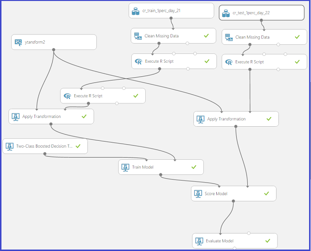
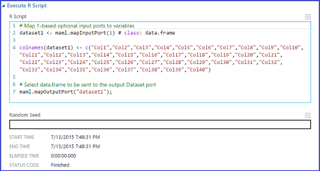
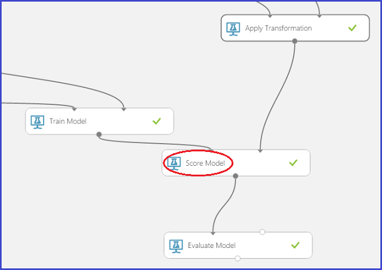
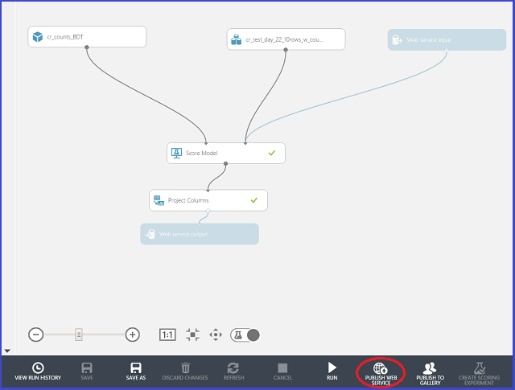

<properties
    pageTitle="Il processo di scienze Team dei dati in azione: utilizzando HDInsight Hadoop cluster il set di dati di 1 TB Criteo | Microsoft Azure"
    description="Il processo di scienze dati del Team per uno scenario-to-end che utilizza un cluster di HDInsight Hadoop a compilare e distribuire un modello utilizzando un set di dati disponibile al pubblico (1 TB) grandi dimensioni"
    services="machine-learning,hdinsight"
    documentationCenter=""
    authors="bradsev"
    manager="jhubbard"
    editor="cgronlun" />

<tags
    ms.service="machine-learning"
    ms.workload="data-services"
    ms.tgt_pltfrm="na"
    ms.devlang="na"
    ms.topic="article"
    ms.date="09/13/2016"
    ms.author="bradsev" />

# Il processo di scienze Team dei dati in azione - con Azure HDInsight Hadoop cluster su un set di dati di 1 TB

In questa procedura viene illustrato il processo di scienze di dati del Team in uno scenario-to-end con un [cluster di Azure HDInsight Hadoop](https://azure.microsoft.com/services/hdinsight/) per archiviare, esplorare, tecnico, funzionalità e verso il basso dati di esempio da uno dei set di dati [Criteo](http://labs.criteo.com/downloads/download-terabyte-click-logs/) disponibile al pubblico. Apprendimento Azure è utilizzato per creare un modello di classificazione binario in questi dati. Vengono inoltre indicati come pubblicare uno di questi modelli come un servizio Web.

È inoltre possibile utilizzare un blocco appunti IPython per completare le attività descritte in questa procedura dettagliata. Gli utenti che si desiderano provare questo approccio è consigliabile consultare l'argomento [procedura dettagliata Criteo tramite una connessione ODBC Hive](https://github.com/Azure/Azure-MachineLearning-DataScience/blob/master/Misc/DataScienceProcess/iPythonNotebooks/machine-Learning-data-science-process-hive-walkthrough-criteo.ipynb) .

## Descrizione Criteo set di dati

Criteo set di dati di previsione fare clic su cui è di circa 370GB di file TSV compressi gzip (~1.3TB non compressi), è costituito da più di 4,3 miliardi di record. Viene accettata da 24 giorni prima di fare clic su dati resi disponibili da [Criteo](http://labs.criteo.com/downloads/download-terabyte-click-logs/). Per maggiore comodità di scienziati dati, sono stati decompressi dati disponibili a Microsoft per acquisire familiarità con.

Tutti i record di questo set di dati contiene 40 colonne:

- la prima colonna corrisponde a una colonna di etichetta che indica se un utente fa clic su un **aggiungere** (valore 1) o non fare clic su uno (valore 0)
- successivamente 13 colonne sono numeriche, e
- ultima 26 sono colonne di categoria

Le colonne vengono resi anonimi e utilizzare una serie di nomi enumerati: "Col1" (per la colonna etichetta) a ' Col40 "(per l'ultima colonna per categoria).            

Di seguito è riportata una porzione del primo 20 colonne di due osservazioni (righe) da questo set di dati:

    Col1    Col2    Col3    Col4    Col5    Col6    Col7    Col8    Col9    Col10   Col11   Col12   Col13   Col14   Col15           Col16           Col17           Col18           Col19       Col20

    0       40      42      2       54      3       0       0       2       16      0       1       4448    4       1acfe1ee        1b2ff61f        2e8b2631        6faef306        c6fc10d3    6fcd6dcb           
    0               24              27      5               0       2       1               3       10064           9a8cb066        7a06385f        417e6103        2170fc56        acf676aa    6fcd6dcb                      

Sono disponibili i valori mancanti in entrambe le colonne numeriche e per categoria in questo set di dati. Vengono descritte un metodo semplice per la gestione di valori mancanti. Ulteriori dettagli dei dati vengono esaminati quando sono archiviate in tabelle Hive.

**Definizione:** *Il tasso di clic through (CTR):* Questa è la percentuale di clic nei dati. In questo set di dati Criteo il CTR è circa 3.3% o 0.033.

## Esempi di attività di stima
In questa procedura dettagliata sono illustrati i problemi di previsione esempio due:

1. **Classificazione binaria**: prevede se un utente fa clic su un componente:
    - Classe 0: Non fare clic su
    - Per la classe 1: fare clic su

2. **Regressione**: prevede la probabilità di fare clic su un annuncio delle funzionalità di utente.

## Impostare un Hadoop di HDInsight cluster di scienze di dati

**Nota:** Si tratta in genere di un'attività di **amministrazione** .

Configurare l'ambiente di scienze di dati di Azure per la creazione di soluzioni analitica previsione con i cluster HDInsight tre passaggi:

1. [Creare un account di archiviazione](../storage/storage-create-storage-account.md): questo account di archiviazione viene utilizzato per memorizzare i dati in archiviazione Blob Azure. Dati utilizzati in HDInsight cluster sono archiviati in questa posizione.

2. [Personalizzare Azure HDInsight Hadoop cluster per dati scienza](machine-learning-data-science-customize-hadoop-cluster.md): questo passaggio consente di creare un cluster di Azure HDInsight Hadoop a 64 bit Anaconda Python 2.7 installato su tutti i nodi. Sono disponibili due passaggi importanti (descritti in questo argomento) per completare la personalizzazione del cluster HDInsight.

    * È necessario collegare l'account di archiviazione creato nel passaggio 1 con i cluster HDInsight quando viene creato. Questo account di archiviazione viene utilizzato per accedere ai dati che possono essere elaborati all'interno del cluster.

    * È necessario attivare l'accesso remoto per il nodo principale del cluster dopo averlo creato. Memorizza le credenziali di accesso remoto è possibile specificare (diverse da quelle specificate per al momento della creazione cluster): è necessario per completare le procedure seguenti.

3. [Creare un'area di lavoro di Azure ML](machine-learning-create-workspace.md): questo computer di Azure apprendimento area di lavoro viene usato per la creazione di modelli di apprendimento computer dopo un'esplorazione dati iniziali e verso il basso campioni cluster HDInsight.

## Accedere e utilizzare dati da una fonte pubblica

Il set di dati [Criteo](http://labs.criteo.com/downloads/download-terabyte-click-logs/) accessibile facendo clic sul collegamento, accettare le condizioni di utilizzo e fornire un nome. Uno snapshot di questo aspetto è illustrato di seguito:

Fare clic su **Continua per il Download** per ulteriori informazioni sul set di dati e la propria disponibilità.

I dati si trovano in un percorso [nell'archiviazione blob Azure](../storage/storage-dotnet-how-to-use-blobs.md) pubblico: wasb://criteo@azuremlsampleexperiments.blob.core.windows.net/raw/. "wasb" fa riferimento alla posizione di archiviazione Blob Azure. 

1. I dati in questa archiviazione blob pubblico è costituito da tre anche le sottocartelle dei dati decompressi.

    1. La sottocartella */conteggio non elaborato/* contiene i 21 giorni di dati - giorno\_00 al giorno\_20
    2. La sottocartella *elaborati/treno/* è costituito da un singolo giorno dei dati, giorno\_21
    3. La sottocartella *elaborati/test/* è costituito da due giorni di dati, giorno\_22 e il giorno\_23

2. Per chi desidera iniziare con i dati non elaborati gzip, questi sono anche disponibili nella cartella principale *elaborati /* come day_NN.gz, dove NN passa da 00 a 23.

Un approccio alternativo per accedere, esplorare e modello di dati che non richiedono alcun download locale sono spiegheremo più avanti in questa procedura dettagliata quando si creano tabelle Hive.

## Accedere a headnode cluster

Per accedere a headnode del cluster, utilizzare il [portale di Azure](https://ms.portal.azure.com) per individuare il cluster. Fare clic sull'icona di elefante HDInsight sul lato sinistro e quindi fare doppio clic sul nome del cluster. Passare alla scheda **configurazione** , fare doppio clic sull'icona CONNETTI nella parte inferiore della pagina e immettere le credenziali di accesso remoto quando richiesto. Verrà visualizzato headnode del cluster.

Ecco l'aspetto di un tipico prima accedere a headnode cluster:

A sinistra, è possibile vedere "Hadoop riga di comando", ossia il componente di base per l'esplorazione di dati. È anche possibile vedere due URL utile - "Stato filati Hadoop" e "Hadoop nome nodo". L'URL di stato filati Mostra lo stato di processo e l'URL di nodo nome fornisce informazioni dettagliate sulla configurazione del cluster.

A questo punto sono configurati e pronti per iniziare prima parte della procedura dettagliata: esplorazione dei dati utilizzando Hive e prepararsi per l'apprendimento Azure dati.

## Creare tabelle e database Hive

Per creare tabelle Hive per il set di dati Criteo, aprire la ***riga di comando Hadoop*** sul desktop del nodo principale e immettere la directory Hive immettendo il comando

    cd %hive_home%\bin

>[AZURE.NOTE] Eseguire tutti i comandi di Hive in questa procedura dettagliata del Raccoglitore Hive / prompt dei comandi. Questa operazione si occupa di eventuali problemi di percorso automaticamente. Serve i termini "Hive prompt dei comandi", "bin Hive / prompt dei comandi", "riga di comando Hadoop" e in modo intercambiabile.

>[AZURE.NOTE]  Per eseguire una query Hive, uno sempre possibile utilizzare i comandi seguenti:

        cd %hive_home%\bin
        hive

Dopo la replica Hive viene visualizzata con una "hive >"eseguire l'accesso, è sufficiente tagliare e incollare la query per eseguirlo.

Il codice seguente viene creato un database "criteo" e quindi viene generato 4 tabelle:

* una *tabella per la generazione conteggi* creata giorno giorni\_00 al giorno\_20,
* una *tabella da utilizzare come il set di dati di treno* creata giorno\_21, e
* due *tabelle per utilizzano come i set di dati di test* basato su giorno\_22 e il giorno\_23 rispettivamente.

Il set di dati di test è dividere in due tabelle diverse poiché uno dei giorni è un giorno festivo e si desidera determinare se il modello è in grado di rilevare le differenze tra una per le festività e non per le festività dal tasso clic through.

Lo script [esempio & #95; hive & 95 #; creare & #95; criteo & #95; database & #95; e & #95;tables.hql](https://github.com/Azure/Azure-MachineLearning-DataScience/blob/master/Misc/DataScienceProcess/DataScienceScripts/sample_hive_create_criteo_database_and_tables.hql) per comodità viene visualizzato:

    CREATE DATABASE IF NOT EXISTS criteo;
    DROP TABLE IF EXISTS criteo.criteo_count;
    CREATE TABLE criteo.criteo_count (
    col1 string,col2 double,col3 double,col4 double,col5 double,col6 double,col7 double,col8 double,col9 double,col10 double,col11 double,col12 double,col13 double,col14 double,col15 string,col16 string,col17 string,col18 string,col19 string,col20 string,col21 string,col22 string,col23 string,col24 string,col25 string,col26 string,col27 string,col28 string,col29 string,col30 string,col31 string,col32 string,col33 string,col34 string,col35 string,col36 string,col37 string,col38 string,col39 string,col40 string)
    ROW FORMAT DELIMITED FIELDS TERMINATED BY '\t'
    LINES TERMINATED BY '\n'
    STORED AS TEXTFILE LOCATION 'wasb://criteo@azuremlsampleexperiments.blob.core.windows.net/raw/count';

    DROP TABLE IF EXISTS criteo.criteo_train;
    CREATE TABLE criteo.criteo_train (
    col1 string,col2 double,col3 double,col4 double,col5 double,col6 double,col7 double,col8 double,col9 double,col10 double,col11 double,col12 double,col13 double,col14 double,col15 string,col16 string,col17 string,col18 string,col19 string,col20 string,col21 string,col22 string,col23 string,col24 string,col25 string,col26 string,col27 string,col28 string,col29 string,col30 string,col31 string,col32 string,col33 string,col34 string,col35 string,col36 string,col37 string,col38 string,col39 string,col40 string)
    ROW FORMAT DELIMITED FIELDS TERMINATED BY '\t'
    LINES TERMINATED BY '\n'
    STORED AS TEXTFILE LOCATION 'wasb://criteo@azuremlsampleexperiments.blob.core.windows.net/raw/train';

    DROP TABLE IF EXISTS criteo.criteo_test_day_22;
    CREATE TABLE criteo.criteo_test_day_22 (
    col1 string,col2 double,col3 double,col4 double,col5 double,col6 double,col7 double,col8 double,col9 double,col10 double,col11 double,col12 double,col13 double,col14 double,col15 string,col16 string,col17 string,col18 string,col19 string,col20 string,col21 string,col22 string,col23 string,col24 string,col25 string,col26 string,col27 string,col28 string,col29 string,col30 string,col31 string,col32 string,col33 string,col34 string,col35 string,col36 string,col37 string,col38 string,col39 string,col40 string)
    ROW FORMAT DELIMITED FIELDS TERMINATED BY '\t'
    LINES TERMINATED BY '\n'
    STORED AS TEXTFILE LOCATION 'wasb://criteo@azuremlsampleexperiments.blob.core.windows.net/raw/test/day_22';

    DROP TABLE IF EXISTS criteo.criteo_test_day_23;
    CREATE TABLE criteo.criteo_test_day_23 (
    col1 string,col2 double,col3 double,col4 double,col5 double,col6 double,col7 double,col8 double,col9 double,col10 double,col11 double,col12 double,col13 double,col14 double,col15 string,col16 string,col17 string,col18 string,col19 string,col20 string,col21 string,col22 string,col23 string,col24 string,col25 string,col26 string,col27 string,col28 string,col29 string,col30 string,col31 string,col32 string,col33 string,col34 string,col35 string,col36 string,col37 string,col38 string,col39 string,col40 string)
    ROW FORMAT DELIMITED FIELDS TERMINATED BY '\t'
    LINES TERMINATED BY '\n'
    STORED AS TEXTFILE LOCATION 'wasb://criteo@azuremlsampleexperiments.blob.core.windows.net/raw/test/day_23';

È possibile notare che tutte le tabelle seguenti sono esterne mentre si è sufficiente scegliere percorsi di archiviazione Blob Azure (wasb).

**Esistono due modi per eseguire query Hive qualsiasi che menzionano è ora.**

1. **Utilizzo di replica Hive della riga di comando**: il primo consiste nell'eseguire un comando "hive" e copiare e incollare una query alla replica Hive della riga di comando. A tale scopo, eseguire:

        cd %hive_home%\bin
        hive

    A questo punto nella replica della riga di comando, tagliare e incollare la query viene eseguito.

2. **Salvataggio delle query in un file e l'esecuzione del comando**: il secondo consiste nel salvare la query in un file .hql ([esempio & #95; hive & 95 #; creare & #95; criteo & #95; database & #95; e & #95;tables.hql](https://github.com/Azure/Azure-MachineLearning-DataScience/blob/master/Misc/DataScienceProcess/DataScienceScripts/sample_hive_create_criteo_database_and_tables.hql)) e quindi inviare il seguente comando per eseguire la query:

        hive -f C:\temp\sample_hive_create_criteo_database_and_tables.hql

### Confermare la creazione di database e tabella

Successivamente, è necessario confermare la creazione del database con il comando seguente dal raccoglitore Hive / prompt dei comandi:

        hive -e "show databases;"

In questo modo:

        criteo
        default
        Time taken: 1.25 seconds, Fetched: 2 row(s)

Consente di confermare la creazione del nuovo database "criteo".

Per vedere quali tabelle create, è sufficiente inviare il comando dal raccoglitore Hive / prompt dei comandi:

        hive -e "show tables in criteo;"

Vediamo quindi l'output seguente:

        criteo_count
        criteo_test_day_22
        criteo_test_day_23
        criteo_train
        Time taken: 1.437 seconds, Fetched: 4 row(s)

##Esplorazione dei dati nell'Hive

A questo punto si è pronti eseguire alcune operazioni di esplorazione di dati di base in Hive. È innanzitutto il conteggio del numero di esempi in treno e testare le tabelle dati.

### Numero di treno esempi

Il contenuto di [esempio & #95; hive & #95; conteggio & #95; treno 95 #; tabella & #95;examples.hql](https://github.com/Azure/Azure-MachineLearning-DataScience/blob/master/Misc/DataScienceProcess/DataScienceScripts/sample_hive_count_train_table_examples.hql) è illustrato di seguito:

        SELECT COUNT(*) FROM criteo.criteo_train;

Questa operazione si ottiene:

        192215183
        Time taken: 264.154 seconds, Fetched: 1 row(s)

In alternativa, uno potrebbe anche il comando seguente dal raccoglitore Hive / prompt dei comandi:

        hive -f C:\temp\sample_hive_count_criteo_train_table_examples.hql

### Numero di esempi di test in due set di dati di test

È ora contare il numero di esempi in due set di dati di test. Il contenuto di [esempio & #95 hive & 95 # conteggio & 95 #; criteo & #95; test & #95; giorno e 95 #; 22 & #95; tabella & #95;examples.hql](https://github.com/Azure/Azure-MachineLearning-DataScience/blob/master/Misc/DataScienceProcess/DataScienceScripts/sample_hive_count_criteo_test_day_22_table_examples.hql) sono qui:

        SELECT COUNT(*) FROM criteo.criteo_test_day_22;

Questa operazione si ottiene:

        189747893
        Time taken: 267.968 seconds, Fetched: 1 row(s)

Come di consueto, si potrà chiamare lo script dal raccoglitore Hive / directory richiesta per il comando:

        hive -f C:\temp\sample_hive_count_criteo_test_day_22_table_examples.hql

Infine, esaminiamo il numero di esempi di test nel set di dati di test in base a giorno\_23.

Il comando per eseguire questa operazione è simile a quello appena mostrato (fare riferimento a [esempio & #95; hive & 95 #; conteggio & #95; criteo & #95; test & 95 #; giorno e 95 #; 23 & #95;examples.hql](https://github.com/Azure/Azure-MachineLearning-DataScience/blob/master/Misc/DataScienceProcess/DataScienceScripts/sample_hive_count_criteo_test_day_23_examples.hql)):

        SELECT COUNT(*) FROM criteo.criteo_test_day_23;

In questo modo:

        178274637
        Time taken: 253.089 seconds, Fetched: 1 row(s)

### Distribuzione di etichetta nel set di dati treno

La distribuzione di etichetta nel set di dati treno è di interesse. Per quanto segue, questo webinar Mostra contenuto di [esempio & #95; hive 95 #; criteo & #95; #95 & etichetta; distribuzione & #95; treno & #95;table.hql](https://github.com/Azure/Azure-MachineLearning-DataScience/blob/master/Misc/DataScienceProcess/DataScienceScripts/sample_hive_criteo_label_distribution_train_table.hql):

        SELECT Col1, COUNT(*) AS CT FROM criteo.criteo_train GROUP BY Col1;

Questo restituisce la distribuzione di etichetta:

        1       6292903
        0       185922280
        Time taken: 459.435 seconds, Fetched: 2 row(s)

Si noti che la percentuale di etichette positive 3.3% circa (coerenti con il set di dati originali).

### Distribuzioni istogramma di alcune variabili numeriche nel set di dati treno

È possibile utilizzare nativo Hive "istogramma\_numerico" funzione per scoprire la distribuzione di variabili numeriche l'aspetto. Ecco il contenuto di [esempio & #95; hive #95; criteo & #95; istogramma & #95;numeric.hql](https://github.com/Azure/Azure-MachineLearning-DataScience/blob/master/Misc/DataScienceProcess/DataScienceScripts/sample_hive_criteo_histogram_numeric.hql):

        SELECT CAST(hist.x as int) as bin_center, CAST(hist.y as bigint) as bin_height FROM
            (SELECT
            histogram_numeric(col2, 20) as col2_hist
            FROM
            criteo.criteo_train
            ) a
            LATERAL VIEW explode(col2_hist) exploded_table as hist;

Questa operazione si ottiene quanto segue:

        26      155878415
        2606    92753
        6755    22086
        11202   6922
        14432   4163
        17815   2488
        21072   1901
        24113   1283
        27429   1225
        30818   906
        34512   723
        38026   387
        41007   290
        43417   312
        45797   571
        49819   428
        53505   328
        56853   527
        61004   160
        65510   3446
        Time taken: 317.851 seconds, Fetched: 20 row(s)

LATERALE visualizzazione - esplodere combinazione in Hive viene utilizzata per produrre un output mi piace SQL anziché l'elenco comune. Si noti che in questa tabella, la prima colonna corrisponde al centro bin e il secondo la frequenza di classe.

### Percentili approssimativi di alcune variabili numeriche nel set di dati treno

È inoltre il calcolo della percentili approssimativi di interesse con le variabili numeriche. Hive del nativo "percentile\_circa" responsabile per noi. Il contenuto di [esempio & #95; hive #95; criteo & #95; approssimativa & #95;percentiles.hql](https://github.com/Azure/Azure-MachineLearning-DataScience/blob/master/Misc/DataScienceProcess/DataScienceScripts/sample_hive_criteo_approximate_percentiles.hql) sono:

        SELECT MIN(Col2) AS Col2_min, PERCENTILE_APPROX(Col2, 0.1) AS Col2_01, PERCENTILE_APPROX(Col2, 0.3) AS Col2_03, PERCENTILE_APPROX(Col2, 0.5) AS Col2_median, PERCENTILE_APPROX(Col2, 0.8) AS Col2_08, MAX(Col2) AS Col2_max FROM criteo.criteo_train;

Questa operazione si ottiene:

        1.0     2.1418600917169246      2.1418600917169246    6.21887086390288 27.53454893115633       65535.0
        Time taken: 564.953 seconds, Fetched: 1 row(s)

Abbiamo commento che la distribuzione di percentili è strettamente correlata alla distribuzione istogramma di qualsiasi variabile numerici in genere.        

### Trovare numero di valori univoci per alcune colonne di categoria nel set di dati treno

Continuare l'esplorazione dei dati, è ora disponibile, per alcune colonne di categoria, il numero di valori univoci che eseguire. A questo scopo è visualizzare tutto il contenuto di [esempio & #95; hive #95; criteo & #95; univoco & #95; valori & #95;categoricals.hql](https://github.com/Azure/Azure-MachineLearning-DataScience/blob/master/Misc/DataScienceProcess/DataScienceScripts/sample_hive_criteo_unique_values_categoricals.hql):

        SELECT COUNT(DISTINCT(Col15)) AS num_uniques FROM criteo.criteo_train;

Questa operazione si ottiene:

        19011825
        Time taken: 448.116 seconds, Fetched: 1 row(s)

È possibile notare che Col15 siano disponibili valori univoci 19M! Uso di tecniche naïve come "hot una codifica" per codificare tali variabili dimensioni massime per categoria è impossibile. In particolare, abbiamo spiegare e illustrare una tecnica potente e affidabile denominata [Risorse con conta](http://blogs.technet.com/b/machinelearning/archive/2015/02/17/big-learning-made-easy-with-counts.aspx) per affrontare in modo efficiente il problema.

In questa sezione secondari è terminare esaminando il numero di valori univoci per alcune altre colonne di categoria anche. Il contenuto di [esempio & #95; hive #95; criteo & #95; univoco & valori & 95 # #95; multiplo & #95;categoricals.hql](https://github.com/Azure/Azure-MachineLearning-DataScience/blob/master/Misc/DataScienceProcess/DataScienceScripts/sample_hive_criteo_unique_values_multiple_categoricals.hql) sono:

        SELECT COUNT(DISTINCT(Col16)), COUNT(DISTINCT(Col17)),
        COUNT(DISTINCT(Col18), COUNT(DISTINCT(Col19), COUNT(DISTINCT(Col20))
        FROM criteo.criteo_train;

Questa operazione si ottiene:

        30935   15200   7349    20067   3
        Time taken: 1933.883 seconds, Fetched: 1 row(s)

Nuovo vediamo ad eccezione di Col20, tutte le altre colonne sono numerosi valori univoci.

### CO-occorrenza conta di coppie di variabili per categoria nel set di dati treno

Conteggi CO-occorrenza di coppie di variabili per categoria è anche di interesse. Può essere stabilita utilizzando il codice in [esempio & #95; hive #95; criteo & #95; accoppiate & #95; categoria & #95;counts.hql](https://github.com/Azure/Azure-MachineLearning-DataScience/blob/master/Misc/DataScienceProcess/DataScienceScripts/sample_hive_criteo_paired_categorical_counts.hql):

        SELECT Col15, Col16, COUNT(*) AS paired_count FROM criteo.criteo_train GROUP BY Col15, Col16 ORDER BY paired_count DESC LIMIT 15;

Abbiamo inverso Ordina i conteggi relativi occorrenza e Cerca nella parte superiore 15 in questo caso. In questo modo ci:

        ad98e872        cea68cd3        8964458
        ad98e872        3dbb483e        8444762
        ad98e872        43ced263        3082503
        ad98e872        420acc05        2694489
        ad98e872        ac4c5591        2559535
        ad98e872        fb1e95da        2227216
        ad98e872        8af1edc8        1794955
        ad98e872        e56937ee        1643550
        ad98e872        d1fade1c        1348719
        ad98e872        977b4431        1115528
        e5f3fd8d        a15d1051        959252
        ad98e872        dd86c04a        872975
        349b3fec        a52ef97d        821062
        e5f3fd8d        a0aaffa6        792250
        265366bf        6f5c7c41        782142
        Time taken: 560.22 seconds, Fetched: 15 row(s)

## Verso il basso il set di dati di esempio per l'apprendimento Azure

Se sono stati illustrati i set di dati e illustrato come potremmo facciamo questo tipo di analisi per tutte le variabili (incluse le combinazioni), è ora verso il basso esempio gli insiemi di dati in modo che è possibile creare modelli di apprendimento Azure. Tenere presente che il problema verrà sottolineata: dato un set di attributi di esempio (valori caratteristica Col2 - Col40), è prevedere se Col1 è 0 (senza fare clic) o 1 (fare clic).

Per testare set di dati a 1% delle dimensioni originali verso il basso il nostro treno di esempio e serve funzione RAND nativa Hive. Script successivo [esempio & #95; hive 95 #; criteo & #95; downsampling & #95; treno & #95;dataset.hql](https://github.com/Azure/Azure-MachineLearning-DataScience/blob/master/Misc/DataScienceProcess/DataScienceScripts/sample_hive_criteo_downsample_train_dataset.hql) responsabile per il set di dati di treno:

        CREATE TABLE criteo.criteo_train_downsample_1perc (
        col1 string,col2 double,col3 double,col4 double,col5 double,col6 double,col7 double,col8 double,col9 double,col10 double,col11 double,col12 double,col13 double,col14 double,col15 string,col16 string,col17 string,col18 string,col19 string,col20 string,col21 string,col22 string,col23 string,col24 string,col25 string,col26 string,col27 string,col28 string,col29 string,col30 string,col31 string,col32 string,col33 string,col34 string,col35 string,col36 string,col37 string,col38 string,col39 string,col40 string)
        ROW FORMAT DELIMITED FIELDS TERMINATED BY '\t'
        LINES TERMINATED BY '\n'
        STORED AS TEXTFILE;

        ---Now downsample and store in this table

        INSERT OVERWRITE TABLE criteo.criteo_train_downsample_1perc SELECT * FROM criteo.criteo_train WHERE RAND() <= 0.01;

Questa operazione si ottiene:

        Time taken: 12.22 seconds
        Time taken: 298.98 seconds

Script [esempio & #95; hive & 95 #; criteo & #95; downsampling & #95; test & 95 #; giorno e 95 #; 22 & #95;dataset.hql](https://github.com/Azure/Azure-MachineLearning-DataScience/blob/master/Misc/DataScienceProcess/DataScienceScripts/sample_hive_criteo_downsample_test_day_22_dataset.hql) indica per i dati di test, giorno\_22:

        --- Now for test data (day_22)

        CREATE TABLE criteo.criteo_test_day_22_downsample_1perc (
        col1 string,col2 double,col3 double,col4 double,col5 double,col6 double,col7 double,col8 double,col9 double,col10 double,col11 double,col12 double,col13 double,col14 double,col15 string,col16 string,col17 string,col18 string,col19 string,col20 string,col21 string,col22 string,col23 string,col24 string,col25 string,col26 string,col27 string,col28 string,col29 string,col30 string,col31 string,col32 string,col33 string,col34 string,col35 string,col36 string,col37 string,col38 string,col39 string,col40 string)
        ROW FORMAT DELIMITED FIELDS TERMINATED BY '\t'
        LINES TERMINATED BY '\n'
        STORED AS TEXTFILE;

        INSERT OVERWRITE TABLE criteo.criteo_test_day_22_downsample_1perc SELECT * FROM criteo.criteo_test_day_22 WHERE RAND() <= 0.01;

Questa operazione si ottiene:

        Time taken: 1.22 seconds
        Time taken: 317.66 seconds

Infine, script [esempio & #95; hive & #95; criteo & #95; downsampling & 95 #; test & 95 #; giorno e 95 #; 23 & #95;dataset.hql](https://github.com/Azure/Azure-MachineLearning-DataScience/blob/master/Misc/DataScienceProcess/DataScienceScripts/sample_hive_criteo_downsample_test_day_23_dataset.hql) indica per i dati di test, giorno\_23:

        --- Finally test data day_23
        CREATE TABLE criteo.criteo_test_day_23_downsample_1perc (
        col1 string,col2 double,col3 double,col4 double,col5 double,col6 double,col7 double,col8 double,col9 double,col10 double,col11 double,col12 double,col13 double,col14 double,col15 string,col16 string,col17 string,col18 string,col19 string,col20 string,col21 string,col22 string,col23 string,col24 string,col25 string,col26 string,col27 string,col28 string,col29 string,col30 string,col31 string,col32 string,col33 string,col34 string,col35 string,col36 string,col37 string,col38 string,col39 string,col40 srical feature; tring)
        ROW FORMAT DELIMITED FIELDS TERMINATED BY '\t'
        LINES TERMINATED BY '\n'
        STORED AS TEXTFILE;

        INSERT OVERWRITE TABLE criteo.criteo_test_day_23_downsample_1perc SELECT * FROM criteo.criteo_test_day_23 WHERE RAND() <= 0.01;

Questa operazione si ottiene:

        Time taken: 1.86 seconds
        Time taken: 300.02 seconds

Con questo valore, si è pronti utilizzare il nostro treno campionato verso il basso e set di dati per la creazione di modelli di apprendimento Azure di test.

Esiste un componente importante finale prima di proseguire a Azure apprendimento, ossia preoccupazioni tabella conteggio. Nella sezione successiva secondario, verranno trattati gli argomenti questo in modo dettagliato.

##Una breve descrizione della tabella di conteggio

Come visto, diverse variabili per categoria che abbiano un dimensionalità molto elevato. La procedura dettagliata, viene presentata una tecnica potente denominata [Risorse con conta](http://blogs.technet.com/b/machinelearning/archive/2015/02/17/big-learning-made-easy-with-counts.aspx) per codificare queste variabili in modo efficiente e affidabile. Ulteriori informazioni su questa tecnica sono nella casella collegamento specificato.

**Nota:** In questa procedura dettagliata, l'attenzione sull'utilizzo di tabelle di conteggio per produrre compatta rappresentazioni di dimensioni massime per categoria caratteristiche. Questa non è l'unico modo per codificare funzionalità per categoria. Per ulteriori informazioni sulle altre tecniche, gli utenti interessati possono estrarre [uno hot-codifica](http://en.wikipedia.org/wiki/One-hot) e [l'hashing caratteristica](http://en.wikipedia.org/wiki/Feature_hashing).

Per creare tabelle conteggio dati conteggio, i dati vengono utilizzati nel cartella elaborati/conteggio. Nella sezione modellazione è illustrare agli utenti come creare tali tabelle di conteggio per le caratteristiche per categoria da zero, o in alternativa utilizzare una tabella di conteggio predefiniti per le analisi. In quali descritto di seguito, quando si fa riferimento a "conteggio predefiniti tabelle" si intende utilizzando le tabelle di conteggio che sono disponibili. Istruzioni dettagliate su come accedere a queste tabelle disponibili nella sezione successiva.

## Creazione di un modello di apprendimento Azure

Il nostro modello creazione processo di apprendimento Azure prevede i passaggi seguenti:

1. [Recuperare i dati dalle tabelle Hive in apprendimento Azure](#step1)
2. [Creare la prova: pulire i dati, scegliere un studente e Trasforma con le tabelle di conteggio](#step2)
3. [Formare il modello](#step3)
4. [Punteggio il modello di dati di test](#step4)
5. [Valutare il modello](#step5)
6. [Pubblicare il modello come un servizio web per l'utilizzo](#step6)

A questo punto si è pronti creare modelli di studio Azure apprendimento. I dati campionati verso il basso viene salvati come tabelle Hive del cluster. Il modulo di Azure apprendimento **Importa dati** utilizzato per leggere questi dati. Le credenziali per accedere all'account di archiviazione di questo cluster sono vedere di seguito.

### Passaggio 1: Recuperare dati da tabelle Hive in Azure Machine formazione uso del modulo di importare dati e selezionarlo per una prova di apprendimento

Iniziare scegliendo un **+ Nuovo** -> **prova** -> **Prova vuoto**. Quindi, dalla casella di **ricerca** in alto a sinistra, cercare "Importare dati". Trascinare e rilasciare il modulo **Importa dati** nell'area di lavoro di prova (la parte centrale della schermata) per usare il modulo per l'accesso ai dati.

Si tratta in aspetto **Importa dati** il recupero dei dati della tabella Hive:

Per il modulo **Importa dati** , i valori dei parametri disponibili nell'elemento grafico sono solo alcuni esempi di ordinamento dei valori che è necessario fornire. Ecco alcune linee guida generali su come compilare il parametro impostato per il modulo **Importa dati** .

1. Scegliere "Hive query" per **l'Origine dati**
2. Nella casella **Hive una query di database** , un'istruzione SELECT semplice * FROM < il\_database\_name.your\_tabella\_nome >-è sufficiente.
3. **URI del server Hcatalog**: se il cluster è "abc", quindi è semplicemente: https://abc.azurehdinsight.net
4. **Nome dell'account utente Hadoop**: il nome utente scelto in fase di avviamento cluster. (Non l'accesso remoto al nome utente!)
5. **Password dell'account utente Hadoop**: la password per il nome utente scelto in fase di avviamento cluster. (Non la password di accesso remoto!)
6. **Posizione dei dati di output**: scegliere "Azure"
7. **Nome dell'account di archiviazione Azure**: l'account di archiviazione associato al cluster
8. **Chiave account Azure dello spazio di archiviazione**: la chiave dell'account di archiviazione associato al cluster.
9. **Nome del contenitore di Azure**: se il nome del cluster è "abc", quindi si tratta in genere è sufficiente "abc,".

Al termine della Guida **Importa dati** (i dati visualizzati dei segni di graduazione verde nel modulo), salvare i dati come un set di dati (con un nome di propria scelta). Questo aspetto:

Fare clic su porta di output del modulo **Importa dati** . Vengono visualizzate un'opzione **Salva come set di dati** e l'opzione **Visualizza** . Opzione **Visualizza** se scelto, Visualizza 100 righe di dati, insieme a un pannello destro è utile per alcune statistiche di riepilogo. Per salvare i dati, selezionare **Salva come set di dati** e seguire le istruzioni.

Per selezionare il set di dati salvato per l'utilizzo di una prova di apprendimento, individuare il set di dati utilizzando la casella di **ricerca** mostrata nella figura seguente. È sufficiente digitare il nome assegnato il set di dati parzialmente per accedervi e trascinare il set di dati nel riquadro principale. Il trascinamento nella finestra principale pannello selezione per l'utilizzo in modellazione risorse computer.

>[AZURE.NOTE] Ripetere l'operazione per il treno e i set di dati di test. Inoltre, è necessario utilizzare il nome del database e nomi di tabella assegnato a tale scopo. I valori utilizzati nella figura sono esclusivamente per illustrazione purposes.* *

### Passaggio 2: Creare una semplice prova in Azure apprendimento prevedere clic / alcun clic

Il nostro prova ML Azure è simile alla seguente:

Ora verranno esaminati i componenti principali di questa prova. Come promemoria, è necessario trascinare il nostro treno salvato e testare set di dati al nostro area prova prima di tutto.

#### Eliminare i dati mancanti

Il modulo **Dati mancanti libera** indica il nome suggerisce: essa pulisce dati mancanti in modo da può essere specificato dall'utente. Ricerca in questo modulo, è quanto segue:

In questo caso, si è scelto di sostituire tutti i valori mancanti con 0. Esistono altre opzioni, che possono essere visualizzate esaminando elenchi a discesa nel modulo.

#### Portare in primo piano progettazione sui dati

Possono essere presenti milioni di valori univoci per alcune caratteristiche per categoria di grandi dimensioni set di dati. Metodi naïve, ad esempio hot una codifica per rappresentare tali funzioni per categoria alta dimensionali sia completamente Impossibile. In questa procedura dettagliata viene illustrato come utilizzare le caratteristiche di conteggio con moduli di apprendimento Azure incorporati per generare compatta rappresentazioni di queste variabili dimensioni massime per categoria. Il risultato finale è una versione ridotta del modello, velocizzare i tempi di formazione e le statistiche delle sono molto simili a con altre tecniche.

##### Creazione di conteggio trasformazioni

Per generare le funzionalità di conteggio, serve il modulo **Creare conteggio trasformare** è disponibile in Azure apprendimento. Il modulo è simile alla seguente:

**Nota importante** : nella casella **Numero colonne** è immettere le colonne che si desiderano eseguire conteggi su. In genere si tratta (come indicato) ad alta dimensionali colonne di categoria. All'inizio è indicato che il set di dati Criteo ha 26 colonne di categoria: da Col15 a Col40. In questo caso, è contare su tutti gli elementi e assegnare loro indici (da 15 a 40 separati da virgole, come illustrato).

Per utilizzare il modulo in modalità MapReduce (appropriata per grandi set di dati), è necessario l'accesso a un cluster di HDInsight Hadoop (quello usato per l'esplorazione di funzionalità può essere riutilizzato a questo scopo anche) e le proprie credenziali. Le figure precedenti illustrano i compilato i valori che sono simili a (sostituire i valori previsti illustrazione con quelle pertinenti per il proprio caso di utilizzo).

Nella figura precedente, ecco come immettere il percorso di input blob. Questo percorso contiene i dati riservati per la creazione di tabelle di conteggio.

Al termine dell'esecuzione questo modulo, è possibile salvare in un secondo momento la trasformazione per il pulsante destro del modulo e selezionando l'opzione **Salva come trasformazione** :

Nell'architettura prova illustrato in precedenza, il set di dati "ytransform2" corrisponde esattamente a una trasformazione conteggio salvato. Per il resto di questo prova, si presuppone che il lettore utilizzato un modulo **Creare conteggio trasformare** alcuni dati per generare conteggi e quindi possibile utilizzare i conteggi per generare le funzionalità di conteggio in treno e set di dati di test.

##### Scegliere quali conteggio caratteristiche in modo da includere come parte del set di dati treno e test

Una volta che un conteggio trasformare già pronti, l'utente può scegliere delle caratteristiche da includere nel loro treno e testare set di dati tramite il modulo di **Modificare i parametri di tabella conteggio** . Questo webinar mostra solo il modulo qui per completezza, ma in semplificare non effettivamente utilizzarlo nel nostro test.

In questo caso, come si può vedere, avendo scelto per utilizzare solo la probabilità log e ignorare la colonna interruzione. È anche possibile impostare i parametri, ad esempio la soglia di bin garbage quanti esempi pseudo-precedenti per aggiungere smussatura e se si desidera utilizzare qualsiasi rumore Laplacian o meno. Tutti questi elementi sono funzionalità avanzati ed è presente che i valori predefiniti sono un buon punto di partenza per gli utenti che hanno i nuovi utenti di questo tipo di generazione di funzionalità.

##### Trasformazione dei dati prima di generare le funzioni conta. numeri

A questo punto abbiamo focalizzare l'attenzione su un punto importante sulla trasformazione il nostro treno e verificare dati prima di generare effettivamente caratteristiche conteggio. Si noti che sono presenti due moduli **Eseguire Script R** usati in precedenza è applicare la trasformazione di conteggio per i dati.

Di seguito è il primo script R:

In questo script R è rinominare le colonne in nomi "Col1" a "Col40". In questo modo la trasformazione conteggio prevede che i nomi di questo formato.

Nel secondo script R, è bilanciare la distribuzione tra classi positive e negative (classi rispettivamente 1 e 0) da downsampling classe negativo. Lo script di R viene illustrato come procedere come segue:

In questo semplice script R, viene utilizzata "pos\_neg\_rapporto" per impostare la quantità di equilibrio tra il positivi e negativi. È importante in quanto il miglioramento squilibrio classe in genere contiene prestazioni i problemi di classificazione dove si trova la distribuzione di classe inclinato (richiamo che in questo caso, sono 3.3% positivo classi e 96,7% negativo).

##### Applicare la trasformazione di conteggio nei dati

Infine, è possibile utilizzare il modulo di **Trasformazione applicare** per applicare le trasformazioni di conteggio per il nostro treno e set di dati di test. In questo modulo accetta la trasformazione conteggio salvato come un input e i set di dati come altri input treno o test e restituisce i dati con le funzionalità di conteggio. Come indicato di seguito:

##### Una porzione del conteggio quali caratteristiche lo stesso aspetto

È utile visualizzare l'aspetto le caratteristiche di conteggio in questo caso. Di seguito verrà mostrata una porzione del seguente:

In questo estratto, questo webinar mostra che per le colonne che sono state contate In è ottenere i conteggi e accedere probabilità oltre a qualsiasi backoffs pertinenti.

È ora sono pronti per creare un modello di apprendimento Azure utilizzando i set di dati trasformati in. Nella sezione successiva, questo webinar mostra come può essere eseguita.

#### Compilazione del modello di apprendimento Azure

##### Scelta di studente

Prima di tutto, è necessario scegliere un studente. Occorre usare un albero decisionale due classe aumentata come il nostro studente. Ecco le opzioni predefinite per questo studente:

Per il nostro la prova, che verranno scegliere i valori predefiniti. È possibile notare che i valori predefiniti sono in genere significativi e un buon metodo per creare basi di riferimento rapidi sulle prestazioni. È possibile migliorare sulle prestazioni trascinando i parametri se si sceglie di dopo avere inserito una previsione.

#### Formare il modello

Corsi di formazione, è sufficiente richiamare un modulo di **Modello treno** . I due input a tale sono studente albero decisionale aumentata due classe e il set di dati di treno. Come illustrato di seguito:

#### Punteggio del modello

Una volta ottenuto un modello di esperto, si è pronti per punteggio nel set di dati di test e valutare le prestazioni. Facciamo utilizzando il modulo **Modello punteggio** mostrato nella figura riportata di seguito, insieme a un modulo di **Valutare modello** :

### Passaggio 5: Valutare il modello

Infine, si desidera analizzare le prestazioni del modello. Di solito, per due problemi di classificazione (binario) di classe, una misura utile è la AUC. Per visualizzare questa situazione, è collegare il modulo **Punteggio modello** a un modulo di **Valutare modello** per questa. Fare clic su **Visualizza** nel modulo **Modello valutare** restituisce un elemento grafico come quella riportata di seguito:

In formato binario (o classe due) i problemi di classificazione, una buona misura di precisione della previsione è l'Area in curva (AUC). Ciò che segue mostra i risultati di questo modello il set di dati di test. Per ottenere questo, fare clic su porta di output di **effetti grafici**e **Valutare modello** modulo.

### Passaggio 6: Pubblicare il modello come un servizio Web
La possibilità di pubblicare un modello di apprendimento Azure come servizi web con senza difficoltà è una funzionalità efficace per renderlo ampiamente disponibile. Al termine dell'operazione, chiunque può effettuare chiamate al servizio web con dati di input che hanno bisogno le stime per il servizio web utilizza il modello per restituire tali stime.

A tale scopo, è necessario salvare il nostro modello esperto come un oggetto modello esperti. È necessario il pulsante destro del modulo **Modello treno** e utilizzando l'opzione **Salva come modello di esperti** .

Successivamente, è necessario creare input e output porte per il servizio web:

* Recupera i dati nello stesso modulo i dati che è necessario le stime per una porta di input
* una porta di output restituisce le etichette totalizza e la probabilità associata.

#### Selezionare alcune righe di dati per la porta di input

È consigliabile utilizzare un modulo di **Applicare trasformazione SQL** per selezionare solo 10 righe da utilizzare come dati porta di input. Selezionare solo le righe di dati per la porta di input utilizzando la query SQL illustrata di seguito:

#### Servizio Web
A questo punto si è pronti eseguire una prova di piccole dimensioni che può essere utilizzato per pubblicare il servizio web.

#### Generare dati di input per servizio

Come passaggio zeroth, in quanto è grande, la tabella conteggio abbiamo eseguire alcune righe di dati di test e generare i dati di output corrispondenti con funzionalità di conteggio. Questa operazione può essere utilizzato il formato di dati di input per il servizio. Come illustrato di seguito:

>[AZURE.NOTE] Per il formato di dati di input, è ora possibile utilizzare l'OUTPUT del modulo **Featurizer conteggio** . Al termine dell'esecuzione questa prova, salvare l'output dal modulo **Conteggio Featurizer** come un set di dati. Questo set di dati viene utilizzato per i dati di input nel servizio Web.

#### Il punteggio di prova per servizio di pubblicazione

Prima di tutto, questo webinar mostra come funziona. La struttura essenziale è un modulo di **Modello punteggio** che accetta l'oggetto modello esperti e alcune righe di dati di input generati nei passaggi precedenti utilizzando il modulo **Featurizer conteggio** . Serve "Selezionare colonne nel set di dati" al progetto le etichette Scored e probabilità punteggio.

Si noti come modulo **Seleziona colonne nel set di dati** può essere utilizzato per 'filtrando' dati da un set di dati. Ecco il contenuto di seguito:

Per ottenere l'input blu e le porte di output, sufficiente fare clic su **preparare il servizio** in basso a destra. Esecuzione di questa prova consente inoltre a pubblicare il servizio web: fare clic sull'icona di **Servizio WEB pubblica** in basso a destra, illustrato di seguito:

Dopo aver pubblicato il servizio, è spesso reindirizzati a una pagina simile in questo modo:

Vediamo due collegamenti per i servizi Web sul lato sinistro:

* Il servizio **Richiesta** (o record di risorse) è utilizzata per le stime singole ed è viene utilizzato per questa esercitazione.
* Il servizio di **Esecuzione BATCH** (BES) viene utilizzato per le stime batch ed è necessario utilizzare i dati di input per rendere le stime si trovano in archiviazione Blob Azure.

Fare clic sul collegamento della **Che richiesta/risposta** richiede Contattaci a una pagina che consente di ottenere pre-predefinito codice c#, python e R. Questo codice può essere utilizzato in modo appropriato per le chiamate per il servizio. Si noti che la chiave dell'API in questa pagina deve essere utilizzato per l'autenticazione.

È consigliabile copiare il codice python sopra per una nuova cella nel blocco appunti IPython.

Di seguito mostra un segmento di codice python con la chiave dell'API corretta.

Si noti che è sostituita la chiave dell'API predefinito con chiave dell'API di servizi il Web. Fare clic su **Esegui** nella cella in un blocco appunti IPython restituisce la risposta seguente:

È possibile vedere che per due esempi di test che abbiamo chiesto (in framework JSON dello script python), viene visualizzato nuovamente le risposte nel modulo "Scored etichette, probabilità Scored". Si noti che in questo caso, abbiamo scelto i valori predefiniti che il codice predefinito fornisce (0 zero per tutte le colonne numeriche e la stringa "valore" per tutte le colonne per categoria).

Questo conclude la procedura dettagliata-to-end in cui viene illustrato come gestire set di dati su larga scala con Azure apprendimento. Abbiamo, iniziare con un terabyte di dati creato un modello di previsione e distribuito come un servizio web nel cloud.
