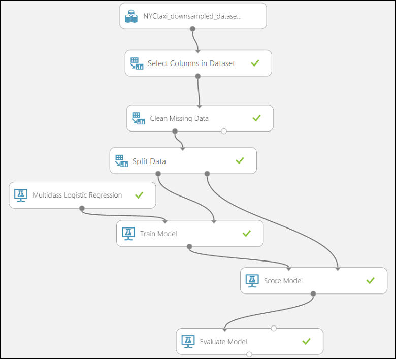
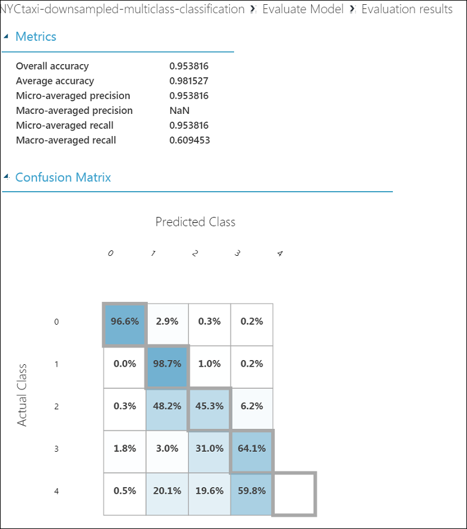

<properties
    pageTitle="Il processo di scienze Team dei dati in azione: usare Hadoop cluster | Microsoft Azure"
    description="Il processo di scienze dati del Team per uno scenario-to-end che utilizza un cluster di HDInsight Hadoop a compilare e distribuire un modello utilizzando un set di dati disponibile al pubblico."
    services="machine-learning,hdinsight"
    documentationCenter=""
    authors="bradsev"
    manager="jhubbard"
    editor="cgronlun" />

<tags
    ms.service="machine-learning"
    ms.workload="data-services"
    ms.tgt_pltfrm="na"
    ms.devlang="na"
    ms.topic="article"
    ms.date="09/19/2016"
    ms.author="hangzh;bradsev" />

# Il processo di scienze Team dei dati in azione: utilizzo dei cluster HDInsight Hadoop

In questa procedura dettagliata serve [Team dati scienza processo (TDSP)](data-science-process-overview.md) in uno scenario-to-end utilizzando un [cluster di Azure HDInsight Hadoop](https://azure.microsoft.com/services/hdinsight/) per archiviare, esplorare e presentare i dati tecnico il set di dati di [Roma Taxi trip](http://www.andresmh.com/nyctaxitrips/) disponibile al pubblico e in giù i dati di esempio. Modelli di dati vengono compilati con Azure apprendimento per gestire binaria e multiclass classificazione e regressione stima attività.

Per una procedura dettagliata che illustra come gestire un set di dati più grande (1 TB) per uno scenario simile utilizzando HDInsight Hadoop cluster di elaborazione dei dati, vedere [Team dati scienza processo - con Azure HDInsight Hadoop cluster su un set di dati di 1 TB](machine-learning-data-science-process-hive-criteo-walkthrough.md).

È inoltre possibile utilizzare un blocco appunti IPython per completare le attività descritte la procedura dettagliata tramite il set di dati di 1 TB. Gli utenti che si desiderano provare questo approccio è consigliabile consultare l'argomento [procedura dettagliata Criteo tramite una connessione ODBC Hive](https://github.com/Azure/Azure-MachineLearning-DataScience/blob/master/Misc/DataScienceProcess/iPythonNotebooks/machine-Learning-data-science-process-hive-walkthrough-criteo.ipynb) .

## Descrizione di set di dati di Roma Taxi viaggi

I dati di andata e ritorno Taxi Roma circa 20GB di file compressi con valori separati da virgola (CSV) (~ 48GB non compressi), che comprende trip singoli 173 milioni e le tariffe pagato per ogni viaggio. Ogni record di andata e ritorno include il ritiro e deposito il luogo e ora, hacker resi anonimi (driver) licenza numero e medallion (id univoco del taxi). I dati copre viaggi nell'anno 2013 e viene forniti il set di dati di due seguenti per ogni mese:

1. I file CSV di 'trip_data' contengono informazioni dettagliate di viaggio, ad esempio il numero di persone, ritiro e punti dropoff, la durata del viaggio e durata del viaggio. Di seguito sono riportati alcuni record di esempio:

        medallion,hack_license,vendor_id,rate_code,store_and_fwd_flag,pickup_datetime,dropoff_datetime,passenger_count,trip_time_in_secs,trip_distance,pickup_longitude,pickup_latitude,dropoff_longitude,dropoff_latitude
        89D227B655E5C82AECF13C3F540D4CF4,BA96DE419E711691B9445D6A6307C170,CMT,1,N,2013-01-01 15:11:48,2013-01-01 15:18:10,4,382,1.00,-73.978165,40.757977,-73.989838,40.751171
        0BD7C8F5BA12B88E0B67BED28BEA73D8,9FD8F69F0804BDB5549F40E9DA1BE472,CMT,1,N,2013-01-06 00:18:35,2013-01-06 00:22:54,1,259,1.50,-74.006683,40.731781,-73.994499,40.75066
        0BD7C8F5BA12B88E0B67BED28BEA73D8,9FD8F69F0804BDB5549F40E9DA1BE472,CMT,1,N,2013-01-05 18:49:41,2013-01-05 18:54:23,1,282,1.10,-74.004707,40.73777,-74.009834,40.726002
        DFD2202EE08F7A8DC9A57B02ACB81FE2,51EE87E3205C985EF8431D850C786310,CMT,1,N,2013-01-07 23:54:15,2013-01-07 23:58:20,2,244,.70,-73.974602,40.759945,-73.984734,40.759388
        DFD2202EE08F7A8DC9A57B02ACB81FE2,51EE87E3205C985EF8431D850C786310,CMT,1,N,2013-01-07 23:25:03,2013-01-07 23:34:24,1,560,2.10,-73.97625,40.748528,-74.002586,40.747868

2. I file CSV 'trip_fare' contengano i dettagli della tariffa pagata per ogni viaggio, ad esempio tipo di pagamento, Importo tariffa, supplemento e le imposte, suggerimenti e pedaggio e l'importo totale pagato. Di seguito sono riportati alcuni record di esempio:

        medallion, hack_license, vendor_id, pickup_datetime, payment_type, fare_amount, surcharge, mta_tax, tip_amount, tolls_amount, total_amount
        89D227B655E5C82AECF13C3F540D4CF4,BA96DE419E711691B9445D6A6307C170,CMT,2013-01-01 15:11:48,CSH,6.5,0,0.5,0,0,7
        0BD7C8F5BA12B88E0B67BED28BEA73D8,9FD8F69F0804BDB5549F40E9DA1BE472,CMT,2013-01-06 00:18:35,CSH,6,0.5,0.5,0,0,7
        0BD7C8F5BA12B88E0B67BED28BEA73D8,9FD8F69F0804BDB5549F40E9DA1BE472,CMT,2013-01-05 18:49:41,CSH,5.5,1,0.5,0,0,7
        DFD2202EE08F7A8DC9A57B02ACB81FE2,51EE87E3205C985EF8431D850C786310,CMT,2013-01-07 23:54:15,CSH,5,0.5,0.5,0,0,6
        DFD2202EE08F7A8DC9A57B02ACB81FE2,51EE87E3205C985EF8431D850C786310,CMT,2013-01-07 23:25:03,CSH,9.5,0.5,0.5,0,0,10.5

Chiave univoca per partecipare di andata e ritorno\_dati e andata e ritorno\_tariffa è composta dai campi: medallion le maggiori\_titolo e ritiro\_datetime.

Per visualizzare tutti i dettagli importanti per un viaggio specifico, è sufficiente partecipare con tre chiavi: "medallion", "modificare\_licenza" e "ritiro\_datetime".

Vengono descritte alcune ulteriori dettagli dei dati quando vengono archiviate in tabelle Hive subito.

## Esempi di attività di stima
Quando i dati per determinare il tipo di stime che si desidera rendere per raggiungere in base all'analisi consente di chiarire le attività che è necessario includere nel processo.
Ecco tre esempi di problemi di previsione rivolte in questa procedura dettagliata in base a cui formulazione nel *suggerimento\_importo*:

1. **Classificazione binaria**: prevedere o meno un suggerimento è stato pagato per un viaggio, ad esempio un *suggerimento\_importo* che è maggiore rispetto a 0 è illustrato un esempio positivo, mentre un *suggerimento\_importo* di $0 è illustrato un esempio negativo.

        Class 0 : tip_amount = $0
        Class 1 : tip_amount > $0

2. **Classificazione multiclass**: prevedere l'intervallo di importi di suggerimento pagato per il viaggio. Si divide il *suggerimento\_importo* in cinque bin o classi:

        Class 0 : tip_amount = $0
        Class 1 : tip_amount > $0 and tip_amount <= $5
        Class 2 : tip_amount > $5 and tip_amount <= $10
        Class 3 : tip_amount > $10 and tip_amount <= $20
        Class 4 : tip_amount > $20

3. **Attività di regressione**: per stimare la quantità di suggerimento pagato per un viaggio.  

## Configurare un cluster di HDInsight Hadoop analitica avanzate

>[AZURE.NOTE] Si tratta in genere di un'attività di **amministrazione** .

È possibile configurare un ambiente Azure per analitica avanzate che utilizza un cluster di HDInsight in tre passaggi:

1. [Creare un account di archiviazione](../storage/storage-create-storage-account.md): questo account di archiviazione viene utilizzato per l'archiviazione dei dati in archiviazione Blob Azure. Dati utilizzati in HDInsight cluster si trovano anche qui.

2. [Personalizzare Azure HDInsight Hadoop cluster per il processo Analitica avanzate e la tecnologia](machine-learning-data-science-customize-hadoop-cluster.md). Questo passaggio verrà creata una Hadoop di Azure HDInsight cluster a 64 bit Anaconda Python 2.7 installato su tutti i nodi. Sono disponibili due passaggi importanti da ricordare durante la personalizzazione del cluster HDInsight.

    * È necessario ricordare di collegare l'account di archiviazione creato nel passaggio 1 con i cluster HDInsight dopo averlo creato. Questo account di archiviazione viene utilizzato per accedere ai dati elaborati all'interno del cluster.

    * Dopo aver creato il cluster, abilitare l'accesso remoto per il nodo principale del cluster. Passare alla scheda **configurazione** e fare clic su **Abilita remoto**. Questo passaggio consente di specificare le credenziali utente utilizzate per l'accesso remoto.

3. [Creare un'area di lavoro Azure Machine formazione](machine-learning-create-workspace.md): questo computer di Azure apprendimento area di lavoro viene usato per la creazione di modelli di risorse computer. Questa operazione è indirizzata dopo il completamento di un'esplorazione dati iniziali e verso il basso campioni utilizzando cluster HDInsight.

## Recuperare i dati da una fonte pubblica

>[AZURE.NOTE] Si tratta in genere di un'attività di **amministrazione** .

Per ottenere il set di dati di [Roma Taxi trip](http://www.andresmh.com/nyctaxitrips/) dalla posizione pubblica, si può usare uno dei metodi descritti in [Spostare dati da e verso archiviazione Blob Azure](machine-learning-data-science-move-azure-blob.md) per copiare i dati nel computer in uso.

Di seguito vengono descritti come utilizzare AzCopy per trasferire file contenenti i dati. Per scaricare e installare AzCopy seguire le istruzioni nella [Guida introduttiva con l'utilità della riga di comando AzCopy](../storage/storage-use-azcopy.md).

1. Dalla finestra del Prompt dei comandi di seguito AzCopy, sostituendo *< path_to_data_folder >* con la destinazione desiderata:

        "C:\Program Files (x86)\Microsoft SDKs\Azure\AzCopy\azcopy" /Source:https://nyctaxitrips.blob.core.windows.net/data /Dest:<path_to_data_folder> /S

2. Dopo avere completato la copia, un totale di 24 file compressi sono nella cartella dati scelta. Decomprimere i file scaricati nella stessa cartella del computer locale. Prendere nota della cartella in cui risiedono i file compressi. Questa cartella verrà indicata come la *< percorso\_a\_unzipped_data\_file\> * è quello che segue.

## Caricare i dati per il contenitore predefinito di Azure HDInsight Hadoop cluster

>[AZURE.NOTE] Si tratta in genere di un'attività di **amministrazione** .

In comandi AzCopy seguenti, sostituire i parametri seguenti con i valori effettivi specificato quando si crea cluster Hadoop e decomprimere i file di dati.

* ***& #60; path_to_data_folder >*** nella directory (insieme percorso) nel computer che contengono i file di dati decompresso  
* ***& #60; nome dell'account di archiviazione di cluster Hadoop >*** l'account di archiviazione associato il cluster HDInsight
* ***& #60; contenitore predefinito di cluster Hadoop >*** il contenitore predefinito utilizzato per il cluster. Si noti che il nome del contenitore predefinito in genere è lo stesso nome cluster stesso. Ad esempio, se il cluster è chiamato "abc123.azurehdinsight.net", il contenitore predefinito è abc123.
* ***& #60; chiave account lo spazio di archiviazione >*** il tasto per l'account di archiviazione utilizzato per il cluster

Da un prompt dei comandi oppure una finestra di Windows PowerShell nel computer in uso, eseguire i seguenti comandi AzCopy.

Questo comando consente di caricare i dati di andata e ritorno alla directory ***nyctaxitripraw*** nel contenitore predefinito del cluster Hadoop.

        "C:\Program Files (x86)\Microsoft SDKs\Azure\AzCopy\azcopy" /Source:<path_to_unzipped_data_files> /Dest:https://<storage account name of Hadoop cluster>.blob.core.windows.net/<default container of Hadoop cluster>/nyctaxitripraw /DestKey:<storage account key> /S /Pattern:trip_data_*.csv

Questo comando consente di caricare i dati tariffa directory ***nyctaxifareraw*** nel contenitore predefinito del cluster Hadoop.

        "C:\Program Files (x86)\Microsoft SDKs\Azure\AzCopy\azcopy" /Source:<path_to_unzipped_data_files> /Dest:https://<storage account name of Hadoop cluster>.blob.core.windows.net/<default container of Hadoop cluster>/nyctaxifareraw /DestKey:<storage account key> /S /Pattern:trip_fare_*.csv

I dati dovrebbero ora in archiviazione Blob Azure e pronti per l'utilizzo all'interno del cluster HDInsight.

## Accedere a nodo principale del cluster Hadoop ed e prepararsi per l'analisi di dati esplorativo

>[AZURE.NOTE] Si tratta in genere di un'attività di **amministrazione** .

Per accedere a nodo principale del cluster per analisi dei dati esplorativo e verso il basso campioni dei dati, seguire la procedura descritta in [Access Hadoop Cluster testa nodi](machine-learning-data-science-customize-hadoop-cluster.md#headnode).

In questa procedura dettagliata è principalmente utilizzare query scritte in [Hive](https://hive.apache.org/), un linguaggio di query simili a SQL, per eseguire analisi dati preliminari. Le query Hive vengono archiviate in file .hql. È quindi verso il basso questo dati di esempio da utilizzare all'interno di Azure Machine formazione per la creazione di modelli.

Per eseguire l'analisi dei dati esplorativo, abbiamo scaricare i file .hql contenente gli script Hive pertinenti da [github](https://github.com/Azure/Azure-MachineLearning-DataScience/tree/master/Misc/DataScienceProcess/DataScienceScripts) in una directory locale (C:\temp) sul nodo principale. A tale scopo, aprire il **prompt dei comandi** all'interno di nodo principale del cluster ed eseguire due comandi seguenti:

    set script='https://raw.githubusercontent.com/Azure/Azure-MachineLearning-DataScience/master/Misc/DataScienceProcess/DataScienceScripts/Download_DataScience_Scripts.ps1'

    @powershell -NoProfile -ExecutionPolicy unrestricted -Command "iex ((new-object net.webclient).DownloadString(%script%))"

Questi due comandi Scarica tutti i file di .hql necessari in questa procedura dettagliata nella directory locale ***C:\temp & 92 #;*** in nodo principale.

## Creare database Hive e tabelle suddivise per mese

>[AZURE.NOTE] Si tratta in genere di un'attività di **amministrazione** .

È ora sono pronti per creare tabelle Hive per il set di dati taxi Roma.
Nel nodo principale del cluster Hadoop, aprire la ***riga di comando Hadoop*** sul desktop del nodo principale e immettere la directory Hive immettendo il comando

    cd %hive_home%\bin

>[AZURE.NOTE] **Eseguire tutti i comandi di Hive in questa procedura dettagliata del Raccoglitore Hive sopra / prompt dei comandi. Questo consente di risolvere eventuali problemi di percorso automaticamente. Serve i termini "Hive prompt dei comandi", "bin Hive / prompt dei comandi" e "riga di comando Hadoop" in modo intercambiabile in questa procedura dettagliata.**

Dal prompt di directory Hive immettere il comando seguente in Hadoop riga di comando di nodo principale per eseguire la query Hive per creare tabelle e database Hive:

    hive -f "C:\temp\sample_hive_create_db_and_tables.hql"

Ecco il contenuto della ***C:\temp\sample\_hive\_creare\_db\_e\_tables.hql*** file che consente di creare Hive ***nyctaxidb*** e le tabelle a un database ***viaggio*** e ***tariffa***.

    create database if not exists nyctaxidb;

    create external table if not exists nyctaxidb.trip
    (
        medallion string,
        hack_license string,
        vendor_id string,
        rate_code string,
        store_and_fwd_flag string,
        pickup_datetime string,
        dropoff_datetime string,
        passenger_count int,
        trip_time_in_secs double,
        trip_distance double,
        pickup_longitude double,
        pickup_latitude double,
        dropoff_longitude double,
        dropoff_latitude double)  
    PARTITIONED BY (month int)
    ROW FORMAT DELIMITED FIELDS TERMINATED BY ',' lines terminated by '\n'
    STORED AS TEXTFILE LOCATION 'wasb:///nyctaxidbdata/trip' TBLPROPERTIES('skip.header.line.count'='1');

    create external table if not exists nyctaxidb.fare
    (
        medallion string,
        hack_license string,
        vendor_id string,
        pickup_datetime string,
        payment_type string,
        fare_amount double,
        surcharge double,
        mta_tax double,
        tip_amount double,
        tolls_amount double,
        total_amount double)
    PARTITIONED BY (month int)
    ROW FORMAT DELIMITED FIELDS TERMINATED BY ',' lines terminated by '\n'
    STORED AS TEXTFILE LOCATION 'wasb:///nyctaxidbdata/fare' TBLPROPERTIES('skip.header.line.count'='1');

Questo script Hive crea due tabelle:

* la tabella "viaggio" contiene i dettagli di andata e ritorno di ogni corsa (dettagli del driver, prelievo ora, distanza di andata e ritorno e volte)
* la tabella "tariffa" contiene dettagli tariffa (Importo tariffa, importo suggerimento, pedaggio e supplementi).

Se è necessario un'ulteriore assistenza con queste procedure o si desidera analizzare quelli alternativi, vedere la sezione [query inviare Hive direttamente da Hadoop riga di comando ](machine-learning-data-science-move-hive-tables.md#submit).

## Caricare i dati alle tabelle Hive dalle partizioni

>[AZURE.NOTE] Si tratta in genere di un'attività di **amministrazione** .

Il set di dati taxi Roma sono suddivisione naturale per mese, utilizzata per rendere velocizzare i tempi di elaborazione e query. I comandi di PowerShell seguenti (emessi dalla directory Hive utilizzando la **riga di comando Hadoop**) caricare dati alle tabelle di Hive "viaggio" e "tariffa" suddivise per mese.

    for /L %i IN (1,1,12) DO (hive -hiveconf MONTH=%i -f "C:\temp\sample_hive_load_data_by_partitions.hql")

Il *esempio\_hive\_caricare\_dati\_da\_partitions.hql* file contiene i comandi seguenti **caricare** .

    LOAD DATA INPATH 'wasb:///nyctaxitripraw/trip_data_${hiveconf:MONTH}.csv' INTO TABLE nyctaxidb.trip PARTITION (month=${hiveconf:MONTH});
    LOAD DATA INPATH 'wasb:///nyctaxifareraw/trip_fare_${hiveconf:MONTH}.csv' INTO TABLE nyctaxidb.fare PARTITION (month=${hiveconf:MONTH});

Si noti che un numero di query Hive che serve nel processo di esplorazione implica la ricerca in una partizione di singola o di un paio di partizioni. Ma potrebbero eseguire il queste query su tutti i dati.

### Visualizzare i database cluster HDInsight Hadoop

Per visualizzare i database creati cluster HDInsight Hadoop all'interno della finestra della riga di comando Hadoop, eseguire il comando seguente nella riga di comando di Hadoop:

    hive -e "show databases;"

### Visualizzare le tabelle Hive nel database nyctaxidb

Per visualizzare le tabelle del database nyctaxidb, eseguire il comando seguente nella riga di comando di Hadoop:

    hive -e "show tables in nyctaxidb;"

È possibile confermare che le tabelle sono suddivisi mediante il comando seguente:

    hive -e "show partitions nyctaxidb.trip;"

Di seguito è riportato l'output previsto:

    month=1
    month=10
    month=11
    month=12
    month=2
    month=3
    month=4
    month=5
    month=6
    month=7
    month=8
    month=9
    Time taken: 2.075 seconds, Fetched: 12 row(s)

Allo stesso modo, è possibile assicurarsi che la tabella tariffa è suddiviso mediante il comando seguente:

    hive -e "show partitions nyctaxidb.fare;"

Di seguito è riportato l'output previsto:

    month=1
    month=10
    month=11
    month=12
    month=2
    month=3
    month=4
    month=5
    month=6
    month=7
    month=8
    month=9
    Time taken: 1.887 seconds, Fetched: 12 row(s)

## Progettazione di funzionalità in Hive e l'esplorazione dei dati

>[AZURE.NOTE] Si tratta in genere di un'attività **Scienziato dati** .

La caratteristica ingegneria attività per i dati caricati in tabelle Hive e l'esplorazione dei dati può essere eseguite l'utilizzo delle query Hive. Ecco alcuni esempi di tali attività che verrà descritta in questa sezione:

- Visualizzare i primi 10 in entrambe le tabelle.
- Esplorare le distribuzioni di dati di alcuni campi diversi Windows ora.
- Provare a utilizzare qualità dei dati dei campi latitudine e longitudine.
- Generare in base a etichette di classificazione binario e multiclass il **suggerimento\_importo**.
- Generare caratteristiche calcolando la distanza di andata e ritorno diretto.

### Esplorazione: Visualizzare i record primi 10 in viaggio di tabella

>[AZURE.NOTE] Si tratta in genere di un'attività **Scienziato dati** .

Per visualizzare l'aspetto dei dati, verranno esaminati 10 record da ogni tabella. Eseguire le seguenti due query separatamente dal prompt di directory Hive nella console di riga di comando Hadoop per controllare i record.

Per ottenere i record primi 10 descritti nella tabella "viaggio" dal primo mese:

    hive -e "select * from nyctaxidb.trip where month=1 limit 10;"

Per ottenere i primi 10 record nella tabella "tariffa" dal primo mese:

    hive -e "select * from nyctaxidb.fare where month=1 limit 10;"

Può essere utile per salvare i record in un file per la visualizzazione comodo. Modifica di piccole dimensioni per la query precedente esegue questa operazione:

    hive -e "select * from nyctaxidb.fare where month=1 limit 10;" > C:\temp\testoutput

### Esplorazione: Consente di visualizzare il numero di record in ognuna delle 12 partizioni

>[AZURE.NOTE] Si tratta in genere di un'attività **Scienziato dati** .

Di interesse è come il numero di viaggi varia nel corso dell'anno di calendario. Raggruppamento in base al mese consente di visualizzare l'aspetto di questa distribuzione di trip.

    hive -e "select month, count(*) from nyctaxidb.trip group by month;"

In questo modo si ottiene l'output:

    1       14776615
    2       13990176
    3       15749228
    4       15100468
    5       15285049
    6       14385456
    7       13823840
    8       12597109
    9       14107693
    10      15004556
    11      14388451
    12      13971118
    Time taken: 283.406 seconds, Fetched: 12 row(s)

In questo caso, la prima colonna è il mese e la seconda è il numero di trip per mese.

È anche possibile contare il numero totale di record il set di dati di andata e ritorno mediante il comando seguente al prompt di directory Hive.

    hive -e "select count(*) from nyctaxidb.trip;"

Questa operazione si ottiene:

    173179759
    Time taken: 284.017 seconds, Fetched: 1 row(s)

Usando i comandi simili a quelli visualizzati per il set di dati di viaggio, è possibile eseguire query di Hive dal prompt di directory Hive per il set di dati tariffa convalidare il numero di record.

    hive -e "select month, count(*) from nyctaxidb.fare group by month;"

In questo modo si ottiene l'output:

    1       14776615
    2       13990176
    3       15749228
    4       15100468
    5       15285049
    6       14385456
    7       13823840
    8       12597109
    9       14107693
    10      15004556
    11      14388451
    12      13971118
    Time taken: 253.955 seconds, Fetched: 12 row(s)

Si noti che viene restituito lo stesso numero esatto di viaggi al mese per entrambi gli insiemi di dati. In questo modo la convalida prima che i dati sono stati caricati correttamente.

Conteggio del numero totale di record nel set di dati tariffa può essere eseguito con il comando seguente dal prompt di directory Hive:

    hive -e "select count(*) from nyctaxidb.fare;"

Questa operazione si ottiene:

    173179759
    Time taken: 186.683 seconds, Fetched: 1 row(s)

Il numero totale di record in entrambe le tabelle è lo stesso. In questo modo una seconda convalida che i dati sono stati caricati correttamente.

### Esplorazione: Distribuzione di andata e ritorno da medallion

>[AZURE.NOTE] Si tratta in genere di un'attività **Scienziato dati** .

In questo esempio identifica medallion (taxi numeri) con più di 100 trip all'interno di un periodo di tempo specificato. Vantaggi di query da access la tabella partizionata poiché è subordinato partizione variabile **mese**. I risultati della query vengono scritte in un file locale queryoutput.tsv in `C:\temp` sul nodo principale.

    hive -f "C:\temp\sample_hive_trip_count_by_medallion.hql" > C:\temp\queryoutput.tsv

Ecco il contenuto di *esempio\_hive\_viaggio\_conteggio\_da\_medallion.hql* file per la verifica.

    SELECT medallion, COUNT(*) as med_count
    FROM nyctaxidb.fare
    WHERE month<=3
    GROUP BY medallion
    HAVING med_count > 100
    ORDER BY med_count desc;

Medallion nel set di dati taxi Roma identifica un cab univoco. È possibile identificare quali CAB sono "occupato" chiedendo quelle apportate più di un determinato numero di viaggi in un determinato periodo di tempo. Nell'esempio seguente identifica CAB che sono stati resi oltre cento trip in tre mesi prima e consente di salvare i risultati della query in un file locale C:\temp\queryoutput.tsv.

Ecco il contenuto di *esempio\_hive\_viaggio\_conteggio\_da\_medallion.hql* file per la verifica.

    SELECT medallion, COUNT(*) as med_count
    FROM nyctaxidb.fare
    WHERE month<=3
    GROUP BY medallion
    HAVING med_count > 100
    ORDER BY med_count desc;

Dal prompt di directory Hive il comando seguente:

    hive -f "C:\temp\sample_hive_trip_count_by_medallion.hql" > C:\temp\queryoutput.tsv

### Esplorazione: Distribuzione di andata e ritorno medallion e hack_license

>[AZURE.NOTE] Si tratta in genere di un'attività **Scienziato dati** .

Durante l'esplorazione un set di dati, è spesso necessario esaminare il numero di occorrenze co dei gruppi di valori. In questa sezione viene fornito un esempio di come eseguire questa operazione per i driver e file CAB.

Il *esempio\_hive\_viaggio\_conteggio\_da\_medallion\_license.hql* file raggruppa il set di dati tariffa "medallion" e "hack_license" e restituisce conteggi di ogni combinazione. Di seguito sono il relativo contenuto.

    SELECT medallion, hack_license, COUNT(*) as trip_count
    FROM nyctaxidb.fare
    WHERE month=1
    GROUP BY medallion, hack_license
    HAVING trip_count > 100
    ORDER BY trip_count desc;

Questa query restituisce cab e le combinazioni di driver specifico ordinati in base al numero decrescente di trip.

Dal prompt di directory Hive eseguire:

    hive -f "C:\temp\sample_hive_trip_count_by_medallion_license.hql" > C:\temp\queryoutput.tsv

I risultati della query vengono scritte in un file locale C:\temp\queryoutput.tsv.

### Esplorazione: Valutazione della qualità di dati selezionando record latitudine/longitudine non valida

>[AZURE.NOTE] Si tratta in genere di un'attività **Scienziato dati** .

Degli obiettivi comune dell'analisi dei dati esplorativo è eliminare i record non valido. Nell'esempio riportato in questa sezione determina se campi latitudine o longitudine contengono un valore molto di fuori area Roma. Dal momento che è probabile che tale record che contengono un valori errati longitudine-latitudine, è possibile eliminarli da tutti i dati che deve essere utilizzato per una modellazione.

Ecco il contenuto di *esempio\_hive\_qualità\_assessment.hql* file per la verifica.

        SELECT COUNT(*) FROM nyctaxidb.trip
        WHERE month=1
        AND  (CAST(pickup_longitude AS float) NOT BETWEEN -90 AND -30
        OR    CAST(pickup_latitude AS float) NOT BETWEEN 30 AND 90
        OR    CAST(dropoff_longitude AS float) NOT BETWEEN -90 AND -30
        OR    CAST(dropoff_latitude AS float) NOT BETWEEN 30 AND 90);

Dal prompt di directory Hive eseguire:

    hive -S -f "C:\temp\sample_hive_quality_assessment.hql"

L'argomento *-S* incluso in questo comando Elimina stampa schermo lo stato dei processi Hive mapping e riduzione. In questo modo, semplifica la schermata stampa di output della query Hive più leggibile.

### Esplorazione: Distribuzioni classe binaria di suggerimenti di andata e ritorno

> [AZURE.NOTE] Si tratta in genere di un'attività **Scienziato dati** .

Per il problema di classificazione binario descritto nella sezione [esempi di attività di stima](machine-learning-data-science-process-hive-walkthrough.md#mltasks) , è utile sapere se è stato assegnato un suggerimento o meno. La distribuzione di suggerimenti è binaria:

* Suggerimento dato (classe 1, suggerimento\_importo > 0)  
* Nessun suggerimento (classe 0, suggerimento\_importo = $0).

Il *esempio\_hive\_inclinato\_frequencies.hql* responsabile file riportato di seguito.

    SELECT tipped, COUNT(*) AS tip_freq
    FROM
    (
        SELECT if(tip_amount > 0, 1, 0) as tipped, tip_amount
        FROM nyctaxidb.fare
    )tc
    GROUP BY tipped;

Dal prompt di directory Hive eseguire:

    hive -f "C:\temp\sample_hive_tipped_frequencies.hql"

### Esplorazione: Classe distribuzioni nell'impostazione multiclass

> [AZURE.NOTE] Si tratta in genere di un'attività **Scienziato dati** .

Per il problema di classificazione multiclass descritto nella sezione [esempi di attività di stima](machine-learning-data-science-process-hive-walkthrough.md#mltasks) il set di dati anche consente a una classificazione naturale in cui si desidera prevedere la quantità di suggerimenti specificato. È possibile utilizzare bin per definire gli intervalli di suggerimento nella query. Per ottenere le distribuzioni di classe per i vari suggerimento intervalli, viene utilizzata la *esempio\_hive\_suggerimento\_intervallo\_frequencies.hql* file. Di seguito sono il relativo contenuto.

    SELECT tip_class, COUNT(*) AS tip_freq
    FROM
    (
        SELECT if(tip_amount=0, 0,
            if(tip_amount>0 and tip_amount<=5, 1,
            if(tip_amount>5 and tip_amount<=10, 2,
            if(tip_amount>10 and tip_amount<=20, 3, 4)))) as tip_class, tip_amount
        FROM nyctaxidb.fare
    )tc
    GROUP BY tip_class;

Eseguire il comando seguente dalla riga di comando Hadoop console:

    hive -f "C:\temp\sample_hive_tip_range_frequencies.hql"

### Esplorazione: Calcolare diretto distanza tra due posizioni latitudine longitudine

> [AZURE.NOTE] Si tratta in genere di un'attività **Scienziato dati** .

Con una misura della distanza diretta consente di scoprire la differenza tra i file e la distanza di viaggio effettivo. Questa caratteristica è motivare identificando che potrebbe essere meno probabile che Suggerimento Se sono stabilire che il driver intenzionalmente state loro da una route più un passeggero.

Per visualizzare il confronto tra distanza viaggio effettivo e [Haversine distanza](http://en.wikipedia.org/wiki/Haversine_formula) tra due punti latitudine longitudine (la distanza "grande ciclo"), serve trigonometriche disponibile all'interno di Hive, in questo modo:

    set R=3959;
    set pi=radians(180);

    insert overwrite directory 'wasb:///queryoutputdir'

    select pickup_longitude, pickup_latitude, dropoff_longitude, dropoff_latitude, trip_distance, trip_time_in_secs,
    ${hiveconf:R}*2*2*atan((1-sqrt(1-pow(sin((dropoff_latitude-pickup_latitude)
     *${hiveconf:pi}/180/2),2)-cos(pickup_latitude*${hiveconf:pi}/180)
     *cos(dropoff_latitude*${hiveconf:pi}/180)*pow(sin((dropoff_longitude-pickup_longitude)*${hiveconf:pi}/180/2),2)))
     /sqrt(pow(sin((dropoff_latitude-pickup_latitude)*${hiveconf:pi}/180/2),2)
     +cos(pickup_latitude*${hiveconf:pi}/180)*cos(dropoff_latitude*${hiveconf:pi}/180)*
     pow(sin((dropoff_longitude-pickup_longitude)*${hiveconf:pi}/180/2),2))) as direct_distance
    from nyctaxidb.trip
    where month=1
    and pickup_longitude between -90 and -30
    and pickup_latitude between 30 and 90
    and dropoff_longitude between -90 and -30
    and dropoff_latitude between 30 and 90;

Nella query, R è il raggio terra in miglia e pi greco viene convertita in radianti. Si noti che i punti di longitudine latitudine sono "filtrati" per rimuovere i valori che non sono nell'area Roma.

In questo caso è scrivere i risultati di una directory denominata "queryoutputdir". La sequenza di comandi riportato di seguito prima di tutto directory output viene creata e quindi esegue il comando Hive.

Dal prompt di directory Hive eseguire:

    hdfs dfs -mkdir wasb:///queryoutputdir

    hive -f "C:\temp\sample_hive_trip_direct_distance.hql"

I risultati della query vengono scritte a 9 BLOB Azure ***queryoutputdir/000000\_0*** a ***queryoutputdir/000008\_0*** all'interno del contenitore predefinito del cluster Hadoop.

Per visualizzare le dimensioni di ogni BLOB, è il seguente comando dal prompt di directory Hive:

    hdfs dfs -ls wasb:///queryoutputdir

Per visualizzare il contenuto di un file specifico, ad esempio 000000\_0, serve del Hadoop `copyToLocal` comando, in questo modo.

    hdfs dfs -copyToLocal wasb:///queryoutputdir/000000_0 C:\temp\tempfile

> [AZURE.WARNING] `copyToLocal`può essere molto lento per i file di grandi dimensioni e scelta non consigliata per l'utilizzo con loro.  

Il vantaggio di disporre i dati si trovano in un archivio blob Azure è potremmo esamineremo i dati di Azure apprendimento utilizzando i [Dati di importazione] [ import-data] modulo.

## In basso di modelli di dati e compilazione di esempio apprendimento Azure

> [AZURE.NOTE] Si tratta in genere di un'attività **Scienziato dati** .

Dopo la fase di analisi dei dati esplorativo, si sta per essere verso il basso esempio i dati per la creazione di modelli di apprendimento Azure. In questa sezione, ecco come usare una query Hive in esempio i dati, quindi accedervi da [Importare dati] [ import-data] modulo di Azure apprendimento.

### Verso il basso campionamento i dati

Sono disponibili due passaggi di questa procedura. Prima di tutto è unire le tabelle **nyctaxidb.trip** e **nyctaxidb.fare** in tre chiavi che partecipano a tutti i record: "medallion", "modificare\_licenza", e "ritiro\_datetime". È poi generare un'etichetta di classificazione binario **inclinato** e un'etichetta di classificazione multi-classe **suggerimento\_classe**.

Per poter utilizzare la freccia giù dati direttamente da [Importare dati] campionati[ import-data] modulo apprendimento Azure, è necessario archiviare i risultati della query precedente a una tabella Hive interna. In rata, verrà creato una tabella Hive interna e compilare il relativo contenuto con il join e verso il basso dati campionati.

La query si applica funzioni Hive standard direttamente per generare l'ora del giorno, settimana dell'anno, del giorno della settimana (lunedì l'acronimo 1 e 7 è l'acronimo domenica) dalla "ritiro\_datetime" campo e la distanza tra le posizioni ritiro e dropoff diretta. Gli utenti possono consultare [LanguageManual utente](https://cwiki.apache.org/confluence/display/Hive/LanguageManual+UDF) per un elenco completo di tali funzioni.

La query quindi esempi verso il basso i dati in modo che i risultati della query possono essere visualizzati in Azure Machine Learning Studio. Solo circa 1% del set di dati originale viene importato in di Studio.

Di seguito sono il contenuto di *esempio\_hive\_preparare\_per\_elenco parti fornitore\_full.hql* file che prepara i dati per l'apprendimento Azure di compilazione del modello.

        set R = 3959;
        set pi=radians(180);

        create table if not exists nyctaxidb.nyctaxi_downsampled_dataset (

        medallion string,
        hack_license string,
        vendor_id string,
        rate_code string,
        store_and_fwd_flag string,
        pickup_datetime string,
        dropoff_datetime string,
        pickup_hour string,
        pickup_week string,
        weekday string,
        passenger_count int,
        trip_time_in_secs double,
        trip_distance double,
        pickup_longitude double,
        pickup_latitude double,
        dropoff_longitude double,
        dropoff_latitude double,
        direct_distance double,
        payment_type string,
        fare_amount double,
        surcharge double,
        mta_tax double,
        tip_amount double,
        tolls_amount double,
        total_amount double,
        tipped string,
        tip_class string
        )
        row format delimited fields terminated by ','
        lines terminated by '\n'
        stored as textfile;

        --- now insert contents of the join into the above internal table

        insert overwrite table nyctaxidb.nyctaxi_downsampled_dataset
        select
        t.medallion,
        t.hack_license,
        t.vendor_id,
        t.rate_code,
        t.store_and_fwd_flag,
        t.pickup_datetime,
        t.dropoff_datetime,
        hour(t.pickup_datetime) as pickup_hour,
        weekofyear(t.pickup_datetime) as pickup_week,
        from_unixtime(unix_timestamp(t.pickup_datetime, 'yyyy-MM-dd HH:mm:ss'),'u') as weekday,
        t.passenger_count,
        t.trip_time_in_secs,
        t.trip_distance,
        t.pickup_longitude,
        t.pickup_latitude,
        t.dropoff_longitude,
        t.dropoff_latitude,
        t.direct_distance,
        f.payment_type,
        f.fare_amount,
        f.surcharge,
        f.mta_tax,
        f.tip_amount,
        f.tolls_amount,
        f.total_amount,
        if(tip_amount>0,1,0) as tipped,
        if(tip_amount=0,0,
        if(tip_amount>0 and tip_amount<=5,1,
        if(tip_amount>5 and tip_amount<=10,2,
        if(tip_amount>10 and tip_amount<=20,3,4)))) as tip_class

        from
        (
        select
        medallion,
        hack_license,
        vendor_id,
        rate_code,
        store_and_fwd_flag,
        pickup_datetime,
        dropoff_datetime,
        passenger_count,
        trip_time_in_secs,
        trip_distance,
        pickup_longitude,
        pickup_latitude,
        dropoff_longitude,
        dropoff_latitude,
        ${hiveconf:R}*2*2*atan((1-sqrt(1-pow(sin((dropoff_latitude-pickup_latitude)
        *${hiveconf:pi}/180/2),2)-cos(pickup_latitude*${hiveconf:pi}/180)
        *cos(dropoff_latitude*${hiveconf:pi}/180)*pow(sin((dropoff_longitude-pickup_longitude)*${hiveconf:pi}/180/2),2)))
        /sqrt(pow(sin((dropoff_latitude-pickup_latitude)*${hiveconf:pi}/180/2),2)
        +cos(pickup_latitude*${hiveconf:pi}/180)*cos(dropoff_latitude*${hiveconf:pi}/180)*pow(sin((dropoff_longitude-pickup_longitude)*${hiveconf:pi}/180/2),2))) as direct_distance,
        rand() as sample_key

        from nyctaxidb.trip
        where pickup_latitude between 30 and 90
            and pickup_longitude between -90 and -30
            and dropoff_latitude between 30 and 90
            and dropoff_longitude between -90 and -30
        )t
        join
        (
        select
        medallion,
        hack_license,
        vendor_id,
        pickup_datetime,
        payment_type,
        fare_amount,
        surcharge,
        mta_tax,
        tip_amount,
        tolls_amount,
        total_amount
        from nyctaxidb.fare
        )f
        on t.medallion=f.medallion and t.hack_license=f.hack_license and t.pickup_datetime=f.pickup_datetime
        where t.sample_key<=0.01

Per eseguire la query dal prompt di directory Hive:

    hive -f "C:\temp\sample_hive_prepare_for_aml_full.hql"

Avere una tabella interna "nyctaxidb.nyctaxi_downsampled_dataset" è possibile accedervi utilizzando i [Dati di importazione] [ import-data] modulo di Azure Machine Learning. Inoltre, si può utilizzare questo set di dati per la creazione di modelli di apprendimento.  

### Usare il modulo di importare dati in Azure apprendimento per accedere ai dati campionati verso il basso

Prerequisiti per eseguire una query di Hive nella finestra [Importa dati] [ import-data] modulo di Azure apprendimento, è necessario l'accesso a un'area di lavoro di Azure di apprendimento e accesso alle credenziali del cluster e il relativo account di archiviazione associato.

Alcuni dettagli su [Importa dati] [ import-data] modulo e i parametri di input:

**URI del server HCatalog**: se il nome del cluster è abc123 quindi semplicemente: https://abc123.azurehdinsight.net

**Nome dell'account utente Hadoop** : il nome utente selezionato per il cluster (**non** il nome utente di accesso remoto)

**Password dell'account utente Hadoop** : la password impostata per il cluster (**non** la password di accesso remoto)

**Posizione dei dati di output** : questa scelta come Azure.

**Nome dell'account di archiviazione Azure** : nome dell'account di archiviazione predefinito associato al cluster.

**Nome del contenitore di Azure** : questo è il nome del contenitore predefinito per il cluster e si è in genere lo stesso nome cluster. Per un cluster denominato "abc123", si tratta soltanto abc123.

> [AZURE.IMPORTANT] **Tutte le tabelle che si desidera eseguire una query utilizzando i [Dati di importazione] [ import-data] modulo di Azure apprendimento deve essere una tabella interna.** Un suggerimento per determinare se una tabella T in un database D.db è una tabella interna è come indicato di seguito.

Dal prompt di directory Hive comando:

    hdfs dfs -ls wasb:///D.db/T

Se la tabella è una tabella interna e viene popolata, deve presentare qui il relativo contenuto. Un altro modo per stabilire se una tabella è una tabella interna consiste nell'utilizzare Esplora aree dello spazio di archiviazione di Azure. Utilizzarla per passare al nome del contenitore predefinito del cluster e quindi filtrare in base al nome della tabella. Se la tabella e il relativo contenuto visualizzata, ciò significa che si tratti di una tabella interna.

Di seguito è uno snapshot della query Hive e [Importare dati] [ import-data] modulo:

Si noti che dopo il nostro giù dati campionati si trovano nel contenitore predefinito, la query Hive risultante dall'apprendimento Azure è molto semplice e solo un "selezionare * da nyctaxidb.nyctaxi\_sottocampionate\_dati".

Il set di dati ora può essere utilizzato come punto di partenza per la creazione di modelli di apprendimento.

### Creare modelli di apprendimento Azure

Ora è possibile procedere per la compilazione del modello e distribuzione di modelli di [Apprendimento Azure](https://studio.azureml.net). I dati sono pronti per noi da utilizzare nella risoluzione dei problemi di previsione indicati sopra:

**1. binaria classificazione**: prevedere o meno un suggerimento è stato pagato per un viaggio.

**Studente utilizzato:** Regressione logistica due classe

un. Per questo problema, l'etichetta di destinazione (o classe) è "inclinata". Il set di dati ridotti originale sono alcune delle colonne che fanno perdite di destinazione per la prova la classificazione. In particolare: suggerimento\_per la classe, suggerimento\_quantità e totale\_importo rivela informazioni etichetta di destinazione che non sono disponibile in verifica ora. Abbiamo rimuovere queste colonne tenere in considerazione tramite le [Colonne selezionate in set di dati] [ select-columns] modulo.

Snapshot riportata di seguito illustra il nostro prova prevedere o meno un suggerimento è stato pagato per un viaggio specificato.

b. Per questo esercizio, il nostro distribuzioni etichetta destinazione erano circa 1:1.

Snapshot seguente mostra la distribuzione di suggerimento etichette di classe per il problema di classificazione binario.

Di conseguenza, si ottengono un AUC di 0.987 come illustrato nella figura seguente.

**2. classificazione multiclass**: prevedere l'intervallo di importi di suggerimento pagato viaggio, utilizzando le classi definite in precedenza.

**Studente utilizzato:** Regressione logistica multiclass

un. Per questo problema, l'etichetta di destinazione (o classe) è "suggerimento\_classe" che può eseguire una delle cinque valori (0,1,2,3,4). Come nel caso di classificazione binario, sono alcune delle colonne che fanno perdite di destinazione per questa prova. In particolare: inclinato, suggerimento\_importo totale\_importo rivela informazioni etichetta di destinazione che non sono disponibile in verifica ora. Rimozione di queste colonne utilizzando le [Colonne selezionate in set di dati] [ select-columns] modulo.

Snapshot riportata di seguito illustra il nostro prova prevedere collocazione un suggerimento di cadere (classe 0: suggerimento = $0, classe 1: suggerimento > $0 e suggerimento < = $5, classe 2: suggerimento > $5 e suggerimento < = $10, classe 3: suggerimento > $10 e suggerimento < = $20, classe 4: suggerimento > $20)

Questo webinar Mostra ora aspetto sulla distribuzione di classe test effettivo. È possibile vedere mentre classe 0 e 1 classe diffusi, altre classi sono rari.

b. Per questo esercizio, una matrice di confusione vengono utilizzati per esaminare il nostro accuratezza stima. Come illustrato di seguito.

Nota che mentre il nostro accuratezza classe sulle classi diffusi è molto utile, il modello non esegue un buon lavoro "learning" su classi rari.

**3. attività di regressione**: per stimare la quantità di suggerimento pagato per un viaggio.

**Studente utilizzato:** Albero decisionale invece un incremento

un. Per questo problema, l'etichetta di destinazione (o classe) è "suggerimento\_importo". In questo caso sono le perdite di destinazione: inclinato, suggerimento\_classe totale\_importo; tutte le variabili visualizzare informazioni sulla quantità suggerimento che non è disponibile in genere verificare ora. Rimozione di queste colonne utilizzando le [Colonne selezionate in set di dati] [ select-columns] modulo.

Belows snapshot Mostra il nostro prova per stimare la quantità di suggerimento specificato.

b. Per problemi di regressione è misura accuratezza di nostro previsione esaminando l'errore quadrato nelle stime, il coefficiente di determinazione e così via. Questo webinar mostra questi riportata di seguito.

È possibile vedere che coefficiente di determinazione tratta 0.709, per indicare circa 71% della varianza è spiegato dalla coefficienti modello.

> [AZURE.IMPORTANT] Per ulteriori informazioni su Azure apprendimento e su come accedere e usarlo, fare riferimento a [che cos'è l'apprendimento?](machine-learning-what-is-machine-learning.md). Una risorsa molto utile per la riproduzione di un insieme di apprendimento sperimentazione apprendimento Azure è la [Raccolta di Business Intelligence Cortana](https://gallery.cortanaintelligence.com/). La raccolta copre una gamma di esperimenti e viene fornita un'introduzione approfondita nell'intervallo di funzionalità di apprendimento Azure.

## Per informazioni sulla licenza

In questa procedura dettagliata di esempio e i relativi script accompagnamento vengono condivisi da Microsoft in licenza MIT. Selezionare il file License nella directory del codice di esempio in GitHub per altri dettagli.

## Riferimenti

• [Andrés Monroy Roma Taxi trip pagina di Download](http://www.andresmh.com/nyctaxitrips/)  
• [Impedire Taxi di andata e ritorno dati di Roma da Chris Whong](http://chriswhong.com/open-data/foil_nyc_taxi/)   
• [Roma Taxi e Limousine Commissione ricerche e statistiche](https://www1.nyc.gov/html/tlc/html/about/statistics.shtml)

[2]: ./media/machine-learning-data-science-process-hive-walkthrough/output-hive-results-3.png
[11]: ./media/machine-learning-data-science-process-hive-walkthrough/hive-reader-properties.png
[12]: ./media/machine-learning-data-science-process-hive-walkthrough/binary-classification-training.png
[13]: ./media/machine-learning-data-science-process-hive-walkthrough/create-scoring-experiment.png
[14]: ./media/machine-learning-data-science-process-hive-walkthrough/binary-classification-scoring.png
[15]: ./media/machine-learning-data-science-process-hive-walkthrough/amlreader.png

<!-- Module References -->
[select-columns]: https://msdn.microsoft.com/library/azure/1ec722fa-b623-4e26-a44e-a50c6d726223/
[import-data]: https://msdn.microsoft.com/library/azure/4e1b0fe6-aded-4b3f-a36f-39b8862b9004/
