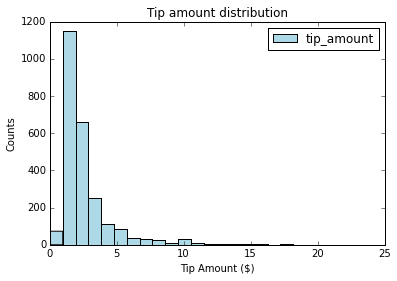

<properties
    pageTitle="Scienza dati utilizzando Scala e ad in Azure | Microsoft Azure"
    description="Informazioni su come usare Scala per le attività di apprendimento computer sotto controllo con i motori scalable MLlib ML i pacchetti e in un cluster di Azure HDInsight motori."  
    services="machine-learning"
    documentationCenter=""
    authors="bradsev"
    manager="jhubbard"
    editor="cgronlun" />

<tags
    ms.service="machine-learning"
    ms.workload="data-services"
    ms.tgt_pltfrm="na"
    ms.devlang="na"
    ms.topic="article"
    ms.date="08/01/2016"
    ms.author="bradsev;deguhath"/>

# Ricerca di scienze dati utilizzando Scala e motori su Azure

In questo articolo viene illustrato come utilizzare Scala per le attività di apprendimento computer sotto controllo con i motori scalable MLlib ML i pacchetti e in un cluster di Azure HDInsight motori. Illustra le attività che costituiscono il [processo di scienze dati](http://aka.ms/datascienceprocess): acquisizione di dati ed esplorazione, visualizzazione, progettazione caratteristica, modellazione e consumo modello. I modelli di vedere l'articolo includono regressione logistica e lineare, casuale insiemi di strutture e strutture aumentata sfumatura (GBTs), oltre a due attività comuni di risorse controllate computer:

- Problema di regressione: stima dell'importo suggerimento ($) per un viaggio taxi
- Classificazione binaria: stima di suggerimento o nessun suggerimento (1/0) per un viaggio taxi

Il processo di modellazione richiede formazione e valutazione in un set di dati di test e metriche di precisione pertinenti. In questo articolo viene illustrato come archiviare i modelli in archiviazione Blob Azure e su come punteggio e valutare le prestazioni di Office. In questo articolo è descritta anche gli argomenti più avanzati come ottimizzare i modelli con sweep convalida incrociata e hyper parametro. Dati usati sono un campione del 2013 Roma taxi viaggio e tariffa set di dati disponibili in GitHub.

[Scala](http://www.scala-lang.org/), un linguaggio basato su Java virtual machine integra concetti sul linguaggio orientato agli oggetti e funzionante. Si tratta di una lingua scalable adatto all'elaborazione del distribuite nel cloud, che viene eseguita nel cluster di Azure ad.

[Motori](http://spark.apache.org/) è un'infrastruttura di elaborazione parallela Apri origine che supporta l'elaborazione in memoria per migliorare le prestazioni di applicazioni analitica dati. Motore di elaborazione ad integrato per velocità, facilità di utilizzo e sofisticate analitica. Funzionalità di calcolo distribuito in memoria del motori renderlo un'ottima scelta per algoritmi iterativi nei calcoli di apprendimento e graph computer. Il pacchetto [spark.ml](http://spark.apache.org/docs/latest/ml-guide.html) fornisce un set uniforme di alto livello API basate su dati frame che consentono di creare e ottimizzare le pipeline di apprendimento pratico. [MLlib](http://spark.apache.org/mllib/) è una raccolta di apprendimento scalable di motori, che offre funzionalità di modellazione per questo ambiente distribuito.

[HDInsight i](../hdinsight/hdinsight-apache-spark-overview.md) è l'offerta ospitato Azure di ad Apri origine. Inoltre è incluso il supporto per i blocchi appunti Jupyter Scala cluster motori e supporti l'esecuzione di query interattive SQL motori per trasformare, filtrare e visualizzare i dati archiviati in archiviazione Blob Azure. Scala frammenti di codice in questo articolo forniscono le soluzioni e mostrano posti pertinenti per visualizzare i dati eseguire nei blocchi appunti Jupyter installati cluster motori. La procedura di modellazione in questi argomenti è codice che illustra come organizzare la formazione, valutare, salvare e utilizzare ogni tipo di modello.

La procedura di installazione e codice in questo articolo sono per Azure HDInsight 3.4 motori 1.6. Tuttavia, il codice in questo articolo e nel [Blocco appunti Jupyter Scala](https://github.com/Azure/Azure-MachineLearning-DataScience/blob/master/Misc/Spark/Scala/Exploration%20Modeling%20and%20Scoring%20using%20Scala.ipynb) sono generico e deve lavorare in un cluster di motori. La procedura di installazione e gestione di cluster potrebbe essere leggermente diversa da quella illustrata nell'articolo se non si usa HDInsight Spark.

> [AZURE.NOTE] Per un argomento che illustra come utilizzare Python anziché Scala per completare le attività per un processo di scienze dati-to-end, vedere [Ricerca di scienze dati utilizzando motori su Azure HDInsight](machine-learning-data-science-spark-overview.md).

## Prerequisiti

-   È necessario disporre di un abbonamento a Azure. Se non già presente, [ottenere una versione di valutazione gratuita Azure](https://azure.microsoft.com/documentation/videos/get-azure-free-trial-for-testing-hadoop-in-hdinsight/).

-   È necessario un cluster di Azure HDInsight 3.4 motori 1.6 per completare le procedure seguenti. Per creare un cluster, vedere le istruzioni disponibili in [Guida introduttiva: creare i Apache su Azure HDInsight](../hdinsight/hdinsight-apache-spark-jupyter-spark-sql.md). Impostare il tipo di grafico e la versione nel menu **Seleziona tipo di grafico** .

>[AZURE.INCLUDE [delete-cluster-warning](../../includes/hdinsight-delete-cluster-warning.md)]

Per una descrizione dei dati di andata e ritorno taxi Roma e istruzioni su come eseguire il codice da un blocco appunti Jupyter cluster motori, vedere le sezioni pertinenti in [Panoramica di scienze di dati utilizzando motori su Azure HDInsight](machine-learning-data-science-spark-overview.md).  

## Eseguire il codice Scala da un blocco appunti Jupyter cluster motori

È possibile avviare un blocco appunti Jupyter dal portale di Azure. Individuare il cluster di motori nel dashboard e quindi fare clic su esso per accedere alla pagina di gestione per il cluster. Quindi fare clic su **Dashboard Cluster**e quindi fare clic su **Blocco appunti Jupyter** per aprire il blocco appunti associato al cluster motori.

È anche possibile accedere a blocchi appunti Jupyter in https://&lt;nome cluster&gt;.azurehdinsight.net/jupyter. Sostituire *nome cluster* con il nome del cluster. Richiesta la password dell'account di amministratore per accedere ai blocchi appunti Jupyter.

Selezionare **Scala** per visualizzare una directory che contiene alcuni esempi di blocchi appunti predefiniti che utilizzano l'API PySpark. La modellazione di esplorazione e punteggio utilizzo Scala.ipynb blocco appunti che contiene gli esempi di codice per il gruppo di argomenti ad è disponibile in [GitHub](https://github.com/Azure/Azure-MachineLearning-DataScience/tree/master/Misc/Spark/Scala).

È possibile caricare il blocco appunti direttamente da GitHub al server di blocco appunti Jupyter il cluster motori. Nella home page Jupyter, fare clic sul pulsante **Carica** . In Esplora file incollare l'URL (contenuto non elaborato) GitHub del blocco appunti Scala e quindi fare clic su **Apri**. Il blocco appunti Scala è disponibile all'indirizzo seguente:

[Exploration-Modeling-and-Scoring-using-Scala.ipynb](https://github.com/Azure/Azure-MachineLearning-DataScience/blob/master/Misc/Spark/Scala/Exploration-Modeling-and-Scoring-using-Scala.ipynb)

## Installazione: Contesti preimpostato vivacità ed Hive magics motori e le raccolte di motori

### Contesti vivacità ed Hive predefiniti

    # SET THE START TIME
    import java.util.Calendar
    val beginningTime = Calendar.getInstance().getTime()

La x motori forniti con i blocchi appunti Jupyter hanno preimpostate contesti. Non è necessario impostare in modo esplicito i motori o lo sviluppo di contesti Hive prima di iniziare a utilizzare l'applicazione. Contesti predefiniti sono:

- `sc`per SparkContext
- `sqlContext`per HiveContext

### Motori magics

Il kernel motori fornisce alcuni predefiniti "magics", che sono comandi speciali che è possibile chiamare con `%%`. Due di questi comandi vengono utilizzati negli esempi di codice seguenti.

- `%%local`Specifica che il codice nelle righe successive verrà eseguito in locale. Il codice deve essere codice Scala valido.
- `%%sql -o <variable name>`esegue una query Hive `sqlContext`. Se il `-o` parametro passato, il risultato della query viene mantenuto nel `%%local` contesto Scala di un intervallo di dati di motori.

Per ulteriori informazioni sulla x per i blocchi appunti Jupyter e loro predefinito "magics" che si chiama con `%%` (ad esempio `%%local`), vedere [disponibili per i blocchi appunti Jupyter con i cluster Linux ad HDInsight su HDInsight. X](../hdinsight/hdinsight-apache-spark-jupyter-notebook-kernels.md).

### Librerie di importazione

Importare i motori, MLlib e altre raccolte che occorre tramite il codice riportato di seguito.

    # IMPORT SPARK AND JAVA LIBRARIES
    import org.apache.spark.sql.SQLContext
    import org.apache.spark.sql.functions._
    import java.text.SimpleDateFormat
    import java.util.Calendar
    import sqlContext.implicits._
    import org.apache.spark.sql.Row

    # IMPORT SPARK SQL FUNCTIONS
    import org.apache.spark.sql.types.{StructType, StructField, StringType, IntegerType, FloatType, DoubleType}
    import org.apache.spark.sql.functions.rand

    # IMPORT SPARK ML FUNCTIONS
    import org.apache.spark.ml.Pipeline
    import org.apache.spark.ml.feature.{StringIndexer, VectorAssembler, OneHotEncoder, VectorIndexer, Binarizer}
    import org.apache.spark.ml.tuning.{ParamGridBuilder, TrainValidationSplit, CrossValidator}
    import org.apache.spark.ml.regression.{LinearRegression, LinearRegressionModel, RandomForestRegressor, RandomForestRegressionModel, GBTRegressor, GBTRegressionModel}
    import org.apache.spark.ml.classification.{LogisticRegression, LogisticRegressionModel, RandomForestClassifier, RandomForestClassificationModel, GBTClassifier, GBTClassificationModel}
    import org.apache.spark.ml.evaluation.{BinaryClassificationEvaluator, RegressionEvaluator, MulticlassClassificationEvaluator}

    # IMPORT SPARK MLLIB FUNCTIONS
    import org.apache.spark.mllib.linalg.{Vector, Vectors}
    import org.apache.spark.mllib.util.MLUtils
    import org.apache.spark.mllib.classification.{LogisticRegressionWithLBFGS, LogisticRegressionModel}
    import org.apache.spark.mllib.regression.{LabeledPoint, LinearRegressionWithSGD, LinearRegressionModel}
    import org.apache.spark.mllib.tree.{GradientBoostedTrees, RandomForest}
    import org.apache.spark.mllib.tree.configuration.BoostingStrategy
    import org.apache.spark.mllib.tree.model.{GradientBoostedTreesModel, RandomForestModel, Predict}
    import org.apache.spark.mllib.evaluation.{BinaryClassificationMetrics, MulticlassMetrics, RegressionMetrics}

    # SPECIFY SQLCONTEXT
    val sqlContext = new SQLContext(sc)

## Acquisizione di dati

Il primo passaggio del processo di scienze di dati è per acquisire i dati che si desidera analizzare. Importare i dati da origini esterne o sistemi in cui si trova l'ambiente di modellazione e l'esplorazione dei dati. In questo articolo, i dati che acquisizione sono un esempio di 0,1% Uniti del taxi viaggio e tariffa file (archiviato come file tsv). L'ambiente di modellazione e l'esplorazione dei dati è motori. In questa sezione contiene il codice per completare la serie di attività seguente:

1. Impostare i percorsi di directory per l'archiviazione dei dati e il modello.
2. Leggere il set di dati di input (archiviato come file tsv).
3. Definire uno schema per i dati e pulire i dati.
4. Creare un intervallo di dati pulito e nella cache in memoria.
5. Registrare i dati come tabella temporanea in SQLContext.
6. La tabella di query e importare i risultati in un intervallo di dati.

### Impostare i percorsi di directory per i percorsi di archiviazione in archiviazione Blob Azure

Motori possono leggere e scrivere a archiviazione Blob Azure. È possibile utilizzare motori per elaborare i dati esistenti e quindi archiviare nuovamente i risultati in archiviazione Blob.

Per salvare i modelli o file in archiviazione Blob, è necessario specificare correttamente il percorso. Fare riferimento al contenitore predefiniti associato al cluster motori utilizzando un percorso che inizia con `wasb:///`. Fare riferimento in altre posizioni `wasb://`.

Nell'esempio seguente specifica la posizione dei dati di input per la lettura e il percorso di archiviazione Blob collegato al cluster motori in cui verrà salvato il modello.

    # SET PATHS TO DATA AND MODEL FILE LOCATIONS
    # INGEST DATA AND SPECIFY HEADERS FOR COLUMNS
    val taxi_train_file = sc.textFile("wasb://mllibwalkthroughs@cdspsparksamples.blob.core.windows.net/Data/NYCTaxi/JoinedTaxiTripFare.Point1Pct.Train.tsv")
    val header = taxi_train_file.first;

    # SET THE MODEL STORAGE DIRECTORY PATH
    # NOTE THAT THE FINAL BACKSLASH IN THE PATH IS REQUIRED.
    val modelDir = "wasb:///user/remoteuser/NYCTaxi/Models/";

### Importare i dati, creare un RDD e definire un intervallo di dati in base a schema

    # RECORD THE START TIME
    val starttime = Calendar.getInstance().getTime()

    # DEFINE THE SCHEMA BASED ON THE HEADER OF THE FILE
    val sqlContext = new SQLContext(sc)
    val taxi_schema = StructType(
        Array(
            StructField("medallion", StringType, true),
            StructField("hack_license", StringType, true),
            StructField("vendor_id", StringType, true),
            StructField("rate_code", DoubleType, true),
            StructField("store_and_fwd_flag", StringType, true),
            StructField("pickup_datetime", StringType, true),
            StructField("dropoff_datetime", StringType, true),
            StructField("pickup_hour", DoubleType, true),
            StructField("pickup_week", DoubleType, true),
            StructField("weekday", DoubleType, true),
            StructField("passenger_count", DoubleType, true),
            StructField("trip_time_in_secs", DoubleType, true),
            StructField("trip_distance", DoubleType, true),
            StructField("pickup_longitude", DoubleType, true),
            StructField("pickup_latitude", DoubleType, true),
            StructField("dropoff_longitude", DoubleType, true),
            StructField("dropoff_latitude", DoubleType, true),
            StructField("direct_distance", StringType, true),
            StructField("payment_type", StringType, true),
            StructField("fare_amount", DoubleType, true),
            StructField("surcharge", DoubleType, true),
            StructField("mta_tax", DoubleType, true),
            StructField("tip_amount", DoubleType, true),
            StructField("tolls_amount", DoubleType, true),
            StructField("total_amount", DoubleType, true),
            StructField("tipped", DoubleType, true),
            StructField("tip_class", DoubleType, true)
            )
        )

    # CAST VARIABLES ACCORDING TO THE SCHEMA
    val taxi_temp = (taxi_train_file.map(_.split("\t"))
                            .filter((r) => r(0) != "medallion")
                            .map(p => Row(p(0), p(1), p(2),
                                p(3).toDouble, p(4), p(5), p(6), p(7).toDouble, p(8).toDouble, p(9).toDouble, p(10).toDouble,
                                p(11).toDouble, p(12).toDouble, p(13).toDouble, p(14).toDouble, p(15).toDouble, p(16).toDouble,
                                p(17), p(18), p(19).toDouble, p(20).toDouble, p(21).toDouble, p(22).toDouble,
                                p(23).toDouble, p(24).toDouble, p(25).toDouble, p(26).toDouble)))

    # CREATE AN INITIAL DATA FRAME AND DROP COLUMNS, AND THEN CREATE A CLEANED DATA FRAME BY FILTERING FOR UNWANTED VALUES OR OUTLIERS
    val taxi_train_df = sqlContext.createDataFrame(taxi_temp, taxi_schema)

    val taxi_df_train_cleaned = (taxi_train_df.drop(taxi_train_df.col("medallion"))
            .drop(taxi_train_df.col("hack_license")).drop(taxi_train_df.col("store_and_fwd_flag"))
            .drop(taxi_train_df.col("pickup_datetime")).drop(taxi_train_df.col("dropoff_datetime"))
            .drop(taxi_train_df.col("pickup_longitude")).drop(taxi_train_df.col("pickup_latitude"))
            .drop(taxi_train_df.col("dropoff_longitude")).drop(taxi_train_df.col("dropoff_latitude"))
            .drop(taxi_train_df.col("surcharge")).drop(taxi_train_df.col("mta_tax"))
            .drop(taxi_train_df.col("direct_distance")).drop(taxi_train_df.col("tolls_amount"))
            .drop(taxi_train_df.col("total_amount")).drop(taxi_train_df.col("tip_class"))
            .filter("passenger_count > 0 and passenger_count < 8 AND payment_type in ('CSH', 'CRD') AND tip_amount >= 0 AND tip_amount < 30 AND fare_amount >= 1 AND fare_amount < 150 AND trip_distance > 0 AND trip_distance < 100 AND trip_time_in_secs > 30 AND trip_time_in_secs < 7200"));

    # CACHE AND MATERIALIZE THE CLEANED DATA FRAME IN MEMORY
    taxi_df_train_cleaned.cache()
    taxi_df_train_cleaned.count()

    # REGISTER THE DATA FRAME AS A TEMPORARY TABLE IN SQLCONTEXT
    taxi_df_train_cleaned.registerTempTable("taxi_train")

    # GET THE TIME TO RUN THE CELL
    val endtime = Calendar.getInstance().getTime()
    val elapsedtime =  ((endtime.getTime() - starttime.getTime())/1000).toString;
    println("Time taken to run the above cell: " + elapsedtime + " seconds.");

**Output:**

Ora per l'esecuzione della cella: 8 secondi.

### Query la tabella oltre a importare i risultati in un intervallo di dati

Successivamente, eseguire una query la tabella per tariffa, passeggeri e suggerimento dati. filtrare i dati danneggiati e fonti; e stampare più righe.

    # QUERY THE DATA
    val sqlStatement = """
        SELECT fare_amount, passenger_count, tip_amount, tipped
        FROM taxi_train
        WHERE passenger_count > 0 AND passenger_count < 7
        AND fare_amount > 0 AND fare_amount < 200
        AND payment_type in ('CSH', 'CRD')
        AND tip_amount > 0 AND tip_amount < 25
    """
    val sqlResultsDF = sqlContext.sql(sqlStatement)

    # SHOW ONLY THE TOP THREE ROWS
    sqlResultsDF.show(3)

**Output:**

fare_amount|passenger_count|tip_amount|inclinato
-----------|---------------|----------|------
       13,5|            1.0|       2.9|   1.0
       16,0|            2.0|       3.4|   1.0
       10.5|            2.0|       1.0|   1.0

## Visualizzazione ed esplorazione dei dati

Dopo motori come inserire i dati, il passaggio successivo del processo di scienze di dati è necessario ottenere una maggiore comprensione dei dati tramite esplorazione e di visualizzazione. In questa sezione è esaminare i dati taxi tramite query SQL. Importare quindi i risultati in un intervallo di dati per tracciare le variabili di destinazione e potenziali caratteristiche per il controllo visivo utilizzando la funzionalità di visualizzazione automatica del Jupyter.

### Consente di tracciare i dati locali e chiave SQL

Per impostazione predefinita, l'output di qualsiasi frammento di codice eseguite da un blocco appunti Jupyter è disponibile all'interno del contesto della sessione in modo permanente nei nodi del lavoro. Se si vuole salvare un viaggio i nodi di lavoro per ogni calcolo e se è disponibile in locale per il nodo di server Jupyter, ovvero il nodo principale, tutti i dati necessari per il calcolo, è possibile utilizzare il `%%local` speciale per eseguire il frammento di codice sul server Jupyter.

- **Chiave SQL** (`%%sql`). Il kernel HDInsight Spark supporta SQLContext query HiveQL all'interno del testo semplice. Il (`-o VARIABLE_NAME`) argomento mantiene l'output della query SQL sotto forma di un intervallo di dati Pandas nel server Jupyter. Questo significa che sarà disponibile in modalità locale.
- `%%local`**speciale**. Il `%%local` speciale esegue il codice in locale nel server Jupyter, ossia il nodo principale del cluster HDInsight. In genere, si utilizza `%%local` particolare in combinazione con la `%%sql` strumento con la `-o` parametro. Il `-o` parametro da mantenere l'output della query SQL in locale, quindi `%%local` speciale attiverà i successivi di frammento di codice per eseguire in locale per l'output della query SQL in modo permanente in locale.

### Query sui dati utilizzando SQL
La query recupera trip taxi da Importo tariffa, conteggio passeggeri e suggerimento.

    # RUN THE SQL QUERY
    %%sql -q -o sqlResults
    SELECT fare_amount, passenger_count, tip_amount, tipped FROM taxi_train WHERE passenger_count > 0 AND passenger_count < 7 AND fare_amount > 0 AND fare_amount < 200 AND payment_type in ('CSH', 'CRD') AND tip_amount > 0 AND tip_amount < 25

Nel codice seguente, la `%%local` speciale crea un intervallo di dati locali, sqlResults. È possibile utilizzare sqlResults per tracciare usando matplotlib.

> [AZURE.TIP] Chiave locale viene usato più volte in questo articolo. Se il set di dati è grande, esempio per creare un intervallo di dati che può essere visualizzati nella cache locale.

### Tracciare i dati

È possibile tracciare tramite il codice Python dopo l'intervallo di dati si trova nel contesto locale come un intervallo di dati Pandas.

    # RUN THE CODE LOCALLY ON THE JUPYTER SERVER
    %%local

    # USE THE JUPYTER AUTO-PLOTTING FEATURE TO CREATE INTERACTIVE FIGURES.
    # CLICK THE TYPE OF PLOT TO GENERATE (LINE, AREA, BAR, ETC.)
    sqlResults

 Dopo aver eseguito il codice, kernel motori Visualizza automaticamente l'output della query SQL (HiveQL). È possibile scegliere tra diversi tipi di visualizzazioni:
 
- tavolo
- Grafici a torta
- Riga
- Area
- Barra

Ecco il codice per tracciare i dati:

    # RUN THE CODE LOCALLY ON THE JUPYTER SERVER AND IMPORT LIBRARIES
    %%local
    import matplotlib.pyplot as plt
    %matplotlib inline

    # PLOT TIP BY PAYMENT TYPE AND PASSENGER COUNT
    ax1 = sqlResults[['tip_amount']].plot(kind='hist', bins=25, facecolor='lightblue')
    ax1.set_title('Tip amount distribution')
    ax1.set_xlabel('Tip Amount ($)')
    ax1.set_ylabel('Counts')
    plt.suptitle('')
    plt.show()

    # PLOT TIP BY PASSENGER COUNT
    ax2 = sqlResults.boxplot(column=['tip_amount'], by=['passenger_count'])
    ax2.set_title('Tip amount by Passenger count')
    ax2.set_xlabel('Passenger count')
    ax2.set_ylabel('Tip Amount ($)')
    plt.suptitle('')
    plt.show()

    # PLOT TIP AMOUNT BY FARE AMOUNT; SCALE POINTS BY PASSENGER COUNT
    ax = sqlResults.plot(kind='scatter', x= 'fare_amount', y = 'tip_amount', c='blue', alpha = 0.10, s=5*(sqlResults.passenger_count))
    ax.set_title('Tip amount by Fare amount')
    ax.set_xlabel('Fare Amount ($)')
    ax.set_ylabel('Tip Amount ($)')
    plt.axis([-2, 80, -2, 20])
    plt.show()

**Output:**

## Creare caratteristiche e funzionalità di trasformazione e preparare i dati di input in funzioni di modellazione

Per le funzioni di modellazione basata su albero da motori ML e MLlib, è necessario preparare l'ambiente di destinazione e caratteristiche utilizzando una serie di tecniche, ad esempio binning, indicizzazione, hot una codifica e vettorizzazione. Ecco le procedure da seguire in questa sezione:

1. Creare una nuova caratteristica **binning** ore in intervalli di tempo il traffico.
2. Applicare **l'indicizzazione e hot una codifica** alle caratteristiche per categoria.
3. **Esempio e dividere il set di dati** in frazioni test e formazione.
4. **Caratteristiche e specificare formazione variabile**e creare indicizzate o hot una codifica di formazione e test input punto etichetta flessibili distribuito set di dati (RDDs) o frame di dati.
5. Automaticamente **categorizzare e vettorializzare caratteristiche e i siti di destinazione** da utilizzare come input per modelli di risorse computer.

### Creare una nuova caratteristica di ore binning in intervalli di tempo il traffico

Questo codice viene illustrato come creare una nuova caratteristica di ore binning in intervalli di tempo il traffico e la memorizzazione nella cache frame di dati risultante in memoria. In cornici RDDs e i dati vengono utilizzati più volte, memorizzazione nella cache clienti potenziali a migliorato i tempi di esecuzione. Di conseguenza, è necessario memorizzare nella cache RDDs e frame di dati in varie fasi nelle procedure seguenti.

    # CREATE FOUR BUCKETS FOR TRAFFIC TIMES
    val sqlStatement = """
        SELECT *,
        CASE
         WHEN (pickup_hour <= 6 OR pickup_hour >= 20) THEN "Night"
         WHEN (pickup_hour >= 7 AND pickup_hour <= 10) THEN "AMRush"
         WHEN (pickup_hour >= 11 AND pickup_hour <= 15) THEN "Afternoon"
         WHEN (pickup_hour >= 16 AND pickup_hour <= 19) THEN "PMRush"
        END as TrafficTimeBins
        FROM taxi_train
    """
    val taxi_df_train_with_newFeatures = sqlContext.sql(sqlStatement)

    # CACHE THE DATA FRAME IN MEMORY AND MATERIALIZE THE DATA FRAME IN MEMORY
    taxi_df_train_with_newFeatures.cache()
    taxi_df_train_with_newFeatures.count()

### L'indicizzazione e hot una codifica delle caratteristiche per categoria

La modellazione e prevedere le funzioni di MLlib sono necessarie caratteristiche con dati di input per categoria essere indicizzate o codificato prima di utilizzare. In questa sezione viene illustrato come indicizzare o codificare funzioni per categoria quando i dati immessi nelle funzioni di modellazione.

È necessario indicizzare o codificare i modelli in diversi modi, a seconda del modello. Ad esempio, modelli di regressione lineare e logistico richiedono hot una codifica. Ad esempio, una caratteristica con tre categorie può essere espansi in tre colonne di funzionalità. Ogni colonna che contiene 0 o 1 a seconda della categoria di un osservazioni. MLlib offre la funzione [OneHotEncoder](http://scikit-learn.org/stable/modules/generated/sklearn.preprocessing.OneHotEncoder.html#sklearn.preprocessing.OneHotEncoder) per hot una codifica. Questo codificatore esegue il mapping di una colonna di indici etichetta a una colonna di vettori binari con almeno un singolo uno-valore. Con questa codifica algoritmi aspettarsi le caratteristiche di valori numeriche, come regressione logistica, possono essere applicati alle caratteristiche per categoria.

Di seguito si procederà solo quattro variabili per visualizzare gli esempi, sono stringhe di caratteri. È anche possibile indicizzare altre variabili, ad esempio giorno della settimana, rappresentati da valori numerici, come variabili per categoria.

Per l'indicizzazione, utilizzare `StringIndexer()`e per hot una codifica, usare `OneHotEncoder()` funzioni di MLlib. Ecco il codice di indice e codificare funzioni per categoria:

    # CREATE INDEXES AND ONE-HOT ENCODED VECTORS FOR SEVERAL CATEGORICAL FEATURES

    # RECORD THE START TIME
    val starttime = Calendar.getInstance().getTime()

    # INDEX AND ENCODE VENDOR_ID
    val stringIndexer = new StringIndexer().setInputCol("vendor_id").setOutputCol("vendorIndex").fit(taxi_df_train_with_newFeatures)
    val indexed = stringIndexer.transform(taxi_df_train_with_newFeatures)
    val encoder = new OneHotEncoder().setInputCol("vendorIndex").setOutputCol("vendorVec")
    val encoded1 = encoder.transform(indexed)

    # INDEX AND ENCODE RATE_CODE
    val stringIndexer = new StringIndexer().setInputCol("rate_code").setOutputCol("rateIndex").fit(encoded1)
    val indexed = stringIndexer.transform(encoded1)
    val encoder = new OneHotEncoder().setInputCol("rateIndex").setOutputCol("rateVec")
    val encoded2 = encoder.transform(indexed)

    # INDEX AND ENCODE PAYMENT_TYPE
    val stringIndexer = new StringIndexer().setInputCol("payment_type").setOutputCol("paymentIndex").fit(encoded2)
    val indexed = stringIndexer.transform(encoded2)
    val encoder = new OneHotEncoder().setInputCol("paymentIndex").setOutputCol("paymentVec")
    val encoded3 = encoder.transform(indexed)

    # INDEX AND TRAFFIC TIME BINS
    val stringIndexer = new StringIndexer().setInputCol("TrafficTimeBins").setOutputCol("TrafficTimeBinsIndex").fit(encoded3)
    val indexed = stringIndexer.transform(encoded3)
    val encoder = new OneHotEncoder().setInputCol("TrafficTimeBinsIndex").setOutputCol("TrafficTimeBinsVec")
    val encodedFinal = encoder.transform(indexed)

    # GET THE TIME TO RUN THE CELL
    val endtime = Calendar.getInstance().getTime()
    val elapsedtime =  ((endtime.getTime() - starttime.getTime())/1000).toString;
    println("Time taken to run the above cell: " + elapsedtime + " seconds.");

**Output:**

Ora per l'esecuzione della cella: 4 secondi.

### Esempio e dividere il set di dati in frazioni test e formazione

Questo codice crea sondaggio di dati (25%, in questo esempio). Sebbene campioni non è richiesta in questo esempio a causa delle dimensioni del set di dati, l'articolo mostra come potete campionare in modo da sapere come usare per i proprio problemi quando necessario. Dopo aver configurato esempi di grandi dimensioni, si può risparmiare molto tempo mentre si formare modelli. Quindi, dividere il campione in una parte di formazione (75%, in questo esempio) e una parte di test (25%, in questo esempio) per l'utilizzo di classificazione e modellazione di regressione.

Aggiungere un numero casuale compreso tra 0 e 1, per ogni riga (in una colonna "casuale") che può essere utilizzato per selezionare convalida incrociata biglietto durante la formazione.

    # RECORD THE START TIME
    val starttime = Calendar.getInstance().getTime()

    # SPECIFY SAMPLING AND SPLITTING FRACTIONS
    val samplingFraction = 0.25;
    val trainingFraction = 0.75;
    val testingFraction = (1-trainingFraction);
    val seed = 1234;
    val encodedFinalSampledTmp = encodedFinal.sample(withReplacement = false, fraction = samplingFraction, seed = seed)
    val sampledDFcount = encodedFinalSampledTmp.count().toInt

    val generateRandomDouble = udf(() => {
        scala.util.Random.nextDouble
    })

    # ADD A RANDOM NUMBER FOR CROSS-VALIDATION
    val encodedFinalSampled = encodedFinalSampledTmp.withColumn("rand", generateRandomDouble());

    # SPLIT THE SAMPLED DATA FRAME INTO TRAIN AND TEST, WITH A RANDOM COLUMN ADDED FOR DOING CROSS-VALIDATION (SHOWN LATER)
    # INCLUDE A RANDOM COLUMN FOR CREATING CROSS-VALIDATION FOLDS
    val splits = encodedFinalSampled.randomSplit(Array(trainingFraction, testingFraction), seed = seed)
    val trainData = splits(0)
    val testData = splits(1)

    # GET THE TIME TO RUN THE CELL
    val endtime = Calendar.getInstance().getTime()
    val elapsedtime =  ((endtime.getTime() - starttime.getTime())/1000).toString;
    println("Time taken to run the above cell: " + elapsedtime + " seconds.");

**Output:**

Ora per l'esecuzione della cella: 2 secondi.

### Specificare le funzionalità e formazione variabile e creare indicizzate o hot uno codificato formazione e verifica etichettata frame RDDs punto o dati di input

In questa sezione contiene codice che illustra come indicizzare i dati di testo per categoria come tipo di dati decimale etichetta e la codifica in modo che è possibile utilizzare per organizzare la formazione e testare regressione logistica MLlib e altri modelli di classificazione. Gli oggetti punto etichetta sono RDDs formattate in modo che è necessario come dati di input per la maggior parte degli algoritmi di MLlib di apprendimento automatico. Un' [etichetta punto](https://spark.apache.org/docs/latest/mllib-data-types.html#labeled-point) è un vettore locale, densità o caricato in memoria bassa, associata a un'etichetta/risposta.

In questo codice, specificare la variabile di destinazione (dipendenti) e le caratteristiche da utilizzare per formare modelli. Quindi, creare indicizzate o hot uno codificato formazione e verifica etichettata frame RDDs punto o dati di input.

    # RECORD THE START TIME
    val starttime = Calendar.getInstance().getTime()

    # MAP NAMES OF FEATURES AND TARGETS FOR CLASSIFICATION AND REGRESSION PROBLEMS
    val featuresIndOneHot = List("paymentVec", "vendorVec", "rateVec", "TrafficTimeBinsVec", "pickup_hour", "weekday", "passenger_count", "trip_time_in_secs", "trip_distance", "fare_amount").map(encodedFinalSampled.columns.indexOf(_))
    val featuresIndIndex = List("paymentIndex", "vendorIndex", "rateIndex", "TrafficTimeBinsIndex", "pickup_hour", "weekday", "passenger_count", "trip_time_in_secs", "trip_distance", "fare_amount").map(encodedFinalSampled.columns.indexOf(_))

    # SPECIFY THE TARGET FOR CLASSIFICATION ('tipped') AND REGRESSION ('tip_amount') PROBLEMS
    val targetIndBinary = List("tipped").map(encodedFinalSampled.columns.indexOf(_))
    val targetIndRegression = List("tip_amount").map(encodedFinalSampled.columns.indexOf(_))

    # CREATE INDEXED LABELED POINT RDD OBJECTS
    val indexedTRAINbinary = trainData.rdd.map(r => LabeledPoint(r.getDouble(targetIndBinary(0).toInt), Vectors.dense(featuresIndIndex.map(r.getDouble(_)).toArray)))
    val indexedTESTbinary = testData.rdd.map(r => LabeledPoint(r.getDouble(targetIndBinary(0).toInt), Vectors.dense(featuresIndIndex.map(r.getDouble(_)).toArray)))
    val indexedTRAINreg = trainData.rdd.map(r => LabeledPoint(r.getDouble(targetIndRegression(0).toInt), Vectors.dense(featuresIndIndex.map(r.getDouble(_)).toArray)))
    val indexedTESTreg = testData.rdd.map(r => LabeledPoint(r.getDouble(targetIndRegression(0).toInt), Vectors.dense(featuresIndIndex.map(r.getDouble(_)).toArray)))

    # CREATE INDEXED DATA FRAMES THAT YOU CAN USE TO TRAIN BY USING SPARK ML FUNCTIONS
    val indexedTRAINbinaryDF = indexedTRAINbinary.toDF()
    val indexedTESTbinaryDF = indexedTESTbinary.toDF()
    val indexedTRAINregDF = indexedTRAINreg.toDF()
    val indexedTESTregDF = indexedTESTreg.toDF()

    # CREATE ONE-HOT ENCODED (VECTORIZED) DATA FRAMES THAT YOU CAN USE TO TRAIN BY USING SPARK ML FUNCTIONS
    val assemblerOneHot = new VectorAssembler().setInputCols(Array("paymentVec", "vendorVec", "rateVec", "TrafficTimeBinsVec", "pickup_hour", "weekday", "passenger_count", "trip_time_in_secs", "trip_distance", "fare_amount")).setOutputCol("features")
    val OneHotTRAIN = assemblerOneHot.transform(trainData)
    val OneHotTEST = assemblerOneHot.transform(testData)

    # GET THE TIME TO RUN THE CELL
    val endtime = Calendar.getInstance().getTime()
    val elapsedtime =  ((endtime.getTime() - starttime.getTime())/1000).toString;
    println("Time taken to run the above cell: " + elapsedtime + " seconds.");

**Output:**

Ora per l'esecuzione della cella: 4 secondi.

### Categorizzare e vettorializzare caratteristiche e i siti di destinazione da utilizzare come input per modelli di apprendimento automaticamente

Utilizzare i ML per classificare le caratteristiche da utilizzare nelle funzioni di modellazione basata su struttura. Il codice venga completato due attività:

-   Crea una destinazione binaria per la classificazione mediante l'assegnazione di un valore rispetto a 0 o 1 per ogni punto dati compreso tra 0 e 1 usando un valore di soglia di 0,5.
- Classifica automaticamente caratteristiche. Se il numero di valori numerici distinti per qualsiasi funzionalità è inferiore a 32, tale funzionalità è categorizzato.

Ecco il codice per le attività.

    # CATEGORIZE FEATURES AND BINARIZE THE TARGET FOR THE BINARY CLASSIFICATION PROBLEM

    # TRAIN DATA
    val indexer = new VectorIndexer().setInputCol("features").setOutputCol("featuresCat").setMaxCategories(32)
    val indexerModel = indexer.fit(indexedTRAINbinaryDF)
    val indexedTrainwithCatFeat = indexerModel.transform(indexedTRAINbinaryDF)
    val binarizer: Binarizer = new Binarizer().setInputCol("label").setOutputCol("labelBin").setThreshold(0.5)
    val indexedTRAINwithCatFeatBinTarget = binarizer.transform(indexedTrainwithCatFeat)

    # TEST DATA
    val indexerModel = indexer.fit(indexedTESTbinaryDF)
    val indexedTrainwithCatFeat = indexerModel.transform(indexedTESTbinaryDF)
    val binarizer: Binarizer = new Binarizer().setInputCol("label").setOutputCol("labelBin").setThreshold(0.5)
    val indexedTESTwithCatFeatBinTarget = binarizer.transform(indexedTrainwithCatFeat)

    # CATEGORIZE FEATURES FOR THE REGRESSION PROBLEM
    # CREATE PROPERLY INDEXED AND CATEGORIZED DATA FRAMES FOR TREE-BASED MODELS

    # TRAIN DATA
    val indexer = new VectorIndexer().setInputCol("features").setOutputCol("featuresCat").setMaxCategories(32)
    val indexerModel = indexer.fit(indexedTRAINregDF)
    val indexedTRAINwithCatFeat = indexerModel.transform(indexedTRAINregDF)

    # TEST DATA
    val indexerModel = indexer.fit(indexedTESTbinaryDF)
    val indexedTESTwithCatFeat = indexerModel.transform(indexedTESTregDF)

## Modello di classificazione binario: prevedere se un suggerimento deve essere effettuato

In questa sezione è creare tre tipi di modelli di classificazione binario prevedere o meno un suggerimento deve essere effettuato:

- Un **modello di regressione logistica** mediante ML ad `LogisticRegression()` funzione
- Un **modello di classificazione foresta casuale** utilizzando ML ad `RandomForestClassifier()` funzione
- Un **modello di classificazione struttura aumento della sfumatura** utilizzando il MLlib `GradientBoostedTrees()` funzione

### Creare un modello di regressione logistica

Successivamente, creare un modello di regressione logistica utilizzando ML ad `LogisticRegression()` funzione. Creare il modello di creazione di codice in una serie di passaggi:

1. Impostare **treno il modello di** dati con un parametro.
2. **Valuta il modello** in un set di dati di test con metriche.
3. È possibile **salvare il modello** in archiviazione Blob consumo futuro.
4. **Punteggio il modello di** dati di test.
5. **Tracciare i risultati** con ricevitore operativo curve caratteristica (ROC).

Ecco il codice per queste procedure:

    # CREATE A LOGISTIC REGRESSION MODEL
    val lr = new LogisticRegression().setLabelCol("tipped").setFeaturesCol("features").setMaxIter(10).setRegParam(0.3).setElasticNetParam(0.8)
    val lrModel = lr.fit(OneHotTRAIN)

    # PREDICT ON THE TEST DATA SET
    val predictions = lrModel.transform(OneHotTEST)

    # SELECT `BinaryClassificationEvaluator()` TO COMPUTE THE TEST ERROR
    val evaluator = new BinaryClassificationEvaluator().setLabelCol("tipped").setRawPredictionCol("probability").setMetricName("areaUnderROC")
    val ROC = evaluator.evaluate(predictions)
    println("ROC on test data = " + ROC)

    # SAVE THE MODEL
    val datestamp = Calendar.getInstance().getTime().toString.replaceAll(" ", ".").replaceAll(":", "_");
    val modelName = "LogisticRegression__"
    val filename = modelDir.concat(modelName).concat(datestamp)
    lrModel.save(filename);

Caricare, punteggio e salvare i risultati.

    # RECORD THE START TIME
    val starttime = Calendar.getInstance().getTime()

    # LOAD THE SAVED MODEL AND SCORE THE TEST DATA SET
    val savedModel = org.apache.spark.ml.classification.LogisticRegressionModel.load(filename)
    println(s"Coefficients: ${savedModel.coefficients} Intercept: ${savedModel.intercept}")

    # SCORE THE MODEL ON THE TEST DATA
    val predictions = savedModel.transform(OneHotTEST).select("tipped","probability","rawPrediction")
    predictions.registerTempTable("testResults")

    # SELECT `BinaryClassificationEvaluator()` TO COMPUTE THE TEST ERROR
    val evaluator = new BinaryClassificationEvaluator().setLabelCol("tipped").setRawPredictionCol("probability").setMetricName("areaUnderROC")
    val ROC = evaluator.evaluate(predictions)

    # GET THE TIME TO RUN THE CELL
    val endtime = Calendar.getInstance().getTime()
    val elapsedtime =  ((endtime.getTime() - starttime.getTime())/1000).toString;
    println("Time taken to run the above cell: " + elapsedtime + " seconds.");

    # PRINT THE ROC RESULTS
    println("ROC on test data = " + ROC)

**Output:**

ROC sui dati di test = 0.9827381497557599

Per tracciare la curva ROC scegliere Python frame di dati Pandas locali.

    # QUERY THE RESULTS
    %%sql -q -o sqlResults
    SELECT tipped, probability from testResults

    # RUN THE CODE LOCALLY ON THE JUPYTER SERVER AND IMPORT LIBRARIES
    %%local
    %matplotlib inline
    from sklearn.metrics import roc_curve,auc

    sqlResults['probFloat'] = sqlResults.apply(lambda row: row['probability'].values()[0][1], axis=1)
    predictions_pddf = sqlResults[["tipped","probFloat"]]

    # PREDICT THE ROC CURVE
    # predictions_pddf = sqlResults.rename(columns={'_1': 'probability', 'tipped': 'label'})
    prob = predictions_pddf["probFloat"]
    fpr, tpr, thresholds = roc_curve(predictions_pddf['tipped'], prob, pos_label=1);
    roc_auc = auc(fpr, tpr)

    # PLOT THE ROC CURVE
    plt.figure(figsize=(5,5))
    plt.plot(fpr, tpr, label='ROC curve (area = %0.2f)' % roc_auc)
    plt.plot([0, 1], [0, 1], 'k--')
    plt.xlim([0.0, 1.0])
    plt.ylim([0.0, 1.05])
    plt.xlabel('False Positive Rate')
    plt.ylabel('True Positive Rate')
    plt.title('ROC Curve')
    plt.legend(loc="lower right")
    plt.show()

**Output:**

### Creare un modello di classificazione casuale foresta

Creare un modello di classificazione foresta casuale utilizzando ML ad `RandomForestClassifier()` funzione e quindi valutare il modello di dati di test.

    # RECORD THE START TIME
    val starttime = Calendar.getInstance().getTime()

    # CREATE THE RANDOM FOREST CLASSIFIER MODEL
    val rf = new RandomForestClassifier().setLabelCol("labelBin").setFeaturesCol("featuresCat").setNumTrees(10).setSeed(1234)

    # FIT THE MODEL
    val rfModel = rf.fit(indexedTRAINwithCatFeatBinTarget)
    val predictions = rfModel.transform(indexedTESTwithCatFeatBinTarget)

    # EVALUATE THE MODEL
    val evaluator = new MulticlassClassificationEvaluator().setLabelCol("label").setPredictionCol("prediction").setMetricName("f1")
    val Test_f1Score = evaluator.evaluate(predictions)
    println("F1 score on test data: " + Test_f1Score);

    # GET THE TIME TO RUN THE CELL
    val endtime = Calendar.getInstance().getTime()
    val elapsedtime =  ((endtime.getTime() - starttime.getTime())/1000).toString;
    println("Time taken to run the above cell: " + elapsedtime + " seconds.");

    # CALCULATE BINARY CLASSIFICATION EVALUATION METRICS
    val evaluator = new BinaryClassificationEvaluator().setLabelCol("label").setRawPredictionCol("probability").setMetricName("areaUnderROC")
    val ROC = evaluator.evaluate(predictions)
    println("ROC on test data = " + ROC)

**Output:**

ROC sui dati di test = 0.9847103571552683

### Creare un modello di classificazione GBT

Successivamente, creare un modello di classificazione GBT utilizzando del MLlib `GradientBoostedTrees()` funzione e quindi valutare il modello di dati di test.

    # TRAIN A GBT CLASSIFICATION MODEL BY USING MLLIB AND A LABELED POINT

    # RECORD THE START TIME
    val starttime = Calendar.getInstance().getTime()

    # DEFINE THE GBT CLASSIFICATION MODEL
    val boostingStrategy = BoostingStrategy.defaultParams("Classification")
    boostingStrategy.numIterations = 20
    boostingStrategy.treeStrategy.numClasses = 2
    boostingStrategy.treeStrategy.maxDepth = 5
    boostingStrategy.treeStrategy.categoricalFeaturesInfo = Map[Int, Int]((0,2),(1,2),(2,6),(3,4))

    # TRAIN THE MODEL
    val gbtModel = GradientBoostedTrees.train(indexedTRAINbinary, boostingStrategy)

    # SAVE THE MODEL IN BLOB STORAGE
    val datestamp = Calendar.getInstance().getTime().toString.replaceAll(" ", ".").replaceAll(":", "_");
    val modelName = "GBT_Classification__"
    val filename = modelDir.concat(modelName).concat(datestamp)
    gbtModel.save(sc, filename);

    # EVALUATE THE MODEL ON TEST INSTANCES AND THE COMPUTE TEST ERROR
    val labelAndPreds = indexedTESTbinary.map { point =>
      val prediction = gbtModel.predict(point.features)
      (point.label, prediction)
    }
    val testErr = labelAndPreds.filter(r => r._1 != r._2).count.toDouble / indexedTRAINbinary.count()
    //println("Learned classification GBT model:\n" + gbtModel.toDebugString)
    println("Test Error = " + testErr)

    # USE BINARY AND MULTICLASS METRICS TO EVALUATE THE MODEL ON THE TEST DATA
    val metrics = new MulticlassMetrics(labelAndPreds)
    println(s"Precision: ${metrics.precision}")
    println(s"Recall: ${metrics.recall}")
    println(s"F1 Score: ${metrics.fMeasure}")

    val metrics = new BinaryClassificationMetrics(labelAndPreds)
    println(s"Area under PR curve: ${metrics.areaUnderPR}")
    println(s"Area under ROC curve: ${metrics.areaUnderROC}")

    # GET THE TIME TO RUN THE CELL
    val endtime = Calendar.getInstance().getTime()
    val elapsedtime =  ((endtime.getTime() - starttime.getTime())/1000).toString;
    println("Time taken to run the above cell: " + elapsedtime + " seconds.");

    # PRINT THE ROC METRIC
    println(s"Area under ROC curve: ${metrics.areaUnderROC}")

**Output:**

Area sotto ROC curva: 0.9846895479241554

## Modello di regressione: prevedere importo suggerimento

In questa sezione è creare due tipi di modelli di regressione per stimare la quantità di suggerimento:

- Un **modello di regressione lineare regolarizzarne** utilizzando ML ad `LinearRegression()` funzione. È necessario salvare il modello e valutare il modello di dati di test.
- Un **modello di regressione albero incremento della sfumatura** con ML ad `GBTRegressor()` funzione.

### Creare un modello di regressione lineare regolarizzarne

    # RECORD THE START TIME
    val starttime = Calendar.getInstance().getTime()

    # CREATE A REGULARIZED LINEAR REGRESSION MODEL BY USING THE SPARK ML FUNCTION AND DATA FRAMES
    val lr = new LinearRegression().setLabelCol("tip_amount").setFeaturesCol("features").setMaxIter(10).setRegParam(0.3).setElasticNetParam(0.8)

    # FIT THE MODEL BY USING DATA FRAMES
    val lrModel = lr.fit(OneHotTRAIN)
    println(s"Coefficients: ${lrModel.coefficients} Intercept: ${lrModel.intercept}")

    # SUMMARIZE THE MODEL OVER THE TRAINING SET AND PRINT METRICS
    val trainingSummary = lrModel.summary
    println(s"numIterations: ${trainingSummary.totalIterations}")
    println(s"objectiveHistory: ${trainingSummary.objectiveHistory.toList}")
    trainingSummary.residuals.show()
    println(s"RMSE: ${trainingSummary.rootMeanSquaredError}")
    println(s"r2: ${trainingSummary.r2}")

    # SAVE THE MODEL IN AZURE BLOB STORAGE
    val datestamp = Calendar.getInstance().getTime().toString.replaceAll(" ", ".").replaceAll(":", "_");
    val modelName = "LinearRegression__"
    val filename = modelDir.concat(modelName).concat(datestamp)
    lrModel.save(filename);

    # PRINT THE COEFFICIENTS
    println(s"Coefficients: ${lrModel.coefficients} Intercept: ${lrModel.intercept}")

    # SCORE THE MODEL ON TEST DATA
    val predictions = lrModel.transform(OneHotTEST)

    # EVALUATE THE MODEL ON TEST DATA
    val evaluator = new RegressionEvaluator().setLabelCol("tip_amount").setPredictionCol("prediction").setMetricName("r2")
    val r2 = evaluator.evaluate(predictions)
    println("R-sqr on test data = " + r2)

    # GET THE TIME TO RUN THE CELL
    val endtime = Calendar.getInstance().getTime()
    val elapsedtime =  ((endtime.getTime() - starttime.getTime())/1000).toString;
    println("Time taken to run the above cell: " + elapsedtime + " seconds.");

**Output:**

Ora per l'esecuzione della cella: 13 secondi.

    # LOAD A SAVED LINEAR REGRESSION MODEL FROM BLOB STORAGE AND SCORE A TEST DATA SET

    # RECORD THE START TIME
    val starttime = Calendar.getInstance().getTime()

    # LOAD A SAVED LINEAR REGRESSION MODEL FROM AZURE BLOB STORAGE
    val savedModel = org.apache.spark.ml.regression.LinearRegressionModel.load(filename)
    println(s"Coefficients: ${savedModel.coefficients} Intercept: ${savedModel.intercept}")

    # SCORE THE MODEL ON TEST DATA
    val predictions = savedModel.transform(OneHotTEST).select("tip_amount","prediction")
    predictions.registerTempTable("testResults")

    # EVALUATE THE MODEL ON TEST DATA
    val evaluator = new RegressionEvaluator().setLabelCol("tip_amount").setPredictionCol("prediction").setMetricName("r2")
    val r2 = evaluator.evaluate(predictions)
    println("R-sqr on test data = " + r2)

    # GET THE TIME TO RUN THE CELL
    val endtime = Calendar.getInstance().getTime()
    val elapsedtime =  ((endtime.getTime() - starttime.getTime())/1000).toString;
    println("Time taken to run the above cell: " + elapsedtime + " seconds.");

    # PRINT THE RESULTS
    println("R-sqr on test data = " + r2)

**Output:**

R-sqr sui dati di test = 0.5960320470835743

Successivamente, i risultati della query come un intervallo di dati e utilizzare AutoVizWidget e matplotlib per visualizzare il.

    # RUN A SQL QUERY
    %%sql -q -o sqlResults
    select * from testResults

    # RUN THE CODE LOCALLY ON THE JUPYTER SERVER
    %%local

    # USE THE JUPYTER AUTO-PLOTTING FEATURE TO CREATE INTERACTIVE FIGURES
    # CLICK THE TYPE OF PLOT TO GENERATE (LINE, AREA, BAR, AND SO ON)
    sqlResults

Il codice viene creato un intervallo di dati locali dall'output della query e vengono tracciati i dati. Il `%%local` speciale crea un intervallo di dati locali `sqlResults`, che è possibile utilizzare per rappresentare con matplotlib.

>[AZURE.NOTE] Questa attività ad viene utilizzata più volte in questo articolo. Se la quantità di dati è grande, deve di esempio per creare un intervallo di dati che può essere visualizzati nella cache locale.

Creare grafici utilizzando matplotlib Python.

    # RUN THE CODE LOCALLY ON THE JUPYTER SERVER AND IMPORT LIBRARIES
    %%local
    sqlResults
    %matplotlib inline
    import numpy as np

    # PLOT THE RESULTS
    ax = sqlResults.plot(kind='scatter', figsize = (6,6), x='tip_amount', y='prediction', color='blue', alpha = 0.25, label='Actual vs. predicted');
    fit = np.polyfit(sqlResults['tip_amount'], sqlResults['prediction'], deg=1)
    ax.set_title('Actual vs. Predicted Tip Amounts ($)')
    ax.set_xlabel("Actual")
    ax.set_ylabel("Predicted")
    #ax.plot(sqlResults['tip_amount'], fit[0] * sqlResults['prediction'] + fit[1], color='magenta')
    plt.axis([-1, 15, -1, 8])
    plt.show(ax)

**Output:**

### Creare un modello di regressione GBT

Creare un modello di regressione GBT utilizzando ML ad `GBTRegressor()` funzione e quindi valutare il modello di dati di test.

[Alberi aumentata sfumatura](http://spark.apache.org/docs/latest/ml-classification-regression.html#gradient-boosted-trees-gbts) (GBTs) sono per ragazzo di decisionali. GBTs formare decisionali in modo iterativo per ridurre a icona una funzione di perdita. È possibile utilizzare GBTs per regressione e classificazione. Sono può gestire caratteristiche per categoria, non richiedono funzionalità di scalabilità e acquisire nonlinearities e interazioni di funzionalità. È anche possibile usarli in un'impostazione di classificazione multiclass.

    # RECORD THE START TIME
    val starttime = Calendar.getInstance().getTime()

    # TRAIN A GBT REGRESSION MODEL
    val gbt = new GBTRegressor().setLabelCol("label").setFeaturesCol("featuresCat").setMaxIter(10)
    val gbtModel = gbt.fit(indexedTRAINwithCatFeat)

    # MAKE PREDICTIONS
    val predictions = gbtModel.transform(indexedTESTwithCatFeat)

    # COMPUTE TEST SET R2
    val evaluator = new RegressionEvaluator().setLabelCol("label").setPredictionCol("prediction").setMetricName("r2")
    val Test_R2 = evaluator.evaluate(predictions)

    # GET THE TIME TO RUN THE CELL
    val endtime = Calendar.getInstance().getTime()
    val elapsedtime =  ((endtime.getTime() - starttime.getTime())/1000).toString;
    println("Time taken to run the above cell: " + elapsedtime + " seconds.");

    # PRINT THE RESULTS
    println("Test R-sqr is: " + Test_R2);

**Output:**

Test R-sqr è: 0.7655383534596654

## Utilità di modellazione avanzate per l'ottimizzazione

In questa sezione, utilizzare utilità di apprendimento computer che usa spesso gli sviluppatori per l'ottimizzazione del modello. In particolare, è possibile ottimizzare i modelli di apprendimento computer tre modi diversi utilizzando sweep parametro e convalida incrociata:

-   Dividere i dati in set treno e convalida, ottimizzare il modello utilizzando hyper parametro sweep su un set di formazione e valutare su un set di convalida (regressione lineare)
-   Ottimizzare il modello utilizzando la convalida e hyper parametro completa utilizzando CrossValidator funzione dei ML (classificazione binaria)
-   Ottimizzare il modello tramite il codice di convalida incrociata e sweep parametro personalizzato da utilizzare qualsiasi apprendimento set di funzioni e parametri (regressione lineare)

**Convalida incrociata** è una tecnica che valuta come anche un modello di formazione su un set di dati noto generalizzerà per prevedere le caratteristiche di set di dati in cui si dispone non le competenze. Questa tecnica, generale idea è che un modello è stato eseguito su un set di dati di dati noti e quindi viene eseguita la precisione delle previsioni rispetto a un set di dati indipendente. Implementazione comune consiste nel dividere un set di dati *k*-piega e quindi formare il modello in circolare su tutti tranne uno all'interno.

**Ottimizzazione del parametro Hyper** è il problema della scelta di un insieme di hyper parametri per un algoritmo di risorse, in genere con l'obiettivo di ottimizzazione una misura delle prestazioni dell'algoritmo su un set di dati indipendente. Hyper parametro è un valore specificato di fuori della procedura di formazione su modello. Ipotesi sui valori di parametro hyper possono influire della flessibilità precisione del modello. Decisionali hyper-parametri, ad esempio, ad esempio sono profondità desiderata e il numero di foglie nella struttura. È necessario impostare un termine di riduzione di errore di classificazione per una macchina vettore supporto (SVM).

Un modo comune per eseguire l'ottimizzazione hyper parametro consiste nell'usare una ricerca di griglia, detto anche un' **Organizza parametro**. Risultati di una ricerca di griglia, una ricerca approfondita viene eseguita mediante i valori di un sottoinsieme specificato dello spazio hyper parametro per un algoritmo di apprendimento. Convalida incrociata può fornire una metrica prestazioni per ordinare i risultati ottimali prodotti dall'algoritmo di ricerca della griglia. Se si utilizza convalida incrociata hyper parametro sweep, è possibile evitare problemi di limite overfitting un modello di dati di formazione. In questo modo, il modello mantenuta la capacità di applicare l'insieme generale di dati da cui è stato estratto i dati di formazione.

### Ottimizzare un modello di regressione lineare con sweep hyper parametro

Successivamente divisa dati set treno e convalida, Usa hyper-parametro completa su un set di formazione per ottimizzare il modello, valutare su un set di convalida (regressione lineare).

    # RECORD THE START TIME
    val starttime = Calendar.getInstance().getTime()

    # RENAME `tip_amount` AS A LABEL
    val OneHotTRAINLabeled = OneHotTRAIN.select("tip_amount","features").withColumnRenamed(existingName="tip_amount",newName="label")
    val OneHotTESTLabeled = OneHotTEST.select("tip_amount","features").withColumnRenamed(existingName="tip_amount",newName="label")
    OneHotTRAINLabeled.cache()
    OneHotTESTLabeled.cache()

    # DEFINE THE ESTIMATOR FUNCTION: `THE LinearRegression()` FUNCTION
    val lr = new LinearRegression().setLabelCol("label").setFeaturesCol("features").setMaxIter(10)

    # DEFINE THE PARAMETER GRID
    val paramGrid = new ParamGridBuilder().addGrid(lr.regParam, Array(0.1, 0.01, 0.001)).addGrid(lr.fitIntercept).addGrid(lr.elasticNetParam, Array(0.1, 0.5, 0.9)).build()

    # DEFINE THE PIPELINE WITH A TRAIN/TEST VALIDATION SPLIT (75% IN THE TRAINING SET), AND THEN THE SPECIFY ESTIMATOR, EVALUATOR, AND PARAMETER GRID
    val trainPct = 0.75
    val trainValidationSplit = new TrainValidationSplit().setEstimator(lr).setEvaluator(new RegressionEvaluator).setEstimatorParamMaps(paramGrid).setTrainRatio(trainPct)

    # RUN THE TRAIN VALIDATION SPLIT AND CHOOSE THE BEST SET OF PARAMETERS
    val model = trainValidationSplit.fit(OneHotTRAINLabeled)

    # MAKE PREDICTIONS ON THE TEST DATA BY USING THE MODEL WITH THE COMBINATION OF PARAMETERS THAT PERFORMS THE BEST
    val testResults = model.transform(OneHotTESTLabeled).select("label", "prediction")

    # COMPUTE TEST SET R2
    val evaluator = new RegressionEvaluator().setLabelCol("label").setPredictionCol("prediction").setMetricName("r2")
    val Test_R2 = evaluator.evaluate(testResults)

    # GET THE TIME TO RUN THE CELL
    val endtime = Calendar.getInstance().getTime()
    val elapsedtime =  ((endtime.getTime() - starttime.getTime())/1000).toString;
    println("Time taken to run the above cell: " + elapsedtime + " seconds.");

    println("Test R-sqr is: " + Test_R2);

**Output:**

Test R-sqr è: 0.6226484708501209

### Ottimizzare il modello di classificazione binario utilizzando sweep convalida incrociata e hyper parametro

In questa sezione viene illustrato come ottimizzare un modello di classificazione binario utilizzando sweep convalida incrociata e hyper parametro. Utilizza ML ad `CrossValidator` funzione.

    # RECORD THE START TIME
    val starttime = Calendar.getInstance().getTime()

    # CREATE DATA FRAMES WITH PROPERLY LABELED COLUMNS TO USE WITH THE TRAIN AND TEST SPLIT
    val indexedTRAINwithCatFeatBinTargetRF = indexedTRAINwithCatFeatBinTarget.select("labelBin","featuresCat").withColumnRenamed(existingName="labelBin",newName="label").withColumnRenamed(existingName="featuresCat",newName="features")
    val indexedTESTwithCatFeatBinTargetRF = indexedTESTwithCatFeatBinTarget.select("labelBin","featuresCat").withColumnRenamed(existingName="labelBin",newName="label").withColumnRenamed(existingName="featuresCat",newName="features")
    indexedTRAINwithCatFeatBinTargetRF.cache()
    indexedTESTwithCatFeatBinTargetRF.cache()

    # DEFINE THE ESTIMATOR FUNCTION
    val rf = new RandomForestClassifier().setLabelCol("label").setFeaturesCol("features").setImpurity("gini").setSeed(1234).setFeatureSubsetStrategy("auto").setMaxBins(32)

    # DEFINE THE PARAMETER GRID
    val paramGrid = new ParamGridBuilder().addGrid(rf.maxDepth, Array(4,8)).addGrid(rf.numTrees, Array(5,10)).addGrid(rf.minInstancesPerNode, Array(100,300)).build()

    # SPECIFY THE NUMBER OF FOLDS
    val numFolds = 3

    # DEFINE THE TRAIN/TEST VALIDATION SPLIT (75% IN THE TRAINING SET)
    val CrossValidator = new CrossValidator().setEstimator(rf).setEvaluator(new BinaryClassificationEvaluator).setEstimatorParamMaps(paramGrid).setNumFolds(numFolds)

    # RUN THE TRAIN VALIDATION SPLIT AND CHOOSE THE BEST SET OF PARAMETERS
    val model = CrossValidator.fit(indexedTRAINwithCatFeatBinTargetRF)

    # MAKE PREDICTIONS ON THE TEST DATA BY USING THE MODEL WITH THE COMBINATION OF PARAMETERS THAT PERFORMS THE BEST
    val testResults = model.transform(indexedTESTwithCatFeatBinTargetRF).select("label", "prediction")

    # COMPUTE THE TEST F1 SCORE
    val evaluator = new MulticlassClassificationEvaluator().setLabelCol("label").setPredictionCol("prediction").setMetricName("f1")
    val Test_f1Score = evaluator.evaluate(testResults)

    # GET THE TIME TO RUN THE CELL
    val endtime = Calendar.getInstance().getTime()
    val elapsedtime =  ((endtime.getTime() - starttime.getTime())/1000).toString;
    println("Time taken to run the above cell: " + elapsedtime + " seconds.");

**Output:**

Ora per l'esecuzione della cella: 33 secondi.

### Ottimizzare il modello di regressione lineare tramite il codice di convalida incrociata e sweep parametro personalizzato

Successivamente, ottimizzare il modello utilizzando codice personalizzato e identificare i parametri di modello migliori con il criterio di massima accuratezza. Creare il modello finale, valutare il modello di dati di test e salvare il modello di archiviazione Blob. Infine, caricare il modello, punteggio dati di test e valutare precisione.

    # RECORD THE START TIME
    val starttime = Calendar.getInstance().getTime()

    # DEFINE THE PARAMETER GRID AND THE NUMBER OF FOLDS
    val paramGrid = new ParamGridBuilder().addGrid(rf.maxDepth, Array(5,10)).addGrid(rf.numTrees, Array(10,25,50)).build()

    val nFolds = 3
    val numModels = paramGrid.size
    val numParamsinGrid = 2

    # SPECIFY THE NUMBER OF CATEGORIES FOR CATEGORICAL VARIABLES
    val categoricalFeaturesInfo = Map[Int, Int]((0,2),(1,2),(2,6),(3,4))

    var maxDepth = -1
    var numTrees = -1
    var param = ""
    var paramval = -1
    var validateLB = -1.0
    var validateUB = -1.0
    val h = 1.0 / nFolds;
    val RMSE  = Array.fill(numModels)(0.0)

    # CREATE K-FOLDS
    val splits = MLUtils.kFold(indexedTRAINbinary, numFolds = nFolds, seed=1234)

    # LOOP THROUGH K-FOLDS AND THE PARAMETER GRID TO GET AND IDENTIFY THE BEST PARAMETER SET BY LEVEL OF ACCURACY
    for (i <- 0 to (nFolds-1)) {
        validateLB = i * h
        validateUB = (i + 1) * h
        val validationCV = trainData.filter($"rand" >= validateLB  && $"rand" < validateUB)
        val trainCV = trainData.filter($"rand" < validateLB  || $"rand" >= validateUB)
        val validationLabPt = validationCV.rdd.map(r => LabeledPoint(r.getDouble(targetIndRegression(0).toInt), Vectors.dense(featuresIndIndex.map(r.getDouble(_)).toArray)));
        val trainCVLabPt = trainCV.rdd.map(r => LabeledPoint(r.getDouble(targetIndRegression(0).toInt), Vectors.dense(featuresIndIndex.map(r.getDouble(_)).toArray)));
        validationLabPt.cache()
        trainCVLabPt.cache()

        for (nParamSets <- 0 to (numModels-1)) {
            for (nParams <- 0 to (numParamsinGrid-1)) {
                param = paramGrid(nParamSets).toSeq(nParams).param.toString.split("__")(1)
                paramval = paramGrid(nParamSets).toSeq(nParams).value.toString.toInt
                if (param == "maxDepth") {maxDepth = paramval}
                if (param == "numTrees") {numTrees = paramval}
            }
            val rfModel = RandomForest.trainRegressor(trainCVLabPt, categoricalFeaturesInfo=categoricalFeaturesInfo,
                                                      numTrees=numTrees, maxDepth=maxDepth,
                                                      featureSubsetStrategy="auto",impurity="variance", maxBins=32)
            val labelAndPreds = validationLabPt.map { point =>
                                                     val prediction = rfModel.predict(point.features)
                                                     ( prediction, point.label )
                                                    }
            val validMetrics = new RegressionMetrics(labelAndPreds)
            val rmse = validMetrics.rootMeanSquaredError
            RMSE(nParamSets) += rmse
        }
        validationLabPt.unpersist();
        trainCVLabPt.unpersist();
    }
    val minRMSEindex = RMSE.indexOf(RMSE.min)

    # GET THE BEST PARAMETERS FROM A CROSS-VALIDATION AND PARAMETER SWEEP
    var best_maxDepth = -1
    var best_numTrees = -1
    for (nParams <- 0 to (numParamsinGrid-1)) {
        param = paramGrid(minRMSEindex).toSeq(nParams).param.toString.split("__")(1)
        paramval = paramGrid(minRMSEindex).toSeq(nParams).value.toString.toInt
        if (param == "maxDepth") {best_maxDepth = paramval}
        if (param == "numTrees") {best_numTrees = paramval}
    }

    # CREATE THE BEST MODEL WITH THE BEST PARAMETERS AND A FULL TRAINING DATA SET
    val best_rfModel = RandomForest.trainRegressor(indexedTRAINreg, categoricalFeaturesInfo=categoricalFeaturesInfo,
                                                      numTrees=best_numTrees, maxDepth=best_maxDepth,
                                                      featureSubsetStrategy="auto",impurity="variance", maxBins=32)

    # SAVE THE BEST RANDOM FOREST MODEL IN BLOB STORAGE
    val datestamp = Calendar.getInstance().getTime().toString.replaceAll(" ", ".").replaceAll(":", "_");
    val modelName = "BestCV_RF_Regression__"
    val filename = modelDir.concat(modelName).concat(datestamp)
    best_rfModel.save(sc, filename);

    # PREDICT ON THE TRAINING SET WITH THE BEST MODEL AND THEN EVALUATE
    val labelAndPreds = indexedTESTreg.map { point =>
                                            val prediction = best_rfModel.predict(point.features)
                                            ( prediction, point.label )
                                           }

    val test_rmse = new RegressionMetrics(labelAndPreds).rootMeanSquaredError
    val test_rsqr = new RegressionMetrics(labelAndPreds).r2

    # GET THE TIME TO RUN THE CELL
    val endtime = Calendar.getInstance().getTime()
    val elapsedtime =  ((endtime.getTime() - starttime.getTime())/1000).toString;
    println("Time taken to run the above cell: " + elapsedtime + " seconds.");

    # LOAD THE MODEL
    val savedRFModel = RandomForestModel.load(sc, filename)

    val labelAndPreds = indexedTESTreg.map { point =>
                                            val prediction = savedRFModel.predict(point.features)
                                            ( prediction, point.label )
                                           }
    # TEST THE MODEL
    val test_rmse = new RegressionMetrics(labelAndPreds).rootMeanSquaredError
    val test_rsqr = new RegressionMetrics(labelAndPreds).r2

**Output:**

Ora per l'esecuzione della cella: 61 secondi.

## Utilizzare i modelli di apprendimento integrato ad computer automaticamente con Scala

Per una panoramica degli argomenti che guidano l'utente attraverso le attività che costituiscono il processo di scienze di dati di Azure, vedere [Processo di scienze dei dati del Team](http://aka.ms/datascienceprocess).

[Procedure dettagliate team dati scienza processo](data-science-process-walkthroughs.md) descrive altre procedure dettagliate-to-end che illustrano i passaggi del processo di scienze dei dati di Team per scenari specifici. Le procedure dettagliate anche illustrano come combinare gli strumenti cloud e in locale e servizi in un flusso di lavoro o pipeline per creare un'applicazione intelligente.

[Punteggio integrato ad apprendimento modelli](machine-learning-data-science-spark-model-consumption.md) viene illustrato come utilizzare codice Scala per caricare automaticamente e punteggio nuovo set di dati con i modelli di apprendimento integrato in motori e salvati in archiviazione Blob Azure. È possibile seguire le istruzioni fornite sono e semplicemente sostituire il codice Python con Scala in questo articolo per il consumo automatico.
