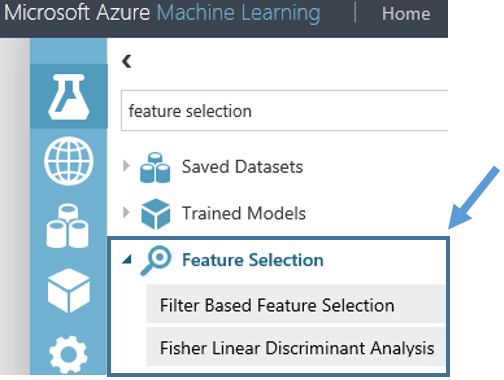
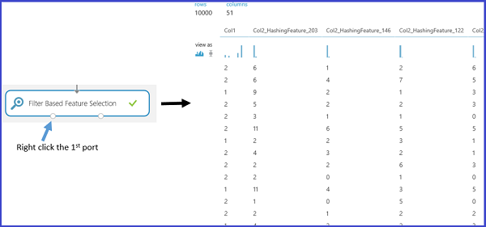

<properties
    pageTitle="Portare in primo piano selezione del processo di scienze dei dati del Team | Microsoft Azure" 
    description="Viene illustrato lo scopo della funzionalità di selezione e vengono forniti esempi del proprio ruolo del processo di miglioramento dei dati di apprendimento."
    services="machine-learning"
    documentationCenter=""
    authors="bradsev"
    manager="jhubbard"
    editor="cgronlun"/>

<tags
    ms.service="machine-learning"
    ms.workload="data-services"
    ms.tgt_pltfrm="na"
    ms.devlang="na"
    ms.topic="article"
    ms.date="09/19/2016"
    ms.author="zhangya;bradsev" />

# Selezione delle caratteristiche in Team dati scienza processo (TDSP)

In questo articolo spiega fini della selezione delle caratteristiche e vengono forniti esempi del proprio ruolo del processo di miglioramento dei dati di apprendimento. In questi esempi vengono disegnati da Azure Machine Learning Studio. 

[AZURE.INCLUDE [machine-learning-free-trial](../../includes/machine-learning-free-trial.md)]

In questo argomento viene illustrato lo scopo della funzionalità di selezione e vengono forniti esempi del proprio ruolo del processo di miglioramento dei dati di apprendimento. In questi esempi vengono disegnati da Azure Machine Learning Studio. 

La progettazione e la selezione delle caratteristiche da una parte di TDSP delineata la [Qual è la procedura di scienze di dati del Team?](data-science-process-overview.md). Caratteristica Progettazione e la selezione sono parti del passaggio **caratteristiche di sviluppo** del TDSP.

* **Progettazione di funzionalità**: questo processo tenta di creare le caratteristiche aggiuntive di pertinenti dalle caratteristiche non elaborate esistenti nei dati e per aumentare stima power all'algoritmo di apprendimento.

* **selezione delle caratteristiche**: questo processo seleziona il subset principali funzionalità dei dati originali durante un tentativo di ridurre la dimensionalità del problema formazione.

In genere **Progettazione funzionalità** viene applicato prima di tutto per generare caratteristiche aggiuntive e quindi il passaggio di **selezione delle caratteristiche** viene eseguito per eliminare le funzionalità irrilevante, ridondanti o altamente correlate.

## Funzionalità di filtro dai dati - selezione delle caratteristiche 

Selezione delle caratteristiche è un processo che in genere viene applicato per la costruzione di set di dati di formazione per le attività di modellazione previsione, ad esempio la classificazione o regressione attività. L'obiettivo consiste nel selezionare un sottoinsieme delle caratteristiche dal set di dati originale che ridurre le dimensioni utilizzando un set di funzionalità minimo per rappresentare la maggior quantità di variazione dei dati. Questo sottoinsieme di caratteristiche sono quindi le caratteristiche sola da includere per formare il modello. Selezione delle caratteristiche ha due funzioni principale.

* Selezione delle caratteristiche prima di tutto, spesso aumenta la precisione di classificazione, eliminando irrilevante, ridondanti o strettamente collegata a una funzionalità.
* In secondo luogo, ridurre il numero di funzionalità che rende più efficiente il processo di formazione su modello. Questa operazione è particolarmente importante per professionisti costosa formare, ad esempio macchine di vettore di supporto.

Sebbene selezione delle caratteristiche di ricerca per ridurre il numero delle caratteristiche di set di dati utilizzato per formare il modello, esso non è in genere a cui fa riferimento il termine "riduzione dimensionalità". Metodi di selezione caratteristica estraggono un sottoinsieme di funzionalità originale nei dati senza convertirli.  Metodi di riduzione dimensionalità utilizzano ingegneria caratteristiche che possono trasformare le caratteristiche originale e quindi modificarle. Analisi dei componenti di capitale, l'analisi di correlazione canonico e scomposizione valore singolare esempi di metodi di riduzione dimensionalità.

Ad esempio, categoria ampiamente applicata uno dei metodi di selezione di funzionalità in un contesto controllato rappresenta la cosiddetta "selezione delle caratteristiche di filtro in base a". Nel valutare la correlazione tra ogni caratteristica e l'attributo di destinazione, questi metodi applicano una misura statistica per assegnare un punteggio a ogni caratteristica. Le caratteristiche sono quindi in base a punteggio, che può essere utilizzato per impostare la soglia per mantenere o eliminare una funzionalità specifica. Le misure statistiche usate in questi metodi includono persona correlazione informazione reciproca e il test Chi quadrato.

In Azure Machine Learning Studio, sono disponibili moduli disponibili per la selezione di funzionalità. Come mostrato nella figura seguente, questi moduli includono [selezione delle caratteristiche di filtro basato] [ filter-based-feature-selection] [Fisher lineare Discriminant analisi]e[fisher-linear-discriminant-analysis].

È consigliabile, ad esempio, l'utilizzo della [selezione delle caratteristiche di filtro basato] [ filter-based-feature-selection] modulo. Per comodità, si continuerà a utilizzare il testo di esempio di data mining descritto in precedenza. Si supponga che si desidera creare un modello di regressione dopo la creazione di un set di 256 caratteristiche tramite la [Caratteristica Hashing] [ feature-hashing] modulo e che la variabile di risposta è "Col1" e rappresenta un libro rivedere valutazioni compreso tra 1 e 5. Mediante l'impostazione "Portare in primo piano metodo punteggio" da "Correlazione di Pearson", "colonna di destinazione" da "Col1" e "Quante caratteristiche desiderate" su 50. Quindi il modulo [selezione delle caratteristiche di filtro basato] [ filter-based-feature-selection] produrranno un set di dati che contiene 50 caratteristiche con l'attributo di destinazione "Col1". La figura seguente mostra il flusso di questa prova e i parametri di input che descritta in precedenza.

La figura seguente mostra i set di dati risultante. Nella correlazione di Pearson tra se stesso e per l'attributo di destinazione "Col1" è totalizza basate su ogni caratteristica. Le caratteristiche con i punteggi migliori vengono mantenute.

Nella figura seguente vengono visualizzati i punteggi corrispondenti delle funzionalità selezionate.

Applicando questa [selezione delle caratteristiche di filtro basato] [ filter-based-feature-selection] modulo, 50 di 256 caratteristiche selezionate sono in quanto hanno le caratteristiche più correlate con la variabile di destinazione "Col1", in base al punteggio metodo "Correlazione di Pearson".

## Conclusioni
Progettazione di caratteristiche e funzionalità di selezione sono due comunemente progettata e le funzionalità selezionate aumentano l'efficienza del processo di formazione che tenta di estrarre le informazioni chiave contenute nei dati. Facilitano inoltre la potenza di questi modelli per classificare i dati di input in modo accurato e prevedere più efficiente dei risultati di interesse. Caratteristica Progettazione e la selezione anche possibile combinare per rendere più dal punto di vista gestibile le risorse. Ciò avviene tramite ottimizzazione e provare a ridurre il numero di funzionalità necessarie per calibrare o formare un modello. Matematicamente, le caratteristiche per formare il modello sono un numero minimo di variabili indipendenti che illustrano le tendenze nei dati e quindi prevedere risultati correttamente.

Si noti che non è sempre necessariamente per l'esecuzione di selezione delle caratteristiche di progettazione o funzionalità. Se è necessaria o meno dipende dai dati si dispone o la raccolta, l'algoritmo che è selezionare e l'obiettivo di prova.

<!-- Module References -->
[feature-hashing]: https://msdn.microsoft.com/library/azure/c9a82660-2d9c-411d-8122-4d9e0b3ce92a/
[filter-based-feature-selection]: https://msdn.microsoft.com/library/azure/918b356b-045c-412b-aa12-94a1d2dad90f/
[fisher-linear-discriminant-analysis]: https://msdn.microsoft.com/library/azure/dcaab0b2-59ca-4bec-bb66-79fd23540080/
 
