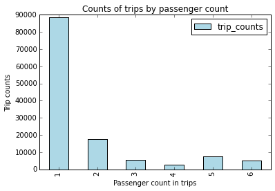
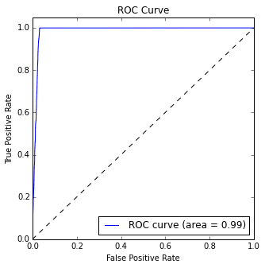

<properties
    pageTitle="Esplorazione dei dati e modellazione con motori | Microsoft Azure"
    description="Illustra le funzionalità di analisi e modellazione dei dati del toolkit ad MLlib."
    services="machine-learning"
    documentationCenter=""
    authors="bradsev"
    manager="jhubbard"
    editor="cgronlun" />

<tags
    ms.service="machine-learning"
    ms.workload="data-services"
    ms.tgt_pltfrm="na"
    ms.devlang="na"
    ms.topic="article"
    ms.date="10/07/2016"
    ms.author="deguhath;bradsev;gokuma" />

# Esplorazione dei dati e modellazione con motori

[AZURE.INCLUDE [machine-learning-spark-modeling](../../includes/machine-learning-spark-modeling.md)]

In questa procedura dettagliata utilizza HDInsight Spark eseguire esplorazione dei dati e classificazione binaria regressione modellazione attività su un campione del Roma taxi viaggio e presentare 2013 set di dati.  Illustra i passaggi del [Processo di scienze dei dati](http://aka.ms/datascienceprocess), -to-end, utilizzando una HDInsight Spark cluster per l'elaborazione e Azure BLOB per archiviare i dati e i modelli. Il processo di Esplora e visualizza i dati importati da un Blob di spazio di archiviazione di Azure e quindi prepara i dati per la creazione di modelli di previsione. Questi modelli sono compilazione utilizzando il toolkit di MLlib ad eseguire le attività di modellazione di regressione e classificazione binaria.

- L'attività di **classificazione binaria** consiste nel prevedere o meno un suggerimento è pagato per il viaggio. 
- L'attività di **regressione** è per stimare la quantità di suggerimento in base alle altre caratteristiche di suggerimento. 

I modelli che serve includono regressione logistica e lineare, casuale insiemi di strutture e strutture invece un incremento sfumature:

- [Regressione lineare con SGD](https://spark.apache.org/docs/latest/api/python/pyspark.mllib.html#pyspark.mllib.regression.LinearRegressionWithSGD) è un modello di regressione lineare che utilizza un metodo stocastico discesa sfumatura (SGD) e proporzioni dei caratteri per prevedere gli importi di suggerimento pagato per l'ottimizzazione e funzionalità. 
- Regressione [regressione logistica con LBFGS](https://spark.apache.org/docs/latest/api/python/pyspark.mllib.html#pyspark.mllib.classification.LogisticRegressionWithLBFGS) o "logit", è un modello di regressione che può essere utilizzato quando la variabile dipendente è per categoria eseguire classificazione di dati. LBFGS è un algoritmo di ottimizzazione Pisani periodo di quasi che si avvicina algoritmo Broyden-Fletcher-Goldfarb – Shanno (BFGS) utilizzando un numero limitato di memoria del computer e che usato in apprendimento.
- [Casuale insiemi](http://spark.apache.org/docs/latest/mllib-ensembles.html#Random-Forests) sono per ragazzo di decisionali.  Combinano molti decisionali per ridurre il rischio di sovradattamento. Insiemi casuali vengono utilizzati per regressione e classificazione e possono gestire caratteristiche per categoria e possono essere esteso per l'impostazione di classificazione multiclass. Utenti che non richiedono funzionalità di scalabilità e sono in grado di acquisire non linearità e portare in primo piano interazioni. Insiemi casuali sono uno dei più efficace apprendimento modelli per la classificazione e regressione.
- [Sfumatura aumentata alberi](http://spark.apache.org/docs/latest/ml-classification-regression.html#gradient-boosted-trees-gbts) (GBTs) sono per ragazzo di decisionali. GBTs formare decisionali in modo iterativo per ridurre a icona una funzione di perdita. GBTs vengono utilizzati per regressione e classificazione e può gestire caratteristiche per categoria, non richiedono funzionalità di scalabilità e sono in grado di acquisire non linearità e interazioni portare in primo piano. Possono inoltre essere utilizzati in un'impostazione di classificazione multiclass.

La procedura di modellazione inoltre contiene codice illustrano come organizzare la formazione, valutare e salvare ogni tipo di modello. Python è stato utilizzato per il codice della soluzione e mostrare posti pertinenti.   

>[AZURE.NOTE] Sebbene il toolkit di motori MLlib è progettato allo svolgimento di grandi dimensioni set di dati, un campione relativamente (circa 30 Mb con righe 170K, circa 0,1% del set di dati di Roma originale) viene utilizzato qui per comodità. Esercizio fornita di seguito viene eseguito in modo efficiente (in circa 10 minuti) in un cluster di HDInsight con 2 nodi di lavoro. Lo stesso codice, con le modifiche secondarie, può essere utilizzato per elaborare più grande-set di dati, con le modifiche appropriate per la memorizzazione nella cache dei dati in memoria e modificare la dimensione cluster.

## Prerequisiti

È necessario un account Azure e un HDInsight motori è necessario un 1.6 di motori 3.4 HDInsight cluster per completare questa procedura dettagliata. Vedere la [Panoramica dei dati scienza utilizzando motori su Azure HDInsight](machine-learning-data-science-spark-overview.md) per istruzioni su come tali requisiti. Questo argomento contiene anche una descrizione dei dati Roma 2013 Taxi utilizzati qui e istruzioni su come eseguire il codice da un blocco appunti Jupyter cluster motori. Il blocco appunti **pySpark-machine-learning-data-science-spark-data-exploration-modeling.ipynb** che contiene gli esempi di codice in questo argomento è disponibile in [Github](https://github.com/Azure/Azure-MachineLearning-DataScience/tree/master/Misc/Spark/pySpark). 

[AZURE.INCLUDE [delete-cluster-warning](../../includes/hdinsight-delete-cluster-warning.md)]

## Installazione: percorsi di archiviazione, raccolte e il contesto di motori predefinito

Motori sono in grado di leggere e scrivere Azure lo spazio di archiviazione Blob (noto anche come WASB). In modo che i dati esistenti archiviati sono possono essere elaborati utilizzando vivacità ed i risultati nuovamente archiviati in WASB.

Per salvare i modelli o file in WASB, è necessario specificare correttamente il percorso. Il contenitore predefinito associato al cluster motori è possibile fare riferimento utilizzando un percorso che inizia con: "wasb: / / /". Altri percorsi fanno riferimento "wasb: / /".

### Impostare i percorsi di directory per i percorsi di archiviazione in WASB

Nell'esempio seguente specifica la posizione dei dati per la lettura e il percorso della directory di archiviazione modello in cui è salvato l'output di modello:

    # SET PATHS TO FILE LOCATIONS: DATA AND MODEL STORAGE

    # LOCATION OF TRAINING DATA
    taxi_train_file_loc = "wasb://mllibwalkthroughs@cdspsparksamples.blob.core.windows.net/Data/NYCTaxi/JoinedTaxiTripFare.Point1Pct.Train.tsv";

    # SET THE MODEL STORAGE DIRECTORY PATH 
    # NOTE THAT THE FINAL BACKSLASH IN THE PATH IS NEEDED.
    modelDir = "wasb:///user/remoteuser/NYCTaxi/Models/" 

### Librerie di importazione

Configurare richiede l'importazione di librerie necessarie. Impostare il contesto di motori e importare necessarie raccolte con il codice seguente:

    # IMPORT LIBRARIES
    import pyspark
    from pyspark import SparkConf
    from pyspark import SparkContext
    from pyspark.sql import SQLContext
    import matplotlib
    import matplotlib.pyplot as plt
    from pyspark.sql import Row
    from pyspark.sql.functions import UserDefinedFunction
    from pyspark.sql.types import *
    import atexit
    from numpy import array
    import numpy as np
    import datetime

### Contesto di motori preimpostato e PySpark magics

La x PySpark forniti con i blocchi appunti Jupyter avere un contesto predefinito. Pertanto non è necessario impostare i motori o lo sviluppo di Hive contesti in modo esplicito prima di iniziare a utilizzare l'applicazione. Contesti seguenti sono disponibili per impostazione predefinita. Questi contesti sono:

- SC - per motori 
- sqlContext - per Hive

Il kernel PySpark fornisce alcuni predefiniti "magics", che sono comandi speciali che è possibile chiamare con % %. Sono disponibili due tali comandi usati in questi esempi di codice.

- **% % locale** Specifica che il codice nelle righe successive è possibile eseguire in locale. Codice deve essere codice Python valido.
- **%%sql -o <variable name>** Esegue una query Hive il sqlContext. Se il parametro -o viene passato, il risultato della query viene mantenuto nella % contesto Python locale come un DataFrame Pandas.
 

Per ulteriori informazioni sulla x per i blocchi appunti Jupyter e predefinito "magics" che forniscono, vedere [disponibili per i blocchi appunti Jupyter con i cluster Linux ad HDInsight su HDInsight. X](../hdinsight/hdinsight-apache-spark-jupyter-notebook-kernels.md).
 

## Acquisizione di dati da blob pubblica

È il primo passaggio del processo di scienze dei dati per acquisire i dati da analizzare origini nel punto in cui è si trova nel proprio ambiente di modellazione e l'esplorazione dei dati. L'ambiente è motori in questa procedura dettagliata. In questa sezione contiene il codice per completare una serie di attività:

- acquisire l'esempio di dati da modellare
- leggere il set di dati di input (archiviato come file tsv)
- formattare ed eliminare i dati
- creare e memorizzare nella cache oggetti (RDDs o frame di dati) in memoria
- la registrazione come una tabella temp nel contesto di SQL.

Ecco il codice di acquisizione di dati.

    # INGEST DATA

    # RECORD START TIME
    timestart = datetime.datetime.now()

    # IMPORT FILE FROM PUBLIC BLOB
    taxi_train_file = sc.textFile(taxi_train_file_loc)
    
    # GET SCHEMA OF THE FILE FROM HEADER
    schema_string = taxi_train_file.first()
    fields = [StructField(field_name, StringType(), True) for field_name in schema_string.split('\t')]
    fields[7].dataType = IntegerType() #Pickup hour
    fields[8].dataType = IntegerType() # Pickup week
    fields[9].dataType = IntegerType() # Weekday
    fields[10].dataType = IntegerType() # Passenger count
    fields[11].dataType = FloatType() # Trip time in secs
    fields[12].dataType = FloatType() # Trip distance
    fields[19].dataType = FloatType() # Fare amount
    fields[20].dataType = FloatType() # Surcharge
    fields[21].dataType = FloatType() # Mta_tax
    fields[22].dataType = FloatType() # Tip amount
    fields[23].dataType = FloatType() # Tolls amount
    fields[24].dataType = FloatType() # Total amount
    fields[25].dataType = IntegerType() # Tipped or not
    fields[26].dataType = IntegerType() # Tip class
    taxi_schema = StructType(fields)
    
    # PARSE FIELDS AND CONVERT DATA TYPE FOR SOME FIELDS
    taxi_header = taxi_train_file.filter(lambda l: "medallion" in l)
    taxi_temp = taxi_train_file.subtract(taxi_header).map(lambda k: k.split("\t"))\
            .map(lambda p: (p[0],p[1],p[2],p[3],p[4],p[5],p[6],int(p[7]),int(p[8]),int(p[9]),int(p[10]),
                            float(p[11]),float(p[12]),p[13],p[14],p[15],p[16],p[17],p[18],float(p[19]),
                            float(p[20]),float(p[21]),float(p[22]),float(p[23]),float(p[24]),int(p[25]),int(p[26])))
    
    
    # CREATE DATA FRAME
    taxi_train_df = sqlContext.createDataFrame(taxi_temp, taxi_schema)
    
    # CREATE A CLEANED DATA-FRAME BY DROPPING SOME UN-NECESSARY COLUMNS & FILTERING FOR UNDESIRED VALUES OR OUTLIERS
    taxi_df_train_cleaned = taxi_train_df.drop('medallion').drop('hack_license').drop('store_and_fwd_flag').drop('pickup_datetime')\
        .drop('dropoff_datetime').drop('pickup_longitude').drop('pickup_latitude').drop('dropoff_latitude')\
        .drop('dropoff_longitude').drop('tip_class').drop('total_amount').drop('tolls_amount').drop('mta_tax')\
        .drop('direct_distance').drop('surcharge')\
        .filter("passenger_count > 0 and passenger_count < 8 AND payment_type in ('CSH', 'CRD') AND tip_amount >= 0 AND tip_amount < 30 AND fare_amount >= 1 AND fare_amount < 150 AND trip_distance > 0 AND trip_distance < 100 AND trip_time_in_secs > 30 AND trip_time_in_secs < 7200" )

    
    # CACHE DATA-FRAME IN MEMORY & MATERIALIZE DF IN MEMORY
    taxi_df_train_cleaned.cache()
    taxi_df_train_cleaned.count()
    
    # REGISTER DATA-FRAME AS A TEMP-TABLE IN SQL-CONTEXT
    taxi_df_train_cleaned.registerTempTable("taxi_train")
    
    # PRINT HOW MUCH TIME IT TOOK TO RUN THE CELL
    timeend = datetime.datetime.now()
    timedelta = round((timeend-timestart).total_seconds(), 2) 
    print "Time taken to execute above cell: " + str(timedelta) + " seconds";

**OUTPUT:**

Tempo per eseguire sopra la cella: secondi 51.72

## Visualizzazione ed esplorazione dei dati

Dopo aver creato i dati sono stati scaricati in motori, il passaggio successivo del processo di scienze dati consiste per ottenere più approfondita dei dati tramite esplorazione e di visualizzazione. In questa sezione è esaminare i dati di taxi mediante query SQL e tracciare le variabili di destinazione e potenziali caratteristiche per il controllo visivo. In particolare, è tracciare la frequenza di conteggi passeggeri taxi viaggi, specificare la frequenza degli importi di suggerimento e come suggerimenti variano in base tipo e importo del pagamento.

### Tracciare un istogramma della frequenza di conteggio passeggeri nel campione di trip taxi

Questo codice e i frammenti di codice successive utilizzare chiave SQL per il campione e speciale locale per tracciare i dati della query.

- **Chiave SQL (`%%sql`)** Il kernel HDInsight PySpark supporta la sqlContext query HiveQL all'interno del testo semplice. Il (-o nome_variabile) argomento mantiene l'output della query SQL sotto forma di una DataFrame Pandas nel server Jupyter. Di conseguenza, che è disponibile in modalità locale.
- Il ** `%%local` chiave** viene utilizzato per eseguire il codice in locale nel server Jupyter, ossia headnode del cluster HDInsight. In genere, si utilizza `%%local` particolare in combinazione con la `%%sql` strumento con parametro -o. Il parametro -o da mantenere l'output della query SQL in locale e quindi % locale speciale attiverà i successivi di frammento di codice per eseguire in locale per l'output della query SQL in modo permanente in locale

Output di cui verrà visualizzato automaticamente dopo l'esecuzione di codice.

La query recupera trip dal conteggio passeggeri. 

    # PLOT FREQUENCY OF PASSENGER COUNTS IN TAXI TRIPS

    # HIVEQL QUERY AGAINST THE sqlContext
    %%sql -q -o sqlResults
    SELECT passenger_count, COUNT(*) as trip_counts 
    FROM taxi_train 
    WHERE passenger_count > 0 and passenger_count < 7 
    GROUP BY passenger_count 

Questo codice crea un intervallo di dati locale dall'output della query e vengono tracciati i dati. Il `%%local` speciale crea una cornice di dati locale, `sqlResults`, che può essere utilizzato per tracciare con matplotlib. 

>[AZURE.NOTE] Questa attività PySpark viene utilizzata più volte in questa procedura dettagliata. Se la quantità di dati è grande, deve di esempio per creare un intervallo di dati che può essere visualizzati nella cache locale.

    #CREATE LOCAL DATA-FRAME AND USE FOR MATPLOTLIB PLOTTING

    # RUN THE CODE LOCALLY ON THE JUPYTER SERVER
    %%local
    
    # USE THE JUPYTER AUTO-PLOTTING FEATURE TO CREATE INTERACTIVE FIGURES. 
    # CLICK ON THE TYPE OF PLOT TO BE GENERATED (E.G. LINE, AREA, BAR ETC.)
    sqlResults

Ecco il codice per tracciare viaggi da passeggeri conteggi

    # PLOT PASSENGER NUMBER VS. TRIP COUNTS
    %%local
    import matplotlib.pyplot as plt
    %matplotlib inline
    
    x_labels = sqlResults['passenger_count'].values
    fig = sqlResults[['trip_counts']].plot(kind='bar', facecolor='lightblue')
    fig.set_xticklabels(x_labels)
    fig.set_title('Counts of trips by passenger count')
    fig.set_xlabel('Passenger count in trips')
    fig.set_ylabel('Trip counts')
    plt.show()

**OUTPUT:**

È possibile scegliere tra diversi tipi di visualizzazioni (tabella, grafici a torta, riga, Area o barra) utilizzando i pulsanti di menu **tipo** nel blocco appunti. Tracciato barra è illustrato di seguito.
    
### Tracciare un istogramma che mostra gli importi di suggerimento e come quantità di suggerimento varia in base ai valori conta. numeri e tariffa passeggeri.

Utilizzare una query SQL per i dati di esempio.

    #PLOT HISTOGRAM OF TIP AMOUNTS AND VARIATION BY PASSENGER COUNT AND PAYMENT TYPE
    
    # HIVEQL QUERY AGAINST THE sqlContext
    %%sql -q -o sqlResults
    SELECT fare_amount, passenger_count, tip_amount, tipped 
    FROM taxi_train 
    WHERE passenger_count > 0 
    AND passenger_count < 7 
    AND fare_amount > 0 
    AND fare_amount < 200 
    AND payment_type in ('CSH', 'CRD') 
    AND tip_amount > 0 
    AND tip_amount < 25

Questo codice nella cella viene utilizzata la query SQL per creare tre posti i dati.

    # RUN THE CODE LOCALLY ON THE JUPYTER SERVER
    %%local
    
    # HISTOGRAM OF TIP AMOUNTS AND PASSENGER COUNT
    ax1 = sqlResults[['tip_amount']].plot(kind='hist', bins=25, facecolor='lightblue')
    ax1.set_title('Tip amount distribution')
    ax1.set_xlabel('Tip Amount ($)')
    ax1.set_ylabel('Counts')
    plt.suptitle('')
    plt.show()
    
    # TIP BY PASSENGER COUNT
    ax2 = sqlResults.boxplot(column=['tip_amount'], by=['passenger_count'])
    ax2.set_title('Tip amount by Passenger count')
    ax2.set_xlabel('Passenger count')
    ax2.set_ylabel('Tip Amount ($)')
    plt.suptitle('')
    plt.show()
    
    # TIP AMOUNT BY FARE AMOUNT, POINTS ARE SCALED BY PASSENGER COUNT
    ax = sqlResults.plot(kind='scatter', x= 'fare_amount', y = 'tip_amount', c='blue', alpha = 0.10, s=5*(sqlResults.passenger_count))
    ax.set_title('Tip amount by Fare amount')
    ax.set_xlabel('Fare Amount ($)')
    ax.set_ylabel('Tip Amount ($)')
    plt.axis([-2, 100, -2, 20])
    plt.show()

**OUTPUT:** 

## Preparazione di progettazione, la trasformazione e dati per una modellazione portare in primo piano
In questa sezione descrive e fornisce il codice per le procedure di preparare i dati per l'utilizzo in modellazione ML. Viene illustrato come eseguire le operazioni seguenti:

- Creare una nuova caratteristica di ore binning in intervalli di tempo il traffico
- Indicizzare e codificare funzioni per categoria
- Creazione di oggetti point etichetta quando i dati immessi nelle funzioni ML
- Creare un sondaggio secondari dei dati e dividere in formazione e verifica set
- Funzionalità di scalabilità
- Oggetti cache in memoria

### Creare una nuova caratteristica di ore binning in intervalli di tempo il traffico

Questo codice viene illustrato come creare una nuova caratteristica di ore binning in intervalli di tempo il traffico e quindi come memorizzare nella cache frame di dati risultante in memoria. Quando sono utilizzati più volte flessibili distribuito set di dati (RDDs) e frame di dati, la memorizzazione nella cache conduce ad migliorato i tempi di esecuzione. Di conseguenza, nella cache RDDs e frame di dati in varie fasi della procedura dettagliata. 

    # CREATE FOUR BUCKETS FOR TRAFFIC TIMES
    sqlStatement = """
        SELECT *,
        CASE
         WHEN (pickup_hour <= 6 OR pickup_hour >= 20) THEN "Night" 
         WHEN (pickup_hour >= 7 AND pickup_hour <= 10) THEN "AMRush" 
         WHEN (pickup_hour >= 11 AND pickup_hour <= 15) THEN "Afternoon"
         WHEN (pickup_hour >= 16 AND pickup_hour <= 19) THEN "PMRush"
        END as TrafficTimeBins
        FROM taxi_train 
    """
    taxi_df_train_with_newFeatures = sqlContext.sql(sqlStatement)
    
    # CACHE DATA-FRAME IN MEMORY & MATERIALIZE DF IN MEMORY
    # THE .COUNT() GOES THROUGH THE ENTIRE DATA-FRAME,
    # MATERIALIZES IT IN MEMORY, AND GIVES THE COUNT OF ROWS.
    taxi_df_train_with_newFeatures.cache()
    taxi_df_train_with_newFeatures.count()

**OUTPUT:** 

126050

### Indicizzare e codificare funzioni per categoria quando i dati immessi nelle funzioni di modellazione

In questa sezione viene illustrato come indicizzare o codificare funzioni per categoria quando i dati immessi nelle funzioni di modellazione. La modellazione e prevedere le funzioni di MLlib sono necessarie caratteristiche con dati di input per categoria essere indicizzate o codificato prima di utilizzare. A seconda del modello, è necessario indicizzare o li codifica in diversi modi:  

- **Modellazione basata su struttura** richiede categorie da codificare come valori numerici (ad esempio, una caratteristica con tre categorie potrebbe codifica con 0; 1; 2). Viene fornito dalla funzione [StringIndexer](http://spark.apache.org/docs/latest/ml-features.html#stringindexer) del MLlib. Questa funzione codifica una colonna di stringhe di etichette a una colonna di indici etichetta ordinati per frequenza etichetta. Sebbene indicizzato con i valori numerici per l'input e la gestione dei dati, è possono specificare algoritmi basati sulla struttura di gestire in modo appropriato come categorie. 

- **Modelli Logistic e di regressione lineare** richiedono hot una codifica, in cui, ad esempio, una caratteristica con tre categorie può essere espansi in tre colonne di funzionalità, con ogni contenente 0 o 1 a seconda della categoria di un osservazioni. MLlib offre funzione [OneHotEncoder](http://scikit-learn.org/stable/modules/generated/sklearn.preprocessing.OneHotEncoder.html#sklearn.preprocessing.OneHotEncoder) per eseguire hot una codifica. Questo codificatore esegue il mapping di una colonna di indici etichetta a una colonna di vettori binari, con almeno un singolo uno-valore. Questa codifica consente algoritmi aspettarsi le caratteristiche di valori numeriche, come regressione logistica, da applicare alle caratteristiche per categoria.

Ecco il codice di indice e codificare funzioni per categoria:

    # INDEX AND ENCODE CATEGORICAL FEATURES

    # RECORD START TIME
    timestart = datetime.datetime.now()

    # LOAD PYSPARK LIBRARIES    
    from pyspark.ml.feature import OneHotEncoder, StringIndexer, VectorAssembler, VectorIndexer
    
    # INDEX AND ENCODE VENDOR_ID
    stringIndexer = StringIndexer(inputCol="vendor_id", outputCol="vendorIndex")
    model = stringIndexer.fit(taxi_df_train_with_newFeatures) # Input data-frame is the cleaned one from above
    indexed = model.transform(taxi_df_train_with_newFeatures)
    encoder = OneHotEncoder(dropLast=False, inputCol="vendorIndex", outputCol="vendorVec")
    encoded1 = encoder.transform(indexed)
    
    # INDEX AND ENCODE RATE_CODE
    stringIndexer = StringIndexer(inputCol="rate_code", outputCol="rateIndex")
    model = stringIndexer.fit(encoded1)
    indexed = model.transform(encoded1)
    encoder = OneHotEncoder(dropLast=False, inputCol="rateIndex", outputCol="rateVec")
    encoded2 = encoder.transform(indexed)
    
    # INDEX AND ENCODE PAYMENT_TYPE
    stringIndexer = StringIndexer(inputCol="payment_type", outputCol="paymentIndex")
    model = stringIndexer.fit(encoded2)
    indexed = model.transform(encoded2)
    encoder = OneHotEncoder(dropLast=False, inputCol="paymentIndex", outputCol="paymentVec")
    encoded3 = encoder.transform(indexed)
    
    # INDEX AND TRAFFIC TIME BINS
    stringIndexer = StringIndexer(inputCol="TrafficTimeBins", outputCol="TrafficTimeBinsIndex")
    model = stringIndexer.fit(encoded3)
    indexed = model.transform(encoded3)
    encoder = OneHotEncoder(dropLast=False, inputCol="TrafficTimeBinsIndex", outputCol="TrafficTimeBinsVec")
    encodedFinal = encoder.transform(indexed)
    
    # PRINT ELAPSED TIME
    timeend = datetime.datetime.now()
    timedelta = round((timeend-timestart).total_seconds(), 2) 
    print "Time taken to execute above cell: " + str(timedelta) + " seconds"; 

**OUTPUT:**

Tempo per eseguire sopra la cella: 1,28 secondi

### Creazione di oggetti point etichetta quando i dati immessi nelle funzioni ML

In questa sezione contiene codice che illustra come indicizzare i dati di testo per categoria come tipo di dati decimale etichetta e la codifica in modo che può essere utilizzato per organizzare la formazione e testare regressione logistica MLlib e altri modelli di classificazione. Gli oggetti punto etichetta sono flessibili distribuito set di dati (RDD) formattate in modo che è necessario come dati di input per la maggior parte degli algoritmi ML in MLlib. Un' [etichetta punto](https://spark.apache.org/docs/latest/mllib-data-types.html#labeled-point) è un vettore locale, densità o caricato in memoria bassa, associata a un'etichetta/risposta.  

In questa sezione contiene codice che illustra come indicizzare i dati di testo per categoria come tipo di dati [etichetta punto](https://spark.apache.org/docs/latest/mllib-data-types.html#labeled-point) e la codifica in modo che può essere utilizzato per organizzare la formazione e testare regressione logistica MLlib e altri modelli di classificazione. Gli oggetti punto etichetta sono flessibili distribuito set di dati (RDD) costituito da un'etichetta (variabile di destinazione/risposta) e un vettore di funzionalità. In questo formato è necessario come input per molti algoritmi ML in MLlib.

Ecco il codice di indice e codificare funzioni di testo per la classificazione binaria.

    # FUNCTIONS FOR BINARY CLASSIFICATION

    # LOAD LIBRARIES
    from pyspark.mllib.regression import LabeledPoint
    from numpy import array

    # INDEXING CATEGORICAL TEXT FEATURES FOR INPUT INTO TREE-BASED MODELS
    def parseRowIndexingBinary(line):
        features = np.array([line.paymentIndex, line.vendorIndex, line.rateIndex, line.TrafficTimeBinsIndex,
                             line.pickup_hour, line.weekday, line.passenger_count, line.trip_time_in_secs, 
                             line.trip_distance, line.fare_amount])
        labPt = LabeledPoint(line.tipped, features)
        return  labPt
    
    # ONE-HOT ENCODING OF CATEGORICAL TEXT FEATURES FOR INPUT INTO LOGISTIC RERESSION MODELS
    def parseRowOneHotBinary(line):
        features = np.concatenate((np.array([line.pickup_hour, line.weekday, line.passenger_count,
                                            line.trip_time_in_secs, line.trip_distance, line.fare_amount]), 
                                            line.vendorVec.toArray(), line.rateVec.toArray(), 
                                            line.paymentVec.toArray(), line.TrafficTimeBinsVec.toArray()), axis=0)
        labPt = LabeledPoint(line.tipped, features)
        return  labPt

Ecco il codice per la codifica e indicizzare le caratteristiche di testo per categoria per l'analisi della regressione lineare.

    # FUNCTIONS FOR REGRESSION WITH TIP AMOUNT AS TARGET VARIABLE

    # ONE-HOT ENCODING OF CATEGORICAL TEXT FEATURES FOR INPUT INTO TREE-BASED MODELS
    def parseRowIndexingRegression(line):
        features = np.array([line.paymentIndex, line.vendorIndex, line.rateIndex, line.TrafficTimeBinsIndex, 
                             line.pickup_hour, line.weekday, line.passenger_count, line.trip_time_in_secs, 
                             line.trip_distance, line.fare_amount])

        labPt = LabeledPoint(line.tip_amount, features)
        return  labPt
    
    # INDEXING CATEGORICAL TEXT FEATURES FOR INPUT INTO LINEAR REGRESSION MODELS
    def parseRowOneHotRegression(line):
        features = np.concatenate((np.array([line.pickup_hour, line.weekday, line.passenger_count,
                                            line.trip_time_in_secs, line.trip_distance, line.fare_amount]), 
                                            line.vendorVec.toArray(), line.rateVec.toArray(), 
                                            line.paymentVec.toArray(), line.TrafficTimeBinsVec.toArray()), axis=0)
        labPt = LabeledPoint(line.tip_amount, features)
        return  labPt

### Creare un sondaggio secondari dei dati e dividere in formazione e verifica set

Questo codice crea sondaggio di dati (25% viene usato qui). Anche se non è richiesta in questo esempio a causa delle dimensioni del set di dati, viene illustrato come è possibile di esempio qui per sapere quali da utilizzare per il proprio problema quando necessario. Dopo aver configurato esempi di grandi dimensioni, si può risparmiare molto tempo durante i modelli di formazione. Successivamente è dividere il campione in una parte di formazione (75%) e una parte di test (25%) da usare in classificazione e modellazione di regressione.

    # RECORD START TIME
    timestart = datetime.datetime.now()
    
    # LOAD PYSPARK LIBRARIES
    from pyspark.sql.functions import rand

    # SPECIFY SAMPLING AND SPLITTING FRACTIONS
    samplingFraction = 0.25;
    trainingFraction = 0.75; testingFraction = (1-trainingFraction);
    seed = 1234;
    encodedFinalSampled = encodedFinal.sample(False, samplingFraction, seed=seed)
    
    # SPLIT SAMPLED DATA-FRAME INTO TRAIN/TEST
    # INCLUDE RAND COLUMN FOR CREATING CROSS-VALIDATION FOLDS (FOR USE LATER IN AN ADVANCED TOPIC)
    dfTmpRand = encodedFinalSampled.select("*", rand(0).alias("rand"));
    trainData, testData = dfTmpRand.randomSplit([trainingFraction, testingFraction], seed=seed);
    
    # FOR BINARY CLASSIFICATION TRAINING AND TESTING
    indexedTRAINbinary = trainData.map(parseRowIndexingBinary)
    indexedTESTbinary = testData.map(parseRowIndexingBinary)
    oneHotTRAINbinary = trainData.map(parseRowOneHotBinary)
    oneHotTESTbinary = testData.map(parseRowOneHotBinary)
    
    # FOR REGRESSION TRAINING AND TESTING
    indexedTRAINreg = trainData.map(parseRowIndexingRegression)
    indexedTESTreg = testData.map(parseRowIndexingRegression)
    oneHotTRAINreg = trainData.map(parseRowOneHotRegression)
    oneHotTESTreg = testData.map(parseRowOneHotRegression)
    
    # PRINT ELAPSED TIME
    timeend = datetime.datetime.now()
    timedelta = round((timeend-timestart).total_seconds(), 2) 
    print "Time taken to execute above cell: " + str(timedelta) + " seconds"; 

**OUTPUT:**

Tempo per eseguire sopra la cella: 0,24 secondi

### Funzionalità di scalabilità

Funzionalità di scalabilità, noto anche come normalizzazione dei dati, assicura che funzioni con valori ampiamente esborsare sono non dato eccessiva valutare nella funzione obiettiva. Il codice per il ridimensionamento caratteristica utilizzato [StandardScaler](https://spark.apache.org/docs/latest/api/python/pyspark.mllib.html#pyspark.mllib.feature.StandardScaler) per ridimensionare le caratteristiche per la varianza di unità. Viene fornito da MLlib per l'utilizzo di regressione lineare con stocastico sfumatura discesa (SGD), un algoritmo più diffuso per formazione un'ampia gamma di altri modelli, ad esempio regolarizzarne regressione o supporto vettore macchine (SVM) di apprendimento.

>[AZURE.NOTE] È stato trovato algoritmo LinearRegressionWithSGD dalle proporzioni dei caratteri di portare in primo piano.

Ecco il codice a scala variabili per l'utilizzo con l'algoritmo SGD lineare regularized.

    # FEATURE SCALING

    # RECORD START TIME
    timestart = datetime.datetime.now()

    # LOAD PYSPARK LIBRARIES
    from pyspark.mllib.regression import LabeledPoint
    from pyspark.mllib.linalg import Vectors
    from pyspark.mllib.feature import StandardScaler, StandardScalerModel
    from pyspark.mllib.util import MLUtils
    
    # SCALE VARIABLES FOR REGULARIZED LINEAR SGD ALGORITHM
    label = oneHotTRAINreg.map(lambda x: x.label)
    features = oneHotTRAINreg.map(lambda x: x.features)
    scaler = StandardScaler(withMean=False, withStd=True).fit(features)
    dataTMP = label.zip(scaler.transform(features.map(lambda x: Vectors.dense(x.toArray()))))
    oneHotTRAINregScaled = dataTMP.map(lambda x: LabeledPoint(x[0], x[1]))
    
    label = oneHotTESTreg.map(lambda x: x.label)
    features = oneHotTESTreg.map(lambda x: x.features)
    scaler = StandardScaler(withMean=False, withStd=True).fit(features)
    dataTMP = label.zip(scaler.transform(features.map(lambda x: Vectors.dense(x.toArray()))))
    oneHotTESTregScaled = dataTMP.map(lambda x: LabeledPoint(x[0], x[1]))
    
    # PRINT ELAPSED TIME
    timeend = datetime.datetime.now()
    timedelta = round((timeend-timestart).total_seconds(), 2) 
    print "Time taken to execute above cell: " + str(timedelta) + " seconds"; 

**OUTPUT:**

Tempo per eseguire sopra la cella: 13.17 secondi

### Oggetti cache in memoria

Per la memorizzazione nella cache la cornice di dati di input oggetti usate per la classificazione, regressione e caratteristiche di architetture, è possibile ridurre il tempo necessario per la formazione e verifica degli algoritmi ML.

    # RECORD START TIME
    timestart = datetime.datetime.now()
    
    # FOR BINARY CLASSIFICATION TRAINING AND TESTING
    indexedTRAINbinary.cache()
    indexedTESTbinary.cache()
    oneHotTRAINbinary.cache()
    oneHotTESTbinary.cache()
    
    # FOR REGRESSION TRAINING AND TESTING
    indexedTRAINreg.cache()
    indexedTESTreg.cache()
    oneHotTRAINreg.cache()
    oneHotTESTreg.cache()
    
    # SCALED FEATURES
    oneHotTRAINregScaled.cache()
    oneHotTESTregScaled.cache()
    
    # PRINT ELAPSED TIME
    timeend = datetime.datetime.now()
    timedelta = round((timeend-timestart).total_seconds(), 2) 
    print "Time taken to execute above cell: " + str(timedelta) + " seconds"; 

**OUTPUT:** 

Tempo per eseguire sopra la cella: 0,15 secondi

## Prevedere o meno un suggerimento è pagato con i modelli di classificazione binario

Questa sezione illustra come usare tre modelli per l'attività di classificazione binario di previsione è pagato un suggerimento per un viaggio taxi o meno. I modelli presentati sono:

- Regolarizzarne regressione logistica 
- Modello casuale foresta
- Alberi di aumento della sfumati

Ogni modello creazione sezione codice viene suddiviso in passaggi: 

1. **Formazione su modello** dati con un set di parametro
2. **Valutazione del modello** su un set di dati di test con metriche
3. **Salvataggio modello** BLOB consumo futuro

### Classificazione mediante regressione logistica

Il codice in questa sezione viene illustrato come formare, valutare e salvare un modello di regressione logistica con [LBFGS](https://en.wikipedia.org/wiki/Broyden%E2%80%93Fletcher%E2%80%93Goldfarb%E2%80%93Shanno_algorithm) che prevede o meno un suggerimento è pagato un viaggio il set di dati di Roma taxi viaggio e tariffa.

**Formare il modello di regressione logistica mediante CV e hyperparameter sweep**

    # LOGISTIC REGRESSION CLASSIFICATION WITH CV AND HYPERPARAMETER SWEEPING

    # GET ACCURACY FOR HYPERPARAMETERS BASED ON CROSS-VALIDATION IN TRAINING DATA-SET

    # RECORD START TIME
    timestart = datetime.datetime.now()
    
    # LOAD LIBRARIES
    from pyspark.mllib.classification import LogisticRegressionWithLBFGS 
    from sklearn.metrics import roc_curve,auc
    from pyspark.mllib.evaluation import BinaryClassificationMetrics
    from pyspark.mllib.evaluation import MulticlassMetrics
    
    
    # CREATE MODEL WITH ONE SET OF PARAMETERS
    logitModel = LogisticRegressionWithLBFGS.train(oneHotTRAINbinary, iterations=20, initialWeights=None, 
                                                   regParam=0.01, regType='l2', intercept=True, corrections=10, 
                                                   tolerance=0.0001, validateData=True, numClasses=2)
    
    # PRINT COEFFICIENTS AND INTERCEPT OF THE MODEL
    # NOTE: There are 20 coefficient terms for the 10 features, 
    #       and the different categories for features: vendorVec (2), rateVec, paymentVec (6), TrafficTimeBinsVec (4)
    print("Coefficients: " + str(logitModel.weights))
    print("Intercept: " + str(logitModel.intercept))
    
    # PRINT ELAPSED TIME
    timeend = datetime.datetime.now()
    timedelta = round((timeend-timestart).total_seconds(), 2) 
    print "Time taken to execute above cell: " + str(timedelta) + " seconds"; 

**OUTPUT:** 

Coefficienti: [0.0082065285375,-0.0223675576104,-0.0183812028036, - 3.48124578069e-05,-0.00247646947233,-0.00165897881503, 0.0675394837328,-0.111823113101,-0.324609912762,-0.204549780032,-1.36499216354, 0.591088507921,-0.664263411392,-1.00439726852, 3.46567827545,-3.51025855172,-0.0471341112232,-0.043521833294, 0.000243375810385, 0.054518719222]

Intercetta:-0.0111216486893

Tempo per eseguire sopra la cella: secondi 14.43

**Valutare il modello di classificazione binario con i parametri di valutazione**

    #EVALUATE LOGISTIC REGRESSION MODEL WITH LBFGS

    # RECORD START TIME
    timestart = datetime.datetime.now()

    # PREDICT ON TEST DATA WITH MODEL
    predictionAndLabels = oneHotTESTbinary.map(lambda lp: (float(logitModel.predict(lp.features)), lp.label))
    
    # INSTANTIATE METRICS OBJECT
    metrics = BinaryClassificationMetrics(predictionAndLabels)

    # AREA UNDER PRECISION-RECALL CURVE
    print("Area under PR = %s" % metrics.areaUnderPR)

    # AREA UNDER ROC CURVE
    print("Area under ROC = %s" % metrics.areaUnderROC)
    metrics = MulticlassMetrics(predictionAndLabels)

    # OVERALL STATISTICS
    precision = metrics.precision()
    recall = metrics.recall()
    f1Score = metrics.fMeasure()
    print("Summary Stats")
    print("Precision = %s" % precision)
    print("Recall = %s" % recall)
    print("F1 Score = %s" % f1Score)

    ## SAVE MODEL WITH DATE-STAMP
    datestamp = unicode(datetime.datetime.now()).replace(' ','').replace(':','_');
    logisticregressionfilename = "LogisticRegressionWithLBFGS_" + datestamp;
    dirfilename = modelDir + logisticregressionfilename;
    logitModel.save(sc, dirfilename);
    
    # OUTPUT PROBABILITIES AND REGISTER TEMP TABLE
    logitModel.clearThreshold(); # This clears threshold for classification (0.5) and outputs probabilities
    predictionAndLabelsDF = predictionAndLabels.toDF()
    predictionAndLabelsDF.registerTempTable("tmp_results");
    
    # PRINT ELAPSED TIME
    timeend = datetime.datetime.now()
    timedelta = round((timeend-timestart).total_seconds(), 2) 
    print "Time taken to execute above cell: " + str(timedelta) + " seconds";

**OUTPUT:** 

Area sotto prezzo = 0.985297691373

Area sotto ROC = 0.983714670256

Statistiche di riepilogo

Precisione = 0.984304060189

Richiamare = 0.984304060189

F1 Punteggio = 0.984304060189

Tempo per eseguire sopra la cella: secondi 57.61

**Tracciare la curva ROC.**

*PredictionAndLabelsDF* registrato come una tabella, *tmp_results*nella cella precedente. *tmp_results* è utilizzabile per eseguire query e di output risultati nella cornice di dati sqlResults per il tracciato. Ecco il codice.

    # QUERY RESULTS                              
    %%sql -q -o sqlResults
    SELECT * from tmp_results

Ecco il codice per rendere le stime e tracciare la curva di ROC.

    # MAKE PREDICTIONS AND PLOT ROC-CURVE

    # RUN THE CODE LOCALLY ON THE JUPYTER SERVER AND IMPORT LIBRARIES
    %%local
    %matplotlib inline
    from sklearn.metrics import roc_curve,auc

    # MAKE PREDICTIONS
    predictions_pddf = test_predictions.rename(columns={'_1': 'probability', '_2': 'label'})
    prob = predictions_pddf["probability"] 
    fpr, tpr, thresholds = roc_curve(predictions_pddf['label'], prob, pos_label=1);
    roc_auc = auc(fpr, tpr)

    # PLOT ROC CURVE
    plt.figure(figsize=(5,5))
    plt.plot(fpr, tpr, label='ROC curve (area = %0.2f)' % roc_auc)
    plt.plot([0, 1], [0, 1], 'k--')
    plt.xlim([0.0, 1.0])
    plt.ylim([0.0, 1.05])
    plt.xlabel('False Positive Rate')
    plt.ylabel('True Positive Rate')
    plt.title('ROC Curve')
    plt.legend(loc="lower right")
    plt.show()
    

**OUTPUT:**

### Classificazione casuale foresta

Il codice in questa sezione viene illustrato come formare, valutare e salvare un modello di foresta casuale che prevede o meno un suggerimento è pagato un viaggio il set di dati di Roma taxi viaggio e tariffa.
    
    #PREDICT WHETHER A TIP IS PAID OR NOT USING RANDOM FOREST

    # RECORD START TIME
    timestart = datetime.datetime.now()
    
    # LOAD PYSPARK LIBRARIES
    from pyspark.mllib.tree import RandomForest, RandomForestModel
    from pyspark.mllib.util import MLUtils
    from pyspark.mllib.evaluation import BinaryClassificationMetrics
    from pyspark.mllib.evaluation import MulticlassMetrics
    
    # SPECIFY NUMBER OF CATEGORIES FOR CATEGORICAL FEATURES. FEATURE #0 HAS 2 CATEGORIES, FEATURE #2 HAS 2 CATEGORIES, AND SO ON
    categoricalFeaturesInfo={0:2, 1:2, 2:6, 3:4}
    
    # TRAIN RANDOMFOREST MODEL
    rfModel = RandomForest.trainClassifier(indexedTRAINbinary, numClasses=2, 
                                           categoricalFeaturesInfo=categoricalFeaturesInfo,
                                           numTrees=25, featureSubsetStrategy="auto",
                                           impurity='gini', maxDepth=5, maxBins=32)
    ## UN-COMMENT IF YOU WANT TO PRINT TREES
    #print('Learned classification forest model:')
    #print(rfModel.toDebugString())
    
    # PREDICT ON TEST DATA AND EVALUATE
    predictions = rfModel.predict(indexedTESTbinary.map(lambda x: x.features))
    predictionAndLabels = indexedTESTbinary.map(lambda lp: lp.label).zip(predictions)
    
    # AREA UNDER ROC CURVE
    metrics = BinaryClassificationMetrics(predictionAndLabels)
    print("Area under ROC = %s" % metrics.areaUnderROC)
    
    # PERSIST MODEL IN BLOB
    datestamp = unicode(datetime.datetime.now()).replace(' ','').replace(':','_');
    rfclassificationfilename = "RandomForestClassification_" + datestamp;
    dirfilename = modelDir + rfclassificationfilename;
    
    rfModel.save(sc, dirfilename);
    
    # PRINT ELAPSED TIME
    timeend = datetime.datetime.now()
    timedelta = round((timeend-timestart).total_seconds(), 2) 
    print "Time taken to execute above cell: " + str(timedelta) + " seconds"; 

**OUTPUT:**

Area sotto ROC = 0.985297691373

Tempo per eseguire sopra la cella: secondi 31.09

### Classificazione di strutture aumento della sfumatura

Il codice in questa sezione viene illustrato come organizzare la formazione, valutare e salvare un modello di strutture aumento della sfumatura che prevede o meno un suggerimento è pagato un viaggio in viaggio taxi Roma e presentare i set di dati.

    #PREDICT WHETHER A TIP IS PAID OR NOT USING GRADIENT BOOSTING TREES

    # RECORD START TIME
    timestart = datetime.datetime.now()
    
    # LOAD PYSPARK LIBRARIES
    from pyspark.mllib.tree import GradientBoostedTrees, GradientBoostedTreesModel
    
    # SPECIFY NUMBER OF CATEGORIES FOR CATEGORICAL FEATURES. FEATURE #0 HAS 2 CATEGORIES, FEATURE #2 HAS 2 CATEGORIES, AND SO ON
    categoricalFeaturesInfo={0:2, 1:2, 2:6, 3:4}
    
    gbtModel = GradientBoostedTrees.trainClassifier(indexedTRAINbinary, categoricalFeaturesInfo=categoricalFeaturesInfo, numIterations=5)
    ## UNCOMMENT IF YOU WANT TO PRINT TREE DETAILS
    #print('Learned classification GBT model:')
    #print(bgtModel.toDebugString())
    
    # PREDICT ON TEST DATA AND EVALUATE
    predictions = gbtModel.predict(indexedTESTbinary.map(lambda x: x.features))
    predictionAndLabels = indexedTESTbinary.map(lambda lp: lp.label).zip(predictions)
    
    # AREA UNDER ROC CURVE
    metrics = BinaryClassificationMetrics(predictionAndLabels)
    print("Area under ROC = %s" % metrics.areaUnderROC)
    
    # PERSIST MODEL IN A BLOB
    datestamp = unicode(datetime.datetime.now()).replace(' ','').replace(':','_');
    btclassificationfilename = "GradientBoostingTreeClassification_" + datestamp;
    dirfilename = modelDir + btclassificationfilename;
    
    gbtModel.save(sc, dirfilename)
    
    # PRINT ELAPSED TIME
    timeend = datetime.datetime.now()
    timedelta = round((timeend-timestart).total_seconds(), 2) 
    print "Time taken to execute above cell: " + str(timedelta) + " seconds"; 

**OUTPUT:**

Area sotto ROC = 0.985297691373

Tempo per eseguire sopra la cella: secondi 19.76

## Prevedere gli importi di suggerimento per i viaggi taxi con i modelli di regressione

Questa sezione illustra come usare tre modelli per l'attività di regressione di la previsione della punta pagato per un viaggio taxi basato su altre funzionalità di suggerimento. I modelli presentati sono:

- Regolarizzarne regressione lineare
- Casuale foresta
- Alberi di aumento della sfumati

Questi modelli sono stati descritti nell'introduzione. Ogni modello creazione sezione codice viene suddiviso in passaggi: 

1. **Formazione su modello** dati con un set di parametro
2. **Valutazione del modello** su un set di dati di test con metriche
3. **Salvataggio modello** BLOB consumo futuro

### Regressione lineare con SGD 

Il codice in questa sezione viene illustrato come utilizzare funzionalità in scala per formare una regressione lineare che utilizza stocastico discesa sfumatura (SGD) per l'ottimizzazione e come punteggio, valutare e salvare il modello di archiviazione Blob Azure (WASB).

>[AZURE.TIP] In esperienza, possono essere presenti problemi con la convergenza dei modelli di LinearRegressionWithSGD e parametri devono essere modificate/ottimizzato con attenzione per ottenere un modello valido. Ridimensionamento delle variabili in modo significativo consente di convergenza. 

    #PREDICT TIP AMOUNTS USING LINEAR REGRESSION WITH SGD

    # RECORD START TIME
    timestart = datetime.datetime.now()
    
    # LOAD LIBRARIES
    from pyspark.mllib.regression import LabeledPoint, LinearRegressionWithSGD, LinearRegressionModel
    from pyspark.mllib.evaluation import RegressionMetrics
    from scipy import stats
    
    # USE SCALED FEATURES TO TRAIN MODEL
    linearModel = LinearRegressionWithSGD.train(oneHotTRAINregScaled, iterations=100, step = 0.1, regType='l2', regParam=0.1, intercept = True)

    # PRINT COEFFICIENTS AND INTERCEPT OF THE MODEL
    # NOTE: There are 20 coefficient terms for the 10 features, 
    #       and the different categories for features: vendorVec (2), rateVec, paymentVec (6), TrafficTimeBinsVec (4)
    print("Coefficients: " + str(linearModel.weights))
    print("Intercept: " + str(linearModel.intercept))
    
    # SCORE ON SCALED TEST DATA-SET & EVALUATE
    predictionAndLabels = oneHotTESTregScaled.map(lambda lp: (float(linearModel.predict(lp.features)), lp.label))
    testMetrics = RegressionMetrics(predictionAndLabels)
    
    # PRINT TEST METRICS
    print("RMSE = %s" % testMetrics.rootMeanSquaredError)
    print("R-sqr = %s" % testMetrics.r2)
    
    # SAVE MODEL WITH DATE-STAMP IN THE DEFAULT BLOB FOR THE CLUSTER
    datestamp = unicode(datetime.datetime.now()).replace(' ','').replace(':','_');
    linearregressionfilename = "LinearRegressionWithSGD_" + datestamp;
    dirfilename = modelDir + linearregressionfilename;
    
    linearModel.save(sc, dirfilename)
    
    # PRINT ELAPSED TIME
    timeend = datetime.datetime.now()
    timedelta = round((timeend-timestart).total_seconds(), 2) 
    print "Time taken to execute above cell: " + str(timedelta) + " seconds"; 

**OUTPUT:**

Coefficienti: [0.00457675809917,-0.0226314167349,-0.0191910355236, 0.246793409578, 0.312047890459, 0.359634405999, 0.00928692253981,-0.000987181489428,-0.0888306617845, 0.0569376211553, 0.115519551711, 0.149250164995,-0.00990211159703,-0.00637410344522, 0.545083566179,-0.536756072402, 0.0105762393099,-0.0130117577055, 0.0129304737772,-0.00171065945959]

Intercetta: 0.853872718283

RMSE = 1.24190115863

Sqr R = 0.608017146081

Tempo per eseguire sopra la cella: secondi 58.42

### Regressione casuale foresta

Il codice in questa sezione viene illustrato come formare, valutare e salvare una regressione foresta casuale che prevede importo suggerimento per i dati di andata e ritorno taxi Roma.

    #PREDICT TIP AMOUNTS USING RANDOM FOREST

    # RECORD START TIME
    timestart= datetime.datetime.now()

    # LOAD PYSPARK LIBRARIES
    from pyspark.mllib.tree import RandomForest, RandomForestModel
    from pyspark.mllib.util import MLUtils
    from pyspark.mllib.evaluation import RegressionMetrics
    
    
    ## TRAIN MODEL
    categoricalFeaturesInfo={0:2, 1:2, 2:6, 3:4}
    rfModel = RandomForest.trainRegressor(indexedTRAINreg, categoricalFeaturesInfo=categoricalFeaturesInfo,
                                        numTrees=25, featureSubsetStrategy="auto",
                                        impurity='variance', maxDepth=10, maxBins=32)
    ## UN-COMMENT IF YOU WANT TO PRING TREES
    #print('Learned classification forest model:')
    #print(rfModel.toDebugString())
    
    ## PREDICT AND EVALUATE ON TEST DATA-SET
    predictions = rfModel.predict(indexedTESTreg.map(lambda x: x.features))
    predictionAndLabels = oneHotTESTreg.map(lambda lp: lp.label).zip(predictions)

    # TEST METRICS
    testMetrics = RegressionMetrics(predictionAndLabels)
    print("RMSE = %s" % testMetrics.rootMeanSquaredError)
    print("R-sqr = %s" % testMetrics.r2)
    
    # SAVE MODEL IN BLOB
    datestamp = unicode(datetime.datetime.now()).replace(' ','').replace(':','_');
    rfregressionfilename = "RandomForestRegression_" + datestamp;
    dirfilename = modelDir + rfregressionfilename;
    
    rfModel.save(sc, dirfilename);
    
    # PRINT ELAPSED TIME
    timeend = datetime.datetime.now()
    timedelta = round((timeend-timestart).total_seconds(), 2) 
    print "Time taken to execute above cell: " + str(timedelta) + " seconds"; 

**OUTPUT:**

RMSE = 0.891209218139

Sqr R = 0.759661334921

Tempo per eseguire sopra la cella: secondi 49.21

### Sfumatura regressione alberi miglioramento

Il codice in questa sezione viene illustrato come formare, valutare e salvare un modello di strutture aumento della sfumatura che prevede importo suggerimento per i dati di andata e ritorno taxi Roma.

**Organizzare la formazione e valuta**

    #PREDICT TIP AMOUNTS USING GRADIENT BOOSTING TREES

    # RECORD START TIME
    timestart= datetime.datetime.now()
    
    # LOAD PYSPARK LIBRARIES
    from pyspark.mllib.tree import GradientBoostedTrees, GradientBoostedTreesModel
    from pyspark.mllib.util import MLUtils
    
    ## TRAIN MODEL
    categoricalFeaturesInfo={0:2, 1:2, 2:6, 3:4}
    gbtModel = GradientBoostedTrees.trainRegressor(indexedTRAINreg, categoricalFeaturesInfo=categoricalFeaturesInfo, 
                                                    numIterations=10, maxBins=32, maxDepth = 4, learningRate=0.1)
    
    ## EVALUATE A TEST DATA-SET
    predictions = gbtModel.predict(indexedTESTreg.map(lambda x: x.features))
    predictionAndLabels = indexedTESTreg.map(lambda lp: lp.label).zip(predictions)

    # TEST METRICS
    testMetrics = RegressionMetrics(predictionAndLabels)
    print("RMSE = %s" % testMetrics.rootMeanSquaredError)
    print("R-sqr = %s" % testMetrics.r2)

    # SAVE MODEL IN BLOB
    datestamp = unicode(datetime.datetime.now()).replace(' ','').replace(':','_');
    btregressionfilename = "GradientBoostingTreeRegression_" + datestamp;
    dirfilename = modelDir + btregressionfilename;
    gbtModel.save(sc, dirfilename)
    
    # CONVER RESULTS TO DF AND REGISER TEMP TABLE
    test_predictions = sqlContext.createDataFrame(predictionAndLabels)
    test_predictions.registerTempTable("tmp_results");
    
    # PRINT ELAPSED TIME
    timeend = datetime.datetime.now()
    timedelta = round((timeend-timestart).total_seconds(), 2) 
    print "Time taken to execute above cell: " + str(timedelta) + " seconds"; 

**OUTPUT:**

RMSE = 0.908473148639

Sqr R = 0.753835096681

Tempo per eseguire sopra la cella: secondi 34.52

**Tracciato**

*tmp_results* registrato come una tabella Hive nella cella precedente. Risultati della tabella vengono visualizzati nella cornice dati di *sqlResults* per il tracciato. Ecco il codice

    # PLOT SCATTER-PLOT BETWEEN ACTUAL AND PREDICTED TIP VALUES

    # SELECT RESULTS
    %%sql -q -o sqlResults
    SELECT * from tmp_results

Ecco il codice per tracciare i dati con il server Jupyter.

    # RUN THE CODE LOCALLY ON THE JUPYTER SERVER AND IMPORT LIBRARIES
    %%local
    %matplotlib inline
    import numpy as np

    # PLOT 
    ax = test_predictions_pddf.plot(kind='scatter', figsize = (6,6), x='_1', y='_2', color='blue', alpha = 0.25, label='Actual vs. predicted');
    fit = np.polyfit(test_predictions_pddf['_1'], test_predictions_pddf['_2'], deg=1)
    ax.set_title('Actual vs. Predicted Tip Amounts ($)')
    ax.set_xlabel("Actual")
    ax.set_ylabel("Predicted")
    ax.plot(test_predictions_pddf['_1'], fit[0] * test_predictions_pddf['_1'] + fit[1], color='magenta')
    plt.axis([-1, 20, -1, 20])
    plt.show(ax)
    

**OUTPUT:**

    
## Pulire gli oggetti dalla memoria

Usare `unpersist()` per eliminare gli oggetti memorizzati nella cache.
        
    # REMOVE ORIGINAL DFs
    taxi_df_train_cleaned.unpersist()
    taxi_df_train_with_newFeatures.unpersist()
    
    # FOR BINARY CLASSIFICATION TRAINING AND TESTING
    indexedTRAINbinary.unpersist()
    indexedTESTbinary.unpersist()
    oneHotTRAINbinary.unpersist()
    oneHotTESTbinary.unpersist()
    
    # FOR REGRESSION TRAINING AND TESTING
    indexedTRAINreg.unpersist()
    indexedTESTreg.unpersist()
    oneHotTRAINreg.unpersist()
    oneHotTESTreg.unpersist()
    
    # SCALED FEATURES
    oneHotTRAINregScaled.unpersist()
    oneHotTESTregScaled.unpersist()

## Record percorsi di archiviazione dei modelli per consumo e il punteggio

Per utilizzare e punteggio un set di dati indipendenti descritto nel [punteggio e valutare i modelli di apprendimento integrato ad](machine-learning-data-science-spark-model-consumption.md) argomento, è necessario copiare e incollare i nomi di file contenenti i modelli di salvata creati nel blocco appunti Jupyter consumo. Ecco il codice per stampare i percorsi dei file di modello che sono necessarie.

    # MODEL FILE LOCATIONS FOR CONSUMPTION
    print "logisticRegFileLoc = modelDir + \"" + logisticregressionfilename + "\"";
    print "linearRegFileLoc = modelDir + \"" + linearregressionfilename + "\"";
    print "randomForestClassificationFileLoc = modelDir + \"" + rfclassificationfilename + "\"";
    print "randomForestRegFileLoc = modelDir + \"" + rfregressionfilename + "\"";
    print "BoostedTreeClassificationFileLoc = modelDir + \"" + btclassificationfilename + "\"";
    print "BoostedTreeRegressionFileLoc = modelDir + \"" + btregressionfilename + "\"";

**OUTPUT**

logisticRegFileLoc = modelDir + "LogisticRegressionWithLBFGS_2016-05-0317_03_23.516568"

linearRegFileLoc = modelDir + "LinearRegressionWithSGD_2016-05-0317_05_21.577773"

randomForestClassificationFileLoc = modelDir + "RandomForestClassification_2016-05-0317_04_11.950206"

randomForestRegFileLoc = modelDir + "RandomForestRegression_2016-05-0317_06_08.723736"

BoostedTreeClassificationFileLoc = modelDir + "GradientBoostingTreeClassification_2016-05-0317_04_36.346583"

BoostedTreeRegressionFileLoc = modelDir + "GradientBoostingTreeRegression_2016-05-0317_06_51.737282"

## Che cos'è successiva?

Una volta creato i modelli di regressione e la classificazione con MlLib motori, si è pronti imparare a punteggio e valutare questi modelli. Esplorazione dei dati avanzata e modellazione del blocco appunti cade più approfondite in inclusa la convalida croce, hyper parametro completa e del modello di valutazione. 

**Consumo del modello:** Per informazioni su come punteggio e valutare i modelli di classificazione e regressione creati in questo argomento, vedere [punteggio e valutare i modelli di apprendimento computer integrato ad](machine-learning-data-science-spark-model-consumption.md).

**Convalida incrociata e hyperparameter completa**: vedere [Avanzate esplorazione dei dati e modellazione con motori](machine-learning-data-science-spark-advanced-data-exploration-modeling.md) su come modelli possono essere qualificato con sweep convalida incrociata e hyper parametro

