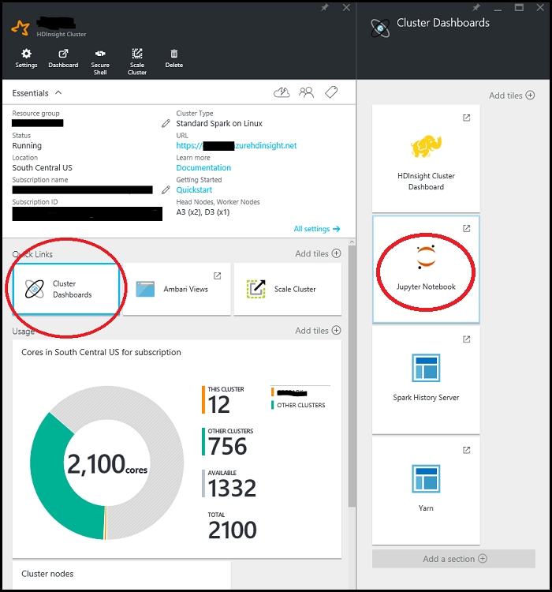

<properties
    pageTitle="Panoramica di scienze dati utilizzando motori su Azure HDInsight | Microsoft Azure"
    description="Il toolkit di motori MLlib porta apprendimento notevole modellazione funzionalità all'ambiente di HDInsight distribuito."
    services="machine-learning"
    documentationCenter=""
    authors="bradsev"
    manager="jhubbard"
    editor="cgronlun"  />

<tags
    ms.service="machine-learning"
    ms.workload="data-services"
    ms.tgt_pltfrm="na"
    ms.devlang="na"
    ms.topic="article"
    ms.date="10/07/2016"
    ms.author="deguhath;bradsev;gokuma" />

# Panoramica di scienze dati utilizzando motori su Azure HDInsight

[AZURE.INCLUDE [machine-learning-spark-modeling](../../includes/machine-learning-spark-modeling.md)]

In questo gruppo di argomenti viene illustrato come utilizzare HDInsight Spark per completare le attività di ricerca di scienze dati comuni, ad esempio acquisizione di dati, progettazione caratteristica, modellazione e valutazione del modello. Dati usati sono un esempio del 2013 Roma taxi viaggio e tariffa set di dati. Modelli creati includono regressione logistica e lineare, casuale insiemi di strutture e strutture invece un incremento sfumature. Gli argomenti visualizzati anche come archiviare i modelli in archiviazione blob Azure (WASB) e su come punteggio e valutare le prestazioni di Office. Argomenti più avanzati coprono come modelli possono essere qualificato con sweep convalida incrociata e hyper parametro. In questo argomento introduttivo anche viene descritto come configurare il cluster di motori che è necessario completare i passaggi descritti in tre procedure dettagliate fornite. 

[Motori](http://spark.apache.org/) è un parallelo Apri origine framework che supporta l'elaborazione in memoria per migliorare le prestazioni di grande dati analitiche applicazioni di elaborazione. Motore di elaborazione ad integrato per velocità, facilità di utilizzo e sofisticate analitica. Funzionalità di calcolo distribuito in memoria del motori renderlo un'ottima scelta per algoritmi iterativi nei calcoli di apprendimento e graph computer. [MLlib](http://spark.apache.org/mllib/) è una raccolta di risorse computer scalable di motori che offre funzionalità di modellazione per questo ambiente distribuito. 

[HDInsight i](../hdinsight/hdinsight-apache-spark-overview.md) è l'offerta ospitato Azure di ad Apri origine. Include anche il supporto per **i blocchi appunti Jupyter PySpark** cluster motori che è possibile eseguire i interattivi nelle query SQL trasformazione, filtro e la visualizzazione dati archiviati in BLOB Azure (WASB). PySpark è l'API di Python per motori. Frammenti di codice che forniscono le soluzioni e mostrano posti pertinenti per visualizzare i dati qui eseguire nei blocchi appunti Jupyter installati cluster motori. La procedura di modellazione in questi argomenti contenga codice che illustra come organizzare la formazione, valutare, salvare e utilizzare ogni tipo di modello. 

La procedura di installazione e codice fornito in questa procedura dettagliata riguarda HDInsight 3.4 motori 1.6. Tuttavia, il codice di seguito e i blocchi appunti generico e deve lavorare in un cluster di motori. Se non si usa HDInsight Spark, la procedura di installazione e gestione di cluster potrebbe essere leggermente diversa da quella illustrata di seguito.

## Prerequisiti

1. è necessario disporre di un abbonamento a Azure. Se non già presente, vedere [ottenere Azure versione di valutazione gratuita](https://azure.microsoft.com/documentation/videos/get-azure-free-trial-for-testing-hadoop-in-hdinsight/).

2. è necessario un cluster di HDInsight 3.4 motori 1.6 a completare questa procedura dettagliata. Per creare uno, vedere le istruzioni fornite [Guida introduttiva: creare i Apache su Azure HDInsight](../hdinsight/hdinsight-apache-spark-jupyter-spark-sql.md). Il tipo di grafico e la versione viene specificato dal menu di **Selezione tipo di grafico** . 

<!-- -->

> [AZURE.NOTE] Per un argomento che illustra come utilizzare Scala anziché Python per completare le attività per un processo di scienze-to-end dati, vedere [dati scienza con Scala con motori in Azure](machine-learning-data-science-process-scala-walkthrough.md).

<!-- -->

>[AZURE.INCLUDE [delete-cluster-warning](../../includes/hdinsight-delete-cluster-warning.md)]

## I dati di Roma 2013 Taxi

I dati di andata e ritorno Taxi Roma circa 20 GB di file compressi con valori separati da virgola (CSV) (~ 48 GB non compressi), che comprende trip singoli 173 milioni e le tariffe pagato per ogni viaggio. Ogni record di andata e ritorno include sollevare il deposito e ora, hacker resi anonimi (driver) numero di licenze e numero medallion (id univoco del taxi). I dati copre viaggi nell'anno 2013 e viene forniti il set di dati di due seguenti per ogni mese:

1. I file CSV 'trip_data' contengono informazioni dettagliate di viaggio, ad esempio il numero di persone, sollevare e dropoff punta, trip durata e durata del viaggio. Di seguito sono riportati alcuni record di esempio:

        medallion,hack_license,vendor_id,rate_code,store_and_fwd_flag,pickup_datetime,dropoff_datetime,passenger_count,trip_time_in_secs,trip_distance,pickup_longitude,pickup_latitude,dropoff_longitude,dropoff_latitude
        89D227B655E5C82AECF13C3F540D4CF4,BA96DE419E711691B9445D6A6307C170,CMT,1,N,2013-01-01 15:11:48,2013-01-01 15:18:10,4,382,1.00,-73.978165,40.757977,-73.989838,40.751171
        0BD7C8F5BA12B88E0B67BED28BEA73D8,9FD8F69F0804BDB5549F40E9DA1BE472,CMT,1,N,2013-01-06 00:18:35,2013-01-06 00:22:54,1,259,1.50,-74.006683,40.731781,-73.994499,40.75066
        0BD7C8F5BA12B88E0B67BED28BEA73D8,9FD8F69F0804BDB5549F40E9DA1BE472,CMT,1,N,2013-01-05 18:49:41,2013-01-05 18:54:23,1,282,1.10,-74.004707,40.73777,-74.009834,40.726002
        DFD2202EE08F7A8DC9A57B02ACB81FE2,51EE87E3205C985EF8431D850C786310,CMT,1,N,2013-01-07 23:54:15,2013-01-07 23:58:20,2,244,.70,-73.974602,40.759945,-73.984734,40.759388
        DFD2202EE08F7A8DC9A57B02ACB81FE2,51EE87E3205C985EF8431D850C786310,CMT,1,N,2013-01-07 23:25:03,2013-01-07 23:34:24,1,560,2.10,-73.97625,40.748528,-74.002586,40.747868

2. I file CSV 'trip_fare' contengano i dettagli della tariffa pagata per ogni viaggio, ad esempio tipo di pagamento, Importo tariffa, supplemento e le imposte, suggerimenti e pedaggio e l'importo totale pagato. Di seguito sono riportati alcuni record di esempio:

        medallion, hack_license, vendor_id, pickup_datetime, payment_type, fare_amount, surcharge, mta_tax, tip_amount, tolls_amount, total_amount
        89D227B655E5C82AECF13C3F540D4CF4,BA96DE419E711691B9445D6A6307C170,CMT,2013-01-01 15:11:48,CSH,6.5,0,0.5,0,0,7
        0BD7C8F5BA12B88E0B67BED28BEA73D8,9FD8F69F0804BDB5549F40E9DA1BE472,CMT,2013-01-06 00:18:35,CSH,6,0.5,0.5,0,0,7
        0BD7C8F5BA12B88E0B67BED28BEA73D8,9FD8F69F0804BDB5549F40E9DA1BE472,CMT,2013-01-05 18:49:41,CSH,5.5,1,0.5,0,0,7
        DFD2202EE08F7A8DC9A57B02ACB81FE2,51EE87E3205C985EF8431D850C786310,CMT,2013-01-07 23:54:15,CSH,5,0.5,0.5,0,0,6
        DFD2202EE08F7A8DC9A57B02ACB81FE2,51EE87E3205C985EF8431D850C786310,CMT,2013-01-07 23:25:03,CSH,9.5,0.5,0.5,0,0,10.5

Abbiamo acquisito un campione di 0,1% di questi file e aggiungono viaggio\_dati e viaggio\_presentare file CV in un singolo set di dati da utilizzare come il set di dati di input per questa procedura dettagliata. Chiave univoca per partecipare di andata e ritorno\_dati e andata e ritorno\_tariffa è composta dai campi: medallion le maggiori\_titolo e ritiro\_datetime. Ogni record del set di dati contiene gli attributi seguenti che rappresenta un viaggio Taxi Roma:

|Campo| Breve descrizione
|------|---------------------------------
| medallion |Medallion taxi resi anonimi (id univoco taxi)
| hack_license |    Numero di licenze a capo Hackney resi anonimi
| vendor_id |   Id fornitore taxi
| rate_code | Tasso di taxi Roma di tragitto
| store_and_fwd_flag | Archiviare e inoltrare contrassegno
| pickup_datetime | Selezionare la data e ora
| dropoff_datetime | Dropoff data e ora
| pickup_hour | Sollevare ora
| pickup_week | Selezionare la settimana dell'anno
| giorno della settimana | Giorno della settimana (intervallo 1-7)
| passenger_count | Numero di persone in un viaggio taxi
| trip_time_in_secs | Tempo di andata e ritorno in secondi
| trip_distance | Distanza di andata e ritorno nel miglia
| pickup_longitude | Sollevare longitudine
| pickup_latitude | Sollevare latitudine
| dropoff_longitude | Dropoff longitudine
| dropoff_latitude | Latitudine Dropoff
| direct_distance | Indirizzare distanza tra selezionare configurazione e le posizioni dropoff
| payment_type | Tipo di pagamento (CA, carta di credito e così via).
| fare_amount | Importo tariffa in
| supplemento | Supplemento
| mta_tax | Agente di trasferimento messaggi IVA
| tip_amount | Suggerimento importo
| tolls_amount | Importo pedaggio
| importo totale | Importo totale
| inclinato | Inclinato (1/0 per no o Sì)
| tip_class | Suggerimento classe (0: $0, 1: $0-5, 2: $6-10, 3: $11-20, 4: > $20)

## Eseguire il codice da un blocco appunti Jupyter cluster motori 

È possibile avviare il blocco appunti Jupyter dal portale di Azure. Individuare il cluster di motori nel dashboard e fare clic per inserire pagina di gestione per il cluster. Per aprire il blocco appunti associato al cluster motori, fare clic su **Dashboard Cluster** -> **Jupyter blocco appunti** .

È anche possibile passare a ***https://CLUSTERNAME.azurehdinsight.net/jupyter*** per accedere ai blocchi appunti Jupyter. Sostituire la parte nome cluster di questo URL con il nome del proprio cluster. È necessario la password per l'account di amministratore accedere ai blocchi appunti.

Selezionare PySpark per visualizzare una directory che contiene alcuni esempi di blocchi appunti sotto forma di pacchetto che utilizzano l'API PySpark. I blocchi appunti che contengono gli esempi di codice per il gruppo di argomento motori sono disponibili al [Github](https://github.com/Azure/Azure-MachineLearning-DataScience/tree/master/Misc/Spark/pySpark)

È possibile caricare i blocchi appunti direttamente da Github nel server di blocco appunti Jupyter il cluster motori. Nella home page del Jupyter, fare clic sul pulsante **Carica** nella parte destra dello schermo. Viene aperta una finestra di esplorazione file. Qui è possibile incollare l'URL Github (contenuto non elaborato) del blocco appunti e fare clic su **Apri**. I blocchi appunti PySpark sono disponibili all'URL seguenti:

1.  [pySpark-machine-learning-data-science-spark-data-exploration-modeling.ipynb](https://github.com/Azure/Azure-MachineLearning-DataScience/blob/master/Misc/Spark/pySpark/pySpark-machine-learning-data-science-spark-data-exploration-modeling.ipynb)
2.  [pySpark-machine-learning-data-science-spark-model-consumption.ipynb](https://github.com/Azure/Azure-MachineLearning-DataScience/blob/master/Misc/Spark/pySpark/pySpark-machine-learning-data-science-spark-model-consumption.ipynb)
3.  [pySpark-machine-learning-data-science-spark-advanced-data-exploration-modeling.ipynb](https://github.com/Azure/Azure-MachineLearning-DataScience/blob/master/Misc/Spark/pySpark/pySpark-machine-learning-data-science-spark-advanced-data-exploration-modeling.ipynb)

Viene visualizzato nuovamente il nome di file nel proprio elenco di file Jupyter con un pulsante **Carica** . Fare clic su questo pulsante **Carica** . A questo punto sono stati importati il blocco appunti. Ripetere questi passaggi per caricare altri blocchi appunti da questa procedura dettagliata.

> [AZURE.TIP] È possibile rapida i collegamenti nel browser e scegliere **Copia collegamento** a ottenere l'URL di contenuto non elaborato github. È possibile incollare l'URL nella finestra di dialogo Carica Jupyter Esplora file.

A questo punto è possibile:

- Visualizzare il codice, fare clic sul blocco appunti.
- Eseguire ogni cella premendo **MAIUSC + INVIO**.
- Eseguire l'intero blocco appunti facendo clic sulla **cella** -> **eseguire**.
- Utilizzare la visualizzazione automatica delle query.

> [AZURE.TIP] Kernel PySpark vengono visualizzati automaticamente l'output della query SQL (HiveQL). È possibile scegliere tra diversi tipi di visualizzazioni (tabella, grafici a torta, riga, Area o barra) utilizzando i pulsanti di menu **tipo** nel blocco appunti:

## Che cos'è successiva?

Ora che si sono configurati con un cluster HDInsight Spark e sono caricati i blocchi appunti Jupyter, si è pronti a utilizzare gli argomenti che corrispondono ai blocchi appunti di PySpark tre. Verranno visualizzati come esplorare i dati e quindi come creare e utilizzare modelli. Blocco appunti di analisi e modellazione dei dati avanzati viene illustrato come includere convalida incrociata, hyper parametro completa e del modello di valutazione. 

**Esplorazione dei dati e modellazione con motori:** Esplorare il set di dati e creare, punteggio, valutare l'apprendimento automatico modelli di lavoro tramite l'argomento [creare classificazione binaria e i modelli di regressione per i dati con il toolkit di motori MLlib](machine-learning-data-science-spark-data-exploration-modeling.md) .

**Consumo del modello:** Per informazioni su come punteggio i modelli di classificazione e regressione creati in questo argomento, vedere [punteggio e valutare i modelli di apprendimento computer integrato ad](machine-learning-data-science-spark-model-consumption.md).

**Convalida incrociata e hyperparameter completa**: vedere [Avanzate esplorazione dei dati e modellazione con motori](machine-learning-data-science-spark-advanced-data-exploration-modeling.md) su come modelli possono essere qualificato con sweep convalida incrociata e hyper parametro

