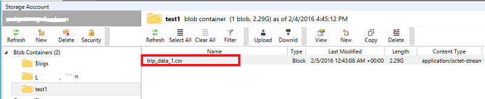
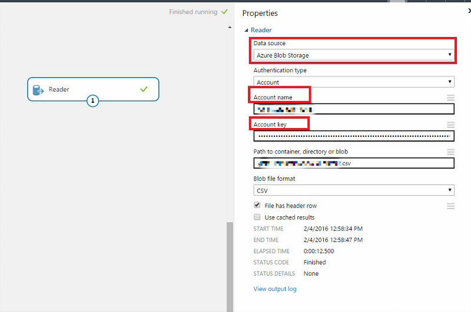
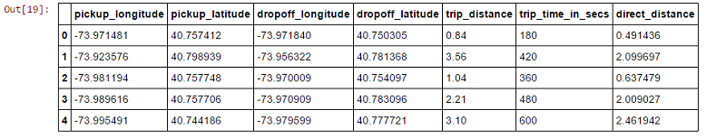
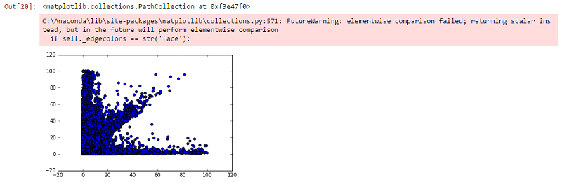

<properties
    pageTitle="Dieci operazioni da eseguire sulla ricerca di scienze dati macchina virtuale | Microsoft Azure"
    description="Eseguire varie attività di modellazione e l'esplorazione dei dati su scienza i dati macchina virtuale."
    services="machine-learning"
    documentationCenter=""
    authors="bradsev"
    manager="jhubbard"
    editor="cgronlun"  />

<tags
    ms.service="machine-learning"
    ms.workload="data-services"
    ms.tgt_pltfrm="na"
    ms.devlang="na"
    ms.topic="article"
    ms.date="08/29/2016"
    ms.author="gokuma;weig;bradsev" />

# <a name="ten-things-you-can-do-on-the-data-science-virtual-machine"></a>Dieci operazioni eseguibili nella ricerca di scienze dati macchina virtuale

Microsoft dati scienza macchina virtuale (DSVM) è un ambiente di sviluppo di scienze potente strumento che consente di eseguire varie operazioni di analisi e modellazione dei dati. L'ambiente fornito già generato e in dotazione con diversi strumenti analitica dati comuni che rendono più semplice per iniziare rapidamente con l'analisi per locale, distribuzioni Cloud o ibrida. Il DSVM collabora con molti servizi Azure ed è in grado di leggere ed elaborare dati che sono già archiviati in Azure Data Warehouse di SQL Azure, Lake di dati di Azure, lo spazio di archiviazione di Azure o in DocumentDB. Anche possibile sfruttare le altri strumenti analitica, ad esempio apprendimento Azure e Azure Data Factory.


In questo articolo viene illustrata come utilizzare il DSVM per eseguire varie attività di ricerca di scienze di dati e interagire con altri servizi di Azure. Ecco alcune delle operazioni che è possibile eseguire sul DSVM:

1. Esplorare i dati e sviluppare modelli localmente DSVM utilizzando Microsoft R Server Python
2. Utilizzare un blocco appunti Jupyter per acquisire familiarità con i dati in un browser utilizzando Python 2, 3 Python Microsoft R una versione enterprise pronti di R progettato per prestazioni e scalabilità
3. Rendono operativi i modelli creati utilizzando R e Python su Azure apprendimento in modo che le applicazioni client possono accedere i modelli con un'interfaccia servizi web semplice
4. Amministrare le risorse Azure tramite portal Azure o Powershell
5. Estendere lo spazio di archiviazione e condividere i set di dati su larga scala / codice in tutto il team mediante la creazione di un File di archiviazione di Azure come un'unità sul DSVM
6. Condividere codice con il team utilizzando Github e accedere a repository mediante il preinstallato fra client - fra Bash, grafica fra.
7. Accedere a varie Azure dati e analitica servizi lo spazio di archiviazione blob Azure, Lake di dati di Azure, Azure HDInsight (Hadoop), DocumentDB Azure, Warehouse di dati di SQL Azure e database
8. Creare report e dashboard usando Power BI Desktop preinstallato nel DSVM e distribuirle nel cloud
9. Ridimensiona dinamicamente il DSVM per soddisfare le esigenze del progetto
10. Installare strumenti aggiuntivi sul computer virtuale   


>[AZURE.NOTE] Costi di utilizzo aggiuntive verranno applicate per molti dei servizi di archiviazione e analitica di dati aggiuntivi elencati in questo articolo. Fare riferimento alla pagina di [Azure prezzi](https://azure.microsoft.com/pricing/) per informazioni dettagliate.


**Prerequisiti**

- È necessario un abbonamento a Azure. È possibile iscriversi per una gratuito valutazione [qui](https://azure.microsoft.com/free/).

- Istruzioni per il provisioning di una macchina virtuale scienza dati nel portale di Azure sono disponibili nella [creazione di una macchina virtuale](https://portal.azure.com/#create/microsoft-ads.standard-data-science-vmstandard-data-science-vm).

## <a name="1-explore-data-and-develop-models-using-microsoft-r-server-or-python"></a>1. esplorare i dati e sviluppare modelli utilizzando Microsoft R Server o Python

È possibile utilizzare lingue come R e Python eseguire analitica i dati direttamente nella DSVM.

Per R, è possibile utilizzare un IDE denominato "Rivoluzione R Enterprise 8.0" che sono disponibili nel menu start o il desktop. Microsoft ha fornito librerie aggiuntive nella parte superiore di origine/CRAN-R Apri abilitare analitica scalable e la possibilità di analizzare i dati più grandi della dimensione di memoria consentita eseguendo analisi in blocchi in parallelo. È anche possibile installare un IDE R preferito come [RStudio](https://www.rstudio.com/products/rstudio-desktop/).

Per Python, è possibile utilizzare un IDE come Visual Studio Community Edition con gli strumenti di Python per l'estensione di Visual Studio (PTVS) preinstallato. Per impostazione predefinita, una base 2.7 di Python è configurato nel PTVS (senza alcuna libreria analitica come SciKit, Pandas). Per abilitare Anaconda Python 2.7 e 3.5, è necessario eseguire le operazioni seguenti:

* Creare ambienti personalizzati per ogni versione posizionandosi **Strumenti** -> **Python strumenti** -> **Python ambienti** e quindi fare clic su "**+ personalizzato**" in Visual Studio 2015 Community Edition
* Fornire una descrizione e impostare i percorsi di prefisso ambiente come *c:\anaconda* per Anaconda Python 2.7 o *c:\anaconda\envs\py35* per Anaconda Python 3.5
* Fare clic su **Rilevamento automatico** e quindi su **Applica** per salvare l'ambiente.

Ecco è simile all'installazione dell'ambiente personalizzato in Visual Studio.


Vedere la [documentazione PTVS](https://github.com/Microsoft/PTVS/wiki/Selecting-and-Installing-Python-Interpreters#hey-i-already-have-an-interpreter-on-my-machine-but-ptvs-doesnt-seem-to-know-about-it) per informazioni dettagliate su come creare ambienti Python.

A questo punto siano configurati per creare un nuovo progetto Python. Passare al **File** -> **Nuovo** -> **progetto** -> **Python** e selezionare il tipo di applicazione Python si creano. È possibile impostare l'ambiente di Python per il progetto corrente per la versione desiderata (Anaconda 2.7 o 3.5): rapida **ambiente Python**, selezionare **Aggiungi/Rimuovi Python ambienti**e quindi selezionare l'ambiente desiderato da associare il progetto. È possibile trovare ulteriori informazioni sull'uso di PTVS nella pagina di [documentazione](https://github.com/Microsoft/PTVS/wiki) del prodotto.

## <a name="2-using-a-jupyter-notebook-to-explore-and-model-your-data-with-python-or-r"></a>2. utilizzando un blocco appunti Jupyter per esplorare e modellare i dati con Python o R

Il blocco appunti Jupyter è un ambiente potente che fornisce basate su browser "IDE" per una modellazione ed esplorazione dei dati. È possibile usare in un blocco appunti Jupyter Python 2, 3 Python o R (Apri origine e Microsoft R Server).

Per avviare fare clic su blocco appunti Jupyter sull'icona del menu start / icona sul desktop intitolato **Jupyter blocco appunti**. Nel DSVM è possibile anche passare a "https://localhost:9999 /" per accedere al blocco appunti Giove. Se richiesta una password, utilizzare le istruzioni fornite nella sezione ***sulla creazione di una password complessa a un server di blocco appunti Jupyter*** dell'argomento di [provisioning Microsoft dati scienza Virtual Machine](machine-learning-data-science-provision-vm.md) per creare una password complessa per accedere al blocco appunti Jupyter. 

Dopo aver aperto il blocco appunti, verrà visualizzata una directory che contiene alcuni blocchi appunti di esempio che sono già inseriti nel DSVM. A questo punto è possibile:

- Fare clic sul blocco appunti per visualizzare il codice.
- eseguire ogni cella premendo **MAIUSC + INVIO**.
- eseguire l'intero blocco appunti facendo clic sulla **cella** -> **eseguire**
- creare un nuovo blocco appunti facendo clic sull'icona della Jupyter (angolo superiore sinistro) e quindi facendo clic su **Nuovo** pulsante a destra e quindi scegliere la lingua di blocco appunti (noto anche come. x).   


>[AZURE.NOTE] Attualmente sono supportati Python 2.7, Python 3.5 e R. Kernel R supporta la programmazione in Apri origine R sia, nonché dell'azienda scalable Microsoft R Server.   


Una volta che ci si trova il blocco appunti è possibile esplorare i dati, creare il modello, verificare il modello con le raccolte.


## <a name="3-build-models-using-r-or-python-and-operationalize-them-using-azure-machine-learning"></a>3. creare modelli utilizzando R o Python e rendono operativi mediante apprendimento Azure

Dopo aver creato e convalidato il modello il passaggio successivo è in genere per distribuire nell'ambiente di produzione. In questo modo il client di applicazioni richiamare le stime di modello in un in tempo reale o in una base di modalità batch. Apprendimento Azure consente di rendono operativi un modello integrato in R o Python.

Quando si rendono operativi il modello di apprendimento Azure, un servizio web viene esposto che consente di effettuare chiamate resto passano parametri di input e ricevere le stime dal modello come output client.   


>[AZURE.NOTE] Se non è stato ancora effettuato l'iscrizione per AzureML, è possibile ottenere un'area di lavoro gratuita o un'area di lavoro standard, visitare la home page [AzureML Studio](https://studio.azureml.net/) e fare clic su "Introduzione".   


### <a name="build-and-operationalize-python-models"></a>Modelli di compilazione e Python rendono operativi

Ecco un frammento di codice sviluppato in un blocco appunti Jupyter Python che consente di creare un modello semplice mediante la raccolta di informazioni su SciKit.

    #IRIS classification
    from sklearn import datasets
    from sklearn import svm
    clf = svm.SVC()
    iris = datasets.load_iris()
    X, y = iris.data, iris.target
    clf.fit(X, y)

Il metodo utilizzato per la distribuzione di modelli di python per l'apprendimento Azure vada a capo la stima del modello in una funzione e aggiungono con gli attributi forniti dalla libreria di python apprendimento Azure preinstallata che indicano l'ID dell'area di lavoro di apprendimento Azure, API chiave e l'input e restituiscono i parametri.  

    from azureml import services
    @services.publish(workspaceid, auth_token)
    @services.types(sep_l = float, sep_w = float, pet_l=float, pet_w=float)
    @services.returns(int) #0, or 1, or 2
    def predictIris(sep_l, sep_w, pet_l, pet_w):
    inputArray = [sep_l, sep_w, pet_l, pet_w]
    return clf.predict(inputArray)

Un client è ora possibile effettuare chiamate al servizio web. Sono disponibili wrapper semplicità di utilizzo che costruire richieste API REST. Ecco un esempio di utilizzare il servizio web.

    # Consume through web service URL and keys
    from azureml import services
    @services.service(url, api_key)
    @services.types(sep_l = float, sep_w = float, pet_l=float, pet_w=float)
    @services.returns(float)
    def IrisPredictor(sep_l, sep_w, pet_l, pet_w):
    pass

    IrisPredictor(3,2,3,4)


>[AZURE.NOTE] La raccolta di apprendimento Azure disponibile solo in Python 2.7 attualmente.   


### <a name="build-and-operationalize-r-models"></a>Modelli di compilazione e rendono operativi R

È possibile distribuire modelli R creati in dati scienza Virtual Machine o in un' posizione su Azure apprendimento in modo simile a come verrà eseguita per Python. La sua eseguire la procedura seguente:

- creare un file settings.json come indicato di seguito per fornire l'ID di un'area di lavoro e auth token.
- scrivere una spaziale per il modello prevedere funzione.
- chiamare ```publishWebService``` nella raccolta di apprendimento Azure per passare spaziale funzione.  

Ecco il procedura e frammenti di codice che possono essere utilizzati per configurare, creare, pubblicare e utilizzare un modello come un servizio web in Azure apprendimento.

#### <a name="setup"></a>Programma di installazione

1.  Installare il pacchetto AzureML R digitando ```install.packages("AzureML")``` in rivoluzione R Enterprise 8.0 IDE o l'IDE R.
2.  Scaricare RTools da [qui](https://cran.r-project.org/bin/windows/Rtools/). È necessario l'utilità zip nel percorso (e denominato zip.exe) per il pacchetto R rendono operativi in AzureML.
3.  Creare un file settings.json in una directory denominata ```.azureml``` in home directory e immettere i parametri dall'area di lavoro Azure ML:

Settings.JSON struttura di File:

    {"workspace":{
    "id"                  : "ENTER YOUR AZUREML WORKSPACE ID",
    "authorization_token" : "ENTER YOUR AZUREML AUTH TOKEN"
    }}


#### <a name="build-a-model-in-r-and-publish-it-in-azure-ml"></a>Creazione di un modello in R e pubblicarla in ML Azure

    library(AzureML)
    ws <- workspace(config="~/.azureml/settings.json")

    if(!require("lme4")) install.packages("lme4")
    library(lme4)
    set.seed(1)
    train <- sleepstudy[sample(nrow(sleepstudy), 120),]
    m <- lm(Reaction ~ Days + Subject, data = train)

    # Define a prediction function to publish based on the model:
    sleepyPredict <- function(newdata){
        predict(m, newdata=newdata)
    }

    ep <- publishWebService(ws, fun = sleepyPredict, name="sleepy lm", inputSchema = sleepstudy, data.frame=TRUE)

#### <a name="consume-the-model-deployed-in-azure-ml"></a>Utilizzare il modello distribuito in ML Azure

Per utilizzare il modello da un'applicazione client, è utilizzare la libreria di apprendimento Azure per cercare il servizio web pubblicato nome utilizzando la `services` chiamata API per determinare l'endpoint. È sufficiente chiamare il `consume` funzione e passare nel riquadro dati da stimare.
Il codice seguente viene utilizzato per utilizzare il modello pubblicato come un servizio web apprendimento Azure.


    library(AzureML)
    library(lme4)
    ws <- workspace(config="~/.azureml/settings.json")

    s <-  services(ws, name = "sleepy lm")
    s <- tail(s, 1) # use the last published function, in case of duplicate function names

    ep <- endpoints(ws, s)

    # OK, try this out, and compare with raw data
    ans = consume(ep, sleepstudy)$ans

Sono disponibili ulteriori informazioni sulla raccolta Azure Machine Learning R [qui](https://cran.r-project.org/web/packages/AzureML/AzureML.pdf).


## <a name="4-administer-your-azure-resources-using-azure-portal-or-powershell"></a>4. amministrare le risorse Azure tramite portal Azure o Powershell

Il DSVM non solo consente di creare la soluzione analitica localmente sul computer virtuale, ma è anche possibile accedere ai servizi nel cloud di Microsoft Azure. Azure offre diversi calcolo, lo spazio di archiviazione, ODS analitica e altri servizi che è possibile gestire e accedere dal DSVM.

Per amministrare le risorse di abbonamento e cloud Azure è possibile usare il browser e scegliere il [portale di Azure](https://portal.azure.com). È possibile usare anche Azure Powershell per gestire l'abbonamento Azure e risorse tramite uno script.
È possibile eseguire Powershell Azure da un collegamento sul desktop o dal menu start intitolato "Microsoft Azure Powershell". Per ulteriori informazioni su come è possibile amministrare l'abbonamento Azure e risorse usando gli script di Windows Powershell, fare riferimento alla [documentazione di Microsoft Azure Powershell](../powershell-azure-resource-manager.md) .


## <a name="5-extend-your-storage-space-with-a-shared-file-system"></a>5. estendere lo spazio di archiviazione con un sistema di file condiviso

Scienziati dati condivisibile grandi set di dati, codice o altre risorse all'interno del team. DSVM stesso sono circa 70GB di spazio disponibile. Per estendere lo spazio di archiviazione, è possibile utilizzare il servizio di File di Azure e uno installare nel DSVM o di access tramite una API REST.   


>[AZURE.NOTE] Lo spazio della condivisione di Azure File servizio sarà 5TB e singoli limite è 1TB.   


È possibile utilizzare Azure Powershell per creare una condivisione di Azure File servizio. Ecco lo script per l'esecuzione in Azure PowerShell per creare una condivisione File Azure di servizio.

    # Authenticate to Azure.
    Login-AzureRmAccount
    # Select your subscription
    Get-AzureRmSubscription –SubscriptionName "<your subscription name>" | Select-AzureRmSubscription
    # Create a new resource group.
    New-AzureRmResourceGroup -Name <dsvmdatarg>
    # Create a new storage account. You can reuse existing storage account if you wish.
    New-AzureRmStorageAccount -Name <mydatadisk> -ResourceGroupName <dsvmdatarg> -Location "<Azure Data Center Name For eg. South Central US>" -Type "Standard_LRS"
    # Set your current working storage account
    Set-AzureRmCurrentStorageAccount –ResourceGroupName "<dsvmdatarg>" –StorageAccountName <mydatadisk>

    # Create a Azure File Service Share
    $s = New-AzureStorageShare <<teamsharename>>
    # Create a directory under the FIle share. You can give it any name
    New-AzureStorageDirectory -Share $s -Path <directory name>
    # List the share to confirm that everything worked
    Get-AzureStorageFile -Share $s


Dopo avere creato una condivisione file Azure, è possibile installare in qualsiasi computer virtuale Azure. Si consiglia di che la macchina virtuale si trovi in stesso Azure data center, come l'account di archiviazione per evitare i costi di trasferimento latenza e dati. Ecco i comandi necessari per collegare l'unità di DSVM che è possibile eseguire su Azure Powershell.


    # Get storage key of the storage account that has the Azure file share from Azure portal. Store it securely on the VM to avoid prompted in next command.
    cmdkey /add:<<mydatadisk>>.file.core.windows.net /user:<<mydatadisk>> /pass:<storage key>

    # Mount the Azure file share as Z: drive on the VM. You can chose another drive letter if you wish
    net use z:  \\<mydatadisk>.file.core.windows.net\<<teamsharename>>


A questo punto è possibile accedere all'unità come per qualsiasi unità normale nella macchina virtuale.

## <a name="6-share-code-with-your-team-using-github"></a>6. condividere codice con il team utilizzando Github

Github è un archivio di codice in cui è possibile trovare molte origini e il codice di esempio per diversi strumenti utilizzando diverse tecnologie condivise tramite la community di sviluppatori. Utilizza operazioni come la tecnologia per rilevare e archiviare le versioni dei file di codice. Github è una piattaforma in cui è possibile creare il proprio archivio per archiviare il codice condiviso e la documentazione del team, controllo delle versioni per implementare e controllarne che hanno accesso a visualizzare e fornire codice. Visitare le [pagine della Guida Github](https://help.github.com/) per ulteriori informazioni sull'uso di operazioni. È possibile utilizzare Github come uno dei modi per collaborare con il team, utilizzare il codice sviluppato dalla community e collaborare codice alla community.

Il DSVM dispone già caricato con gli strumenti client entrambi riga di comando e interfaccia grafica di accedere a Github repository di. Lo strumento di riga di comando per l'uso con fra e Github rappresenta la cosiddetta fra Bash. In Visual Studio installato il DSVM sono le estensioni fra. È possibile trovare le icone di avvio per tali strumenti nel menu di avvio e il desktop.

Per scaricare codice da un repository Github si userà il ```git clone``` comando. Ad esempio per il download di archivio di scienze dati pubblicato da Microsoft nella directory corrente è possibile eseguire il comando seguente dopo ```git-bash```.

    git clone https://github.com/Azure/Azure-MachineLearning-DataScience.git

In Visual Studio, è possibile eseguire la stessa operazione duplicato. Lo screenshot seguente viene illustrato come accedere agli strumenti fra e Github in Visual Studio.


Ulteriori informazioni sull'utilizzo di operazioni per lavorare con l'archivio Github da diverse risorse disponibili su github.com. [Schede di riferimento rapido](https://training.github.com/kit/downloads/github-git-cheat-sheet.pdf) è un riferimento utile.


## <a name="7-access-various-azure-data-and-analytics-services"></a>7. diversi servizi Azure, dati e analitica accedere a

### <a name="azure-blob"></a>Archivio Blob Azure

Archivio blob Azure è un archivio cloud affidabili economico per i dati grandi e piccoli. Analizzate come è possibile spostare i dati in Blob Azure e accedere a dati archiviati in un Blob Azure.

**Prerequisito**

- **Creare l'account di archiviazione Blob Azure dal [portale Azure](https://portal.azure.com).**


- Confermare che è possibile trovare lo strumento AzCopy preinstallato riga di comando in ```C:\Program Files (x86)\Microsoft SDKs\Azure\AzCopy\azcopy.exe```. È possibile aggiungere la directory contenente azcopy.exe per la variabile di ambiente PATH per evitare di digitare il percorso del comando completa durante l'esecuzione di questo strumento. Per ulteriori informazioni sullo strumento AzCopy fare riferimento alla [documentazione AzCopy](../storage/storage-use-azcopy.md)

- Avviare lo strumento Esplora archivi Azure. Può essere scaricato da [Microsoft Azure archiviazione Explorer](http://storageexplorer.com/). 


**Spostare i dati da macchine Virtuali Blob Azure: AzCopy**

Per spostare dati tra il file locali e archiviazione blob, è possibile utilizzare AzCopy nella riga di comando o PowerShell:

    AzCopy /Source:C:\myfolder /Dest:https://<mystorageaccount>.blob.core.windows.net/<mycontainer> /DestKey:<storage account key> /Pattern:abc.txt

Sostituire il percorso in cui è archiviato il file, **mystorageaccount** per il nome dell'account di archiviazione blob, **mycontainer** al nome del contenitore di **chiave account lo spazio di archiviazione** per il tasto di scelta di spazio di archiviazione blob **c:\MyFolder.** . È possibile trovare le credenziali dell'account di archiviazione nel [portale di Azure](https://portal.azure.com).


Comando AzCopy PowerShell o da un prompt dei comandi. Ecco alcuni esempi di utilizzo degli AzCopy comando:


    # Copy *.sql from local machine to a Azure Blob
    "C:\Program Files (x86)\Microsoft SDKs\Azure\AzCopy\azcopy" /Source:"c:\Aaqs\Data Science Scripts" /Dest:https://[ENTER STORAGE ACCOUNT].blob.core.windows.net/[ENTER CONTAINER] /DestKey:[ENTER STORAGE KEY] /S /Pattern:*.sql

    # Copy back all files from Azure Blob container to Local machine

    "C:\Program Files (x86)\Microsoft SDKs\Azure\AzCopy\azcopy" /Dest:"c:\Aaqs\Data Science Scripts\temp" /Source:https://[ENTER STORAGE ACCOUNT].blob.core.windows.net/[ENTER CONTAINER] /SourceKey:[ENTER STORAGE KEY] /S


Dopo aver eseguito il comando AzCopy per copiare in un archivio blob Azure viene visualizzato i file di viene visualizzato in Esplora archivi Azure subito.




**Spostare i dati da macchine Virtuali Blob Azure: Esplora archivi Azure**

È inoltre possibile caricare dati dal file locale nella macchina virtuale tramite Esplora archivi Azure:

- Per caricare dati in un contenitore, selezionare il contenitore di destinazione e fare clic sul pulsante **Carica** .
- Fare clic su **...** a destra della casella **file** , selezionare uno o più file da caricare dal file system e fare clic su **Carica** per iniziare a caricare i file.


**Leggere i dati Blob Azure: modulo lettore elenco parti fornitore**

Azure Machine Learning Studio è possibile utilizzare un **modulo di importare dati** di leggere il blob di dati.





**Leggere i dati Blob Azure: Python ODBC**

È possibile utilizzare una raccolta di **BlobService** per leggere i dati direttamente da blob in un blocco appunti Jupyter o Python un programma.

Prima di tutto, importare pacchetti necessari:

    import pandas as pd
    from pandas import Series, DataFrame
    import numpy as np
    import matplotlib.pyplot as plt
    from time import time
    import pyodbc
    import os
    from azure.storage.blob import BlobService
    import tables
    import time
    import zipfile
    import random

Quindi collegare le credenziali dell'account Blob Azure e leggere i dati Blob:

    CONTAINERNAME = 'xxx'
    STORAGEACCOUNTNAME = 'xxxx'
    STORAGEACCOUNTKEY = 'xxxxxxxxxxxxxxxx'
    BLOBNAME = 'nyctaxidataset/nyctaxitrip/trip_data_1.csv'
    localfilename = 'trip_data_1.csv'
    LOCALDIRECTORY = os.getcwd()
    LOCALFILE =  os.path.join(LOCALDIRECTORY, localfilename)

    #download from blob
    t1 = time.time()
    blob_service = BlobService(account_name=STORAGEACCOUNTNAME,account_key=STORAGEACCOUNTKEY)
    blob_service.get_blob_to_path(CONTAINERNAME,BLOBNAME,LOCALFILE)
    t2 = time.time()
    print(("It takes %s seconds to download "+BLOBNAME) % (t2 - t1))

    #unzipping downloaded files if needed
    #with zipfile.ZipFile(ZIPPEDLOCALFILE, "r") as z:
    #    z.extractall(LOCALDIRECTORY)

    df1 = pd.read_csv(LOCALFILE, header=0)
    df1.columns = ['medallion','hack_license','vendor_id','rate_code','store_and_fwd_flag','pickup_datetime','dropoff_datetime','passenger_count','trip_time_in_secs','trip_distance','pickup_longitude','pickup_latitude','dropoff_longitude','dropoff_latitude']
    print 'the size of the data is: %d rows and  %d columns' % df1.shape

I dati vengono letti come un intervallo di dati:


### <a name="azure-data-lake"></a>Lake di dati di Azure

Lo spazio di archiviazione di Azure dati Lake è un repository hyper scala compatibili con Hadoop Distributed File System (HDFS) e carichi di lavoro di grandi dimensioni dati analitica. Funziona con ecosistema Hadoop e il Analitica Lake dati di Azure. Questo webinar mostra come è possibile spostare i dati nell'archivio Lake dati Azure ed eseguire analitica utilizzando Azure dati Lake Analitica.

**Prerequisito**

- Creare il Analitica Lake dati di Azure nel [portale di Azure](https://portal.azure.com).


- Gli **Strumenti di Azure dati Lake** in **Visual Studio** , visitare il [collegamento](https://www.microsoft.com/download/details.aspx?id=49504) è già installato in Visual Studio Community Edition che si trova nella macchina virtuale. Dopo l'avvio di Visual Studio e registrazione in abbonamento Azure, verrà visualizzato l'account di Azure dati Analitica e lo spazio di archiviazione nel riquadro sinistro di Visual Studio.


**Spostare dati da macchine Virtuali a Lake dati: Esplora Lake dati di Azure**

È possibile usare **Esplora Lake dati di Azure** per caricare dati dai file locali del computer virtuale allo spazio di archiviazione dati Lake.


È anche possibile creare una pipeline di dati per productionize il movimento di dati nel o dal Lake di dati di Azure utilizzando [Factory(ADF) di dati di Azure](https://azure.microsoft.com/services/data-factory/). Si parla in questo [articolo](https://azure.microsoft.com/blog/creating-big-data-pipelines-using-azure-data-lake-and-azure-data-factory/) per seguire la procedura per creare la pipeline di dati.

**Leggere i dati da Blob Azure Lake dati: U SQL**

Se i dati si trovano in archiviazione Blob Azure, è possibile leggere dati direttamente da blob Azure dello spazio di archiviazione nella query SQL U. Prima la composizione di una query SQL U, assicurarsi che l'account di archiviazione blob collegato il Lake di dati di Azure. Accedere al **portale Azure**, trovare il dashboard di Azure dati Lake Analitica, fare clic su **Aggiungi origine dati**, selezionare il tipo di spazio di archiviazione per **Lo spazio di archiviazione di Azure** e collegare il nome dell'Account Azure lo spazio di archiviazione e la chiave. Quindi sarà possibile fare riferimento ai dati archiviati in account di archiviazione.


In Visual Studio, è possibile leggere i dati dallo spazio di archiviazione blob, eseguire alcune la modifica dei dati, portare in primo piano progettazione e l'output dei dati risultanti Lake di dati di Azure o archiviazione Blob Azure. Quando si fa riferimento i dati in archiviazione blob, utilizzare **wasb: / /**; Quando si fa riferimento i dati di Azure dati Lake, utilizzare **swbhdfs: / /**


In Visual Studio, è possibile utilizzare la query SQL U seguenti:

    @a =
        EXTRACT medallion string,
                hack_license string,
                vendor_id string,
                rate_code string,
                store_and_fwd_flag string,
                pickup_datetime string,
                dropoff_datetime string,
                passenger_count int,
                trip_time_in_secs double,
                trip_distance double,
                pickup_longitude string,
                pickup_latitude string,
                dropoff_longitude string,
                dropoff_latitude string

        FROM "wasb://<Container name>@<Azure Blob Storage Account Name>.blob.core.windows.net/<Input Data File Name>"
        USING Extractors.Csv();

    @b =
        SELECT vendor_id,
        COUNT(medallion) AS cnt_medallion,
        SUM(passenger_count) AS cnt_passenger,
        AVG(trip_distance) AS avg_trip_dist,
        MIN(trip_distance) AS min_trip_dist,
        MAX(trip_distance) AS max_trip_dist,
        AVG(trip_time_in_secs) AS avg_trip_time
        FROM @a
        GROUP BY vendor_id;

    OUTPUT @b   
    TO "swebhdfs://<Azure Data Lake Storage Account Name>.azuredatalakestore.net/<Folder Name>/<Output Data File Name>"
    USING Outputters.Csv();

    OUTPUT @b   
    TO "wasb://<Container name>@<Azure Blob Storage Account Name>.blob.core.windows.net/<Output Data File Name>"
    USING Outputters.Csv();


Dopo la query è stata inviata al server, verrà visualizzato un diagramma che mostra lo stato del processo di.


**Eseguire query sui dati in dati Lake: U SQL**

Dopo il set di dati vengono acquisiti in Lake di dati di Azure, è possibile utilizzare [il linguaggio SQL U](../data-lake-analytics/data-lake-analytics-u-sql-get-started.md) per eseguire query ed esplorare i dati. Linguaggio SQL U è simile a T-SQL, ma combina alcune funzionalità di c# in modo che gli utenti possono scrivere moduli personalizzati, funzioni definite dall'utente e così via. È possibile utilizzare gli script nel passaggio precedente.

Dopo la query viene inviata al server, tripdata_summary. È può visualizzare in anteprima i dati destro del mouse sul file CSV sono disponibili più avanti in **Azure Data Lake Explorer**.


Per visualizzare le informazioni sul file:


### <a name="hdinsight-hadoop-clusters"></a>HDInsight Hadoop cluster

Azure HDInsight è un servizio di Apache Hadoop, vivacità, HBase ed eccesso gestito nel cloud. È possibile lavorare facilmente con i cluster di Azure HDInsight dal computer virtuale di scienze di dati.

**Prerequisito**

- Creare l'account di archiviazione Blob Azure dal [portale Azure](https://portal.azure.com). Questo account di archiviazione viene utilizzato per archiviare i dati per i cluster HDInsight.


- Personalizzare Azure HDInsight Hadoop cluster dal [portale Azure](machine-learning-data-science-customize-hadoop-cluster.md)

  - È necessario collegare l'account di archiviazione creato con i cluster HDInsight quando viene creato. Questo account di archiviazione viene utilizzato per accedere ai dati che possono essere elaborati all'interno del cluster.


  - È necessario attivare **l'Accesso remoto** per il nodo principale del cluster dopo averlo creato. Memorizza le credenziali di accesso remoto è possibile specificare (diverse da quelle specificate per al momento della creazione cluster): saranno necessari riportata di seguito.


  - Creare un'area di lavoro di Azure ML. Esperimenti risorse computer verranno archiviati in un'area di lavoro ML. Selezionare le opzioni selezionate nel portale come illustrato nella figura riportata di seguito.


  - Immettere i parametri per l'area di lavoro di Azure ML


  - Caricare dati utilizzando IPython blocco appunti. Importare prima i pacchetti necessari, collegare le credenziali, creare una db nell'account di archiviazione, quindi caricare i dati in cluster HDI.


        #Import required Packages
        import pyodbc
        import time as time
        import json
        import os
        import urllib
        import urllib2
        import warnings
        import re
        import pandas as pd
        import matplotlib.pyplot as plt
        from azure.storage.blob import BlobService
        warnings.filterwarnings("ignore", category=UserWarning, module='urllib2')


        #Create the connection to Hive using ODBC
        SERVER_NAME='xxx.azurehdinsight.net'
        DATABASE_NAME='nyctaxidb'
        USERID='xxx'
        PASSWORD='xxxx'
        DB_DRIVER='Microsoft Hive ODBC Driver'
        driver = 'DRIVER={' + DB_DRIVER + '}'
        server = 'Host=' + SERVER_NAME + ';Port=443'
        database = 'Schema=' + DATABASE_NAME
        hiveserv = 'HiveServerType=2'
        auth = 'AuthMech=6'
        uid = 'UID=' + USERID
        pwd = 'PWD=' + PASSWORD
        CONNECTION_STRING = ';'.join([driver,server,database,hiveserv,auth,uid,pwd])
        connection = pyodbc.connect(CONNECTION_STRING, autocommit=True)
        cursor=connection.cursor()


        #Create Hive database and tables
        queryString = "create database if not exists nyctaxidb;"
        cursor.execute(queryString)

        queryString = """
                        create external table if not exists nyctaxidb.trip
                        (
                            medallion string,
                            hack_license string,
                            vendor_id string,
                            rate_code string,
                            store_and_fwd_flag string,
                            pickup_datetime string,
                            dropoff_datetime string,
                            passenger_count int,
                            trip_time_in_secs double,
                            trip_distance double,
                            pickup_longitude double,
                            pickup_latitude double,
                            dropoff_longitude double,
                            dropoff_latitude double)  
                        PARTITIONED BY (month int)
                        ROW FORMAT DELIMITED FIELDS TERMINATED BY ',' lines terminated by '\\n'
                        STORED AS TEXTFILE LOCATION 'wasb:///nyctaxidbdata/trip' TBLPROPERTIES('skip.header.line.count'='1');
                    """
        cursor.execute(queryString)

        queryString = """
                        create external table if not exists nyctaxidb.fare
                        (
                            medallion string,
                            hack_license string,
                            vendor_id string,
                            pickup_datetime string,
                            payment_type string,
                            fare_amount double,
                            surcharge double,
                            mta_tax double,
                            tip_amount double,
                            tolls_amount double,
                            total_amount double)
                        PARTITIONED BY (month int)
                        ROW FORMAT DELIMITED FIELDS TERMINATED BY ',' lines terminated by '\\n'
                        STORED AS TEXTFILE LOCATION 'wasb:///nyctaxidbdata/fare' TBLPROPERTIES('skip.header.line.count'='1');
                    """
        cursor.execute(queryString)


        #Upload data from blob storage to HDI cluster
        for i in range(1,13):
            queryString = "LOAD DATA INPATH 'wasb:///nyctaxitripraw2/trip_data_%d.csv' INTO TABLE nyctaxidb2.trip PARTITION (month=%d);"%(i,i)
            cursor.execute(queryString)
            queryString = "LOAD DATA INPATH 'wasb:///nyctaxifareraw2/trip_fare_%d.csv' INTO TABLE nyctaxidb2.fare PARTITION (month=%d);"%(i,i)  
            cursor.execute(queryString)


- In alternativa, è possibile eseguire questa [procedura dettagliata](machine-learning-data-science-process-hive-walkthrough.md) per caricare dati Roma Taxi cluster HDI. Passaggi principali includono:

    - AzCopy: scaricare compresso CSV da blob pubblica nella cartella locale
    - AzCopy: caricare decompresso CSV dalla cartella locale a cluster HDI
    - Accedere a nodo principale del cluster Hadoop e prepararsi per analisi dei dati esplorativo

Dopo il caricamento dei dati a cluster HDI, è possibile controllare i dati in Esplora archivi Azure. E si dispone di un nyctaxidb database creato in HDI cluster.


**Esplorazione dei dati: query Hive in Python**

Poiché i dati sono Hadoop cluster, è possibile utilizzare il pacchetto di pyodbc per connettersi al database cluster Hadoop e query utilizzando Hive esplorazione e funzionalità di progettazione. È possibile visualizzare le tabelle esistenti creato nel passaggio prerequisito.

    queryString = """
        show tables in nyctaxidb2;
        """
    pd.read_sql(queryString,connection)


Esaminiamo il numero di record in ogni mese e la frequenza di inclinato o non descritti nella tabella di andata e ritorno:

    queryString = """
        select month, count(*) from nyctaxidb.trip group by month;
        """
    results = pd.read_sql(queryString,connection)

    %matplotlib inline

    results.columns = ['month', 'trip_count']
    df = results.copy()
    df.index = df['month']
    df['trip_count'].plot(kind='bar')


    queryString = """
        SELECT tipped, COUNT(*) AS tip_freq
        FROM
        (
            SELECT if(tip_amount > 0, 1, 0) as tipped, tip_amount
            FROM nyctaxidb.fare
        )tc
        GROUP BY tipped;
        """
    results = pd.read_sql(queryString,connection)

    results.columns = ['tipped', 'trip_count']
    df = results.copy()
    df.index = df['tipped']
    df['trip_count'].plot(kind='bar')


È possibile anche calcolare la distanza tra prelievo percorso e il percorso dropoff e quindi confrontarla con la distanza di andata e ritorno.

    queryString = """
                    select pickup_longitude, pickup_latitude, dropoff_longitude, dropoff_latitude, trip_distance, trip_time_in_secs,
                        3959*2*2*atan((1-sqrt(1-pow(sin((dropoff_latitude-pickup_latitude)
                        *radians(180)/180/2),2)-cos(pickup_latitude*radians(180)/180)
                        *cos(dropoff_latitude*radians(180)/180)*pow(sin((dropoff_longitude-pickup_longitude)*radians(180)/180/2),2)))
                        /sqrt(pow(sin((dropoff_latitude-pickup_latitude)*radians(180)/180/2),2)
                        +cos(pickup_latitude*radians(180)/180)*cos(dropoff_latitude*radians(180)/180)*
                        pow(sin((dropoff_longitude-pickup_longitude)*radians(180)/180/2),2))) as direct_distance
                        from nyctaxidb.trip
                        where month=1
                            and pickup_longitude between -90 and -30
                            and pickup_latitude between 30 and 90
                            and dropoff_longitude between -90 and -30
                            and dropoff_latitude between 30 and 90;
                """
    results = pd.read_sql(queryString,connection)
    results.head(5)




    results.columns = ['pickup_longitude', 'pickup_latitude', 'dropoff_longitude',
                       'dropoff_latitude', 'trip_distance', 'trip_time_in_secs', 'direct_distance']
    df = results.loc[results['trip_distance']<=100] #remove outliers
    df = df.loc[df['direct_distance']<=100] #remove outliers
    plt.scatter(df['direct_distance'], df['trip_distance'])





A questo punto si preparare un set di dati (1%) campionati verso il basso per una modellazione. È possibile utilizzare questi dati nel modulo lettore elenco parti fornitore.


        queryString = """
        create  table if not exists nyctaxi_downsampled_dataset_testNEW (
        medallion string,
        hack_license string,
        vendor_id string,
        rate_code string,
        store_and_fwd_flag string,
        pickup_datetime string,
        dropoff_datetime string,
        pickup_hour string,
        pickup_week string,
        weekday string,
        passenger_count int,
        trip_time_in_secs double,
        trip_distance double,
        pickup_longitude double,
        pickup_latitude double,
        dropoff_longitude double,
        dropoff_latitude double,
        direct_distance double,
        payment_type string,
        fare_amount double,
        surcharge double,
        mta_tax double,
        tip_amount double,
        tolls_amount double,
        total_amount double,
        tipped string,
        tip_class string
        )
        row format delimited fields terminated by ','
        lines terminated by '\\n'
        stored as textfile;
        """
        cursor.execute(queryString)

        --- now insert contents of the join into the above internal table

        queryString = """
        insert overwrite table nyctaxi_downsampled_dataset_testNEW
        select
        t.medallion,
        t.hack_license,
        t.vendor_id,
        t.rate_code,
        t.store_and_fwd_flag,
        t.pickup_datetime,
        t.dropoff_datetime,
        hour(t.pickup_datetime) as pickup_hour,
        weekofyear(t.pickup_datetime) as pickup_week,
        from_unixtime(unix_timestamp(t.pickup_datetime, 'yyyy-MM-dd HH:mm:ss'),'u') as weekday,
        t.passenger_count,
        t.trip_time_in_secs,
        t.trip_distance,
        t.pickup_longitude,
        t.pickup_latitude,
        t.dropoff_longitude,
        t.dropoff_latitude,
        t.direct_distance,
        f.payment_type,
        f.fare_amount,
        f.surcharge,
        f.mta_tax,
        f.tip_amount,
        f.tolls_amount,
        f.total_amount,
        if(tip_amount>0,1,0) as tipped,
        if(tip_amount=0,0,
        if(tip_amount>0 and tip_amount<=5,1,
        if(tip_amount>5 and tip_amount<=10,2,
        if(tip_amount>10 and tip_amount<=20,3,4)))) as tip_class
        from
        (
        select
        medallion,
        hack_license,
        vendor_id,
        rate_code,
        store_and_fwd_flag,
        pickup_datetime,
        dropoff_datetime,
        passenger_count,
        trip_time_in_secs,
        trip_distance,
        pickup_longitude,
        pickup_latitude,
        dropoff_longitude,
        dropoff_latitude,
        3959*2*2*atan((1-sqrt(1-pow(sin((dropoff_latitude-pickup_latitude)
        radians(180)/180/2),2)-cos(pickup_latitude*radians(180)/180)
        *cos(dropoff_latitude*radians(180)/180)*pow(sin((dropoff_longitude-pickup_longitude)*radians(180)/180/2),2)))
        /sqrt(pow(sin((dropoff_latitude-pickup_latitude)*radians(180)/180/2),2)
        +cos(pickup_latitude*radians(180)/180)*cos(dropoff_latitude*radians(180)/180)*pow(sin((dropoff_longitude-pickup_longitude)*radians(180)/180/2),2))) as direct_distance,
        rand() as sample_key

        from trip
        where pickup_latitude between 30 and 90
            and pickup_longitude between -90 and -30
            and dropoff_latitude between 30 and 90
            and dropoff_longitude between -90 and -30
        )t
        join
        (
        select
        medallion,
        hack_license,
        vendor_id,
        pickup_datetime,
        payment_type,
        fare_amount,
        surcharge,
        mta_tax,
        tip_amount,
        tolls_amount,
        total_amount
        from fare
        )f
        on t.medallion=f.medallion and t.hack_license=f.hack_license and t.pickup_datetime=f.pickup_datetime
        where t.sample_key<=0.01
        """
        cursor.execute(queryString)

Dopo un certo periodo, è possibile visualizzare che i dati sono stati caricati Hadoop cluster:

    queryString = """
        select * from nyctaxi_downsampled_dataset limit 10;
        """
    cursor.execute(queryString)
    pd.read_sql(queryString,connection)


**Leggere i dati da HDI con elenco parti fornitore: modulo reader**

È anche può usare il modulo **reader** in studio elenco parti fornitore per accedere al database cluster Hadoop. Collegare le credenziali i cluster HDI e Account Azure lo spazio di archiviazione e sarà possibile creare modelli di apprendimento computer utilizzando database cluster HDI.


È quindi possibile visualizzare il punteggio set di dati:


### <a name="azure-sql-data-warehouse--databases"></a>Azure SQL Data Warehouse e database

Azure SQL Data Warehouse è un flessibile data warehouse come servizio esperienza utente di SQL Server aziendali.

È possibile eseguire il provisioning della Warehouse di dati di SQL Azure seguendo le istruzioni fornite in questo [articolo](../sql-data-warehouse/sql-data-warehouse-get-started-provision.md). Una volta che viene effettuato il provisioning della Warehouse di dati di SQL Azure, è possibile utilizzare questa [procedura dettagliata](machine-learning-data-science-process-sqldw-walkthrough.md) per eseguire upload dei dati, analisi e modellazione utilizzando i dati all'interno della Warehouse di dati SQL.

#### <a name="azure-documentdb"></a>DocumentDB Azure

Azure DocumentDB è un database NoSQL nel cloud. Consente di usare i documenti come JSON e consente di archiviare e i documenti della query.

È necessario eseguire i passaggi di oggetti per seguenti per accedere a DocumentDB dalla DSVM.

1. Installare DocumentDB Python SDK (eseguire ```pip install pydocumentdb``` dal prompt dei comandi)
1. Creare account DocumentDB e database DB documento dal [portale Azure](https://portal.azure.com)
1. Scaricare "Strumento di migrazione DocumentDB" da [qui](http://www.microsoft.com/downloads/details.aspx?FamilyID=cda7703a-2774-4c07-adcc-ad02ddc1a44d) ed estrarre in una directory di propria scelta
1. Importare dati JSON (dati volcano) memorizzati in un [blob pubblica](https://cahandson.blob.core.windows.net/samples/volcano.json) in DocumentDB con seguenti parametri di comando per lo strumento di migrazione (dtui.exe dalla directory in cui è installato lo strumento di migrazione DocumentDB). Immettere l'origine e destinazione parametri ubicazione dal basso.

    /s:JsonFile /s.Files:https://cahandson.blob.core.windows.net/samples/volcano.json /t:DocumentDBBulk /t.ConnectionString:AccountEndpoint=https://[DocDBAccountName].documents.azure.com:443/; AccountKey = [[chiave]; Database = volcano /t.Collection:volcano1

Dopo aver importato i dati, è possibile passare a Jupyter e aprire il blocco appunti denominato *DocumentDBSample* che contiene il codice python per accedere a DocumentDB ed eseguire alcune query base. Altre informazioni sulle DocumentDB visitando la [pagina della documentazione](https://azure.microsoft.com/documentation/learning-paths/documentdb/) di servizio


## <a name="8-build-reports-and-dashboard-using-the-power-bi-desktop"></a>8. creare report e dashboard usando Power BI Desktop

Visualizzare automatica file Volcano JSON che visto nell'esempio DocumentDB sopra in Power BI per ottenere informazioni approfondite visive nei dati. La procedura dettagliata è disponibile nell' [articolo di Power BI](../documentdb/documentdb-powerbi-visualize.md). La procedura di alto livello è seguito:

1. Aprire Power BI Desktop ed eseguire "Recupera dati". Specificare l'URL come: https://cahandson.blob.core.windows.net/samples/volcano.json
2. Verrà visualizzato il record JSON importati come un elenco
3. Convertire l'elenco in una tabella per ottenere informazioni possono usare con lo stesso
4. Espandere le colonne facendo clic sull'icona di espansione (quella con l'icona "freccia sinistra e una freccia a destra" nella parte destra della colonna)
5. Si noti che posizione è un campo "Record". Espandere il record e selezionare solo le coordinate. Coordinate è una colonna di elenco
6. Aggiungere una nuova colonna per convertire la colonna di coordinate di elenco in una colonna in LatLong separata virgola concatenare due elementi nel campo elenco coordinate utilizzando la formula ```Text.From([coordinates]{1})&","&Text.From([coordinates]{0})```.
7. Infine convertire la ```Elevation``` colonna decimali e selezionare **Applica**e **Chiudi** .

Anziché la procedura riportata sopra, è possibile incollare il codice seguente che gli script out la procedura descritta in precedenza in Editor avanzato di ottenere informazioni che consente di scrivere le trasformazioni dei dati in un linguaggio di query.


    let
        Source = Json.Document(Web.Contents("https://cahandson.blob.core.windows.net/samples/volcano.json")),
        #"Converted to Table" = Table.FromList(Source, Splitter.SplitByNothing(), null, null, ExtraValues.Error),
        #"Expanded Column1" = Table.ExpandRecordColumn(#"Converted to Table", "Column1", {"Volcano Name", "Country", "Region", "Location", "Elevation", "Type", "Status", "Last Known Eruption", "id"}, {"Volcano Name", "Country", "Region", "Location", "Elevation", "Type", "Status", "Last Known Eruption", "id"}),
        #"Expanded Location" = Table.ExpandRecordColumn(#"Expanded Column1", "Location", {"coordinates"}, {"coordinates"}),
        #"Added Custom" = Table.AddColumn(#"Expanded Location", "LatLong", each Text.From([coordinates]{1})&","&Text.From([coordinates]{0})),
        #"Changed Type" = Table.TransformColumnTypes(#"Added Custom",{{"Elevation", type number}})
    in
        #"Changed Type"


È ora disponibile i dati in un modello di dati di Power BI. Il desktop di Power BI dovrebbe essere visualizzata come illustrato di seguito.


È possibile avviare la creazione di report e visualizzazioni usando il modello di dati. È possibile eseguire i passaggi descritti in questo [articolo di Power BI](../documentdb/documentdb-powerbi-visualize.md#build-the-reports) per creare un report. Il risultato finale sarà un report che ha un aspetto simile al seguente.


## <a name="9-dynamically-scale-your-dsvm-to-meet-your-project-needs"></a>9. ridimensiona dinamicamente il DSVM per soddisfare le esigenze del progetto

È possibile ridimensionare su e giù DSVM per soddisfare le esigenze del progetto. Se non è necessario utilizzare la macchina virtuale nel sera o i fine settimana, è possibile semplicemente arrestare la macchina virtuale dal [portale di Azure](https://portal.azure.com).

>[AZURE.NOTE]  Se si utilizza solo il pulsante Arresta il sistema operativo nella macchina virtuale, comporta costi di elaborazione.  

Se è necessario gestire un'analisi su larga scala ed è necessario maggiore capacità di CPU e/o memoria e/o il disco è possibile trovare una scelta grande dimensioni macchine Virtuali in termini di CPU Core, capacità di memoria e tipi di disco (comprese le unità di stato a tinta unita) che soddisfano le esigenze bilancio e il calcolo. L'elenco completo delle macchine virtuali insieme loro oraria calcolare prezzi è disponibili nella pagina [Prezzi macchine virtuali di Azure](https://azure.microsoft.com/pricing/details/virtual-machines/) .

Allo stesso modo, se si riduce l'esigenza di capacità di elaborazione macchine Virtuali (ad esempio: si sposta un carico di lavoro principale in un Hadoop o a un cluster di motori), è possibile adattare verso il basso il cluster dal [portale di Azure](https://portal.azure.com) e passare a impostazioni dell'istanza macchine Virtuali. Ecco una schermata.


## <a name="10-install-additional-tools-on-your-virtual-machine"></a>10. installare strumenti aggiuntivi sul computer virtuale

È stato fornito diversi strumenti che si ritengono sarà in grado di risolvere molti dati comuni analitica deve e che devono di risparmiare tempo, evitando di dover installare e configurare gli ambienti uno alla volta e risparmiare pagando solo per le risorse utilizzate.

È possibile sfruttare altri servizi di dati e analitica Azure considerate in questo articolo per migliorare l'ambiente analitica. Siamo consapevoli che in alcuni casi alle proprie esigenze possono richiedere strumenti aggiuntivi, inclusi alcuni strumenti proprietari terze parti. Si ha accesso amministrativo completo del computer virtuale per installare nuovi strumenti, che è necessario. È inoltre possibile installare pacchetti aggiuntivi in Python e R che non è già installato. Per Python utilizzare ```conda``` o ```pip```. Per R è possibile utilizzare il ```install.packages()``` nelle caselle R console o utilizzare l'IDE e scegliere "**pacchetti** -> **Installare pacchetti**".

## <a name="summary"></a>Riepilogo
Queste sono solo alcune delle operazioni che è possibile eseguire in Microsoft dati scienza Virtual Machine. Sono disponibili molte più operazioni che è possibile eseguire in modo da un ambiente efficace analitica.
