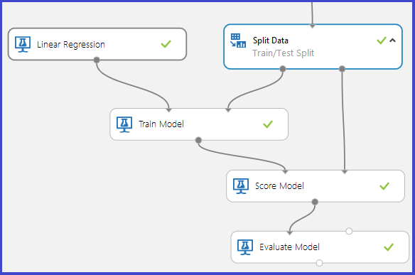

<properties 
    pageTitle="Eseguire il debug il modello di apprendimento Azure | Microsoft Azure" 
    description="Spiega come eseguire il debug il modello di apprendimento Azure." 
    services="machine-learning"
    documentationCenter="" 
    authors="garyericson" 
    manager="jhubbard" 
    editor="cgronlun"/>

<tags 
    ms.service="machine-learning" 
    ms.workload="data-services" 
    ms.tgt_pltfrm="na" 
    ms.devlang="na" 
    ms.topic="article" 
    ms.date="09/09/2016" 
    ms.author="bradsev;garye" />

# Eseguire il debug il modello di apprendimento Azure

Questo articolo viene spiegato come eseguire il debug i modelli di Microsoft Azure apprendimento. In particolare, coprire i possibili motivi perché uno dei due scenari di errore seguenti potrebbe verificarsi durante l'esecuzione di un modello:

* il [Modello treno] [ train-model] modulo genera un errore 
* il [Modello di punteggio] [ score-model] modulo produce risultati non corretti 

[AZURE.INCLUDE [machine-learning-free-trial](../../includes/machine-learning-free-trial.md)]

## Treno modello di modulo genera un errore

Il [Modello treno] [ train-model] modulo prevede 2 ingressi seguenti:

1. Il tipo di modello di classificazione/regressione dalla raccolta di modelli fornito da Azure Machine Learning
2. Dati di formazione con una colonna etichetta specificata. La colonna etichetta specifica la variabile prevedere. Il resto delle colonne incluse sono considerati uguali alla funzionalità.

In questo modulo genera un errore nei seguenti casi:

1. La colonna etichetta è specificata in modo non corretto perché più di una colonna è selezionata come etichetta o un indice di colonna non sia selezionato. Ad esempio, il secondo caso viene applicato se un indice di colonna pari a 30 viene usato con un set di dati di input che aveva solo 25 colonne.

2. Il set di dati non contiene tutte le colonne di funzionalità. Ad esempio, se il set di dati di input include solo 1 colonna, è contrassegnato come la colonna etichetta, non vi sarà Nessuna funzionalità con cui creare il modello. In questo caso, il [Modello treno] [ train-model] modulo verrà generato un errore.

3. Il set di dati input (caratteristiche o l'etichetta) contengono infinito come valore.

## Punteggio modello di modulo non produce risultati corretti

In un grafico o di una verifica formazione tipico per controllati formazione, i [Dati divisi] [ split] modulo divide il set di dati originale in due parti: part utilizzato per formare il modello e destinata a punteggio come modello di esperti prestazioni sui dati non è stato formare su. Il modello esperto quindi viene utilizzato per ottenere i dati di test trascorso il quale i risultati vengono valutati per determinare l'accuratezza del modello.

Il [Modello di punteggio] [ score-model] modulo richiede due input:

1. Un output esperti modello dal [Modello treno] [ train-model] modulo
2. Un set di dati punteggio non che il modello non è configurato in

Può accadere che anche se la prova ha avuto esito positivo, il [Modello di punteggio] [ score-model] modulo produce risultati non corretti. Diversi scenari possono causare a tale scopo:

1. Se l'etichetta specificata per categoria e un modello di regressione è stato eseguito sui dati, un output non corretto sarebbe prodotta dal [Modello di punteggio] [ score-model] modulo. In questo modo regressione richiede una variabile di risposta continua. In questo caso dovrebbe essere più adatta usare un modello di classificazione. 
2. Analogamente, se un modello di classificazione è stato eseguito su un set di dati con numeri decimali nella colonna etichetta, può determinare effetti indesiderati. In questo modo classificazione richiede una variabile distinta risposta che consente solo i valori dell'intervallo di un set finito e in genere leggermente piccole di classi.
3. Se il punteggio set di dati non contiene tutte le caratteristiche utilizzate per formare il modello, il [Modello di punteggio] [ score-model] verrà generato un errore.
4. Il [Modello di punteggio] [ score-model] non produce alcun output corrispondente a una riga nel punteggio set di dati che contiene un valore mancante o un valore infinito per una qualsiasi delle relative caratteristiche.
5. Il [Modello di punteggio] [ score-model] può generare risultati identici per tutte le righe del punteggio set di dati. Questo problema può verificarsi, ad esempio, in quando si tenta classificazione usando gli insiemi di strutture di decisione se il numero minimo di campioni per nodo foglia è scelto di essere più rispetto al numero di esempi di formazione disponibili.

<!-- Module References -->
[score-model]: https://msdn.microsoft.com/library/azure/401b4f92-e724-4d5a-be81-d5b0ff9bdb33/
[split]: https://msdn.microsoft.com/library/azure/70530644-c97a-4ab6-85f7-88bf30a8be5f/
[train-model]: https://msdn.microsoft.com/library/azure/5cc7053e-aa30-450d-96c0-dae4be720977/
 
