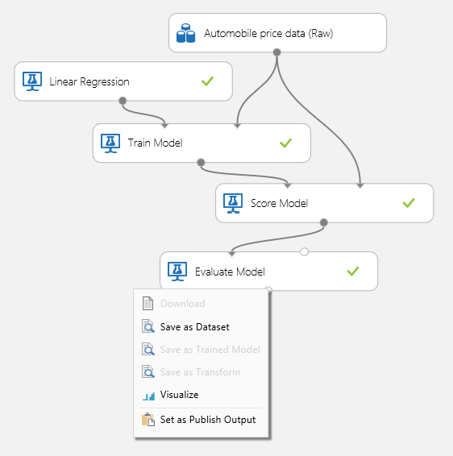
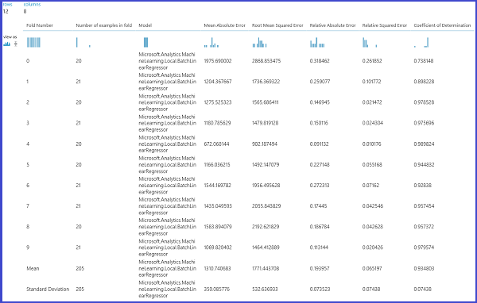
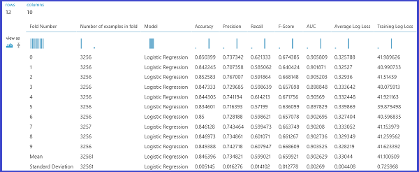
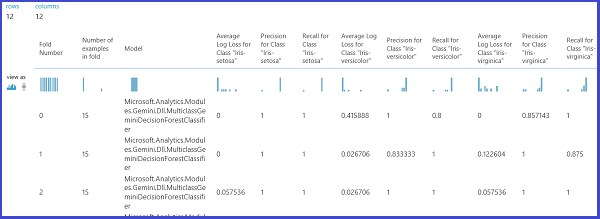

<properties 
    pageTitle="Valutare le prestazioni del modello di apprendimento | Microsoft Azure" 
    description="In questo articolo viene spiegato come valutare le prestazioni di modello in Azure apprendimento." 
    services="machine-learning"
    documentationCenter="" 
    authors="garyericson" 
    manager="jhubbard" 
    editor="cgronlun"/>

<tags 
    ms.service="machine-learning" 
    ms.workload="data-services" 
    ms.tgt_pltfrm="na" 
    ms.devlang="na" 
    ms.topic="article" 
    ms.date="08/19/2016" 
    ms.author="bradsev;garye" />

# Come valutare le prestazioni del modello di apprendimento Azure

In questo argomento viene illustrato come valutare le prestazioni di un modello di Azure Machine Learning Studio e fornisce una breve spiegazione metriche disponibili per l'attività. Tre scenari di apprendimento controllate sono presentati: 

* regressione
* classificazione binaria 
* classificazione multiclass

[AZURE.INCLUDE [machine-learning-free-trial](../../includes/machine-learning-free-trial.md)]

Valutazione delle prestazioni di un modello è una delle fasi principali del processo di scienze dei dati. Indica come completato il punteggio (stime) di un set di dati sono stata da un modello di esperto. 

Formazione Machine Azure supporta la valutazione di modello tra due computer di principale moduli di formazione: [Valutare modello] [ evaluate-model] e [Convalida Cross modello][cross-validate-model]. Questi moduli consentono di vedere come modello consente di eseguire in termini di un numero di indicatori di uso comune in statistiche e apprendimento.

##Valutazione e la convalida##
Valutazione e convalida cross standard modi migliorare le prestazioni del modello. Entrambe generano metriche di valutazione che è possibile esaminare o eseguire il confronto con quelle di altri modelli.

[Valutazione del modello] [ evaluate-model] prevede un punteggio set di dati come input (o 2 nel caso si desidera confrontare le prestazioni di 2 diversi modelli). Questo errore indica che è necessario impostare il modello utilizzando il [Modello formare] [ train-model] le stime modulo e da alcuni set di dati utilizzando il [Modello di punteggio] [ score-model] modulo, è possibile valutare i risultati. La valutazione è in base alle etichette/probabilità punteggio insieme etichette true, ognuno dei quali vengono restituiti dal [Modello di punteggio] [ score-model] modulo.

In alternativa, è possibile utilizzare la convalida cross eseguire alcune operazioni vengono valutati punteggio treno (10 biglietto) automaticamente in diversi sottoinsiemi dei dati di input. I dati di input viene divisa in 10 parti, uno in cui è riservato ai test, e altri 9 corsi di formazione. Questo processo viene ripetuto 10 volte e vengono calcolata la media le metriche di valutazione. In questo modo per stabilire come anche un modello da generalizzare al nuovo set di dati. [Convalida Cross modello] [ cross-validate-model] modulo accetta un modello inesperti e alcuni set di dati con etichette e i risultati di valutazione di ogni 10 all'interno, oltre ai risultati Media.

Nelle sezioni seguenti verranno creare modelli di regressione e classificazione semplici e valutare le prestazioni utilizzando sia il [Modello di valutare] [ evaluate-model] e il [Modello di convalidare tra] [ cross-validate-model] moduli.

##Valutazione di un modello di regressione##
Si supponga di che voler prevedere prezzo di auto alcune caratteristiche, ad esempio le dimensioni, potenza, specifiche motore e così via. Si tratta di un problema di regressione tipica, in cui la variabile di destinazione (*prezzo*) è un valore numerico continuo. È possibile adattare un modello di regressione lineare semplice che, in base ai valori di funzionalità di un determinato Auto può prevedere il prezzo di tale un'auto. Questo modello di regressione può essere utilizzato per punteggio lo stesso set di dati in che è qualificati. Una volta abbiamo i prezzi previsti per tutte le auto, è possibile valutare le prestazioni del modello esaminando quantità le stime diversi dai prezzi effettivi in Media. A questo scopo, serve il *set di dati (materie) dati prezzo Automobile* disponibile nella sezione **Set di dati salvato** in Azure Machine Learning Studio.
 
###Creazione di prova###
Aggiungere i seguenti moduli nell'area di lavoro in Azure Machine Learning Studio:

- Dati di prezzo veicoli (materie)
- [Regressione lineare][linear-regression]
- [Modello treno][train-model]
- [Modello di punteggio][score-model]
- [Valutazione del modello][evaluate-model]

Connettere le porte, come illustrato nella figura 1 e impostare la colonna etichetta del [Modello treno] [ train-model] modulo al *prezzo*.
 

Figura 1. Valutazione di un modello di regressione.

###Il controllo dei risultati della valutazione###
Dopo l'esecuzione di prova, è possibile fare clic su porta di output del [Modello di valutare] [ evaluate-model] modulo e selezionare *Visualizza* per visualizzare i risultati di valutazione. La valutazione disponibili per i modelli di regressione sono: *Allo Absolute Error*, *Radice allo Absolute Error*, *Errore relativo a assoluto*, *Errore relativo al quadrato*e il *Coefficiente di determinazione*.

Il termine "errore" in questo campo rappresenta la differenza tra il valore previsto e il valore vero. Il valore assoluto o la radice quadrata di questa differenza in genere vengono calcolate per acquisire la grandezza totale di errore in tutte le istanze, come la differenza tra il valore vero e prevista può essere negativa in alcuni casi. Metrica errore misura le prestazioni di previsione di un modello di regressione in termini di deviazione media delle previsioni dai valori true. Valori di errore più bassi indicano che il modello più accurato rendere le stime. Una metrica di errore complessiva pari a 0 indica che il modello si adatta perfettamente i dati.

Coefficiente di determinazione, è anche nota come R al quadrato, è anche un modo standard di misurazione come anche il modello adatto i dati. Possono essere interpretato come la percentuale di variazione spiegata dal modello. Un valore più alto proporzione è migliore in questo caso, dove 1 indica perfetti.
 

Figura 2. Metriche di valutazione di regressione lineare.

###Uso Cross convalida###
Come detto in precedenza, è possibile eseguire formazione ripetuta, punteggi e valutazioni automaticamente utilizzando la [Convalida tra modello] [ cross-validate-model] modulo. In questo caso è un set di dati, un modello inesperti e un [Modello di convalidare tra] [ cross-validate-model] modulo (vedere figura riportata di seguito). Nota che è necessario impostare la colonna etichetta al *prezzo* nel [Modello di convalidare tra] [ cross-validate-model] delle proprietà del modulo.

Figura 3. Cross-convalida di un modello di regressione.

Dopo l'esecuzione di prova, è possibile esaminare i risultati di valutazione facendo clic su porta output destra del [Modello di convalidare tra] [ cross-validate-model] modulo. Questo fornirà una descrizione dettagliata dei criteri di misurazione per ogni iterazione (piegatura) e i risultati Media di tutti i criteri di misurazione (figura 4).
 

Figura 4. Convalida tra i risultati di un modello di regressione.

##Valutazione di un modello di classificazione binario##
In uno scenario di classificazione binario, la variabile di destinazione contiene solo due possibili risultati, ad esempio: {0; 1} o {FALSO, vero}, {negativo, positivo}. Si supponga che è disponibile un set di dati dei dipendenti adulti con alcuni demografici le variabili di un dipendente e che viene chiesto di prevedere il livello di reddito, una variabile di tipo binario con i valori {"< = K 50", "> 50K"}. In altre parole, la classe negativa rappresenta i dipendenti che effettuano minore o uguale a 50K per anno e la classe positiva rappresenta tutti gli altri dipendenti. Come illustrato lo scenario di regressione è formare un modello, punteggio alcuni dati e valutare i risultati. La principale differenza è la scelta di metriche di che apprendimento Azure calcola e uscite. Per illustrare lo scenario di livello stima reddito, verrà utilizzato il set di dati [adulto](http://archive.ics.uci.edu/ml/datasets/Adult) per creare una prova di apprendimento Azure e valutare le prestazioni di un modello di regressione logistica due classe classificatore binario usato di frequente.

###Creazione di prova###
Aggiungere i seguenti moduli nell'area di lavoro in Azure Machine Learning Studio:

- Set di dati di adulto censimento reddito binario classificazione
- [Regressione logistica due classe][two-class-logistic-regression]
- [Modello treno][train-model]
- [Modello di punteggio][score-model]
- [Valutazione del modello][evaluate-model]

Connettere le porte, come illustrato nella figura 5 e impostare la colonna etichetta del [Modello treno] [ train-model] modulo al *reddito*.

Figura 5. Valutazione di un modello di classificazione binario.

###Il controllo dei risultati della valutazione###
Dopo l'esecuzione di prova, è possibile fare clic su porta di output del [Modello di valutare] [ evaluate-model] modulo e selezionare *Visualizza* per visualizzare i risultati di valutazione (figura 7). La valutazione disponibili per i modelli di classificazione binario sono: *accuratezza*, *precisione*, *richiamare*, *Punteggio F1*e *AUC*. Inoltre, il modulo restituisce una matrice di confusione che mostra il numero di positivi true, falsi negativi, falsi positivi e negativi true, nonché curve *ROC* *Precisione/richiamo*e *sollevare* .

Precisione è semplicemente la percentuale delle istanze classificate correttamente. È in genere l'unità di misura metriche prima che osservando durante la valutazione di un classificatore. Tuttavia, quando i dati di test sono non bilanciato (nel punto in cui la maggior parte delle istanze a cui appartiene una delle classi) o è più interessati prestazioni su una delle classi, precisione non viene effettivamente acquisire l'efficacia del classificatore. In caso classificazione livello reddito presuppongono che si stanno verificando alcuni dati nel punto in cui il 99% delle istanze rappresentare le persone che la acquisiscono minore o uguale a 50K all'anno. È possibile ottenere una maggiore precisione 0.99 prevedendo la classe "< = 50K" per tutte le istanze. L'utilità di classificazione in questo caso sembra essere facendo un buon lavoro globale, ma in realtà, non è possibile classificare degli individui ad alto redditi (1%) in modo corretto.

Per questo motivo, è utile calcolare statistiche aggiuntive di acquisire aspetti più specifici della valutazione. Prima di illustrare i dettagli di tali metriche, è importante conoscere la matrice confusione di valutazione classificazione binario. Le etichette di classe nel set di formazione possono assumere solo 2 valori possibili, in genere indicato come numero positivo o negativo. Le istanze di positive e negative classificatore prevede correttamente sono denominate rispettivamente positivi true (RS) e positivi/negativi true (TN). Analogamente, le istanze in modo non corretto classificate sono denominate falsi (virgola mobile) e falsi negativi (FN). La matrice confusione è semplicemente una tabella che mostra il numero di istanze che rientrano in ognuna di queste 4 categorie. Azure apprendimento decide automaticamente quale delle due classi il set di dati è la classe positiva. Se le etichette di classe sono Boolean o numeri interi, le istanze di etichette "true" o "1" si dispone della classe positiva. Se le etichette sono stringhe, come nel caso di set di dati entrate, le etichette vengono ordinate in ordine alfabetico e il primo livello è scelto di essere classe negativa, mentre il secondo livello della classe positiva.

Figura 6. Matrice di classificazione binario confusione.

Tornando al problema di classificazione entrate, sarebbe vogliamo chiedere queste informazioni a molte domande di valutazione per comprendere le prestazioni dell'utilità di classificazione utilizzato. È una domanda molto naturale: ' fuori la persone con cui il modello dovrebbe essere con un guadagno del > 50 K (RS + virgola mobile) quanti sono stati classificati correttamente (RS)? " Può rispondere a questa domanda esaminando la **precisione** del modello, ossia la percentuale di positivi classificati in modo corretto: TP/(TP+FP). Un'altra domanda comune è "fuori tutti ad alta con un guadagno dei dipendenti che festeggiano reddito > 50 k (RS + FN), il numero l'utilità di classificazione classificare correttamente (RS)". Si tratta in realtà il **richiamo**o il tasso di positivo true: TP/(TP+FN) dell'utilità di classificazione. È possibile che sia presente un più evidente compromesso tra precisione e richiamo. Ad esempio, dato un set di dati relativamente non bilanciate, classificatore che prevede soprattutto positive istanze, avrebbe un richiamo elevato, ma per classificato erroneamente una precisione piuttosto bassa il numero di istanze negative è da risultante in un numero elevato di falsi. Per visualizzare una traccia di come questi due metriche variano, è possibile fare clic su curva ' Precisione/RICHIAMO' nella pagina risultati valutazione (in alto a sinistra parte della figura 7).

 figura 7. Risultati di valutazione di classificazione binario.

Un altro metrica correlata che viene utilizzato in genere è il **Punteggio F1**, ovvero precisione e richiamo in considerazione. È la media armonica di queste 2 metriche e viene calcolato come tale: F1 = 2 (richiamo precisione x) / (precisione + richiamo). Il punteggio F1 è un'ottima soluzione per riepilogare la valutazione di un numero, ma è sempre consigliabile esaminare precisione e richiamo insieme per comprendere meglio il comportamento di un classificatore.

Inoltre, uno può controllare la velocità positiva true e la frequenza falsa positiva in curva **Ricevitore operativo caratteristica (ROC)** e il valore corrispondente **all'Area sotto la curva (AUC)** . È questa curva vicino nell'angolo in alto a sinistra, al meglio le prestazioni dell'utilità di classificazione sono (che al massimo la velocità positiva true riducendo il tasso positivo FALSO). Curve che si trovano vicino diagonale del tracciato, risultato di classificatori comandi sono particolarmente utili per rendere le stime che si trovano vicino previsione casuale.

###Uso Cross convalida###
Come illustrato nell'esempio di regressione, possiamo eseguire convalida cross per formare punteggio ripetutamente e valutare automaticamente subset di dati diversi. Analogamente, è possibile utilizzare la [Convalida tra modello] [ cross-validate-model] modulo, un modello di regressione logistica inesperti e un set di dati. La colonna etichetta deve essere impostata su *reddito* nel [Modello di convalidare tra] [ cross-validate-model] delle proprietà del modulo. Dopo l'esecuzione di prova e fare clic su porta di output destra del [Modello di convalidare tra] [ cross-validate-model] modulo, è possibile visualizzare i valori delle metriche classificazione binario per ogni piega inoltre per la media e deviazione standard di ciascuno. 
 

Figura 8. Cross-convalida di un modello di classificazione binario.

Figura 9. Convalida incrociata dei risultati di un classificatore binario.

##Valutazione di un modello di classificazione Multiclass##
In questo esercizio verrà utilizzato il popolari [iride](http://archive.ics.uci.edu/ml/datasets/Iris "iride") set di dati che contiene le istanze di 3 tipi diversi (classi) della pianta iride. Sono disponibili 4 caratteristica valori (sepal lunghezza/larghezza e lunghezza/larghezza petalo per ogni istanza). In esperimenti precedenti abbiamo qualificato e testati i modelli con la stessa set di dati. In questo caso, verrà usata i [Dati divisi] [ split] modulo per creare 2 sottoinsiemi dei dati, formare il primo e punteggio e valutare nella seconda. Il set di dati iride è disponibile pubblicamente su [UCI Machine Learning Repository](http://archive.ics.uci.edu/ml/index.html)e può essere scaricato usando un [Importa dati] [ import-data] modulo.

###Creazione di prova###
Aggiungere i seguenti moduli nell'area di lavoro in Azure Machine Learning Studio:

- [Importare dati][import-data]
- [Multiclass decisione foresta][multiclass-decision-forest]
- [Dividere i dati][split]
- [Modello treno][train-model]
- [Modello di punteggio][score-model]
- [Valutazione del modello][evaluate-model]

Connettere le porte, come illustrato nella figura 10.

Impostare l'indice di colonna etichetta del [Modello treno] [ train-model] modulo a 5. Il set di dati è disponibile nessuna riga di intestazione, ma è possibile sapere che le etichette di classe sono nella quinta colonna.

Fare clic su [Importa dati] [ import-data] modulo e impostare la proprietà *origine dati* su *URL Web tramite HTTP*e l' *URL* di http://archive.ics.uci.edu/ml/machine-learning-databases/iris/iris.data.

Impostare il numero di istanze da utilizzare per la formazione i [Dati divisi] [ split] modulo (0,7, ad esempio).
 

Figura 10. Valutare un classificatore Multiclass

###Il controllo dei risultati della valutazione###
Eseguire la prova e fare clic su porta di output del [Modello di valutare][evaluate-model]. Risultati della valutazione sono suddivise in forma di una matrice di confusione, in questo caso. La matrice Mostra i valori effettivi e istanze previste per tutte le 3 classi.
 

Figura 11. Classificazione multiclass i risultati di valutazione.

###Uso Cross convalida###
Come detto in precedenza, è possibile eseguire formazione ripetuta, punteggi e valutazioni automaticamente utilizzando la [Convalida tra modello] [ cross-validate-model] modulo. Sarà necessario un set di dati, un modello inesperti e un [Modello di convalidare tra] [ cross-validate-model] modulo (vedere figura riportata di seguito). Nuovo è necessario impostare la colonna etichetta del [Modello di convalidare tra] [ cross-validate-model] modulo (indice di colonna 5 in questo caso). Dopo l'esecuzione di prova e facendo clic su destra output porta del [Modello di convalidare tra][cross-validate-model], è possibile esaminare i valori delle metriche per ogni piega, nonché la deviazione standard e Media. La visualizzato di seguito sono simili a quelle descritte in maiuscole/minuscole classificazione binario. Tuttavia, si noti che in multiclass classificazione, computing la true positivi/negativi e positivi/negativi false viene eseguita contando alla scala cronologica per classe, sia disponibile alcuna classe complessivo positivo o negativo. Ad esempio, quando si calcola la precisione o richiamare della classe 'Iride setosa', si presuppone che si tratta della classe positiva e tutti gli altri come negativo.
 

Figura 12. Cross-convalida di un modello di classificazione Multiclass.

Figura 13. Convalida tra i risultati di un modello di classificazione Multiclass.

<!-- Module References -->
[cross-validate-model]: https://msdn.microsoft.com/library/azure/75fb875d-6b86-4d46-8bcc-74261ade5826/
[evaluate-model]: https://msdn.microsoft.com/library/azure/927d65ac-3b50-4694-9903-20f6c1672089/
[linear-regression]: https://msdn.microsoft.com/library/azure/31960a6f-789b-4cf7-88d6-2e1152c0bd1a/
[multiclass-decision-forest]: https://msdn.microsoft.com/library/azure/5e70108d-2e44-45d9-86e8-94f37c68fe86/
[import-data]: https://msdn.microsoft.com/library/azure/4e1b0fe6-aded-4b3f-a36f-39b8862b9004/
[score-model]: https://msdn.microsoft.com/library/azure/401b4f92-e724-4d5a-be81-d5b0ff9bdb33/
[split]: https://msdn.microsoft.com/library/azure/70530644-c97a-4ab6-85f7-88bf30a8be5f/
[train-model]: https://msdn.microsoft.com/library/azure/5cc7053e-aa30-450d-96c0-dae4be720977/
[two-class-logistic-regression]: https://msdn.microsoft.com/library/azure/b0fd7660-eeed-43c5-9487-20d9cc79ed5d/
 
