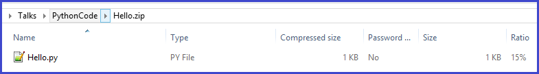
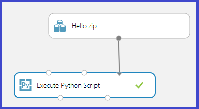
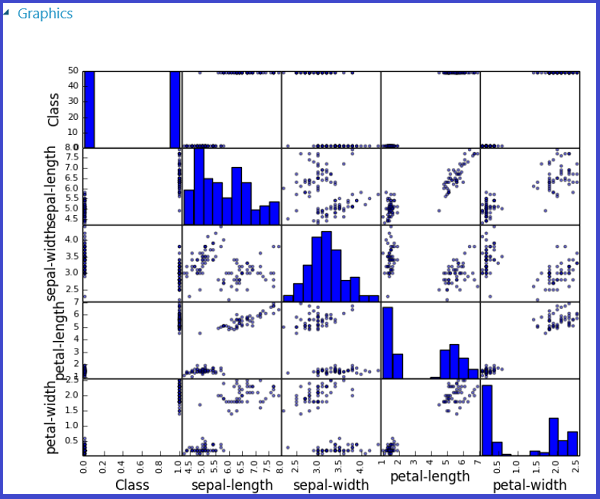

<properties 
    pageTitle="Eseguire gli script di risorse computer Python | Microsoft Azure" 
    description="Le strutture principi sottostante il supporto per script Python Azure apprendimento e gli scenari di utilizzo di base, funzionalità e limitazioni di progettazione." 
    keywords="Python apprendimento automatico, pandas, pandas python, script python, eseguire gli script python"
    services="machine-learning"
    documentationCenter="" 
    authors="bradsev" 
    manager="jhubbard" 
    editor="cgronlun"/>

<tags 
    ms.service="machine-learning" 
    ms.workload="data-services" 
    ms.tgt_pltfrm="na" 
    ms.devlang="na" 
    ms.topic="article" 
    ms.date="09/12/2016" 
    ms.author="bradsev" />

# Eseguire gli script di risorse di Python computer Azure Machine formazione Studio

Questo argomento illustra i principi di progettazione corrente supporto per script Python in Azure apprendimento. Le funzionalità principali sono inoltre strutturate, incluso il supporto per l'importazione di codice esistente, l'esportazione di visualizzazioni e infine alcune limitazioni e il lavoro in corso verranno illustrati.

[Python](https://www.python.org/) è uno strumento indispensabile il corpo fissato dello strumento di molti scienziati di dati. Sono disponibili:

-  una sintassi elegante e concisa 
-  supporto multipiattaforma 
-  un maggior insieme potenti raccolte, e 
-  strumenti di sviluppo avanzato. 

Python viene utilizzata in tutte le fasi del flusso di lavoro in genere utilizzati in modellazione risorse computer, dai dati del caricamento e l'elaborazione, per costruzione caratteristica e formazione di modello, quindi convalida e distribuzione dei modelli. 

Azure computer formazione Studio supporta l'incorporamento script Python in varie parti di un computer di prova di apprendimento e anche diretta pubblicarli come servizi web scalable, operationalized in Microsoft Azure.

[AZURE.INCLUDE [machine-learning-free-trial](../../includes/machine-learning-free-trial.md)]

## Principi di progettazione di script Python più computer
L'interfaccia primaria Python Azure Machine Learning Studio consiste nell'utilizzare [Esecuzione Script Python] [ execute-python-script] modulo illustrato nella figura 1.

Figura 1. Modulo **Eseguire Script Python** .

[Eseguire Script Python] [ execute-python-script] modulo accetta input fino a tre e produce output fino a due (illustrato di seguito), come la funzione analoga R, [Eseguire Script R] [ execute-r-script] modulo. Il codice Python da eseguire è immesso nella casella parametro come speciale denominata punto di ingresso funzione `azureml_main`. Ecco i principi chiave della progettazione utilizzati per implementare questo modulo:

1.  *Deve essere idiomatiche per gli utenti di Python.* Maggior parte degli utenti Python suddividere il proprio codice come funzioni all'interno dei moduli, in modo molte istruzioni eseguibili in un modulo di primo livello è relativamente rari. Di conseguenza, la casella di script consente di accedere anche una funzione Python appositamente denominata anziché una sequenza di istruzioni. Gli oggetti esposti nella funzione sono tipi di raccolta Python standard, ad esempio [Pandas](http://pandas.pydata.org/) dei frame e le matrici [NumPy](http://www.numpy.org/) .
2.  *Deve avere ad alta fedeltà tra locali e cloud le esecuzioni.* Back-end utilizzato per eseguire il codice Python si basa su [Anaconda](https://store.continuum.io/cshop/anaconda/) 2.1, una distribuzione in Python scientifica multipiattaforma ampiamente utilizzata. È dotato vicino 200 dei pacchetti Python più comuni. Pertanto, scienziati dati possono eseguire il debug e idonei il proprio codice sull'ambiente Anaconda compatibile con Learning Azure computer locale. Utilizzare gli ambienti di sviluppo esistenti, ad esempio blocco appunti [IPython](http://ipython.org/) o [Python Tools per Visual Studio](http://aka.ms/ptvs) per eseguire come parte di una prova di apprendimento Azure con confidenza elevata. Inoltre, le `azureml_main` punto di ingresso è una funzione Python vaniglia e può essere creato senza codice specifico di apprendimento Azure o SDK installato.
3.  *Deve essere diretta componibile con altri moduli di apprendimento Azure.* [Eseguire Script Python] [ execute-python-script] modulo accetta come input e output, set di dati di Azure apprendimento standard. Il framework sottostante trasparente ed efficiente bridge tra i runtime apprendimento Azure e Python (che supporta caratteristiche quali valori mancanti). Python pertanto utilizzabile in combinazione con Azure apprendimento flussi di lavoro, inclusi quelli chiamare R e SQLite. Uno pertanto possibile visualizzare i flussi di lavoro che:
  * Utilizzare Python e Pandas per i dati pre-elaborazione e la pulizia, 
  * inserire i dati a una trasformazione SQL partecipare più set di dati alle caratteristiche di modulo 
  * formare modelli utilizzando l'insieme completo di algoritmi in apprendimento Azure, e 
  * valutare e post-elaborare i risultati mediante R.

## Scenari di utilizzo di base di apprendimento per gli script Python
In questa sezione sono alcuni degli impieghi base dello [Script Python eseguire] sondaggi[ execute-python-script] modulo.
Come detto in precedenza, qualsiasi input al modulo Python vengono esposti come frame di dati Pandas. Sono disponibili ulteriori informazioni sulle Pandas Python e come può essere utilizzato per modificare i dati in modo efficace ed efficiente in *Python per analisi dei dati* (o ' Reilly, 2012) da McKinney occidentale. La funzione deve restituire un singolo frame di dati Pandas fornito all'interno di una [sequenza](https://docs.python.org/2/c-api/sequence.html) di Python, ad esempio una tupla, un elenco o una matrice NumPy. Il primo elemento di questa sequenza viene quindi restituito nella porta di output prima del modulo. Questa combinazione è illustrata nella figura 2.

Figura 2. Mapping delle porte ai parametri di input e valore restituito alla porta di output.

Ulteriori semantica di mapping come le porte inpue ai parametri del `azureml_main` funzione vengono visualizzati nella tabella 1:

Tabella 1. Mapping delle porte input ai parametri di funzione.

Il mapping tra inpue porte e protocolli di parametri di funzione è posizione. La prima porta di input connessa sia assegnata al primo parametro della funzione e il secondo input (se connessi) siano associati al secondo parametro della funzione.

## Conversione di tipi di input e di output
Come illustrato in precedenza, input set di dati di Azure apprendimento vengono convertiti in dati cornici in Pandas e output dei frame vengono convertiti al set di dati di Azure apprendimento. Vengono eseguite le conversioni seguenti:

1.  Le colonne stringa e numerici vengono convertite come-è e valori mancanti in un set di dati vengono convertiti in valori 'ND' in Pandas. La stessa conversione accade lungo il tragitto indietro (ND in Pandas vengono convertiti in valori mancanti in apprendimento Azure).
2.  Indice vettori in Pandas non sono supportati in Azure apprendimento. Tutti i fotogrammi di dati di input nella funzione Python hanno sempre un indice numerico 64 bit compreso tra 0 e il numero di righe meno 1. 
3.  Set di dati di Azure apprendimento non può contenere nomi di colonna duplicati e nomi di colonna che non sono stringhe. Se una cornice di dati di output contiene colonne non numerico, il framework chiama `str` ai nomi di colonna. Analogamente, i nomi di colonna duplicati vengono modificati automaticamente per assicurarsi che i nomi siano univoci. Il primo duplicato (3) per la seconda e così via duplicato, viene aggiunto il suffisso (2).

## Raymond script Python
Qualsiasi [Eseguire Script Python] [ execute-python-script] moduli utilizzati in un punteggio prova vengono chiamati quando pubblicato come un servizio web. Figura 3, ad esempio, viene visualizzato un punteggio prova contenente il codice per valutare una singola espressione Python. 

Figura 3. Servizio Web per la valutazione di un'espressione di Python.

Un servizio web creato da questo prova accetta come input di un'espressione di Python (come stringa), invia a interprete Python e restituisce una tabella contenente il valore di expression e il risultato ottenuto.

## Importazione di moduli di script Python esistenti
Un caso di utilizzo comune per molti scienziati dati consiste nell'incorporare apprendimento Azure esperimenti script Python esistenti. Invece di concatenazione e Incolla tutto il codice in una casella singolo script, [Eseguire Script Python] [ execute-python-script] modulo accetta una terza porta di input a cui può essere connesso un file zip contenente i moduli di Python. Il file viene quindi decompressi da framework esecuzione in fase di esecuzione e il contenuto viene aggiunto al percorso della libreria di interprete Python. Il `azureml_main` punto di ingresso funzione importare questi moduli direttamente.

Ad esempio, considerare il file Hello.py che contiene una funzione semplice "Hello, World".

Figura 4. Funzione definita dall'utente.

Creare successivamente un file Hello.zip contenente Hello.py:

Figura 5. File zip contenente codice Python definite dall'utente.

Caricare, questo come un set di dati in Azure Machine Learning Studio. Creare ed eseguire una prova semplice che utilizza il codice Python nel file Hello.zip tramite il collegamento alla porta di input terza dello Script Python eseguire, come illustrato nella figura seguente.

Figura 6. Esempio sperimentare definite dall'utente codice Python caricati in un file zip.

Il modulo in output mostra che il file zip è stato decompresso e la funzione `print_hello` effettivamente è stato eseguito.
 

 
Figura 7. Funzione definita dall'utente in uso all'interno di [Eseguire Script Python] [ execute-python-script] modulo.

## Utilizzo di visualizzazioni
Grafici creati con MatplotLib che può essere visualizzato nel browser possono essere restituiti da [Eseguire Script Python][execute-python-script]. Ma i grafici non vengono automaticamente reindirizzati alle immagini così come sono quando si usa R. Pertanto l'utente deve salvare esplicitamente qualsiasi posti in file PNG qualora siano restituite al apprendimento Azure. 

Per generare le immagini da MatplotLib, è necessario gareggiare la procedura seguente:

* passare il back-end "AGGR" dal programma di base Qt rendering predefinito 
* creare un nuovo oggetto figura 
* ottenere l'asse e generare posti tutti al suo interno 
* salvare la figura in un file PNG 

Questo processo viene illustrato nella seguente figura 8 che crea una matrice di tracciato a dispersione utilizzando la funzione scatter_matrix in Pandas.
 

Figura 8. Salvataggio figure MatplotLib alle immagini.

La figura 9 mostra una prova che utilizza lo script illustrato in precedenza per restituire traccia tramite la seconda porta di output.

 
     
 

Figura 9. Visualizzazione posti generate da codice Python.

È possibile restituire più figure salvandole in immagini diverse, il runtime apprendimento Azure raccoglie tutte le immagini e li concatena per la visualizzazione.

## Esempi avanzati
Ambiente Anaconda installato in Azure Machine formazione contiene pacchetti comuni, ad esempio NumPy, SciPy e informazioni su Scikits e questi possono essere usati in modo efficace per varie attività di elaborazione dei dati in una pipeline di apprendimento tipico computer. Se ad esempio prove seguenti ed Esegui script illustrato l'utilizzo dei professionisti insieme in informazioni Scikits per calcolare punteggi priorità caratteristica per un set di dati. I punteggi possono quindi essere utilizzati per eseguire selezione delle caratteristiche controllate prima di alimentazione in un altro modello di risorse computer.

La funzione di Python per calcolare i punteggi priorità e l'ordine le caratteristiche di base in cui è indicata di seguito:

Figura 10. Funzione alle caratteristiche di classificazione da punteggi.
 Prova seguente calcola e quindi restituisce i punteggi importanza delle caratteristiche del set di dati "Pima indiano diabete" in apprendimento Azure:

    
    
Figura 11. Sperimentare rango caratteristiche di set di dati Pima indiano diabete.

## Limitazioni 
[Eseguire Script Python] [ execute-python-script] attualmente comporta le limitazioni seguenti:

1.  *Esecuzione in modalità sandbox.* Il runtime Python è attualmente in modalità sandbox e di conseguenza, non consente l'accesso alla rete o il file System locale in modo permanente. Tutti i file salvati in locale sono isolati ed eliminati al termine del modulo. Il codice Python non è possibile accedere alle directory la maggior parte dei computer che viene eseguito in, l'eccezione della directory corrente e le relative sottodirectory.
2.  *Mancanza di sviluppo sofisticate e supporto per il debug.* Il modulo Python attualmente non supporta la funzionalità IDE, ad esempio intellisense e il debug. Inoltre, se il modulo non riesce in fase di esecuzione, l'analisi dello stack Python completo è disponibile, ma devono essere visualizzato nel Registro di output per il modulo. È consigliabile attualmente sviluppare ed eseguire il debug gli script Python in un ambiente, ad esempio IPython e importare il codice del modulo.
3.  *Aggiungere o sottrarre frame output.* Il punto di ingresso Python è consentito solo per restituire un intervallo di dati single come output. Non è attualmente possibile restituire oggetti Python non autorizzati ad esempio esperti modelli direttamente al runtime apprendimento Azure. Come [Eseguire Script R][execute-r-script], che ha lo stesso limite, è tuttavia possibile in molti casi pickle oggetti in una matrice di byte e quindi INVIO tale interno di un intervallo di dati.
4.  *Impossibilità di personalizzare l'installazione di Python*. Al momento l'unico modo per aggiungere moduli personalizzati Python consiste nell'utilizzare il meccanismo di file zip descritto in precedenza. Ciò è possibile per i moduli di piccole dimensioni, ma è oneroso per i moduli di grandi dimensioni (in particolare quelli con DLL native) o un numero elevato di moduli. 

##Conclusioni
[Eseguire Script Python] [ execute-python-script] modulo consente una scienziato dati per incorporare codice Python esistente ospitato cloud machine learning flussi di lavoro Azure Machine formazione e diretta rendono operativi i loro come parte di un servizio web. Il modulo di script Python naturalmente interagisce con altri moduli apprendimento Azure e può essere utilizzato per un intervallo di attività da esplorazione dei dati per pre-elaborazione per l'estrazione, caratteristica di valutazione e post-elaborazione dei risultati. Il runtime back-end utilizzato per l'esecuzione si basa su Anaconda, una distribuzione di Python verificata e ampiamente utilizzata. Questo semplifica automaticamente il bordo risorse codice esistente nel cloud.

È previsto fornire funzionalità aggiuntive per [Eseguire Script Python] [ execute-python-script] modulo, ad esempio la possibilità di organizzare la formazione e rendono operativi i modelli di Python e aggiungere un migliore supporto per lo sviluppo e il debug di codice in Azure Machine Learning Studio.

## Passaggi successivi

Per ulteriori informazioni, vedere il [Centro per sviluppatori di Python](/develop/python/).

<!-- Module References -->
[execute-python-script]: https://msdn.microsoft.com/library/azure/cdb56f95-7f4c-404d-bde7-5bb972e6f232/
[execute-r-script]: https://msdn.microsoft.com/library/azure/30806023-392b-42e0-94d6-6b775a6e0fd5/
