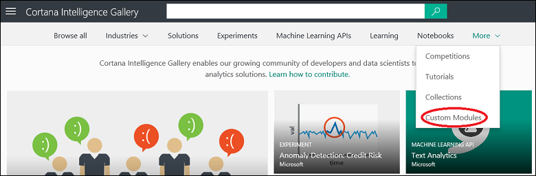

<properties
    pageTitle="Moduli personalizzati Cortana Intelligence raccolta | Microsoft Azure"
    description="Alla scoperta di moduli di apprendimento computer personalizzato nella raccolta di Business Intelligence Cortana."
    services="machine-learning"
    documentationCenter=""
    authors="garyericson"
    manager="jhubbard"
    editor="cgronlun"/>

<tags
    ms.service="machine-learning"
    ms.workload="data-services"
    ms.tgt_pltfrm="na"
    ms.devlang="na"
    ms.topic="article"
    ms.date="10/17/2016"
    ms.author="roopalik;garye"/>

# Alla scoperta di moduli di apprendimento computer personalizzato nella raccolta di Business Intelligence Cortana

[AZURE.INCLUDE [machine-learning-gallery-item-selector](../../includes/machine-learning-gallery-item-selector.md)]

## Moduli personalizzati per computer risorse Studio

Una serie di **[Moduli personalizzati](https://gallery.cortanaintelligence.com/customModules)** sono disponibili nella raccolta di Business Intelligence Cortana che si espandono le funzionalità di Azure Machine Learning Studio. È possibile scaricare questi moduli per l'utilizzo in esperimenti in modo che è possibile sviluppare anche altre soluzioni analitica stima avanzate.

## Alla scoperta di

Per cercare moduli personalizzati nella raccolta, aprire la [raccolta](http://gallery.cortanaintelligence.com), posizionare il puntatore del mouse all' **altro** nella parte superiore della home page della raccolta e selezionare **Moduli personalizzati**.

 **[Moduli personalizzati](https://gallery.cortanaintelligence.com/customModules)** 
 pagina viene visualizzato un elenco dei moduli più popolari.
Fare clic su **tutti** per visualizzare tutti i moduli personalizzati.
Da questa pagina, è possibile passare tutti i moduli personalizzati nella raccolta oppure è possibile eseguire ricerche selezionando criteri di filtro sul lato sinistro della pagina e immettere i termini di ricerca nella parte superiore.

### Raccolta di commenti e condivisione

 Fare clic su qualsiasi modulo personalizzato per aprire pagina dei dettagli del modulo e leggere informazioni su come usarlo e qual è il modulo. In questa pagina è possibile aggiungere commenti, fornire commenti e suggerimenti o porre domande tramite la sezione commenti. È anche possibile condividerla con amici o colleghi che utilizzano le funzionalità di condivisione di LinkedIn o Twitter. È anche possibile inviare tramite posta elettronica un collegamento al modulo personalizzato per invitare altri utenti di visualizzare la pagina.

## Download

È possibile utilizzare qualsiasi modulo personalizzato nella raccolta nella proprio esperimenti.
Esistono due modi per ottenere una copia del modulo:

- **Dalla raccolta** - quando si scarica un modulo nella raccolta, il modulo verrà aggiunto alla tavolozza modulo nell'area di lavoro. È inoltre possibile ottenere una prova di esempio che fornisce un esempio dell'uso del modulo.

- **Dal computer risorse Studio** -è possibile importare un modulo personalizzato mentre si lavora in Studio e il modulo verrà aggiunto alla tavolozza modulo nell'area di lavoro.

Dopo aver aggiunto il modulo personalizzato la tavolozza di modulo, è disponibile per l'uso in qualsiasi prova nell'area di lavoro come qualsiasi altro modulo:

1. Creare una nuova prova o aprirne una esistente
2. Nel riquadro a sinistra della virgola di prova modulo area di lavoro, fare clic su **personalizzata** per espandere l'elenco dei moduli personalizzati nell'area di lavoro

    
3. Selezionare il modulo importati e trascinare la prova

### Dalla raccolta

Per scaricare una copia di un modulo personalizzato da una raccolta:

1. Aprire pagina dei dettagli del modulo nella raccolta

2. Fare clic su **Apri in Studio**

    

    Tutti i moduli personalizzati includono una prova di esempio che illustra come utilizzare il modulo. Quando si fa clic su **Apri in Studio**, prova in questo esempio viene caricato nell'area di lavoro Machine Learning Studio e aperti (se non è già effettuato Studio, verrà chiesto di accedere con l'account Microsoft prima di prova verrà copiata nell'area di lavoro).

Il modulo personalizzato viene copiato nell'area di lavoro e inserito nella tavolozza modulo insieme a tutti gli altri predefiniti o personalizzati Studio moduli. È ora possibile usarlo come qualsiasi altro modulo nell'area di lavoro.

### Dall'interno lavorare formazione Studio

È anche possibile importare i moduli personalizzati stesso dalla raccolta mentre si lavora in computer risorse Studio:

1. Nel computer risorse Studio, fare clic su **+ Nuovo**

2. Selezionare **modulo** - viene visualizzato un elenco di raccolta moduli che è possibile scegliere tra oppure è possibile trovare un modulo specifico utilizzando la casella di ricerca

3. Posizionare il mouse in un modulo e selezionare **Importa modulo** (per visualizzare le informazioni del modulo, selezionare **vista nella raccolta** che consente di accedere alla pagina dettagli per il modulo nella raccolta)

    

Il modulo personalizzato viene copiato nell'area di lavoro e inserito nella tavolozza modulo insieme a tutti gli altri predefiniti o personalizzati Studio moduli. È ora possibile usarlo come qualsiasi altro modulo nell'area di lavoro.

**[Vai alla raccolta in >>](http://gallery.cortanaintelligence.com)**

[AZURE.INCLUDE [machine-learning-free-trial](../../includes/machine-learning-free-trial.md)]
