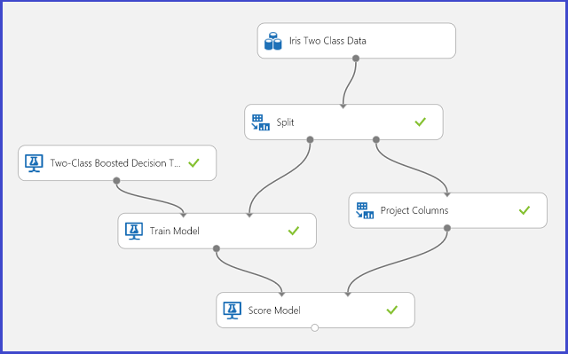
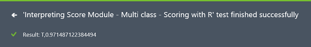

<properties
    pageTitle="Interpretare i risultati del modello di apprendimento | Microsoft Azure"
    description="Come scegliere il parametro ottimale impostato per un algoritmo di utilizzo e la visualizzazione di output di modello punteggio."
    services="machine-learning"
    documentationCenter=""
    authors="bradsev"
    manager="jhubbard"
    editor="cgronlun"/>

<tags
    ms.service="machine-learning"
    ms.workload="data-services"
    ms.tgt_pltfrm="na"
    ms.devlang="na"
    ms.topic="article"
    ms.date="09/12/2016"
    ms.author="bradsev" />

# Interpretare i risultati del modello di apprendimento Azure

In questo argomento viene illustrato come visualizzare e interpretare i risultati della previsione in Azure Machine Learning Studio. Dopo aver qualificato un modello e completato le stime su di essa ("totalizza un modello di"), è necessario comprendere e interpretare il risultato di previsione.

[AZURE.INCLUDE [machine-learning-free-trial](../../includes/machine-learning-free-trial.md)]

Esistono quattro tipi principali di apprendimento automatico dei modelli in Azure Machine formazione:

* Classificazione
* Cluster
* Regressione
* Sistemi consigliere

I moduli utilizzati per la funzione di completamento nella parte superiore di questi modelli sono:

* [Punteggio modello] [ score-model] modulo per la classificazione e regressione
* [Assegnare a cluster] [ assign-to-clusters] modulo per il raggruppamento
* [Punteggio consigliere Matchbox] [ score-matchbox-recommender] per sistemi di recommendation

In questo documento viene illustrato come interpretare i risultati di completamento per ognuno di questi moduli. Per una panoramica di questi moduli, vedere [come scegliere parametri per ottimizzare gli algoritmi di apprendimento Azure](machine-learning-algorithm-parameters-optimize.md).

In questo argomento viene interpretazione stima ma non la valutazione del modello. Per ulteriori informazioni su come calcolare il modello, vedere [come valutare le prestazioni di modello in Azure apprendimento](machine-learning-evaluate-model-performance.md).

Se si ha esperienza di apprendimento Azure e assistenza per la creazione di una prova semplice per iniziare, vedere [creare una semplice prova Azure Machine Learning Studio](machine-learning-create-experiment.md) Azure Machine Learning Studio.

## Classificazione ##
Esistono due sottocategorie dei problemi di classificazione:

* Problemi con solo due classi (classificazione due classe o binaria)
* Problemi con più di due classi (multi-classe classificazione)

Apprendimento Azure sono diversi moduli di occuparsi di ciascuno di questi tipi di classificazione, ma i metodi per interpretare i relativi risultati stima sono simili.

### Classificazione due classe###
**Prova di esempio**

Esempio di un problema di classificazione due classe è la classificazione di fiori iride. L'attività è per classificare fiori iride in base alle funzionalità. Il set di dati iride fornito in apprendimento Azure è un sottoinsieme del [set di dati iride](http://en.wikipedia.org/wiki/Iris_flower_data_set) popolari contenente le istanze di solo due specie fiore (classi 0 e 1). Sono disponibili quattro caratteristiche per ogni fiore (lunghezza sepal, sepal larghezza, lunghezza petalo e larghezza petalo).

Figura 1. Prova problema di classificazione due classe iride

Una prova è stata eseguita per risolvere il problema, come illustrato nella figura 1. Formazione e totalizzato un modello di albero decisionale invece un incremento due classe. A questo punto è possibile visualizzare i risultati di stima dal [Modello di punteggio] [ score-model] modulo facendo clic su porta di output del [Modello di punteggio] [ score-model] modulo e quindi fare clic su **Visualizza**.

Verrà visualizzato i punteggio risultati come illustrato nella figura 2.

Figura 2. Visualizzare un risultato di punteggio modello di classificazione due classe

**Interpretazione risultato**

Esistono sei colonne nella tabella dei risultati. Le quattro colonne a sinistra sono quattro caratteristiche. Destra due colonne, totalizza etichette e totalizza probabilità sono i risultati di previsione. La colonna totalizza probabilità Mostra la probabilità che un fiore appartiene alla classe positiva (classe 1). Ad esempio, il primo numero di colonna (0.028571) indica che sono è 0.028571 probabilità che il primo fiore appartiene alla classe 1. La colonna di etichette totalizza Mostra la classe prevista per ogni fiore. Questo è in base alla colonna totalizza probabilità. Se la probabilità di un fiore punteggio è superiore a 0,5, viene calcolato come classe 1. In caso contrario, viene calcolato come classe 0.

**Pubblicazione del servizio Web**

Dopo i risultati stima interpretati e ritenuti audio, in modo che sia possibile distribuirlo in varie applicazioni e chiamarlo per ottenere le stime di classe in qualsiasi nuova fiore iride la prova può essere pubblicato come servizio web. Per informazioni su come trasformare una prova di formazione in un punteggio prova e pubblicarla come servizio web, vedere [pubblicazione di servizio web di apprendimento Azure](machine-learning-walkthrough-5-publish-web-service.md). Questa procedura offre un punteggio prova come illustrato nella figura 3.

Figura 3. Punteggio di prova problema due classe classificazione iride

A questo punto è necessario impostare l'input e output per il servizio web. L'input è la porta input destra del [Modello di punteggio][score-model], ovvero il fiore iride caratteristiche input. La scelta di output dipende se è interessati in classe prevista (punteggio etichetta), la probabilità punteggio o entrambi. In questo esempio, si presuppone che si è interessati in entrambe. Per selezionare le colonne di output desiderato, usare una [Selezione colonne nel set di dati] [ select-columns] modulo. Fare clic su [Seleziona colonne nel set di dati][select-columns], fare clic su **Avvia selettore di colonna**e scegliere **Totalizza etichette** e **Totalizza probabilità**. Dopo aver impostato la porta di output delle [Colonne selezionare set di dati] [ select-columns] ed eseguire nuovamente, dovrebbe essere pronti a pubblicare il punteggio prova come un servizio web, fare clic su **Pubblica servizio WEB**. Prova finale è simile alla figura 4.

Figura 4. Prova punteggio finale di un problema di classificazione due classe iride

Dopo avere eseguito il servizio web e immettere valori alcune funzionalità di un'istanza di test, il risultato restituisce due numeri. Il primo numero è l'etichetta punteggio e il secondo è la probabilità punteggio. Questo fiore viene calcolato come classe 1 con probabilità 0.9655.

Figura 5. Risultato di servizio Web di classificazione di classe due iride

### Classificazione di classe multiple
**Prova di esempio**

In questo esercizio, si esegue un'operazione di riconoscimento della come esempio di classificazione multiclass. L'utilità di classificazione tenta di indovinare una determinata lettera (classe) in base ai valori alcune scritto a mano attributo estratte da immagini scritto a mano.

Nei dati di training, sono disponibili 16 caratteristiche estratte da immagini lettera scritta a mano. 26 lettere costituiscono il nostro 26 classi. La figura 6 mostra una prova che verrà formare un modello di classificazione multiclass per il riconoscimento lettera prevedere nella stessa funzionalità impostata su un set di dati di test.

Figura 6. Prova di lettera riconoscimento classificazione multiclass problema

Visualizzazione dei risultati dal [Modello di punteggio] [ score-model] modulo facendo clic su porta di output del [Modello di punteggio] [ score-model] modulo e quindi fare clic su **Visualizza**, è necessario visualizzare il contenuto come illustrato nella figura 7.

Figura 7. Visualizzare i risultati del modello di punteggio in una classificazione di classe multiple

**Interpretazione risultato**

16 colonne a sinistra rappresentano i valori di funzionalità del set di test. Le colonne con nomi ad esempio, sono solo totalizza probabilità per classe "XX", ad esempio la colonna totalizza probabilità nel caso di due classe. Che vengano visualizzate la probabilità che la voce corrispondente rientra in una determinata categoria. Ad esempio, per la prima voce è 0.003571 probabile che si tratti di una"," 0.000451 probabilità che si tratti di una "B" e così via. Ultima colonna (totalizza etichette) è uguale totalizza etichette nel caso di due classe. Seleziona della classe con la probabilità di punteggio massima come classe prevista della voce corrispondente. Ad esempio, per la prima voce, l'etichetta punteggio è "F" quanto dispone di più grande probabilità a una "F" (0.916995).

**Pubblicazione del servizio Web**

È inoltre possibile ottenere l'etichetta punteggio per ogni voce e la probabilità dell'etichetta punteggio. La logica di base è per trovare la probabilità più grande tra tutte le probabilità punteggio. A questo scopo è necessario utilizzare [Esecuzione Script R] [ execute-r-script] modulo. Il codice R è mostrato nella figura 8 e il risultato di prova è illustrato nella figura 9.

Figura 8. Codice R per l'estrazione totalizza etichette e la probabilità associata delle etichette

Figura 9. Prova punteggio finale del problema di classificazione multiclass riconoscimento lettera

Dopo aver pubblicare ed eseguire il servizio web e immettere valori alcune funzionalità di input, il risultato restituito sembra figura 10. Grazie alle funzionalità di 16 estratte, questa lettera scritta a mano dovrebbe per essere "T" con probabilità 0.9715.

Figura 10. Risultato di servizio Web di classificazione multiclass

## Regressione

Problemi di regressione sono diversi dai problemi di classificazione. In un problema di classificazione, si sta cercando di prevedere classi distinte, ad esempio quale classe un fiore iride appartiene a. Ma come può vedere nell'esempio seguente di un problema di regressione, si sta tentando di prevedere una variabile continua, ad esempio il prezzo di un'auto.

**Prova di esempio**

Utilizzare la funzione di completamento prezzo veicoli come l'esempio di regressione. Si sta tentando di prevedere il prezzo di un'auto in base alle relative caratteristiche, inclusi creazione, il tipo di carburante, tipo di corpo e ruota. La prova è illustrato nella figura 11.

Figura 11. Prova problema di regressione veicoli prezzo

Visualizzare il [Modello di punteggio] [ score-model] modulo, il risultato è simile alla figura 12.

Figura 12. Risultato punteggio per il problema di stima veicoli prezzo

**Interpretazione risultato**

Etichette punteggio è la colonna risultato questo risultato punteggio. I numeri sono il prezzo previsto per ogni Auto.

**Pubblicazione del servizio Web**

È possibile pubblicare prova regressione in un servizio web e chiamarlo per previsione prezzo veicoli esattamente come nel caso di utilizzo di due classe classificazione.

Figura 13. Prova di un problema di regressione prezzo veicoli di classificazione

Esecuzione del servizio web, il risultato restituito è simile alla figura 14. Il prezzo previsto per questo Auto è $15,085.52.

Figura 14. Risultato di servizio Web di un problema di regressione veicoli prezzo

## Cluster

**Prova di esempio**

Utilizzare il set di dati iride nuovo per creare un cluster prova. Qui è possibile filtrare le etichette di classe nel set di dati in modo che solo include caratteristiche possono essere usata per il raggruppamento. In questo iride usare maiuscole/minuscole, specificare il numero di cluster a due durante il processo di formazione, vale a dire da cluster di fiori in due classi. La prova è illustrato nella figura 15.

Figura 15. Problema cluster iride provare

Cluster è diverso dal classificazione in set di dati formazione non dispone di etichette di terra verità autonomamente. Gruppi cluster le istanze di set di dati di formazione in cluster distinti. Durante il processo di formazione, il modello di etichette le voci imparando le differenze tra le caratteristiche. In seguito, è possibile utilizzare il modello di formazione per classificare ulteriormente i movimenti futuri. Esistono due parti del risultato che siamo interessati all'interno di un problema cluster. La prima parte è etichette il set di dati di formazione e il secondo è la classificazione di un nuovo set di dati con il modello di esperto.

Visualizzare la prima parte del risultato, fare clic su porta di output a sinistra del [Modello cluster treno] [ train-clustering-model] e quindi fare clic su **Visualizza**. La visualizzazione è illustrata nella figura 16.

Figura 16. Visualizzare cluster risultato per il set di dati di formazione

Il risultato della seconda parte cluster nuove voci con il modello di cluster esperto, è illustrato nella figura 17.

Figura 17. Visualizzare cluster risultato su una nuova serie di dati

**Interpretazione risultato**

Anche se i risultati delle due parti derivano dalla prova diverse fasi, hanno un aspetto diverso e interpretate nello stesso modo. Le prime quattro colonne sono caratteristiche. L'ultima colonna, le assegnazioni, è il risultato di previsione. Le voci assegnate lo stesso numero sono previsti stiano nello stesso cluster, vale a dire che condividono analogie in modo (questa prova utilizza unità di misura metriche distanza euclidea predefinita). Perché è stato specificato il numero di cluster a 2, le voci di assegnazioni sono contrassegnati da 0 o 1.

**Pubblicazione del servizio Web**

È possibile pubblicare prova cluster in un servizio web e chiamarlo per il raggruppamento le stime esattamente come la classificazione di classe due in caso di utilizzo.

Figura 18. Prova di un problema cluster iride di classificazione

Dopo aver eseguito il servizio web, il risultato restituito è simile alla figura 19. Questo fiore dovrebbe per essere cluster 0.

Figura 19. Risultato di servizio Web di classificazione di classe due iride

## Sistema consigliere
**Prova di esempio**

Per sistemi consigliere, è possibile utilizzare il problema di recommendation ristorante ad esempio: è possibile suggerire ristoranti per i clienti in base alla cronologia di valutazione. I dati di input è costituito da tre elementi:

* Valutazioni ristorante dai clienti
* Dati delle funzionalità cliente
* Dati delle funzionalità ristorante

Esistono diverse operazioni che è possibile eseguire con [Treno Matchbox consigliere] [ train-matchbox-recommender] modulo di Azure apprendimento:

- Prevedere valutazioni per un determinato utente e una voce
- È consigliabile elementi a un determinato utente
- Trovare utenti relativi a un utente specifico
- Trovare gli elementi relativi a un determinato elemento

È possibile selezionare da eseguire per selezionando una delle quattro opzioni nel menu **tipo stima consigliere** . Qui è possibile scorrere tutte e quattro gli scenari.

Una prova di apprendimento Azure tipico per un sistema consigliere è simile alla figura 20. Per informazioni su come usare i moduli di sistema consigliere, vedere [consigliere matchbox treno] [ train-matchbox-recommender] e [consigliere matchbox punteggio][score-matchbox-recommender].

Figura 20. Prova sistema consigliere

**Interpretazione risultato**

**Prevedere valutazioni per un determinato utente e una voce**

Se si seleziona **Stima di valutazione** in **tipo di previsione consigliere**, viene chiesto il sistema consigliere per stimare la classificazione di un determinato utente e una voce. La visualizzazione di [Punteggio Matchbox consigliere] [ score-matchbox-recommender] output è simile alla figura 21.

Figura 21. Visualizzare il risultato di punteggio del sistema consigliere - valutazione stima

Le prime due colonne sono le coppie di elemento utente dei dati di input. La terza colonna è la classificazione prevista di un utente per un determinato elemento. Nella prima riga, ad esempio cliente U1048 è previsti al ristorante tasso 135026 come 2.

**È consigliabile elementi a un determinato utente**

Selezionando l' **Elemento Recommendation** in **tipo di previsione consigliere**, richiedere il sistema consigliere consigliare gli elementi a un determinato utente. L'ultimo parametro per scegliere in questo scenario è *la selezione di elementi consigliati*. L'opzione **Da elementi nominale (per la valutazione di modello)** è principalmente per la valutazione di modello durante il processo di formazione. In questa fase di previsione, si sceglie **Di tutti gli elementi**. La visualizzazione di [Punteggio Matchbox consigliere] [ score-matchbox-recommender] output è simile alla figura 22.

Figura 22. Visualizzare il risultato di punteggio del sistema consigliere - recommendation elemento

Prima di sei colonne rappresenta l'utente specificato ID consigliare elementi, come previsto in base ai dati di input. Le cinque colonne rappresentano gli elementi consigliati per l'utente in ordine decrescente di pertinenza. Nella prima riga, ad esempio, ristorante maggiormente consigliato per cliente U1048 è 134986, seguito da 135018, 134975, 135021 e 132862.

**Trovare utenti relativi a un utente specifico**

Se si seleziona **Utenti correlati** in **tipo di previsione consigliere**, richiedere il sistema consigliere per trovare utenti correlati a un determinato utente. Utenti correlati sono gli utenti che dispongono di preferenze simili. L'ultimo parametro per scegliere in questo scenario è *Selezione utente correlati*. L'opzione **Da utenti che possono valutati gli elementi (per valutazione del modello)** è principalmente per la valutazione di modello durante il processo di formazione. Scegliere **Da tutti gli utenti** in questa fase di previsione. La visualizzazione di [Punteggio Matchbox consigliere] [ score-matchbox-recommender] output è simile alla figura 23.

Figura 23. Visualizzare i risultati di punteggio del sistema consigliere - utenti correlati

Prima di sei colonne Mostra l'utente specificato che ID necessari per trovare utenti correlati, come previsto dai dati immessi. Le cinque colonne archiviare gli utenti correlati previsti dell'utente in ordine decrescente di pertinenza. Nella prima riga, ad esempio, il cliente più rilevante per il cliente U1048 è U1051, seguito da U1066, U1044, U1017 e U1072.

**Trovare gli elementi relativi a un determinato elemento**

Se si seleziona **Elementi correlati** in **tipo di previsione consigliere**, viene chiesto di sistema consigliere per trovare gli elementi correlati a un determinato elemento. Elementi correlati sono gli elementi più facile mi dall'utente stesso. L'ultimo parametro per scegliere in questo scenario è *la selezione di elementi correlati*. L'opzione **Da elementi nominale (per la valutazione di modello)** è principalmente per la valutazione di modello durante il processo di formazione. Viene scelta **Da tutti gli elementi** in questa fase di previsione. La visualizzazione di [Punteggio Matchbox consigliere] [ score-matchbox-recommender] output è simile alla figura 24.

Figura 24. Visualizzare i risultati di punteggio del sistema consigliere - elementi correlati

Prima di sei colonne rappresenta l'elemento specificato ID necessari per trovare elementi correlati, come previsto in base ai dati di input. Le cinque colonne archiviare gli elementi correlati previsti dell'elemento decrescente in termini di pertinenza. Nella prima riga, ad esempio, l'elemento più importanti per l'elemento 135026 è 135074, seguito da 135035, 132875, 135055 e 134992.

**Pubblicazione del servizio Web**

Il processo di pubblicazione di questi esperimenti come servizi web per ottenere le stime è simile per ognuna delle quattro scenari. Di seguito è eseguire il secondo scenario (consigliato elementi a un determinato utente) come esempio. È possibile eseguire la stessa procedura con le altre tre.

Il salvataggio del sistema consigliere esperti come un modello di formazione e filtrare i dati di input a una colonna ID utente singolo come richiesto, è possibile collegare prova come illustrato nella figura 25 e pubblicare come un servizio web.

Figura 25. Punteggio prova del problema recommendation ristorante

Esecuzione del servizio web, il risultato restituito è simile alla figura 26. I cinque ristoranti consigliati per utente U1048 sono 134986, 135018, 134975, 135021 e 132862.

Figura 26. Risultato di servizio Web del problema recommendation ristorante

<!-- Module References -->
[assign-to-clusters]: https://msdn.microsoft.com/library/azure/eed3ee76-e8aa-46e6-907c-9ca767f5c114/
[execute-r-script]: https://msdn.microsoft.com/library/azure/30806023-392b-42e0-94d6-6b775a6e0fd5/
[select-columns]: https://msdn.microsoft.com/library/azure/1ec722fa-b623-4e26-a44e-a50c6d726223/
[score-matchbox-recommender]: https://msdn.microsoft.com/library/azure/55544522-9a10-44bd-884f-9a91a9cec2cd/
[score-model]: https://msdn.microsoft.com/library/azure/401b4f92-e724-4d5a-be81-d5b0ff9bdb33/
[train-clustering-model]: https://msdn.microsoft.com/library/azure/bb43c744-f7fa-41d0-ae67-74ae75da3ffd/
[train-matchbox-recommender]: https://msdn.microsoft.com/library/azure/fa4aa69d-2f1c-4ba4-ad5f-90ea3a515b4c/
