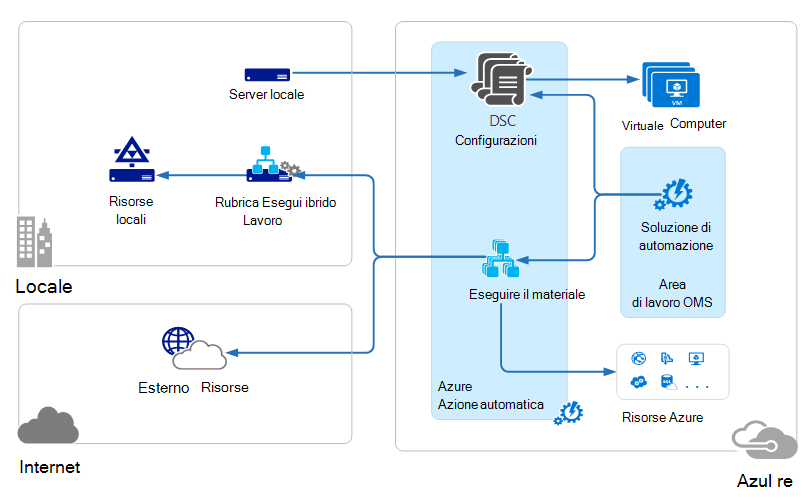

<properties 
   pageTitle="Architettura di gestione famiglia di prodotti (OMS) operazioni | Microsoft Azure"
   description="Famiglia di prodotti (OMS, le operazioni di gestione Order) è basato sul cloud IT soluzione Microsoft che consente di gestire e proteggere le in locale e infrastruttura cloud.  In questo articolo sono riportati i diversi servizi inclusi in OMS e vengono forniti collegamenti in base al contenuto dettagliato."
   services="operations-management-suite"
   documentationCenter=""
   authors="bwren"
   manager="jwhit"
   editor="tysonn" />
<tags 
   ms.service="operations-management-suite"
   ms.devlang="na"
   ms.topic="get-started-article"
   ms.tgt_pltfrm="na"
   ms.workload="infrastructure-services"
   ms.date="10/27/2016"
   ms.author="bwren" />

# Architettura OMS

[Operazioni di gestione famiglia di prodotti (OMS)](https://azure.microsoft.com/documentation/services/operations-management-suite/) è una raccolta di servizi basati su cloud per la gestione dei propri locali e cloud ambienti.  In questo articolo vengono illustrati i componenti di cloud di OMS e l'architettura di elaborazione di alto livello cloud e locali diverse.  È possibile fare riferimento alla documentazione per ogni servizio per ulteriori informazioni.

## Registro Analitica

Tutti i dati raccolti dal [Analitica Log](https://azure.microsoft.com/documentation/services/log-analytics/) è archiviato nel repository OMS ospitato in Azure.  Origini connesse generano dati raccolti repository OMS.  Esistono tre tipi di origini connesse supportati.

- Un agente installato in un computer [Windows](../log-analytics/log-analytics-windows-agents.md) o [Linux](../log-analytics/log-analytics-linux-agents.md) connesso direttamente al OMS.
- Un System Center Operations Manager (SCOM) Gestione gruppo [connessi al Log Analitica](../log-analytics/log-analytics-om-agents.md) .  Gli agenti SCOM continuano a comunicare con i server di gestione che alla Analitica registro eventi e dati sulle prestazioni.
- Un [account di archiviazione Azure](../log-analytics/log-analytics-azure-storage.md) che raccoglie i dati di [Azure diagnostica](../cloud-services/cloud-services-dotnet-diagnostics.md) da un ruolo di lavoro, ruolo web o macchina virtuale in Azure.

Origini dati definiscono i dati raccolti Log Analitica da origini connesse, inclusi i registri eventi e contatori.  Soluzioni aggiungono funzionalità a OMS e possono essere aggiunti facilmente nell'area di lavoro nella [Raccolta soluzioni OMS](../log-analytics/log-analytics-add-solutions.md).  Alcune soluzioni possono richiedere una connessione diretta a Log Analitica da parte di agenti SCOM mentre gli altri utenti possono richiedere agente aggiuntivo da installare.

Registro Analitica ha un portale basato sul web che è possibile utilizzare per gestire le risorse OMS, aggiungere e configurare soluzioni OMS, visualizzare e analizzare i dati in archivio OMS.

## Automazione Azure

[Automazione di Azure runbook](http://azure.microsoft.com/documentation/services/automation) vengono eseguiti nel cloud Azure e possono accedere alle risorse disponibili in Azure in altri servizi cloud, o che siano accessibili da Internet pubblica.  È inoltre possibile designare computer locale nell'interfaccia di dati locali mediante [Ibrido Runbook lavoro](../automation/automation-hybrid-runbook-worker.md) in modo che runbook possono accedere alle risorse locali.

[Configurazioni DSC](../automation/automation-dsc-overview.md) archiviati in Azure automazione possono essere applicate direttamente in macchine virtuali Azure.  Altri fisici e virtuali può richiedere configurazioni dal server Azure automazione DSC pull.

Automazione Azure dispone di una soluzione OMS che visualizza le statistiche e collegamenti al portale di Azure per tutte le operazioni di avvio.

## Copia di Backup Azure

Protetto in [Azure Backup](http://azure.microsoft.com/documentation/services/backup) vengono memorizzati in un archivio di backup che si trova in una specifica area geografica.  I dati replicati all'interno della stessa regione e, a seconda del tipo di archivio, anche replicati in un'altra area per ulteriormente la ridondanza.

Copia di Backup Azure sono previsti tre scenari fondamentali.

- Computer Windows con l'agente di Backup di Azure.  In questo modo si per cartelle e file di backup da qualsiasi client direttamente per l'archivio di backup Azure o il server di Windows.  
- System Center Data Protection Manager (Data Protection Manager) o Server di Backup di Microsoft Azure. In questo modo è possibile sfruttare Data Protection Manager o Microsoft Azure Backup Server per eseguire il backup di file e cartelle oltre a carichi di lavoro di applicazione, ad esempio SQL e SharePoint in un archivio locale e quindi replicare per l'archivio di backup Azure.
- Estensioni Azure macchina virtuale.  In questo modo è possibile eseguire il backup Azure macchine virtuali per l'archivio di backup Azure.

Copia di Backup Azure dispone di una soluzione OMS che visualizza le statistiche e collegamenti al portale di Azure per tutte le operazioni di avvio.

## Ripristino del sito Azure

[Il ripristino del sito di Azure](http://azure.microsoft.com/documentation/services/site-recovery) coordina replica, failover e failback di macchine virtuali e server fisici. Dati di replica vengono scambiati tra host Hyper-V, hypervisor VMware e server fisici nei data center primario e secondario o tra la data center e lo spazio di archiviazione Azure.  Il ripristino del sito sono archiviati metadati negli archivi presenti in una specifica area geografica di Azure. Nessun dato replicato archiviato dal servizio il ripristino del sito.

Il ripristino del sito Azure sono previsti tre scenari di replica fondamentali.

**Replica di macchine virtuali di Hyper-V**
- Se vengono gestite macchine virtuali Hyper-V in cloud VMM, è possibile replicare a un centro dati secondario o allo spazio di archiviazione Azure.  La replica in Azure è tramite una connessione internet protetta.  La replica a un Data Center secondario è tramite la rete LAN.
- Se macchine virtuali Hyper-V non gestite da VMM, è possibile replicare a solo lo spazio di archiviazione Azure.  La replica in Azure è tramite una connessione internet protetta.
 
**Replica di macchine virtuali VMWare**
- È possibile replicare macchine virtuali VMware a un Data Center secondario in esecuzione VMware o allo spazio di archiviazione Azure.  In Azure la replica su una rete VPN da sito o Azure ExpressRoute o su una connessione Internet protetta. Per un Data Center secondario replica tramite il canale di dati InMage esploratore.
 
**Replica del server di Windows e Linux fisici** 
- È possibile replicare server fisici per un Data Center secondario o per lo spazio di archiviazione Azure. In Azure la replica su una rete VPN da sito o Azure ExpressRoute o su una connessione Internet protetta. Per un Data Center secondario replica tramite il canale di dati InMage esploratore.  Azure il ripristino del sito è disponibile una soluzione OMS che consente di visualizzare alcune statistiche, ma è necessario utilizzare il portale di Azure per tutte le operazioni.

## Passaggi successivi

- Informazioni sui [Log Analitica](http://azure.microsoft.com/documentation/services/log-analytics).
- Informazioni sulle [automazione Azure](https://azure.microsoft.com/documentation/services/automation).
- Informazioni sui [Backup Azure](http://azure.microsoft.com/documentation/services/backup).
- Informazioni sui [siti Azure ripristino](http://azure.microsoft.com/documentation/services/site-recovery).
