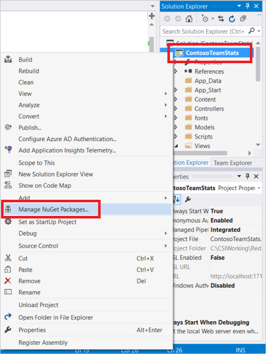

<properties
    pageTitle="Provider di stato sessione ASP.NET cache | Microsoft Azure"
    description="Informazioni su come archiviare lo stato di sessione ASP.NET utilizzando la Cache Redis Azure"
    services="redis-cache"
    documentationCenter="na"
    authors="steved0x"
    manager="douge"
    editor="tysonn" />
<tags
    ms.service="cache"
    ms.devlang="na"
    ms.topic="article"
    ms.tgt_pltfrm="cache-redis"
    ms.workload="tbd"
    ms.date="09/01/2016"
    ms.author="sdanie" />

# Provider di stato sessione ASP.NET per Azure Redis Cache

Azure Cache Redis fornisce un provider di stato sessione che è possibile utilizzare per archiviare lo stato di una sessione in una cache piuttosto che in memoria o in un database di SQL Server. Per utilizzare il provider di stato della sessione memorizzazione nella cache, configurare prima di tutto la cache e quindi configurare l'applicazione ASP.NET per la cache utilizzando il pacchetto Redis Cache sessione stato NuGet.

Spesso non è pratico in un'app reali cloud per evitare di archiviare sorta di stato di una sessione utente, ma alcune approcci sulle prestazioni e scalabilità più di altri utenti. Se si dispone di archiviazione dello stato, la soluzione migliore consiste nel limitare la quantità di stato e archiviarlo in cookie. Se che non è possibile, la soluzione migliore successiva consiste nell'utilizzare lo stato sessione ASP.NET con un provider per cache distribuita, in memoria. La soluzione peggiore prestazioni dal punto di vista scalabilità è usare un database di backup provider dello stato sessione. In questo argomento fornisce indicazioni su mediante il Provider di stato sessione ASP.NET per Azure Redis Cache. Per informazioni su altre opzioni di stato sessione, vedere [Opzioni di stato sessione ASP.NET](#aspnet-session-state-options).

## Archiviare lo stato sessione ASP.NET nella cache

Per configurare un'applicazione client mediante il pacchetto Redis Cache sessione stato NuGet Visual Studio, fare clic sul progetto in **Esplora soluzioni** e scegliere **Gestisci pacchetti NuGet**.

Digitare **RedisSessionStateProvider** nella casella di testo di ricerca, selezionare tra i risultati e fare clic su **Installa**.

>[AZURE.IMPORTANT] Se si utilizza la caratteristica cluster dal livello premium, è necessario utilizzare [RedisSessionStateProvider](https://www.nuget.org/packages/Microsoft.Web.RedisSessionStateProvider) 2.0.1 o versioni successive oppure un'eccezione viene generata. Si tratta di una modifica; Per ulteriori informazioni vedere [v2.0.0 resistenza modifica dettagli](https://github.com/Azure/aspnet-redis-providers/wiki/v2.0.0-Breaking-Change-Details).

Il pacchetto Redis sessione stato Provider NuGet dipende il pacchetto StackExchange.Redis.StrongName. Se non è presenta nel progetto che verrà installato il pacchetto StackExchange.Redis.StrongName. Si noti che oltre il pacchetto di StackExchange.Redis.StrongName sicuro è disponibile anche la versione non-sicuro StackExchange.Redis. Se il progetto utilizza la versione di StackExchange.Redis non-sicuro, è necessario disinstallare prima o dopo l'installazione del pacchetto Redis sessione stato Provider NuGet, in caso contrario è verrà visualizzato conflitti di nome di un progetto. Per ulteriori informazioni su questi pacchetti, vedere [configurare .NET cache client](cache-dotnet-how-to-use-azure-redis-cache.md#configure-the-cache-clients).

Pacchetto NuGet Scarica e aggiunge l'assembly richiesto fa riferimento e aggiunge che le operazioni seguenti aggiunge la sezione seguente nel file config che contiene la configurazione necessaria per l'applicazione ASP.NET per utilizzare il Provider di Redis Cache sessione dello stato.

    <sessionState mode="Custom" customProvider="MySessionStateStore">
        <providers>
        <!--
        <add name="MySessionStateStore"
            host = "127.0.0.1" [String]
            port = "" [number]
            accessKey = "" [String]
            ssl = "false" [true|false]
            throwOnError = "true" [true|false]
            retryTimeoutInMilliseconds = "0" [number]
            databaseId = "0" [number]
            applicationName = "" [String]
            connectionTimeoutInMilliseconds = "5000" [number]
            operationTimeoutInMilliseconds = "5000" [number]
        />
        -->
        <add name="MySessionStateStore" type="Microsoft.Web.Redis.RedisSessionStateProvider" host="127.0.0.1" accessKey="" ssl="false"/>
        </providers>
    </sessionState>

La sezione commentata viene fornito un esempio degli attributi e impostazioni di esempio per ogni attributo.

Configurare gli attributi con i valori del blade cache nel portale di Microsoft Azure e configurare gli altri valori in base alle esigenze. Per istruzioni sull'accesso le proprietà della cache, vedere [configurare Redis le impostazioni della cache](cache-configure.md#configure-redis-cache-settings).

-   **host** : specificare il punto finale della cache.
-   **porta** : usare la porta non SSL o il SSL la porta, a seconda delle impostazioni ssl.
-   **accessKey** : utilizzare la chiave primaria o secondaria per la cache.
-   **ssl** -true se si desidera rendere sicure le comunicazioni cache/client con ssl; in caso contrario false. Assicurarsi di specificare la porta corretta.
    -   La porta SSL non è disattivata per impostazione predefinita per nuove cache. Specificare true per questa impostazione per utilizzare la porta SSL. Per ulteriori informazioni sull'attivazione della porta non SSL, vedere la sezione di [Accesso a porte](cache-configure.md#access-ports) nella sezione [Configura una cache](cache-configure.md) .
-   **throwOnError** -true se si desidera un'eccezione in caso di errore, o false se si desidera che l'operazione per automaticamente esito negativo. È possibile cercare un errore selezionando la proprietà Microsoft.Web.Redis.RedisSessionStateProvider.LastException statica. Il valore predefinito è true.
-   **retryTimeoutInMilliseconds** – operazioni che non vengono ripetute durante questo intervallo specificato in millisecondi. Il primo tentativo compare dopo 20 millisecondi e quindi tentativi si verificano ogni secondo finché non scade l'intervallo di retryTimeoutInMilliseconds. Immediatamente dopo tale intervallo, l'operazione viene ripetuta una volta finale. Se l'operazione non riesce ancora, l'eccezione nuovamente al chiamante, a seconda dell'impostazione throwOnError. Il valore predefinito è 0 che indica che non tentativi.
-   **ID** -specifica il database da utilizzare per memorizzare nella cache di output dei dati. Se non viene specificato, viene utilizzato il valore predefinito di 0.
-   **NomeApplicazione** – chiavi sono archiviate in redis come `{<Application Name>_<Session ID>}_Data`. In questo modo più applicazioni di condividere la stessa chiave. Questo parametro è facoltativo e se non si forniscono viene utilizzato un valore predefinito.
-   **connectionTimeoutInMilliseconds** : questa impostazione consente di ignorare l'impostazione connectTimeout nel client StackExchange.Redis. Se non viene specificato, viene utilizzata l'impostazione di connectTimeout di 5000. Per ulteriori informazioni, vedere [il modello di configurazione StackExchange.Redis](http://go.microsoft.com/fwlink/?LinkId=398705).
-   **operationTimeoutInMilliseconds** : questa impostazione consente di ignorare l'impostazione syncTimeout nel client StackExchange.Redis. Se non viene specificato, viene utilizzata l'impostazione di syncTimeout di 1000. Per ulteriori informazioni, vedere [il modello di configurazione StackExchange.Redis](http://go.microsoft.com/fwlink/?LinkId=398705).

Per ulteriori informazioni su queste proprietà, vedere l'annuncio di post di blog originale al [Annuncio Provider dello stato sessione ASP.NET per Redis](http://blogs.msdn.com/b/webdev/archive/2014/05/12/announcing-asp-net-session-state-provider-for-redis-preview-release.aspx).

Non dimenticare di commento standard InProc sessione stato provider sezione nel file Web. config.

    <!-- <sessionState mode="InProc"
         customProvider="DefaultSessionProvider">
         <providers>
            <add name="DefaultSessionProvider"
                  type="System.Web.Providers.DefaultSessionStateProvider,
                        System.Web.Providers, Version=1.0.0.0, Culture=neutral,
                        PublicKeyToken=31bf3856ad364e35"
                  connectionStringName="DefaultConnection" />
          </providers>
    </sessionState> -->

Una volta che vengono eseguite le operazioni seguenti, l'applicazione è configurata per utilizzare il Provider di Redis Cache sessione dello stato. Quando si usa lo stato della sessione nell'applicazione, verranno archiviato in un'istanza di Azure Redis Cache.

>[AZURE.NOTE] Si noti che i dati memorizzati nella cache devono essere serializzabili, a differenza dei dati memorizzati in predefinito in memoria ASP.NET sessione stato Provider. Quando viene utilizzato il Provider di stato sessione per Redis, assicurarsi che i tipi di dati memorizzati nello stato sessione sono serializzabili.

## Opzioni di stato sessione ASP.NET

- In Provider memoria sessione - questo provider memorizza lo stato della sessione in memoria. Il vantaggio di utilizzare questo provider è semplice e veloce. Tuttavia se si utilizza nel provider di memoria dal momento che non viene distribuito non è possibile ridimensionare le applicazioni Web.

- Questo provider: lo stato della sessione di SQL Server Provider archivia lo stato della sessione in Sql Server. Se si desidera mantenere lo stato della sessione in un archivio permanente, è necessario utilizzare questo provider. È possibile ridimensionare un'App Web, ma con Sql Server per sessione avrà un impatto sulle prestazioni in un'applicazione Web.

- Distribuito In memoria Provider dello stato sessione, ad esempio Redis Cache Provider dello stato sessione - questo provider offre combinazione ottimale. App Web può avere un Provider dello stato sessione scalable, semplice e veloce. Tuttavia, è necessario tenere in considerazione che questo provider archivia lo stato della sessione in una Cache e l'app deve prendere in considerazione tutte le caratteristiche associate quando si parla distribuito nella Cache, ad esempio errori di rete temporaneo. Per suggerimenti sull'uso della Cache, vedere [indicazioni per la memorizzazione nella cache](../best-practices-caching.md) da Microsoft Patterns & Practices [Progettazione di applicazioni Cloud Azure e indicazioni per l'implementazione](https://github.com/mspnp/azure-guidance).

Per ulteriori informazioni sullo stato di sessione e altre procedure consigliate, vedere [Web Development Best Practices (creazione reali Cloud di applicazioni con Azure)](http://www.asp.net/aspnet/overview/developing-apps-with-windows-azure/building-real-world-cloud-apps-with-windows-azure/web-development-best-practices).

## Passaggi successivi

Estrarre il [Provider di Cache di Output di ASP.NET per Azure Redis Cache](cache-aspnet-output-cache-provider.md).
