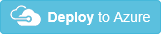

<properties 
    pageTitle="Effettuare il provisioning di una Cache Redis | Microsoft Azure" 
    description="Manager delle risorse Azure modello consente di distribuire una Cache Redis Azure." 
    services="app-service" 
    documentationCenter="" 
    authors="steved0x" 
    manager="douge" 
    editor=""/>

<tags 
    ms.service="cache" 
    ms.workload="web" 
    ms.tgt_pltfrm="cache-redis" 
    ms.devlang="na" 
    ms.topic="article" 
    ms.date="09/27/2016" 
    ms.author="sdanie"/>

# Creare una Cache Redis utilizzando un modello

In questo argomento, come creare un modello di gestione di risorse Azure che distribuisce una Cache Redis Azure. La cache è utilizzabile con un account di archiviazione esistente per mantenere i dati di diagnostica. Anche informazioni su come definire quali risorse vengono distribuite e come definire i parametri specificati quando viene eseguita la distribuzione. È possibile utilizzare questo modello per il proprio distribuzioni oppure personalizzarlo in base alle esigenze.

Attualmente, le impostazioni di diagnostiche sono condivise per tutte le cache nella stessa area per una sottoscrizione. Aggiornamento di una cache nell'area viene applicata a tutte le altre cache nell'area.

Per ulteriori informazioni sulla creazione di modelli, vedere [Creazione di modelli di Manager delle risorse Azure](../resource-group-authoring-templates.md).

Per il modello completo, vedere [modello Redis Cache](https://github.com/Azure/azure-quickstart-templates/blob/master/101-redis-cache/azuredeploy.json).

>[AZURE.NOTE] Sono disponibili modelli di Manager delle risorse per il nuovo [livello di Premium](cache-premium-tier-intro.md) . 
>
>-    [Creare una Cache Redis Premium con il servizio cluster](https://azure.microsoft.com/documentation/templates/201-redis-premium-cluster-diagnostics/)
>-    [Creare Premium Redis Cache con una connessione permanente di dati](https://azure.microsoft.com/documentation/templates/201-redis-premium-persistence/)
>-    [Creare Cache Redis Premium con VNet e cluster facoltativo](https://azure.microsoft.com/documentation/templates/201-redis-premium-vnet-cluster-diagnostics/)
>
>Per cercare modelli più recenti, vedere [Guida introduttiva di Azure modelli](https://azure.microsoft.com/documentation/templates/) e cercare `Redis Cache`.

## Si distribuisce

In questo modello, distribuire una Cache Redis Azure usato da un account esistente di spazio di archiviazione per i dati di diagnostica.

Per eseguire automaticamente la distribuzione, fare clic sul pulsante seguente:

## Parametri

Azure Gestione risorse, definire i parametri per i valori per specificare quando si distribuisce il modello. Il modello include una sezione denominata parametri che contiene tutti i valori dei parametri.
È necessario definire un parametro per tali valori che variano in base a project che si distribuisce o in base all'ambiente per distribuire. Non definire i parametri per i valori che restano sempre lo stesso. Ogni valore di parametro viene utilizzato nel modello per definire le risorse che vengono distribuite. 

[AZURE.INCLUDE [app-service-web-deploy-redis-parameters](../../includes/cache-deploy-parameters.md)]

### redisCacheLocation

Il percorso della Cache Redis. Per ottenere prestazioni ottimali, usare lo stesso percorso con l'app da utilizzare con la cache.

    "redisCacheLocation": {
      "type": "string"
    }

### existingDiagnosticsStorageAccountName

Il nome dell'account di archiviazione esistente da utilizzare per diagnostica. 

    "existingDiagnosticsStorageAccountName": {
      "type": "string"
    }

### enableNonSslPort

Un valore boolean che indica se consentire l'accesso tramite porte non SSL.

    "enableNonSslPort": {
      "type": "bool"
    }

### diagnosticsStatus

Valore che indica se è abilitata diagnostica. Utilizzare ON o OFF.

    "diagnosticsStatus": {
      "type": "string",
      "defaultValue": "ON",
      "allowedValues": [
            "ON",
            "OFF"
        ]
    }
    
## Risorse per la distribuzione

### Redis Cache

Crea la Cache di Azure Redis.

    {
      "apiVersion": "2015-08-01",
      "name": "[parameters('redisCacheName')]",
      "type": "Microsoft.Cache/Redis",
      "location": "[parameters('redisCacheLocation')]",
      "properties": {
        "enableNonSslPort": "[parameters('enableNonSslPort')]",
        "sku": {
          "capacity": "[parameters('redisCacheCapacity')]",
          "family": "[parameters('redisCacheFamily')]",
          "name": "[parameters('redisCacheSKU')]"
        }
      },
      "resources": [
        {
          "apiVersion": "2015-07-01",
          "type": "Microsoft.Cache/redis/providers/diagnosticsettings",
          "name": "[concat(parameters('redisCacheName'), '/Microsoft.Insights/service')]",
          "location": "[parameters('redisCacheLocation')]",
          "dependsOn": [
            "[concat('Microsoft.Cache/Redis/', parameters('redisCacheName'))]"
          ],
          "properties": {
            "status": "[parameters('diagnosticsStatus')]",
            "storageAccountName": "[parameters('existingDiagnosticsStorageAccountName')]"
          }
        }
      ]
    }

## Comandi per l'esecuzione di distribuzione

[AZURE.INCLUDE [app-service-deploy-commands](../../includes/app-service-deploy-commands.md)] 

### PowerShell

    New-AzureRmResourceGroupDeployment -TemplateUri https://raw.githubusercontent.com/Azure/azure-quickstart-templates/master/101-redis-cache/azuredeploy.json -ResourceGroupName ExampleDeployGroup -redisCacheName ExampleCache -redisCacheLocation "West US"

### CLI Azure

    azure group deployment create --template-uri https://raw.githubusercontent.com/Azure/azure-quickstart-templates/master/101-redis-cache/azuredeploy.json -g ExampleDeployGroup

