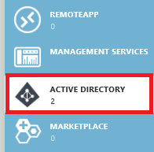

<properties
   pageTitle="Creare servizio principale nel portale | Microsoft Azure"
   description="In questo articolo viene descritto come creare una nuova applicazione di Active Directory e identità di servizio che può essere utilizzata con il controllo dell'accesso basato sui ruoli in Gestione risorse di Azure per gestire l'accesso alle risorse."
   services="azure-resource-manager"
   documentationCenter="na"
   authors="tfitzmac"
   manager="timlt"
   editor="tysonn"/>

<tags
   ms.service="azure-resource-manager"
   ms.devlang="na"
   ms.topic="article"
   ms.tgt_pltfrm="na"
   ms.workload="na"
   ms.date="09/07/2016"
   ms.author="tomfitz"/>

# Consente di creare applicazione Active Directory e identità di servizio che possono accedere alle risorse portale

> [AZURE.SELECTOR]
- [PowerShell](resource-group-authenticate-service-principal.md)
- [CLI Azure](resource-group-authenticate-service-principal-cli.md)
- [Portale](resource-group-create-service-principal-portal.md)

Quando si dispone di un'applicazione che è necessario accedere o modificare le risorse, è necessario configurare un'applicazione di Active Directory (AD) e assegnare le autorizzazioni necessarie. In questo argomento viene illustrato come eseguire questi passaggi tramite il portale. Attualmente, è necessario utilizzare il portale classico per creare una nuova applicazione di Active Directory e quindi passare al portale di Azure per assegnare un ruolo all'applicazione. 

> [AZURE.NOTE] La procedura descritta in questo argomento vengono applicate solo quando si usa il **portale classico** per creare l'applicazione di Active Directory. **Se si usa il portale di Azure per creare l'applicazione di Active Directory, la procedura seguente non è riuscita.** 
>
> Potrebbe essere più semplice impostare l'applicazione di Active Directory e servizio principale tramite [PowerShell](resource-group-authenticate-service-principal.md) o [CLI Azure](resource-group-authenticate-service-principal-cli.md), soprattutto se si desidera utilizzare un certificato per l'autenticazione. In questo argomento viene illustrato come utilizzare un certificato.

Per una spiegazione dei concetti di Active Directory, vedere [gli oggetti dell'applicazione e principale del servizio](./active-directory/active-directory-application-objects.md). Per ulteriori informazioni sull'autenticazione Active Directory, vedere [Scenari di autenticazione per Azure Active Directory](./active-directory/active-directory-authentication-scenarios.md).

Per informazioni dettagliate sull'integrazione di un'applicazione in Azure per la gestione delle risorse, vedere [la Guida per gli sviluppatori di autorizzazione con l'API di gestione risorse Azure](resource-manager-api-authentication.md).

## Creare un'applicazione di Active Directory

1. Accedere al proprio Account Azure tramite il [portale classica](https://manage.windowsazure.com/). 

2. Verificare che si conosce il valore predefinito di Active Directory per l'abbonamento. È solo possibile concedere l'accesso per le applicazioni nella stessa directory l'abbonamento. Selezionare **Impostazioni** e cercare il nome della directory associato all'abbonamento.  Per ulteriori informazioni, vedere [come Azure sottoscrizioni associate Azure Active Directory](./active-directory/active-directory-how-subscriptions-associated-directory.md).
   
     

2. Selezionare **Active Directory** dal riquadro di sinistra.

     
     
3. Selezionare il servizio Active Directory che si desidera utilizzare per la creazione dell'applicazione. Se si dispone di più Active Directory, creare l'applicazione nella directory predefinita per l'abbonamento.   

     
     
3. Per visualizzare le applicazioni nella directory, selezionare **applicazioni**.

     

4. Se è stata creata un'applicazione all'interno della directory prima, è necessario verificare sarà simile alla figura seguente. Selezionare **Aggiungi un'applicazione**

     

     In alternativa, fare clic su **Aggiungi** nel riquadro inferiore.

     

5. Selezionare il tipo di applicazione che si desidera creare. Per questa esercitazione, selezionare **Aggiungi un'applicazione di sviluppo di organizzazione**. 

     

6. Specificare un nome per l'applicazione e selezionare il tipo di applicazione che si desidera creare. Per questa esercitazione, creare un' **API WEB e/o di applicazione WEB** e fare clic sul pulsante Avanti. Se si seleziona **Applicazione CLIENT NATIVA**, i passaggi rimanenti di questo articolo non corrisponderanno l'esperienza dell'utente.

     

7. Compilare le proprietà per un'app. Per **Accedere via URL**, fornire URI a un sito web che descrive l'applicazione. Non viene convalidata l'esistenza del sito web. Per **APP ID URI**, fornire URI che identifica l'applicazione.

     

È stato creato l'applicazione.

## Ottenere client chiave id e l'autenticazione

Quando si accede a livello di programmazione, è necessario l'id dell'applicazione. Se l'applicazione viene eseguita con le proprie credenziali, è necessario anche una chiave di autenticazione.

1. Selezionare la scheda **Configura** per configurare la password dell'applicazione.

     

2. Copiare l' **ID CLIENT**.
  
     

3. Se l'applicazione viene eseguita con le proprie credenziali, scorrere fino alla sezione **chiavi** e selezionare quanto tempo si preferisce la password siano validi.

     

4. Selezionare **Salva** per creare la chiave.

     

     Viene visualizzata la chiave salvata ed è possibile copiare. Non si è possibile recuperare la chiave in un secondo momento così copia adesso.

     

## Utilizzo di id tenant

Quando si accede a livello di programmazione, è necessario passare l'id tenant con la richiesta di autenticazione. Per le applicazioni Web e API Web Apps, è possibile recuperare l'id tenant selezionando **i punti finali visualizzazione** nella parte inferiore dello schermo e il recupero id come illustrato nell'immagine seguente.  

   

È inoltre possibile recuperare l'id tenant tramite PowerShell:

    Get-AzureRmSubscription

In alternativa, CLI Azure:

    azure account show --json

## Impostare delegati le autorizzazioni

Se l'applicazione accede alle risorse per conto di un utente effettuato l'accesso, è necessario concedere l'applicazione delegare l'autorizzazione per accedere altre applicazioni. Questo accesso nella sezione **autorizzazioni per le altre applicazioni** della scheda **Configura** . Per impostazione predefinita, un'autorizzazione delegata è già abilitata per Azure Active Directory. Lasciare questa autorizzazione delegata invariata.

1. Selezionare **Aggiungi applicazione**.

2. Nell'elenco, selezionare l' **API di gestione del servizio di Windows Azure**. Selezionare l'icona di completamento.

      

3. Nell'elenco a discesa per le autorizzazioni delegate, selezionare **Accesso Azure servizio di gestione come organizzazione**.

      

4. Salvare le modifiche.

## Assegnare un'applicazione di ruolo

Se l'applicazione è in esecuzione con le proprie credenziali, è necessario assegnare un'applicazione di un ruolo. Decidere quale ruolo rappresenta le autorizzazioni necessarie per l'applicazione. Per informazioni sui ruoli disponibili, vedere [RBAC: integrato in ruoli](./active-directory/role-based-access-built-in-roles.md). 

Per assegnare un ruolo a un'applicazione, è necessario disporre delle autorizzazioni corrette. In particolare, è necessario disporre di `Microsoft.Authorization/*/Write` accesso viene concesso tramite il ruolo di [proprietario](./active-directory/role-based-access-built-in-roles.md#owner) o [Amministratore di accesso utente](./active-directory/role-based-access-built-in-roles.md#user-access-administrator) . Il ruolo di collaboratore non dispone dell'accesso corretto.

È possibile impostare l'ambito a livello della sottoscrizione, gruppo di risorse o delle risorse. Vengono ereditate inferiore livelli di ambito. Aggiunta di un'applicazione il ruolo di lettore per un gruppo di risorse, ad esempio, indica che è possibile leggere il gruppo di risorse e le risorse che contiene.

1. Per assegnare un'applicazione di un ruolo, passare al [portale di Azure](https://portal.azure.com)dal portale di classica.

1. Verificare le autorizzazioni per assicurarsi che è possibile assegnare principale del servizio a un ruolo. Selezionare **le autorizzazioni** per il proprio account.

    

1. Visualizzare le autorizzazioni assegnate per il proprio account. Come indicato in precedenza, è necessario appartengono ai ruoli proprietario o l'amministratore di accesso utente o disporre di un ruolo personalizzato che consente l'accesso di scrittura per Microsoft.Authorization. Nella figura seguente mostra un account di cui è assegnato il ruolo di collaboratore per l'abbonamento, non è autorizzazioni necessarie per l'assegnazione di un'applicazione di un ruolo.

    

     Se non si dispone delle autorizzazioni corrette per concedere l'accesso a un'applicazione, che è necessario richiedere che l'amministratore di abbonamento si aggiunge al ruolo di amministratore di accesso utente, o richiedere che un amministratore concede l'accesso all'applicazione.

1. Passare a livello dell'ambito che si desidera assegnare l'applicazione a. Per assegnare un ruolo nell'ambito dell'abbonamento, selezionare **sottoscrizioni**.

     

     Selezionare l'abbonamento specifico per assegnare un'applicazione di.

     

     Selezionare l'icona di **accesso** nell'angolo in alto a destra.

     
     
     In alternativa, per assegnare un ruolo nell'ambito del gruppo di risorse, passare a un gruppo di risorse. Selezionare **il controllo di accesso**e il gruppo delle risorse.

     

     I passaggi seguenti sono gli stessi per qualsiasi ambito.

2. Selezionare **Aggiungi**.

     

3. Selezionare il ruolo di **lettore** (o qualsiasi ruolo ricoperto dai partecipanti che si desidera assegnare l'applicazione a).

     

4. Quando viene visualizzato prima di tutto l'elenco degli utenti che è possibile aggiungere al ruolo, le applicazioni non verrà visualizzata. Verranno visualizzate solo gruppo e i relativi utenti.

     

5. Per trovare l'applicazione, è necessario cercarlo. Iniziare a digitare il nome dell'applicazione e verrà modificato l'elenco delle opzioni disponibili. Selezionare l'applicazione quando viene visualizzato nell'elenco.

     

6. Selezionare **OK** per completare l'assegnazione del ruolo. Verrà visualizzata l'applicazione nell'elenco degli impieghi assegnata a un ruolo per il gruppo di risorse.

Per ulteriori informazioni sull'assegnazione di utenti e applicazioni ai ruoli tramite il portale, vedere [le assegnazioni di ruolo usare per gestire l'accesso alle risorse dell'abbonamento Azure](role-based-access-control-configure.md#manage-access-using-the-azure-management-portal).

## Applicazioni di esempio

Le applicazioni di esempio seguente viene illustrato come eseguire l'accesso come principale del servizio.

**.NET**

- [Distribuire un SSH abilitato macchine Virtuali con un modello con .NET](https://azure.microsoft.com/documentation/samples/resource-manager-dotnet-template-deployment/)
- [Gestire le risorse Azure e gruppi di risorse con .NET](https://azure.microsoft.com/documentation/samples/resource-manager-dotnet-resources-and-groups/)

**Java**

- [Guida introduttiva di risorse - distribuire utilizzo dei modelli di gestione risorse Azure - Java](https://azure.microsoft.com/documentation/samples/resources-java-deploy-using-arm-template/)
- [Guida introduttiva di risorse - Gestione gruppo risorse - Java](https://azure.microsoft.com/documentation/samples/resources-java-manage-resource-group//)

**Python**

- [Distribuire un SSH abilitato macchine Virtuali con un modello di Python](https://azure.microsoft.com/documentation/samples/resource-manager-python-template-deployment/)
- [Gestione risorse Azure e gruppi di risorse con Python](https://azure.microsoft.com/documentation/samples/resource-manager-python-resources-and-groups/)

**Node**

- [Distribuire un SSH abilitato macchine Virtuali con un modello di Node](https://azure.microsoft.com/documentation/samples/resource-manager-node-template-deployment/)
- [Gestire le risorse Azure e gruppi di risorse con Node](https://azure.microsoft.com/documentation/samples/resource-manager-node-resources-and-groups/)

**Trascrizione**

- [Distribuire un SSH abilitato macchine Virtuali con un modello di trascrizione](https://azure.microsoft.com/documentation/samples/resource-manager-ruby-template-deployment/)
- [Gestione risorse Azure e gruppi di risorse con trascrizione](https://azure.microsoft.com/documentation/samples/resource-manager-ruby-resources-and-groups/)

## Passaggi successivi

- Per informazioni su come specificare i criteri di sicurezza, vedere [Controllo dell'accesso basato sui ruoli di Azure](./active-directory/role-based-access-control-configure.md).  
- Per una dimostrazione video di questi passaggi, vedere [Gestione di livello di programmazione per consentire di una risorsa di Azure con Azure Active Directory](https://channel9.msdn.com/Series/Azure-Active-Directory-Videos-Demos/Enabling-Programmatic-Management-of-an-Azure-Resource-with-Azure-Active-Directory).

