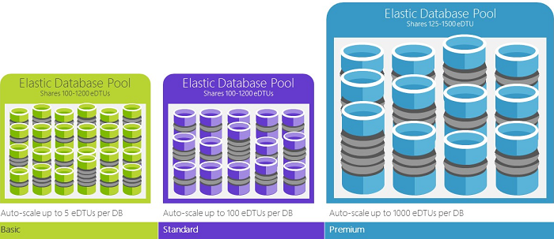

<properties
    pageTitle="Database SQL: Che cos'è un DTU? | Microsoft Azure"
    description="Informazioni sulle quali un Database di SQL Azure unità transazione è."
    keywords="opzioni di database, le prestazioni del database"
    services="sql-database"
    documentationCenter=""
    authors="CarlRabeler"
    manager="jhubbard"
    editor="CarlRabeler"/>

<tags
    ms.service="sql-database"
    ms.devlang="na"
    ms.topic="get-started-article"
    ms.tgt_pltfrm="na"
    ms.workload="NA"
    ms.date="09/06/2016"
    ms.author="carlrab"/>

# Spiegare Database transazione unità (DTUs) e flessibile Database transazione (eDTUs)

In questo articolo viene spiegato Database transazione unità (DTUs) e flessibile Database transazione unità (eDTUs) e cosa accade quando si raggiunge la massima DTUs o eDTUs.  

## Quali sono le unità di transazione di Database (DTUs)

Un DTU è un'unità di misura delle risorse che possono essere disponibili per un database di SQL Azure autonoma a un livello di prestazioni specifici all'interno di un [livello di servizio autonomo database](sql-database-service-tiers.md#standalone-database-service-tiers-and-performance-levels). Un DTU è una misura fusione di CPU, memoria e dati i/o e i/o log transazione in un rapporto definito da un carico di lavoro benchmark OLTP progettata per essere tipiche dei carichi di lavoro OLTP reali. Raddoppiare il DTUs aumentando il livello di prestazioni di un database equivale a raddoppiare l'insieme di risorse disponibili per tale database. Ad esempio, un database P11 Premium con 1750 DTUs fornisce 350 x DTU ulteriori calcolare power rispetto a un database di base con 5 DTUs. Per comprendere la metodologia dietro il carico di lavoro benchmark OLTP utilizzata per determinare la sfumatura DTU, vedere [Panoramica sul benchmark di Database SQL](sql-database-benchmark-overview.md).

È possibile [modificare i livelli di servizio](sql-database-scale-up.md) in qualsiasi momento con tempi di inattività minimi per l'applicazione (in genere il calcolo della media in quattro secondi). Per molti imprese e App, la possibilità di creare database e comporre le prestazioni del database singolo verso l'alto o verso il basso su richiesta è sufficiente, soprattutto se criteri di utilizzo sono relativamente prevedibili. Ma se si dispone di modelli di utilizzo imprevisti, è possibile renderla difficile da gestire i costi e il modello aziendale. In questo scenario si utilizza un pool flessibile con un determinato numero di eDTUs.

## Quali sono le unità transazione Database flessibile (eDTUs)

Un eDTU è un'unità di misura del set di risorse (DTUs) che possono essere condivisi tra un insieme di database in un server SQL Azure - definito un [pool di flessibile](sql-database-elastic-pool.png). Pool flessibile offrono una semplice soluzione conveniente per gestire gli obiettivi delle prestazioni per più database che ampiamente diverse e modelli di utilizzo imprevisti. Vedere [pool flessibile e livelli di servizio](sql-database-service-tiers.md#elastic-pool-service-tiers-and-performance-in-edtus) per ulteriori informazioni.

Un pool viene assegnato un numero prestabilito di eDTUs per un determinato prezzo. All'interno del pool singoli database figurano della flessibilità necessaria per il ridimensionamento automatico all'interno di impostare i parametri. In condizioni di carico elevato, un database può richiedere più eDTUs per soddisfare la domanda. Database carichi light occupano minore e database in condizioni di carico non utilizzano alcun eDTUs. Il provisioning di risorse per l'intero pool anziché per singoli database consente di semplificare le attività di gestione. Inoltre, si dispone di un budget prevedibile per il pool.

EDTUs aggiuntivi possono essere aggiunti a un pool esistente con il tempo di inattività alcun database o alcun effetto sui database nel pool di flessibile. Analogamente, se eDTUs aggiuntivi non sono più necessari e possono essere rimossi da un pool esistente in qualsiasi punto nel tempo. È possibile aggiungere o sottrarre database al pool. Se un database è prevedibili in utilizza risorse, spostarla al.

## Come è possibile determinare il numero di DTUs necessari per il carico di lavoro?

Se si desidera utilizzare per eseguire la migrazione esistente locale o SQL Server macchina virtuale il carico di lavoro al Database SQL Azure, è possibile utilizzare la [Calcolatrice DTU](http://dtucalculator.azurewebsites.net/) per l'arrotondamento il numero di DTUs necessari. Per un carico di Database SQL Azure, è possibile utilizzare [SQL Database Query prestazioni informazioni](sql-database-query-performance.md) per comprendere il consumo di risorse database (DTUs) per ottenere approfondita come ottimizzare il carico di lavoro. È anche possibile usare [sys.dm_db_ resource_stats](https://msdn.microsoft.com/library/dn800981.aspx) DMV per ottenere informazioni sul consumo delle risorse per un'ora ultima. In alternativa, la visualizzazione di catalogo [sys.resource_stats](http://msdn.microsoft.com/library/dn269979.aspx) possibile anche eseguire una query per ottenere gli stessi dati per gli ultimi 14 giorni, anche se in una fedeltà inferiore delle medie di cinque minuti.

## Come sapere se è possibile trarre vantaggio da un pool di risorse flessibile?

Pool sono adatti per un numero elevato di database con i modelli di utilizzo specifico. Per un determinato database, questo modello è caratterizzato da basso utilizzo medio con picchi utilizzo relativamente poco frequenti. Database SQL automaticamente valuta utilizzo delle risorse nella cronologia del database in un server di Database SQL esistente e consiglia la configurazione del pool appropriate nel portale di Azure. Per ulteriori informazioni, vedere [quando deve essere utilizzato un pool di database flessibile?](sql-database-elastic-pool-guidance.md)

## Cosa accade quando raggiunge la massima DTUs

Livelli di prestazioni sono tarati e regolati per fornire le risorse necessarie per eseguire il carico di lavoro di database entro i limiti massimo consentito per il livello di livello/prestazioni servizio selezionato. Se il carico di lavoro è raggiungere i limiti in uno dei limiti CPU/dati IO/Log IO, continuare a ricevere le risorse al massimo consentito livello, ma si è probabile che vengano visualizzati maggiore latenza per le query. Questi limiti non vengano eventuali errori, ma un rallentamento del carico di lavoro, a meno che non rallentamento diventa grave in modo che le query iniziare intervallo. Se si raggiunge limiti di richieste di tipo/sessioni utente simultanee consentite massimo (thread), si noterà errori espliciti. Vedere [limiti delle risorse di Database SQL Azure](sql-database-resource-limits.md) per informazioni sul limite di risorse ad eccezione della CPU, memoria, dati i/o e i/o registro delle transazioni.

## Passaggi successivi

- Per informazioni sul DTUs ed eDTUs disponibile per i database autonomo e per i pool flessibile, vedere [livelli di servizio](sql-database-service-tiers.md) .
- Vedere [limiti delle risorse di Database SQL Azure](sql-database-resource-limits.md) per informazioni sul limite di risorse ad eccezione della CPU, memoria, dati i/o e i/o registro delle transazioni.
- Vedere [SQL Database Query prestazioni informazioni](sql-database-query-performance.md) per comprendere il consumo (DTUs).
- Vedere [Panoramica di Database SQL di benchmark](sql-database-benchmark-overview.md) per comprendere la metodologia dietro il carico di lavoro benchmark OLTP utilizzata per determinare la sfumatura DTU.