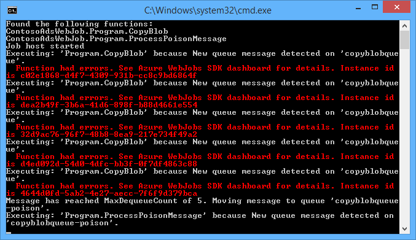
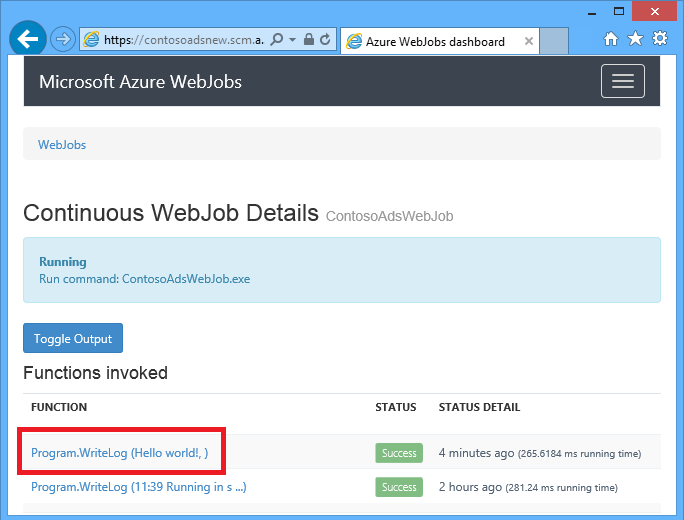

<properties
    pageTitle="Guida introduttiva di archiviazione di coda e Visual Studio connessi servizi (WebJob progetti) | Microsoft Azure"
    description="Come iniziare a utilizzare lo spazio di archiviazione di Azure coda in un progetto di WebJob dopo la connessione a un account di archiviazione tramite Visual Studio connessione servizi."
    services="storage"
    documentationCenter=""
    authors="TomArcher"
    manager="douge"
    editor=""/>

<tags
    ms.service="storage"
    ms.workload="web"
    ms.tgt_pltfrm="vs-getting-started"
    ms.devlang="na"
    ms.topic="article"
    ms.date="07/18/2016"
    ms.author="tarcher"/>

# Guida introduttiva di Azure coda archiviazione e Visual Studio connessi servizi (WebJob progetti)

[AZURE.INCLUDE [storage-try-azure-tools-queues](../../includes/storage-try-azure-tools-queues.md)]

## Panoramica

Questo articolo descrive come iniziare a utilizzare lo spazio di archiviazione di Azure coda in un progetto di Visual Studio Azure WebJob dopo aver creato o si fa riferimento un account di archiviazione Azure tramite la finestra di dialogo Visual Studio **Aggiungere servizi connessi** . Quando si aggiunge un account di archiviazione a un progetto WebJob utilizzando la finestra di dialogo di Visual Studio **Aggiungere servizi connessi** , siano installati i pacchetti di Azure archiviazione NuGet appropriati, i riferimenti .NET appropriati vengono aggiunti al progetto e stringhe di connessione per l'account di archiviazione vengono aggiornate nel file app.  

Questo articolo vengono forniti esempi di codice c# che illustrano come usare la versione di Azure WebJobs SDK 1. x con il servizio di archiviazione di Azure coda.

Lo spazio di archiviazione di Azure coda è un servizio per l'archiviazione di un numero elevato di messaggi accessibili da qualsiasi punto del mondo tramite chiamate autenticate con HTTP o HTTPS. Un messaggio di coda singola può contenere fino a 64 KB e una coda può contenere milioni di messaggi, fino al limite di capacità totale di un account di archiviazione. Per ulteriori informazioni, vedere [Guida introduttiva allo spazio di archiviazione di Azure coda utilizzando .NET](storage-dotnet-how-to-use-queues.md) . Per ulteriori informazioni su ASP.NET, vedere [ASP.NET](http://www.asp.net).

## Procedura di attivazione di una funzione quando si riceve un messaggio di coda

Per scrivere una funzione che SDK WebJobs chiama quando si riceve un messaggio di coda, utilizzare l'attributo **QueueTrigger** . Costruttore dell'attributo accetta un parametro stringa che specifica il nome della coda al sondaggio. Per informazioni su come impostare il nome della coda in modo dinamico, vedere [come impostare le opzioni di configurazione](#how-to-set-configuration-options).

### Messaggi stringa

Nell'esempio seguente la coda contiene un messaggio di stringa, in modo **QueueTrigger** viene applicato a un parametro stringa denominato **logMessage** che contiene il contenuto del messaggio coda. La funzione [scrive un messaggio di log al dashboard](#how-to-write-logs).

        public static void ProcessQueueMessage([QueueTrigger("logqueue")] string logMessage, TextWriter logger)
        {
            logger.WriteLine(logMessage);
        }

Oltre a **stringa**, il parametro può essere una matrice di byte, un oggetto **CloudQueueMessage** o un POCO definite dall'utente.

### POCO [(normale oggetto CLR precedente](http://en.wikipedia.org/wiki/Plain_Old_CLR_Object)) Accoda i messaggi

Nell'esempio seguente, il messaggio coda contiene JSON per un oggetto **BlobInformation** che include una proprietà **BlobName** . SDK deserializza automaticamente l'oggetto.

        public static void WriteLogPOCO([QueueTrigger("logqueue")] BlobInformation blobInfo, TextWriter logger)
        {
            logger.WriteLine("Queue message refers to blob: " + blobInfo.BlobName);
        }

SDK utilizza il [pacchetto Newtonsoft.Json NuGet](http://www.nuget.org/packages/Newtonsoft.Json) per serializzare e deserializzare i messaggi. Se si creano messaggi coda in un programma che non utilizza SDK WebJobs, è possibile scrivere codice simile a quello riportato di seguito per creare un messaggio di coda POCO che consente di analizzare il SDK.

        BlobInformation blobInfo = new BlobInformation() { BlobName = "log.txt" };
        var queueMessage = new CloudQueueMessage(JsonConvert.SerializeObject(blobInfo));
        logQueue.AddMessage(queueMessage);

### Funzioni asincrone

Le seguenti asincrone funzione [scrive un file di log al dashboard](#how-to-write-logs).

        public async static Task ProcessQueueMessageAsync([QueueTrigger("logqueue")] string logMessage, TextWriter logger)
        {
            await logger.WriteLineAsync(logMessage);
        }

Funzioni asincrone potrebbero richiedere un [token di annullamento](http://www.asp.net/mvc/overview/performance/using-asynchronous-methods-in-aspnet-mvc-4#CancelToken), come illustrato nell'esempio seguente, che consente di copiare un blob. (Per una spiegazione del segnaposto **queueTrigger** , vedere la sezione [BLOB](#how-to-read-and-write-blobs-and-tables-while-processing-a-queue-message) ).

        public async static Task ProcessQueueMessageAsyncCancellationToken(
            [QueueTrigger("blobcopyqueue")] string blobName,
            [Blob("textblobs/{queueTrigger}",FileAccess.Read)] Stream blobInput,
            [Blob("textblobs/{queueTrigger}-new",FileAccess.Write)] Stream blobOutput,
            CancellationToken token)
        {
            await blobInput.CopyToAsync(blobOutput, 4096, token);
        }

## L'attributo QueueTrigger funziona con i tipi di

È possibile utilizzare **QueueTrigger** con i tipi seguenti:

* **stringa**
* Un tipo di POCO serializzato come JSON
* **byte**
* **CloudQueueMessage**

## Algoritmo di polling

SDK implementato un casuale esponenziale back-off algoritmo per ridurre l'effetto di inattività coda polling sui costi transazione lo spazio di archiviazione.  Quando un messaggio viene trovato, il SDK due secondi di attesa e quindi verifica la presenza di un altro messaggio; Quando viene trovato alcun messaggio è in attesa di quattro secondi prima di riprovare. Al termine di successivi tentativi di riceve un messaggio di coda, il tempo di attesa continua ingrandire le dimensioni fino a raggiungere il tempo di attesa massimo, che per impostazione predefinita a un minuto. [Il tempo di attesa massimo può essere configurato](#how-to-set-configuration-options).

## Più istanze

Se l'applicazione web viene eseguito su più istanze, un WebJobs continuo viene eseguito in tutti i computer e ogni computer verranno attendere trigger e tenta di eseguire funzioni. In alcuni casi che questo può comportare alcune funzioni elaborazione due volte gli stessi dati in modo funzioni devono essere idempotenti (scritto in modo da chiamare più volte con gli stessi dati di input non produce risultati duplicati).  

## Esecuzione in parallelo

Se si dispone di più funzioni in ascolto code diverse, SDK eseguiranno una chiamata loro in parallelo ricezione dei messaggi contemporaneamente.

Lo stesso avviene alla ricezione di più messaggi per una singola coda. Per impostazione predefinita, il SDK Ottiene un batch di 16 messaggi contemporaneamente ed esegue la funzione che li elabora in parallelo. [Sono possibile configurare le dimensioni del batch](#how-to-set-configuration-options). Quando il numero in fase di elaborazione Ottiene verso il basso a metà della dimensione del batch, SDK Ottiene un altro batch e avvia l'elaborazione dei messaggi. Di conseguenza il numero massimo di messaggi simultanei elaborati per ogni funzione è pari a una volta e mezza la dimensione del batch. Questo limite riguarda separatamente per ogni funzione che ha un attributo **QueueTrigger** . Se non si vuole esecuzione parallela per i messaggi ricevuti in un'unica coda, impostare le dimensioni del batch su 1.

## Ottenere coda o coda messaggio metadati

È possibile ottenere le seguenti proprietà del messaggio mediante l'aggiunta di parametri per la firma del metodo:

* ExpirationTime **DateTimeOffset**
* **DateTimeOffset** insertionTime
* **DateTimeOffset** nextVisibleTime
* queueTrigger **stringa** (contiene il testo del messaggio)
* id **stringa**
* popReceipt di **stringa**
* **int** dequeueCount

Se si desidera utilizzare direttamente l'API dello spazio di archiviazione di Azure, è anche possibile aggiungere un parametro **CloudStorageAccount** .

Nell'esempio seguente scrive tutti i metadati di un file di registro dell'applicazione. Nell'esempio logMessage e queueTrigger il contenuto del messaggio coda.

        public static void WriteLog([QueueTrigger("logqueue")] string logMessage,
            DateTimeOffset expirationTime,
            DateTimeOffset insertionTime,
            DateTimeOffset nextVisibleTime,
            string id,
            string popReceipt,
            int dequeueCount,
            string queueTrigger,
            CloudStorageAccount cloudStorageAccount,
            TextWriter logger)
        {
            logger.WriteLine(
                "logMessage={0}\n" +
            "expirationTime={1}\ninsertionTime={2}\n" +
                "nextVisibleTime={3}\n" +
                "id={4}\npopReceipt={5}\ndequeueCount={6}\n" +
                "queue endpoint={7} queueTrigger={8}",
                logMessage, expirationTime,
                insertionTime,
                nextVisibleTime, id,
                popReceipt, dequeueCount,
                cloudStorageAccount.QueueEndpoint,
                queueTrigger);
        }

Ecco un file di log di esempio scritto dal codice di esempio:

        logMessage=Hello world!
        expirationTime=10/14/2014 10:31:04 PM +00:00
        insertionTime=10/7/2014 10:31:04 PM +00:00
        nextVisibleTime=10/7/2014 10:41:23 PM +00:00
        id=262e49cd-26d3-4303-ae88-33baf8796d91
        popReceipt=AgAAAAMAAAAAAAAAfc9H0n/izwE=
        dequeueCount=1
        queue endpoint=https://contosoads.queue.core.windows.net/
        queueTrigger=Hello world!

## Arresto normale

Una funzione che viene eseguita in un WebJob continuo possa accettare un parametro **CancellationToken** che consente al sistema operativo ricevere una notifica della funzione quando il WebJob sta per essere terminate. È possibile utilizzare questa notifica per assicurarsi che la funzione non termina in modo imprevisto in modo da lascia dati incoerente.

Nell'esempio seguente viene illustrato come verificare la presenza di imminente terminazione WebJob in una funzione.

    public static void GracefulShutdownDemo(
                [QueueTrigger("inputqueue")] string inputText,
                TextWriter logger,
                CancellationToken token)
    {
        for (int i = 0; i < 100; i++)
        {
            if (token.IsCancellationRequested)
            {
                logger.WriteLine("Function was cancelled at iteration {0}", i);
                break;
            }
            Thread.Sleep(1000);
            logger.WriteLine("Normal processing for queue message={0}", inputText);
        }
    }

**Nota:** Dashboard di potrebbe non essere visualizzati correttamente lo stato e l'output di funzioni che è stato chiuso.

Per ulteriori informazioni, vedere [WebJobs spegnimento](http://blog.amitapple.com/post/2014/05/webjobs-graceful-shutdown/#.VCt1GXl0wpR).   

## Come creare un messaggio di coda durante l'elaborazione di un messaggio di coda

Per scrivere una funzione che crea un nuovo messaggio, utilizzare l'attributo **coda** . Come **QueueTrigger**, si passa il nome di coda come stringa oppure è possibile [impostare il nome della coda in modo dinamico](#how-to-set-configuration-options).

### Messaggi stringa

Non asincrono nell'esempio seguente viene creato un nuovo messaggio nella coda denominata "outputqueue" con lo stesso contenuto del messaggio di coda ricevuto nella coda denominata "inputqueue". (Per asincrono utilizzano funzioni **IAsyncCollector<T> ** come illustrato più avanti in questa sezione.)

        public static void CreateQueueMessage(
            [QueueTrigger("inputqueue")] string queueMessage,
            [Queue("outputqueue")] out string outputQueueMessage )
        {
            outputQueueMessage = queueMessage;
        }

### POCO [(normale oggetto CLR precedente](http://en.wikipedia.org/wiki/Plain_Old_CLR_Object)) Accoda i messaggi

Per creare un messaggio di coda che contiene un POCO anziché una stringa, passare il tipo POCO come un parametro di output al costruttore dell'attributo **coda** .

        public static void CreateQueueMessage(
            [QueueTrigger("inputqueue")] BlobInformation blobInfoInput,
            [Queue("outputqueue")] out BlobInformation blobInfoOutput )
        {
            blobInfoOutput = blobInfoInput;
        }

il SDK serializza automaticamente l'oggetto JSON. Un messaggio di coda viene sempre creato, anche se l'oggetto è null.

### Creare più messaggi o nelle funzioni asincrone

Per creare più messaggi, verificare il tipo di parametro per coda di output **ICollector<T> ** o **IAsyncCollector<T>**, come illustrato nell'esempio seguente.

        public static void CreateQueueMessages(
            [QueueTrigger("inputqueue")] string queueMessage,
            [Queue("outputqueue")] ICollector<string> outputQueueMessage,
            TextWriter logger)
        {
            logger.WriteLine("Creating 2 messages in outputqueue");
            outputQueueMessage.Add(queueMessage + "1");
            outputQueueMessage.Add(queueMessage + "2");
        }

Ogni messaggio coda viene creato immediatamente quando si chiama il metodo **Add** .

### Tipi di utilizzabile con l'attributo coda

È possibile utilizzare l'attributo **coda** sui tipi di parametro seguenti:

* **stringa** (Crea messaggio della coda se il valore del parametro non null quando la funzione termina)
* **fuori byte** (funziona come **stringa**)
* **fuori CloudQueueMessage** (funziona come **stringa**)
* **fuori POCO** (un tipo serializzabile crea un messaggio con un oggetto null, se il parametro è null quando la funzione termina)
* **ICollector**
* **IAsyncCollector**
* **CloudQueue** (per la creazione manuale di messaggi con l'API di archiviazione di Azure direttamente)

### Utilizzare gli attributi WebJobs SDK nel corpo di una funzione

Se è necessario eseguire alcune operazioni nella funzione prima di utilizzare un attributo WebJobs SDK, ad esempio **coda**, **Blob**o **tabella**, è possibile utilizzare l'interfaccia **IBinder** .

Nell'esempio seguente accetta un messaggio di input coda e crea un nuovo messaggio con lo stesso contenuto in una coda di output. Il nome della coda output viene impostato dal codice nel corpo della funzione.

        public static void CreateQueueMessage(
            [QueueTrigger("inputqueue")] string queueMessage,
            IBinder binder)
        {
            string outputQueueName = "outputqueue" + DateTime.Now.Month.ToString();
            QueueAttribute queueAttribute = new QueueAttribute(outputQueueName);
            CloudQueue outputQueue = binder.Bind<CloudQueue>(queueAttribute);
            outputQueue.AddMessage(new CloudQueueMessage(queueMessage));
        }

Interfaccia **IBinder** può essere utilizzata anche con gli attributi di **tabella** e **Blob** .

## Come leggere e scrivere BLOB e tabelle durante l'elaborazione di un messaggio di coda

Gli attributi **Blob** e **tabella** consentono di leggere e scrivere BLOB e tabelle. Negli esempi di questa sezione si applicano a BLOB. Per esempi di codice che illustrano come impostare un trigger processi quando BLOB creati o aggiornati, vedere [come utilizzare archiviazione blob Azure con SDK WebJobs](../app-service-web/websites-dotnet-webjobs-sdk-storage-blobs-how-to.md)e per esempi di codice che leggere e scrivere le tabelle, vedere [come utilizzare archiviazione tabelle Azure con SDK WebJobs](../app-service-web/websites-dotnet-webjobs-sdk-storage-tables-how-to.md).

### Stringa coda messaggi attivazione blob operazioni

Per un messaggio di coda che contiene una stringa **queueTrigger** è un segnaposto che è possibile usare nel parametro **blobPath** dell'attributo **Blob** che contiene il contenuto del messaggio.

Nell'esempio seguente usa oggetti **Stream** per leggere e scrivere BLOB. Il messaggio di coda è il nome di un blob nel contenitore textblobs. Una copia del blob con "-nuovo" aggiungere il nome viene creato nello stesso contenitore.

        public static void ProcessQueueMessage(
            [QueueTrigger("blobcopyqueue")] string blobName,
            [Blob("textblobs/{queueTrigger}",FileAccess.Read)] Stream blobInput,
            [Blob("textblobs/{queueTrigger}-new",FileAccess.Write)] Stream blobOutput)
        {
            blobInput.CopyTo(blobOutput, 4096);
        }

Costruttore dell'attributo **Blob** accetta un parametro **blobPath** che specifica il contenitore e il nome blob. Per ulteriori informazioni su questo segnaposto, vedere [come utilizzare archiviazione blob Azure con SDK WebJobs](../app-service-web/websites-dotnet-webjobs-sdk-storage-blobs-how-to.md).

Quando l'attributo aggiungono un oggetto di **flusso** , un altro costruttore parametro specifica la modalità di **FileAccess** come lettura, scrittura o lettura/scrittura.

Nell'esempio seguente viene utilizzato un oggetto **CloudBlockBlob** per eliminare un blob. Il messaggio di coda è il nome del blob.

        public static void DeleteBlob(
            [QueueTrigger("deleteblobqueue")] string blobName,
            [Blob("textblobs/{queueTrigger}")] CloudBlockBlob blobToDelete)
        {
            blobToDelete.Delete();
        }

### POCO [(normale oggetto CLR precedente](http://en.wikipedia.org/wiki/Plain_Old_CLR_Object)) Accoda i messaggi

Per POCO memorizzato come JSON nel messaggio della coda, è possibile usare i segnaposto tale proprietà di nome dell'oggetto nel parametro **blobPath** dell'attributo **coda** . È anche possibile utilizzare i nomi delle proprietà dei metadati coda come segnaposto. Vedere [ottenere coda o coda messaggio metadati](#get-queue-or-queue-message-metadata).

Nell'esempio seguente copia un blob in un nuovo blob con un'estensione diversa. Il messaggio di coda è un oggetto **BlobInformation** che include le proprietà **BlobName** e **BlobNameWithoutExtension** . I nomi delle proprietà vengono usati come segnaposto nel percorso blob degli attributi **Blob** .

        public static void CopyBlobPOCO(
            [QueueTrigger("copyblobqueue")] BlobInformation blobInfo,
            [Blob("textblobs/{BlobName}", FileAccess.Read)] Stream blobInput,
            [Blob("textblobs/{BlobNameWithoutExtension}.txt", FileAccess.Write)] Stream blobOutput)
        {
            blobInput.CopyTo(blobOutput, 4096);
        }

SDK utilizza il [pacchetto Newtonsoft.Json NuGet](http://www.nuget.org/packages/Newtonsoft.Json) per serializzare e deserializzare i messaggi. Se si creano messaggi coda in un programma che non utilizza SDK WebJobs, è possibile scrivere codice simile a quello riportato di seguito per creare un messaggio di coda POCO che consente di analizzare il SDK.

        BlobInformation blobInfo = new BlobInformation() { BlobName = "boot.log", BlobNameWithoutExtension = "boot" };
        var queueMessage = new CloudQueueMessage(JsonConvert.SerializeObject(blobInfo));
        logQueue.AddMessage(queueMessage);

Se è necessario eseguire alcune operazioni nella funzione prima di associare un blob di un oggetto, è possibile utilizzare l'attributo nel corpo della funzione, come illustrato negli [attributi SDK WebJobs utilizzare nel corpo di una funzione](#use-webjobs-sdk-attributes-in-the-body-of-a-function).

###È possibile utilizzare l'attributo Blob con i tipi di

L'attributo **Blob** può essere utilizzato con i tipi seguenti:

* **Flusso** (leggere o scrivere, specificato utilizzando il parametro di costruttore FileAccess)
* **TextReader**
* **TextWriter**
* **stringa** (sola lettura)
* **stringa** (scrivere; crea un blob solo se il parametro stringa non null quando la funzione restituisce)
* POCO (lettura)
* fuori POCO (scrivere; sempre creato un blob, come oggetto null se POCO parametro è null quando la funzione restituisce)
* **CloudBlobStream** (scrittura)
* **ICloudBlob** (lettura o scrittura)
* **CloudBlockBlob** (lettura o scrittura)
* **CloudPageBlob** (lettura o scrittura)

##Come gestire i messaggi danneggiati

Messaggi il cui contenuto genera una funzione non viene eseguita sono denominati *messaggi danneggiati*. Quando la funzione non riesce, il messaggio di coda non viene eliminato e infine acquisito nuovamente causa il ciclo da ripetere. SDK possibile interrompere automaticamente il ciclo dopo un numero limitato di iterazioni oppure è possibile eseguire manualmente.

### Gestione automatica dei messaggi

SDK eseguiranno una chiamata una funzione un massimo di 5 ore per l'elaborazione di un messaggio di coda. Se il quinto tentativo non riesce, il messaggio viene spostato a una coda danneggiata. È possibile vedere come configurare il numero massimo di tentativi in [come impostare le opzioni di configurazione](#how-to-set-configuration-options).

Coda danneggiata, denominata *{originalqueuename}*-danneggiato. È possibile scrivere è necessaria una funzione per elaborare i messaggi dalla coda danneggiata registrazione loro o inviando il file una notifica che attenzione manuale.

Nell'esempio seguente **CopyBlob** funzione avrà esito negativo quando un messaggio di coda contiene il nome di un blob che non esiste. In questo caso, il messaggio viene spostato dalla coda copyblobqueue coda veleno copyblobqueue. **ProcessPoisonMessage** quindi registrare il messaggio danneggiato.

        public static void CopyBlob(
            [QueueTrigger("copyblobqueue")] string blobName,
            [Blob("textblobs/{queueTrigger}", FileAccess.Read)] Stream blobInput,
            [Blob("textblobs/{queueTrigger}-new", FileAccess.Write)] Stream blobOutput)
        {
            blobInput.CopyTo(blobOutput, 4096);
        }

        public static void ProcessPoisonMessage(
            [QueueTrigger("copyblobqueue-poison")] string blobName, TextWriter logger)
        {
            logger.WriteLine("Failed to copy blob, name=" + blobName);
        }

L'illustrazione seguente mostra l'output console queste funzioni durante l'elaborazione di un messaggio danneggiato.

### Gestione manuale dei messaggi

È possibile ottenere il numero di volte in cui che un messaggio è stato selezionato per l'elaborazione mediante l'aggiunta di un parametro **int** denominato **dequeueCount** alla funzione. È quindi possibile controllare il numero di annullamento dell'accodamento nel codice della funzione ed eseguire il proprio messaggio danneggiato gestione quando il numero supera una determinata soglia, come illustrato nell'esempio seguente.

        public static void CopyBlob(
            [QueueTrigger("copyblobqueue")] string blobName, int dequeueCount,
            [Blob("textblobs/{queueTrigger}", FileAccess.Read)] Stream blobInput,
            [Blob("textblobs/{queueTrigger}-new", FileAccess.Write)] Stream blobOutput,
            TextWriter logger)
        {
            if (dequeueCount > 3)
            {
                logger.WriteLine("Failed to copy blob, name=" + blobName);
            }
            else
            {
            blobInput.CopyTo(blobOutput, 4096);
            }
        }

## Come impostare le opzioni di configurazione

È possibile utilizzare il tipo di **JobHostConfiguration** per impostare le opzioni di configurazione seguenti:

* Impostare le stringhe di connessione SDK nel codice.
* Configurare **QueueTrigger** impostazioni, ad esempio massimo dalla coda conteggio.
* Ottenere i nomi di coda dalla configurazione.

###Impostare le stringhe di connessione SDK nel codice

Impostare le stringhe di connessione SDK nel codice consente di utilizzare i proprio nomi stringa di connessione in file di configurazione o variabili di ambiente, come illustrato nell'esempio seguente.

        static void Main(string[] args)
        {
            var _storageConn = ConfigurationManager
                .ConnectionStrings["MyStorageConnection"].ConnectionString;

            var _dashboardConn = ConfigurationManager
                .ConnectionStrings["MyDashboardConnection"].ConnectionString;

            var _serviceBusConn = ConfigurationManager
                .ConnectionStrings["MyServiceBusConnection"].ConnectionString;

            JobHostConfiguration config = new JobHostConfiguration();
            config.StorageConnectionString = _storageConn;
            config.DashboardConnectionString = _dashboardConn;
            config.ServiceBusConnectionString = _serviceBusConn;
            JobHost host = new JobHost(config);
            host.RunAndBlock();
        }

### Configurare le impostazioni QueueTrigger

È possibile configurare le seguenti impostazioni che riguardano l'elaborazione del messaggio coda:

- Il numero massimo di messaggi che vengono selezionati contemporaneamente a da eseguire in parallelo (impostazione predefinita è 16).
- Il numero massimo di tentativi prima che venga inviato un messaggio di coda a una coda danneggiata (impostazione predefinita è 5).
- Il numero massimo di attesa prima di polling nuovamente quando una coda è vuota (valore predefinito è 1 minuto).

Nell'esempio seguente viene illustrato come configurare queste impostazioni:

        static void Main(string[] args)
        {
            JobHostConfiguration config = new JobHostConfiguration();
            config.Queues.BatchSize = 8;
            config.Queues.MaxDequeueCount = 4;
            config.Queues.MaxPollingInterval = TimeSpan.FromSeconds(15);
            JobHost host = new JobHost(config);
            host.RunAndBlock();
        }

### Impostare i valori per WebJobs SDK parametri di costruzione nel codice

Talvolta può essere utile specificare un nome di coda, un nome blob o un contenitore o una tabella denominarlo nel codice anziché hardcoded. È consigliabile, ad esempio, specificare il nome della coda **QueueTrigger** in una variabile di ambiente o file di configurazione.

È possibile farlo passando un oggetto **NameResolver** al tipo di **JobHostConfiguration** . Includere segnaposto speciali circondati da segni di percentuale (%)) in WebJobs SDK costruttore parametri e il codice **NameResolver** specifica i valori effettivi da utilizzare al posto di questi segnaposto.

Si supponga ad esempio, che si desidera utilizzare una coda denominata logqueuetest nell'ambiente di prova e un logqueueprod denominato nell'ambiente di produzione. Invece di un nome di coda hardcoded, si desidera specificare il nome di una voce nell'elenco **appSettings** contenenti il nome effettivo. Se la chiave **appSettings** logqueue, la funzione potrebbe essere simile al seguente.

        public static void WriteLog([QueueTrigger("%logqueue%")] string logMessage)
        {
            Console.WriteLine(logMessage);
        }

La classe **NameResolver** potrebbe quindi ottenere il nome della coda da **appSettings** come illustrato nell'esempio seguente:

        public class QueueNameResolver : INameResolver
        {
            public string Resolve(string name)
            {
                return ConfigurationManager.AppSettings[name].ToString();
            }
        }

Passare alla classe **NameResolver** all'oggetto **JobHost** come illustrato nell'esempio seguente.

        static void Main(string[] args)
        {
            JobHostConfiguration config = new JobHostConfiguration();
            config.NameResolver = new QueueNameResolver();
            JobHost host = new JobHost(config);
            host.RunAndBlock();
        }

**Nota:** Coda, tabella e i nomi di blob vengono risolti chiamata una funzione, ma i nomi dei contenitori blob vengono risolte solo all'avvio dell'applicazione. Non è possibile modificare il nome di contenitore blob durante il processo è in esecuzione.

## Come attivare manualmente una funzione

Per attivare manualmente una funzione, utilizzare il metodo **di chiamata** o **CallAsync** sull'oggetto **JobHost** e l'attributo **NoAutomaticTrigger** la funzione di, come illustrato nell'esempio seguente.

        public class Program
        {
            static void Main(string[] args)
            {
                JobHost host = new JobHost();
                host.Call(typeof(Program).GetMethod("CreateQueueMessage"), new { value = "Hello world!" });
            }

            [NoAutomaticTrigger]
            public static void CreateQueueMessage(
                TextWriter logger,
                string value,
                [Queue("outputqueue")] out string message)
            {
                message = value;
                logger.WriteLine("Creating queue message: ", message);
            }
        }

## Modalità di scrittura dei log

Dashboard di Mostra log in due posizioni: la pagina per la WebJob e della pagina per una particolare chiamata WebJob.

L'output metodi Console che si chiama una funzione o il metodo **Main ()** viene visualizzata la pagina Dashboard per la WebJob e non la pagina per una chiamata a un determinato metodo. Output dall'oggetto TextWriter ottenuta da un parametro nella firma di metodo viene visualizzato nella pagina del Dashboard per una chiamata metodo.

Output della console non è collegato a una chiamata a un determinato metodo in quanto la Console è multithread, mentre molte funzioni di processo potrebbero essere in esecuzione contemporaneamente. Per tale motivo SDK fornisce ogni chiamata di funzione con il proprio oggetto writer log univoco.

Per scrivere [i registri di analisi dell'applicazione](web-sites-dotnet-troubleshoot-visual-studio.md#logsoverview), utilizzare **console** (verranno creati i registri contrassegnati come INFO) e **Console.Error** (verranno creati registri contrassegnati come errore). In alternativa consiste nell'usare [traccia o TraceSource](http://blogs.msdn.com/b/mcsuksoldev/archive/2014/09/04/adding-trace-to-azure-web-sites-and-web-jobs.aspx), che fornisce diversi livelli di dettaglio, di avviso e critico oltre alle informazioni ed errore. Registri di analisi dell'applicazione visualizzata nei file di registro web app, tabelle Azure o BLOB Azure a seconda di come configurare un'applicazione web Azure. Come di tutti gli output Console i registri 100 applicazioni più recenti vengono visualizzate anche nella pagina del Dashboard per WebJob, non la pagina per una chiamata di funzione.

Output di console viene visualizzato nel Dashboard solo se il programma è in esecuzione in una WebJob Azure, non se il programma è in esecuzione in locale o in altri ambienti di rete.

È possibile disattivare la registrazione impostando la stringa di connessione Dashboard su null. Per ulteriori informazioni, vedere [come impostare le opzioni di configurazione](#how-to-set-configuration-options).

Nell'esempio seguente mostra diversi modi per scrivere i registri:

        public static void WriteLog(
            [QueueTrigger("logqueue")] string logMessage,
            TextWriter logger)
        {
            Console.WriteLine("Console.Write - " + logMessage);
            Console.Out.WriteLine("Console.Out - " + logMessage);
            Console.Error.WriteLine("Console.Error - " + logMessage);
            logger.WriteLine("TextWriter - " + logMessage);
        }

Dashboard di SDK WebJobs output dall'oggetto **TextWriter** viene visualizzata quando si passare alla pagina per una chiamata di funzione specifica e selezionare **Attiva/Disattiva Output**:

Dashboard di SDK WebJobs più recente 100 righe della Console output mostra la quando si passa alla pagina per WebJob (non per la chiamata di funzione) e selezionare **Attiva/Disattiva Output**.

In un WebJob continuo registri applicazioni disponibili nelle dati/processi continuo /*{webjobname}*/job_log.txt nel file system app web.

        [09/26/2014 21:01:13 > 491e54: INFO] Console.Write - Hello world!
        [09/26/2014 21:01:13 > 491e54: ERR ] Console.Error - Hello world!
        [09/26/2014 21:01:13 > 491e54: INFO] Console.Out - Hello world!

In un Azure blob l'applicazione dei registri questo aspetto: 2014-09-26T21:01:13,Information,contosoadsnew,491e54,635473620738373502,0,17404,17,Console.Write - Hello world!, 2014-09-26T21:01:13,Error,contosoadsnew,491e54,635473620738373502,0,17404,19,Console.Error - Hello world!, 2014-09-26T21:01:13,Information,contosoadsnew,491e54,635473620738529920,0,17404,17,Console.Out - Hello world!,

E in una tabella di Azure registri **console** e **Console.Error** aspetto simile al seguente:

##Passaggi successivi

In questo articolo è forniti esempi di codice che illustrano come gestire scenari comuni per l'utilizzo di code Azure. Per ulteriori informazioni su come utilizzare WebJobs Azure e SDK WebJobs, vedere [WebJobs Azure documentazione risorse](http://go.microsoft.com/fwlink/?linkid=390226).
