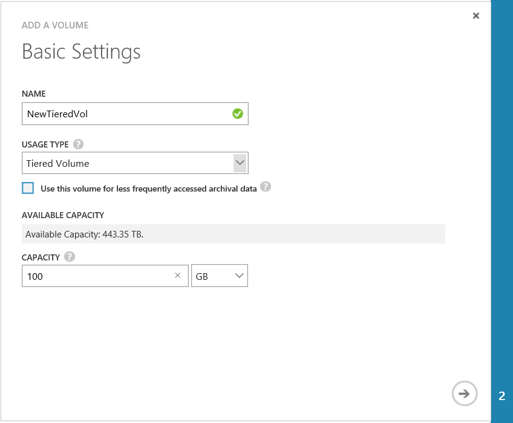

<properties
   pageTitle="La gestione dei volumi StorSimple | Microsoft Azure"
   description="Viene illustrato come aggiungere, modificare, monitorare ed eliminare volumi StorSimple e come terzi offline se necessario."
   services="storsimple"
   documentationCenter="NA"
   authors="SharS"
   manager="carmonm"
   editor="" />
<tags
   ms.service="storsimple"
   ms.devlang="NA"
   ms.topic="article"
   ms.tgt_pltfrm="NA"
   ms.workload="TBD"
   ms.date="05/11/2016"
   ms.author="v-sharos" />

# Utilizzare il servizio di gestione StorSimple per gestire i volumi

[AZURE.INCLUDE [storsimple-version-selector-manage-volumes](../../includes/storsimple-version-selector-manage-volumes.md)]

## Panoramica

In questa esercitazione viene illustrato come utilizzare il servizio di gestione StorSimple per creare e gestire i volumi sul dispositivo StorSimple e StorSimple dispositivo virtuale.

Il servizio di gestione di StorSimple è un'estensione del portale di classica Azure che consente di gestire la soluzione StorSimple da un'interfaccia web singola. Oltre a gestire i volumi, è possibile utilizzare il servizio di gestione di StorSimple per creare e gestire servizi StorSimple, visualizzare e gestire i dispositivi, visualizzare gli avvisi e consente di visualizzare e gestire i criteri di backup e il catalogo di backup.

> [AZURE.NOTE] Azure StorSimple possibile creare solo volumi eseguono provisioning. Non è possibile creare provisioning interamente o parzialmente provisioning volumi in un sistema di Azure StorSimple.
>
> Il provisioning sottile è una tecnologia di virtualizzazione in cui lo spazio di archiviazione disponibile sembra superano risorse fisiche. Anziché la prenotazione di sufficiente spazio di archiviazione in anticipo, Azure StorSimple utilizza il provisioning sottile allocare sufficiente spazio per soddisfare requisiti corrente. Natura flessibile di spazio di archiviazione cloud semplifica l'esecuzione di questo approccio perché StorSimple Azure possono aumentare o diminuire lo spazio di archiviazione cloud per soddisfare le esigenze.

## La pagina di volumi

La pagina di **volumi** consente di gestire i volumi di archiviazione che vengono effettuato il provisioning nel dispositivo, Microsoft Azure StorSimple per gli iniziatori (server). Visualizza l'elenco dei volumi nel dispositivo StorSimple.

 

Un volume è costituito da una serie di attributi:

- **Nome** : un nome descrittivo deve essere univoco, che consente di identificare il volume. Questo nome viene usato anche in rapporti di monitoring quando applica un filtro in un volume specifico.

- **Stato** : può essere online o offline. Se un volume non in linea, non è visibile ai iniziatori (server) sono autorizzati ad accedere a utilizzare il volume.

- **Capacità** : specifica la grandezza il volume sia percepita dalla iniziatore (server). Capacità specifica la quantità totale di dati che possono essere memorizzati dall'iniziatore (server). Volumi eseguono vengono effettuato il provisioning e deduplicated di dati. Questo significa che il dispositivo non pre-allocazione capacità di archiviazione fisica internamente o nel cloud in base alle capacità del volume configurato. La capacità del volume è allocata e utilizzata su richiesta.

- **Tipo** : il tipo di volume può essere a più livelli o archiviazione (a un sottotipo di livelli)

- **Access** -specifica iniziatori (server) sono autorizzati ad accedere a questo volume. Iniziatori che non appartengono a record di controllo di accesso (ACR) associato il volume non verranno visualizzato il volume.

- **Monitoraggio** – specifica o meno da monitorare un volume. Un volume avrà monitoraggio attivata per impostazione predefinita quando viene creato. Monitoraggio verrà, tuttavia, essere disabilitata per un duplicato volume. Per attivare il monitoraggio per un volume, seguire le istruzioni in Monitor di un volume.

Le attività più comuni associate a un volume sono:

- Aggiungere un volume
- Modificare un volume
- Eliminare un volume
- Disconnettere un volume
- Monitorare un volume

## Aggiungere un volume

Durante la distribuzione della soluzione StorSimple è stato [creato un volume](storsimple-deployment-walkthrough-u1.md#step-6-create-a-volume) . Aggiunta di un volume è una procedura simile.

### Per aggiungere un volume

1. Nella pagina **dispositivi** selezionare il dispositivo, fare doppio clic su esso e quindi fare clic sulla scheda **Contenitori Volume** .

2. Selezionare un contenitore di volume e fare clic sulla freccia nella riga corrispondente per accedere a volumi associati al contenitore.

3. Fare clic su **Aggiungi** nella parte inferiore della pagina. Aggiungere un volume viene avviata.

     

4. Nella casella Aggiungi una procedura guidata volume, in **Impostazioni di base**, eseguire le operazioni seguenti:

  1. Specificare un **nome** per il volume.
  2. Specificare la **Capacità viene completato il provisioning** per il volume in GB o TB. La capacità deve essere compreso tra 1 GB e TB 64 di un dispositivo fisico. La capacità massima viene completato il provisioning di un volume su un dispositivo virtuale StorSimple è 30 TB.
  3. Selezionare il **Tipo di utilizzo** per il volume. Se si utilizza il volume a più livelli di archiviazione dati, selezionare la casella di controllo **Usa il volume per meno frequente dati archiviazione** diventa la dimensione del blocco deduplication per il volume 512 KB. Se non si seleziona questa opzione, il volume corrispondente a più livelli utilizzerà una dimensione di blocco di 64 KB. Una dimensione maggiore per il blocco deduplication consente il dispositivo per accelerare il trasferimento di dati di archiviazione di grandi dimensioni nel cloud. (Volumi a più livelli in precedenza chiamati volumi primari).
  5. Fare clic sull'icona freccia per passare alla pagina **Impostazioni aggiuntive** .

        

5. In **Impostazioni aggiuntive**, aggiungere un nuovo record di controllo di accesso (ACR):

  1. Selezionare un record di controllo di accesso (ACR) dall'elenco a discesa. In alternativa, è possibile aggiungere un nuovo ACR. ACRs determinano quali host può accedere ai volumi mediante corrispondente all'host IQN con quello elencato nel record.
  2. È consigliabile attivare una copia di backup predefinito selezionando la casella di controllo **attiva una copia di backup predefinito per il volume** .
   3. Fare clic sull'icona di controllo  Per creare il volume con le impostazioni specificate.

È ora possibile utilizzare il nuovo volume.

## Modificare un volume

Modificare un volume quando è necessario per espanderla o modificare gli host che accedere al volume.

> [AZURE.IMPORTANT]
>
> - Se si modifica la dimensione del volume sul dispositivo, la dimensione del volume deve essere modificata nell'host anche.
> - Lato host procedure descritte di seguito sono per Windows Server 2012 (2012R2). Procedure per Linux o altri sistemi operativi host sono diverse. Quando si modifica il volume su un host con altri sistemi operativi, consultare le istruzioni del sistema operativo host.

### Per modificare un volume

1. Nella pagina **dispositivi** selezionare il dispositivo, fare doppio clic su esso e quindi fare clic sulla scheda **Volume contenitore** . Questa pagina sono elencati sotto forma di tutti i contenitori volume associati al dispositivo.

2. Selezionare un contenitore di volume e fare clic su esso per visualizzare l'elenco di tutti i volumi all'interno del contenitore.

3. Nella pagina **volumi** selezionare un volume e fare clic su **Modifica**.

4. Nella creazione guidata volume modifica, in **Impostazioni di base**, è possibile eseguire le operazioni seguenti:

  - Modificare il **nome** e **tipo** se si desidera modificare un volume a più livelli in un volume archiviazione selezionando la casella di controllo **utilizzare questo volume per meno dati archiviazione frequentemente** per modificare la dimensione del blocco deduplication per il volume a 512 KB.
  - Aumentare la **capacità di provisioning**. Solo è possibile aumentare la **Capacità viene completato il provisioning** . È possibile ridurre un volume dopo averlo creato.

    > [AZURE.NOTE] Non è possibile modificare il contenitore volume dopo l'assegnazione a un volume.

5. In **Impostazioni aggiuntive**, è possibile eseguire le operazioni seguenti:

  - Modificare ACRs, a condizione che il volume sia offline. Se il volume è online, è necessario disconnettere prima di tutto. Prima di modificare il ACR, consultare la procedura descritta in [eseguire un volume offline](#take-a-volume-offline) .
  - Modificare l'elenco di ACRs dopo il volume è offline.

    > [AZURE.NOTE] Non è possibile modificare l'opzione **attiva una copia di backup predefinito per il volume specificato** per il volume.

6. Salvare le modifiche facendo clic sull'icona di controllo . Il portale classico Azure verrà visualizzato un messaggio di volume aggiornamento. È verrà visualizzato un messaggio di conferma quando il volume è stato aggiornato.

7. Se si espandono un volume, completare la procedura seguente sul computer host Windows:

   1. Passare a **Gestione Computer** ->**Gestione disco**.
   2. Il pulsante destro **Del disco** e selezionare **Ripeti analisi dischi**.
   3. Nell'elenco dei dischi, selezionare il volume è aggiornato, pulsante destro del mouse e quindi selezionare **Estendi Volume**. Verrà avviata la procedura guidata Estendi Volume. Fare clic su **Avanti**.
   4. Completare la procedura guidata accettare i valori predefiniti. Al termine della procedura, il volume deve essere visualizzata l'aumento delle dimensioni.

 **Video disponibile**

Per guardare un video che illustra come espandere un volume, fare clic [qui](https://azure.microsoft.com/documentation/videos/expand-a-storsimple-volume/).

## Disconnettere un volume

Potrebbe essere necessario disconnettere un volume quando si prevede di modificarlo o eliminarlo. Quando un volume è offline, non è disponibile per l'accesso in lettura / scrittura. È necessario eseguire il volume non in linea nell'host oltre che nel dispositivo. Eseguire i passaggi seguenti per disconnettere un volume.

### Per disconnettere un volume

1. Assicurarsi che il volume in questione non sia in uso prima di portare non in linea.

2. Richiedere il volume non in linea nell'host prima. Per evitare qualsiasi rischio di danneggiamento dei dati del volume. Per istruzioni specifiche, vedere le istruzioni per il sistema operativo host.

3. Dopo l'host è offline, richiedere il volume sul dispositivo non in linea eseguendo la procedura seguente:

  1. Nella pagina **dispositivi** selezionare il dispositivo, fare doppio clic su esso e quindi fare clic sulla scheda **Contenitori Volume** . Nella scheda **Volume contenitori** sono elencati sotto forma di tutti i contenitori volume associati al dispositivo.
  2. Selezionare un contenitore di volume e fare clic su esso per visualizzare l'elenco di tutti i volumi all'interno del contenitore.
  3. Selezionare un volume e fare clic su **non in linea**.
  4. Quando viene richiesto di confermare l'operazione, fare clic su **Sì**. Il volume dovrebbe ora essere offline.

    Dopo avere inserito un volume non in linea, diventa disponibile l'opzione **In linea** .

> [AZURE.NOTE] Il comando **Non in linea** invia una richiesta al dispositivo per disconnettere il volume. Se host siano ancora usando il volume, il risultato è interrotta connessioni, ma disconnettere il volume non avrà esito negativo.

## Eliminare un volume

> [AZURE.IMPORTANT] È possibile eliminare un volume solo se è in linea.

Completare la procedura seguente per eliminare un volume.

### Per eliminare un volume

1. Nella pagina **dispositivi** selezionare il dispositivo, fare doppio clic su esso e quindi fare clic sulla scheda **Contenitori Volume** .

2. Selezionare il contenitore volume che contiene il volume che si desidera eliminare. Fare clic sul contenitore di volume per accedere alla pagina di **volumi** .

3. Tutti i volumi associati a questo contenitore vengono visualizzati in formato tabulare. Controllare lo stato del volume che si desidera eliminare. Se il volume che si desidera eliminare non è offline, disconnettere prima di tutto, seguire la procedura descritta in [eseguire un volume offline](#take-a-volume-offline).

4. Dopo avere inserito il volume non in linea, fare clic su **Elimina** nella parte inferiore della pagina.

5. Quando viene richiesto di confermare l'operazione, fare clic su **Sì**. Verrà eliminato il volume e la pagina di **volumi** verrà visualizzato l'elenco aggiornato dei volumi all'interno del contenitore.

## Monitorare un volume

Monitoraggio dei volumi consente di raccogliere dati statistici relativi ai / O per un volume. Il monitoraggio è attivato per impostazione predefinita per i primi 32 volumi creati. Monitoraggio di volumi aggiuntivi è disattivato per impostazione predefinita. Monitoraggio dei volumi duplicati è disattivato per impostazione predefinita.

Eseguire la procedura seguente per attivare o disattivare il monitoraggio di un volume.

### Per abilitare o disabilitare il monitoraggio volume

1. Nella pagina **dispositivi** selezionare il dispositivo, fare doppio clic su esso e quindi fare clic sulla scheda **Contenitori Volume** .

2. Selezionare il contenitore volume in cui si trova il volume e quindi fare clic sul contenitore volume per accedere alla pagina di **volumi** .

3. Nella visualizzazione tabella sono elencati tutti i volumi associati a questo contenitore. Fare clic su e selezionare il volume o duplicato volume.

4. Nella parte inferiore della pagina, fare clic su **Modifica**.

5. Della procedura guidata Modifica Volume, in **Impostazioni di base**, selezionare **Attiva** o **Disattiva** dall'elenco a discesa **monitoraggio** .

    

## Passaggi successivi

- Informazioni su come [un volume StorSimple duplicato](storsimple-clone-volume.md).

- Informazioni su come [usare il servizio di gestione di StorSimple per amministrare il dispositivo StorSimple](storsimple-manager-service-administration.md).
