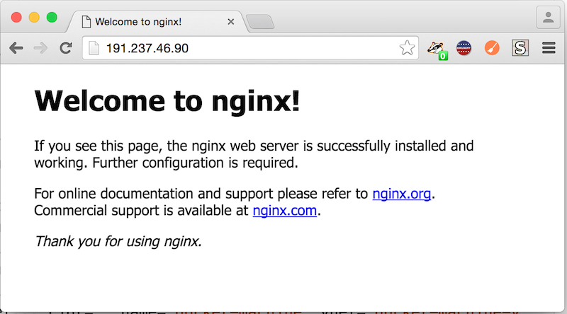

<properties
    pageTitle="Creare host Docker in Azure con il computer Docker | Microsoft Azure"
    description="Descrive l'utilizzo di un Docker per creare host docker in Azure."
    services="virtual-machines-linux"
    documentationCenter=""
    authors="squillace"
    manager="timlt"
    editor="tysonn"/>

<tags
    ms.service="virtual-machines-linux"
    ms.devlang="multiple"
    ms.topic="article"
    ms.tgt_pltfrm="vm-linux"
    ms.workload="infrastructure-services"
    ms.date="07/22/2016"
    ms.author="rasquill"/>

# <a name="use-docker-machine-with-the-azure-driver"></a>Utilizzare Docker computer con il driver di Azure

[Docker](https://www.docker.com/) corrisponde a uno dei metodi di virtualizzazione più comuni che utilizza Linux contenitori invece macchine virtuali allo scopo di isolamento dei dati dell'applicazione e computing sulle risorse condivise. Questo argomento illustra quando e come usare [Docker Machine](https://docs.docker.com/machine/) (il `docker-machine` comando) per creare nuove macchine virtuali Linux in Azure abilitato come host docker per i contenitori di Linux.


## <a name="create-vms-with-docker-machine"></a>Creare macchine virtuali con il computer Docker

Creare docker macchine virtuali host in Azure con la `docker-machine create` comando utilizzando il `azure` argomento driver per l'opzione driver (`-d`) e gli eventuali altri argomenti. 

Nell'esempio seguente si basa sui valori predefiniti, ma aprire porte 80 nella macchina virtuale a internet per eseguire il test con un contenitore nginx, rende `ops` l'utente di accesso per SSH e le chiamate nuova macchina virtuale `machine`. 

Tipo di `docker-machine create --driver azure` per visualizzare le opzioni e valori predefiniti; è anche possibile leggere la [documentazione del Driver di Azure Docker](https://docs.docker.com/machine/drivers/azure/). Si noti che se si dispone di autenticazione a due fattori abilitato, verrà richiesto per eseguire l'autenticazione tramite il secondo fattore.

```bash
docker-machine create -d azure \
  --azure-ssh-user ops \
  --azure-subscription-id <Your AZURE_SUBSCRIPTION_ID> \
  --azure-open-port 80 \
  machine
```

L'output dovrebbe essere simile al seguente, a seconda del fatto che sia l'autenticazione a due fattori configurato l'account.

```
Creating CA: /Users/user/.docker/machine/certs/ca.pem
Creating client certificate: /Users/user/.docker/machine/certs/cert.pem
Running pre-create checks...
(machine) Microsoft Azure: To sign in, use a web browser to open the page https://aka.ms/devicelogin. Enter the code <code> to authenticate.
(machine) Completed machine pre-create checks.
Creating machine...
(machine) Querying existing resource group.  name="machine"
(machine) Creating resource group.  name="machine" location="eastus"
(machine) Configuring availability set.  name="docker-machine"
(machine) Configuring network security group.  name="machine-firewall" location="eastus"
(machine) Querying if virtual network already exists.  name="docker-machine-vnet" location="eastus"
(machine) Configuring subnet.  name="docker-machine" vnet="docker-machine-vnet" cidr="192.168.0.0/16"
(machine) Creating public IP address.  name="machine-ip" static=false
(machine) Creating network interface.  name="machine-nic"
(machine) Creating storage account.  name="vhdsolksdjalkjlmgyg6" location="eastus"
(machine) Creating virtual machine.  name="machine" location="eastus" size="Standard_A2" username="ops" osImage="canonical:UbuntuServer:15.10:latest"
Waiting for machine to be running, this may take a few minutes...
Detecting operating system of created instance...
Waiting for SSH to be available...
Detecting the provisioner...
Provisioning with ubuntu(systemd)...
Installing Docker...
Copying certs to the local machine directory...
Copying certs to the remote machine...
Setting Docker configuration on the remote daemon...
Checking connection to Docker...
Docker is up and running!
To see how to connect your Docker Client to the Docker Engine running on this virtual machine, run: docker-machine env machine
```

## <a name="configure-your-docker-shell"></a>Configurare la shell docker

A questo punto, digitare `docker-machine env <VM name>` per visualizzare le informazioni necessarie per la configurazione di shell. 

```bash
docker-machine env machine
```

Che consente di stampare le informazioni sull'ambiente, che presenta un aspetto simile al seguente. Nota l'indirizzo IP è stata assegnata, che è necessario verificare la macchina virtuale.

```
export DOCKER_TLS_VERIFY="1"
export DOCKER_HOST="tcp://191.237.46.90:2376"
export DOCKER_CERT_PATH="/Users/rasquill/.docker/machine/machines/machine"
export DOCKER_MACHINE_NAME="machine"
# Run this command to configure your shell:
# eval $(docker-machine env machine)
```

È possibile eseguire il comando configurazione consigliata oppure è possibile impostare le variabili di ambiente se stessi. 

## <a name="run-a-container"></a>Eseguire un contenitore

A questo punto è possibile eseguire un semplice server web per verificare se tutto funzioni correttamente. Di seguito è utilizzare un'immagine nginx standard, specificare che deve attendere sulla porta 80 e se la macchina virtuale si riavvia il contenitore deve riavviare anche (`--restart=always`). 

```bash
docker run -d -p 80:80 --restart=always nginx
```

L'output avrà un aspetto simile al seguente:

```
Unable to find image 'nginx:latest' locally
latest: Pulling from library/nginx
efd26ecc9548: Pull complete
a3ed95caeb02: Pull complete
83f52fbfa5f8: Pull complete
fa664caa1402: Pull complete
Digest: sha256:12127e07a75bda1022fbd4ea231f5527a1899aad4679e3940482db3b57383b1d
Status: Downloaded newer image for nginx:latest
25942c35d86fe43c688d0c03ad478f14cc9c16913b0e1c2971cb32eb4d0ab721
```

## <a name="test-the-container"></a>Verificare il contenitore

Esaminare i contenitori di esecuzione usando `docker ps`:

```bash
CONTAINER ID        IMAGE               COMMAND                  CREATED             STATUS              PORTS                         NAMES
d5b78f27b335        nginx               "nginx -g 'daemon off"   5 minutes ago       Up 5 minutes        0.0.0.0:80->80/tcp, 443/tcp   goofy_mahavira
```

E verificare il contenitore in esecuzione, digitare `docker-machine ip <VM name>` per trovare l'indirizzo IP (se è stata dimenticata dalla `env` comando):



## <a name="next-steps"></a>Passaggi successivi

Se si è interessati, è possibile provare Azure [Docker macchine Virtuali estensione](virtual-machines-linux-dockerextension.md) per eseguire la stessa operazione CLI Azure o ai modelli di manager delle risorse Azure. 

Per altri esempi di utilizzo di Docker, vedere [utilizzo di Docker](https://github.com/Microsoft/HealthClinic.biz/wiki/Working-with-Docker) da [HealthClinic.biz](https://github.com/Microsoft/HealthClinic.biz) 2015 Connetti [demo](https://blogs.msdn.microsoft.com/visualstudio/2015/12/08/connectdemos-2015-healthclinic-biz/). Per altre guide rapide dal demo HealthClinic.biz, vedere [Guide rapide strumenti di sviluppo di Azure](https://github.com/Microsoft/HealthClinic.biz/wiki/Azure-Developer-Tools-Quickstarts).

