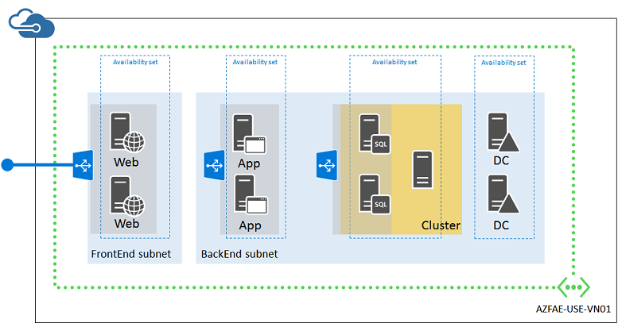

<properties
    pageTitle="Procedura dettagliata dell'infrastruttura di esempio | Microsoft Azure"
    description="Informazioni sulle linee guida di progettazione e implementazione fondamentali per la distribuzione di un'infrastruttura di esempio in Azure."
    documentationCenter=""
    services="virtual-machines-linux"
    authors="iainfoulds"
    manager="timlt"
    editor=""
    tags="azure-resource-manager"/>

<tags
    ms.service="virtual-machines-linux"
    ms.workload="infrastructure-services"
    ms.tgt_pltfrm="vm-linux"
    ms.devlang="na"
    ms.topic="article"
    ms.date="09/08/2016"
    ms.author="iainfou"/>

# Procedura dettagliata dell'infrastruttura di Azure di esempio

[AZURE.INCLUDE [virtual-machines-linux-infrastructure-guidelines-intro](../../includes/virtual-machines-linux-infrastructure-guidelines-intro.md)] 

In questo articolo vengono illustrati creazione di un'infrastruttura dell'applicazione di esempio. Abbiamo dettaglio progetta un'infrastruttura per un negozio online semplice che riunisce tutti le linee guida e le decisioni intorno convenzioni di denominazione, set di disponibilità, reti virtuali e servizi di bilanciamento del carico e la distribuzione del macchine ().

## Carico di lavoro di esempio

Adventure Works cicli desidera creare un'applicazione di negozio online in Azure che include:

- Due nginx server che esegue il client front-end in un livello web
- Due server nginx l'elaborazione di dati e ordini in un livello di applicazione
- Due parti di server MongoDB di un cluster sharded per l'archiviazione dei dati dei prodotti e ordini in un livello di database
- Due controller di dominio Active Directory per gli account dei clienti e fornitori in un livello di autenticazione
- Tutti i server si trovano in due subnet:
    - una subnet front-end per il server web 
    - una subnet back-end per il server applicazioni, MongoDB cluster e controller di dominio

Posta in arrivo protetto il traffico web deve essere carico tra i server web come clienti Sfoglia negozio online. Ordine di elaborazione del traffico in forma di HTTP richieste dal server devono essere carico tra i server di applicazione web. Inoltre, l'infrastruttura deve essere progettato per la disponibilità elevata.

La struttura risultante deve includere:

- Un account e abbonamento Azure
- Un gruppo di risorse singolo
- Account di archiviazione
- Una rete virtuale con due subnet
- Set di disponibilità per macchine virtuali con un ruolo simile
- Macchine virtuali

Tutte le risposte sopra seguire queste convenzioni di denominazione:

- Adventure Works cicli ottimali **[carico di lavoro IT]-[posizione]-[Azure risorsa]** il prefisso
    - In questo esempio, "**azos**" (archivio online di Azure) è il nome di carico di lavoro IT e "**utilizzo**" (USA orientale 2) è la posizione
- Gli account di archiviazione utilizzano adventureazosusesa**[description]**
    - 'adventure' è stato aggiunto il prefisso per fornire l'univocità e i nomi degli account di archiviazione non supportano l'utilizzo di trattini.
- Reti virtuali usare VN di usare AZOS**[numero]**
- Set di disponibilità utilizzati azos-utilizzare-come-**[ruolo]**
- I nomi di macchina virtuale utilizzano azos-utilizzare-macchine virtuali -**[vmname]**

## Account e abbonamenti azure

Adventure Works cicli sta utilizzando l'abbonamento dell'organizzazione, denominata Adventure Works Enterprise abbonamento, per fornire la fatturazione per il carico di lavoro IT.

## Account di archiviazione

Adventure Works cicli determinata sono necessari due account di archiviazione:

- **adventureazosusesawebapp** per l'archiviazione standard server web, server di applicazioni e controller di dominio e i dischi di dati.
- **adventureazosusesadbclust** per l'archiviazione Premium dei server cluster sharded MongoDB e i dischi di dati.

## Subnet e virtuali

Perché la rete virtuale non è necessario in corso connettività alla rete locale Adventure lavoro cicli, decidono in una rete virtuale basata solo su cloud.

Una rete virtuale basata solo su cloud creati con le seguenti impostazioni tramite il portale di Azure:

- Nome: AZOS-Usa-VN01
- Posizione: Stati Uniti orientali 2
- Spazio di indirizzi virtuali: 10.0.0.0/8
- Prima subnet:
    - Nome: front-end
    - Spazio di indirizzi: 10.0.1.0/24
- Seconda subnet:
    - Nome: back-end
    - Spazio di indirizzi: 10.0.2.0/24

## Set di disponibilità

Per mantenere disponibilità di tutti i quattro livelli del loro negozio online, cicli di Adventure Works deciso quattro set di disponibilità:

- **azos utilizzo come web** per il server web
- **utilizzare azos come app** per il server di applicazione
- **azos utilizzo come db** per il server del cluster sharded MongoDB
- **azos utilizzo come controller di dominio** per i controller di dominio

## Macchine virtuali

Adventure Works cicli deciso ai nomi di seguito per le proprie macchine virtuali Azure:

- **utilizzo di azos-web01 di macchine virtuali** per il primo server web
- **utilizzo di azos-web02 di macchine virtuali** per il secondo server web
- **azos-uso-macchine virtuali-il server app01** per il primo server di applicazioni
- **utilizzo di azos-app02 di macchine virtuali** per il secondo server di applicazioni
- **utilizzo di azos-db01 di macchine virtuali** per il primo server MongoDB del cluster
- **utilizzo di azos-db02 di macchine virtuali** per il secondo server MongoDB del cluster
- **utilizzo di azos-dc01 di macchine virtuali** per il primo controller di dominio
- **utilizzo di azos-dc02 di macchine virtuali** per il secondo controller di dominio

Ecco la configurazione risultante.

Viene fornito con questa configurazione:

- Una rete virtuale basata solo su cloud con due subnet (front-end e back-end)
- Due account di archiviazione
- Quattro set di disponibilità, uno per ogni livello dell'archivio online
- Macchine virtuali per i quattro livelli
- Un set di bilanciamento del carico esterno per il traffico basato su HTTPS web da Internet ai server web
- Un interno bilanciato impostare per il traffico non crittografato web dal server web al server delle applicazioni
- Un gruppo di risorse singolo

## Passaggi successivi

[AZURE.INCLUDE [virtual-machines-linux-infrastructure-guidelines-next-steps](../../includes/virtual-machines-linux-infrastructure-guidelines-next-steps.md)] 