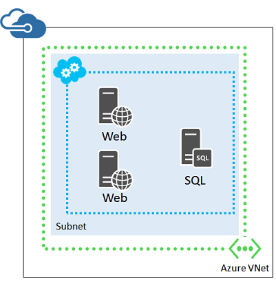

<properties
    pageTitle="Linee guida infrastruttura di rete | Microsoft Azure"
    description="Informazioni sulle linee guida di progettazione e implementazione fondamentali per la distribuzione di rete virtuale in servizi di infrastruttura Azure."
    documentationCenter=""
    services="virtual-machines-linux"
    authors="iainfoulds"
    manager="timlt"
    editor=""
    tags="azure-resource-manager"/>

<tags
    ms.service="virtual-machines-linux"
    ms.workload="infrastructure-services"
    ms.tgt_pltfrm="vm-linux"
    ms.devlang="na"
    ms.topic="article"
    ms.date="09/08/2016"
    ms.author="iainfou"/>

# Linee guida infrastruttura di rete

[AZURE.INCLUDE [virtual-machines-linux-infrastructure-guidelines-intro](../../includes/virtual-machines-linux-infrastructure-guidelines-intro.md)] 

In questo articolo è incentrata su informazioni sulla pianificazione necessarie per la rete virtuale all'interno di Azure e la connettività tra gli ambienti locale esistenti.

## Linee guida di implementazione per le reti virtuali

Decisioni:

- Quali tipi di rete virtuale è necessario ospitare il carico di lavoro IT o infrastruttura (basata solo su cloud o tra locale)?
- Per le reti virtuali tra locale, la quantità di spazio indirizzo necessari ospitare la subnet e macchine virtuali ora e per l'espansione accettabile in futuro
- Si intende creare reti virtuali centralizzate o singoli reti virtuali per ogni gruppo di risorse?

Attività:

- Definire lo spazio di indirizzi per le reti virtuali da creare.
- Definire il set di subnet e lo spazio di indirizzi per ogni.
- Per le reti virtuali tra locale, definire il set di spazi di indirizzi di rete locale per i percorsi locale macchine virtuali nella rete virtuale necessaria per raggiungere.
- Lavoro con locale team di rete per assicurarsi che il routing appropriato è stato configurato durante la creazione di croce locale reti virtuali.
- Creare la rete virtuale utilizzando la convenzione di denominazione.

## Reti virtuali

Reti virtuali sono necessari per supportare le comunicazioni tra macchine (). È possibile definire subnet, indirizzo IP personalizzato, le impostazioni DNS, filtri di protezione e il bilanciamento del carico, come con reti fisiche. Mediante un [Gateway VPN](../vpn-gateway/vpn-gateway-about-vpngateways.md) o [circuito strada](../expressroute/expressroute-introduction.md), è possibile connettersi Azure reti virtuali alle tue reti locale. È possibile leggere informazioni sulle [reti virtuali e dei relativi componenti](../virtual-network/virtual-networks-overview.md).

Mediante i gruppi di risorse, è necessario flessibilità come la progettazione dei componenti di reti virtuali. Macchine virtuali è possono connettersi a virtuale reti esterne al proprio gruppo di risorse. Un approccio di progettazione comune, è possibile creare gruppi di risorse centralizzato che contengono l'infrastruttura di rete principale che può essere gestito da un team comune. Macchine virtuali e le applicazioni distribuite ai gruppi di risorse separato. Questo approccio consente l'accesso ai proprietari di applicazione al gruppo di risorse contenente le proprie macchine virtuali senza aprire l'accesso alla configurazione di più ampio risorse rete virtuale.

## Connettività dei siti

### Reti virtuali basata solo su cloud
Se i computer e utenti locali non richiedono connettività continua a macchine virtuali in una rete virtuale Azure, la struttura di rete virtuale è semplice:

Questo approccio è in genere per carichi di lavoro esposto a Internet, ad esempio un server web basati su Internet. È possibile gestire questi macchine virtuali utilizzando SSH o connessioni VPN punto al sito.

Poiché non connettono alla rete locale, solo Azure reti virtuali possono utilizzare qualsiasi parte dello spazio di indirizzi IP privato. Lo spazio di indirizzi può essere lo stesso spazio privato che è in uso in locale.

### Reti virtuali tra locale
Se i computer e utenti locali richiedono connettività continua a macchine virtuali in una rete virtuale Azure, creare una rete virtuale tra locale. Connettere la rete virtuale per la rete locale con un ExpressRoute o una connessione VPN a siti.

In questa configurazione, la rete virtuale Azure è essenzialmente un'estensione basato sul cloud della rete locale.

Perché si connettono alla rete locale, tra locale reti virtuali necessario utilizzare una parte dello spazio di indirizzi usato per l'organizzazione sia univoca. Nello stesso modo in cui diverse posizioni aziendale sono assegnati subnet IP specifica, Azure assume la forma di un'altra posizione come estendere fuori rete.

Per consentire i pacchetti recarsi presso dalla rete virtuale tra locale per la rete locale, è necessario configurare il set di prefissi locali pertinenti come parte della definizione di rete locale per la rete virtuale. A seconda lo spazio di indirizzi della rete virtuale e il set di percorsi locali pertinenti, può essere molti prefissi degli indirizzi nella rete locale.

È possibile convertire una rete virtuale basata solo su cloud a una rete locale tra ma è molto probabilmente necessario per re IP di spazio di indirizzi virtuali Azure risorse. Di conseguenza, valutare attentamente se è necessario essere connessi alla rete locale quando si assegna una subnet IP una rete virtuale.

## Subnet
Subnet consentono di organizzare risorse correlate, uno in modo logico (ad esempio, una subnet per macchine virtuali associati alla stessa applicazione) o fisica (ad esempio, una subnet per ogni gruppo di risorse). È inoltre possibile utilizzare le tecniche di isolamento subnet per una maggiore protezione.

Per le reti virtuali tra locale, è necessario progettare subnet con le stesse convenzioni utilizzate per le risorse locali. **Azure sempre utilizza i primi tre indirizzi IP dello spazio di indirizzi per ciascuna subnet**. Per determinare il numero di indirizzi necessari per la subnet, prima di tutto il conteggio del numero di macchine virtuali che è necessario ora. Stima per la crescita e quindi utilizzare la tabella seguente per determinare le dimensioni della subnet.

Numero di macchine virtuali necessarie | Numero di bit host necessari | Dimensioni della subnet
--- | --- | ---
1-3 | 3 | / 29
4-11     | 4 | / 28
12-27 | 5 | / 27
28-59 | 6 | / 26
60-123 | 7 | / 25

> [AZURE.NOTE] Per le subnet locale normale, il numero massimo di indirizzi host per una subnet con bit host n è 2n -2. Per una subnet Azure, il numero massimo di indirizzi host per una subnet con bit host n è 2n -5 (2 e 3 per gli indirizzi Azure utilizza su ciascuna subnet).

Se si sceglie una dimensione subnet è troppo piccola, è necessario re IP e ridistribuire le macchine virtuali nella subnet.

## Gruppi di sicurezza di rete
È possibile applicare le regole di filtro per il traffico che passa attraverso le reti virtuali mediante i gruppi di sicurezza di rete. È possibile creare regole di filtro granulare per proteggere l'ambiente di rete virtuale controllo in ingresso e in uscita il traffico, origine e destinazione intervalli di indirizzi IP, consentito porte e così via. Gruppi di sicurezza di rete può essere applicati a subnet all'interno di una rete virtuale o direttamente a un'interfaccia virtuali specificato. È consigliabile avere una certa gruppo di sicurezza di rete filtrano il traffico di una rete virtuale. È possibile leggere altre informazioni sui [Gruppi di sicurezza di rete](../virtual-network/virtual-networks-nsg.md).

## Componenti aggiuntivi di rete
Come con un'infrastruttura di rete locale fisica, Azure rete virtuale può contenere più subnet e indirizzi IP. Durante la progettazione dell'infrastruttura di applicazione, si desidera incorporare alcuni di questi componenti aggiuntivi:

- [Gateway VPN](../vpn-gateway/vpn-gateway-about-vpngateways.md) - connettersi reti virtuali Azure ad altre reti virtuale Azure, o reti locale tramite una connessione VPN da sito. Implementare le connessioni di strada per le connessioni dedicate e sicura. È anche possibile l'accesso diretto degli utenti con le connessioni VPN punto al sito.
- [Bilanciamento del carico](../load-balancer/load-balancer-overview.md) - fornisce il bilanciamento del carico di traffico per il traffico interno ed esterno in base alle esigenze.
- [Gateway di applicazioni](../application-gateway/application-gateway-introduction.md) - bilanciamento del carico HTTP bilanciamento del carico livello di applicazione, che fornisce alcuni vantaggi aggiuntivi per le applicazioni web anziché la distribuzione di Azure.
- [Gestore del traffico](../traffic-manager/traffic-manager-overview.md) - distribuzione il traffico basato su DNS per indirizzare gli utenti finali all'endpoint applicazione disponibile più vicino, consentendo di ospitare l'applicazione fuori Azure Data Center in diverse aree geografiche.

## Passaggi successivi

[AZURE.INCLUDE [virtual-machines-linux-infrastructure-guidelines-next-steps](../../includes/virtual-machines-linux-infrastructure-guidelines-next-steps.md)] 