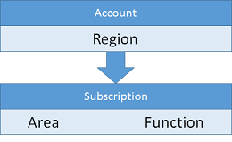

<properties
    pageTitle="Abbonamento e linee guida per gli account | Microsoft Azure"
    description="Informazioni sulle linee guida di progettazione e implementazione fondamentali per gli account in Azure e abbonamenti."
    documentationCenter=""
    services="virtual-machines-windows"
    authors="iainfoulds"
    manager="timlt"
    editor=""
    tags="azure-resource-manager"/>

<tags
    ms.service="virtual-machines-windows"
    ms.workload="infrastructure-services"
    ms.tgt_pltfrm="vm-windows"
    ms.devlang="na"
    ms.topic="article"
    ms.date="09/08/2016"
    ms.author="iainfou"/>

# Linee guida di abbonamento e gli account

[AZURE.INCLUDE [virtual-machines-windows-infrastructure-guidelines-intro](../../includes/virtual-machines-windows-infrastructure-guidelines-intro.md)] 

In questo articolo è incentrata su informazioni come implementare la gestione della sottoscrizione e account come l'ambiente e base di utenti che si sviluppa.

## Linee guida di implementazione per gli account e abbonamenti

Decisioni:

- Quali set di sottoscrizioni e gli account non è necessario ospitare il carico di lavoro IT o infrastruttura?
- Come è possibile suddividere la gerarchia in modo da adattarlo all'organizzazione?

Attività:

- Definire la gerarchia logica dell'organizzazione che si desidera gestire da un livello di sottoscrizione.
- Per abbinare la gerarchia logica, definire gli account necessari e sottoscrizioni in ogni account.
- Creare il set di sottoscrizioni e account utilizzando la convenzione di denominazione.

## Le sottoscrizioni e gli account

Per lavorare con Azure, è necessario uno o più abbonamenti Azure. Risorse come macchine () o reti virtuali è presente di tali sottoscrizioni.

- Clienti aziendali sono in genere un'iscrizione Enterprise resource superiore nella gerarchia e è associato a uno o più account.
- Per utenti privati e clienti senza un'iscrizione dell'organizzazione, la risorsa in primo piano è l'account.
- Abbonamenti sono associati agli account e possono essere presenti una o più sottoscrizioni per ogni account. Record Azure fatturazione a livello di sottoscrizione.

Limite di due livelli della gerarchia nella relazione di Account/sottoscrizione, è importante allineare la convenzione di denominazione dei conti e gli abbonamenti a esigenze di fatturazione. Ad esempio, se un'azienda globale utilizza Azure, possono scegliere di disporre di un account per area geografica e hanno abbonamenti gestiti a livello di area geografica:

Ad esempio, è possibile utilizzare la struttura seguente:

Se un'area decida di più di una sottoscrizione associata a un determinato gruppo, la convenzione di denominazione deve incorporare consente di codificare i dati in eccesso del conto o il nome dell'abbonamento. L'organizzazione consente Ritocco dei dati di fatturazione per generare i nuovi livelli della gerarchia durante la fatturazione report:

L'organizzazione potrebbe essere simile al seguente:

Fornite informazioni dettagliata fatturazione tramite un file scaricabile per un singolo account o per tutti gli account in un contratto enterprise.

## Passaggi successivi

[AZURE.INCLUDE [virtual-machines-windows-infrastructure-guidelines-next-steps](../../includes/virtual-machines-windows-infrastructure-guidelines-next-steps.md)] 