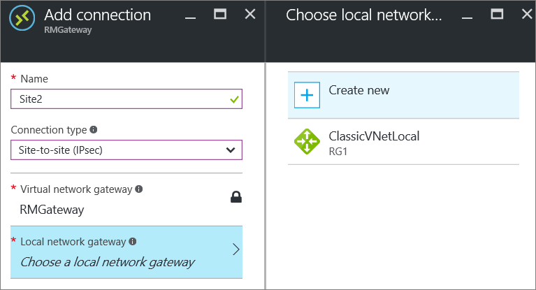

<properties
   pageTitle="Come aggiungere più connessioni di gateway da sito a una rete virtuale per il modello di distribuzione di Manager delle risorse tramite il portale di Azure | Microsoft Azure"
   description="Aggiungere più siti S2S connessioni a un gateway VPN che contiene una connessione esistente"
   services="vpn-gateway"
   documentationCenter="na"
   authors="cherylmc"
   manager="carmonm"
   editor=""
   tags="azure-resource-manager"/>

<tags
   ms.service="vpn-gateway"
   ms.devlang="na"
   ms.topic="article"
   ms.tgt_pltfrm="na"
   ms.workload="infrastructure-services"
   ms.date="10/10/2016"
   ms.author="cherylmc"/>

# Aggiungere una connessione a siti VNet con una connessione di gateway VPN esistente

> [AZURE.SELECTOR]
- [Gestione risorse - portale](vpn-gateway-howto-multi-site-to-site-resource-manager-portal.md)
- [Classico - PowerShell](vpn-gateway-multi-site.md)

In questo articolo illustra tramite il portale di Azure per aggiungere le connessioni a siti (S2S) per un gateway VPN che ha una connessione esistente. Questo tipo di connessione viene spesso come configurazione "più siti". 

In questo articolo è possibile utilizzare per aggiungere una connessione S2S a un VNet che contiene già una connessione S2S, connessione punto a sito o VNet a VNet. Esistono alcune limitazioni quando si aggiungono le connessioni. Controllare la sezione [prima di iniziare](#before) in questo articolo per verificare prima di iniziare la configurazione. 

In questo articolo si applica a VNets creata utilizzando il modello di distribuzione di Manager delle risorse che dispone di un gateway RouteBased VPN. Questa procedura si applica alle configurazioni connessione dominio ExpressRoute/a siti. Per informazioni sulle connessioni dominio, vedere [connessioni dominio ExpressRoute/S2S](../expressroute/expressroute-howto-coexist-resource-manager.md) .

### Metodi e modelli di distribuzione

[AZURE.INCLUDE [vpn-gateway-clasic-rm](../../includes/vpn-gateway-classic-rm-include.md)] 

Viene aggiornato in questa tabella come nuovi articoli e altri strumenti disponibili per la configurazione. Quando un articolo è disponibile, è collegare direttamente a questa tabella.

[AZURE.INCLUDE [vpn-gateway-table-multi-site](../../includes/vpn-gateway-table-multisite-include.md)] 

## Prima di iniziare

Verificare quanto segue:

- Non si sta creando una connessione di dominio ExpressRoute/S2S.
- Si dispone di una rete virtuale creata utilizzando il modello di distribuzione di Manager delle risorse con una connessione esistente.
- Il gateway di rete virtuale per la VNet è RouteBased. Se si dispone di un gateway PolicyBased VPN, è necessario eliminare il gateway virtuali e creare un nuovo gateway VPN come RoutBased.
- Nessuno degli intervalli di indirizzi sovrapposti per uno dei VNets che questo VNet si desidera connettersi.
- È necessario dispositivo VPN e chi è in grado di configurarlo. Vedere [informazioni sui dispositivi VPN](vpn-gateway-about-vpn-devices.md). Se non ha familiarità con la configurazione del dispositivo VPN o si ha familiarità con l'indirizzo IP intervalli nella configurazione di rete le in locale, è necessario per la coordinazione con qualcuno in grado di fornire i dettagli dell'utente.
- Si dispone di un indirizzo IP pubblico esternamente esposto del dispositivo VPN. Non è possibile individuare l'indirizzo IP dietro al NAT.

## Parte 1: configurare una connessione

1. Da un browser passare al [portale di Azure](http://portal.azure.com) e, se necessario, accedere con l'account Azure.
2. Fare clic su **tutte le risorse** e individuare il **gateway virtuali** dall'elenco delle risorse e fare clic su esso.
3. Scegliere **connessioni**e il **gateway di rete virtuale** .

     

4. Scegliere **Aggiungi +**e il **connessioni** .

     

5. In e il **componente connessione** compilare i campi seguenti:
    - **Nome:** Il nome da assegnare al sito che si sta creando la connessione.
    - **Tipo di connessione:** Selezionare **sito a sito (IPsec)**.

     

## Parte 2: aggiunta di un gateway di rete locale

1. Fare clic su **gateway di rete locale** ***Scegli un gateway di rete locale***. Verrà aperto e il **gateway di rete locale Scegli** .

     
2. Fare clic su **Crea nuovo** per aprire e il **gateway di rete locale crea** .

     

3. In e il **gateway di rete locale crea** compilare i campi seguenti:
    - **Nome:** Il nome da assegnare alla risorsa di gateway di rete locale.
    - **Indirizzo IP:** L'indirizzo IP pubblico del dispositivo VPN nel sito che si desidera connettersi.
    - **Spazio di indirizzi:** Spazio di indirizzi che si desidera essere indirizzati al nuovo sito di rete locale.
4. Fare clic su **OK** nella e **gateway di rete locale crea** per salvare le modifiche.

## Parte 3: aggiungere la chiave condivisa e creare la connessione

1. In e **l'Aggiungi connessione** , aggiungere la chiave condivisa che si desidera utilizzare per creare la connessione. È possibile ottenere la chiave condivisa dal dispositivo VPN o apportare una qui e quindi configurare il dispositivo VPN per utilizzare la stessa chiave condivisa. Importante è che le chiavi sono identici.

     
2. Nella parte inferiore della stessa e, fare clic su **OK** per creare la connessione.

## Parte 4: verificare la connessione VPN

È possibile verificare la connessione VPN nel portale o tramite PowerShell.

[AZURE.INCLUDE [vpn-gateway-verify-connection-rm](../../includes/vpn-gateway-verify-connection-rm-include.md)]

## Passaggi successivi

- Una volta completata la connessione, è possibile aggiungere macchine virtuali alle tue reti virtuale. Vedere le macchine virtuali [percorso formativo](https://azure.microsoft.com/documentation/learning-paths/virtual-machines) per altre informazioni.
