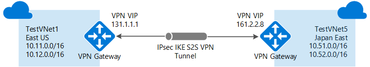

<properties
   pageTitle="Connettersi VNets Azure con Gateway VPN e PowerShell | Microsoft Azure"
   description="In questo articolo illustra la connessione di reti virtuali insieme tramite Gestione risorse di Azure e PowerShell."
   services="vpn-gateway"
   documentationCenter="na"
   authors="cherylmc"
   manager="carmonm"
   editor=""
   tags="azure-resource-manager"/>

<tags
   ms.service="vpn-gateway"
   ms.devlang="na"
   ms.topic="get-started-article"
   ms.tgt_pltfrm="na"
   ms.workload="infrastructure-services"
   ms.date="08/31/2016"
   ms.author="cherylmc"/>

# Configurare una connessione VNet-VNet per Gestione risorse tramite PowerShell

> [AZURE.SELECTOR]
- [Gestione risorse - portale Azure](vpn-gateway-howto-vnet-vnet-resource-manager-portal.md)
- [Gestione risorse - PowerShell](vpn-gateway-vnet-vnet-rm-ps.md)
- [Classico: portale classica](virtual-networks-configure-vnet-to-vnet-connection.md)

In questo articolo sono illustrati i passaggi per creare una connessione tra VNets nel modello di distribuzione Manager delle risorse tramite VPN Gateway. Le reti virtuali possono essere le stesse o in altre aree geografiche e in base alle stesse o in altre sottoscrizioni.

### Modelli di distribuzione e i metodi per le connessioni VNet-VNet

[AZURE.INCLUDE [deployment models](../../includes/vpn-gateway-deployment-models-include.md)]

Nella tabella seguente mostra i metodi per le configurazioni VNet a VNet e modelli di distribuzione attualmente disponibile. Quando un articolo con i passaggi di configurazione è disponibile, è collegare direttamente a da questa tabella.

[AZURE.INCLUDE [vpn-gateway-table-vnet-vnet](../../includes/vpn-gateway-table-vnet-to-vnet-include.md)]

#### Peering VNet

[AZURE.INCLUDE [vpn-gateway-vnetpeeringlink](../../includes/vpn-gateway-vnetpeeringlink-include.md)]

## Informazioni sulle connessioni VNet-VNet

La connessione di rete virtuale a un'altra rete virtuale (VNet-VNet) è simile alla connessione un VNet in un punto del sito locale. Entrambi i tipi di connettività per utilizzano un gateway VPN Azure per fornire un tunnel protetto tramite IPsec/IKE. Può essere VNets che ci si connette in diverse aree geografiche. O in diversi abbonamenti. È anche possibile combinare VNet a VNet la comunicazione con le configurazioni più siti. Consente stabilire topologie di rete che combinano tra locale la connettività con la connettività di rete tra virtuale, come illustrato nella figura seguente:

 
### Perché la connessione reti virtuali?

È consigliabile connettersi reti virtuali per i motivi seguenti:

- **Area cross geografico-ridondanza e geografico presenza**
    - È possibile impostare il proprio geografico replica o la sincronizzazione con la connettività protetta senza superando il endpoint esposto a Internet.
    - Con Azure il traffico Manager e di bilanciamento del carico, è possibile impostare disponibilità carico di lavoro con la ridondanza geografico in più regioni Azure. Un esempio importante consiste nel configurare SQL sempre attive con i gruppi di disponibilità diffusione in più regioni Azure.

- **Internazionali applicazioni a più livelli con isolamento o confine amministrativo**
    - All'interno dell'area stessa, è possibile impostare applicazioni a più livelli con più reti virtuali collegate a causa di isolamento o requisiti amministrativi.

### Domande frequenti su VNet-VNet

[AZURE.INCLUDE [vpn-gateway-vnet-vnet-faq](../../includes/vpn-gateway-vnet-vnet-faq-include.md)] 

## Il set di passaggi è opportuno usare?

In questo articolo viene visualizzato due diversi insiemi di passaggi. Un set di passaggi per [VNets che si trovano nella stessa sottoscrizione](#samesub)e un altro per [VNets che risiedono negli abbonamenti a diversi](#difsub). La differenza tra i set di chiave è la possibilità di creare e configurare tutti virtuali e le risorse di gateway nella stessa sessione di PowerShell.

La procedura descritta in questo articolo utilizza le variabili dichiarate all'inizio di ogni sezione. Se si sta già lavorando con VNets esistente, modificare le variabili in base alle impostazioni nel proprio ambiente. 

## Modalità di connessione VNets presenti lo stesso abbonamento

### Prima di iniziare
    
Prima di iniziare, è necessario installare i cmdlet PowerShell di Azure Manager delle risorse. Per ulteriori informazioni sull'installazione i cmdlet di PowerShell, vedere [come installare e configurare Azure PowerShell](../powershell-install-configure.md) .

### Passaggio 1: pianificare gli intervalli di indirizzi IP

Nella procedura seguente viene creata due reti virtuali con i relativi subnet rispettivi gateway e configurazioni. È quindi possibile creare una connessione VPN tra due VNets. È importante pianificare gli intervalli di indirizzi IP per la configurazione della rete. Tenere presente che è necessario assicurarsi che nessuno dei VNet intervalli o degli intervalli di rete locale di sovrapposizione in alcun modo.

Negli esempi è utilizzare i valori seguenti:

**Valori per TestVNet1:**

- Nome VNet: TestVNet1
- Gruppo risorse: TestRG1
- Posizione: Stati Uniti orientali
- TestVNet1: 10.11.0.0/16 & 10.12.0.0/16
- Front-end: 10.11.0.0/24
- Back-end: 10.12.0.0/24
- GatewaySubnet: 10.12.255.0/27
- Server DNS: 8.8.8.8
- GatewayName: VNet1GW
- IP pubblico: VNet1GWIP
- VPNType: RouteBased
- Connection(1to4): VNet1toVNet4
- Connection(1to5): VNet1toVNet5
- ConnectionType: VNet2VNet

**Valori per TestVNet4:**

- Nome VNet: TestVNet4
- TestVNet2: 10.41.0.0/16 & 10.42.0.0/16
- Front-end: 10.41.0.0/24
- Back-end: 10.42.0.0/24
- GatewaySubnet: 10.42.255.0/27
- Gruppo risorse: TestRG4
- Posizione: Usa ovest
- Server DNS: 8.8.8.8
- GatewayName: VNet4GW
- IP pubblico: VNet4GWIP
- VPNType: RouteBased
- Connessione: VNet4toVNet1
- ConnectionType: VNet2VNet

### Passaggio 2: creare e configurare TestVNet1

1. Dichiarare le variabili

    Prima di tutto dichiarazione di variabili. In questo esempio dichiara le variabili utilizzando i valori per questa esercitazione. Nella maggior parte dei casi, è necessario sostituire i valori con uno personalizzato. Tuttavia, è possibile utilizzare queste variabili se si sta eseguendo i passaggi per acquisire familiarità con questo tipo di configurazione. Modificare le variabili, se necessario, quindi copiare e incollarle la console di PowerShell.

        $Sub1 = "Replace_With_Your_Subcription_Name"
        $RG1 = "TestRG1"
        $Location1 = "East US"
        $VNetName1 = "TestVNet1"
        $FESubName1 = "FrontEnd"
        $BESubName1 = "Backend"
        $GWSubName1 = "GatewaySubnet"
        $VNetPrefix11 = "10.11.0.0/16"
        $VNetPrefix12 = "10.12.0.0/16"
        $FESubPrefix1 = "10.11.0.0/24"
        $BESubPrefix1 = "10.12.0.0/24"
        $GWSubPrefix1 = "10.12.255.0/27"
        $DNS1 = "8.8.8.8"
        $GWName1 = "VNet1GW"
        $GWIPName1 = "VNet1GWIP"
        $GWIPconfName1 = "gwipconf1"
        $Connection14 = "VNet1toVNet4"
        $Connection15 = "VNet1toVNet5"

2. Connettersi all'abbonamento

    Passare alla modalità di PowerShell per utilizzare i cmdlet Gestione risorse. Aprire la console di PowerShell e connettersi all'account. Utilizzare l'esempio seguente per la connessione:

        Login-AzureRmAccount

    Controllare le sottoscrizioni per l'account.

        Get-AzureRmSubscription 

    Specificare l'abbonamento a cui si desidera utilizzare.

        Select-AzureRmSubscription -SubscriptionName $Sub1

3. Creare un nuovo gruppo di risorse

        New-AzureRmResourceGroup -Name $RG1 -Location $Location1

4. Creare le configurazioni subnet per TestVNet1

    In questo esempio viene creato un virtuali denominati TestVNet1 e tre subnet, una chiamata GatewaySubnet, FrontEnd chiamato un e back-end si chiama un. La sostituzione di valori, è importante denominare sempre subnet gateway specificamente GatewaySubnet. Se si denominarlo un altro elemento, non verrà creato il gateway. 

    Nell'esempio seguente vengono utilizzate le variabili impostato in precedenza. In questo esempio subnet gateway utilizza un /27. Sebbene sia possibile creare una subnet gateway assuma /29, è consigliabile creare una subnet più grande contenente più indirizzi selezionando almeno /28 o /27. In questo modo per indirizzi sufficiente contenere possibili configurazioni aggiuntive che può essere utile in futuro. 

        $fesub1 = New-AzureRmVirtualNetworkSubnetConfig -Name $FESubName1 -AddressPrefix $FESubPrefix1
        $besub1 = New-AzureRmVirtualNetworkSubnetConfig -Name $BESubName1 -AddressPrefix $BESubPrefix1
        $gwsub1 = New-AzureRmVirtualNetworkSubnetConfig -Name $GWSubName1 -AddressPrefix $GWSubPrefix1

5. Creare TestVNet1

        New-AzureRmVirtualNetwork -Name $VNetName1 -ResourceGroupName $RG1 `
        -Location $Location1 -AddressPrefix $VNetPrefix11,$VNetPrefix12 -Subnet $fesub1,$besub1,$gwsub1

6. Richiesta di un indirizzo IP pubblico

    Richiedere un indirizzo IP pubblico da allocare per il gateway che si creerà per il VNet. Si noti che la AllocationMethod dinamiche. Non è possibile specificare l'indirizzo IP che si desidera utilizzare. In modo dinamico allocata per il gateway. 

        $gwpip1 = New-AzureRmPublicIpAddress -Name $GWIPName1 -ResourceGroupName $RG1 `
        -Location $Location1 -AllocationMethod Dynamic

7. Creare la configurazione del gateway

    La configurazione del gateway definisce la subnet e l'indirizzo IP pubblico da utilizzare. L'esempio può essere utilizzato per creare la configurazione del gateway. 

        $vnet1 = Get-AzureRmVirtualNetwork -Name $VNetName1 -ResourceGroupName $RG1
        $subnet1 = Get-AzureRmVirtualNetworkSubnetConfig -Name "GatewaySubnet" -VirtualNetwork $vnet1
        $gwipconf1 = New-AzureRmVirtualNetworkGatewayIpConfig -Name $GWIPconfName1 `
        -Subnet $subnet1 -PublicIpAddress $gwpip1

8. Creare il gateway per TestVNet1

    In questo passaggio, creare il gateway di rete virtuale per la TestVNet1. Configurazioni VNet-VNet richiedono un RouteBased VpnType. Creazione di un gateway può richiedere un po' di tempo (45 minuti o più).

        New-AzureRmVirtualNetworkGateway -Name $GWName1 -ResourceGroupName $RG1 `
        -Location $Location1 -IpConfigurations $gwipconf1 -GatewayType Vpn `
        -VpnType RouteBased -GatewaySku Standard

### Passaggio 3: creare e configurare TestVNet4

Dopo aver configurato TestVNet1, creare TestVNet4. Seguire la procedura seguente, sostituire i valori con le proprie necessità. Questo passaggio può essere eseguito nella stessa sessione di PowerShell perché è nello stesso abbonamento.

1. Dichiarare le variabili

    Assicurarsi di sostituire i valori con quelli che si desidera utilizzare per la configurazione.

        $RG4 = "TestRG4"
        $Location4 = "West US"
        $VnetName4 = "TestVNet4"
        $FESubName4 = "FrontEnd"
        $BESubName4 = "Backend"
        $GWSubName4 = "GatewaySubnet"
        $VnetPrefix41 = "10.41.0.0/16"
        $VnetPrefix42 = "10.42.0.0/16"
        $FESubPrefix4 = "10.41.0.0/24"
        $BESubPrefix4 = "10.42.0.0/24"
        $GWSubPrefix4 = "10.42.255.0/27"
        $DNS4 = "8.8.8.8"
        $GWName4 = "VNet4GW"
        $GWIPName4 = "VNet4GWIP"
        $GWIPconfName4 = "gwipconf4"
        $Connection41 = "VNet4toVNet1"

    Prima di continuare, verificare che si è ancora connessi alla sottoscrizione 1.

2. Creare un nuovo gruppo di risorse

        New-AzureRmResourceGroup -Name $RG4 -Location $Location4

3. Creare le configurazioni subnet per TestVNet4

        $fesub4 = New-AzureRmVirtualNetworkSubnetConfig -Name $FESubName4 -AddressPrefix $FESubPrefix4
        $besub4 = New-AzureRmVirtualNetworkSubnetConfig -Name $BESubName4 -AddressPrefix $BESubPrefix4
        $gwsub4 = New-AzureRmVirtualNetworkSubnetConfig -Name $GWSubName4 -AddressPrefix $GWSubPrefix4

4. Creare TestVNet4

        New-AzureRmVirtualNetwork -Name $VnetName4 -ResourceGroupName $RG4 `
        -Location $Location4 -AddressPrefix $VnetPrefix41,$VnetPrefix42 -Subnet $fesub4,$besub4,$gwsub4

5. Richiesta di un indirizzo IP pubblico

        $gwpip4 = New-AzureRmPublicIpAddress -Name $GWIPName4 -ResourceGroupName $RG4 `
        -Location $Location4 -AllocationMethod Dynamic

6. Creare la configurazione del gateway

        $vnet4 = Get-AzureRmVirtualNetwork -Name $VnetName4 -ResourceGroupName $RG4
        $subnet4 = Get-AzureRmVirtualNetworkSubnetConfig -Name "GatewaySubnet" -VirtualNetwork $vnet4
        $gwipconf4 = New-AzureRmVirtualNetworkGatewayIpConfig -Name $GWIPconfName4 -Subnet $subnet4 -PublicIpAddress $gwpip4

7. Creare il gateway TestVNet4

        New-AzureRmVirtualNetworkGateway -Name $GWName4 -ResourceGroupName $RG4 `
        -Location $Location4 -IpConfigurations $gwipconf4 -GatewayType Vpn `
        -VpnType RouteBased -GatewaySku Standard

### Passaggio 4 - connettersi gateway

1. Ottenere entrambi gateway virtuali

    In questo esempio, poiché entrambi i gateway sono nello stesso abbonamento, è possibile completare questo passaggio nella stessa sessione di PowerShell.

        $vnet1gw = Get-AzureRmVirtualNetworkGateway -Name $GWName1 -ResourceGroupName $RG1
        $vnet4gw = Get-AzureRmVirtualNetworkGateway -Name $GWName4 -ResourceGroupName $RG4

2. Creare TestVNet1 a TestVNet4 connessione

    In questo passaggio si crea la connessione da TestVNet1 a TestVNet4. Verrà visualizzata una chiave condivisa a cui fa riferimento negli esempi. È possibile utilizzare i valori per la chiave condivisa. Importante è che la chiave condivisa deve corrispondere per entrambe le connessioni. Creazione di una connessione può richiedere un po' di tempo breve per completare.

        New-AzureRmVirtualNetworkGatewayConnection -Name $Connection14 -ResourceGroupName $RG1 `
        -VirtualNetworkGateway1 $vnet1gw -VirtualNetworkGateway2 $vnet4gw -Location $Location1 `
        -ConnectionType Vnet2Vnet -SharedKey 'AzureA1b2C3'

3. Creare TestVNet4 a TestVNet1 connessione

    Questo passaggio è simile a quello precedente, ma si sta creando la connessione da TestVNet4 a TestVNet1. Assicurarsi che corrispondano chiavi condivise.

        New-AzureRmVirtualNetworkGatewayConnection -Name $Connection41 -ResourceGroupName $RG4 `
        -VirtualNetworkGateway1 $vnet4gw -VirtualNetworkGateway2 $vnet1gw -Location $Location4 `
        -ConnectionType Vnet2Vnet -SharedKey 'AzureA1b2C3'

    Dopo alcuni minuti, è necessario stabilire la connessione.

4. Verificare la connessione. Vedere la sezione [come verificare la connessione](#verify).

## Modalità di connessione VNets presenti in sottoscrizioni diversi

Questo scenario, è possibile connettersi TestVNet1 e TestVNet5. TestVNet1 e TestVNet5 risiedono in una sottoscrizione diversa. La procedura per la configurazione aggiunta una connessione VNet-VNet aggiuntiva per la connessione TestVNet1 a TestVNet5. 

Ecco la differenza è che alcuni dei passaggi di configurazione devono essere eseguite in una sessione di PowerShell separata nel contesto della seconda sottoscrizione. In particolare quando le due sottoscrizioni appartengono a organizzazioni diverse. 

Continuano con le istruzioni dalla procedura precedente nell'elenco precedente. È necessario completare i [passaggi 1](#Step1) e [2 passaggio](#Step2) per creare e configurare TestVNet1 e il Gateway VPN per TestVNet1. Dopo aver completato il passaggio 1 e 2 passaggio, procedere al passaggio 5 per creare TestVNet5.

### Passaggio 5 - verificare gli intervalli di indirizzi IP aggiuntivi

È importante per assicurarsi che lo spazio di indirizzi IP di nuova rete virtuale, TestVNet5, non si con della VNet intervalli o gli intervalli di gateway di rete locale. 

In questo esempio, le reti virtuali potrebbero appartengono a organizzazioni diverse. Per questa esercitazione, è possibile utilizzare i valori seguenti per la TestVNet5:

**Valori per TestVNet5:**

- Nome VNet: TestVNet5
- Gruppo risorse: TestRG5
- Posizione: Giappone est
- TestVNet5: 10.51.0.0/16 & 10.52.0.0/16
- Front-end: 10.51.0.0/24
- Back-end: 10.52.0.0/24
- GatewaySubnet: 10.52.255.0.0/27
- Server DNS: 8.8.8.8
- GatewayName: VNet5GW
- IP pubblico: VNet5GWIP
- VPNType: RouteBased
- Connessione: VNet5toVNet1
- ConnectionType: VNet2VNet

**Altri valori per TestVNet1:**

- Connessione: VNet1toVNet5

### Passaggio 6: creare e configurare TestVNet5

Nel contesto di nuova sottoscrizione, è necessario eseguire questo passaggio. Questa parte può essere eseguita dall'amministratore in un'altra organizzazione cui appartiene la sottoscrizione.

1. Dichiarare le variabili

    Assicurarsi di sostituire i valori con quelli che si desidera utilizzare per la configurazione.

        $Sub5 = "Replace_With_the_New_Subcription_Name"
        $RG5 = "TestRG5"
        $Location5 = "Japan East"
        $VnetName5 = "TestVNet5"
        $FESubName5 = "FrontEnd"
        $BESubName5 = "Backend"
        $GWSubName5 = "GatewaySubnet"
        $VnetPrefix51 = "10.51.0.0/16"
        $VnetPrefix52 = "10.52.0.0/16"
        $FESubPrefix5 = "10.51.0.0/24"
        $BESubPrefix5 = "10.52.0.0/24"
        $GWSubPrefix5 = "10.52.255.0/27"
        $DNS5 = "8.8.8.8"
        $GWName5 = "VNet5GW"
        $GWIPName5 = "VNet5GWIP"
        $GWIPconfName5 = "gwipconf5"
        $Connection51 = "VNet5toVNet1"

2. Connettersi a sottoscrizione 5

    Aprire la console di PowerShell e connettersi all'account. Utilizzare nell'esempio seguente viene per la connessione:

        Login-AzureRmAccount

    Controllare le sottoscrizioni per l'account.

        Get-AzureRmSubscription 

    Specificare l'abbonamento a cui si desidera utilizzare.

        Select-AzureRmSubscription -SubscriptionName $Sub5

3. Creare un nuovo gruppo di risorse

        New-AzureRmResourceGroup -Name $RG5 -Location $Location5

4. Creare le configurazioni subnet per TestVNet4
    
        $fesub5 = New-AzureRmVirtualNetworkSubnetConfig -Name $FESubName5 -AddressPrefix $FESubPrefix5
        $besub5 = New-AzureRmVirtualNetworkSubnetConfig -Name $BESubName5 -AddressPrefix $BESubPrefix5
        $gwsub5 = New-AzureRmVirtualNetworkSubnetConfig -Name $GWSubName5 -AddressPrefix $GWSubPrefix5

5. Creare TestVNet5

        New-AzureRmVirtualNetwork -Name $VnetName5 -ResourceGroupName $RG5 -Location $Location5 `
        -AddressPrefix $VnetPrefix51,$VnetPrefix52 -Subnet $fesub5,$besub5,$gwsub5

6. Richiesta di un indirizzo IP pubblico

        $gwpip5 = New-AzureRmPublicIpAddress -Name $GWIPName5 -ResourceGroupName $RG5 `
        -Location $Location5 -AllocationMethod Dynamic

7. Creare la configurazione del gateway

        $vnet5 = Get-AzureRmVirtualNetwork -Name $VnetName5 -ResourceGroupName $RG5
        $subnet5  = Get-AzureRmVirtualNetworkSubnetConfig -Name "GatewaySubnet" -VirtualNetwork $vnet5
        $gwipconf5 = New-AzureRmVirtualNetworkGatewayIpConfig -Name $GWIPconfName5 -Subnet $subnet5 -PublicIpAddress $gwpip5

8. Creare il gateway TestVNet5

        New-AzureRmVirtualNetworkGateway -Name $GWName5 -ResourceGroupName $RG5 -Location $Location5 `
        -IpConfigurations $gwipconf5 -GatewayType Vpn -VpnType RouteBased -GatewaySku Standard

### Passaggio 7 - connessione gateway

In questo esempio, perché i gateway sono diversi abbonamenti sono state suddividere questo passaggio due sessioni di PowerShell contrassegnate come [abbonamento 1] e [abbonamento 5].

1. **[Sottoscrizione 1]** Ottenere il gateway di rete virtuale per 1 abbonamento

    Verificare che l'accesso e connettersi all'abbonamento a 1.

        $vnet1gw = Get-AzureRmVirtualNetworkGateway -Name $GWName1 -ResourceGroupName $RG1

    Copiare l'output degli elementi seguenti e inviare questi all'amministratore di 5 sottoscrizione tramite posta elettronica o un altro metodo.

        $vnet1gw.Name
        $vnet1gw.Id

    Questi due elementi avranno valori simili al seguente esempio:

        PS D:\> $vnet1gw.Name
        VNet1GW
        PS D:\> $vnet1gw.Id
        /subscriptions/b636ca99-6f88-4df4-a7c3-2f8dc4545509/resourceGroupsTestRG1/providers/Microsoft.Network/virtualNetworkGateways/VNet1GW

2. **[Abbonamento 5]** Ottenere il gateway di rete virtuale per abbonamento 5

    Verificare che l'accesso e connettersi all'abbonamento a 5.

        $vnet5gw = Get-AzureRmVirtualNetworkGateway -Name $GWName5 -ResourceGroupName $RG5

    Copiare l'output degli elementi seguenti e invia all'amministratore di 1 sottoscrizione tramite posta elettronica o un altro metodo.

        $vnet5gw.Name
        $vnet5gw.Id

    Questi due elementi avranno valori simili al seguente esempio:

        PS C:\> $vnet5gw.Name
        VNet5GW
        PS C:\> $vnet5gw.Id
        /subscriptions/66c8e4f1-ecd6-47ed-9de7-7e530de23994/resourceGroups/TestRG5/providers/Microsoft.Network/virtualNetworkGateways/VNet5GW

3. **[Sottoscrizione 1]** Creare TestVNet1 a TestVNet5 connessione

    In questo passaggio si crea la connessione da TestVNet1 a TestVNet5. Ecco la differenza è che non è possibile ottenere tale vnet5gw $ direttamente perché è in una sottoscrizione diversa. È necessario creare un nuovo oggetto di PowerShell con i valori comunicati dall'abbonamento 1 della procedura precedente. Utilizzare l'esempio seguente. Sostituire il nome, Id e chiave condivisa con i valori desiderati. Importante è che la chiave condivisa deve corrispondere per entrambe le connessioni. Creazione di una connessione può richiedere un po' di tempo breve per completare.

    Verificare che si connette a 1 di sottoscrizione. 
    
        $vnet5gw = New-Object Microsoft.Azure.Commands.Network.Models.PSVirtualNetworkGateway
        $vnet5gw.Name = "VNet5GW"
        $vnet5gw.Id   = "/subscriptions/66c8e4f1-ecd6-47ed-9de7-7e530de23994/resourceGroups/TestRG5/providers/Microsoft.Network/virtualNetworkGateways/VNet5GW"
        $Connection15 = "VNet1toVNet5"
        New-AzureRmVirtualNetworkGatewayConnection -Name $Connection15 -ResourceGroupName $RG1 -VirtualNetworkGateway1 $vnet1gw -VirtualNetworkGateway2 $vnet5gw -Location $Location1 -ConnectionType Vnet2Vnet -SharedKey 'AzureA1b2C3'

4. **[Abbonamento 5]** Creare TestVNet5 a TestVNet1 connessione

    Questo passaggio è simile a quello precedente, ma si sta creando la connessione da TestVNet5 a TestVNet1. Lo stesso processo di creazione di un oggetto di PowerShell in base ai valori ottenuti da 1 abbonamento applicabile anche in questo caso. In questo passaggio, assicurarsi che corrispondano a chiavi condivise.

    Verificare che si connette a 5 di sottoscrizione.

        $vnet1gw = New-Object Microsoft.Azure.Commands.Network.Models.PSVirtualNetworkGateway
        $vnet1gw.Name = "VNet1GW"
        $vnet1gw.Id = "/subscriptions/b636ca99-6f88-4df4-a7c3-2f8dc4545509/resourceGroups/TestRG1/providers/Microsoft.Network/virtualNetworkGateways/VNet1GW "
        New-AzureRmVirtualNetworkGatewayConnection -Name $Connection51 -ResourceGroupName $RG5 -VirtualNetworkGateway1 $vnet5gw -VirtualNetworkGateway2 $vnet1gw -Location $Location5 -ConnectionType Vnet2Vnet -SharedKey 'AzureA1b2C3'

## Come verificare una connessione

[AZURE.INCLUDE [vpn-gateway-no-nsg-include](../../includes/vpn-gateway-no-nsg-include.md)]

[AZURE.INCLUDE [verify connection powershell](../../includes/vpn-gateway-verify-connection-ps-rm-include.md)] 

## Passaggi successivi

- Una volta completata la connessione, è possibile aggiungere macchine virtuali alle tue reti virtuale. Vedere [creare una macchina virtuale](../virtual-machines/virtual-machines-windows-hero-tutorial.md) per la procedura.
- Per informazioni su BGP, vedere la [Panoramica BGP](vpn-gateway-bgp-overview.md) e [su come configurare BGP](vpn-gateway-bgp-resource-manager-ps.md). 

