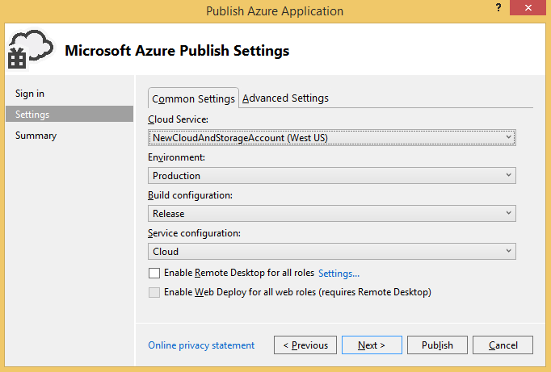

<properties
   pageTitle="Preparare la pubblicazione o distribuire un'applicazione Azure da Visual Studio | Microsoft Azure"
   description="Informazioni sulle procedure per impostare i servizi cloud e lo spazio di archiviazione per l'account e configurare l'applicazione Azure."
   services="visual-studio-online"
   documentationCenter="na"
   authors="TomArcher"
   manager="douge"
   editor="" />
<tags
   ms.service="multiple"
   ms.devlang="dotnet"
   ms.topic="article"
   ms.tgt_pltfrm="na"
   ms.workload="multiple"
   ms.date="08/15/2016"
   ms.author="tarcher" />

# Preparare la pubblicazione o distribuire un'applicazione Azure da Visual Studio

## Panoramica

Prima di poter pubblicare un progetto di servizio cloud, è necessario impostare i servizi seguenti:

- Un **servizio cloud** per l'esecuzione dei ruoli nell'ambiente di Azure

- Un **account di archiviazione** che consente di accedere ai servizi Blob, coda e una tabella.

Utilizzare le procedure seguenti per configurare i servizi e configurare l'applicazione

## Creare un servizio cloud

Per pubblicare un servizio cloud in Azure, creare innanzitutto un servizio cloud, in esecuzione i ruoli nell'ambiente di Azure. È possibile creare un servizio cloud nel [portale classica Azure](http://go.microsoft.com/fwlink/?LinkID=213885), come descritto nella sezione **per creare un servizio cloud tramite il portale classico Azure**, più avanti in questo argomento. È anche possibile creare un servizio cloud in Visual Studio utilizzando la creazione guidata pubblicazione.

### Per creare un servizio cloud tramite Visual Studio

1. Aprire il menu di scelta rapida per il progetto Azure e scegliere **pubblica**.

    

1. Se è stato ancora eseguito l'accesso, accedere con il nome utente e la password per l'account Microsoft o dell'organizzazione che ha associato all'abbonamento Azure.

1. Fare clic sul pulsante **Avanti** per passare alla pagina **Impostazioni** .

    

1. Nell'elenco **Servizi Cloud** selezionare **Crea nuovo**. Verrà visualizzata la finestra di dialogo **Servizi di Windows Azure creare** .

1. Immettere il nome del servizio cloud. Il nome fa parte dell'URL per il servizio e pertanto deve essere univoco globale. Il nome non è tra maiuscole e minuscole.

### Per creare un servizio cloud tramite il portale classico Azure

1. Accedere al [portale classica Azure](http://go.microsoft.com/fwlink/?LinkId=253103) del sito Web Microsoft.

1. (facoltativo) Per visualizzare un elenco di servizi cloud che è già stato creato, scegliere il collegamento di servizi Cloud sul lato sinistro della pagina.

1. Scegliere la **+** icona nell'angolo inferiore sinistro angolo e quindi scegliere **Servizio Cloud** dal menu visualizzato. Un altro schermo con due opzioni, **Creazione rapida** e **Creare personalizzati**, viene visualizzato. Se si sceglie di **Creare rapidamente**, è possibile creare un servizio cloud solo specificando l'URL e l'area geografica in cui verrà fisica ospitato. Se si sceglie di **Creare personalizzata**, è possibile pubblicare immediatamente un servizio cloud specificando un pacchetto (file cspkg), un file di configurazione (. cscfg) e un certificato. Se si intende pubblicare il servizio cloud usando il comando **pubblica** in un progetto di Azure non è necessario creare personalizzato. Il comando **pubblica** è disponibile nel menu di scelta rapida per un progetto Azure.

1. Scegliere **Creazione rapida** per pubblicare in un secondo momento il servizio cloud, utilizzando Visual Studio.

1. Specificare un nome per il servizio cloud. L'URL completo viene visualizzata accanto al nome.

1. Nell'elenco, scegliere l'area geografica in cui si trovano la maggior parte degli utenti.

1. Nella parte inferiore della finestra, selezionare il collegamento **Crea servizio Cloud** .

## Creare un account di archiviazione

Un account di archiviazione consente di accedere ai servizi Blob, coda e una tabella. È possibile creare un account di archiviazione mediante Visual Studio o [Azure portale classica](http://go.microsoft.com/fwlink/?LinkId=253103).

### Per creare un account di archiviazione tramite Visual Studio

1. In **Esplora soluzioni**, aprire il menu di scelta rapida per il nodo **dello spazio di archiviazione** e quindi scegliere **Crea Account lo spazio di archiviazione**.

    

1. Selezionare o immettere le informazioni seguenti per il nuovo account di archiviazione nella finestra di dialogo **Crea Account lo spazio di archiviazione** .
    - L'abbonamento Azure a cui si desidera aggiungere l'account di archiviazione.
    - Il nome che si desidera utilizzare per il nuovo account di archiviazione.
    - L'area geografica o il gruppo di affinità (ad esempio occidentale degli Stati Uniti o Asia orientale).
    - Il tipo di replica che si desidera utilizzare per l'account di archiviazione, ad esempio ridondanti geografico.

1. Al termine, scegliere **Crea**. Il nuovo account di archiviazione viene visualizzato nell'elenco **dello spazio di archiviazione** in **Esplora Server**.

### Per creare un account di archiviazione tramite il portale classico Azure

1. Accedere al [portale classica Azure](http://go.microsoft.com/fwlink/?LinkId=253103) del sito Web Microsoft.

1. (Facoltativo) Per visualizzare gli account di archiviazione, selezionare il collegamento di **spazio di archiviazione** nel riquadro sul lato sinistro della pagina.

1. Nell'angolo inferiore sinistro della pagina, scegliere il **+** icona.

1. Nel menu visualizzato, scegliere **lo spazio di archiviazione**e quindi scegliere **Creazione rapida**.

1. Specificare un nome che verrà generato un url univoco per l'account di archiviazione.

1. Assegnare un nome al servizio cloud. L'URL completo viene visualizzata accanto al nome.

1. Nell'elenco delle aree, selezionare un paese in cui si trovano la maggior parte degli utenti.

1. Specificare se si desidera abilitare la replica geografico. Se si abilita la replica geografico, i dati verranno salvati in varie posizioni fisiche per ridurre il rischio di perdita. Questa caratteristica rende più costosa lo spazio di archiviazione, ma è possibile ridurre il costo abilitando l'ubicazione geografico quando si crea l'account di archiviazione invece di aggiungere la funzionalità in un secondo momento. Per ulteriori informazioni, vedere [replica geografico](http://go.microsoft.com/fwlink/?LinkId=253108).

1. Nella parte inferiore della finestra, selezionare il collegamento di **Creare Account di archiviazione** .

Dopo aver creato l'account di archiviazione, verranno visualizzati gli URL che è possibile usare per accedere alle risorse in ciascuno dei servizi di archiviazione Azure e i tasti primario e secondario per il proprio account. Utilizzare questi tasti per eseguire l'autenticazione richieste di servizi di archiviazione.

>[AZURE.NOTE] Il tasto di scelta secondario include lo stesso accesso al proprio account di archiviazione come chiave primaria access e viene generato come una copia di backup deve essere compromessa la chiave primaria accesso. Inoltre, è consigliabile rigenerare i tasti di scelta a intervalli regolari. È possibile modificare l'impostazione di una stringa di connessione a utilizzare la chiave secondaria mentre è rigenerare la chiave primaria, è possibile modificare in modo da utilizzare la chiave primaria rigenerazione mentre si rigenera la chiave secondaria.

## Configurare l'app per utilizzare i servizi forniti dall'account di archiviazione

È necessario configurare un ruolo che accede a servizi di archiviazione per utilizzare i servizi di archiviazione Azure creato. A questo scopo è possibile utilizzare più configurazioni di servizio per il progetto Azure. Per impostazione predefinita, due vengono creati nel progetto Azure. Utilizzando più configurazioni dei servizi, è possibile utilizzare la stessa stringa di connessione nel codice ma ha un valore diverso per una stringa di connessione in ogni configurazione del servizio. Ad esempio, è possibile utilizzare una configurazione del servizio di eseguire il debug dell'applicazione localmente utilizzando emulatore archiviazione Azure e una configurazione di servizi diversa per la pubblicazione dell'applicazione in Azure. Per ulteriori informazioni sulle configurazioni di servizio, vedere [Configurazione Your Azure progetto usando più configurazioni dei servizi](vs-azure-tools-multiple-services-project-configurations.md).

### Per configurare l'applicazione per utilizzare i servizi che fornisce l'account di archiviazione

1. In Visual Studio aprire la soluzione Azure. In Esplora risorse, aprire il menu di scelta rapida per ogni ruolo nel progetto Azure che consente di accedere ai servizi di archiviazione e scegliere **proprietà**. Nell'editor di Visual Studio viene visualizzata una pagina con il nome del ruolo. La pagina consente di visualizzare i campi per la scheda **configurazione** .

1. Nelle pagine delle proprietà per il ruolo, scegliere **Impostazioni**.

1. Nell'elenco **Di configurazione del servizio** , scegliere il nome della configurazione del servizio che si desidera modificare. Se si desidera apportare modifiche a tutte le configurazioni dei servizi per questo ruolo, è possibile scegliere **Tutte le configurazioni**.  Per ulteriori informazioni su come aggiornare le configurazioni dei servizi, vedere la sezione **Gestione di stringhe di connessione per gli account di archiviazione** nella sezione [Configura i ruoli per un servizio Cloud di Azure con Visual Studio](vs-azure-tools-configure-roles-for-cloud-service.md).

1. Per modificare le impostazioni di stringa di connessione, scegliere **…** pulsante corrispondente all'impostazione. Viene visualizzata la finestra di dialogo **Crea stringa di connessione di spazio di archiviazione** .

1. In **connessione tramite**, scegliere l'opzione di **abbonamento** .

1. Nell'elenco **abbonamento** , scegliere l'abbonamento. Se l'elenco delle sottoscrizioni non sono inclusi quello che si desidera, selezionare il collegamento **Impostazioni di pubblicazione di Download** .

1. Nell'elenco **nome Account** selezionare il nome dell'account di archiviazione. Strumenti di Azure ottiene automaticamente le credenziali dell'account di archiviazione utilizzando il file publishsettings. Per specificare le credenziali dell'account di archiviazione manualmente, scegliere l'opzione **immesso manualmente le credenziali** e quindi continuare con questa procedura. È possibile ottenere il nome di account di archiviazione e la chiave primaria dal [portale classica Azure](http://go.microsoft.com/fwlink/p/?LinkID=213885). Se non si desidera specificare lo spazio di archiviazione impostazioni account manualmente, fare clic sul pulsante **OK** per chiudere la finestra di dialogo.

1. Selezionare il collegamento delle credenziali **dell'account di archiviazione di invio** .

1. Nella casella **nome Account** immettere il nome del proprio account di archiviazione.

    >[AZURE.NOTE] Accedere al [portale classica Azure](http://go.microsoft.com/fwlink/?LinkID=213885)e quindi fare clic sul pulsante **dello spazio di archiviazione** . Il portale viene visualizzato un elenco di account di archiviazione. Se si sceglie un account, verrà visualizzata una pagina per renderla. È possibile copiare il nome dell'account di archiviazione da questa pagina. Se si utilizza una versione precedente del portale di classico, il nome del proprio account di archiviazione viene visualizzato nella visualizzazione **Gli account di archiviazione** . Per copiare il nome, evidenziare nella finestra delle **proprietà** della visualizzazione e quindi scegliere i tasti Ctrl + C. Per incollare il nome in Visual Studio, selezionare la casella di testo **nome dell'Account** e quindi scegliere i tasti Ctrl + V.

1. Nella casella **chiave Account** immettere la chiave primaria o copiare e incollare da [Azure portale classica](http://go.microsoft.com/fwlink/?LinkID=213885).
    Copiare questa chiave:

    1. Nella parte inferiore della pagina per l'account di archiviazione appropriato, scegliere il pulsante di **Gestione delle chiavi** .

    1. Nella pagina **Gestione dell'accesso tasti** selezionare il testo del tasto principale e quindi scegliere i tasti Ctrl + C.

    1. In strumenti di Azure, incollare la chiave nella casella **chiave Account** .

    1. È necessario selezionare una delle opzioni seguenti per determinare come il servizio accederà account di archiviazione:
        - **Utilizzare HTTP**. Questa è l'opzione standard. Ad esempio `http://<account name>.blob.core.windows.net`.
        - **Utilizzare HTTPS** per una connessione protetta. Ad esempio `https://<accountname>.blob.core.windows.net`.
        - **Specificare gli endpoint personalizzati** per ognuna delle tre servizi. È quindi possibile digitare questi endpoint nel campo per il servizio specifico.

        >[AZURE.NOTE] Se si creano endpoint personalizzato, è possibile creare una stringa di connessione più complessa. Quando si utilizza il formato di stringa, è possibile specificare gli endpoint del servizio di archiviazione che include un nome di dominio personalizzato registrati per l'account di archiviazione con il servizio Blob. È anche possibile concedere l'accesso solo alle risorse blob in un singolo contenitore tramite una firma di accesso condiviso. Per ulteriori informazioni su come creare endpoint personalizzato, vedere [Configurare le stringhe di connessione di Azure lo spazio di archiviazione](storage-configure-connection-string.md).

1. Per salvare le modifiche di stringa di connessione, fare clic su **OK** e quindi scegliere il pulsante **Salva** sulla barra degli strumenti. Dopo aver salvato queste modifiche, è possibile ottenere il valore di questa stringa di connessione nel codice utilizzando [GetConfigurationSettingValue](https://msdn.microsoft.com/library/azure/microsoft.windowsazure.serviceruntime.roleenvironment.getconfigurationsettingvalue.aspx). Quando si pubblica all'applicazione di Azure, scegliere la configurazione del servizio che contiene l'account Azure dello spazio di archiviazione per la stringa di connessione. Dopo l'applicazione di pubblicazione, verificare che l'applicazione funzioni come previsto con i servizi di archiviazione Azure

## Passaggi successivi

Per ulteriori informazioni su come pubblicare App Azure da Visual Studio, vedere [pubblicazione di un servizio Cloud usando gli strumenti di Azure](vs-azure-tools-publishing-a-cloud-service.md).
