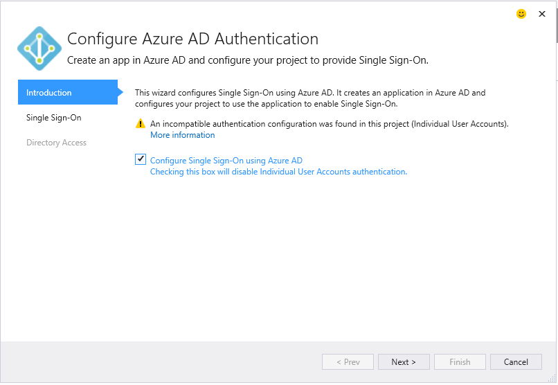

<properties 
   pageTitle="Aggiunta di un Azure Active Directory mediante servizi connessi in Visual Studio | Microsoft Azure"
   description="Aggiungere un Azure Active Directory utilizzando la finestra di dialogo Visual Studio aggiungere servizi connessi"
   services="visual-studio-online"
   documentationCenter="na"
   authors="TomArcher"
   manager="douge"
   editor="" />
<tags 
   ms.service="active-directory"
   ms.devlang="multiple"
   ms.topic="article"
   ms.tgt_pltfrm="na"
   ms.workload="na"
   ms.date="08/15/2016"
   ms.author="tarcher" />

# Aggiunta di un Azure Active Directory mediante servizi connessi in Visual Studio 

##Panoramica
Se si utilizza Azure Active Directory (Azure Active Directory), è possibile supportare Single Sign-On (SSO) per le applicazioni web ASP.NET MVC o l'autenticazione di Active Directory in servizi Web API. Con l'autenticazione di Azure Active Directory, gli utenti possono utilizzare il proprio account da Azure Active Directory per connettersi alle applicazioni web. I vantaggi di Azure Active Directory autenticazione con API Web sono maggiore sicurezza dei dati quando si espongono un'API da un'applicazione web. Con Azure Active Directory, non è necessario gestire un sistema di autenticazione separata con la gestione di account e utente.

## Tipi di progetto supportati

È possibile utilizzare la finestra di dialogo servizi connessi a cui connettersi Azure Active Directory dei seguenti tipi di progetto.

- Progetti MVC ASP.NET

- Progetti dell'API Web ASP.NET

### Connettersi a Azure Active Directory utilizzando la finestra di dialogo servizi connessi

1. Verificare che si possiede un account Azure. Se non si dispone di un account Azure, è possibile iscriversi per una [versione di valutazione gratuita](http://go.microsoft.com/fwlink/?LinkId=518146).

1. In Visual Studio, aprire il menu di scelta rapida del nodo **riferimenti** del progetto e scegliere **Aggiungi servizi connessi**.
1. Selezionare **l'autenticazione di Azure Active Directory** e quindi scegliere **Configura**.

    

1. Nella pagina prima di **configurare Azure Active Directory autenticazione**selezionare **Configura Single Sign-on con Azure Active Directory**.

    Se il progetto è configurato con un'altra configurazione di autenticazione, la procedura guidata avvisa che verrà disattivata continua configurazione precedente.

    

1.  Nella seconda pagina, selezionare un dominio dall'elenco a discesa **dominio** . L'elenco dei domini contiene tutti i domini accessibili da quelli elencati nella finestra di dialogo Impostazioni Account. In alternativa, è possibile immettere un nome di dominio, se non si trova quello che si sta cercando, ad esempio mydomain.onmicrosoft.com. È possibile scegliere l'opzione per creare un nuovo Azure AD app o usare le impostazioni da un'app di Azure Active Directory esistente. 

    

1. Nella terza pagina della procedura guidata, assicurarsi che sia selezionata **leggere i dati di directory** . La procedura guidata di compilazione il **segreto del Client**. 

    

1. Fare clic su **Fine** . La finestra di dialogo aggiunge il codice di configurazione necessarie e riferimenti per consentire il progetto per l'autenticazione di Azure Active Directory. È possibile visualizzare il dominio nel [portale di Azure](http://go.microsoft.com/fwlink/p/?LinkID=525040).

1. Rivedere la pagina Guida introduttiva visualizzata nel browser per alcune idee su passaggi successivi e della pagina non più disponibile per vedere come è stato modificato il progetto. Se si desidera verificare che tutto sia stata eseguita, aprire uno dei file di configurazione modificata e verificare che le impostazioni indicate in Dov'è sono disponibili. Ad esempio config principale in un progetto MVC ASP.NET avrà queste impostazioni aggiunto:

        <appSettings> 
            <add key="ida:ClientId" value="ClientId from the new Azure AD App" />
            <add key="ida:AADInstance" value="https://login.windows.net/" />
            <add key="ida:Domain" value="Your selected domain" />
            <add key="ida:TenantId" value="The Id of your selected Azure AD Tenant" />
            <add key="ida:PostLogoutRedirectUri" value="The default redirect URI from the project" />
        </appSettings>

## Come viene modificato il progetto

Quando si esegue la procedura guidata, verrà aggiunto Azure Active Directory e associati riferimenti al progetto. File di configurazione e file di codice nel progetto vengono modificati anche per aggiungere il supporto per Azure Active Directory. Le modifiche specifiche apportate in Visual Studio dipendono dal tipo di progetto. Per informazioni dettagliate sulla modifica di progetti MVC ASP.NET, vedere [Quali progetti MVC relative](http://go.microsoft.com/fwlink/p/?LinkID=513809). Per i progetti API Web, vedere [Dov'è – progetti API Web](http://go.microsoft.com/fwlink/p/?LinkId=513810).

##Passaggi successivi

Porre domande e ottenere assistenza.

 - [Forum MSDN: Azure AD](https://social.msdn.microsoft.com/forums/azure/home?forum=WindowsAzureAD)

 - [Documentazione di Azure Active Directory](https://azure.microsoft.com/documentation/services/active-directory/)

 - [Post di blog: Introduzione a Azure Active Directory](http://blogs.msdn.com/b/brunoterkaly/archive/2014/03/03/introduction-to-windows-azure-active-directory.aspx)

