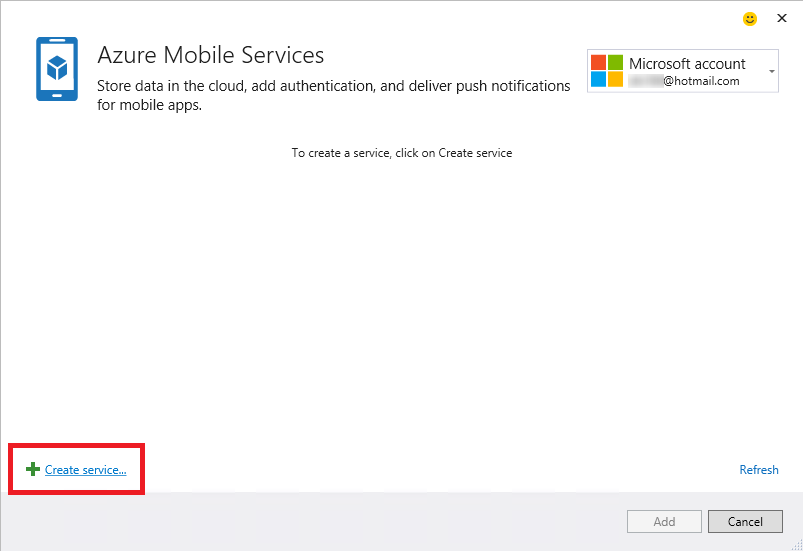
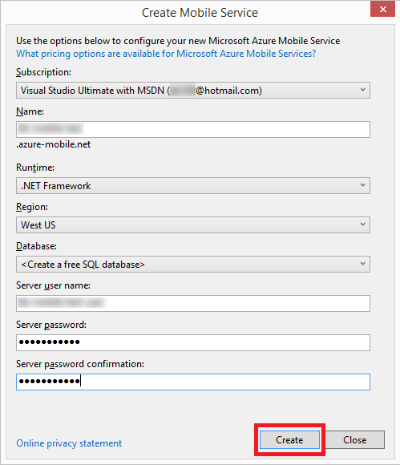

<properties 
   pageTitle="Aggiunta di servizi mobili tramite servizi connessi in Visual Studio | Microsoft Azure"
   description="Aggiungere servizi mobili utilizzando la finestra di dialogo Visual Studio aggiungere servizi connessi"
   services="visual-studio-online"
   documentationCenter="na"
   authors="mlhoop"
   manager="douge"
   editor="" />
<tags 
   ms.service="visual-studio-online"
   ms.devlang="na"
   ms.topic="article"
   ms.tgt_pltfrm="na"
   ms.workload="mobile"
   ms.date="12/16/2015"
   ms.author="mlearned" />

# Aggiunta di servizi Mobile utilizzando Visual Studio connessi Services

Con Visual Studio 2015, è possibile connettersi ai servizi Mobile Azure utilizzando la finestra di dialogo **Aggiungi servizio connessi** . È possibile connettersi da qualsiasi applicazione client c#, qualsiasi app JavaScript o multipiattaforma Cordova app. Una volta che ci si connette, creare e accedere ai dati, creare API personalizzate e programmate o aggiungere il supporto per le notifiche push.  L'operazione di servizi connessi aggiunge tutti i riferimenti appropriati e il codice di connessione. È possibile usufruire di supporto per l'autenticazione con una varietà di combinazioni di identità più comuni, ad esempio Azure Active Directory, Facebook, Twitter e Accounts di Microsoft.

## Tipi di progetto supportati

>[AZURE.NOTE] In Visual Studio 2015, aggiunta di servizi di Windows Azure Mobile a un progetti universale di Windows (Windows 10) utilizzando la finestra di dialogo Aggiungi servizi connessi non è supportato. È possibile aggiungere servizi di Windows Azure Mobile installando i pacchetti appropriati mediante gestione di pacchetto NuGet per il progetto.

Per connettersi ai servizi Mobile Azure seguenti tipi di progetto, è possibile utilizzare la finestra di dialogo servizi connessi.

- Progetti .NET Windows 8.1 Store, telefono e App universale

- Progetti JavaScript Windows 8.1 Store, telefono e App universale

- Progetti creati utilizzando Visual Studio Tools per Apache Cordova

## Connettersi ai servizi Mobile Azure utilizzando la finestra di dialogo Aggiungi servizi connessi

1. Verificare che si possiede un account Azure. Se non si dispone di un account Azure, è possibile iscriversi per una [versione di valutazione gratuita](http://go.microsoft.com/fwlink/?LinkId=518146).

1. Aprire la finestra di dialogo **Aggiungi servizi connessi** .
 - Per le applicazioni .NET, aprire il progetto in Visual Studio, aprire il menu di scelta rapida per il nodo **riferimenti** in Esplora soluzioni e quindi scegliere **Aggiungi servizio connesso**
 
        

 - Per i progetti di app Cordova Apache, aprire il progetto in Visual Studio, aprire il menu di scelta rapida per il nodo del progetto in Esplora soluzioni e quindi scegliere **Aggiungi servizio connessi**.

1. Nella finestra di dialogo **Aggiungi servizio connessi** scegliere **Servizi Mobile di Windows Azure**e quindi fare clic su **Configura** . Potrebbe essere richiesto di accedere a Azure se non è già stato fatto.

    

1. Nella finestra di dialogo **Servizi di dispositivi mobili Windows Azure** , scegliere un servizio per dispositivi mobili esistente se si dispone di uno. Se è necessario creare un nuovo servizio per dispositivi mobili Azure, seguire la procedura seguente per farlo. In caso contrario, andare al passaggio successivo.

    Per creare un nuovo account di servizio mobile:
    1. Selezionare il collegamento **Create Service **nella parte inferiore della finestra di dialogo.
        

    2. Nella finestra di dialogo **Crea servizio Mobile** , è possibile scegliere un servizio di dispositivi mobili back-end JavaScript o un servizio di dispositivi mobili back-end .NET dall'elenco a discesa **Runtime** . 
  
        

        Un servizio di back-end JavaScript è semplice ed efficace. Se si crea un servizio di dispositivi mobili back-end JavaScript, il codice JavaScript sul lato server è archiviato nel cloud, ma è possibile modificare gli script server tramite Esplora Server o il portale di gestione Azure. 

        Un servizio di dispositivi mobili back-end .NET offre la potenza e flessibilità dell'API Web e Framework entità. Se si crea un servizio di dispositivi mobili back-end .NET, un progetto viene creato e aggiunto alla soluzione. 

    1. Scegliere l' **area geografica** in cui si desidera il servizio di dispositivi mobili e quindi immettere un nome utente e password per il server.
 
    1. Dopo aver immesso tutte le informazioni necessarie, scegliere il pulsante **Crea** per creare il servizio per dispositivi mobili.
    2. Il nuovo servizio per dispositivi mobili devono essere visualizzati nell'elenco del servizio nella finestra di dialogo **Servizi di dispositivi mobili Windows Azure** . Scegliere il nuovo servizio per dispositivi mobili nell'elenco e quindi sul pulsante **Aggiungi** per aggiungere il servizio al progetto.
    

1. Esaminare la pagina introduttiva visualizzato e scoprire come è stato modificato il progetto. Ogni volta che si aggiunge un servizio connesso, verrà visualizzata una pagina di introduzione nel browser. È possibile esaminare i passaggi successivi suggeriti ed esempi di codice o passare alla pagina non più disponibile per vedere quali riferimenti sono stati aggiunti al progetto e come i file di configurazione e codice sono stati modificati.

1. Usa gli esempi di codice come una Guida, iniziare a scrivere codice per accedere al servizio mobile!

## Come viene modificato il progetto

Come Visual Studio modifica il progetto dipende dal tipo di progetto. Per c# applicazioni client, vedere [Dov'è – progetti c#](http://go.microsoft.com/fwlink/p/?LinkId=513119). Per le applicazioni client JavaScript, vedere [Dov'è-JavaScript progetti](http://go.microsoft.com/fwlink/p/?LinkId=513120). Per le applicazioni Cordova, vedere [Dov'è – Cordova progetti](http://go.microsoft.com/fwlink/p/?LinkId=513116).

##Passaggi successivi

Porre domande e ottenere assistenza: 

 - [Forum MSDN: Servizi di telefonia Mobile Azure](https://social.msdn.microsoft.com/forums/azure/home?forum=azuremobile)

 - [Azure Mobile servizi blog del Team di Microsoft Azure](https://azure.microsoft.com/blog/topics/mobile/)

 - [Azure servizi Mobile azure.microsoft.com](https://azure.microsoft.com/services/mobile-services/)

 - [Documentazione Azure servizi mobili azure.microsoft.com](https://azure.microsoft.com/documentation/services/mobile-services/)

