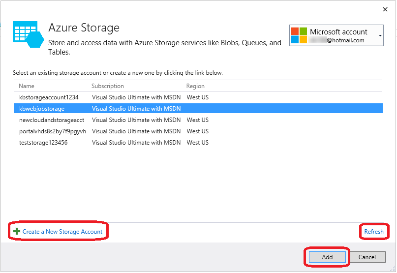

<properties 
   pageTitle="Aggiungere spazio di archiviazione di Azure con servizi connessi in Visual Studio | Microsoft Azure"
   description="Aggiungere lo spazio di archiviazione di Azure all'app utilizzando la finestra di dialogo Visual Studio aggiungere servizi connessi"
   services="visual-studio-online"
   documentationCenter="na"
   authors="TomArcher"
   manager="douge"
   editor="" />
<tags 
   ms.service="storage"
   ms.devlang="na"
   ms.topic="article"
   ms.tgt_pltfrm="na"
   ms.workload="na"
   ms.date="08/15/2016"
   ms.author="tarcher" />

# Aggiunta di spazio di archiviazione Azure mediante Visual Studio connessi Services

## Panoramica

Con Visual Studio 2015, è possibile connettersi qualsiasi servizio cloud c#, servizio mobile back-end .NET, sito Web ASP.NET o servizio, servizio ASP.NET 5 o servizio Azure WebJob allo spazio di archiviazione di Azure utilizzando la finestra di dialogo **Aggiungi servizi connessi** . La funzionalità di servizio collegati aggiunge tutti i riferimenti richiesti e codice di connessione e modifica dei file di configurazione in modo appropriato. La finestra di dialogo visualizzata anche la documentazione indicante che cosa sono i passaggi per iniziare a archiviazione blob, code e tabelle.

## Tipi di progetto supportati

Per connettersi a archiviazione Azure seguenti tipi di progetto, è possibile utilizzare la finestra di dialogo servizi connessi.

- Progetti Web ASP.NET

- ASP.NET 5 progetti

- Ruolo Web servizio cloud di .NET e lavoro ruolo progetti

- Progetti di servizi mobili .NET

- Progetti WebJob Azure

## Connettersi a archiviazione Azure utilizzando la finestra di dialogo servizi connessi

1. Verificare che si possiede un account Azure. Se non si dispone di un account Azure, è possibile iscriversi per una [versione di valutazione gratuita](http://go.microsoft.com/fwlink/?LinkId=518146). Dopo avere creato un account Azure, è possibile creare gli account di archiviazione, creare servizi mobili e configurare Azure Active Directory.

1. Aprire il progetto in Visual Studio, aprire il menu di scelta rapida per il nodo **riferimenti** in Esplora soluzioni e quindi scegliere **Aggiungi servizio connessi**.

    

1. Nella finestra di dialogo **Aggiungi servizio connessi** scegliere **Lo spazio di archiviazione di Azure**e quindi fare clic su **Configura** . Potrebbe essere richiesto di accedere a Azure se non è già stato fatto.

    

1. Nella finestra di dialogo **Archiviazione Azure** , selezionare un account di archiviazione esistente e selezionare **Aggiungi**.

    Se è necessario creare un nuovo account di archiviazione, andare al passaggio successivo. In caso contrario, andare al passaggio 6.

    

1. Per creare un nuovo account di archiviazione: 

    1. Fare clic sul pulsante **Crea un nuovo Account di archiviazione** nella parte inferiore della finestra di dialogo archiviazione Azure.

    1. Compilare la finestra di dialogo **Crea Account lo spazio di archiviazione** e quindi fare clic sul pulsante **Crea** .
    
        

        Quando si torna nella finestra di dialogo **Archiviazione Azure** , l'archiviazione di nuovo visualizzato nell'elenco.

    1. Selezionare nuovo archivio nell'elenco e selezionare **Aggiungi**.

1. Il servizio di archiviazione connessi nel nodo Riferimenti al servizio del progetto WebJob.

    

1. Rivedere la pagina Guida introduttiva visualizzato e scoprire come è stato modificato il progetto. Ogni volta che si aggiunge un servizio connesso, verrà visualizzata una pagina di introduzione nel browser. È possibile esaminare i passaggi successivi suggeriti ed esempi di codice o passare alla pagina non più disponibile per vedere quali riferimenti sono stati aggiunti al progetto e come i file di configurazione e codice sono stati modificati.

## Come viene modificato il progetto

Dopo aver terminato la finestra di dialogo, Visual Studio aggiunge riferimenti e modifica alcuni file di configurazione. Le modifiche specifiche dipendono dal tipo di progetto. 

 - Per i progetti ASP.NET, vedere [Dov'è – progetti ASP.NET](http://go.microsoft.com/fwlink/p/?LinkId=513126). 
 - Per i progetti ASP.NET 5, vedere [Dov'è – ASP.NET 5 progetti](http://go.microsoft.com/fwlink/p/?LinkId=513124). 
 - Per il cloud progetti di servizio (ruoli web ruoli e lavoro), vedere [Dov'è-servizio Cloud progetti](http://go.microsoft.com/fwlink/p/?LinkId=516965). 
 - Per i progetti WebJob, vedere [Dov'è-WebJob progetti](./storage/vs-storage-webjobs-what-happened.md).

## Passaggi successivi

1. Usare la Guida introduttiva esempi di codice come una Guida, creare il tipo di spazio di archiviazione che si desidera e quindi iniziare a scrivere codice per accedere all'account di archiviazione!

1. Porre domande e ottenere assistenza
     - [Forum MSDN: Archiviazione di Azure](https://social.msdn.microsoft.com/forums/azure/home?forum=windowsazuredata)

     - [Blog del Team di archiviazione Azure](http://blogs.msdn.com/b/windowsazurestorage/)

     - [Spazio di archiviazione azure.microsoft.com](https://azure.microsoft.com/services/storage/)

     - [Documentazione di spazio di archiviazione in azure.microsoft.com](https://azure.microsoft.com/documentation/services/storage/)

