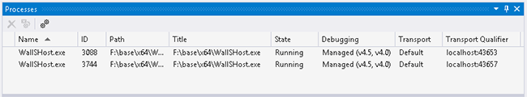
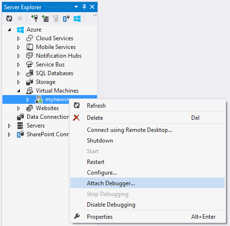
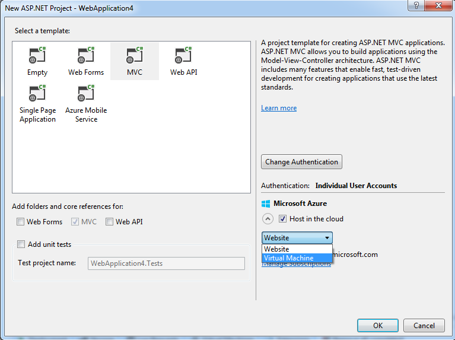

<properties 
    pageTitle="Il debug di un servizio cloud Azure o una macchina virtuale in Visual Studio | Microsoft Azure"
    description="Il debug di un servizio Cloud o la macchina virtuale in Visual Studio"
    services="visual-studio-online"
    documentationCenter="na"
    authors="TomArcher"
    manager="douge"
    editor="" />
<tags 
    ms.service="visual-studio-online"
    ms.devlang="multiple"
    ms.topic="article"
    ms.tgt_pltfrm="multiple"
    ms.workload="na"
    ms.date="08/15/2016"
    ms.author="tarcher" />

# Il debug di un servizio cloud Azure o una macchina virtuale in Visual Studio

Visual Studio offre diverse opzioni per il debug di servizi cloud Azure e macchine virtuali.

## Eseguire il debug il servizio cloud nel computer locale

È possibile risparmiare tempo e denaro mediante la Azure calcolare emulatore per eseguire il debug il servizio cloud in un computer locale. Tramite il debug di un servizio in locale prima di distribuirlo, è possibile migliorare l'affidabilità e le prestazioni senza una elaborazione a pagamento. Tuttavia, potrebbero verificarsi alcuni errori solo quando si esegue un servizio cloud in Azure stesso. È possibile eseguire il debug di questi errori se si abilita il debug remoto quando si pubblica il servizio e il debug di un'istanza del ruolo.

L'emulatore simula il servizio di Azure calcolare e viene eseguita nel proprio ambiente locale in modo che è possibile testare ed eseguire il debug il servizio cloud prima di distribuirlo. L'emulatore gestisce il ciclo di vita delle istanze del ruolo e consente di accedere alle risorse simulate, ad esempio archivio locale. Quando si esegue il debug o eseguire il servizio da Visual Studio, viene avviata automaticamente l'emulatore come un'applicazione di sfondo e quindi distribuisce il servizio all'emulatore. È possibile utilizzare l'emulatore per visualizzare il servizio quando viene eseguito in ambiente locale. È possibile eseguire la versione completa o la versione express dell'emulatore. (A partire da Azure 2.3, la versione express dell'emulatore è il valore predefinito) Vedere [emulatore utilizzando Express esecuzione e il Debug di un servizio Cloud in locale](https://msdn.microsoft.com/library/dn339018.aspx).

### Eseguire il debug il servizio cloud nel computer locale

1. Sulla barra dei menu scegliere **Debug** **Avvia debug** per eseguire il progetto di servizio cloud Azure. In alternativa, è possibile premere F5. Verrà visualizzato un messaggio emulatore di calcolo in fase di avvio. Quando si avvia l'emulatore, nell'area di notifica di sistema per conferma.

    

1. Visualizzare l'interfaccia utente per l'emulatore di calcolo, aprire il menu di scelta rapida per l'icona Azure nell'area di notifica e quindi selezionare **Mostra interfaccia utente di emulatore calcolare**.

    Riquadro a sinistra dell'interfaccia utente vengono illustrati i servizi attualmente installati nell'emulatore di calcolo e le istanze di ruolo che ogni servizio è in esecuzione. È possibile scegliere il servizio o i ruoli per visualizzare ciclo di vita, registrazione e informazioni di diagnostica nel riquadro destro. Se si inserisce lo stato attivo nel margine superiore di una finestra incluso, si espande per riempire riquadro a destra.

1. Passaggio tramite l'applicazione selezionando i comandi del menu **Debug** e impostare i punti di interruzione nel codice. Durante l'esecuzione dell'applicazione nella verrà, i riquadri vengono aggiornati con lo stato corrente dell'applicazione. Quando si interrompe il debug, viene eliminata la distribuzione dell'applicazione. Se l'applicazione include un ruolo web ed è stata impostata la proprietà azione di avvio per avviare il web browser, Visual Studio avvia l'applicazione web nel browser. Se si modifica il numero di istanze di un ruolo nella configurazione del servizio, è necessario arrestare il servizio cloud e quindi riavviare il debug in modo che è possibile eseguire il debug di queste nuove istanze del ruolo.

    **Nota:** Quando si interrompe esecuzione o il debug del servizio, il calcolo locale emulatore ed emulatore lo spazio di archiviazione non interrotti. È necessario interrompere loro in modo esplicito dall'area di notifica.

## Eseguire il debug di un servizio cloud di Azure

Per eseguire il debug di un servizio cloud da un computer remoto, è necessario abilitare la funzionalità in modo esplicito quando si distribuisce il servizio cloud, in modo che sia necessario servizi (ad esempio msvsmon.exe) vengono installati in macchine virtuali che eseguono le istanze del ruolo. Se non si è attiva il debug remoto quando è stato pubblicato il servizio, è necessario ripubblicare il servizio con il debug remoto attivato.

Se si abilita il debug remoto per un servizio cloud, non presentano negativamente sulle prestazioni o sostenere costi aggiuntivi. Non è consigliabile utilizzare il debug remoto in un servizio di produzione, poiché potrebbe influire negativamente sulle client che usano il servizio.

>[AZURE.NOTE] Quando si pubblica un servizio cloud da Visual Studio, è possibile abilitare **IntelliTrace** per i ruoli di tale servizio destinati a .NET Framework 4 o .NET Framework 4.5. Tramite **IntelliTrace**, è possibile esaminare gli eventi che si sono verificati in un'istanza di ruoli in passato e riprodurre il contesto di un'ora specifica. Vedere [debug di un servizio cloud pubblicato con traccia di diagnostica e Visual Studio](http://go.microsoft.com/fwlink/?LinkID=623016) e [Tramite IntelliTrace](https://msdn.microsoft.com/library/dd264915.aspx).

### Per attivare il debug remoto per un servizio cloud

1. Aprire il menu di scelta rapida per il progetto Azure e quindi selezionare **pubblica**.

1. Selezionare l'ambiente di **gestione temporanea** e la configurazione di **Debug** .

    Verrà visualizzata solo linee guida. È possibile scegliere di eseguire gli ambienti di test in un ambiente di produzione. Tuttavia, si potrebbero influire negativamente sulle utenti se si abilita il debug remoto nell'ambiente di produzione. È possibile scegliere la configurazione di rilascio, ma la configurazione di Debug rende il debug più semplice.

    

1. Seguire la procedura normale, ma selezionare la casella di controllo **Abilita Debugger remoto per tutti i ruoli** nella scheda **Impostazioni avanzate** .

    

### Il debug in un servizio cloud in Azure

1. In Esplora Server espandere il nodo per il servizio cloud.

1. Aprire il menu di scelta rapida per il ruolo o istanza del ruolo da allegare e quindi selezionare **Debugger allegare**.

    Se il debug di un ruolo, verrà Visual Studio connesso a ogni istanza di tale ruolo. Si verifica sarà un'interruzione in un punto di interruzione per la prima istanza di ruolo eseguito dalla riga di codice che soddisfa le condizioni di tale punto di interruzione. Se si esegue il debug di un'istanza di debugger è collegato a solo quell'istanza e interruzioni in un punto di interruzione solo quando quell ' istanza viene eseguita la riga di codice e soddisfa le condizioni del punto di interruzione.

    

1. Dopo verrà si connette a un'istanza, eseguire il debug come di consueto. Verrà si connette automaticamente al processo di host appropriato per il proprio ruolo. A seconda che cos'è il ruolo verrà connette w3wp.exe, WaWorkerHost.exe o WaIISHost.exe. Per verificare che il processo a cui è associato verrà, espandere il nodo dell'istanza in Esplora Server. Per ulteriori informazioni sui processi Azure, vedere [Architettura di ruolo Azure](http://blogs.msdn.com/b/kwill/archive/2011/05/05/windows-azure-role-architecture.aspx) .

    

1. Per identificare i processi a cui è associato verrà, aprire la finestra di dialogo processi, dal menu, scegliere Debug, Windows, processi. (Tastiera: Ctrl + Alt + Z) Per scollegare un processo specifico, aprire il menu di scelta rapida e quindi selezionare **Disconnetti processo**. O, individuare il nodo dell'istanza in Esplora Server, individuare il processo, aprire il menu di scelta rapida e quindi selezionare **Disconnetti processo**.

    

>[AZURE.WARNING] Evitare interruzioni lunghi interruzione quando remote debug. Azure considera un processo che è in sospeso per più di pochi minuti come non risponde e smette di inviare il traffico a tale istanza. Se si interrompe troppo a lungo, msvsmon.exe si disconnette dal processo.

Per scollegare verrà da tutti i processi nel proprio istanza o ruolo, aprire il menu di scelta rapida per il ruolo o istanza che si sta eseguendo il debug e quindi selezionare **Disconnetti Debugger**.

## Limitazioni del debug remoto Azure

Da Azure SDK 2.3, il debug remoto comporta le limitazioni seguenti.

- Con il debug remoto attivato, non è possibile pubblicare un servizio cloud in cui qualsiasi ruolo dispone di più di 25 istanze.

- Verrà utilizza le porte 30400 a 30424, 31400 a 31424 e 32400 a 32424. Se si tenta di utilizzare una di queste porte, non sarà possibile pubblicare il servizio e uno dei seguenti messaggi di errore verrà visualizzato nel log delle attività per Azure: 

    - Errore di convalida file cscfg nel file di .csdef. 
    La porta riservata intervallo "intervallo" per l'endpoint Microsoft.WindowsAzure.Plugins.RemoteDebugger.Connector del ruolo 'ruolo' si sovrappone a una porta già definita o un intervallo.
    - Assegnazione non è riuscita. Riprovare in seguito, provare a ridurre la dimensione memoria virtuale o il numero di istanze del ruolo o provare la distribuzione in un'area diversa.

## Il debug macchine virtuali di Azure

È possibile eseguire il debug di programmi in esecuzione in macchine virtuali di Azure tramite Esplora Server in Visual Studio. Quando si abilita il debug remoto in un computer virtuale Azure, Azure installa l'estensione di debug remoto sul computer virtuale. Quindi, è possibile connettersi a processi sul computer virtuale e debug come di consueto.

>[AZURE.NOTE] Macchine virtuali create attraverso lo stack di manager delle risorse Azure può essere eseguite in modalità remota da utilizzare Gestione Cloud in Visual Studio 2015. Per ulteriori informazioni, vedere [Gestione di risorse Azure con Esplora risorse Cloud](http://go.microsoft.com/fwlink/?LinkId=623031).

### Per eseguire il debug una macchina virtuale Azure

1. In Esplora Server espandere il nodo macchine virtuali e selezionare il nodo della macchina virtuale che si desidera eseguire il debug.

1. Aprire il menu di scelta rapida e selezionare **Attiva debug**. Quando viene richiesto se si è sicuri se si desidera attivare il debug sul computer virtuale, selezionare **Sì**.

    Azure installa l'estensione di debug remoto sul computer virtuale per attivare il debug.

    

    

1. Al termine l'estensione di debug remoto l'installazione, aprire il menu di scelta rapida della macchina virtuale e selezionare **Allegare Debugger**

    Azure riceve un elenco dei processi sul computer virtuale e li visualizza nella finestra Connetti a processo finestra di dialogo.

    

1. Nella finestra di dialogo **Connetti a processo** selezionare **Selezionare** per limitare l'elenco dei risultati per visualizzare solo i tipi di codice che per eseguire il debug. È possibile eseguire il debug di codice a 32 o 64 bit gestito, codice nativo o entrambe.

    

1. Selezionare i processi che si desidera eseguire il debug sul computer virtuale e quindi selezionare **Connetti**. È possibile, ad esempio, il processo di w3wp.exe se si desidera eseguire il debug di un'app web sul computer virtuale. Per ulteriori informazioni, vedere [eseguire il Debug uno o più processi in Visual Studio](https://msdn.microsoft.com/library/jj919165.aspx) e [Architettura ruolo Azure](http://blogs.msdn.com/b/kwill/archive/2011/05/05/windows-azure-role-architecture.aspx) .

## Creare un progetto web e una macchina virtuale per il debug

Prima di pubblicare il progetto Azure, può risultare utile per eseguire il test in un ambiente contenuto che supporta il debug e scenari di test e in cui è possibile installare il test e i programmi di controllo. È possibile eseguire questa operazione è eseguire il debug remoto l'app in un computer virtuale.

Progetti di Visual Studio ASP.NET offrono un'opzione per creare una macchina virtuale comodo che è possibile utilizzare per il test di app. La macchina virtuale include endpoint normalmente richiesti, ad esempio PowerShell, desktop remoto e WebDeploy.

### Per creare un progetto web e una macchina virtuale per il debug

1. In Visual Studio, creare una nuova applicazione Web ASP.NET.

1. Nella finestra di dialogo Nuovo progetto ASP.NET nella sezione Azure scegliere **macchina virtuale** nella casella di riepilogo a discesa. Lasciare selezionata la casella di controllo **crea risorse remote** . Fare clic su **OK** per continuare.

    Viene visualizzata la finestra di dialogo **Crea macchina virtuale in Azure** .

    

    **Nota:** Verrà richiesto di accedere al proprio account Azure se è ancora effettuato l'accesso.

1. Selezionare le varie impostazioni per la macchina virtuale e fare clic su **OK**. Per ulteriori informazioni, vedere [macchine virtuali]( http://go.microsoft.com/fwlink/?LinkId=623033) .

    Il nome che immesso per nome DNS sarà il nome del computer virtuale. 

    

    Azure crea disposizioni e macchina virtuale e configura i punti finali, ad esempio Desktop remoto e distribuzione Web

1. Dopo la macchina virtuale completamente configurata, selezionare il nodo della macchina virtuale in Esplora Server.

1. Aprire il menu di scelta rapida e selezionare **Attiva debug**. Quando viene richiesto se si è sicuri se si desidera attivare il debug sul computer virtuale, selezionare **Sì**. 

    Azure consente di installare l'estensione di debug remoto macchina virtuale per attivare il debug.

    

    

1. Pubblicare il progetto come descritto in [procedura: distribuire un Web progetto tramite pubblicazione con un clic in Visual Studio](https://msdn.microsoft.com/library/dd465337.aspx). Perché si desidera eseguire il debug del computer virtuale, nella pagina **Impostazioni** della creazione guidata **Pubblicazione Web** selezionare **Debug** come la configurazione. In questo modo che i simboli di codice sono disponibili durante il debug.

    

1. Nelle **Opzioni di pubblicazione di File**, selezionare **Rimuovi altri file di destinazione** se il progetto è già stato distribuito in precedenza.

1. Dopo il progetto pubblica, nel menu di scelta rapida della macchina virtuale in Esplora Server selezionare **Allegare Debugger**

    Azure riceve un elenco dei processi sul computer virtuale e li visualizza nella finestra Connetti a processo finestra di dialogo.

    

1. Nella finestra di dialogo **Connetti a processo** selezionare **Selezionare** per limitare l'elenco dei risultati per visualizzare solo i tipi di codice che per eseguire il debug. È possibile eseguire il debug di codice a 32 o 64 bit gestito, codice nativo o entrambe.

    

1. Selezionare i processi che si desidera eseguire il debug sul computer virtuale e quindi selezionare **Connetti**. È possibile, ad esempio, il processo di w3wp.exe se si desidera eseguire il debug di un'app web sul computer virtuale. Per ulteriori informazioni, vedere [eseguire il Debug uno o più processi in Visual Studio](https://msdn.microsoft.com/library/jj919165.aspx) .

## Passaggi successivi

- Utilizzare **Intellitrace** per raccogliere un file di log delle chiamate e gli eventi da un server di rilascio. Vedere [debug di un servizio Cloud pubblicato con traccia di diagnostica e Visual Studio](http://go.microsoft.com/fwlink/?LinkID=623016).
- Utilizzare **Azure diagnostica** per registrare informazioni dettagliate dal codice in esecuzione all'interno di ruoli, se i ruoli in esecuzione nell'ambiente di sviluppo o in Azure. Vedere [registrazione di raccolta dati tramite diagnostica Azure](http://go.microsoft.com/fwlink/p/?LinkId=400450).
