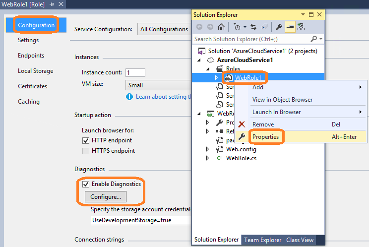
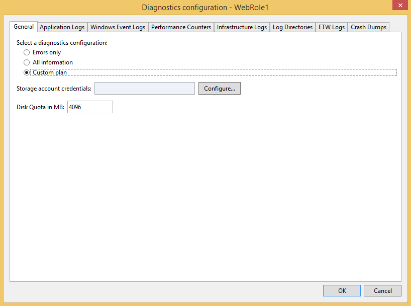
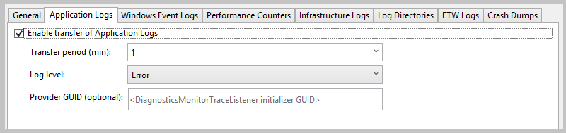
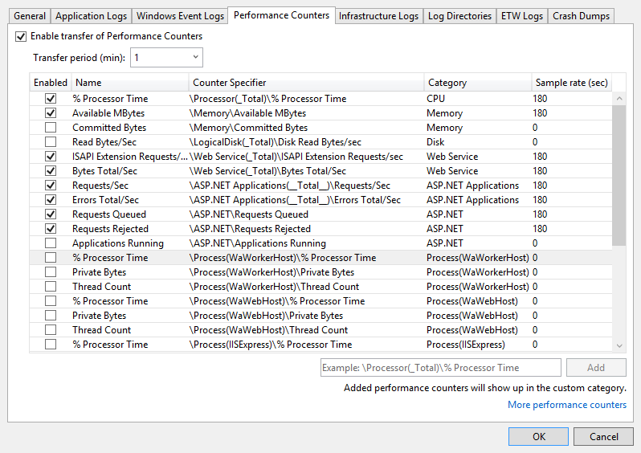
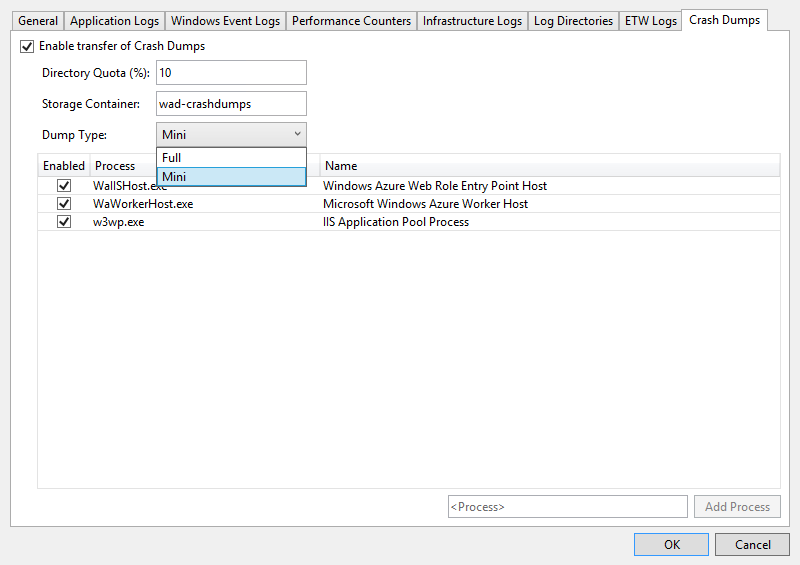
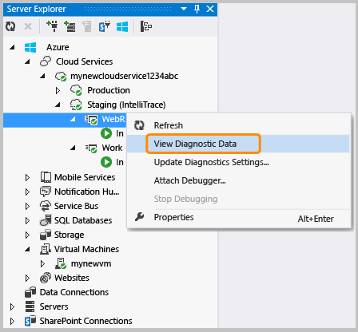
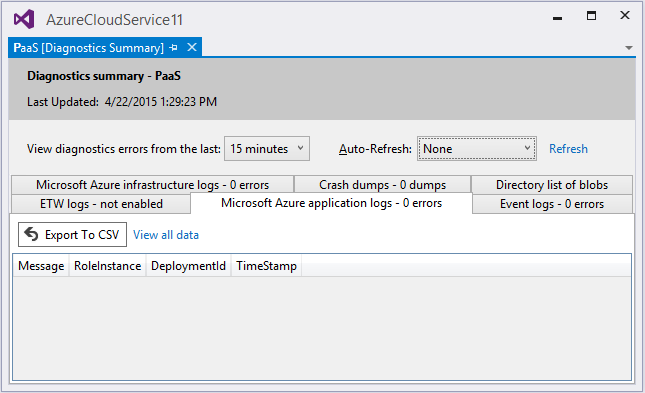

<properties
   pageTitle="Configurazione di diagnostica per servizi Cloud Azure e macchine virtuali | Microsoft Azure"
   description="Descrive come configurare le informazioni di diagnostica per il debug di servizi di Azure cloude macchine () in Visual Studio."
   services="visual-studio-online"
   documentationCenter="na"
   authors="TomArcher"
   manager="douge"
   editor="" />
<tags
   ms.service="multiple"
   ms.devlang="dotnet"
   ms.topic="article"
   ms.tgt_pltfrm="na"
   ms.workload="multiple"
   ms.date="08/15/2016"
   ms.author="tarcher" />

# <a name="configuring-diagnostics-for-azure-cloud-services-and-virtual-machines"></a>Configurazione di diagnostica per servizi Cloud Azure e macchine virtuali

Quando è necessario risolvere i problemi di un servizio cloud Azure o una macchina virtuale Azure, è possibile configurare più facilmente diagnostica Windows Azure mediante Visual Studio. Diagnostica Windows Azure consente di acquisire i dati di sistema e la registrazione dati in macchine virtuali e le istanze di macchina virtuale che eseguono il servizio cloud e trasferisce i dati in un account di archiviazione di propria scelta. Per ulteriori informazioni sulla registrazione in Azure diagnostica, vedere [attivare la registrazione diagnostica per App web di Azure App servizio](./app-service-web/web-sites-enable-diagnostic-log.md) .

In questo argomento viene illustrato come abilitare e configurare diagnostica Windows Azure in Visual Studio, prima e dopo la distribuzione, oltre che in macchine virtuali di Azure. Viene inoltre come selezionare i tipi di informazioni di diagnostica per raccogliere e su come visualizzare le informazioni dopo che è raccolta.

È possibile configurare Azure diagnostica nei modi seguenti:

- È possibile modificare le impostazioni di configurazione di diagnostica tramite la finestra di dialogo **Configurazione di diagnostica** in Visual Studio. Le impostazioni vengono salvate in un file denominato diagnostics.wadcfgx (diagnostics.wadcfg in Azure SDK 2,4 o versioni precedenti). In alternativa, è possibile modificare direttamente il file di configurazione. Se si aggiorna manualmente il file, le modifiche alla configurazione avranno effetto successiva ora si distribuisce il cloud service Azure o eseguire il servizio nell'emulatore.

- Utilizzare **Cloud Explorer** o **Esplora Server** in Visual Studio per modificare le impostazioni di diagnostica per un servizio cloud in esecuzione o la macchina virtuale.

## <a name="azure-26-diagnostics-changes"></a>Modifiche di diagnostica Azure 2.6

Per i progetti di Azure SDK 2.6 in Visual Studio, sono state apportate modifiche seguenti. (Le modifiche applicate anche alle versioni più recenti di Azure SDK).

- Emulatore locale supporta ora diagnostica. Indica che è possibile raccogliere dati di diagnostica e assicurarsi che l'applicazione consiste nel creare tracce destra mentre sta sviluppare e testare in Visual Studio. La stringa di connessione `UseDevelopmentStorage=true` consente di raccogliere dati di diagnostica mentre si esegue il progetto di servizio cloud in Visual Studio utilizzando emulatore archiviazione Azure. Tutti i dati di diagnostica vengono raccolte nell'account di archiviazione (spazio di archiviazione di sviluppo).

- La stringa di connessione di diagnostica lo spazio di archiviazione account (Microsoft.WindowsAzure.Plugins.Diagnostics.ConnectionString) verrà archiviata nuovo file di configurazione (. cscfg) del servizio. L'account di archiviazione di diagnostica Azure SDK 2,5 stato specificato nel file diagnostics.wadcfgx.

Esistono alcune importanti differenze tra come stringa di connessione ha esito positivo in Azure SDK 2,4 e versioni precedenti e sul suo funzionamento in Azure SDK 2.6 e versioni successive.

- In Azure SDK 2,4 e versioni precedenti, la stringa di connessione è stata utilizzata come un runtime il plug-in di diagnostica per ottenere le informazioni sull'account di archiviazione per trasferire i registri di diagnostica.

- In Azure SDK 2.6 e versioni successive, la stringa di connessione di diagnostica viene utilizzata da Visual Studio per configurare l'estensione di diagnostica con le informazioni sull'account di archiviazione appropriato durante la pubblicazione. La stringa di connessione consente di definire gli account di archiviazione diversi per le configurazioni di servizi diversa utilizzate Visual Studio per la pubblicazione. Tuttavia, poiché il plug-in di diagnostica non è più disponibile (dopo aver Azure SDK 2,5), il file cscfg autonomamente non è possibile attivare l'estensione di diagnostica. È necessario attivare l'estensione separatamente tramite strumenti, ad esempio Visual Studio o PowerShell.

- Per semplificare il processo di configurazione l'estensione di diagnostica con PowerShell, l'output di pacchetto da Visual Studio contiene anche pubblico XML di configurazione per l'estensione di diagnostica per ogni ruolo. Visual Studio utilizza la stringa di connessione di diagnostica per compilare le informazioni sull'account di archiviazione presente nella configurazione del pubblica. I file di configurazione pubblico creati nella cartella estensioni e seguono il modello PaaSDiagnostics. &lt;RoleName >. PubConfig.xml. Le distribuzioni di PowerShell in base a è possono utilizzare questo modello per eseguire il mapping di ogni configurazione a un ruolo.

- La stringa di connessione nel file cscfg viene usata anche dal [portale di Azure](http://go.microsoft.com/fwlink/p/?LinkID=525040) per accedere ai dati di diagnostica in modo che può essere visualizzati nella scheda **monitoraggio** . Per configurare il servizio per visualizzare dati di monitoraggio dettagliati nel portale è necessaria la stringa di connessione.

## <a name="migrating-projects-to-azure-sdk-26-and-later"></a>Migrazione di progetti di Azure SDK 2.6 e versioni successive

Durante la migrazione da Azure SDK 2,5 a Azure SDK 2.6 o versione successiva, se si dispone di un account di archiviazione di diagnostica specificato nel file .wadcfgx, quindi rimarrà non esiste. Per sfruttare la possibilità di utilizzare gli account di archiviazione diversi per le configurazioni di archiviazione diversa, è necessario aggiungere manualmente la stringa di connessione al progetto. Se si sta eseguendo la migrazione di un progetto da Azure SDK 2,4 o versione precedente a Azure SDK 2.6, le stringhe di connessione di diagnostica vengono mantenute. Tuttavia, tenere presente le modifiche in come stringhe di connessione sono considerate Azure SDK 2.6 specificato nella sezione precedente.

### <a name="how-visual-studio-determines-the-diagnostics-storage-account"></a>Come Visual Studio determina l'account di archiviazione di diagnostica

- Se si specifica una stringa di connessione di diagnostica nel file cscfg, Visual Studio viene utilizzato per configurare l'estensione di diagnostica per la pubblicazione e per generare i file xml di configurazione pubblico durante imballaggio.

- Se nessuna stringa di connessione di diagnostica viene specificata nel file cscfg, quindi Visual Studio ricorre all'utilizzo dell'account di archiviazione specificato nel file .wadcfgx per configurare l'estensione di diagnostica quando la pubblicazione e generare i file xml di configurazione pubblico quando imballaggio.

- La stringa di connessione di diagnostica nel file cscfg ha la precedenza su account di archiviazione nel file .wadcfgx. Se si specifica una stringa di connessione di diagnostica nel file cscfg, Visual Studio utilizza che e ignora l'account di archiviazione in .wadcfgx.

### <a name="what-does-the-update-development-storage-connection-strings-checkbox-do"></a>Che cosa indica la "aggiornamento sviluppo archiviazione stringhe di connessione..." casella di controllo fare?

La casella di controllo **Aggiorna sviluppo dello spazio di archiviazione le stringhe di connessione di diagnostica e memorizzazione nella cache con le credenziali dell'account di archiviazione Microsoft Azure durante la pubblicazione in Microsoft Azure** offre un modo comodo per aggiornare tutte le stringhe di connessione di sviluppo dello spazio di archiviazione account con l'account di archiviazione Azure specificato durante la pubblicazione.

Si supponga ad esempio si seleziona questa casella di controllo e la stringa di connessione di diagnostica specifica `UseDevelopmentStorage=true`. Quando si pubblica il progetto in Azure, Visual Studio viene aggiornato automaticamente la stringa di connessione di diagnostica con l'account di archiviazione specificato nella creazione guidata pubblicazione. Tuttavia, se è stato specificato un account di archiviazione reale come stringa di connessione diagnostica, quindi quell'account viene usato.

## <a name="diagnostics-functionality-differences-between-azure-sdk-24-and-earlier-and-azure-sdk-25-and-later"></a>Differenze di funzionalità di diagnostica tra Azure SDK 2,4 e versioni precedenti e Azure SDK 2,5 e versioni successive

Se si sta aggiornando un progetto da Azure SDK 2,4 a Azure SDK 2.5 o versione successiva, è necessario tenere in considerazione le differenze di funzionalità di diagnostica seguenti.

- **API di configurazione sono obsoleti** -configurazione livello di programmazione di diagnostica è disponibile in Azure SDK 2,4 o versioni precedenti, ma è deprecata in Azure SDK 2.5 e versioni successive. Se la configurazione di diagnostica attualmente è stata definita nel codice, sarà necessario riconfigurare tali impostazioni da zero nel progetto migrato affinché diagnostica per continuare a lavorare. File di configurazione di diagnostica per Azure SDK 2,4 è diagnostics.wadcfg e diagnostics.wadcfgx per Azure SDK 2.5 e versioni successive.

- **Diagnostica per le applicazioni di servizio cloud può essere configurata solo a livello di ruolo, non a livello di istanza.**

- **Ogni volta che si distribuisce l'app, la configurazione di diagnostica viene aggiornata** , possono verificarsi problemi di uniformità se si modifica la configurazione di diagnostica da Esplora Server e quindi ridistribuita l'app.

- **In file di configurazione di diagnostica, non nel codice sono configurati in Azure SDK 2,5 e immagini della versione successive, arresto anomalo del sistema** -se hai anomalo configurato nel codice, è necessario trasferire manualmente la configurazione dal codice in file di configurazione, perché l'anomalo Azure SDK 2.6 non vengono trasferiti durante la migrazione.

## <a name="enable-diagnostics-in-cloud-service-projects-before-deploying-them"></a>Attivare la diagnostica in progetti di servizi cloud prima di distribuirle

In Visual Studio, è possibile scegliere la raccolta di dati di diagnostica per i ruoli che eseguono in Azure, quando si esegue il servizio nell'emulatore prima di distribuirlo. Tutte le modifiche alle impostazioni di diagnostica in Visual Studio vengono salvate nel file di configurazione diagnostics.wadcfgx. Queste impostazioni di configurazione specificano l'account di archiviazione in cui sono salvati i dati di diagnostica quando si distribuisce il servizio cloud.

### <a name="to-enable-diagnostics-in-visual-studio-before-deployment"></a>Per attivare la diagnostica in Visual Studio prima della distribuzione

1. Dal menu di scelta rapida per il ruolo di cui si è interessati, scegliere **proprietà**e quindi scegliere la scheda **configurazione** nella finestra delle **proprietà** del ruolo.

1. Nella sezione **diagnostica** assicurarsi che sia selezionata la casella di controllo **Abilita diagnostica** .

    

1. Scegliere i puntini di sospensione (…) per specificare l'account di archiviazione in cui si desidera archiviare i dati di diagnostica. Account di archiviazione che scelto sarà il percorso di memorizzazione dei dati di diagnostica.

    

1. Nella finestra di dialogo **Crea stringa di connessione di spazio di archiviazione** , specificare se si desidera connettersi tramite un abbonamento Azure, lo spazio di archiviazione di emulatore Azure o immettono manualmente le credenziali.

    

  - Se si sceglie di Microsoft Azure emulatore lo spazio di archiviazione, la stringa di connessione sia impostata su UseDevelopmentStorage = true.

  - Se si sceglie l'opzione l'abbonamento, è possibile scegliere la sottoscrizione di Azure che si desidera utilizzare e il nome dell'account. È possibile scegliere il pulsante Gestisci account per gestire le sottoscrizioni Azure.

  - Se si sceglie l'opzione credenziali immesso manualmente, viene chiesto di immettere il nome e la chiave dell'account Azure che si desidera utilizzare.

1. Fare clic sul pulsante **Configura** per visualizzare la finestra di dialogo **configurazione di diagnostica** . Ogni scheda (ad eccezione dei **generali** e **Directory Log**) rappresenta un'origine dati di diagnostica che è possibile raccogliere. La scheda predefinita **Generale**, sono disponibili le seguenti opzioni di raccolta dati di diagnostica: **solo errori**, **tutte le informazioni**e **pianificare personalizzata**. L'opzione predefinita, **solo gli errori**, richiede la quantità minima di spazio di archiviazione poiché non di trasferimento avvisi o messaggi di analisi. L'opzione tutte le informazioni trasferisce la maggior parte delle informazioni e, pertanto, l'opzione più costosa in termini di spazio di archiviazione.

    

1. In questo esempio, selezionare l'opzione **piano personalizzato** in modo che è possibile personalizzare i dati raccolti.

1. La **Quota disco in MB** specifica la quantità di spazio che si desidera allocare nell'account di archiviazione per i dati di diagnostica. Se si desidera, è possibile modificare il valore predefinito.

1. In ogni scheda dei dati di diagnostica per raccogliere, selezionare il relativo **abilitare il trasferimento di <log type> ** casella di controllo. Ad esempio, se si desidera raccogliere i registri delle applicazioni, selezionare la casella di controllo **Abilita trasferimento dei registri applicazioni** nella scheda **Log dell'applicazione** . Inoltre, specificare le informazioni necessarie per ogni tipo di dati di diagnostica. Vedere la sezione **origini dati di diagnostica Configura** più avanti in questo argomento per informazioni sulla configurazione di ogni scheda.

1. Dopo aver attivato insieme di tutti i dati di diagnostica desiderate, fare clic su **OK** .

1. Eseguire il progetto di servizio cloud Azure in Visual Studio come di consueto. Quando si usa l'applicazione, le informazioni del log che è stata attivata viene salvate nell'account di archiviazione Azure specificato.

## <a name="enable-diagnostics-in-azure-virtual-machines"></a>Attivare la diagnostica in macchine virtuali di Azure

In Visual Studio, è possibile scegliere la raccolta di dati di diagnostica per macchine virtuali di Azure.

### <a name="to-enable-diagnostics-in-azure-virtual-machines"></a>Per attivare la diagnostica in macchine virtuali di Azure

1. In **Esplora Server**, scegliere il nodo Azure e quindi connettersi al proprio abbonamento Azure, se non è già connessi.

1. Espandere il nodo **macchine virtuali** . È possibile creare una nuova macchina virtuale o selezionare uno che è già presente.

1. Menu di scelta rapida per la macchina virtuale che si è interessati, scegliere **Configura**. Mostra la finestra di dialogo configurazione macchina virtuale.

    

1. Se non è già stato installato, aggiungere l'estensione di diagnostica agente di monitoraggio di Microsoft. Questa estensione consente di raccogliere i dati di diagnostica per la macchina virtuale Azure. Nell'elenco di estensioni installate, scegliere Seleziona un menu di scelta rapida di estensione disponibili e quindi diagnostica agente di monitoraggio di Microsoft.

    

    >[AZURE.NOTE] Altre estensioni diagnostica sono disponibili per le macchine virtuali. Per ulteriori informazioni, vedere estensioni macchine Virtuali di Azure e funzionalità.

1. Fare clic sul pulsante **Aggiungi** per aggiungere l'estensione e visualizzare la finestra di dialogo **configurazione di diagnostica** .

1. Fare clic sul pulsante **Configura** per specificare un account di archiviazione e quindi scegliere il pulsante **OK** .

    Ogni scheda (ad eccezione dei **generali** e **Directory Log**) rappresenta un'origine dati di diagnostica che è possibile raccogliere.

    

    La scheda predefinita **Generale**, sono disponibili le seguenti opzioni di raccolta dati di diagnostica: **solo errori**, **tutte le informazioni**e **pianificare personalizzata**. L'opzione predefinita, **solo gli errori**, richiede la quantità minima di spazio di archiviazione poiché non di trasferimento avvisi o messaggi di analisi. L'opzione **tutte le informazioni** trasferisce la maggior parte delle informazioni e, pertanto, l'opzione più costosa in termini di spazio di archiviazione.

1. In questo esempio, selezionare l'opzione **piano personalizzato** in modo che è possibile personalizzare i dati raccolti.

1. La **Quota disco in MB** specifica la quantità di spazio che si desidera allocare nell'account di archiviazione per i dati di diagnostica. Se si desidera, è possibile modificare il valore predefinito.

1. In ogni scheda dei dati di diagnostica per raccogliere, selezionare il relativo **abilitare il trasferimento di <log type> ** casella di controllo.

    Ad esempio, se si desidera raccogliere i registri delle applicazioni, selezionare la casella di controllo **Abilita trasferimento dei registri applicazioni** nella scheda **Log dell'applicazione** . Inoltre, specificare le informazioni necessarie per ogni tipo di dati di diagnostica. Vedere la sezione **origini dati di diagnostica Configura** più avanti in questo argomento per informazioni sulla configurazione di ogni scheda.

1. Dopo aver attivato insieme di tutti i dati di diagnostica desiderate, fare clic su **OK** .

1. Salvare il progetto aggiornato.

    Verrà visualizzato un messaggio nella finestra di **Microsoft Azure attività Log** che la macchina virtuale è stata aggiornata.

## <a name="configure-diagnostics-data-sources"></a>Configurare le origini dati diagnostica

Dopo aver attivato la raccolta di dati: posta in arrivo, è possibile scegliere esattamente quali origini dati che si desidera raccogliere e le informazioni raccolte. Di seguito è un elenco di schede nella finestra di dialogo **configurazione di diagnostica** e di conseguenza, ciascuna opzione di configurazione.

### <a name="application-logs"></a>Registri delle applicazioni

**Registri delle applicazioni** contengono informazioni di diagnostica prodotte da un'applicazione web. Se si desidera acquisire registri applicazioni, selezionare la casella di controllo **Abilita trasferimento dei registri delle applicazioni** . È possibile aumentare o ridurre il numero di minuti quando vengono trasferiti i registri applicazioni al proprio account di archiviazione modificando il valore di **Trasferire periodo (min)** . È anche possibile modificare la quantità di informazioni archiviate nel log delle impostando il valore di livello Log. Ad esempio, è possibile scegliere **dettagliato** per ottenere ulteriori informazioni o scegliere **critica** per acquisire solo gli errori critici. Se si dispone di un provider di diagnostica specifici che genera registri applicazioni, è possibile acquisire mediante l'aggiunta GUID del provider nella casella **GUID Provider** .

  

  Per ulteriori informazioni sui registri applicazione, vedere [attivare la registrazione diagnostica per App web di Azure App servizio](./app-service-web/web-sites-enable-diagnostic-log.md) .

### <a name="windows-event-logs"></a>Registri eventi di Windows

Se si desidera acquisire i registri eventi di Windows, selezionare la casella di controllo **Attiva trasferimento i registri eventi di Windows** . È possibile aumentare o ridurre il numero di minuti quando vengono trasferiti i registri eventi al proprio account di archiviazione modificando il valore di **Trasferire periodo (min)** . Selezionare le caselle di controllo relative ai tipi di eventi che si vuole tenere traccia.

  

Se si usa Azure SDK 2.6 o versione successiva e si desidera specificare un'origine dati personalizzata, immetterlo nei **<Data source name>** testo casella e quindi fare clic sul pulsante **Aggiungi** accanto a. L'origine dati viene aggiunta al file diagnostics.cfcfg.

Se si usa Azure SDK 2.5 e si desidera specificare un'origine dati personalizzata, è possibile aggiungere per il `WindowsEventLog` sezione del diagnostics.wadcfgx file, ad esempio come illustrato nell'esempio seguente.

```
<WindowsEventLog scheduledTransferPeriod="PT1M">
   <DataSource name="Application!*" />
   <DataSource name="CustomDataSource!*" />
</WindowsEventLog>
```
### <a name="performance-counters"></a>Contatori delle prestazioni

Informazioni sulle prestazioni del contatore consentono di individuare bottiglia di sistema e ottimizzare le prestazioni di sistema e delle applicazioni. Per ulteriori informazioni, vedere [creare e utilizzare contatori in un'applicazione di Azure](https://msdn.microsoft.com/library/azure/hh411542.aspx) . Se si desidera acquisire contatori, selezionare la casella di controllo **Attiva trasferimento contatori delle prestazioni** . È possibile aumentare o ridurre il numero di minuti quando vengono trasferiti i registri eventi al proprio account di archiviazione modificando il valore di **Trasferire periodo (min)** . Selezionare le caselle di controllo per i contatori che si vuole tenere traccia.

  

Per tenere traccia di un contatore delle prestazioni che non è elencato, immetterlo utilizzando la sintassi suggerita e fare clic sul pulsante **Aggiungi** . Il sistema operativo del computer virtuale determina quali contatori è possibile tenere traccia. Per ulteriori informazioni sulla sintassi, vedere [specificare un percorso di contatore](https://msdn.microsoft.com/library/windows/desktop/aa373193.aspx).

### <a name="infrastructure-logs"></a>Registri dell'infrastruttura

Se si desidera acquisire i registri di infrastruttura, che contengono informazioni Infrastruttura diagnostica di Azure, il modulo di accesso remoto e il modulo RemoteForwarder, selezionare la casella di controllo **Attiva trasferimento dei registri dell'infrastruttura** . È possibile aumentare o ridurre il numero di minuti quando vengono trasferiti i log al proprio account di archiviazione modificando il valore di trasferire periodo (min).

  

  Per ulteriori informazioni, vedere [Raccogliere dati registrazione dalla tramite diagnostica Azure](https://msdn.microsoft.com/library/azure/gg433048.aspx) .

### <a name="log-directories"></a>Directory di log

Se si desidera acquisire directory log, che contengono i dati raccolti dalla directory log per le richieste di Internet Information Services (IIS), richieste non riuscite o cartelle che si è scelto, selezionare la casella di controllo **Attiva trasferimento delle directory di Log** . È possibile aumentare o ridurre il numero di minuti quando vengono trasferiti i log al proprio account di archiviazione modificando il valore di **Trasferire periodo (min)** .

È possibile selezionare le caselle dei registri per raccogliere, ad esempio **I registri di IIS** e registri delle **Richieste di errore** . Vengono forniti i nomi dei contenitori di spazio di archiviazione predefinito, ma se si desidera, è possibile modificare i nomi.

Inoltre, è possibile acquisire registri da qualsiasi cartella. Solo specificare il percorso nella sezione **Log dalla Directory assoluto** e quindi fare clic sul pulsante **Aggiungi Directory** . I log verranno acquisiti per i contenitori specificati.

  

### <a name="etw-logs"></a>ETW registri

Se si utilizza [Traccia eventi per Windows](https://msdn.microsoft.com/library/windows/desktop/bb968803(v=vs.85).aspx) (ETW) e si desidera acquisire log ETW, selezionare la casella di controllo **Attiva trasferimento dei registri ETW** . È possibile aumentare o ridurre il numero di minuti quando vengono trasferiti i log al proprio account di archiviazione modificando il valore di **Trasferire periodo (min)** .

Gli eventi vengono ricevuti da origini eventi e manifesti di eventi specificato. Per specificare un'origine eventi, immettere un nome nella sezione **Origini eventi** e quindi fare clic sul pulsante **Aggiungi origine evento** . Allo stesso modo, è possibile specificare un manifesto dell'evento nella sezione **Manifesti dell'evento** e quindi scegliere il pulsante **Aggiungi manifesto evento** .

  

  Framework ETW è supportata in ASP.NET tramite le classi in [System.Diagnostics.aspx] (spazio dei nomi https://msdn.microsoft.com/library/system.diagnostics (v=vs.110). Spazio dei nomi Microsoft.WindowsAzure.Diagnostics, che eredita e si estende standard [System.Diagnostics.aspx] (https://msdn.microsoft.com/library/system.diagnostics (v=vs.110) classi, consente l'utilizzo di [System.Diagnostics.aspx] (https://msdn.microsoft.com/library/system.diagnostics (v=vs.110) come framework registrazione nell'ambiente di Azure. Per ulteriori informazioni, vedere [eseguire controllo di registrazione e l'analisi in Microsoft Azure](https://msdn.microsoft.com/magazine/ff714589.aspx) e [Per consentire di diagnostica in macchine virtuali e servizi Cloud Windows Azure](./cloud-services/cloud-services-dotnet-diagnostics.md).

### <a name="crash-dumps"></a>Anomalo

Se si desidera acquisire informazioni quando si blocca un'istanza del ruolo, selezionare la casella di controllo **Abilita il trasferimento di scarica arrestarsi in modo anomalo** . (Poiché ASP.NET gestisce la maggior parte delle eccezioni, si tratta in genere utile solo per i ruoli di lavoro.) È possibile aumentare o diminuire la percentuale di spazio di archiviazione dedicato per l'anomalo modificando il valore di **Quota della Directory (%)** . È possibile modificare il contenitore di spazio di archiviazione in cui è archiviate le anomalo ed è possibile selezionare se si desidera acquisire un'immagine della **completo** o **formattazione rapida** .

Sono elencati i processi attualmente rilevati. Selezionare le caselle di controllo per i processi che si vuole acquisire. Per aggiungere un altro processo all'elenco, immettere il nome del processo e quindi fare clic sul pulsante **Aggiungi processo** .

  

  Vedere [prendere controllo di registrazione e analisi in Microsoft Azure](https://msdn.microsoft.com/magazine/ff714589.aspx) e [Microsoft Azure diagnostica parte 4: componenti di registrazione personalizzata e Azure diagnostica 1.3 modifiche](http://justazure.com/microsoft-azure-diagnostics-part-4-custom-logging-components-azure-diagnostics-1-3-changes/) per ulteriori informazioni.

## <a name="view-the-diagnostics-data"></a>Visualizzare i dati di diagnostica

Dopo aver raccolto i dati di diagnostica per una macchina virtuale o un servizio cloud, è possibile visualizzarlo.

### <a name="to-view-cloud-service-diagnostics-data"></a>Per visualizzare i dati di diagnostica servizio cloud

1. Distribuire il servizio cloud come al solito, quindi eseguirlo.

1. È possibile visualizzare i dati di diagnostica in un rapporto che Visual Studio genera o tabelle nell'account di archiviazione. Per visualizzare i dati in un report, aprire **Esplora risorse Cloud** o **Esplora Server**, aprire il menu di scelta rapida del nodo per il ruolo di cui si è interessati e quindi scegliere **Visualizzazione dati di diagnostica**.

    

    Viene visualizzato un report che mostra i dati disponibili.

    

    Se i dati più recenti non sono disponibile, potrebbe essere necessario attendere il periodo di trasferimento deve trascorrere.

    Selezionare il collegamento **Aggiorna** per aggiornare immediatamente i dati o scegliere un intervallo nella casella di riepilogo a discesa **Aggiorna automaticamente** i dati aggiornati automaticamente. Per esportare i dati dell'errore, scegliere il pulsante **Esporta in CSV** per creare un file con valori delimitati da virgole che è possibile aprire in un foglio di calcolo.

    In **Esplora Cloud** o **Esplora Server**, aprire l'account di archiviazione associata alla distribuzione.

1. Aprire le tabelle di diagnostica nel Visualizzatore della tabella e quindi esaminare i dati raccolti. Per i registri di IIS e log personalizzati, è possibile aprire un contenitore di blob. Visualizzando nella tabella seguente, è possibile trovare il contenitore della tabella o blob che contiene i dati che si è interessati. Oltre ai dati per il file di log, le voci della tabella contengono EventTickCount, DeploymentId, ruolo e RoleInstance per identificare più facilmente quali macchine virtuali e ruolo generato i dati e il momento. 

  	|Dati di diagnostica|Descrizione|Posizione|
  	|---|---|---|
  	|Registri delle applicazioni|Registri che il codice viene generato chiamando metodi della classe System.Diagnostics.Trace.|WADLogsTable|
  	|Registri eventi|Questi dati sono stata inviata dai registri eventi di Windows in macchine virtuali. Windows archivia le informazioni in questi file di log, ma le applicazioni e servizi anche usarli per segnalazione errori o registrare le informazioni.|WADWindowsEventLogsTable|
  	|Contatori delle prestazioni|È possibile raccogliere dati su qualsiasi contatore delle prestazioni che è disponibile nel computer virtuale. Il sistema operativo fornisce contatori che includono molti statistiche, ad esempio tempo processore e l'utilizzo della memoria.|WADPerformanceCountersTable|
  	|Registri dell'infrastruttura|Questi registri vengono generati dall'infrastruttura di diagnostica.|WADDiagnosticInfrastructureLogsTable|
  	|Registri di IIS|Questi registri richieste web. Se il servizio cloud Ottiene una quantità significativa di traffico, i registri possono essere molto lunghi, in modo che è necessario raccogliere e archiviare i dati solo quando è necessario.|È possibile trovare i registri delle richieste non è riuscita nel contenitore blob tampone iis failedreqlogs in un percorso per la distribuzione, ruolo e istanza. È possibile trovare log completamento in registri di iis tampone. Per ogni file vengono immessi dati nella tabella WADDirectories.|
  	|Anomalo|Queste informazioni sono disponibili immagini binarie del processo del servizio cloud (in genere un ruolo di lavoro).|contenitore di immagini di collisione tampone blob|
  	|File di log personalizzati|Registri di dati che predefiniti.|È possibile specificare nel codice il percorso del file di log personalizzati nell'account di archiviazione. Ad esempio, è possibile specificare un contenitore di blob personalizzato.|

1. Se viene troncati qualsiasi tipo di dati, è possibile provare ad aumentare il buffer per i dati tipo o ridurre l'intervallo tra i trasferimenti di dati da macchina virtuale al proprio account di archiviazione.

1. (facoltativo) Eliminare i dati dell'account di archiviazione in alcuni casi per ridurre i costi di spazio di archiviazione complessivi.

1. Quando si esegue una distribuzione completa, il file diagnostics.cscfg (.wadcfgx per Azure SDK 2.5) viene aggiornato in Azure e il servizio cloud rileva modifiche alla configurazione di diagnostica. Se invece si, aggiornamento di una distribuzione esistente, il file cscfg non viene aggiornato in Azure. È ancora possibile modificare impostazioni di diagnostica, tuttavia, eseguendo la procedura descritta nella sezione successiva. Per ulteriori informazioni sull'esecuzione di una distribuzione completa e aggiornamento di una distribuzione esistente, vedere [Pubblicazione guidata applicazione Azure](vs-azure-tools-publish-azure-application-wizard.md).

### <a name="to-view-virtual-machine-diagnostics-data"></a>Per visualizzare i dati di diagnostica macchina virtuale

1. Nel menu di scelta rapida per la macchina virtuale scegliere **Visualizzare i dati di diagnostica**.

    

    Verrà aperta la finestra di **diagnostica riepilogo** .

      

    Se i dati più recenti non sono disponibile, potrebbe essere necessario attendere il periodo di trasferimento deve trascorrere.

    Selezionare il collegamento **Aggiorna** per aggiornare immediatamente i dati o scegliere un intervallo nella casella di riepilogo a discesa **Aggiorna automaticamente** i dati aggiornati automaticamente. Per esportare i dati dell'errore, scegliere il pulsante **Esporta in CSV** per creare un file con valori delimitati da virgole che è possibile aprire in un foglio di calcolo.

## <a name="configure-cloud-service-diagnostics-after-deployment"></a>Configurare la diagnostica di servizio cloud dopo la distribuzione

Se si sta esaminando un problema con un'area servizio che già in esecuzione, è possibile raccogliere dati che non è stato specificato prima originariamente è stato distribuito il ruolo. In questo caso, è possibile iniziare a raccogliere dati tramite le impostazioni in Esplora Server. È possibile configurare diagnostica per una singola istanza o tutte le istanze in un ruolo, a seconda che venga aperta la finestra di dialogo Configurazione di diagnostica dal menu di scelta rapida per l'istanza o il ruolo. Se si configura il nodo ruolo, le modifiche applicano a tutte le istanze. Se si configura il nodo dell'istanza, le modifiche applicano a solo quell ' istanza.

### <a name="to-configure-diagnostics-for-a-running-cloud-service"></a>Per configurare la diagnostica per un servizio cloud in esecuzione

1. In Esplora Server espandere il nodo **Servizi Cloud** e quindi espandere i nodi per individuare il ruolo o istanza che si desidera analizzare o entrambi.

    

1. Dal menu di scelta rapida per un nodo istanza o un ruolo, scegliere **Impostazioni di diagnostica di aggiornamento**e quindi scegliere le impostazioni di diagnostiche che si desidera raccogliere.

    Per informazioni sulle impostazioni di configurazione, vedere **origini dati di diagnostica Configura** in questo argomento. Per informazioni su come visualizzare i dati di diagnostica, vedere **visualizzare i dati di diagnostica** in questo argomento.

    Se si cambia la raccolta dei dati in **Esplora Server**, queste modifiche vengono mantenute fino a quando non è completamente ridistribuire il servizio cloud. Se si utilizza l'impostazione delle impostazioni di pubblicazione, le modifiche non vengono sovrascritti, poiché il valore predefinito pubblicare impostazione consiste nell'aggiornare la distribuzione esistente, invece di eseguire una ridistribuzione completa. Per assicurarsi che le impostazioni deselezionare in fase di distribuzione, fare clic sulla scheda **Impostazioni avanzate** della pubblicazione guidata e deselezionare la casella di controllo **distribuzione aggiornamenti** . Quando ridistribuire con la casella di controllo deselezionata, le impostazioni ripristino a quelli disponibili nelle file .wadcfgx (o .wadcfg) come set tramite l'editor delle proprietà per il ruolo. Se si aggiorna la distribuzione, Azure mantiene le impostazioni precedenti.

## <a name="troubleshoot-azure-cloud-service-issues"></a>Risolvere i problemi relativi al servizio cloud Azure

Se si verificano problemi con i progetti di servizio cloud, ad esempio un ruolo rimane bloccato in uno stato "occupato" ripetutamente Ricicla oppure genera un errore interno del server, sono disponibili strumenti e tecniche è possibile utilizzare per individuare e risolvere questi problemi. Per esempi specifici di problemi comuni e soluzioni, nonché una panoramica dei concetti e strumenti che consentono di individuare e risolvere questi errori, vedere [Dati di Azure PaaS calcolare diagnostica](http://blogs.msdn.com/b/kwill/archive/2013/08/09/windows-azure-paas-compute-diagnostics-data.aspx).

## <a name="q--a"></a>Domande e risposte

**Qual è la dimensione di buffer e le dimensioni dovrebbe essere?**

In ogni istanza macchina virtuale le quote di limitano la quantità di dati diagnostici possono essere creati nel file system locale. Inoltre, specificare una dimensione di buffer per ogni tipo di dati di diagnostica che sono disponibili. La dimensione del buffer si comporta come una singola quota per quel tipo di dati. Selezionando la parte inferiore della finestra di dialogo, è possibile determinare la quota globale e la quantità di memoria che rimane. Se si specifica buffer più grandi o più tipi di dati, si verrà raggiungere la quota globale. È possibile modificare la quota globale modificando il file di configurazione diagnostics.wadcfg/.wadcfgx. I dati di diagnostica archiviati nel file System stesso come dati dell'applicazione, pertanto se l'applicazione richiede una grande quantità di spazio su disco, non devono aumentare la quota di diagnostica complessiva.

**Che cos'è il periodo di trasferimento e il periodo di tempo dovrebbe essere?**

Il periodo di trasferimento è la quantità di tempo che acquisisce trascorre tra i dati. Dopo ogni periodo trasferimento dati vengono spostati dal file System locale in un computer virtuale alle tabelle nell'account di archiviazione. Se la quantità di dati raccolti supera la quota prima del termine del periodo di trasferimento, dati meno recenti vengono eliminati. È consigliabile per ridurre il periodo di trasferimento se si sta la perdita di dati perché i dati superano la dimensione del buffer o la quota globale.

**Quali fuso orario sono ora nella?**

Il timestamp sono il fuso orario locale del data center che ospita il servizio cloud. Le seguenti tre colonne timestamp nelle tabelle log vengono utilizzate.

  - **PreciseTimeStamp** è il timestamp ETW dell'evento. L'ora è stato effettuato l'accesso all'evento dal client.

  - **TIMESTAMP** è PreciseTimeStamp arrotondato per difetto al limite di frequenza di caricamento. Pertanto, se la frequenza di caricamento è 5 minuti e l'evento ora 00:17:12, TIMESTAMP sarà 00:15:00.

  - **Timestamp** è il timestamp in cui è stata creata l'entità nella tabella Azure.

**Come gestire i costi per raccogliere informazioni di diagnostica?**

Le impostazioni predefinite (**livello di registrazione** impostato su **errore** e **trasferire periodo** impostato su **1 minuto**) sono progettate per ridurre al minimo costo. I costi di elaborazione aumenterà se raccogliere ulteriori dati di diagnostica o ridurre il periodo di trasferimento. Non raccogliere più dati necessari e non dimenticare di disattivare la raccolta di dati quando non è più necessario. Si può sempre riattivarlo, anche in fase di esecuzione, come illustrato nella sezione precedente.

**Come raccogliere i registri delle richieste non riuscita da IIS**

Per impostazione predefinita, IIS non raccogliere i registri delle richieste non è riuscita. È possibile configurare IIS per raccogliere loro l'eventuale modifica del file config per il proprio ruolo web.

**Che non si ricevono informazioni di analisi da metodi RoleEntryPoint come OnStart. Cosa c'è che non va?**

I metodi di RoleEntryPoint sono chiamati nel contesto di WAIISHost.exe, non IIS. Di conseguenza, le informazioni di configurazione in config normalmente attivazione analisi non è valida. Per risolvere il problema, aggiungere un file con estensione config al progetto ruolo web e assegnare un nome di file in modo che corrispondano assembly di output che contiene il codice RoleEntryPoint. Progetto di ruolo web predefinito, il nome del file config saranno WAIISHost.exe.config. Aggiungere quindi le righe seguenti al file:

```
<system.diagnostics>
  <trace>
      <listeners>
          <add name “AzureDiagnostics” type=”Microsoft.WindowsAzure.Diagnostics.DiagnosticMonitorTraceListener”>
              <filter type=”” />
          </add>
      </listeners>
  </trace>
</system.diagnostics>
```

A questo punto, nella finestra delle **proprietà** impostare la proprietà **Copia nella Directory di Output** su **Copia sempre**.

## <a name="next-steps"></a>Passaggi successivi

Per ulteriori informazioni sulla registrazione in Azure diagnostica, vedere [Attivazione diagnostica in macchine virtuali e servizi Cloud Windows Azure](./cloud-services/cloud-services-dotnet-diagnostics.md) e [abilitare la registrazione diagnostica per App web di Azure App servizio](./app-service-web/web-sites-enable-diagnostic-log.md).
