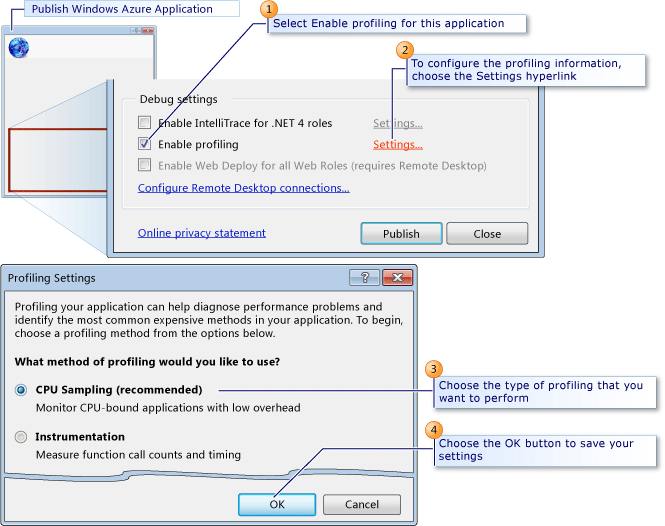

<properties 
   pageTitle="Verifica delle prestazioni di un servizio cloud | Microsoft Azure"
   description="Verificare le prestazioni di un servizio cloud utilizza profiler Visual Studio"
   services="visual-studio-online"
   documentationCenter="n/a"
   authors="TomArcher"
   manager="douge"
   editor="" />
<tags 
   ms.service="visual-studio-online"
   ms.devlang="multiple"
   ms.topic="article"
   ms.tgt_pltfrm="multiple"
   ms.workload="na"
   ms.date="08/15/2016"
   ms.author="tarcher" />

# Verifica delle prestazioni di un servizio cloud 

##Panoramica

È possibile verificare le prestazioni di un servizio cloud nei modi seguenti:

- Utilizzare Azure diagnostica per raccogliere informazioni sulle connessioni e le richieste di ed esaminare le statistiche del sito che mostrano come il servizio esegue dalla prospettiva del cliente. Per iniziare, vedere [configurazione di diagnostica per servizi Cloud Windows Azure e macchine virtuali]( http://go.microsoft.com/fwlink/p/?LinkId=623009).

- Utilizzare il profiler di Visual Studio per ottenere un'analisi approfondita di aspetti calcoli della modalità di esecuzione del servizio. Come descritto in questo argomento, è possibile utilizzare il profiler migliorare le prestazioni durante l'esecuzione di un servizio in Azure. Per informazioni su come utilizzare il profiler migliorare le prestazioni durante un servizio viene eseguito in locale in un emulatore di calcolo, vedere [verifica delle prestazioni del locale a un servizio Cloud Azure calcolare emulatore utilizzando Visual Studio Profiler](http://go.microsoft.com/fwlink/p/?LinkId=262845).

## Scelta di una metodo di verifica delle prestazioni

###Utilizzare Azure diagnostica per raccogliere:###

- Statistiche sulle pagine web o servizi, ad esempio le richieste e connessioni.

- Statistiche sui ruoli, ad esempio la frequenza di riavvio di un ruolo.

- In generale vengono fornite informazioni sull'utilizzo di memoria, ad esempio la percentuale di tempo che i recuperata accetta o la memoria di un ruolo in esecuzione.

###Utilizzare il profiler di Visual Studio per:###

- Determinare quali funzioni richiedere più tempo.

- Misurare quanto tempo ogni parte di un programma in modo intensivo dal punto di vista.

- Confrontare i report dettagliati relativi alle prestazioni per due versioni di un servizio.

- Analizzare l'allocazione di memoria in modo più dettagliato rispetto al livello di allocazioni di memoria.

- Analizzare i problemi di concorrenza nel codice multithreading.

Quando si utilizza il profiler, è possibile raccogliere dati durante l'esecuzione di un servizio cloud locale o in Azure.

###Raccogliere dati di profilo in locale per:###

- Verificare le prestazioni di una parte di un servizio cloud, ad esempio l'esecuzione di ruolo di lavoro specifica, che non richiedono un carico simulato realistico.

- Verificare le prestazioni di un servizio cloud separatamente, in condizioni controllate.

- Verificare le prestazioni di un servizio cloud prima di distribuirlo in Azure.

- Verificare le prestazioni di un servizio cloud in privato, senza interferire con le distribuzioni esistenti.

- Verificare le prestazioni del servizio senza incorrere in base alle tariffe per l'esecuzione in Azure.

###Raccogliere dati di profilo in Azure per:###

- Verificare le prestazioni di un servizio cloud in condizioni di carico simulato o reale.

- Utilizzare il metodo di strumentazione della raccolta di dati di analisi, come descritto più avanti in questo argomento.

- Verificare le prestazioni del servizio nello stesso ambiente quando viene eseguito il servizio di produzione.

In genere consente di simulare un carico per testare i servizi cloud in visualizzazione normale o condizioni di sovraccarico.

## Analisi di un servizio cloud in Azure

Quando si pubblica il servizio cloud da Visual Studio, è possibile il servizio profili e specificare le impostazioni di profilo che forniscono informazioni che si desidera. Avvio di una sessione di analisi per ogni istanza di un ruolo. Per ulteriori informazioni su come pubblicare il servizio da Visual Studio, vedere [pubblicazione a un servizio Cloud di Azure da Visual Studio](https://msdn.microsoft.com/library/azure/ee460772.aspx).

Per comprendere meglio le prestazioni di analisi in Visual Studio, vedere [Guida principianti alle prestazioni di analisi](https://msdn.microsoft.com/library/azure/ms182372.aspx) e [Le prestazioni dell'applicazione analisi dall'utilizzo degli strumenti di analisi](https://msdn.microsoft.com/library/azure/z9z62c29.aspx).

>[AZURE.NOTE] È possibile abilitare IntelliTrace o analisi quando si pubblica il servizio cloud. Non è possibile abilitare entrambe.

###Metodi di raccolta profiler

È possibile utilizzare diversi metodi per l'analisi, in base ai problemi di prestazioni:

- **Campioni CPU** - questo metodo consente di raccogliere statistiche dell'applicazione che sono utili per un'analisi iniziale dei problemi relativi all'utilizzo della CPU. Esempio CPU è il metodo consigliato per iniziare a creare la maggior parte delle analisi delle prestazioni. Esiste un impatto minimo sull'applicazione che sono analisi durante la raccolta di dati di esempio della CPU.

- **Strumentazione** -questo metodo consente di raccogliere dati di intervallo dettagliati che può essere utile per l'analisi mirata e per l'analisi dei problemi di prestazioni di ingresso/uscita. Il metodo di strumentazione record ogni voce, uscita e chiamata di funzione delle funzioni in un modulo durante l'esecuzione di un profilo. Questo metodo è utile per raccogliere le informazioni di intervallo dettagliate su una sezione del codice e per comprendere l'impatto delle operazioni di input e di output sulle prestazioni dell'applicazione. Questo metodo è disattivato per un computer con sistema operativo a 32 bit. Questa opzione è disponibile solo quando si esegue il servizio cloud in Azure, non in locale nell'emulatore di calcolo.

- **Allocazione di memoria .NET** : questo metodo consente di raccogliere dati allocazione di memoria .NET Framework utilizzando il metodo di profilo campione. I dati raccolti includono il numero e le dimensioni di oggetti allocati.

- **Concorrenza** - questo metodo consente di raccogliere dati sui conflitti di risorse e dati di esecuzione thread e processi che può essere utile per analizzare applicazioni multithread e più processi. Il metodo di concorrenza raccoglie i dati per ogni evento che impedisce l'esecuzione di codice, ad esempio quando un thread attenderà bloccato l'accesso a una risorsa di applicazione da liberare. Questo metodo è utile per l'analisi delle applicazioni multithread.

- È anche possibile attivare **Profilo interazione tra livelli**, che fornisce informazioni aggiuntive sui tempi di esecuzione dell'icona del ADO.NET chiamate nelle funzioni di applicazioni a più livelli in grado di comunicare con uno o più database. È possibile raccogliere dati di interazione tra livello con uno dei metodi di analisi. Per ulteriori informazioni su profilo interazione tra livelli, vedere [Visualizzazione interazioni tra livelli](https://msdn.microsoft.com/library/azure/dd557764.aspx).

## Configurazione delle impostazioni del profilo

La figura seguente viene illustrato come configurare le impostazioni del profilo nella finestra di dialogo Pubblica applicazione Azure.

>[AZURE.NOTE] Per abilitare la casella di controllo **Abilita profilo** , è necessario disporre profiler installato nel computer locale che si sta utilizzando per pubblicare il servizio cloud. Per impostazione predefinita, il profiler viene installato durante l'installazione di Visual Studio.

### Per configurare le impostazioni di analisi

1. In Esplora risorse, aprire il menu di scelta rapida per il progetto Azure e quindi scegliere **pubblica**. Per istruzioni dettagliate su come pubblicare un servizio cloud, vedere [pubblicazione di cloud service usando gli strumenti di Azure](http://go.microsoft.com/fwlink/p?LinkId=623012).

1. Nella finestra di dialogo **Pubblica applicazione Azure** scegliere la scheda **Impostazioni avanzate** .

1. Per attivare il profilo, selezionare la casella di controllo **Abilita profilo** .

1. Per configurare le impostazioni del profilo, scegliere il collegamento ipertestuale **Impostazioni** . Viene visualizzata la finestra di dialogo Impostazioni di analisi.

1. Tra i pulsanti di opzione **specificare il metodo di analisi si desidera utilizzare** , scegliere il tipo di analisi che informa della necessità.

1. Per raccogliere i dati di analisi di livello interazione, selezionare la casella di controllo **Abilita profilo interazione tra livelli** .

1. Per salvare le impostazioni, scegliere il pulsante **OK** .

    Quando si pubblica l'applicazione, queste impostazioni vengono utilizzate per creare la sessione di profilo per ogni ruolo.

## Visualizzare i report di analisi

Per ogni istanza di un ruolo di servizio cloud, viene creata una sessione di profilo. Per visualizzare i report di analisi di ogni sessione da Visual Studio, è possibile visualizzare la finestra Esplora Server e quindi scegliere il nodo Azure calcolare per selezionare un'istanza di un ruolo. È quindi possibile visualizzare il report di analisi come illustrato nella figura seguente.

### Per visualizzare i report di analisi

1. Per visualizzare la finestra Esplora Server in Visual Studio, sulla barra dei menu scegliere Visualizzazione Esplora Server.

1. Scegliere il nodo calcolare Azure e quindi scegliere il nodo distribuzione Azure per il servizio cloud selezionato al profilo quando è stato pubblicato da Visual Studio.

1. Per visualizzare i report di analisi, ad esempio, selezionare il ruolo nel servizio, aprire il menu di scelta rapida per una specifica istanza e quindi scegliere **Visualizza Report di analisi**.

    Il report, un file vsp scaricato da Azure e lo stato del download viene visualizzato nel Log delle attività Azure. Al termine del download, viene visualizzato il rapporto analisi in una scheda nell'editor di Visual Studio denominata <Role name> _<Instance Number>_ <identifier>vsp. Dati di riepilogo per il report viene visualizzato.

1. Per visualizzare diverse visualizzazioni di report, nell'elenco visualizzazione corrente, scegliere il tipo di visualizzazione desiderata. Per ulteriori informazioni, vedere [Visualizzazioni di Report degli strumenti di analisi](https://msdn.microsoft.com/library/azure/bb385755.aspx).

## Passaggi successivi

[Il debug di servizi Cloud](https://msdn.microsoft.com/library/azure/ee405479.aspx)

[Pubblicazione in un servizio Cloud Azure da Visual Studio](https://msdn.microsoft.com/library/azure/ee460772.aspx)

