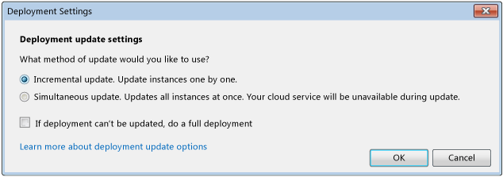

<properties 
   pageTitle="Pubblicazione guidata di applicazione Azure | Microsoft Azure"
   description="Pubblicazione guidata di applicazione Azure"
   services="visual-studio-online"
   documentationCenter="na"
   authors="TomArcher"
   manager="douge"
   editor="" />
<tags 
   ms.service="multiple"
   ms.devlang="multiple"
   ms.topic="article"
   ms.tgt_pltfrm="na"
   ms.workload="na"
   ms.date="08/15/2016"
   ms.author="tarcher" />

# Pubblicazione guidata di applicazione Azure

## Panoramica

Dopo aver sviluppato un'applicazione web in Visual Studio, è possibile pubblicare l'applicazione più facilmente in un servizio cloud Azure utilizzando la creazione guidata **Pubblicazione applicazione Azure** . La prima sezione viene illustrata la procedura, è necessario eseguire prima la configurazione guidata e le sezioni rimanenti spiegano le caratteristiche della procedura guidata.

>[AZURE.NOTE] In questo argomento è sulla distribuzione ai servizi cloud, non ai siti web. Per informazioni sulla distribuzione ai siti web, vedere [come distribuire un sito Web di Azure](https://social.msdn.microsoft.com/Search/windowsazure?query=How%20to%20Deploy%20an%20Azure%20Web%20Site&Refinement=138&ac=4#refinementChanges=117&pageNumber=1&showMore=false).

## Prerequisiti di

Prima di poter pubblicare l'applicazione web in Azure, è necessario disporre di un account Microsoft e un abbonamento Azure ed è necessario associare l'applicazione web con un servizio cloud Azure. Se è già stata completata queste attività, è possibile ignorare alla sezione successiva.

1. È possibile ottenere un account Microsoft e un abbonamento Azure. È possibile provare un abbonamento di Azure gratuito di un mese gratuito [qui](https://azure.microsoft.com/pricing/free-trial/)

1. Creare un servizio cloud e un account di archiviazione in Azure. È possibile eseguire da Esplora Server in Visual Studio o tramite il [portale classica Azure](http://go.microsoft.com/fwlink/?LinkID=213885).

1. Attivare l'applicazione web per Azure. Per attivare l'applicazione web per la pubblicazione in Azure da Visual Studio, è necessario associare a un progetto di servizio cloud Azure in Visual Studio. Per creare il progetto di servizio cloud associato, aprire il menu di scelta rapida per il progetto per l'applicazione web e quindi scegliere Converti, **convertire il progetto di servizio Cloud di Azure**.

1. Dopo il progetto di servizio cloud verrà aggiunto alla soluzione, aprire nuovamente lo stesso menu di scelta rapida e quindi scegliere **pubblica**. Per ulteriori informazioni su come attivare le applicazioni per Azure, vedere [come: eseguire la migrazione e pubblicare un'applicazione Web in un servizio Cloud di Azure da Visual Studio](https://msdn.microsoft.com/library/azure/hh420322.aspx).

>[AZURE.NOTE] Assicurarsi di avviare Visual Studio con credenziali di amministratore (Esegui come amministratore).

1. Quando si è pronti a pubblicare l'applicazione, aprire il menu di scelta rapida per il progetto di servizio cloud Azure e quindi scegliere **pubblica**. La procedura seguente mostra la creazione guidata pubblicazione applicazione Azure.

## Scegliendo l'abbonamento

### Per scegliere un abbonamento

1. Prima di utilizzare la procedura guidata per la prima volta, è necessario accedere. Scegliere il collegamento **Sign In** . Accedere al portale di Azure quando richiesto e specificare il nome utente Azure e la password. 

    

    Nell'elenco delle sottoscrizioni vengono inseriti con le sottoscrizioni associate all'account. È possibile visualizzare le sottoscrizioni da qualsiasi file in abbonamento che importati in precedenza.

1. Nell'elenco **Selezionare l'abbonamento** , scegliere l'abbonamento da utilizzare per la distribuzione.

   Se si sceglie **< Gestisci >**, viene visualizzata la finestra di dialogo **Gestione delle sottoscrizioni** ed è possibile scegliere il sottoscrizione e un account utente che si desidera utilizzare. La scheda **account** Mostra tutti gli account di posta e la scheda **sottoscrizioni** Mostra tutte le sottoscrizioni associate con l'account. È anche possibile scegliere un'area da cui si desidera utilizzare le risorse Azure, nonché creare o importare certificati per l'abbonamento dal portale di Azure. Se si è importato le sottoscrizioni da un file di sottoscrizione, i certificati associati verranno visualizzate sotto la scheda **certificati** . Al termine, fare clic sul pulsante **Chiudi** .

    

    >[AZURE.NOTE] Un file di sottoscrizione può contenere più di una sottoscrizione.

1. Fare clic sul pulsante **Avanti** per continuare. 

    Se non ci sono uno o più servizi cloud nell'abbonamento, è necessario creare un servizio cloud in Azure per ospitare il progetto. Verrà visualizzata la finestra di dialogo **creazione di un servizio Cloud e Account di archiviazione** .

    Specificare un nuovo nome per il servizio cloud. Il nome deve essere univoco in Azure. Quindi specificare l'area geografica o un gruppo di affinità per un centro dati che si avvicina si o la maggior parte dei client. Questo nome viene usato anche per un nuovo account di archiviazione Azure creato per il servizio cloud.

1. Modificare le impostazioni desiderate per la distribuzione e quindi pubblicarlo facendo clic sul pulsante **pubblica** (sezione successiva fornisce altre informazioni dettagliate sulle varie impostazioni). Per esaminare le impostazioni prima della pubblicazione, scegliere il pulsante **Avanti** .

    >[AZURE.NOTE] Se si sceglie pubblica in questo passaggio, è possibile monitorare lo stato della distribuzione in Visual Studio.

È possibile modificare le impostazioni avanzate e comuni per una distribuzione utilizzando la creazione guidata **Pubblicazione applicazione Azure** . Ad esempio, è possibile scegliere un'impostazione per distribuire l'applicazione in un ambiente di testing prima di rilasciare. La figura seguente mostra la scheda **Impostazioni comuni** per distribuzione di Windows Azure.

## Configurare le impostazioni di pubblicazione

### Per configurare le impostazioni di pubblicazione

1. Nell'elenco del **servizio Cloud** , eseguire una delle procedure seguenti:

   1. Nella casella di riepilogo a discesa scegliere un servizio cloud esistente. Viene visualizzata la posizione di centro dati per il servizio. È necessario prendere nota del percorso e verificare che la posizione di archiviazione account sia dello stesso data center.

    1. Scegliere **Crea nuovo** per creare un servizio cloud che ospita Azure. Nella finestra di dialogo **Crea servizio Cloud** , specificare un nome per il servizio e quindi specificare l'area geografica o un gruppo di affinità per specificare la posizione dell'interfaccia di dati che si vuole ospitare il servizio cloud. Il nome deve essere univoco in Azure.

1. Nell'elenco **ambiente** scegliere di **produzione** o **gestione temporanea**. Se si desidera distribuire l'applicazione in un ambiente di testing, scegliere l'ambiente di gestione temporanea. È possibile spostare l'applicazione all'ambiente di produzione in un secondo momento.

1. Nell'elenco **configurazione di compilazione** scegliere **Debug** o **Release**.

1. Nell'elenco **di configurazione del servizio** , scegliere **Cloud** o **locale**.

    Selezionare la casella di controllo **Attiva Desktop remoto per tutti i ruoli** se si desidera collegarsi al servizio. Questa opzione viene utilizzata principalmente per la risoluzione dei problemi. Quando si seleziona questa casella di controllo, viene visualizzata la finestra di dialogo **Configurazione Desktop remoto** . Scegliere il collegamento impostazioni per modificare la configurazione.

    Selezionare la casella di controllo **Abilita distribuzione Web per tutti i ruoli di web** per consentire la distribuzione web per il servizio. È necessario attivare Desktop remoto utilizzare questa caratteristica. Per ulteriori informazioni, vedere [[pubblicazione di un servizio Cloud usando gli strumenti di Azure](https://msdn.microsoft.com/library/azure/ff683672.aspx)](https://msdn.microsoft.com/library/azure/ff683672.aspx). Per ulteriori informazioni sulla distribuzione Web, vedere [[pubblicazione di un servizio Cloud usando gli strumenti di Azure](https://msdn.microsoft.com/library/azure/ff683672.aspx)](https://msdn.microsoft.com/library/azure/ff683672.aspx).

1. Scegliere la scheda **Impostazioni avanzate** . Nel campo **etichetta distribuzione** accettare il nome predefinito o immettere un nome di propria scelta. Per aggiungere la data all'etichetta di distribuzione, lasciare selezionata la casella di controllo.

    

1. Nell'elenco **account di archiviazione** , scegliere l'account di archiviazione da utilizzare per la distribuzione. Confrontare le posizioni delle aree di dati per il servizio cloud e dell'account di archiviazione. Se possibile, questi percorsi dovrebbero essere lo stesso.

    >[AZURE.NOTE] L'account di archiviazione Azure archivia il pacchetto per la distribuzione dell'applicazione. Dopo l'applicazione viene distribuito, il pacchetto viene rimosso dall'account di archiviazione.

1. Selezionare la casella di controllo **Aggiorna distribuzione** se si desidera distribuire solo i componenti aggiornati. Questo tipo di distribuzione può risultare più di una distribuzione completa. Scegliere il collegamento **Impostazioni** per aprire la finestra di dialogo **distribuzione aggiornare le impostazioni** , illustrato nella figura seguente. 

    

    È possibile scegliere una delle due opzioni per la distribuzione, incrementale o simultanea. Una distribuzione incrementale aggiorna una sola istanza distribuita alla volta, in modo che l'applicazione rimanga online e disponibile per gli utenti. Una distribuzione simultanea Aggiorna tutte le istanze distribuite contemporaneamente. Aggiornamento simultaneo risulta più veloce dell'aggiornamento incrementale, ma se si sceglie questa opzione, l'applicazione potrebbe non essere disponibile durante il processo di aggiornamento.

    Selezionare la casella di controllo se non è aggiornata distribuzione, eseguire una distribuzione completa se si desidera la distribuzione completa che venga eseguita automaticamente se si verifica un errore di una distribuzione di aggiornamento. Una distribuzione completa Reimposta l'indirizzo IP (VIP) virtuale per il servizio cloud. Per ulteriori informazioni, vedere [come: mantenere un indirizzo IP virtuale costante di un servizio Cloud](https://msdn.microsoft.com/library/azure/jj614593.aspx).

1. Per eseguire il debug del servizio, selezionare la casella di controllo **Abilita IntelliTrace** o se si distribuisce una configurazione di **Debug** e si desidera eseguire il debug il servizio cloud in Azure, selezionare la casella di controllo **Abilita Debugger remoto per tutti i ruoli** per distribuire i servizi di debug remoti.

2. Per l'applicazione del profilo, selezionare la casella di controllo **Abilita profilo** e quindi scegliere il collegamento **Impostazioni** per visualizzare le opzioni di analisi. 

    >[AZURE.NOTE] È necessario utilizzare Visual Studio Ultimate per abilitare IntelliTrace o analisi interazione livello (suggerimento) e non è possibile abilitare entrambe contemporaneamente.

    Per ulteriori informazioni, vedere [debug di un servizio Cloud pubblicato con traccia di diagnostica e Visual Studio](https://msdn.microsoft.com/library/azure/ff683671.aspx) e [la verifica delle prestazioni di un servizio Cloud](https://msdn.microsoft.com/library/azure/hh369930.aspx).

1. Scegliere **Avanti** per visualizzare la pagina di riepilogo per l'applicazione.

## La pubblicazione dell'applicazione

1. È possibile scegliere per creare un profilo di pubblicazione dalle impostazioni che si sono scelto. Ad esempio, è possibile creare un profilo per un ambiente di testing e l'altra per produzione. Per salvare il profilo, fare clic sull'icona **Salva** . La procedura guidata crea il profilo e salvarlo nel progetto di Visual Studio. Per modificare il nome del profilo, aprire l'elenco dei **profili di destinazione** e quindi scegliere **< Manage >**.

    

    >[AZURE.NOTE] Il profilo di pubblicazione viene visualizzata in Esplora soluzioni in Visual Studio e le impostazioni del profilo vengono scritte in un file con estensione .azurePubxml. Impostazioni vengono salvate come attributi di tag XML.

1. Scegliere **pubblica** per pubblicare l'applicazione. È possibile monitorare lo stato di processo nella finestra di **Output** in Visual Studio.

## Vedere anche

[Procedura: eseguire la migrazione e pubblicare un'applicazione Web in un servizio Cloud Azure da Visual Studio](https://msdn.microsoft.com/library/azure/hh420322.aspx)

[Pubblicazione di un servizio Cloud usando gli strumenti di Azure](https://msdn.microsoft.com/library/azure/ff683672.aspx)

[Debug di un servizio Cloud pubblicato con traccia di diagnostica e Visual Studio](https://msdn.microsoft.com/library/azure/ff683671.aspx)

[Verifica delle prestazioni di un servizio Cloud](https://msdn.microsoft.com/library/azure/hh369930.aspx)

