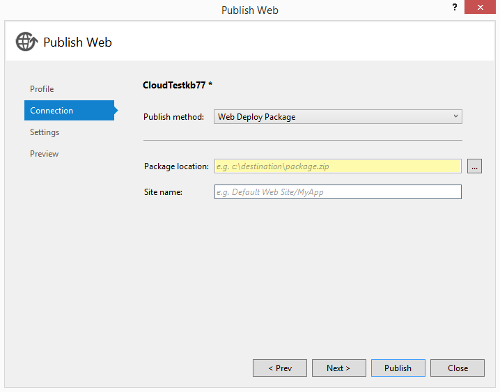

<properties
   pageTitle="Usando gli script di Windows PowerShell per la pubblicazione in ambienti di Test e Dev | Microsoft Azure"
   description="Informazioni su come usare gli script di Windows PowerShell da Visual Studio per pubblicare allo sviluppo e provare gli ambienti."
   services="visual-studio-online"
   documentationCenter="na"
   authors="TomArcher"
   manager="douge"
   editor="" />
<tags
   ms.service="multiple"
   ms.devlang="dotnet"
   ms.topic="article"
   ms.tgt_pltfrm="na"
   ms.workload="multiple"
   ms.date="08/15/2016"
   ms.author="tarcher" />

# <a name="using-windows-powershell-scripts-to-publish-to-dev-and-test-environments"></a>Utilizzo di script di Windows PowerShell per pubblicare dev e ambienti di prova

Quando si crea un'applicazione web in Visual Studio, è possibile generare uno script di Windows PowerShell che è possibile usare in un secondo momento per automatizzare la pubblicazione del sito Web in Azure come un'App Web nel servizio App Azure o una macchina virtuale. È possibile modificare ed estendere lo script di Windows PowerShell nell'editor di Visual Studio in base alle proprie esigenze o integrare lo script di compilazione esistente, test e gli script di pubblicazione.

Usa questi script, è possibile effettuare il provisioning versioni personalizzate (noto anche come ambienti di sviluppo e test) del sito per l'utilizzo temporaneo. Ad esempio, potrebbe configurare una versione specifica del sito Web in un computer virtuale Azure o l'intervallo di gestione temporanea aperto in un sito Web di eseguire un gruppo di test, riproduce un errore, provare una correzione, versione di valutazione di una modifica proposta o configurare un ambiente personalizzato per una dimostrazione o una presentazione. Dopo aver creato uno script che pubblica il progetto, è possibile ricreare ambienti identici eseguendo nuovamente lo script in base alle esigenze o eseguire lo script con build dell'applicazione web per creare un ambiente di testing personalizzato.

## <a name="what-you-need"></a>È necessario

- Azure SDK 2.3 o versione successiva. Per ulteriori informazioni, vedere [Download di Visual Studio](http://go.microsoft.com/fwlink/?LinkID=624384) .

Non è necessaria Azure SDK per generare script per i progetti web. Questa caratteristica è per i progetti web, non i ruoli di web servizi cloud.

- Azure PowerShell 0.7.4 o versione successiva. Per ulteriori informazioni, vedere [come installare e configurare Azure PowerShell](powershell-install-configure.md) .

- [Windows PowerShell 3.0](http://go.microsoft.com/?linkid=9811175) o versione successiva.

## <a name="additional-tools"></a>Strumenti aggiuntivi

Sono disponibili altri strumenti e risorse per l'utilizzo di PowerShell in Visual Studio per lo sviluppo di Azure. Vedere [PowerShell Tools per Visual Studio](http://go.microsoft.com/fwlink/?LinkId=404012).

## <a name="generating-the-publish-scripts"></a>Generare gli script di pubblicazione

È possibile generare gli script di pubblicazione per una macchina virtuale che contiene il sito Web quando si crea un nuovo progetto da seguenti [queste istruzioni](./virtual-machines/virtual-machines-windows-classic-web-app-visual-studio.md). È inoltre possibile [generare pubblicare script per web apps in Azure App servizio](./app-service-web/web-sites-dotnet-get-started.md).

## <a name="scripts-that-visual-studio-generates"></a>Script generato da Visual Studio

Visual Studio genera una cartella di livello soluzione denominata **PublishScripts** che contiene due file di Windows PowerShell, uno script di pubblicazione per la macchina virtuale o sito Web e un modulo che contiene le funzioni che è possibile utilizzare negli script. Visual Studio genera anche un file nel formato JSON che specifica i dettagli del progetto che si distribuisce.

### <a name="windows-powershell-publish-script"></a>Windows PowerShell pubblicare script

Lo script pubblica contiene passaggi pubblica specifico per la distribuzione di un sito Web o una macchina virtuale. Visual Studio fornisce una sintassi di colore per lo sviluppo di Windows PowerShell. La Guida per le funzioni è disponibile e possono essere modificati liberamente le funzioni di script in base alle proprie esigenze di modifica.

### <a name="windows-powershell-module"></a>Modulo di Windows PowerShell

Il modulo Windows PowerShell generato da Visual Studio contiene funzioni che utilizza lo script pubblica. Questi sono funzioni PowerShell Azure e non può essere modificato. Per ulteriori informazioni, vedere [come installare e configurare Azure PowerShell](powershell-install-configure.md) .

### <a name="json-configuration-file"></a>File di configurazione JSON

Il file JSON viene creato nella cartella **configurazioni** e contiene i dati di configurazione che specifica esattamente le risorse per la distribuzione di Azure. Il nome del file che Visual Studio genera è progetto nome-WAWS dev.json se è stato creato un sito Web o progetto nome-macchine Virtuali-dev.json se è stata creata una macchina virtuale. Ecco un esempio di un file di configurazione JSON viene generato quando si crea un sito Web. La maggior parte dei valori è facile comprensione. Il nome del sito Web viene generato da Azure, in modo che potrebbe non corrispondere il nome del progetto.

```
{
"environmentSettings": {
"webSite": {
"name": "WebApplication26632",
"location": "West US"
},
"databases": [
{
"connectionStringName": "DefaultConnection",
"databaseName": "WebApplication26632_db",
"serverName": "YourDatabaseServerName",
"user": "sqluser2",
"password": "",
"edition": "",
"size": "",
"collation": "",
"location": "West US"
}
]
}
}
```
Quando si crea una macchina virtuale, il file di configurazione JSON un aspetto simile al seguente. Si noti che viene creato un servizio cloud come contenitore per la macchina virtuale. La macchina virtuale contiene i punti finali comune per l'accesso web tramite HTTP e HTTPS, nonché gli endpoint per distribuzione Web, che consente di pubblicare il sito Web dal computer locale, Desktop remoto e Windows PowerShell.

```
{
"environmentSettings": {
"cloudService": {
"name": "myusernamevm1",
"affinityGroup": "",
"location": "West US",
"virtualNetwork": "",
"subnet": "",
"availabilitySet": "",
"virtualMachine": {
"name": "myusernamevm1",
"vhdImage": "a699494373c04fc0bc8f2bb1389d6106__Win2K8R2SP1-Datacenter-201403.01-en.us-127GB.vhd",
"size": "Small",
"user": "vmuser1",
"password": "",
"enableWebDeployExtension": true,
"endpoints": [
{
"name": "Http",
"protocol": "TCP",
"publicPort": "80",
"privatePort": "80"
},
{
"name": "Https",
"protocol": "TCP",
"publicPort": "443",
"privatePort": "443"
},
{
"name": "WebDeploy",
"protocol": "TCP",
"publicPort": "8172",
"privatePort": "8172"
},
{
"name": "Remote Desktop",
"protocol": "TCP",
"publicPort": "3389",
"privatePort": "3389"
},
{
"name": "Powershell",
"protocol": "TCP",
"publicPort": "5986",
"privatePort": "5986"
}
]
}
},
"databases": [
{
"connectionStringName": "",
"databaseName": "",
"serverName": "",
"user": "",
"password": ""
}
],
"webDeployParameters": {
"iisWebApplicationName": "Default Web Site"
}
}
}
```

È possibile modificare la configurazione di JSON per modificare cosa accade quando si eseguono gli script di pubblicazione. Il `cloudService` e `virtualMachine` sezioni sono obbligatori, ma è possibile eliminare il `databases` sezione se non è necessario. Le proprietà sono vuote nel file di configurazione predefinito generato da Visual Studio sono facoltative. che hanno valori nel file di configurazione predefinito sono necessari.

Se si dispone di un sito Web che contiene più ambienti di distribuzione (noti come bande orarie) anziché un unico sito di produzione in Azure, è possibile includere il nome di intervallo aperto il nome del sito Web in file di configurazione JSON. Ad esempio, se si dispone di un sito Web che è denominato **sito personale** e spazio per è denominato **test** quindi URI è test.cloudapp.net sito personale, ma il nome corretto da utilizzare nel file di configurazione è mysite(test). È possibile eseguire solo questo se il sito Web e bande orarie già incluso nell'abbonamento. Se non sono presenti, creare il sito Web eseguendo lo script senza specificare l'intervallo di aperto, quindi creare che nel [portale classica Azure](http://go.microsoft.com/fwlink/?LinkID=213885)e successivamente eseguire lo script con il nome del sito Web modificato. Per ulteriori informazioni sulle bande orarie di distribuzione per le applicazioni web, vedere [configurare ambienti per web apps in Azure App servizio di gestione temporanea](./app-service-web/web-sites-staged-publishing.md).

## <a name="how-to-run-the-publish-scripts"></a>Come eseguire gli script di pubblicazione

Se non è stato eseguito uno script di Windows PowerShell prima, è innanzitutto necessario impostare il criterio di esecuzione per consentire l'esecuzione di script. Questa è una funzionalità di sicurezza per impedire l'esecuzione di script di Windows PowerShell se sono esposti a malware o virus che includono l'esecuzione di script.

### <a name="run-the-script"></a>Eseguire lo script

1. Creare il pacchetto di distribuzione Web per il progetto. Un pacchetto di distribuzione Web è un archivio compresso (file con estensione zip) che contengono file che si desidera copiare in un sito Web o macchina virtuale. È possibile creare Web distribuire pacchetti di Visual Studio per tutte le applicazioni web.



Per ulteriori informazioni, vedere [procedura: creare un pacchetto di distribuzione Web in Visual Studio](https://msdn.microsoft.com/library/dd465323.aspx). È inoltre possibile automatizzare la creazione del pacchetto di distribuzione Web, come descritto nella sezione **personalizzazione e l'estensione di script pubblica** più avanti in questo argomento.

1. In **Esplora soluzioni**, aprire il menu di scelta rapida per lo script e quindi scegliere **Apri con PowerShell ISE**.

1. Se si tratta la prima volta è stata eseguire gli script di Windows PowerShell nel computer in uso, aprire una finestra del prompt dei comandi con privilegi di amministratore e digitare il comando seguente:

`Set-ExecutionPolicy RemoteSigned`

1. Accedere a Azure tramite il comando seguente.

`Add-AzureAccount`

Quando richiesto, fornire il nome utente e la password.

Si noti che quando si automatizza lo script, non è possibile utilizzare questo metodo per fornire le credenziali di Azure. Se, tuttavia, utilizzare il file publishsettings di fornire le credenziali. Una volta solo, si usa il comando **Get-AzurePublishSettingsFile** di scaricare il file da Azure e successivamente **AzurePublishSettingsFile Importa** per importare il file. Per informazioni dettagliate, vedere [come installare e configurare Azure PowerShell](powershell-install-configure.md).

1. (Facoltativo) Se si desidera creare Azure risorse, ad esempio la macchina virtuale, database e sito Web senza la pubblicazione dell'applicazione web, usare il comando **Pubblica WebApplication.ps1** con la **-configurazione** argomento impostato per il file di configurazione JSON. Questa riga di comando utilizza il file di configurazione JSON per determinare le risorse da creare. Perché utilizza le impostazioni predefinite per gli altri argomenti della riga di comando, le risorse, ma non pubblicare l'applicazione web. – Dettagliato opzione verranno fornite ulteriori informazioni sulle novità.

`Publish-WebApplication.ps1 -Verbose –Configuration C:\Path\WebProject-WAWS-dev.json`

1. Usare il comando **Pubblica WebApplication.ps1** come illustrato in uno degli esempi seguenti per richiamare lo script e pubblicare l'applicazione web. Se è necessario ignorare le impostazioni predefinite per tutti gli altri argomenti, ad esempio il nome dell'abbonamento, pubblicare nome pacchetto, macchina virtuale credenziali o le credenziali server di database, è possibile specificare i parametri. Utilizzare la **-dettagliato** opzione per visualizzare ulteriori informazioni sullo stato di avanzamento del processo di pubblicazione.

```
Publish-WebApplication.ps1 –Configuration C:\Path\WebProject-WAWS-dev-json `
–SubscriptionName Contoso `
-WebDeployPackage C:\Documents\Azure\ADWebApp.zip `
-DatabaseServerPassword @{Name="dbServerName";Password="adminPassword"} `
-Verbose
```

Se si sta creando una macchina virtuale, il comando è simile alla seguente. In questo esempio viene inoltre descritto specificare le credenziali per più database. Per le macchine virtuali che questi script creano, il certificato SSL non è da un'autorità di certificazione attendibile. È necessario usare l'opzione **– AllowUntrusted** .

```
Publish-WebApplication.ps1 `
-Configuration C:\Path\ADVM-VM-test.json `
-SubscriptionName Contoso `
-WebDeployPackage C:\Path\ADVM.zip `
-AllowUntrusted `
-VMPassword @{name = "vmUserName"; password = "YourPasswordHere"} `
-DatabaseServerPassword @{Name="server1";Password="adminPassword1"}, @{Name="server2";Password="adminPassword2"} `
-Verbose
```

È lo script può creare database, ma non server di database. Se si desidera creare un server di database, è possibile utilizzare la funzione **AzureSqlDatabaseServer di nuovo** nel modulo di Azure.

## <a name="customizing-and-extending-the-publish-scripts"></a>Personalizzazione ed estensione gli script di pubblicazione

È possibile personalizzare lo script pubblica e i file di configurazione JSON. Le funzioni nel modulo di Windows PowerShell **AzureWebAppPublishModule.psm1** non devono essere modificate. Se si vuole semplicemente specificare un database diverso o modificare alcune delle proprietà della macchina virtuale, modificare il file di configurazione JSON. Se si vuole estendere la funzionalità di script per automatizzare la creazione e test del progetto, è possibile implementare stub di funzione in **WebApplication.ps1 pubblica**.

Per automatizzare la creazione di un progetto, aggiungere codice che chiama MSBuild per `New-WebDeployPackage` come illustrato nell'esempio di codice. Il percorso per il comando MSBuild è diverso a seconda della versione di Visual Studio sono stati installati. Per ottenere il percorso corretto, è possibile utilizzare la funzione **Get-MSBuildCmd**, come illustrato nell'esempio seguente.

### <a name="to-automate-building-your-project"></a>Per automatizzare la creazione di un progetto

1. Aggiungere il `$ProjectFile` parametro nella sezione parametri globale.

```
[Parameter(Mandatory = $false)]
  [ValidateScript({Test-Path $_ -PathType Leaf})]
  [String]
  $ProjectFile,
```

1. Copiare la funzione `Get-MSBuildCmd` nel file di script.

```
function Get-MSBuildCmd
{
        process
{

             $path =  Get-ChildItem "HKLM:\SOFTWARE\Microsoft\MSBuild\ToolsVersions\" |
                                   Sort-Object {[double]$_.PSChildName} -Descending |
                                   Select-Object -First 1 |
                                   Get-ItemProperty -Name MSBuildToolsPath |
                                   Select -ExpandProperty MSBuildToolsPath
       
            $path = (Join-Path -Path $path -ChildPath 'msbuild.exe')

        return Get-Item $path
    }
}
```

1. Sostituire `New-WebDeployPackage` con il seguente codice e sostituire i segnaposto per la costruzione di riga `$msbuildCmd`. Questo codice è Visual Studio 2015. Se si sta utilizzando Visual Studio 2013, modificare la proprietà **VisualStudioVersion** sotto a `12.0`.

```
function New-WebDeployPackage
{
    #Write a function to build and package your web application
      
#To build your web application, use MsBuild.exe. For help, see MSBuild Command-Line Reference at: http://go.microsoft.com/fwlink/?LinkId=391339
      
Write-VerboseWithTime 'Build-WebDeployPackage: Start'
      
$msbuildCmd = '"{0}" "{1}" /T:Rebuild;Package /P:VisualStudioVersion=14.0 /p:OutputPath="{2}\MSBuildOutputPath" /flp:logfile=msbuild.log,v=d' -f (Get-MSBuildCmd), $ProjectFile, $scriptDirectory
      
Write-VerboseWithTime ('Build-WebDeployPackage: ' + $msbuildCmd)
      
#Start execution of the build command
$job = Start-Process cmd.exe -ArgumentList('/C "' + $msbuildCmd + '"') -WindowStyle Normal -Wait -PassThru
      
if ($job.ExitCode -ne 0)
{
throw('MsBuild exited with an error. ExitCode:' + $job.ExitCode)
}

#Obtain the project name
$projectName = (Get-Item $ProjectFile).BaseName
      
#Construct the path to web deploy zip package
$DeployPackageDir =  '.\MSBuildOutputPath\_PublishedWebsites\{0}_Package\{0}.zip' -f $projectName
      
      
#Get the full path for the web deploy zip package. This is required for MSDeploy to work
$WebDeployPackage = Resolve-Path –LiteralPath $DeployPackageDir
      
Write-VerboseWithTime 'Build-WebDeployPackage: End'
      
return $WebDeployPackage
}
```

1. Chiamare il `New-WebDeployPackage` funzione prima di questa riga: `$Config = Read-ConfigFile $Configuration` per le applicazioni web o `$Config = Read-ConfigFile $Configuration -HasWebDeployPackage:([Bool]$WebDeployPackage)` per macchine virtuali.

```
if($ProjectFile)
{
$WebDeployPackage = New-WebDeployPackage
}
```

1. Richiamare lo script personalizzato dalla riga di comando con il passaggio di `$Project` argomento, come la riga di comando di esempio seguente.

```
.\Publish-WebApplicationVM.ps1 -Configuration .\Configurations\WebApplication5-VM-dev.json `
-ProjectFile ..\WebApplication5\WebApplication5.csproj `
-VMPassword @{Name="VMUser";Password="Test.123"} `
-AllowUntrusted `
-Verbose
```

Per automatizzare il test dell'applicazione, aggiungere il codice per `Test-WebApplication`. Assicurarsi di commento in **Pubblica WebApplication.ps1** nel punto in cui queste funzioni vengono chiamate. Se non si fornisce un'implementazione, è possibile creare manualmente il progetto con Visual Studio e quindi eseguire lo script pubblica per pubblicare in Azure.

## <a name="publishing-function-summary"></a>Riepilogo delle funzioni pubblicazione

Per ottenere assistenza per le funzioni è possibile utilizzare il prompt dei comandi di Windows PowerShell, usare il comando `Get-Help function-name`. La Guida include esempi e la Guida del parametro. Lo stesso testo di Guida è inoltre nei file di origine di script, **AzureWebAppPublishModule.psm1** e **WebApplication.ps1 pubblica**. Gli script della Guida vengono localizzata nella lingua Visual Studio.

**AzureWebAppPublishModule**

|Nome di funzione|Descrizione|
|---|---|
|Aggiungere AzureSQLDatabase|Crea un nuovo database SQL Azure.|
|Aggiungere AzureSQLDatabases|Crea database SQL Azure dai valori nel file di configurazione JSON generato da Visual Studio.|
|Aggiungere AzureVM|Crea una macchina virtuale Azure e restituisce l'URL della macchina virtuale distribuita. La funzione configura automaticamente i prerequisiti e quindi chiama la funzione di **Nuovo AzureVM** (modulo di Azure) per creare una nuova macchina virtuale.|
|Aggiungere AzureVMEndpoints|Aggiunge nuovi endpoint di input a una macchina virtuale e restituisce la macchina virtuale con il nuovo punto finale.|
|Aggiungere AzureVMStorage|Crea un nuovo account di archiviazione Azure nella sottoscrizione corrente. Il nome dell'account inizia con "devtest" seguita da una stringa di caratteri alfanumerica univoca. La funzione restituisce il nome del nuovo account di archiviazione. È necessario specificare un percorso o un gruppo di affinità per il nuovo account di archiviazione.|
|Aggiungere AzureWebsite|Crea un sito Web con il nome specificato e il percorso. Questa funzione chiama la funzione **AzureWebsite di nuovo** nel modulo di Azure. Se l'abbonamento non include già un sito Web con il nome specificato, questa funzione crea il sito Web e restituisce un oggetto sito Web. In caso contrario, restituirà `$null`.|
|Sottoscrizione di backup|Salva la sottoscrizione di Azure corrente nel `$Script:originalSubscription` variabile nell'ambito di script. Questa funzione consente di salvare la sottoscrizione di Azure corrente (come ottenute mediante `Get-AzureSubscription -Current`) e il relativo account di archiviazione e l'abbonamento a cui viene modificato da questo script (memorizzato nella variabile `$UserSpecifiedSubscription`) e il relativo account di archiviazione, nell'ambito di script. Salvando i valori, è possibile utilizzare una funzione, ad esempio `Restore-Subscription`per ripristinare l'originale account di sottoscrizione e lo spazio di archiviazione corrente allo stato corrente se è stato modificato lo stato corrente.|
|Trova AzureVM|Ottiene la macchina virtuale Azure specificata.|
|Formato DevTestMessageWithTime|Consente di anteporre la data e l'ora a un messaggio. Questa funzione è progettata per i messaggi memorizzati per i flussi di errore e dettagliato.|
|Get-AzureSQLDatabaseConnectionString|Assemblare una stringa di connessione per connettersi a un database SQL Azure.|
|Get-AzureVMStorage|Restituisce il nome dell'account di archiviazione prima con il modello di nome "devtest*" (maiuscole e minuscole) nella posizione specificata o gruppo affinità. Se la "devtest*" account di archiviazione non corrispondono alla posizione o il gruppo affinità, la funzione ignorate. È necessario specificare un percorso o un gruppo di affinità.|
|Get-MSDeployCmd|Restituisce un comando per eseguire lo strumento MsDeploy.exe.|
|Nuovo AzureVMEnvironment|Trova o crea una macchina virtuale in abbonamento che corrispondono ai valori nel file di configurazione JSON.|
|Pubblicare WebPackage|Usa MsDeploy.exe e un web pubblicare il pacchetto. File ZIP per distribuire le risorse a un sito Web. Questa funzione non genera un output. Se la chiamata a MSDeploy.exe non riesce, la funzione generata un'eccezione. Per ottenere informazioni più dettagliate output, utilizzare la **-dettagliato** opzione.|
|Pubblicare WebPackageToVM|Verifica i valori dei parametri e quindi chiama la funzione **WebPackage pubblica** .|
|Lettura ConfigFile|Convalidato il file di configurazione JSON e restituisce una tabella hash di valori selezionati.|
|Sottoscrizione di ripristino|Reimposta l'abbonamento corrente per l'abbonamento originale.|
|Test AzureModule|Restituisce `$true` se la versione di modulo di Azure installato 0.7.4 o versione successiva. Restituisce `$false` se non è installato il modulo o una versione precedente. Questa funzione non ha parametri.|
|Test AzureModuleVersion|Restituisce `$true` se la versione del modulo di Azure 0.7.4 o versione successiva. Restituisce `$false` se non è installato il modulo o una versione precedente. Questa funzione non ha parametri.|
|Test HttpsUrl|Converte l'URL di input a un oggetto URI. Restituisce `$True` se l'URL assoluto e lo schema https. Restituisce `$false` se l'URL è relativo, la combinazione non HTTPS o la stringa di input non può essere convertita in un URL.|
|Membro di test|Restituisce `$true` se una proprietà o metodo è un membro dell'oggetto. In caso contrario, viene restituito `$false`.|
|Scrittura ErrorWithTime|Scrive un messaggio di errore preceduto con l'ora corrente. Questa funzione chiama la funzione di **Formato DevTestMessageWithTime** per anteporre il tempo prima di scrivere il messaggio per il flusso di errore.|
|Scrittura HostWithTime|Scrive un messaggio al programma host (**Host scrittura**) preceduto con l'ora corrente. L'effetto di scrittura per il programma host varia. La maggior parte dei programmi che ospitano Windows PowerShell scriva questi messaggi di output standard.|
|Scrittura VerboseWithTime|Scrive un messaggio dettagliato preceduto con l'ora corrente. Poiché chiama **Dettagliato di scrittura**, viene visualizzato il messaggio solo quando lo script viene eseguito con il parametro **dettagliato** o quando la preferenza **VerbosePreference** è impostata su **Continua**.|

**Pubblicare WebApplication**

|Nome di funzione|Descrizione|
|---|---|
|Nuovo AzureWebApplicationEnvironment|Crea Azure risorse, ad esempio un sito Web o una macchina virtuale.|
|Nuovo WebDeployPackage|Questa funzione non è implementata. È possibile aggiungere comandi in questa funzione per generare il progetto.|
|Pubblicare AzureWebApplication|Pubblica un'applicazione web in Azure.|
|Pubblicare WebApplication|Crea e lo distribuisce applicazioni Web, macchine virtuali, database SQL e gli account di archiviazione per un progetto di Visual Studio web.|
|Test WebApplication|Questa funzione non è implementata. È possibile aggiungere comandi in questa funzione per testare l'applicazione.|

## <a name="next-steps"></a>Passaggi successivi

Altre informazioni sulla creazione di script di PowerShell, leggere [gli script con Windows PowerShell](https://technet.microsoft.com/library/bb978526.aspx) e vedere altri script di PowerShell Azure [Script Center](https://azure.microsoft.com/documentation/scripts/).
