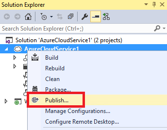

<properties 
   pageTitle="Con Desktop remoto ruoli Azure | Microsoft Azure"
   description="Utilizzo di Desktop remoto con i ruoli di Azure"
   services="visual-studio-online"
   documentationCenter="na"
   authors="TomArcher"
   manager="douge"
   editor="" />
<tags 
   ms.service="multiple"
   ms.devlang="multiple"
   ms.topic="article"
   ms.tgt_pltfrm="na"
   ms.workload="na"
   ms.date="08/15/2016"
   ms.author="tarcher" />

# Utilizzo di Desktop remoto con i ruoli di Azure

Utilizzando il Azure SDK e Servizi Desktop remoto, è possibile accedere ruoli Azure e macchine virtuali ospitate da Azure. In Visual Studio, è possibile configurare Servizi Desktop remoto da un progetto di Azure. Per abilitare Servizi Desktop remoto, è necessario creare un progetto di lavoro che contiene uno o più ruoli e quindi pubblicarlo in Azure.

>[AZURE.IMPORTANT] È necessario accedere un ruolo di Azure per la risoluzione dei problemi o solo sviluppo. Lo scopo di ogni macchina virtuale consiste nell'eseguire un ruolo specifico dell'applicazione Azure, non eseguire altre applicazioni client. Se si desidera utilizzare Azure per ospitare una macchina virtuale che è possibile utilizzare per scopi, vedere accesso macchine virtuali di Azure da Esplora Server.

## Per attivare e utilizzare Desktop remoto per un ruolo di Azure

1. In Esplora risorse, aprire il menu di scelta rapida per il progetto e quindi scegliere **pubblica**.

    Verrà visualizzata la creazione guidata **Pubblicazione applicazione Azure** .

    

1. Nella parte inferiore della pagina **Impostazioni di pubblicazione di Microsoft Azure** della procedura guidata, selezionare **Attiva Desktop remoto** per la casella di controllo ruoli tutto. 

    Verrà visualizzata la finestra di dialogo **Configurazione Desktop remoto** .

1. Nella parte inferiore della finestra di dialogo **Configurazione Desktop remoto** , scegliere il pulsante **Altre opzioni** . 
 
    Verrà visualizzata una casella di riepilogo a discesa che consente di creare o scegliere un certificato in modo che è possibile crittografare le informazioni sulle credenziali quando ci si connette tramite desktop remoto.

1. Nell'elenco a discesa scegliere ** &lt;Crea >**, o sceglierne uno dall'elenco. 

    Se si sceglie un certificato esistente, ignorare i passaggi seguenti.

    >[AZURE.NOTE] I certificati necessari per una connessione desktop remoto sono diversi da quelli utilizzati per altre operazioni di Azure. Il certificato di accesso remoto deve avere una chiave privata.

    Viene visualizzata la finestra di dialogo **Crea certificato** .

    1. Specificare un nome descrittivo per il nuovo certificato e quindi scegliere il pulsante **OK** . Il nuovo certificato verrà visualizzato nella casella di riepilogo a discesa.

    1. Nella finestra di dialogo **Configurazione Desktop remoto** specificare un nome utente e password forniti.
    
        È possibile usare un account esistente. Non specificare amministratore il nome utente per il nuovo account.

        >[AZURE.NOTE] Se la password non soddisfa i requisiti di complessità, viene visualizzata un'icona di colore rossa accanto alla casella di testo password. La password deve includere lettere maiuscole, minuscole e i numeri o simboli.

    1. Scegliere una data in cui l'account scadrà e dopo le connessioni desktop remote verranno bloccate.

    1. Dopo avere fornito tutte le informazioni necessarie, scegliere il pulsante **OK** .
    
        Diverse impostazioni che consentono di servizi di accesso remoto vengono aggiunte ai file cscfg e .csdef.

1. Nella creazione guidata di **Microsoft Azure pubblica Impostazioni** , scegliere il pulsante **OK** quando si è pronti per pubblicare il servizio cloud.

    Se non si è pronti pubblicare, fare clic sul pulsante **Annulla** . Vengono salvate le impostazioni di configurazione ed è possibile pubblicare il servizio cloud in un secondo momento.

## Connettersi a un ruolo di Azure tramite Desktop remoto

Dopo la pubblicazione del servizio cloud su Azure, è possibile usare Esplora Server per l'accesso a macchine virtuali che ospita Azure. 

1. In Esplora Server espandere il nodo **Azure** e quindi espandere il nodo per un servizio cloud e uno dei relativi ruoli per visualizzare un elenco delle istanze.

1. Aprire il menu di scelta rapida per un nodo dell'istanza e quindi scegliere **La connessione Desktop remoto utilizzando**.

    

1. Immettere il nome utente e la password creata in precedenza. Si è connessi a questo punto la sessione remota.

