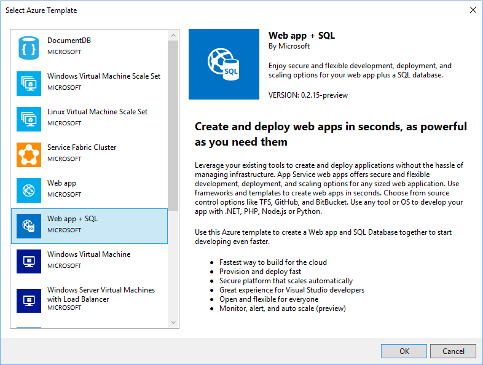
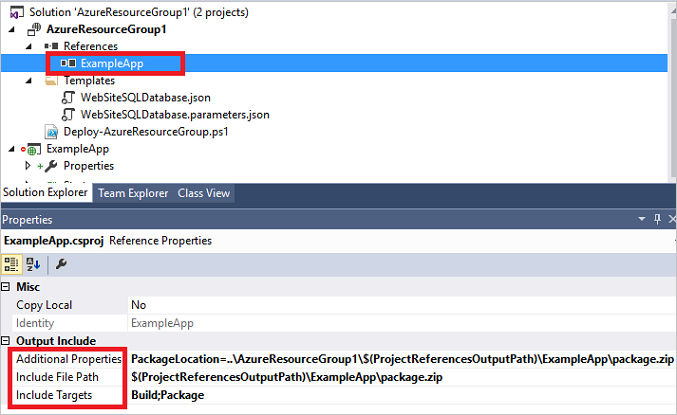

<properties
   pageTitle="Progetti di Visual Studio gruppo risorse Azure | Microsoft Azure"
   description="Utilizzare Visual Studio per creare un progetto di gruppo di risorse Azure e distribuire le risorse in Azure."
   services="azure-resource-manager"
   documentationCenter="na"
   authors="tfitzmac"
   manager="timlt"
   editor="tysonn" />
<tags
   ms.service="azure-resource-manager"
   ms.devlang="multiple"
   ms.topic="get-started-article"
   ms.tgt_pltfrm="na"
   ms.workload="na"
   ms.date="09/20/2016"
   ms.author="tomfitz" />

# Creazione e distribuzione di gruppi di risorse Azure tramite Visual Studio

Con Visual Studio e [Azure SDK](https://azure.microsoft.com/downloads/), è possibile creare un progetto che distribuisce l'infrastruttura e codice in Azure. Ad esempio, è possibile definire l'host web, un sito web e database per l'app e distribuire tale infrastruttura insieme al codice. Oppure è possibile definire macchine virtuali, virtuali e Account di archiviazione e la distribuzione di tale infrastruttura insieme a uno script che viene eseguito su macchina virtuale. Il progetto di distribuzione di **Gruppo di risorse Azure** consente di distribuire tutte le risorse necessarie in un'operazione su una singola, ripetibile. Per ulteriori informazioni sulla distribuzione e gestire le risorse, vedere [Panoramica di gestione di risorse Azure](azure-resource-manager/resource-group-overview.md).

Gruppo di risorse Azure progetti contiene modelli di Azure Manager delle risorse JSON che definiscono le risorse che si distribuiscono Azure. Per informazioni sugli elementi del modello di Manager delle risorse, vedere [modelli di creazione condivisa Manager delle risorse di Azure](resource-group-authoring-templates.md). Visual Studio consente di modificare questi modelli e è disponibili strumenti che semplificano l'utilizzo dei modelli.

In questo argomento, si distribuisce una web app e Database SQL. Tuttavia, i passaggi sono quasi gli stessi per qualsiasi tipo di risorsa. È possibile come facilmente distribuire una macchina virtuale e le relative risorse correlate. Visual Studio fornisce numerosi modelli starter diversi per la distribuzione di scenari comuni.

In questo articolo sono elencate Visual Studio 2015 aggiornamento 2 e Microsoft Azure SDK per .NET 2.9. Se si utilizza Visual Studio 2013 con Azure SDK 2.9, l'esperienza dell'utente è ampiamente lo stesso. È possibile utilizzare le versioni di Azure SDK da 2.6 o versione successiva. Tuttavia, l'esperienza dell'utente dell'interfaccia utente può essere diverso rispetto all'interfaccia utente illustrata in questo articolo. È consigliabile installare la versione più recente di [Azure SDK](https://azure.microsoft.com/downloads/) prima di iniziare la procedura. 

## Progetto Crea gruppo risorse Azure

In questa procedura è creare un progetto di gruppo di risorse Azure con un modello di **app Web + SQL** .

1. In Visual Studio, scegliere **File**, **Nuovo progetto**, scegliere **c#** o **Visual Basic**. Scegliere **Cloud**e quindi scegliere progetto di **Gruppo di risorse Azure** .

    

1. Scegliere il modello che si desidera distribuire per gestione di risorse di Azure. Sono presenti molte diverse opzioni in base al tipo di progetto che si desidera distribuire. In questo argomento, scegliere il modello di **app Web + SQL** .

    

    Il modello che scelto è solo un punto di partenza; è possibile aggiungere e rimuovere le risorse per svolgere il proprio scenario.

    >[AZURE.NOTE] Visual Studio recupera un elenco dei modelli disponibili online. Nell'elenco può cambiare.

    Visual Studio crea un progetto di distribuzione delle risorse gruppo per il web app e database SQL.

1. Per vedere che cos'è stato creato, espandere i nodi nel progetto di distribuzione.

    

    Poiché abbiamo scelto il Web app + modello SQL per questo esempio, vedere i file seguenti: 

  	|Nome del file|Descrizione|
  	|---|---|
  	|Distribuire AzureResourceGroup.ps1|Script di PowerShell che richiama i comandi di PowerShell per la distribuzione di Azure risorsa Manager. **Nota** Visual Studio utilizza questo script di PowerShell per distribuire il modello. Le modifiche apportate a questo script impatto sulla distribuzione in Visual Studio, prestare attenzione.|
  	|WebSiteSQLDatabase.json|Il modello di Manager delle risorse che definisce l'infrastruttura si desidera distribuire in Azure e i parametri che è possibile fornire durante la distribuzione. Definisce inoltre le dipendenze tra le risorse in modo che Gestione risorse distribuito le risorse nell'ordine corretto.|
  	|WebSiteSQLDatabase.parameters.json|File di parametri che contiene valori necessari per il modello. Passare in valori di parametro per personalizzare ogni distribuzione.|

    Tutti i progetti di distribuzione di gruppo risorse contengono questi file base. Altri progetti possono contenere file aggiuntivi per supportare altre funzionalità.

## Personalizzare il modello di Manager delle risorse

È possibile personalizzare un progetto di distribuzione modificando i modelli JSON che descrivono le risorse che si desidera distribuire. JSON indica il JavaScript Object Notation ed è un formato dati serializzati facile da usare. I file JSON utilizzano uno schema che si fa riferimento nella parte superiore di ogni file. Se si desidera conoscere lo schema, è possibile scaricare e analizzarli. Lo schema definisce quali elementi sono validi, i tipi e i formati dei campi, i valori possibili dei valori enumerati e così via. Per informazioni sugli elementi del modello di Manager delle risorse, vedere [modelli di creazione condivisa Manager delle risorse di Azure](resource-group-authoring-templates.md).

Per lavorare su un modello, aprire **WebSiteSQLDatabase.json**.

Editor di Visual Studio sono disponibili gli strumenti per consentire la modifica del modello di Manager delle risorse. La finestra **Struttura JSON** rende più facile vedere elementi definiti nel modello scelto.

Selezionare uno degli elementi della struttura consente di accedere a tale parte del modello ed evidenzia JSON corrispondente.

È possibile aggiungere una risorsa selezionando il pulsante **Aggiungi risorsa** nella parte superiore della finestra della struttura JSON o facendo clic su **risorse** e selezionando **Aggiungi nuova risorsa**.

Per questa esercitazione, selezionare **l'Account di archiviazione** e assegnarle un nome. Specificare un nome non più di 11 caratteri, che contiene solo numeri e lettere minuscole.

Si noti che non solo è stata la risorsa aggiunto, ma anche un parametro per l'account di archiviazione di tipo e una variabile per il nome dell'account di archiviazione.

Il parametro **storageType** è predefinito con i tipi di consentiti e un tipo predefinito. È possibile lasciare questi valori o modificarli per lo scenario. Se non si desidera tutti gli utenti per la distribuzione di un account di archiviazione **Premium_LRS** tramite questo modello, rimuoverlo dal tipi consentiti. 

    "storageType": {
      "type": "string",
      "defaultValue": "Standard_LRS",
      "allowedValues": [
        "Standard_LRS",
        "Standard_ZRS",
        "Standard_GRS",
        "Standard_RAGRS"
      ]
    }

Visual Studio vengono forniti anche intellisense per capire quali proprietà sono disponibili durante la modifica del modello. Ad esempio, per modificare le proprietà per il piano di servizio di App, passare alla risorsa **HostingPlan** e aggiungere un valore per le **proprietà**. Si noti che intellisense vengono visualizzati i valori disponibili e viene fornita una descrizione di tale valore.

È possibile impostare **numberOfWorkers** su 1.

    "properties": {
      "name": "[parameters('hostingPlanName')]",
      "numberOfWorkers": 1
    }

## Distribuire il progetto di gruppo di risorse in Azure

A questo punto si è pronti distribuire il progetto. Quando si distribuisce un progetto di gruppo di risorse di Azure, si distribuisce a un gruppo di risorse Azure. Gruppo di risorse è un raggruppamento logico delle risorse che condividono un ciclo di vita comune.

1. Dal menu di scelta rapida del nodo di progetto di distribuzione, scegliere **Distribuisci** > **Nuova distribuzione**.

    

    Verrà visualizzata la finestra di dialogo **Distribuisci al gruppo di risorse** .

    

1. Nella casella a discesa **gruppo di risorse** , scegliere un gruppo di risorse esistente o crearne uno nuovo. Per creare un gruppo di risorse, aprire la casella di **Gruppo di risorse** a discesa e selezionare **Crea nuovo**.

    

    Viene visualizzata la finestra di dialogo **Crea gruppo di risorse** . Assegnare al gruppo un nome e un percorso e selezionare il pulsante **Crea** .

    
   
1. Modificare i parametri per la distribuzione facendo clic sul pulsante **Modifica parametri** .

    

1. Fornire i valori per i parametri vuoti e selezionare il pulsante **Salva** . I parametri vuoti sono **hostingPlanName**, **administratorLogin**, **administratorLoginPassword**e **NomeDatabase**.

    **hostingPlanName** specifica un nome per il [piano di servizio App](./app-service/azure-web-sites-web-hosting-plans-in-depth-overview.md) da creare. 
    
    **administratorLogin** specifica il nome utente per l'amministratore di SQL Server. Non utilizzare nomi comuni di amministrazione come **sa** o **amministratore**. 
    
    **AdministratorLoginPassword** specifica una password di amministratore di SQL Server. L'opzione **Salva password come testo normale nel file di parametri** non è protetto; di conseguenza, non selezionare questa opzione. Poiché la password non viene salvata come testo normale, sarà necessario fornire una password nuovamente durante la distribuzione. 
    
    **databaseName** specifica un nome per il database da creare. 

    
    
1. Scegliere il pulsante di **distribuzione** per distribuire il progetto in Azure. Verrà visualizzata una console di PowerShell di fuori dell'istanza di Visual Studio. Immettere la password di amministratore di SQL Server nella console di PowerShell quando richiesto. **La console di PowerShell potrebbe nascosta da altri elementi oppure ridotta a icona nella barra delle applicazioni.** Cercare questa console e selezionarla per specificare la password.

    >[AZURE.NOTE] Visual Studio potrebbe essere richiesto di installare i cmdlet di PowerShell Azure. È necessario i cmdlet di PowerShell Azure per distribuire i gruppi di risorse. Se richiesto, installarli.
    
1. La distribuzione può richiedere alcuni minuti. In windows **Output** viene visualizzato lo stato della distribuzione. Al termine di distribuzione, l'ultimo messaggio indica una corretta distribuzione con qualcosa di simile a:

        ... 
        18:00:58 - Successfully deployed template 'c:\users\user\documents\visual studio 2015\projects\azureresourcegroup1\azureresourcegroup1\templates\websitesqldatabase.json' to resource group 'DemoSiteGroup'.

1. In un browser, aprire il [portale di Azure](https://portal.azure.com/) e accedere al proprio account. Per visualizzare il gruppo di risorse, selezionare **i gruppi di risorse** e il gruppo di risorse a che è stato distribuito.

    

1. Vedere tutte le risorse distribuite. Si noti che il nome dell'account di archiviazione non esattamente è specificato durante l'aggiunta di quella risorsa. Account di archiviazione deve essere univoco. Il modello aggiunge automaticamente una stringa di caratteri per il nome specificato per fornire un nome univoco. 

    

1. Se si apportano modifiche e si desidera ridistribuire il progetto, scegliere il gruppo di risorse esistente dal menu di scelta rapida del progetto di gruppo di risorse Azure. Menu di scelta rapida scegliere **Distribuisci**e quindi scegliere il gruppo di risorse che è stato distribuito.

    

## Distribuire il codice con l'infrastruttura

A questo punto è stato distribuito l'infrastruttura per l'app, ma non è presente codice effettivo distribuito con il progetto. In questo argomento viene illustrato come distribuire un'app web e tabelle di Database SQL durante la distribuzione. Se si distribuisce una macchina virtuale anziché un'app web, si desidera eseguire il codice nel computer come parte della distribuzione. Il processo di distribuzione di codice per un'app web o per la configurazione di una macchina virtuale è simile al.

1. Aggiungere un progetto alla soluzione Visual Studio. Fare doppio clic la soluzione e selezionare **Aggiungi** > **Nuovo progetto**.

    

1. Aggiungere un' **applicazione Web ASP.NET**. 

    
    
1. Selezionare **MVC** e deselezionare il campo per **Host nel cloud** perché il progetto di gruppo di risorse eseguita tale attività.

    
    
1. Dopo che Visual Studio crea un'app web, viene visualizzato entrambi i progetti della soluzione.

    

1. A questo punto, è necessario assicurarsi che il progetto di gruppo risorse è presente il nuovo progetto. Tornare al progetto di gruppo risorse (AzureResourceGroup1). Pulsante destro del mouse **riferimenti** e scegliere **Aggiungi riferimento**.

    

1. Selezionare il progetto di applicazione web che è stato creato.

    
    
    Mediante l'aggiunta di un riferimento, collegare il progetto di app web nel progetto di gruppo di risorse e configurare automaticamente i tre proprietà chiave. Vedere queste proprietà nella finestra delle **proprietà** per il riferimento.

      
    
    Le proprietà sono:

    - Le **Proprietà aggiuntive** contiene il pacchetto di distribuzione web percorso in cui viene inserito all'archiviazione Azure di gestione temporanea. Nota la cartella (ExampleApp) e file (package.zip). Si fornirà questi valori come parametri per la distribuzione dell'app. 
    - Il **Percorso del File includere** contiene il percorso in cui viene creato il pacchetto. **Includere i siti di destinazione** contiene il comando che viene eseguita la distribuzione. 
    - Compilare il valore predefinito di **; Pacchetto** consente la distribuzione di compilare e creare un pacchetto di distribuzione web (package.zip).  
    
    Non è necessario un profilo di pubblicazione come la distribuzione riceve le informazioni necessarie dalle proprietà per creare il pacchetto.
      
1. Aggiungere una risorsa al modello.

    

1. Questa volta selezionare **Distribuzione Web per le applicazioni Web**. 

    
    
1. Ridistribuire il progetto di gruppo di risorse al gruppo di risorse. Questo momento sono disponibili nuovi parametri. Non è necessario fornire i valori per **_artifactsLocation** o **_artifactsLocationSasToken** perché Visual Studio genera automaticamente tali valori. Tuttavia, è necessario impostare il nome file e cartelle sul percorso che contiene il pacchetto di distribuzione (mostrato nell'immagine seguente come **ExampleAppPackageFolder** ed **ExampleAppPackageFileName** ). Fornire i valori visualizzato in precedenza nelle proprietà di riferimento (**ExampleApp** e **package.zip**).

    
    
    Per l' **account di archiviazione di elementi**, selezionare quello distribuito con questo gruppo di risorse.
    
1. Al termine di distribuzione, selezionare un'app web nel portale. Selezionare l'URL per accedere al sito.

    

1. Si noti che è stato distribuito correttamente l'applicazione ASP.NET predefinito.

    

## Passaggi successivi

- Per informazioni su come gestire le risorse tramite il portale, vedere [tramite il portale di Azure per gestire le risorse Azure](./azure-portal/resource-group-portal.md).
- Per ulteriori informazioni sui modelli, vedere [modelli di creazione condivisa Manager delle risorse di Azure](resource-group-authoring-templates.md).
