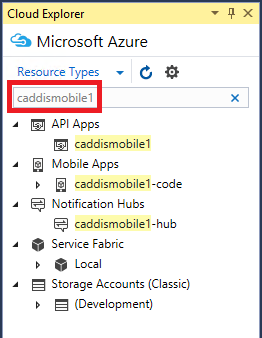

<properties 
   pageTitle="Gestione delle risorse Azure con Esplora risorse Cloud | Microsoft Azure"
   description="Informazioni su come usare Cloud Explorer per esplorare e gestire le risorse Azure Visual Studio."
   services="visual-studio-online"
   documentationCenter="na"
   authors="TomArcher"
   manager="douge"
   editor="" />
<tags 
   ms.service="multiple"
   ms.devlang="dotnet"
   ms.topic="article"
   ms.tgt_pltfrm="na"
   ms.workload="multiple"
   ms.date="08/15/2016"
   ms.author="tarcher" />

# Gestione delle risorse Azure con Esplora risorse Cloud

##Panoramica

Cloud Explorer è progettato per consentire di più semplice e rapido individuare e gestire le risorse Azure IDE Visual Studio. È possibile, ad esempio, consente di aprire un'app Web nel [portale di Azure](http://go.microsoft.com/fwlink/p/?LinkID=525040) o in un browser, aggiungere un debugger o è possibile visualizzare le proprietà di un contenitore di blob e aprirlo nell'Editor contenitore Blob.

Cloud Explorer si basa su stack manager delle risorse Azure, come il [portale di Azure](http://go.microsoft.com/fwlink/p/?LinkID=525040). Conosce risorse, ad esempio i gruppi di risorse Azure e Azure servizi, ad esempio logica App e le API App e supporta un maggior [controllo dell'accesso basato sui ruoli](./active-directory/role-based-access-control-configure.md) (RBAC). Per vedere le risorse Azure che sono state aggiunte o modificate, scegliere il pulsante **Aggiorna** sulla barra degli strumenti Cloud Explorer.

Cloud Explorer viene installato come parte di Visual Studio Tools per Azure SDK 2.7. 

## Prerequisiti di

- Visual Studio 2015 RTM.

- Gli strumenti di Visual Studio per SDK Azure. 
- Si deve inoltre includere un account Azure e accedere a esso per visualizzare le risorse Azure nel Cloud Explorer. Se non si dispone di uno, è possibile creare un account in pochi minuti. Se si dispone di un abbonamento MSDN, vedere [Azure vantaggi per gli abbonati MSDN](https://azure.microsoft.com/pricing/member-offers/msdn-benefits-details/). In caso contrario, vedere [creare un account di valutazione gratuito](https://azure.microsoft.com/pricing/free-trial/).

- Se Cloud Explorer non è visibile, è possibile visualizzare scegliendo **Visualizza** **Altre finestre** **Cloud Explorer** sulla barra dei menu.

## Gestire le sottoscrizioni e account Azure

Per vedere le risorse Azure in Esplora Cloud, è necessario accedere a un account Azure con uno o più abbonamenti attivi. Se si dispone di più account Azure, è possibile aggiungerli nel Cloud Explorer e quindi scegliere le sottoscrizioni da includere nella visualizzazione Cloud Esplora risorse.

Se non è stato usato Azure prima o non è stato aggiunto gli account necessari per Visual Studio, verrà richiesto di eseguire questa operazione.

## Per aggiungere un account Azure a Cloud Explorer

1. Scegliere l'icona impostazioni sulla barra degli strumenti Cloud Explorer.

1. Selezionare il collegamento **Aggiungi un account** . Accedere con un account Azure cui si desidera individuare le risorse. L'account che appena aggiunto dovrebbe essere selezionata nell'elenco a discesa di selezione account. Le sottoscrizioni per l'account vengono visualizzate sotto la voce account.

    

    

1. Selezionare le caselle di controllo per le sottoscrizioni di account che si desidera passare e quindi fare clic su **Applica** .

    Le risorse Azure per le sottoscrizioni selezionate vengono visualizzate in Esplora Cloud.

## Rimuovere un account Azure

1. Scegliere **File**, **Le impostazioni dell'Account** sulla barra dei menu.

1. Nella sezione di **Tutti gli account** della finestra di dialogo **Impostazioni Account** , scegliere il comando **Rimuovi** fianco all'account che si desidera rimuovere. Nota che questo comando rimuove solo l'account da Visual Studio, poiché non influisce su account Azure stesso.

## Tipi di visualizzazione delle risorse o gruppi

Per visualizzare le risorse Azure, è possibile scegliere **I tipi di risorse** o visualizzazione di **Gruppi di risorse** .

- Visualizzazione di **Tipi di risorse** , è anche la visualizzazione comune utilizzata nel [portale di Azure](http://go.microsoft.com/fwlink/p/?LinkID=525040), Mostra le risorse Azure classificati in base al tipo, ad esempio web apps, gli account di archiviazione e macchine virtuali. Questa operazione è simile a come Azure risorse vengono visualizzate in Esplora Server.

- Visualizzazione di gruppi di risorse Categorizza Azure risorse in base al gruppo di risorse Azure che sono associate.

 
    Un gruppo di risorse è un gruppo di risorse Azure, in genere utilizzato da un'applicazione specifica. Per ulteriori informazioni sui gruppi di risorse Azure, vedere [Panoramica di gestione risorse Azure](./resource-group-overview.md).

## Visualizzare ed esplorare risorse

Per passare a una risorsa Azure e visualizzare le relative informazioni nel Cloud Explorer, espandere digitare l'elemento o gruppo di risorse associate e quindi scegliere la risorsa. Quando si sceglie una risorsa, vengono visualizzate informazioni nelle due schede nella parte inferiore della Cloud Explorer.

- Scheda **Azioni** Mostra le azioni che è possibile eseguire in Esplora risorse Cloud per la risorsa selezionata. È anche possibile vedere azioni disponibili nel menu di scelta rapida della risorsa.

- La scheda **proprietà** Mostra le proprietà della risorsa, ad esempio relativo gruppo tipo, impostazioni locali e di risorse che è associato.

Ogni risorsa dispone l'azione **aperto nel portale**. Quando si sceglie questa azione, Cloud Explorer consente di visualizzare la risorsa selezionata nel [portale di Azure](http://go.microsoft.com/fwlink/p/?LinkID=525040). Questa caratteristica è particolarmente utile per lo spostamento annidate risorse.

Altre azioni e i valori di proprietà può essere visualizzato anche in base alla risorsa Azure. Ad esempio web apps e logica apps anche eseguire le azioni **aperto nel browser** e **allegare debugger** oltre **aperto nel portale**. Azioni per aprire Editor vengono visualizzate quando si sceglie una blob account lo spazio di archiviazione, una coda o una tabella. App Azure dispongono di proprietà **URL** e **lo stato** , mentre le risorse di archiviazione sono proprietà della stringa di connessione e chiave.

## Risorse di ricerca

Per individuare le risorse con un nome specifico in sottoscrizioni account Azure, immettere il nome nella casella di ricerca in Esplora Cloud.

Quando si immettono caratteri nella casella di ricerca, vengono visualizzate solo le risorse che corrispondono a tali caratteri nella struttura della risorsa.

