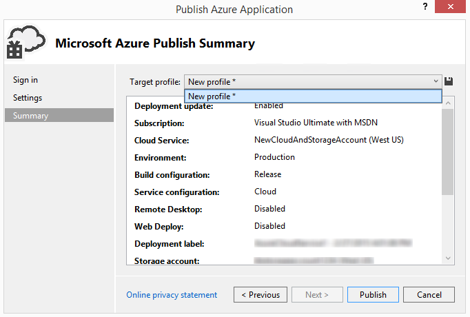

<properties
   pageTitle="Come gestire le configurazioni dei servizi e dei profili | Microsoft Azure"
   description="Informazioni su come usare i file di configurazione del servizio profili e configurazioni | quali archiviare le impostazioni per gli ambienti di distribuzione e le impostazioni per i servizi cloud di pubblicazione."
   services="visual-studio-online"
   documentationCenter="na"
   authors="TomArcher"
   manager="douge"
   editor="" />
<tags
   ms.service="multiple"
   ms.devlang="dotnet"
   ms.topic="article"
   ms.tgt_pltfrm="na"
   ms.workload="multiple"
   ms.date="08/15/2016"
   ms.author="tarcher" />

# Come gestire i profili e configurazione dei servizi

## Panoramica

Quando si pubblica un servizio cloud, Visual Studio memorizza le informazioni di configurazione in due tipi di file di configurazione: servizio profili e configurazioni. Configurazioni dei servizi (file cscfg) archiviare le impostazioni per gli ambienti di distribuzione per un servizio cloud Azure. Azure utilizza questi file di configurazione quando vengono gestiti i servizi cloud. Mano, le impostazioni per i servizi cloud di pubblicazione archivio dei profili (.azurePubxml file). Queste impostazioni sono un record della scelta effettuata quando si utilizza la pubblicazione guidata e vengono usate in locale da Visual Studio. In questo argomento viene illustrato come lavorare con entrambi i tipi di file di configurazione.

## Configurazioni dei servizi

È possibile creare più configurazioni dei servizi da usare per ognuna degli ambienti di distribuzione. Ad esempio, è possibile creare una configurazione del servizio per l'ambiente locale che consente di eseguire e testare un'applicazione Azure e un'altra configurazione del servizio per l'ambiente di produzione.

È possibile aggiungere, eliminare, rinominare e modificare queste configurazioni di servizio in base alle esigenze. È possibile gestire queste configurazioni servizio da Visual Studio, come illustrato nella figura seguente.

È anche possibile aprire la finestra di dialogo **Gestisci configurazioni** dalle pagine delle proprietà del ruolo. Per visualizzare le proprietà per un ruolo di un progetto di Azure, aprire il menu di scelta rapida per tale ruolo e quindi scegliere **proprietà**. Nella scheda **Impostazioni** , espandere l'elenco di **Configurazione del servizio** e quindi selezionare **Gestisci** per aprire la finestra di dialogo **Gestisci configurazioni** .

### Per aggiungere una configurazione del servizio

1. In Esplora soluzioni aprire il menu di scelta rapida per il progetto Azure e quindi selezionare **Gestisci configurazioni**.

    Viene visualizzata la finestra di dialogo **Gestisci configurazioni dei servizi** .

1. Per aggiungere una configurazione del servizio, è necessario creare una copia di una configurazione esistente. A tale scopo, selezionare la configurazione che si desidera copiare nell'elenco nome, quindi scegliere **Crea copia**.

1. (Facoltativo) Per specificare un nome diverso per la configurazione del servizio, scegliere la configurazione del servizio di nuovo nella casella nome e quindi scegliere **Rinomina**. Nella casella di testo **nome** digitare il nome che si desidera utilizzare per la configurazione del servizio e fare clic su **OK**.

    Un nuovo servizio file di configurazione denominato ServiceConfiguration. [Nome] cscfg viene aggiunta al progetto Azure in Esplora soluzioni.

### Per eliminare una configurazione del servizio

1. In Esplora risorse, aprire il menu di scelta rapida per il progetto Azure e quindi selezionare **Gestisci configurazioni**.

    Viene visualizzata la finestra di dialogo **Gestisci configurazioni dei servizi** .

1. Per eliminare una configurazione del servizio, selezionare la configurazione che si desidera eliminare dall'elenco **nome** e quindi scegliere **Rimuovi**. Per verificare che si desidera eliminare questa configurazione viene visualizzata una finestra di dialogo.

1. Selezionare **Elimina**.

     Il file di configurazione del servizio viene rimosso dal progetto Azure in Esplora soluzioni.

### Per rinominare una configurazione del servizio

1. In Esplora risorse, aprire il menu di scelta rapida per il progetto Azure e quindi selezionare **Gestisci configurazioni**.

    Viene visualizzata la finestra di dialogo **Gestisci configurazioni dei servizi** .

1. Per rinominare una configurazione del servizio, scegliere nuova configurazione del servizio nell'elenco **nome** e quindi scegliere **Rinomina**. Nella casella di testo **nome** digitare il nome che si desidera utilizzare per la configurazione del servizio e fare clic su **OK**.

    Il nome del file di configurazione del servizio viene modificato nel progetto di Azure in Esplora soluzioni.

### Per modificare una configurazione del servizio

- Se si desidera modificare una configurazione del servizio, aprire il menu di scelta rapida per il ruolo specifico che si desidera modificare nel progetto di Azure e quindi scegliere **proprietà**. Vedere [How to: configurare i ruoli per un servizio Cloud di Azure con Visual Studio](https://msdn.microsoft.com/library/azure/hh369931.aspx) per ulteriori informazioni.

## Rendere le combinazioni di impostazione diversi per mediante i profili

Utilizzando un profilo, è possibile automaticamente riempire della **Pubblicazione guidata** con diverse combinazioni di impostazioni per diversi scopi. Ad esempio, è possibile disporre di un profilo per il debug e un'altra versione Compila. In questo caso, il profilo **Debug** avrebbe **IntelliTrace** attivazione e la configurazione di **Debug** selezionata e il profilo di **rilascio** avrebbe **IntelliTrace** disabilitato e la configurazione di **rilascio** selezionato. È anche possibile utilizzare diversi profili per distribuire un servizio utilizzando un account di archiviazione diversi.

Quando si esegue la procedura guidata per la prima volta, viene creato un profilo predefinito. Verrà archiviato il profilo in un file con estensione .azurePubXml, che viene aggiunto al progetto Azure nella cartella dei **profili** . Se si specifica manualmente diverse opzioni quando si esegue la procedura guidata in un secondo momento, il file verrà aggiornato automaticamente. Prima di eseguire la procedura seguente, è necessario sono già pubblicate il servizio cloud almeno una volta.

### Per aggiungere un profilo

1. Aprire il menu di scelta rapida per il progetto Azure e quindi selezionare **pubblica**.

1. Accanto all'elenco di **profilo di destinazione** , selezionare il pulsante **Salva profilo** , come mostrato nella figura seguente. Consente di creare un profilo dell'utente.

    

1. Una volta creato il profilo, selezionare **< Gestisci >** nell'elenco del **profilo di destinazione** .

    Viene visualizzata la finestra di dialogo **Gestisci profili** , come mostrato nella figura seguente.

    

1. Nella casella **nome** , scegliere un profilo e quindi selezionare **Crea copia**.

1. Fare clic sul pulsante **Chiudi** .

    Nuovo profilo verrà visualizzato nell'elenco di profilo di destinazione.

1. Nell'elenco **profilo di destinazione** , selezionare il profilo appena creata. Cambiare le opzioni del profilo selezionato le impostazioni di pubblicazione guidata.

1. Selezionare i pulsanti **precedente** e **successiva** per visualizzare ogni pagina della pubblicazione guidata e quindi personalizzare le impostazioni per il profilo. Per informazioni, vedere [Pubblicazione guidata applicazione Azure](http://go.microsoft.com/fwlink/p/?LinkID=623085) .

1. Dopo aver completato la personalizzazione delle impostazioni, selezionare **Avanti** per tornare alla pagina Impostazioni. Il profilo verrà salvato quando si pubblica il servizio usando queste impostazioni o se si seleziona **Salva** accanto all'elenco dei profili.

### Per rinominare o eliminare un profilo

1. Aprire il menu di scelta rapida per il progetto Azure e quindi selezionare **pubblica**.

1. Nell'elenco **profilo di destinazione** selezionare **Gestisci**.

1. Nella finestra di dialogo **Gestisci profili** , selezionare il profilo che si desidera eliminare e quindi scegliere **Rimuovi**.

1. Nella finestra di dialogo conferma scegliere **OK**.

1. Selezionare **Chiudi**.

### Per modificare un profilo

1. Aprire il menu di scelta rapida per il progetto Azure e quindi selezionare **pubblica**.

1. Nell'elenco **profilo di destinazione** , selezionare il profilo che si desidera modificare.

1. Selezionare i pulsanti **precedente** e **successiva** per visualizzare ogni pagina della pubblicazione guidata e quindi modificare le impostazioni desiderate. Per informazioni, vedere [Pubblicazione guidata applicazione Azure](http://go.microsoft.com/fwlink/p/?LinkID=623085) .

1. Dopo avere modificato le impostazioni, selezionare **Avanti** per tornare alla pagina **Impostazioni** .

1. (Facoltativo) selezionare **pubblica** per pubblicare il servizio cloud utilizzando le nuove impostazioni. Se non si desidera pubblicare il servizio cloud al momento e si chiude la pubblicazione guidata, verrà chiesto se si desidera salvare le modifiche al profilo.

## Passaggi successivi

Per ulteriori informazioni sulla configurazione di altre parti del progetto Azure da Visual Studio, vedere [configurazione di un progetto di Azure](http://go.microsoft.com/fwlink/p/?LinkID=623075)
