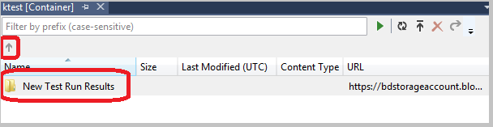

<properties
   pageTitle="Esplorazione e la gestione risorse di archiviazione con Esplora risorse Server | Microsoft Azure"
   description="Esplorazione e la gestione risorse di archiviazione con Esplora risorse Server"
   services="visual-studio-online"
   documentationCenter="na"
   authors="TomArcher"
   manager="douge"
   editor="" />
<tags
   ms.service="storage"
   ms.devlang="multiple"
   ms.topic="article"
   ms.tgt_pltfrm="na"
   ms.workload="na"
   ms.date="07/18/2016"
   ms.author="tarcher" />

# Esplorazione e la gestione risorse di archiviazione con Esplora risorse Server

[AZURE.INCLUDE [storage-try-azure-tools](../includes/storage-try-azure-tools.md)]

## Panoramica
Se sono stati installati gli strumenti di Azure per Microsoft Visual Studio, è possibile visualizzare dagli account lo spazio di archiviazione blob, coda e dati della tabella per Azure. Il nodo dello spazio di archiviazione di Azure in Esplora Server vengono visualizzati i dati in account emulatore archivio locale e di altri account di archiviazione Azure.

Per visualizzare Esplora Server in Visual Studio, sulla barra dei menu, scegliere **Visualizza**, **Esplora Server**. Il nodo dello spazio di archiviazione Mostra tutti gli account di archiviazione presenti in ogni abbonamento/certificato Azure a che si è connessi. Se l'account di archiviazione non è disponibile, è possibile aggiungere seguendo le istruzioni [più avanti in questo argomento](#add-storage-accounts-by-using-server-explorer).

A partire da Azure SDK 2.7, è possibile usare anche Esplora aree Cloud di nuovo per visualizzare e gestire le risorse Azure. Per ulteriori informazioni, vedere [Gestione di risorse Azure con Esplora risorse Cloud](./vs-azure-tools-resources-managing-with-cloud-explorer.md) .

## Visualizzare e gestire le risorse di archiviazione in Visual Studio

Esplora server compare automaticamente un elenco di BLOB, code e tabelle nell'account emulatore lo spazio di archiviazione. L'account di emulatore lo spazio di archiviazione è elencato in Esplora Server in corrispondenza del nodo di spazio di archiviazione del nodo di **sviluppo** .

Per vedere le risorse dell'account emulatore lo spazio di archiviazione, espandere il nodo di **sviluppo** . Se l'emulatore lo spazio di archiviazione non è stato avviato quando si espande il nodo **sviluppo** , viene avviato automaticamente. Possono essere necessari alcuni secondi. È possibile continuare a lavorare in altre aree di Visual Studio durante l'avvio di emulatore lo spazio di archiviazione.

Per visualizzare le risorse in un account di archiviazione, espandere il nodo dell'account di archiviazione in Esplora Server. Vengono visualizzati i nodi secondari seguenti:

- BLOB

- Code

- Tabelle

## Gestire le risorse Blob

Il nodo BLOB Visualizza un elenco di contenitori per l'account di archiviazione selezionato. È possibile organizzare questi BLOB in cartelle e sottocartelle contenitori BLOB contengano file blob. Per ulteriori informazioni, vedere [come utilizzare l'archiviazione Blob da .NET](./storage/storage-dotnet-how-to-use-blobs.md) .

### Per creare un contenitore di blob

1. Aprire il menu di scelta rapida per il nodo **BLOB** e quindi scegliere **Crea Blob contenitore**.

1. Immettere il nome del nuovo contenitore nella finestra di dialogo **Crea contenitore Blob** e quindi scegliere **Ok**

    >[AZURE.NOTE] Il nome del contenitore di blob deve iniziare con un numero (0-9) o la lettera minuscola (a-z).

### Per eliminare un contenitore di blob

- Aprire il menu di scelta rapida per il contenitore blob che si desidera rimuovere e quindi scegliere **Elimina**.

### Per visualizzare un elenco degli elementi contenuti in un contenitore di blob

- Aprire il menu di scelta rapida per il nome di un contenitore di blob nell'elenco e quindi scegliere **Visualizzazione Blob contenitore**.

    Quando si visualizza il contenuto di un contenitore di blob, viene visualizzato in una scheda nota come la visualizzazione di contenitore blob.

    

    È possibile eseguire le operazioni seguenti su BLOB utilizzando i pulsanti nell'angolo superiore destro della visualizzazione contenitore blob:

    - Immettere un valore di filtro e applicarlo

    - Aggiornare l'elenco delle BLOB nel contenitore

    - Caricare un file

    - Eliminare un blob

      >[AZURE.NOTE] Eliminazione di un file da un contenitore di blob non comporta l'eliminazione di file sottostante. viene solo rimosso dal contenitore blob.

    - Aprire un blob

    - Salvare un blob al computer locale

### Per creare una cartella o una sottocartella in un contenitore di blob

1. Scegliere il contenitore blob in Esplora Server. Nella finestra contenitore, scegliere il pulsante **Carica Blob** .

    

1. Nella finestra di dialogo **Carica File nuovo** , fare clic sul pulsante **Sfoglia** per specificare il file da caricare e quindi immettere un nome per la cartella nella casella **cartella (facoltativo)** .

    È possibile aggiungere sottocartelle in cartelle contenitore seguendo la stessa procedura. Se non si specifica un nome per la cartella, il file verrà caricato a livello superiore del contenitore di blob. Il file compare nella cartella specificata nel contenitore.

    

1. Fare doppio clic sulla cartella o premere INVIO per visualizzare il contenuto della cartella. Quando si è nella cartella del contenitore, è possibile passare alla radice del contenitore facendo clic sul pulsante **Apri Directory padre** (freccia).

### Per eliminare una cartella contenitore

 - Eliminare tutti i file nella cartella

    >[AZURE.NOTE] Poiché le cartelle in contenitori blob sono cartelle virtuali, non è possibile creare una cartella vuota, né è possibile eliminare una cartella per eliminare il contenuto del file. È necessario eliminare l'intero contenuto di una cartella da eliminare la cartella.

### Per filtrare BLOB in un contenitore

È possibile filtrare i BLOB vengano visualizzati specificando un prefisso comune.

Ad esempio, se si immette il prefisso `hello` nel testo del filtro e quindi scegliere **Esegui** (**!**) pulsante, vengono visualizzati solo i blob che iniziano con "Ciao".

>[AZURE.NOTE] Il campo del filtro tra maiuscole e minuscole e non supporta il filtro con caratteri jolly. È possibile filtrare solo BLOB dal prefisso. Il prefisso può includere un delimitatore se si utilizza un delimitatore per organizzare BLOB in una gerarchia virtuale. Ad esempio, filtrando il prefisso HelloFabric / restituisce tutti i blob che iniziano con la stringa.

### Scaricare dati blob

- In **Esplora Server**, aprire il menu di scelta rapida per uno o più BLOB e quindi scegliere **Apri**, o scegliere il nome blob e quindi scegliere il pulsante **Apri** oppure fare doppio clic sul nome blob.

    Lo stato di avanzamento di un download di blob verrà visualizzato nella finestra **Registro attività Azure** .

    Il blob viene aperta nell'editor predefinito per il tipo di file. Se il sistema operativo riconosce il tipo di file, il file viene aperto in un'applicazione installata in locale. in caso contrario, viene richiesto di selezionare un'applicazione più appropriata per il tipo di file del blob. Il file locale creato quando si scarica un blob è contrassegnato come di sola lettura.

    Dati BLOB nella cache locale e rispetto ora dell'ultima modifica del blob nel servizio Blob. Se il blob è stato aggiornato dopo ultimo è stato scaricato, essere scaricata. in caso contrario il blob verrà caricato dal disco locale. Per impostazione predefinita un blob viene scaricato una directory temporanea. Per scaricare BLOB a una directory specifica, aprire il menu di scelta rapida per i nomi di blob selezionato e scegliere **Salva con nome**. Quando si salva un blob in questo modo, il file di archivio blob non è aperto e il file locale viene creato con gli attributi di sola lettura.

### Per caricare BLOB

- Fare clic sul pulsante **Carica Blob** quando il contenitore è aperto per la visualizzazione nella visualizzazione contenitore blob.

    È possibile scegliere uno o più file da caricare ed è possibile caricare file di qualsiasi tipo. **Registro attività Azure** segnala l'avanzamento del processo di caricamento. Per ulteriori informazioni su come lavorare con i dati blob, vedere [come utilizzare il servizio di archiviazione Blob Azure in .NET](http://go.microsoft.com/fwlink/p/?LinkId=267911).

### Per visualizzare i registri trasferite al BLOB

- Se si usa Azure diagnostica per registrare i dati da un'applicazione Azure ed è stato trasferito log al proprio account di archiviazione, si noterà contenitori che sono stati creati da Azure per questi file di log. Visualizzazione questi file di log in Esplora Server è un modo semplice per individuare i problemi con l'applicazione, soprattutto se è stata distribuita in Azure. Per ulteriori informazioni sulla diagnostica Azure, vedere [Raccogliere dati registrazione dalla tramite diagnostica Azure](https://msdn.microsoft.com/library/azure/gg433048.aspx).

### Per ottenere l'URL per un blob

- Aprire il menu di scelta rapida del blob e quindi scegliere **Copia URL**.

### Per modificare un blob

- Selezionare il blob e quindi fare clic sul pulsante **Apri Blob** .

    Il file scaricato in un percorso temporaneo aperto nel computer locale Dopo aver apportato le modifiche, è necessario caricare nuovamente il blob.

## Gestire le risorse coda

Code di servizi di archiviazione sono ospitate in un account di archiviazione Azure e usarli per consentire il cloud ruoli del servizio comunicare con loro e con altri servizi da un messaggio meccanismo di passaggio. È possibile accedere a livello di programmazione coda tramite un servizio cloud e in un servizio web per clienti esterni. È anche possibile accedere coda tramite Esplora Server in Visual Studio.

Quando si sviluppa un servizio cloud che utilizza code, è consigliabile utilizzare Visual Studio per creare code e lavorare con loro in modo interattivo mentre sviluppare e testare il codice.

In Esplora Server, è possibile visualizzare le code in un account di archiviazione, creare eliminare code, aprire una coda per visualizzare i messaggi e aggiungere i messaggi a una coda. Quando si apre una coda per la visualizzazione, è possibile visualizzare i messaggi individuali ed è possibile eseguire le azioni seguenti nella coda utilizzando i pulsanti nell'angolo superiore sinistro:

- Aggiornare la visualizzazione della coda

- Aggiungere un messaggio in coda

- Rimuovere il messaggio in primo piano.

- Deselezionare l'intera coda

Nella figura seguente mostra una coda che contiene due messaggi.

Per ulteriori informazioni sull'archiviazione dei servizi code, vedere [How to: usare il servizio di archiviazione coda](http://go.microsoft.com/fwlink/?LinkID=264702). Per informazioni sul servizio web per le code di servizi di archiviazione, vedere [Coda concetti relativi al servizio](http://go.microsoft.com/fwlink/?LinkId=264788). Per informazioni su come inviare messaggi a una coda di servizi di archiviazione utilizzando Visual Studio, vedere [Invio di messaggi a una coda di servizi di archiviazione](https://msdn.microsoft.com/library/azure/jj649344.aspx).

>[AZURE.NOTE] Code di servizi di archiviazione sono diverse dalle code bus di servizio. Per ulteriori informazioni sulle servizio bus code, vedere servizio Bus code, argomenti e le sottoscrizioni.

## Gestire le risorse di tabella

Il servizio di archiviazione tabella Azure archivia grandi quantità di dati strutturati. Il servizio è un archivio dati NoSQL che accetta autenticato chiamate da interne ed esterne cloud Azure. Tabelle Azure sono ideali per l'archiviazione dei dati strutturati e non relazionali.

### Per creare una tabella

1. In Esplora Server, selezionare il nodo **tabelle** dell'account di archiviazione e quindi scegliere **Crea tabella**.

1. Nella finestra di dialogo **Crea tabella** immettere un nome per la tabella.

### Per visualizzare i dati della tabella

1. In Esplora risorse, aprire il nodo **Azure** e quindi aprire il nodo **dello spazio di archiviazione** .

1. Aprire il nodo di account di archiviazione che si è interessati e quindi aprire il nodo **tabelle** per visualizzare un elenco di tabelle per l'account di archiviazione.

1. Aprire il menu di scelta rapida per una tabella e quindi scegliere **Visualizzazione tabella**.

    

Nella tabella è organizzata da entità (mostrata in righe) e proprietà (visualizzate nelle colonne). Ad esempio, l'illustrazione seguente mostra entità elencate nella finestra **Di progettazione tabelle**di:

### Per modificare i dati di tabella

1. Nella finestra di **Progettazione tabelle**aprire il menu di scelta rapida per un'entità (una sola riga) o una proprietà (una singola cella) e quindi scegliere **Modifica**.

    

    Entità in un'unica tabella non sono necessari per lo stesso insieme di proprietà (colonne). Tenere presente le seguenti restrizioni sulla visualizzazione e modifica dei dati di tabella.
    - Non è possibile visualizzare o modificare dati binari (tipo byte[]), ma è possibile memorizzare in una tabella.

    - È possibile modificare i valori **PartitionKey** o **RowKey** , in quanto l'archiviazione tabella in Azure non supporta l'operazione.

    - Non è possibile creare una proprietà denominata Timestamp, servizi di archiviazione di Azure utilizzano una proprietà con lo stesso nome.

    - Se si immette un valore DateTime, è necessario seguire un formato appropriata per le impostazioni di lingua e opzioni internazionali del computer (ad esempio gg/MM/aaaa hh [AM | PM] per la lingua inglese degli Stati Uniti).

### Per aggiungere entità

1. Nella finestra di **Progettazione tabelle**fare clic sul pulsante **Aggiungi entità** , ossia accanto all'angolo superiore destro della visualizzazione tabella di seguito.

    

1. Nella finestra di dialogo **Aggiungi entità** immettere i valori delle proprietà **PartitionKey** e **RowKey** .

    

    Immettere i valori con attenzione perché non è possibile modificare quando si chiude la finestra di dialogo, a meno che non si elimina l'entità e aggiungerlo di nuovo.

### Per filtrare entità

È possibile personalizzare il set di entità che vengono visualizzati in una tabella se si usa il generatore di query.

1. Per aprire il generatore di query, aprire una tabella per la visualizzazione.

1. Fare clic sul pulsante più a destra sulla barra degli strumenti della visualizzazione tabella.

    Verrà visualizzata la finestra di dialogo **Generatore di Query** . L'illustrazione seguente mostra una query che si sta compilando nel generatore di query.

    

1. Dopo aver completato la creazione della query, chiudere la finestra di dialogo. La forma di testo risultante della query viene visualizzato in una casella di testo come un filtro WCF Data Services.

1. Per eseguire la query, fare clic sull'icona triangolo verde.

    È inoltre possibile filtrare i dati dell'entità che viene visualizzato in **Progettazione tabelle** se si immette una stringa di filtro WCF Data Services direttamente nel campo filtro. Questo tipo di stringa è simile a una clausola WHERE SQL ma viene inviato al server come una richiesta HTTP. Per informazioni su come creare stringhe di filtro, vedere [La costruzione di stringhe di filtro per la progettazione di tabelle](https://msdn.microsoft.com/library/azure/ff683669.aspx).

    L'illustrazione seguente mostra un esempio di una stringa di filtro valide:

    

### Aggiornare i dati di spazio di archiviazione

Quando si Esplora Server si connette a o ottiene i dati da un account di archiviazione, potrebbero occupare in un minuto completare l'operazione. Se non è possibile connettersi, l'operazione potrebbe timeout. Durante recupero dei dati, è possibile continuare a lavorare in altre parti di Visual Studio. Per annullare l'operazione se sta impiegando troppo tempo, scegliere il pulsante **Annulla aggiornamento** sulla barra degli strumenti Esplora Server.

#### Per aggiornare i dati contenitore blob

- Selezionare il nodo **BLOB** di sotto **dello spazio di archiviazione** e scegliere il pulsante **Aggiorna** sulla barra degli strumenti Esplora Server.

- Per aggiornare l'elenco dei blob che viene visualizzato, fare clic su **Esegui** .

#### Per aggiornare i dati di tabella

- Selezionare il nodo **tabelle** di sotto **dello spazio di archiviazione** e scegliere il pulsante **Aggiorna** .

- Per aggiornare l'elenco di entità che viene visualizzato in **Progettazione tabelle**, fare clic su **Esegui** nella finestra di **Progettazione tabelle**.

#### Per aggiornare i dati di coda

- Selezionare il nodo **code** e quindi fare clic sul pulsante **Aggiorna** .

#### Per aggiornare tutti gli elementi di un account di archiviazione

- Scegliere il nome dell'account e quindi scegliere il pulsante **Aggiorna** sulla barra degli strumenti per Esplora Server.

### Aggiungere gli account di archiviazione tramite Esplora Server

Esistono due modi per aggiungere gli account di archiviazione tramite Esplora Server. È possibile creare un nuovo account di archiviazione nell'abbonamento Azure, oppure è possibile collegare un account di archiviazione esistente.

#### Per creare un nuovo account di archiviazione tramite Esplora Server

1. In Esplora risorse, aprire il menu di scelta rapida per il nodo dello spazio di archiviazione e quindi scegliere Crea Account lo spazio di archiviazione.

    

1. Selezionare o immettere le informazioni seguenti per il nuovo account di archiviazione nella finestra di dialogo **Crea Account lo spazio di archiviazione** .

    - L'abbonamento Azure a cui si desidera aggiungere l'account di archiviazione.

    - Il nome che si desidera utilizzare per il nuovo account di archiviazione.

    - L'area geografica o il gruppo di affinità (ad esempio occidentale degli Stati Uniti o Asia orientale).

    - Il tipo di replica che si desidera utilizzare per l'account di archiviazione, ad esempio ridondanti geografico.

1. Scegliere **Crea**.

    Il nuovo account di archiviazione viene visualizzato nell'elenco **dello spazio di archiviazione** in Esplora soluzioni.

#### Per collegare un account di archiviazione esistente tramite Esplora Server

1. In Esplora Server, aprire il menu di scelta rapida per il nodo dello spazio di archiviazione Azure e quindi scegliere **Allegare esterni lo spazio di archiviazione**.

    

1. Selezionare o immettere le informazioni seguenti per il nuovo account di archiviazione nella finestra di dialogo **Crea Account lo spazio di archiviazione** .

    - Il nome dell'account di archiviazione esistente che si desidera allegare. È possibile immettere un nome o selezionarlo nell'elenco.

    - Il tasto per l'account di archiviazione selezionato. Questo valore è in genere fornito automaticamente quando si seleziona un account di archiviazione. Se si desidera Visual Studio per ricordare la chiave account di archiviazione, selezionare la chiave account memorizza.

    - Il protocollo da utilizzare per connettersi all'account di archiviazione, ad esempio HTTP, HTTPS o un endpoint personalizzato. Per ulteriori informazioni sugli endpoint personalizzati, vedere [come configurare le stringhe di connessione](https://msdn.microsoft.com/library/azure/ee758697.aspx) .

### Per visualizzare i punti finali secondari

- Se è stato creato un account di archiviazione tramite l'opzione di replica **Ridondanti geografico di accesso in lettura** , è possibile visualizzare i punti finali secondari. Aprire il menu di scelta rapida per il nome dell'account e quindi scegliere **proprietà**.

    

### Per rimuovere un account di archiviazione da Esplora Server

- In Esplora risorse, aprire il menu di scelta rapida per il nome dell'account e quindi scegliere **Elimina**. Se si elimina un account di archiviazione, viene rimosso anche tutte le informazioni chiave salvate per tale account.

    >[AZURE.NOTE] Se si elimina un account di archiviazione da Esplora Server, e non influisce l'account di archiviazione o ai dati contenuti; rimuove semplicemente il riferimento da Esplora Server. Per eliminare definitivamente un account di archiviazione, utilizzare il [portale classica Azure](http://go.microsoft.com/fwlink/?LinkID=213885).

## Passaggi successivi

Per ulteriori che informazioni su come usare i servizi di archiviazione Azure, vedere [accesso ai servizi di archiviazione Windows Azure](https://msdn.microsoft.com/library/azure/ee405490.aspx).
