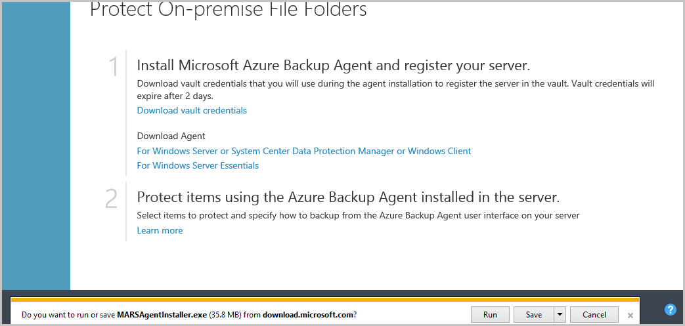

<properties
    pageTitle="Creare le immagini in vendite promozionali"
    description="In questo articolo viene spiegato come creare immagini in vendite promozionali in base alle linee guida impostare per archivi Azure."
    services=""
    solutions=""
    documentationCenter=""
    authors="kenhoff"
    manager="ilanas"
    editor="tysonn"/>

<tags
    ms.service="contributor-guide"
    ms.devlang=""
    ms.topic="article"
    ms.tgt_pltfrm=""
    ms.workload=""
    ms.date="06/25/2015"
    ms.author="kenhoff" />

# <a name="create-images-in-markdown"></a>Creare le immagini in vendite promozionali

## <a name="image-folder-creation-and-link-syntax"></a>Sintassi di creazione e collegamento cartella immagine

Per un nuovo articolo, è necessario creare una cartella in uno dei seguenti percorsi:

    /articles/<service-directory>/media/<article-name>/

Per esempio:

    /articles/app-service/media/app-service-enterprise-multichannel-apps/

Dopo aver creato la cartella e immagini aggiunte a tale, utilizzare la sintassi seguente per creare le immagini nell'articolo della:

```

```
Esempio:

Vedere [il modello delle vendite promozionali](../markdown%20templates/markdown-template-for-new-articles.md) per un esempio.  I collegamenti di riferimento immagine nel modello delle vendite promozionali sono progettati per essere nella parte inferiore del modello.

## <a name="guidelines-specific-to-azuremicrosoftcom"></a>Linee guida specifiche per azure.microsoft.com

Screenshot attualmente sono invitati se non è possibile includere passaggi. Scrivere il contenuto in modo che il contenuto può attivare senza degli screenshot se necessario.

Utilizzare le seguenti linee guida durante la creazione e inclusi i file di immagine:
- Non condividere i file di immagine in tutti i documenti. Copiare il file è necessario, aggiungere la cartella elementi multimediali per l'argomento specifico. Condivisione tra file non è consigliabile perché è facile rimuovere deprecata contenuto e immagini in modo da mantenere la repo libera.

- Formati di file: usare i file PNG - sono qualità e gestire la qualità durante il processo di localizzazione. Altri formati di file non mantengono anche la qualità. Il formato JPEG è consentito, ma non preferito.  Nessun file di immagine GIF animato.

- Utilizzare quadrati rossi della larghezza predefinita fornite in Paint (5 px) per richiamare l'attenzione su determinati elementi in schermate.  

    Esempio:

    

- Quando opportuno, è possibile ritagliare le immagini in modo che gli elementi dell'interfaccia utente verranno visualizzati nelle dimensioni originali. Assicurarsi che il contesto sia deselezionato per gli utenti, tuttavia.

- Evitare gli spazi vuoti in bordi di schermate. Se si ritaglia un'immagine in modo da lascia uno sfondo bianco ai bordi, aggiungere un bordo singolo pixel grigia intorno all'immagine.  Se in Paint, utilizzare il grigio chiaro nella tavolozza predefinita (0xC3C3C3). In alcuni altri grafiche app, il colore RGB è R195, G195, 195. È possibile aggiungere un bordo intorno a un'immagine grigio facilmente in Visio, per eseguire questa operazione, selezionare l'immagine, selezionare riga e assicurarsi che i colori corretto è impostata e quindi modificare lo spessore della linea per pt 1 1/2.  Screenshot devono avere un bordo grigio di larghezza di 1 pixel, in modo che le aree bianche della schermata non sfocatura nella pagina web.

    Esempio:

    
    
    Per uno strumento automatizzare il processo di aggiunta del bordo necessario alle immagini, vedere [AddACOMBorder strumento - come automatizzare il processo di aggiunta bordo necessari 1 pixel grigio alle immagini ACOM](https://github.com/Azure/Azure-CSI-Content-Tools/tree/master/Tools/AddACOMImageBorder).

- Immagini concettuali con uno spazio non è necessario un bordo grigio.  

    Esempio:

    

- Provare a non creare un'immagine troppo grande.  Immagini vengono ridimensionate automaticamente se sono troppo grandi. Tuttavia, ridimensionando in alcuni casi, tolleranza, è consigliabile limitare la larghezza delle immagini per 780 px e impostare manualmente le immagini di ridimensionamento prima dell'invio, se necessario.

- Mostra output di comando in schermate.  Se l'articolo include i passaggi in cui l'utente lavora all'interno di una shell, è utile mostrare l'output del comando in schermate. In questo caso, limitare la larghezza di shell per circa 72 caratteri in genere garantisce che l'immagine rimarrà delle linee Guida larghezza px 780. Prima di iniziare una schermata di output, ridimensionata in modo che venga visualizzato solo il comando e output (facoltativamente con una riga vuota sul lato "uno").

- Richiedere intere schermate di windows laddove possibile. Quando si impiega una schermata di una finestra del browser, ridimensionare la finestra del browser per 780 px minore o uguale a larghezza e mantenere l'altezza della finestra del browser come brevi presto tale posizione all'interno della finestra dell'applicazione.

    Esempio:

    

- Prestare attenzione con informazioni che viene visualizzate in schermate.  Non rivelare informazioni società interna o informazioni personali.

- Arte concettuale o diagrammi, utilizzare le icone ufficiale nel set di simboli e icona Cloud e dell'organizzazione. Un gruppo pubblico è disponibile in http://aka.ms/CnESymbols.

- Sostituire le informazioni personali o private in schermate con testo segnaposto racchiuso tra parentesi ad angolo. Sono inclusi i nomi utente, gli ID di abbonamento e altre informazioni correlate. I nomi di persone possono essere sostituiti con un [nome fittizi approvato](https://aka.ms/ficticiousnames)(collegamento solo dipendente). Non usare il suggerimento matita o indicatore Paint per nascondere o la sfocatura di informazioni personali o private.

  Nella figura seguente è stata aggiornata correttamente per sostituire l' effettivo **ID abbonamento** con informazioni segnaposto:

  

### <a name="contributors-guide-links"></a>Collegamenti di Guida dei collaboratori

- [Articolo di panoramica](./../README.md)
- [Indice degli articoli di Guida](./contributor-guide-index.md)
