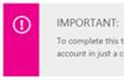

<properties
    title="required"
    pageTitle="Estensioni delle vendite promozionali personalizzato utilizzate negli articoli tecnici"
    description="Elenca le estensioni delle vendite promozionali personalizzati che consentono di video incorporati, le note, suggerimenti, il contenuto riutilizzabile e altro elemento di articoli tecnici azure.microsoft.com."
    services=""
    solutions=""
    documentationCenter=""
    authors="tysonn"
    manager="carolz"
    editor=""/>

<tags
    ms.service="contributor-guide"
    ms.devlang=""
    ms.topic="article"
    ms.tgt_pltfrm=""
    ms.workload=""
    ms.date="01/22/2015"
    ms.author="tysonn"/>

## Vendite promozionali per Azure.microsoft.com

Per suggerimenti generali delle vendite promozionali, vedere [Nozioni di base delle vendite promozionali](https://help.github.com/articles/markdown-basics/) e il [foglio riassuntivo delle vendite promozionali](./media/documents/markdown-cheatsheet.pdf?raw=true). Se è necessario creare collegamenti incrociati articolo in vendite promozionali, vedere [collegamento Guida] (. / create-links-markdown.md#markdown-syntax-for-acom-relative-links.md/).

Azure.microsoft.com supporta [recintato blocchi di codice](https://help.github.com/articles/github-flavored-markdown/#fenced-code-blocks) e [sintassi evidenziazione](https://help.github.com/articles/github-flavored-markdown/#syntax-highlighting). Tuttavia, ACOM supporta solo una sintassi evidenziazione combinazione di colori, indipendentemente dalla lingua specificata in un blocco di codice.

## Estensioni delle vendite promozionali personalizzato utilizzate negli articoli tecnici

Gli articoli usare delle vendite promozionali flavored GitHub per la maggior parte dei articolo formattazione - paragrafi, collegamenti, elenchi, i titoli e così via. Ma si utilizzano le estensioni delle vendite promozionali personalizzato in cui è necessario formattazione più nelle pagine di rendering su azure.microsoft.com. Ecco le estensioni che correntemente utilizzati:

+ [Note e suggerimenti]
+ [Include]
+ [Video incorporati]
+ [Tecnologia e la piattaforma selettori]

## Note e suggerimenti

È possibile scegliere tra 4 tipi di note e suggerimenti:

- AZURE. NOTA
- AZURE. AVVISO
- AZURE. TIPss
- AZURE. IMPORTANTE

###Uso
In generale, utilizzare le note e suggerimenti alta nell'intera gli articoli. Quando si utilizza loro, scegliere il tipo di nota o suggerimento appropriato:

- Utilizzo di AZURE. Nota per evidenziare le informazioni di sistema o un numero positive che mette in evidenza o integrano punti chiave del testo principale. Una nota fornisce informazioni che si applica solo in casi particolari.

  

- Utilizzo di AZURE. AVVISO per segnalare all'utente di una condizione che potrebbe causare problemi in futuro. Ad esempio, selezionando un'opzione di determinate o una scelta determinati potrebbe definitivamente bloccare è in un determinato scenario.

  

- Utilizzo di AZURE. Suggerimento per aiutare gli utenti di applicare le tecniche e procedure descritte nel testo in base a specifiche esigenze. Un suggerimento può inoltre suggerire metodi alternativi che potrebbero non essere più evidenti. Tuttavia, suggerimenti, non sono essenziali per la comprensione del testo.

  

- Utilizzo di AZURE. IMPORTANTE per fornire informazioni essenziali per il completamento di un'attività.

  

Mentre le note e suggerimenti per supportare i collegamenti, immagini, elenchi e blocchi di codice, provare a mantenere le note e suggerimenti semplice e diretto. Se è necessario creare note complesse con numerosi passaggi di formattazione, che potrebbe essere un accesso che è sufficiente disporre di un'altra sezione del testo principale dell'articolo. E troppe le note in un articolo possono essere che distolgono l'attenzione e difficile da digitalizzare o di lettura.

###Vendite promozionali di esempio

Negli esempi di tutto viene un AZURE. NOTA. Per utilizzare un suggerimento, avviso o importante, sostituire "NOTE" nelle vendite promozionali:

    > [AZURE.TIP]

    > [AZURE.WARNING]

    > [AZURE.IMPORTANT]

Singolo paragrafo:

    > [AZURE.NOTE] Per completare questa esercitazione, è necessario disporre di un account di Microsoft Azure attivo. Se non si dispone di un account, è possibile creare un account di valutazione gratuito in pochi minuti.

Multiparagraph:

    > [AZURE.NOTE] Per completare questa esercitazione, è necessario disporre di un account di Microsoft Azure attivo.
    >
    > Se non si dispone di un account, è possibile [creare un account di valutazione gratuito](http://www.windowsazure.com/pricing/free-trial/) in pochi minuti.

## Include

Testo riutilizzabile il nostro repository GitHub si trova nel file che si chiama "include". Quando si dispone di testo che deve essere utilizzato in più articoli, si include un riferimento a tale file di informazioni riutilizzabili. Includi stesso è un file delle vendite promozionali semplice (MD). Può contenere qualsiasi delle vendite promozionali valida, inclusi testo, collegamenti e immagini. Tutti sono incluse delle vendite promozionali file devono essere in [il / include directory](https://github.com/Azure/azure-content/tree/master/includes) nella radice del repository. Quando viene pubblicato l'articolo, è perfettamente integrato Includi testo dell'argomento pubblicato.

- Serve una sintassi specifica per fare riferimento a un'inclusione.

- I file multimediali inseriti in un Includi devono essere creati in una cartella di file multimediali specifici per l'inclusione. Include le cartelle di file multimediali per cui appartiene nella [cartella azure contenuto/include/supporto](https://github.com/Azure/azure-content/tree/master/includes/media). Directory dei supporti non può contenere tutte le immagini nella radice. Se l'Includi non dispone di immagini, una directory di elementi multimediali corrispondente non sarà necessaria.

###Uso

- Usare include nel punto in cui è necessario lo stesso testo all'interno di più articoli.

- Include deve essere utilizzato per grandi quantità di contenuto, un paragrafo o due, una routine condivisa o una sezione condivisa. Non utilizzare per tutte le operazioni inferiori a una frase; **sono non per i nomi dei prodotti**.

- Assicurarsi che lasciati frasi complete o frasi che non dipendono dal testo precedente o il testo seguente nell'articolo che fa riferimento l'Includi il testo in un'inclusione. Ignorare questa guida crea una stringa non convertibile vedere l'articolo che si interrompe l'esperienza localizzata. 

- Non incorporare include all'interno di altri include. Non sono supportati da DPS sistema di pubblicazione.

- Non condividere la media tra i file. Usare un file distinto con un nome univoco per ogni Includi e dell'articolo. Archiviare il file multimediale nella cartella della media associata include.

- Non usare un Includi come solo contenuto dell'articolo.  Include devono essere supplementare al contenuto il resto dell'articolo.

- Perché tutti include deve essere la / include directory, il percorso su un Includi da un articolo è sempre

    .. / include

- Un riferimento di nomefile collegamento o un'immagine nell'articolo e include non ripetuti. Aggiungere "-includere" al nome del file multimediale o riferimento collegamento per evitare la ripetizione del riferimento:

 **Riferimento al collegamento**

 Modifica: odata.org a: includere odata.org

 **Riferimento all'immagine**

 Modifica: table.png a: include.png tabella

###Vendite promozionali di esempio
La sintassi per l'aggiunta di un'inclusione a un articolo documentazione è:

    [AZURE.INCLUDE [include-short-name](../includes/include-file-name.md)]

Esempio

    [AZURE.INCLUDE [howto-blob-storage](../includes/howto-blob-storage.md)]

La prima parte di include è il nome Includi senza il percorso e senza l'estensione MD. Nella seconda parte è il percorso relativo da includere nel / include directory con estensione MD.

###Rendering

Nella pagina GitHub rendering, include sarà rese come indicato di seguito:

 [AZURE. INCLUDERE l'archiviazione di blob procedura]

Nel codice HTML in azure.microsoft.com, il codice HTML dalla include unite in tutte le altre applicazioni di codice HTML del documento. Tuttavia, il codice HTML conterrà HTML commento con l'originale includono nomefile delle vendite promozionali e hash commit GitHub. Questo commento è incluso per la risoluzione dei problemi in modo che il contenuto di origine può essere facilmente identificato e trovare GitHub:

  

## Video incorporati

Gli articoli tecnici supportano i video embeddeded in articoli tecnici, purché i video disponibili nel [canale 9](http://channel9.msdn.com/) sito Microsoft. I video da Channel 9 devono essere integrati con [azure.microsoft.com centro Video](http://azure.microsoft.com/documentation/videos/home/). Attualmente non è supportata video di YouTube incorporati; Se si è un collaboratore della community, si è di creare un collegamento a YouTube se il video che si desidera portare in primo piano è disponibili. Collaboratori Microsoft devono essere utilizzate Channel 9 e il centro del Video.

### Uso

- Assicurarsi che il video sia nell'interfaccia di Video.

- Copiare l'ID di video da URL descrittivo di un video su Channel 9 o dall'interfaccia di Video di Azure. Ad esempio, l'ID di video per il video in [http://azure.microsoft.com/documentation/videos/azure-scheduler-unusual-schedules/](http://azure.microsoft.com/documentation/videos/azure-scheduler-unusual-schedules/) è **azure-utilità di pianificazione-insolito-pianificazioni**.

### Sintassi

    > [AZURE.VIDEO video-id-string]

### Rendering

Via GitHub: [https://github.com/Azure/azure-content-pr/blob/master/articles/web-sites-backup.md](https://github.com/Azure/azure-content-pr/blob/master/articles/web-sites-backup.md)

Articolo pubblicato: [http://azure.microsoft.com/documentation/articles/web-sites-backup/](http://azure.microsoft.com/documentation/articles/web-sites-backup/)

## Tecnologia e la piattaforma selettori

Usare la tecnologia e la piattaforma switcher in articoli tecnici quando si creano più caratteristiche dell'articolo stesso per differenze di indirizzo di implementazione tra tecnologie o piattaforme. Si tratta in genere più appropriata per il contenuto di piattaforma mobile per gli sviluppatori. Sono disponibili due tipi diversi di selettori, [selettori semplici](#simple-selectors) e [selettori bidirezionali](#two-way-selectors).

Poiché la stessa delle vendite promozionali selettore viene inviata in ogni argomento della selezione, è consigliabile posizionare il selettore per l'argomento in un'inclusione, quindi fare riferimento a tale inclusione di tutti gli argomenti che usano lo stesso selettore.

###Selettori semplici

Il rendering dei selettori semplici (unidirezionali) come un insieme di pulsanti di opzione immediatamente sotto il titolo. Utilizzare questi pulsanti quando gli utenti devono scegliere gli argomenti in un set di piattaforma o tecnologia singolo, ad esempio .NET, Node e linguaggio.  Utilizzare l'estensione delle vendite promozionali personalizzati per qualsiasi selettori: non utilizzare HTML per selettori.  

Vedere [Guida introduttiva a hub di notifica](http://azure.microsoft.com/documentation/articles/notification-hubs-windows-phone-get-started/) per visualizzare la creazione dell'autore 8 versioni con lo stesso articolo, ma selettori usati per abilitare lo spostamento tra di loro tutti.

####Sintassi

    > [AZURE.SELECTOR]
    - [Collegare l'etichetta 1 #](link #1 url)
    - [Etichetta collegamento #2](link #2 url)

Esempio:

    > [AZURE.SELECTOR]
    - [Windows universale](../articles/notification-hubs-windows-store-dotnet-get-started/)
    - [Windows Phone](../articles/notification-hubs-windows-phone-get-started/)
    - [iOS](../articles/notification-hubs-ios-get-started/)
    - [Android](../articles/notification-hubs-android-get-started/)
    - [Kindle](../articles/notification-hubs-kindle-get-started/)
    - [Baidu](../articles/notification-hubs-baidu-get-started/)
    - [Xamarin.iOS](../articles/partner-xamarin-notification-hubs-ios-get-started/)
    - [Xamarin.Android](../articles/partner-xamarin-notification-hubs-android-get-started/)

#### Rendering

L'immagine riportata sopra mostra il rendering su azure.microsoft.com. Nelle pagine di rendering GitHub, i selettori il rendering come un elenco puntato dei collegamenti.

###Selettori bidirezionali

Selettori bidirezionali consente agli utenti di selezionare un'argomenti da una matrice di due modi. Si tratta essenziale quando una tecnologia di Azure, ad esempio servizi mobili supporta più piattaforme di back-end, nonché più clienti. Tenere presente quanto segue:

- Mentre è stata progettata come `(Platform | Backend)`, il testo dropwdown può essere ora personalizzato.
- Non è necessaria una voce di elenco per ciascun punto nella matrice, ma solo un elemento in un argomento URL è presente e non un duplicato.
- Il collegamento può essere un URL, anche se è in genere un altro argomento GitHub.

Per visualizzare la creazione dell'autore 15 versioni con lo stesso articolo (9 piattaforme client mobili e 2 piattaforme di back-end), ma selettori usati per abilitare lo spostamento tra di loro tutti, vedere [Introduzione a servizi mobili](http://azure.microsoft.com/en-us/documentation/articles/mobile-services-ios-get-started/) . Si noti che 3 articoli non hanno entrambe le versioni back-end.

####Sintassi

    > [AZURE. ELENCO Selettore (Dropdown1 | Dropdown2)]     -  [(Dropdown1Text1 | Dropdown2Text1)](../articles/dropdown1-text1-dropdown2-text1.md)
    - [(Dropdown1Text1 | Dropdown2Text2)](../articles/dropdown1-text1-dropdown2-text1.md)
    - [(Dropdown1Text2 | Dropdown2Text3)](../articles/dropdown1-text1-dropdown2-text1.md)
    - [(Dropdown1Text3 | Dropdown2Text4)](../articles/dropdown1-text1-dropdown2-text1.md)

Esempio:

    > [AZURE. ELENCO Selettore (piattaforma | Back-end)]     -  [(iOS | .NET)](./mobile-services-dotnet-backend-ios-get-started-push.md)
    - [(iOS | JavaScript)](./mobile-services-javascript-backend-ios-get-started-push.md)
    - [(Windows universale c# | .NET)](./mobile-services-dotnet-backend-windows-universal-dotnet-get-started-push.md)
    - [(Windows universale c# | JavaScript)](./mobile-services-javascript-backend-windows-universal-dotnet-get-started-push.md)
    - [(Windows Phone | .NET)](./mobile-services-dotnet-backend-windows-phone-get-started-push.md)
    - [(Windows Phone | JavaScript)](./mobile-services-javascript-backend-windows-phone-get-started-push.md)
    - [(Android | .NET)](./mobile-services-dotnet-backend-android-get-started-push.md)
    - [(Android | JavaScript)](./mobile-services-javascript-backend-android-get-started-push.md)
    - [(iOS Xamarin | JavaScript)](./partner-xamarin-mobile-services-ios-get-started-push.md)
    - [(Xamarin Android | JavaScript)](./partner-xamarin-mobile-services-android-get-started-push.md)

#### Rendering

L'immagine riportata sopra mostra il rendering su azure.microsoft.com. Nelle pagine di rendering GitHub, i selettori il rendering come un elenco puntato dei collegamenti.

<!--Anchors-->
[Note e suggerimenti]: #notes-and-tips
[Include]: #includes
[Video incorporati]: #embedded-videos
[Tecnologia e la piattaforma selettori]: #technology-and-platform-selectors

###Collegamenti di Guida dei collaboratori

- [Articolo di panoramica](./../README.md)
- [Indice degli articoli di Guida](./contributor-guide-index.md)
