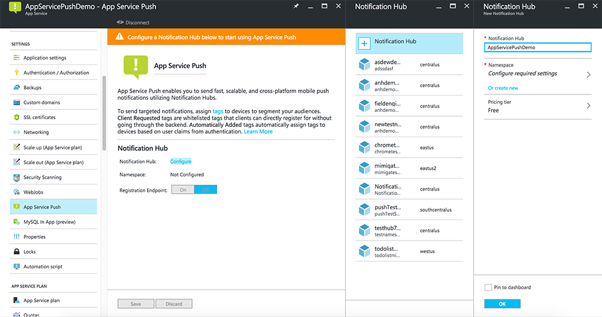

Servizio di App App per dispositivi mobili utilizza [Hub di notifica] per l'invio inserisce in modo che si configurando un hub di notifica per l'app per dispositivi mobili.

1. Nel [Portale di Azure], passare a **Sfoglia** > **Servizi App**, quindi fare clic sul back-end app. In **Impostazioni**, fare clic su **App Push di servizio**.

2. Fare clic su **Configura** per configurare un hub di notifica. È possibile creare un hub o connettersi a uno esistente.

    

A questo punto si è connessi un hub di notifica il back-end App Mobile. In un secondo momento si configura questo hub di notifica per connettersi a un sistema di notifica di piattaforma (PNS) per inviare ai dispositivi.

[Portale di Azure]: https://portal.azure.com/
[Hub di notifica]: https://azure.microsoft.com/en-us/documentation/articles/notification-hubs-push-notification-overview/