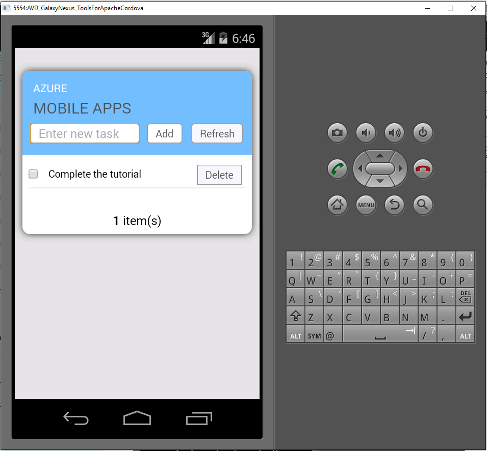

1. Visitare il [portale di Azure]. Fare clic su **Esplora tutto** > **App Mobile** > back-end appena creata. Le impostazioni di app per dispositivi mobili, fare clic su **Guida introduttiva** > **Cordova**. In **Configura l'applicazione client**, selezionare **Crea una nuova App**e quindi fare clic su **Scarica**. Consente di scaricare il progetto Cordova per un'app preconfigurato per connettere il back-end.

2. Decomprimere il file ZIP scaricato in una directory sul disco rigido, passare al file della soluzione (sln) e aprirlo in Visual Studio.

5. In Visual Studio, scegliere la piattaforma soluzione (Android o iOS Windows) dall'elenco a discesa accanto a freccia start, quindi selezionare un dispositivo di distribuzione o emulatore facendo clic sul menu a discesa sulla freccia verde. Si noti che è possibile utilizzare la piattaforma Android predefinita e increspatura emulatore. Esercitazioni più avanzate verranno richiesto di selezionare un dispositivo supportato o emulatore. 

6. Premere F5 o fare clic sulla freccia verde per creare ed ed eseguire l'app Cordova. Se viene visualizzata una finestra di dialogo protezione nell'emulatore che richiede l'accesso alla rete, accettarla.   

7. Dopo l'avvio dell'app nel dispositivo o emulatore, digitare significativo **Immettere il nuovo testo**, ad esempio _completata l'esercitazione_ , quindi fare clic sul pulsante **Aggiungi** .  
Si invia una richiesta POST nel back-end Azure distribuito in precedenza. Inserisce i back-end i dati dalla richiesta sono nella tabella TodoItem nel Database di SQL e restituisce informazioni sugli elementi appena stored tornare all'app per dispositivi mobili. App per dispositivi mobili consente di visualizzare i dati nell'elenco.

    
    
8. Ripetere i tre passaggi precedenti per ogni piattaforma del dispositivo che si intende per il supporto.

[Portale di Azure]: https://portal.azure.com/
