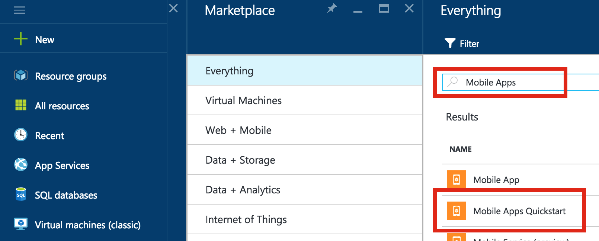

1. Accedere al [portale di Azure].

2. Fare clic su **+ Nuovo** e digitare **App Mobile** nella _ricerca di marketplace_. Selezionare **Rapida App** e fare clic su **Crea**.

    

3. Per il **Gruppo di risorse**, selezionare un gruppo di risorse esistente o crearne uno nuovo (come l'app, con lo stesso nome). 
 
4. Fare clic su **Crea**. Attendere alcuni minuti essere distribuite correttamente prima di procedere con il servizio.

<!-- URLs. -->
[Portale di Azure]: https://portal.azure.com/
