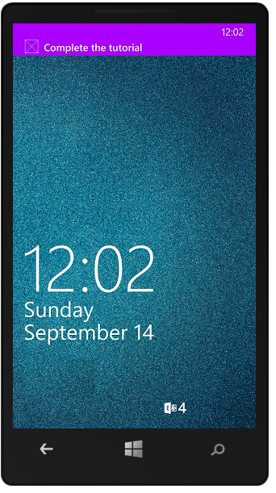

1. Fare clic sul progetto di Windows Store, fare clic su **Imposta come progetto di avvio**, quindi premere F5 per eseguire l'app di Windows Store.
    
    Dopo l'avvio dell'applicazione, il dispositivo è registrato per le notifiche push.

2. Interrompere l'app di Windows Store e ripetere il passaggio precedente per l'app Store di Windows Phone.

    A questo punto, entrambi i dispositivi sono registrati per ricevere notifiche push.

3. Rieseguire l'app di Windows Store e digitare testo in cui **inserire un TodoItem**e quindi fare clic su **Salva**.

    Si noti che dopo avere completato l'inserimento, Windows Store e le app di Windows Phone riceveranno una notifica push da WNS. La notifica viene visualizzata nel Windows Phone anche se l'app non è in esecuzione.

    

