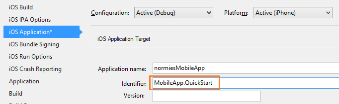

####Configurazione del progetto iOS in Xamarin Studio

1. In Xamarin.Studio, aprire **Info.plist**e aggiornare l' **Identificatore di aggregazione** con l'ID di gruppo creato in precedenza con il nuovo ID di App.

    

2. Scorrere fino a **Modalità di sfondo** e selezionare la casella **Abilita modalità di sfondo** e la casella di **notifiche Remote** . 

    

3. Fare doppio clic sul progetto nel Pannello di soluzioni per aprire **Opzioni di Project**.

4.  Scegliere **iOS Bundle accesso** in **Crea**e selezionare il **profilo di Provisioning** appena configurato per il progetto e i corrispondenti **identità** . 

    

    In questo modo che verrà utilizzato il nuovo profilo per la firma del codice. Per il dispositivo Xamarin ufficiale documentazione di provisioning, vedere [Provisioning dispositivo Xamarin].

####Configurare il progetto di iOS in Visual Studio

1. In Visual Studio, fare clic sul progetto e quindi fare clic su **proprietà**.

2. Nelle pagine delle proprietà fare clic sulla scheda **iOS applicazione** e aggiornare l' **identificatore** con l'ID creata in precedenza.

    

3. Nella scheda **iOS Bundle firma** , selezionare il **profilo di Provisioning** appena configurato per il progetto e i corrispondenti **identità** . 

    

    In questo modo che verrà utilizzato il nuovo profilo per la firma del codice. Per il dispositivo Xamarin ufficiale documentazione di provisioning, vedere [Xamarin Provisioning di dispositivo].

4. Fare doppio clic su Info.plist per aprirla e quindi attivare **RemoteNotifications** in modalità di sfondo. 

[Dispositivo Xamarin il Provisioning]: http://developer.xamarin.com/guides/ios/getting_started/installation/device_provisioning/